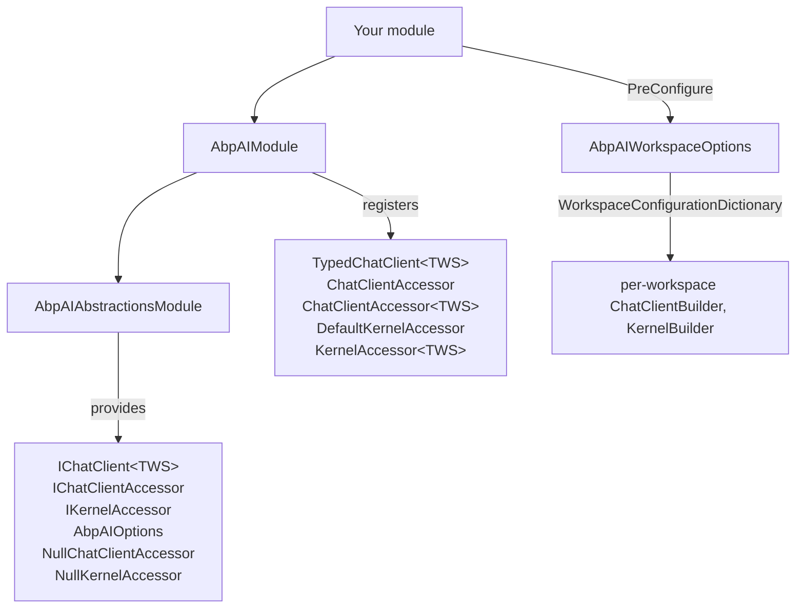
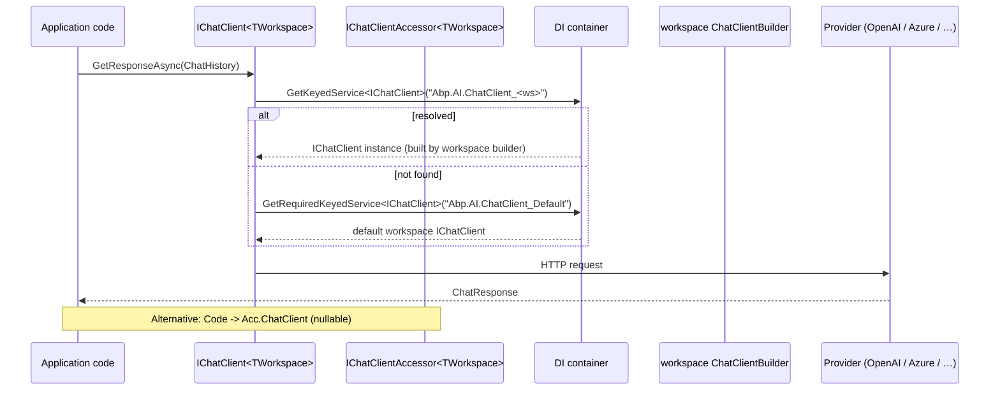

The ABP Framework `Volo.Abp.AI` and `Volo.Abp.AI.Abstractions` packages connect ABP modules to Microsoft's official AI SDKs — [`Microsoft.Extensions.AI`](https://learn.microsoft.com/dotnet/ai/microsoft-extensions-ai) (the `IChatClient` abstraction) and [Microsoft Semantic Kernel](https://learn.microsoft.com/semantic-kernel/) — without locking the consumer to a specific provider (OpenAI, Azure OpenAI, Anthropic, Ollama, …). The integration is built around the **workspace** concept: each named workspace owns its own `ChatClientBuilder` / `IKernelBuilder` configuration, and consumers resolve clients by injecting `IChatClient<TWorkSpace>` or `IChatClientAccessor<TWorkSpace>`.

## Package map

```
Volo.Abp.AI.Abstractions          ← interfaces, options, null accessors
└── Volo.Abp.AI                   ← module, default accessors, builder lists
```

| Concern | Abstractions | Core |
| --- | --- | --- |
| Module | `AbpAIAbstractionsModule` (no deps) | `AbpAIModule` `[DependsOn(typeof(AbpAIAbstractionsModule))]` |
| Options | `AbpAIOptions` (`HashSet<string> ConfiguredWorkspaceNames`) | `AbpAIWorkspaceOptions` (pre-configured, holds `WorkspaceConfigurationDictionary`) |
| Chat client | `IChatClient<TWorkSpace>`, `IChatClientAccessor`, `IChatClientAccessor<TWorkSpace>` | `TypedChatClient<TWorkSpace>`, `ChatClientAccessor`, `ChatClientAccessor<TWorkSpace>` |
| Kernel | `IKernelAccessor`, `IKernelAccessor<TWorkSpace>` | `DefaultKernelAccessor`, `KernelAccessor<TWorkSpace>` |
| Null fallbacks | `NullChatClientAccessor`, `NullKernelAccessor` | (none needed) |
| Workspace identification | `WorkspaceNameAttribute` | — |

All accessors and the `TypedChatClient` resolve a keyed service from the DI container using two key prefixes defined in `AbpAIWorkspaceOptions`:

```csharp
public const string ChatClientServiceKeyNamePrefix = "Abp.AI.ChatClient_";
public const string KernelServiceKeyNamePrefix     = "Abp.AI.Kernel_";

public static string GetChatClientServiceKeyName(string name) => $"{ChatClientServiceKeyNamePrefix}{name}";
public static string GetKernelServiceKeyName(string name)     => $"{KernelServiceKeyNamePrefix}{name}";
```

(`framework/src/Volo.Abp.AI/Volo/Abp/AI/AbpAIWorkspaceOptions.cs`)

## Module dependency chain



## Workspaces

A workspace is just a string name. The default name is the constant `AbpAIModule.DefaultWorkspaceName = "Default"`. Custom workspaces are introduced by marker types (POCOs) decorated with `[WorkspaceName("custom-name")]`:

```csharp
[WorkspaceName("Compliance")]
public class ComplianceWorkspace { }

[WorkspaceName("Marketing")]
public class MarketingWorkspace { }
```

`WorkspaceNameAttribute.GetWorkspaceName<TWorkspace>()` (`framework/src/Volo.Abp.AI.Abstractions/Volo/Abp/AI/WorkspaceNameAttribute.cs`) caches the lookup per `Type` via a `ConcurrentDictionary<Type, string>`. If the type does not carry the attribute, the fully-qualified `Type.FullName` becomes the workspace name.

## Configuring workspaces

`AbpAIWorkspaceOptions` is **pre-configured**, not bound through the standard `IOptions<>` pipeline. Use `PreConfigure<AbpAIWorkspaceOptions>` from the host module:

```csharp
[DependsOn(typeof(AbpAIModule))]
public class MyAppModule : AbpModule
{
    public override void PreConfigureServices(ServiceConfigurationContext ctx)
    {
        PreConfigure<AbpAIWorkspaceOptions>(opt =>
        {
            opt.Workspaces.ConfigureDefault(ws =>
            {
                ws.ConfigureChatClient(c => c.Builder =
                    new ChatClientBuilder(new OpenAIClient(key).GetChatClient("gpt-4o").AsIChatClient()));
            });

            opt.Workspaces.Configure<ComplianceWorkspace>(ws =>
            {
                ws.ConfigureChatClient(c => c.Builder =
                    new ChatClientBuilder(new AzureOpenAIClient(azureKey).GetChatClient("gpt-4-mini").AsIChatClient()));
            });
        });
    }
}
```

`WorkspaceConfigurationDictionary` (`framework/src/Volo.Abp.AI/Volo/Abp/AI/WorkspaceConfigurationDictionary.cs`) offers three configure overloads — `Configure<TWorkspace>(...)`, `Configure(string name, ...)` and `ConfigureDefault(...)`. Each lazily creates a `WorkspaceConfiguration` keyed by name.

`WorkspaceConfiguration` (`WorkspaceConfiguration.cs`) carries a `ChatClientConfiguration` and a `KernelConfiguration`, each with a `Builder` slot (`ChatClientBuilder?` / `IKernelBuilder?`) and a `BuilderConfigurers` list. Call `ws.ConfigureChatClient(c => ...)` or `ws.ConfigureKernel(k => ...)` to populate them.

## AbpAIModule registration logic

`AbpAIModule.ConfigureServices` (`framework/src/Volo.Abp.AI/Volo/Abp/AI/AbpAIModule.cs`) walks the configured workspaces and registers two **keyed** transient services per workspace:

1. **Keyed `IChatClient`** under the key `Abp.AI.ChatClient_<name>` — built by `workspaceConfig.ChatClient.Builder.Build(provider)`. The `Build` is wired through `services.AddKeyedChatClient(serviceName, provider => ..., ServiceLifetime.Transient)`.
2. **Keyed `Kernel`** under the key `Abp.AI.Kernel_<name>` — built by `workspaceConfig.Kernel.Builder!.Build()`.

When `workspaceConfig.Name == "Default"`, two **non-keyed** registrations are added on top, both resolving to the keyed `Default` ones — so injecting `IChatClient` or `Kernel` directly gives the default workspace's instance.

There are also two cross-wiring fallbacks:

- If a workspace defines a `Kernel.Builder` but no `ChatClient.Builder`, the module registers a keyed `IChatClient` that asks the keyed `Kernel` for its `GetRequiredService<IChatClient>()`. So the chat client is shared with the kernel's services.
- If a workspace defines a `ChatClient.Builder` but no `Kernel.Builder`, the module registers a keyed `Kernel` that wraps the chat client in a fresh `Kernel.CreateBuilder()` and registers the client as a singleton on the kernel.

This means defining either side gives you both.

The module also registers the typed accessors:

```csharp
context.Services.TryAddTransient(typeof(IChatClient<>), typeof(TypedChatClient<>));
context.Services.TryAddTransient(typeof(IChatClientAccessor<>), typeof(ChatClientAccessor<>));
context.Services.TryAddTransient(typeof(IKernelAccessor<>), typeof(KernelAccessor<>));
```

## Chat call flow



The accessor approach (`IChatClientAccessor<TWorkspace>`) returns a nullable `IChatClient` — useful when AI is optional and your code must degrade gracefully. The typed-client approach (`IChatClient<TWorkspace>`) wraps the underlying client in a `DelegatingChatClient` and throws if no client is available (because the constructor calls `GetRequiredKeyedService<IChatClient>(...)` as the fallback). Use one or the other based on whether AI is mandatory in your flow.

## Choosing what to inject

| Need | Inject |
| --- | --- |
| Default workspace, required | `IChatClient` |
| Default workspace, optional | `IChatClientAccessor` |
| Named workspace, required | `IChatClient<MyWorkspace>` |
| Named workspace, optional | `IChatClientAccessor<MyWorkspace>` |
| Default workspace, Semantic Kernel | `Kernel` |
| Default workspace, Semantic Kernel optional | `IKernelAccessor` |
| Named workspace, Semantic Kernel | `Kernel` (keyed) or write a typed accessor wrapper |
| Named workspace, Semantic Kernel optional | `IKernelAccessor<MyWorkspace>` |

When AI is not configured at all (the typical out-of-the-box state), `NullChatClientAccessor` and `NullKernelAccessor` are registered with `[Dependency(TryRegister = true)]` and both expose a `null` property — see `framework/src/Volo.Abp.AI.Abstractions/Volo/Abp/AI/NullChatClientAccessor.cs` and `NullKernelAccessor.cs`.

## AbpAIOptions

`AbpAIOptions` (`framework/src/Volo.Abp.AI.Abstractions/Volo/Abp/AI/AbpAIOptions.cs`) tracks which workspace names were actually configured during startup:

```csharp
public class AbpAIOptions
{
    public HashSet<string> ConfiguredWorkspaceNames { get; } = new();
}
```

`AbpAIModule.ConfigureServices` populates it from `AbpAIWorkspaceOptions.Workspaces.Keys`. Inject `IOptions<AbpAIOptions>` from feature modules that need to enumerate available workspaces — for example to surface them in an admin UI.

## NamedActionList helpers

`BuilderConfigurerList` (`framework/src/Volo.Abp.AI/Volo/Abp/AI/BuilderConfigurerList.cs`) and `KernelBuilderConfigurerList` (`KernelBuilderConfigurerList.cs`) inherit from `NamedActionList<>` so you can register named configurers that are deduplicated by name. Useful when several modules want to contribute middleware to the same workspace:

```csharp
ws.ConfigureChatClient(c => c.ConfigureBuilder("logging", b => b.UseLogging()));
ws.ConfigureChatClient(c => c.ConfigureBuilder("logging", b => b.UseOtherLogging())); // overrides "logging"
```

`AbpAIModule.ConfigureChatClient` later iterates `workspaceConfig.ChatClient.BuilderConfigurers` and invokes each `Action<ChatClientBuilder>` on the `Builder` before building the final `IChatClient`.

## Replacing the default chat client

Because `IChatClient` is registered as a transient (via `AddKeyedChatClient`), replace it by registering a different builder for the `Default` workspace. There is no `ReplaceServices` plumbing — just call `Workspaces.ConfigureDefault(...)` in `PreConfigureServices`.

## Composing with Semantic Kernel

If a workspace only configures a `Kernel.Builder`, the module synthesizes the chat client from the kernel via `Kernel.GetRequiredService<IChatClient>()`. The reverse — configure only a chat client and the module synthesizes a kernel — is also supported. Use this when one part of the app wants Semantic Kernel features (plugins, planners) and another part is happy with the raw `IChatClient`.

## When to use what

- **Single OpenAI key, single model.** Configure only the default workspace and inject `IChatClient` everywhere.
- **Different keys for staging vs production.** Configure two workspaces, swap workspaces at composition time based on environment.
- **Different providers per feature.** Define one workspace per feature (`SearchWorkspace`, `SummarizationWorkspace`) and inject `IChatClient<TFeatureWorkspace>`.
- **Optional AI in shared libraries.** Use `IChatClientAccessor` / `IChatClientAccessor<T>` so the code degrades gracefully when no provider is wired.

## Reference

| Type | File |
| --- | --- |
| `AbpAIAbstractionsModule` | `framework/src/Volo.Abp.AI.Abstractions/Volo/Abp/AI/AbpAIAbstractionsModule.cs` |
| `AbpAIModule` | `framework/src/Volo.Abp.AI/Volo/Abp/AI/AbpAIModule.cs` |
| `AbpAIOptions` | `framework/src/Volo.Abp.AI.Abstractions/Volo/Abp/AI/AbpAIOptions.cs` |
| `AbpAIWorkspaceOptions` | `framework/src/Volo.Abp.AI/Volo/Abp/AI/AbpAIWorkspaceOptions.cs` |
| `WorkspaceConfiguration` / `WorkspaceConfigurationDictionary` | `framework/src/Volo.Abp.AI/Volo/Abp/AI/WorkspaceConfiguration.cs`, `WorkspaceConfigurationDictionary.cs` |
| `WorkspaceNameAttribute` | `framework/src/Volo.Abp.AI.Abstractions/Volo/Abp/AI/WorkspaceNameAttribute.cs` |
| `IChatClient<TWS>` | `framework/src/Volo.Abp.AI.Abstractions/Volo/Abp/AI/IChatClient.cs` |
| `IChatClientAccessor` / `IChatClientAccessor<TWS>` | `framework/src/Volo.Abp.AI.Abstractions/Volo/Abp/AI/IChatClientAccessor.cs` |
| `IKernelAccessor` / `IKernelAccessor<TWS>` | `framework/src/Volo.Abp.AI.Abstractions/Volo/Abp/AI/IKernelAccessor.cs` |
| `TypedChatClient<TWS>` | `framework/src/Volo.Abp.AI/Volo/Abp/AI/TypedChatClient.cs` |
| `ChatClientAccessor` / `ChatClientAccessor<TWS>` | `framework/src/Volo.Abp.AI/Volo/Abp/AI/ChatClientAccessor.cs` |
| `DefaultKernelAccessor` / `KernelAccessor<TWS>` | `framework/src/Volo.Abp.AI/Volo/Abp/AI/DefaultKernelAccessor.cs`, `KernelAccessor.cs` |
