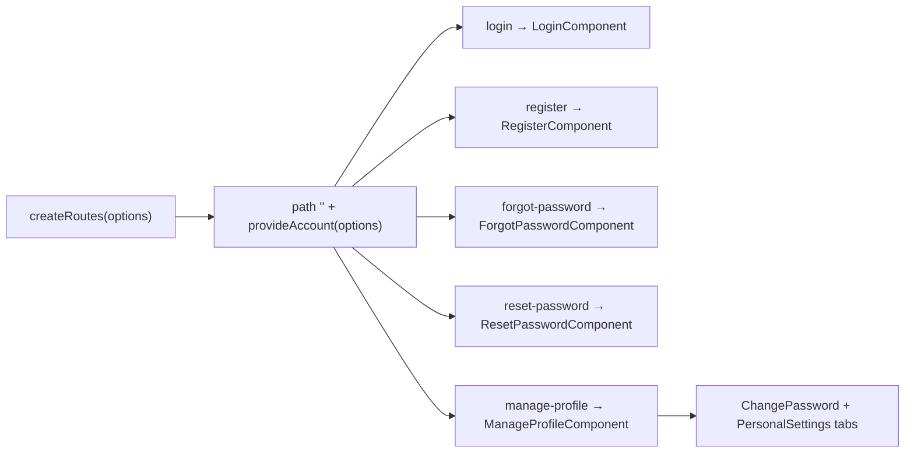
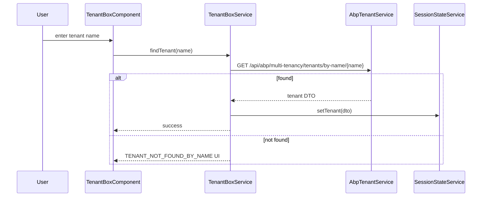

`@abp/ng.account` (with the companion `@abp/ng.account.core`) hosts the user-facing authentication and self-service screens for ABP Framework Angular applications. It covers login, registration, the forgot/reset password flow, profile management, password change, and the personal settings tab consumed by the manage-profile page. The sources live at `npm/ng-packs/packages/account/` and `npm/ng-packs/packages/account-core/`.

## Two packages, one feature

`npm/ng-packs/packages/account-core/package.json` ships `@abp/ng.account.core` — the pure services required by every theme to render account screens. `npm/ng-packs/packages/account/package.json` ships `@abp/ng.account` — the default Bootstrap implementation. Themes that render different markup (for example `@abp/ng.theme.lepton-x`) depend on `@abp/ng.account.core` only.

`npm/ng-packs/packages/account-core/src/public-api.ts` re-exports exactly two services:

```ts
export * from './lib/auth-wrapper.service';
export * from './lib/tenant-box.service';
```

- `AuthWrapperService` (`npm/ng-packs/packages/account-core/src/lib/auth-wrapper.service.ts`) controls whether the side-by-side branding panel and the tenant selector are visible for the current route.
- `TenantBoxService` (`npm/ng-packs/packages/account-core/src/lib/tenant-box.service.ts`) wraps the multi-tenancy detection API (`AbpTenantService` from `@abp/ng.core`) to support tenant switching from the login screen.

## Account package folder map

`npm/ng-packs/packages/account/src/lib/`:

| Folder | Contents |
| --- | --- |
| `components/login/` | `LoginComponent`. |
| `components/register/` | `RegisterComponent`. |
| `components/forgot-password/` | `ForgotPasswordComponent`. |
| `components/reset-password/` | `ResetPasswordComponent`. |
| `components/manage-profile/` | `ManageProfileComponent` (the tabbed profile shell). |
| `components/change-password/` | `ChangePasswordComponent` (one tab of manage profile). |
| `components/personal-settings/` | `PersonalSettingsComponent` (another tab). |
| `defaults/` | Default form/entity prop contributors for the personal settings tab. |
| `enums/components.ts` | `eAccountComponents` — replaceable component keys. |
| `guards/` | `authenticationFlowGuard` — applied to most routes to bounce already-authenticated users to the home page. |
| `models/` | `AccountConfigOptions`, internal types. |
| `resolvers/` | `accountExtensionsResolver` for contributor registration. |
| `services/` | Helpers consumed by the components. |
| `tokens/` | `ACCOUNT_CONFIG_OPTIONS`, `ACCOUNT_EDIT_FORM_PROP_CONTRIBUTORS`, `RE_LOGIN_CONFIRMATION_TOKEN`. |
| `utils/` | `accountConfigOptionsFactory`. |
| `account.routes.ts` | The `createRoutes(options)` factory. |
| `account-routing.module.ts` + `account.module.ts` | Legacy NgModule glue. |

There are two `ng-package.json` files: the root `npm/ng-packs/packages/account/ng-package.json` defines the main entry point, and `npm/ng-packs/packages/account/config/ng-package.json` exposes the `@abp/ng.account/config` secondary entry for Suite-generated default options.

## Route shape

`npm/ng-packs/packages/account/src/lib/account.routes.ts` exports `provideAccount(options)` (binding the contributor tokens) and `createRoutes(options)`:

| Path | Component | Replaceable key |
| --- | --- | --- |
| `''` → `login` | redirect | — |
| `login` | `LoginComponent` | `eAccountComponents.Login` |
| `register` | `RegisterComponent` | `eAccountComponents.Register` |
| `forgot-password` | `ForgotPasswordComponent` | `eAccountComponents.ForgotPassword` |
| `reset-password` | `ResetPasswordComponent` | `eAccountComponents.ResetPassword` |
| `manage-profile` | `ManageProfileComponent` | `eAccountComponents.ManageProfile` |

The first four use `canActivate: [authenticationFlowGuard]` so that already-authenticated visitors are redirected; `reset-password` skips the guard and disables the tenant box via route data `tenantBoxVisible: false`. `manage-profile` is wrapped in `authGuard` and shown only after login.



## provideAccount and tokens

The `provideAccount` helper inside `account.routes.ts` binds:

- `ACCOUNT_CONFIG_OPTIONS` — the raw `AccountConfigOptions` object.
- `ACCOUNT_OPTIONS` — the factory-produced options object via `accountConfigOptionsFactory`.
- `RE_LOGIN_CONFIRMATION_TOKEN` — defaults to `true`; controls the "are you sure?" prompt after personal-settings changes.
- `ACCOUNT_EDIT_FORM_PROP_CONTRIBUTORS` — contributors injected into the personal-settings form.

## Component highlights

### LoginComponent

`npm/ng-packs/packages/account/src/lib/components/login/login.component.ts` consumes the abstract `AuthService` from `@abp/ng.core` (replaced by `AbpOAuthService` from `@abp/ng.oauth`). When `AuthService.isInternalAuth === true` (password flow), the component renders a username/password form; otherwise it kicks off the OIDC code flow via `AuthService.navigateToLogin()`.

### RegisterComponent

`register.component.ts` posts to the generated `AccountAppService` from `@abp/ng.account/proxy` (lives under the proxy folder). It honours the `isSelfRegistrationEnabled` setting fetched from `ConfigStateService`.

### ForgotPasswordComponent and ResetPasswordComponent

`forgot-password.component.ts` and `reset-password.component.ts` follow the ABP server's token-based reset flow, dispatching `AccountAppService.sendPasswordResetCodeAsync` and `resetPasswordAsync` respectively.

### ManageProfileComponent

`manage-profile.component.ts` renders a tabbed shell that hosts `ChangePasswordComponent` and `PersonalSettingsComponent`. The selected tab is driven by `RE_LOGIN_CONFIRMATION_TOKEN` so users are warned when changing personal data triggers a re-login.

### ChangePasswordComponent and PersonalSettingsComponent

- `change-password.component.ts` calls `ProfileService.changePassword` and uses `requiredValidator`, `stringLengthValidator` from `@abp/ng.core/validators`.
- `personal-settings.component.ts` is built from the contributors registered in `ACCOUNT_EDIT_FORM_PROP_CONTRIBUTORS`, then assembled with `ExtensibleFormComponent` from `@abp/ng.components/extensible`. The defaults are defined in `npm/ng-packs/packages/account/src/lib/defaults/`.

## Tenant box flow

When the user opens the login or register page in a multi-tenant deployment, the `AccountLayoutComponent` (from `@abp/ng.theme.basic`) renders `TenantBoxComponent`. That component calls `TenantBoxService.findTenant(name)` which in turn invokes `AbpTenantService.findTenantByName` (a proxy under `@abp/ng.core`). On success it updates `SessionStateService.setTenant(...)` and refreshes the application configuration. If the tenant doesn't exist, the configurable `TENANT_NOT_FOUND_BY_NAME` token from `@abp/ng.core` takes over the error UI — `@abp/ng.theme.shared` configures it through `tenantNotFoundProvider`.



## Replaceable keys

`npm/ng-packs/packages/account/src/lib/enums/components.ts` exposes:

```ts
export const enum eAccountComponents {
  Login = 'Account.LoginComponent',
  Register = 'Account.RegisterComponent',
  ForgotPassword = 'Account.ForgotPasswordComponent',
  ResetPassword = 'Account.ResetPasswordComponent',
  ManageProfile = 'Account.ManageProfileComponent',
  TenantBox = 'Account.TenantBoxComponent',
  AuthWrapper = 'Account.AuthWrapperComponent',
  ChangePassword = 'Account.ChangePasswordComponent',
  PersonalSettings = 'Account.PersonalSettingsComponent',
}
```

Use `ReplaceableComponentsService.add({ key, component })` from `@abp/ng.core` to override any of them.

## Authentication flow guard

`npm/ng-packs/packages/account/src/lib/guards/authentication-flow.guard.ts` is the gatekeeper for the `login`, `register`, `forgot-password`, and `manage-profile` routes. It reads `AuthService.isAuthenticated$` and:

- redirects authenticated visitors to the root path when they hit `login`/`register`/`forgot-password`.
- redirects anonymous visitors to `login` when they try to open `manage-profile`.

## Public API surface

`npm/ng-packs/packages/account/src/public-api.ts`:

```ts
export * from './lib/account.module';
export * from './lib/components';
export * from './lib/enums';
export * from './lib/guards';
export * from './lib/models';
export * from './lib/services';
export * from './lib/tokens';
export * from './lib/utils';
export * from './lib/resolvers';
export * from './lib/account.routes';
```

## Registering the routes

```ts
import { createRoutes as accountRoutes } from '@abp/ng.account';

export const routes: Routes = [
  {
    path: 'account',
    loadChildren: () => Promise.resolve(accountRoutes({
      isPersonalSettingsChangedConfirmationActive: false,
    })),
  },
];
```

The `AccountConfigOptions` interface in `npm/ng-packs/packages/account/src/lib/models/config-options.ts` documents every supported option, including the `editFormPropContributors` map that the personal settings form respects.

<Tip>
If you only need profile management (no login screens), import `@abp/ng.account.core` for the services and create a route that resolves directly to `ManageProfileComponent`. Replacing `eAccountComponents.Login` is the supported way to embed a third-party login UI such as a CIAM provider.
</Tip>

## Inside LoginComponent

`npm/ng-packs/packages/account/src/lib/components/login/login.component.ts` is a standalone component that injects `AuthService` from `@abp/ng.core`, `RememberMeService` from `@abp/ng.oauth` (when present), `ConfigStateService` to detect whether self-registration is enabled, and `Router` for navigation. When `AuthService.isInternalAuth === true` (Resource Owner Password Credentials), the component renders an internal form using `FormInputComponent`, `PasswordComponent`, and `FormCheckboxComponent` from `@abp/ng.theme.shared`. Otherwise it kicks off the OIDC code flow.

The reactive form uses `requiredValidator` and `stringLengthValidator` from `@abp/ng.core/validators`. Caps-lock state is reflected via `CapsLockDirective` from `@abp/ng.core`. On submit the component calls `AuthService.login({ username, password, rememberMe })` and on success navigates to the configured return URL.

## Inside RegisterComponent

`register.component.ts` posts the form to `AccountAppService.register(input)` (from `@abp/ng.account/proxy`). The default field set comes from `defaults/default-register-form-props.ts` and can be extended through contributors. The component shows the global tenant box when multi-tenancy is enabled.

## Inside ForgotPasswordComponent / ResetPasswordComponent

`forgot-password.component.ts` calls `AccountAppService.sendPasswordResetCodeAsync(email)`; `reset-password.component.ts` reads the `userId` and `resetToken` query parameters from the activation link and calls `AccountAppService.resetPasswordAsync(input)`. Both components rely on `ConfirmationService` from `@abp/ng.theme.shared` to surface success messages.

## Inside ManageProfileComponent

`manage-profile.component.ts` injects `RE_LOGIN_CONFIRMATION_TOKEN` to control whether a re-login confirmation dialog appears after personal-settings changes that affect authentication state. The component renders `ChangePasswordComponent` and `PersonalSettingsComponent` as tabs and reads the active tab from the route query parameter so deep links work.

## Inside ChangePasswordComponent

`change-password.component.ts` reads the current user from `ConfigStateService.getOne$('currentUser')` and validates the form with `stringLengthValidator`, `requiredValidator`, and a custom cross-field validator ensuring the new password matches the confirmation field. On submit it calls `ProfileService.changePassword(input)` from `@abp/ng.account/proxy`.

## Inside PersonalSettingsComponent

`personal-settings.component.ts` reads the contributors from `ACCOUNT_EDIT_FORM_PROP_CONTRIBUTORS`, merges them with the defaults from `defaults/`, and uses `generateFormFromProps` from `@abp/ng.components/extensible` to build the reactive form. After submit it calls `ProfileService.update(input)` and refreshes the application configuration via `ConfigStateService.refreshAppState()` so the new display name and avatar propagate to the navbar.

## Default form props

`npm/ng-packs/packages/account/src/lib/defaults/` declares the default form props for personal settings:

- `userName`, `email`, `name`, `surname`, `phoneNumber` — string fields with appropriate validators.
- `extraProperties` — populated from the object-extending feature when the backend declares extra fields.

Hosts can add custom props via `editFormPropContributors` or hide built-in ones using the contributor `dropByValue` helper.

## Authentication flow guard internals

`npm/ng-packs/packages/account/src/lib/guards/authentication-flow.guard.ts` reads `AuthService.isAuthenticated` synchronously where possible (cached state) and falls back to the observable form. The guard recognises four cases:

| Current state | Target route | Outcome |
| --- | --- | --- |
| Authenticated | `login`, `register`, `forgot-password` | redirect to `/` |
| Anonymous | `manage-profile` | redirect to `/account/login` |
| Anonymous | `reset-password` | allow (token-based) |
| Either | other | allow |

## Tenant box deeper dive

`npm/ng-packs/packages/account-core/src/lib/tenant-box.service.ts` exposes:

- `findTenant(name): Observable<FindTenantResultDto>` — wraps `AbpTenantService.findTenantByName` from `@abp/ng.core`'s proxy folder.
- `setTenant(tenant)` — pushes the tenant id into `SessionStateService.setTenant` and triggers `ConfigStateService.refreshAppState`.
- `tenant$: Observable<TenantInfo | null>` — current tenant derived from `SessionStateService`.

The companion `AuthWrapperService` in `npm/ng-packs/packages/account-core/src/lib/auth-wrapper.service.ts` keeps a `config$` observable describing which side panels to render — the basic theme reacts to it inside `AccountLayoutComponent`.

```mermaid
flowchart TB
    Login["LoginComponent"] --> AuthSvc["AuthService.login"]
    AuthSvc -->|password flow| Local["Internal token storage"]
    AuthSvc -->|code flow| OIDC["AuthCodeFlowStrategy.initLoginFlow"]
    Local --> Refresh[ConfigStateService.refreshAppState]
    OIDC --> Refresh
    Refresh --> Home[/]
```

## Replaceable example

```ts
import { ReplaceableComponentsService } from '@abp/ng.core';
import { eAccountComponents } from '@abp/ng.account';
import { MyLoginComponent } from './my-login.component';

inject(ReplaceableComponentsService).add({
  key: eAccountComponents.Login,
  component: MyLoginComponent,
});
```

After this call navigating to `/account/login` renders `MyLoginComponent` while reusing the surrounding `AccountLayoutComponent` from `@abp/ng.theme.basic`.

## Proxy endpoints

Account screens consume two generated services:

- `AccountAppService` — `register`, `sendPasswordResetCodeAsync`, `resetPasswordAsync`, `verifyPasswordResetTokenAsync` from `@abp/ng.account/proxy`.
- `ProfileService` — `get`, `update`, `changePassword`.

Both services live under the secondary entry point produced by the proxy schematic. The DTOs follow the standard ABP shape with localized fluent validators on the server returning structured error responses parsed by `AbpFormatErrorHandlerService`.

## Multi-tenant considerations

When multi-tenancy is enabled, the account UI surface respects three settings from the server:

- `Abp.Account.IsSelfRegistrationEnabled` toggles the register link.
- `Abp.Account.EnableLocalLogin` controls whether internal auth is shown alongside any external providers.
- `AbpTenantManagement.UseCaptchaOnLogin` — when true, a captcha widget is contributed via `editFormPropContributors`.

All three are surfaced by `ConfigStateService` and read by the components when they decide what to render.
