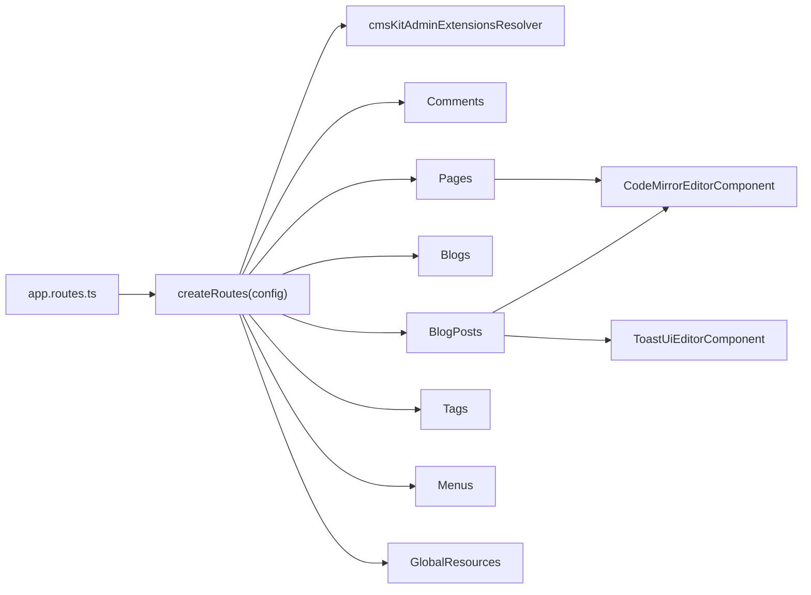
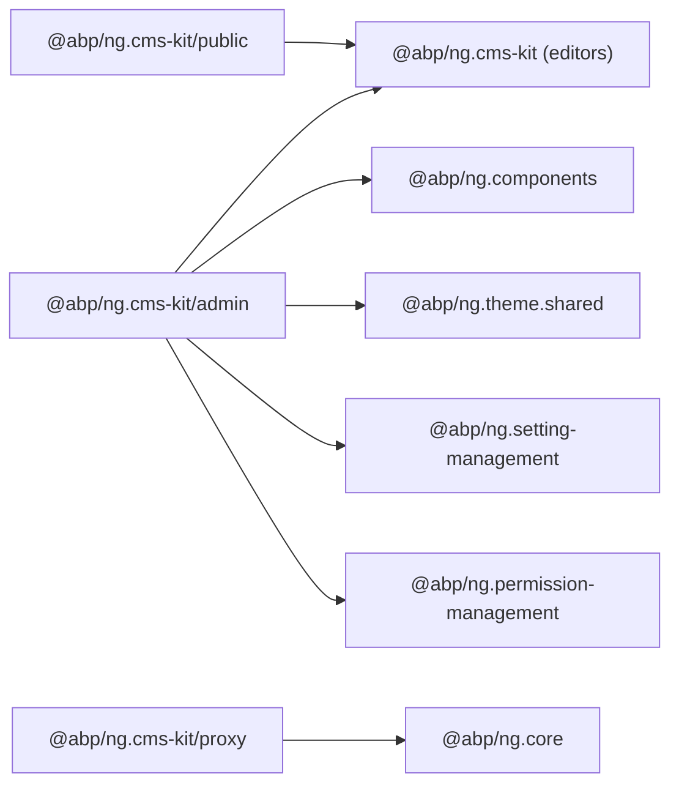
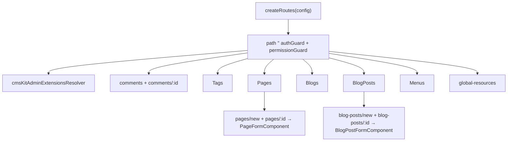

`@abp/ng.cms-kit` is the Angular UI for ABP Framework's CMS Kit module. It is intentionally split into multiple secondary entry points so that admin applications, public-facing applications, and proxy-only consumers each pull what they need without bloating their bundles. The source lives at `npm/ng-packs/packages/cms-kit/`.

## Package metadata

`npm/ng-packs/packages/cms-kit/package.json` ships `@abp/ng.cms-kit` and depends at runtime on `@abp/ng.components`, `@abp/ng.setting-management`, `@abp/ng.theme.shared`, `@toast-ui/editor`, `codemirror`, and `tslib`. The presence of `@toast-ui/editor` and `codemirror` reflects the rich-text and code editing experiences shipped under the root entry point.

## Entry points

Four `ng-package.json` files mark the four publishable subpackages:

| Folder | Import | Purpose |
| --- | --- | --- |
| `npm/ng-packs/packages/cms-kit/` | `@abp/ng.cms-kit` | Shared editors (`CodeMirrorEditorComponent`, `ToastUiEditorComponent`) and utility helpers. |
| `npm/ng-packs/packages/cms-kit/admin/` | `@abp/ng.cms-kit/admin` | Admin UI: comments, tags, pages, blogs, blog posts, menus, global resources, CMS settings. |
| `npm/ng-packs/packages/cms-kit/public/` | `@abp/ng.cms-kit/public` | Reserved surface for end-user-facing components (currently exposes models/tokens/resolvers used by hosts). |
| `npm/ng-packs/packages/cms-kit/proxy/` | `@abp/ng.cms-kit/proxy` | Generated DTOs and services for `Volo.Abp.CmsKit.HttpApi`. |

## Root entry point

`npm/ng-packs/packages/cms-kit/src/public-api.ts` re-exports the components folder and a small utility:

```ts
export * from './components';
export * from './utils';
```

The components folder contains:

- `code-mirror-editor/code-mirror-editor.component.ts` — `CodeMirrorEditorComponent` wraps CodeMirror 6 for the markdown/HTML editing used by blog posts and pages.
- `toast-ui/toastui-editor.component.ts` — `ToastUiEditorComponent` wraps `@toast-ui/editor` for the rich-text mode.

Both editors expose a `ControlValueAccessor` so they slot into reactive forms; they are imported directly by the admin form components rather than re-exported through a barrel.

## Admin entry point

`npm/ng-packs/packages/cms-kit/admin/src/public-api.ts`:

```ts
export * from './components';
export * from './defaults';
export * from './enums';
export * from './resolvers';
export * from './tokens';
export * from './cms-kit-admin.routes';
```

### Components

`npm/ng-packs/packages/cms-kit/admin/src/components/` is organised by resource:

| Folder | Components |
| --- | --- |
| `comments/` | `CommentListComponent`, `CommentDetailsComponent` — moderate comments. |
| `tags/` | `TagListComponent` — tag administration. |
| `pages/` | `PageListComponent`, `PageFormComponent` — CMS pages CRUD. |
| `blogs/` | `BlogListComponent` — blog CRUD. |
| `blog-posts/` | `BlogPostListComponent`, `BlogPostFormComponent` — blog post CRUD with rich editor. |
| `menus/` | `MenuItemListComponent` — navigation menu items. |
| `global-resources/` | `GlobalResourcesComponent` — shared resources. |
| `cms-settings/` | The CMS Kit settings tab contributed to `@abp/ng.setting-management`. |

### Routes

`npm/ng-packs/packages/cms-kit/admin/src/cms-kit-admin.routes.ts` exports `createRoutes(config)` that registers each resource under a permission-guarded path:

| Path | Component | Required policy | Replaceable key |
| --- | --- | --- | --- |
| `comments` | `CommentListComponent` | `CmsKit.Comments` | `eCmsKitAdminComponents.CommentList` |
| `comments/:id` | `CommentDetailsComponent` | inherited | `eCmsKitAdminComponents.CommentDetails` |
| `tags` | `TagListComponent` | `CmsKit.Tags.Management` (where applicable) | `eCmsKitAdminComponents.Tags` |
| `pages` | `PageListComponent` | `CmsKit.Pages` | `eCmsKitAdminComponents.Pages` |
| `pages/new`/`pages/:id` | `PageFormComponent` | inherited | `eCmsKitAdminComponents.PageForm` |
| `blogs` | `BlogListComponent` | `CmsKit.Blogs` | `eCmsKitAdminComponents.Blogs` |
| `blog-posts` | `BlogPostListComponent` | `CmsKit.BlogPosts` | `eCmsKitAdminComponents.BlogPosts` |
| `blog-posts/new`, `blog-posts/:id` | `BlogPostFormComponent` | inherited | `eCmsKitAdminComponents.BlogPostForm` |
| `menus` | `MenuItemListComponent` | `CmsKit.Menus` | `eCmsKitAdminComponents.Menus` |
| `global-resources` | `GlobalResourcesComponent` | `CmsKit.GlobalResources` (where applicable) | `eCmsKitAdminComponents.GlobalResources` |

Every route runs through `ReplaceableRouteContainerComponent` from `@abp/ng.core` and uses `cmsKitAdminExtensionsResolver` (from `resolvers/`) to register contributors with `ExtensionsService` before activation. The parent route applies `authGuard` and `permissionGuard`.

```ts
import { createRoutes as cmsAdminRoutes } from '@abp/ng.cms-kit/admin';

export const routes: Routes = [
  {
    path: 'cms-kit',
    loadChildren: () => Promise.resolve(cmsAdminRoutes()),
  },
];
```

### Replaceable component keys

`npm/ng-packs/packages/cms-kit/admin/src/enums/components.ts`:

```ts
export enum eCmsKitAdminComponents {
  CommentList = 'CmsKit.Admin.CommentList',
  CommentDetails = 'CmsKit.Admin.CommentDetails',
  Tags = 'CmsKit.Admin.Tags',
  Pages = 'CmsKit.Admin.Pages',
  PageForm = 'CmsKit.Admin.PageForm',
  Blogs = 'CmsKit.Admin.Blogs',
  BlogPosts = 'CmsKit.Admin.BlogPosts',
  BlogPostForm = 'CmsKit.Admin.BlogPostForm',
  Menus = 'CmsKit.Admin.Menus',
  GlobalResources = 'CmsKit.Admin.GlobalResources',
}
```

### Contributor tokens

The tokens declared in `npm/ng-packs/packages/cms-kit/admin/src/tokens/` mirror the identity and tenant-management modules:

- `CMS_KIT_ADMIN_ENTITY_ACTION_CONTRIBUTORS`
- `CMS_KIT_ADMIN_ENTITY_PROP_CONTRIBUTORS`
- `CMS_KIT_ADMIN_TOOLBAR_ACTION_CONTRIBUTORS`
- `CMS_KIT_ADMIN_CREATE_FORM_PROP_CONTRIBUTORS`
- `CMS_KIT_ADMIN_EDIT_FORM_PROP_CONTRIBUTORS`

The `defaults/` folder seeds each token with the out-of-the-box contributors.



## Public entry point

`npm/ng-packs/packages/cms-kit/public/src/lib/public-api.ts` exports the surface meant for hosts that render public-facing CMS content:

```ts
export * from './enums';
export * from './models';
export * from './tokens';
export * from './resolvers';
```

Specifically:

- `enums/components.ts` — replaceable keys for upcoming public components.
- `models/config-options.ts` — `CmsKitPublicConfigOptions` describing the contributor tokens.
- `tokens/extensions.token.ts` — the multi-providers for public contributors.
- `resolvers/extensions.resolver.ts` — registers contributors with `ExtensionsService`.
- `cms-kit-public.routes.ts` — the route factory consumers call from their app.

The components barrel `cms-kit/public/src/lib/components/index.ts` currently contains a `// Components will be exported here` placeholder; concrete public components ship over time and slot into the existing routes/tokens.

## Proxy entry point

`npm/ng-packs/packages/cms-kit/proxy/src/public-api.ts` re-exports from `lib/index.ts` everything under `lib/proxy/`. Internally that path is the generated tree for `Volo.Abp.CmsKit.HttpApi.Client` — DTOs and Angular services for `Pages`, `Blogs`, `BlogPosts`, `Tags`, `Comments`, `Menus`, `GlobalResources`, and the public-facing read endpoints.

## Settings tab integration

`@abp/ng.cms-kit` declares `@abp/ng.setting-management` as a direct dependency because the `cms-settings/` folder under the admin entry point contributes a tab to `SettingTabsService`. Once `createRoutes` runs once the contributors register themselves and the tab shows up under `/setting-management` automatically.

## Dependency map



## Customising the admin UI

<CardGroup cols={2}>
  <Card title="Replace a list page" icon="table">
    Provide a replacement against any of the `eCmsKitAdminComponents.*` keys with `ReplaceableComponentsService.add(...)`.
  </Card>
  <Card title="Add new columns" icon="columns">
    Inject `CMS_KIT_ADMIN_ENTITY_PROP_CONTRIBUTORS` via `createRoutes({ entityPropContributors })` and add `EntityProp<T>` entries.
  </Card>
  <Card title="Custom rich editor" icon="pen">
    Replace `ToastUiEditorComponent` in `BlogPostFormComponent` by providing a custom form contributor that renders your own editor.
  </Card>
  <Card title="Custom global resource type" icon="cubes">
    Use `GlobalResourcesComponent` as a template — register your own contributor for that page or replace the route entirely.
  </Card>
</CardGroup>

<Tip>
The two editors at the root entry point (`CodeMirrorEditorComponent` and `ToastUiEditorComponent`) are not just admin internals — they are exposed precisely so other ABP modules and custom apps can reuse them with a single `import` from `@abp/ng.cms-kit`.
</Tip>

## CodeMirrorEditorComponent

`npm/ng-packs/packages/cms-kit/src/components/code-mirror-editor/code-mirror-editor.component.ts` wraps CodeMirror 6 for the markdown editor used in pages and blog posts. It implements `ControlValueAccessor` so the editor slots into reactive forms with `[formControlName]` directly. Inputs cover the language (`markdown`, `html`, `javascript`), theme, line numbers, read-only mode, and auto-focus. The component owns the CodeMirror `EditorState`/`EditorView` lifecycle to make sure it tears down cleanly on destroy.

## ToastUiEditorComponent

`npm/ng-packs/packages/cms-kit/src/components/toast-ui/toastui-editor.component.ts` wraps `@toast-ui/editor` for the rich-text mode. It also implements `ControlValueAccessor`, integrates with the form validation pipeline, and exposes inputs for the height, hide-mode-switch, initial mode, and plugins. The component watches reactive form `disabled` state and toggles the editor accordingly.

## Admin routes details

`npm/ng-packs/packages/cms-kit/admin/src/cms-kit-admin.routes.ts` defines a parent route with `canActivate: [authGuard, permissionGuard]`, `resolve: { extensions: cmsKitAdminExtensionsResolver }`, and child routes per resource. Each child uses `ReplaceableRouteContainerComponent` with the matching `eCmsKitAdminComponents` key. The `provideCmsKitAdminContributors(config)` helper inside the routes file binds the contributor maps to their tokens.



## PageFormComponent and BlogPostFormComponent

`PageFormComponent` and `BlogPostFormComponent` are the most editor-heavy components in the admin entry point. They embed `CodeMirrorEditorComponent` for the markdown body, `ToastUiEditorComponent` for the rich-text body (depending on the user's preference), `LookupSearchComponent` from `@abp/ng.components/lookup` for tag selection, and rely on `ExtensibleFormComponent` from `@abp/ng.components/extensible` for any contributor-defined metadata fields.

The blog post form uses `BlogService.getList()` (from `@abp/ng.cms-kit/proxy`) to populate the parent blog selector, then `BlogPostService.create()` / `update()` to persist changes. Tags are managed via `BlogPostService.setTags(id, tags)`.

## Comments admin

`CommentListComponent` and `CommentDetailsComponent` (`npm/ng-packs/packages/cms-kit/admin/src/components/comments/`) implement the moderation workflow: list comments with filters by entity type, drill into a single comment, approve or delete, and manage replies. The components use `CommentService` from `@abp/ng.cms-kit/proxy`.

## Menus admin

`MenuItemListComponent` (`npm/ng-packs/packages/cms-kit/admin/src/components/menus/`) lists `MenuItemDto` instances and supports drag-and-drop ordering through `@swimlane/ngx-datatable` integration provided by `@abp/ng.theme.shared`. The component uses `MenuItemService` from `@abp/ng.cms-kit/proxy`.

## Settings tab

`npm/ng-packs/packages/cms-kit/admin/src/components/cms-settings/` contributes a tab to `SettingTabsService` from `@abp/ng.setting-management/config`. The tab renders a form that maps to the `CmsKit` setting group on the server side. The registration happens inside `provideCmsKitAdminContributors` so the tab appears as soon as the admin routes are bootstrapped.

## Generated proxy details

`npm/ng-packs/packages/cms-kit/proxy/src/lib/proxy/` mirrors the C# namespace `Volo.Abp.CmsKit.HttpApi.Client`. Highlights:

- `PageAdminService`, `BlogAdminService`, `BlogPostAdminService`, `MenuItemAdminService`, `TagAdminService`, `CommentAdminService`, `GlobalResourceAdminService` for the admin endpoints.
- `PagePublicService`, `BlogPostPublicService`, `MenuItemPublicService` for the public-facing endpoints.
- DTOs for each resource (e.g. `PageDto`, `PageCreateDto`, `PageUpdateDto`, `BlogPostDto`, `MenuItemDto`).

The lock file `npm/ng-packs/packages/cms-kit/proxy/generate-proxy.json` (if present) records the last generation parameters.

## Replaceable component example

```ts
import { ReplaceableComponentsService } from '@abp/ng.core';
import { eCmsKitAdminComponents } from '@abp/ng.cms-kit/admin';
import { MyBlogPostFormComponent } from './my-blog-post-form.component';

inject(ReplaceableComponentsService).add({
  key: eCmsKitAdminComponents.BlogPostForm,
  component: MyBlogPostFormComponent,
});
```

After this call the router renders `MyBlogPostFormComponent` instead of the bundled form whenever the user opens `blog-posts/new` or `blog-posts/:id`.

## Public entry point integration

A typical public ABP application registers the public CMS routes in addition to the admin routes:

```ts
import { createRoutes as cmsAdminRoutes } from '@abp/ng.cms-kit/admin';
import { createRoutes as cmsPublicRoutes } from '@abp/ng.cms-kit/public';

export const routes: Routes = [
  { path: 'cms', loadChildren: () => Promise.resolve(cmsAdminRoutes()) },
  { path: '', loadChildren: () => Promise.resolve(cmsPublicRoutes()) },
];
```

The public routes use anonymous endpoints from the proxy entry point and rely on contributor tokens defined in `npm/ng-packs/packages/cms-kit/public/src/lib/tokens/extensions.token.ts`.

## Localization

Every label rendered by CMS Kit comes from the `CmsKit` localization resource. Notable keys include `CmsKit::Pages`, `CmsKit::BlogPosts`, `CmsKit::Tags`, `CmsKit::Menus`, `CmsKit::Comments`, `CmsKit::SuccessfullySaved`. Replacing the JSON values on the server side adjusts the UI without code changes — a common need for branded deployments.
