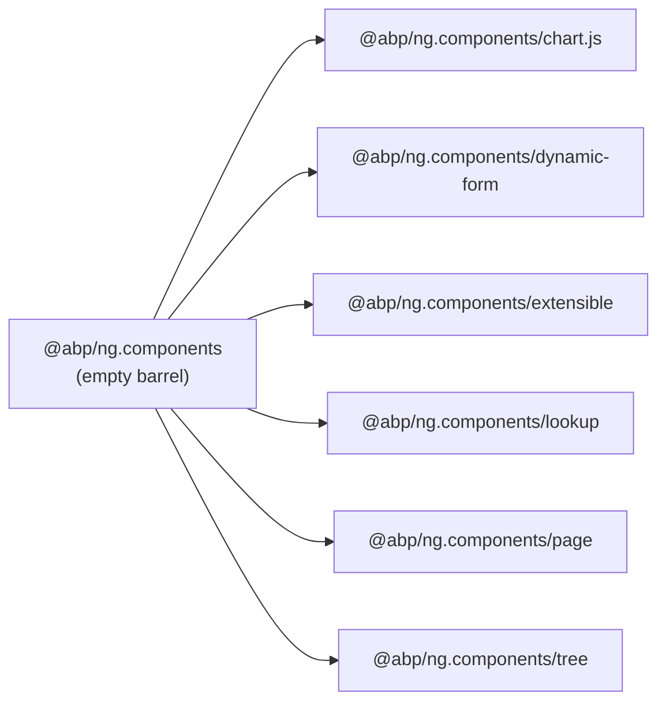
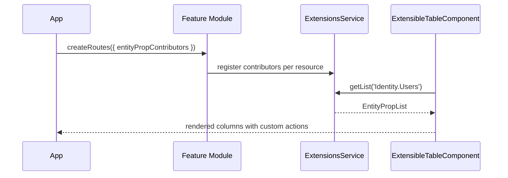
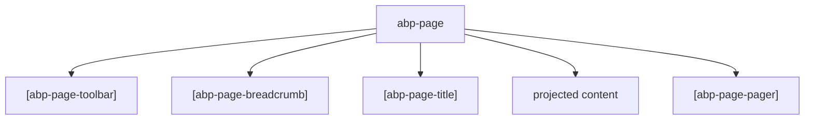

`@abp/ng.components` is the reusable UI primitives library for ABP Framework Angular projects. It lives at `npm/ng-packs/packages/components/` and ships as several **secondary entry points** so applications only pull what they import. The root `npm/ng-packs/packages/components/src/public-api.ts` is intentionally empty (`export {};`) — every public symbol comes from one of the subpackages.

## Package metadata

`npm/ng-packs/packages/components/package.json` declares the name `@abp/ng.components`, peer dependencies on `@abp/ng.core` and `@abp/ng.theme.shared`, and runtime dependencies on `chart.js`, `ng-zorro-antd`, `@ctrl/tinycolor`, and `tslib`. The peer-dependency model means a host app has to install both `@abp/ng.core` and `@abp/ng.theme.shared` at compatible versions for ng-packagr to wire the imports.

## Secondary entry points

Each subdirectory under `npm/ng-packs/packages/components/` ships its own `ng-package.json` and `public-api.ts`. The relative path becomes the import subpath:

| Folder | Import path | Role |
| --- | --- | --- |
| `chart.js/` | `@abp/ng.components/chart.js` | Chart.js wrapper for widgets. |
| `dynamic-form/` | `@abp/ng.components/dynamic-form` | Reactive Forms-based form builder. |
| `extensible/` | `@abp/ng.components/extensible` | Extensible CRUD primitives. |
| `lookup/` | `@abp/ng.components/lookup` | Async lookup search component. |
| `page/` | `@abp/ng.components/page` | Page shell with named slots. |
| `tree/` | `@abp/ng.components/tree` | Tree component built on `ng-zorro-antd`. |



## chart.js

`npm/ng-packs/packages/components/chart.js/src/public-api.ts` exposes:

- `ChartComponent` (`chart.component.ts`) — a thin wrapper around `Chart.js` that accepts a `ChartConfiguration` input and re-renders on changes; the selector is `abp-chart`.
- `ChartModule` (`chart.module.ts`) — the NgModule that declares and exports `ChartComponent` for non-standalone consumers.
- `widget-utils.ts` — colour and dataset helpers used by templates that render the dashboard widgets included in ABP Suite.

Use this entry point when you need Chart.js inside a widget contributed via the `theme-shared`'s widget API.

## dynamic-form

`npm/ng-packs/packages/components/dynamic-form/src/public-api.ts` exports the building blocks for the dynamic form engine:

- `DynamicFormComponent` (`dynamic-form.component.ts`) — top-level form host.
- `DynamicFormFieldComponent` (`dynamic-form-field/`) — renders a single field according to its descriptor.
- `DynamicFormGroupComponent` (`dynamic-form-group/`) and `DynamicFormArrayComponent` (`dynamic-form-array/`) — nested groups and arrays, with the supporting `NESTED-FORMS.md` doc.
- `DynamicFormService` (`dynamic-form.service.ts`) — the service that converts a descriptor tree into `FormGroup`s.
- `DynamicFormModels` (`dynamic-form.models.ts`) — TypeScript interfaces (`DynamicForm`, `DynamicField`, validator descriptors).

This entry point is what `@abp/ng.account` uses to render the "Personal Settings" sub-forms.

## extensible

The largest entry point. `npm/ng-packs/packages/components/extensible/src/public-api.ts` exports a long list of components, directives, models, tokens, pipes, and utilities used by ABP's "extension" system. Highlights:

<AccordionGroup>
  <Accordion title="Components" icon="screwdriver-wrench">
    `ExtensibleFormComponent` and `ExtensibleFormPropComponent` (`lib/components/extensible-form/`), `ExtensibleTableComponent` and `ExtensibleTableRowDetail` (`lib/components/extensible-table/`), `GridActionsComponent` (`lib/components/grid-actions/`), `PageToolbarComponent` (`lib/components/page-toolbar/`), `ExtensibleDateTimePickerComponent` (`lib/components/date-time-picker/`), and the multi-select primitives in `lib/components/multi-select/`.
  </Accordion>
  <Accordion title="Models" icon="cubes">
    `EntityAction`, `EntityProp`, `FormProp`, `ToolbarAction`, plus their `*List`, `*Factory`, and contributor callback types — all under `lib/models/`. The `object-extensions.ts` file declares the JSON shape returned by `AbpApplicationConfigurationService` so generated extensions get full typing.
  </Accordion>
  <Accordion title="Services and tokens" icon="key">
    `ExtensionsService` (`lib/services/extensions.service.ts`) is the central registry that contributors populate. The tokens `EXTENSIONS_IDENTIFIER` and `EXTENSIBLE_FORM_VIEW_PROVIDER` live under `lib/tokens/`.
  </Accordion>
  <Accordion title="Utilities" icon="hammer">
    `lib/utils/actions.util.ts`, `form-props.util.ts`, `props.util.ts`, `state.util.ts`, and `model.utils.ts` host the small helpers that contributors call when wiring extensions into the existing CRUD pages of identity / tenant-management / cms-kit.
  </Accordion>
</AccordionGroup>

The matching NgModule `ExtensibleModule` lives at `lib/extensible.module.ts` for non-standalone consumers.

## lookup

`npm/ng-packs/packages/components/lookup/src/public-api.ts` re-exports only `LookupSearchComponent` from `lib/lookup-search.component.ts`. The component renders an async search box that calls back into the host through `lookupFn`, and it is consumed by the identity user-role assignment dialog and tenant connection-string modals.

## page

`npm/ng-packs/packages/components/page/src/public-api.ts` exposes the page shell primitives:

- `PageComponent` (`page.component.ts`) — selector `abp-page`. Hosts a content area with slotted toolbar, breadcrumbs, and pager regions.
- `PagePartsComponent` (`page-parts.component.ts`) — assembles named "parts" via projection.
- `PagePartDirective` (`page-part.directive.ts`) — `*abpPagePart="'name'"` to register slot content.
- `PageModule` (`page.module.ts`) — NgModule that declares and exports the trio.

The feature modules (`@abp/ng.identity`, `@abp/ng.tenant-management`, `@abp/ng.cms-kit/admin`) build their list pages on top of these.

## tree

`npm/ng-packs/packages/components/tree/src/public-api.ts` exports the components that wrap `ng-zorro-antd`'s tree:

- `TreeComponent` (`lib/components/tree.component.ts`) — selector `abp-tree`, hides the underlying nz-tree configuration.
- `TreeModule` (`lib/tree.module.ts`).
- Adapter helpers in `lib/utils/nz-tree-adapter.ts` that map ABP's permission/feature tree models into the `NzTreeNode` shape.
- Template directives `tree-node-template.directive.ts` and `expanded-icon-template.directive.ts` plus the `DISABLE_TREE_STYLE_LOADING_TOKEN` defined in `lib/disable-tree-style-loading.token.ts`.

`@abp/ng.permission-management` is the primary consumer of `@abp/ng.components/tree`.

## Importing only what you need

Because each entry point is independent, an app that only renders dynamic forms can import:

```ts
import {
  DynamicFormComponent,
  DynamicFormService,
} from '@abp/ng.components/dynamic-form';
```

The Nx build pipeline (`nx run components:build` from `npm/ng-packs/packages/components/project.json`) builds every entry point in a single ng-packagr pass and emits them as separate FESM bundles under `dist/packages/components/`.

## How the extensible system fits



The contributors flow through DI tokens defined in `npm/ng-packs/packages/components/extensible/src/lib/tokens/extensions.token.ts`. Each feature module (identity, tenant-management, cms-kit) re-declares its own token (`IDENTITY_ENTITY_ACTION_CONTRIBUTORS`, etc.) and translates the values into entries in `ExtensionsService` during its resolver phase.

## Dependencies

`@abp/ng.components` peers with:

- `@abp/ng.core` for `ListService`, `TrackByService`, `SubscriptionService`, and the auth abstractions used by replaceable templates.
- `@abp/ng.theme.shared` for `ToasterService`, `ConfirmationService`, `NgxDatatableModule`, and the styled buttons used inside the extensible table and grid actions.

Runtime dependencies (`chart.js`, `ng-zorro-antd`, `@ctrl/tinycolor`) are only used by specific entry points, so tree-shaking keeps payloads small for apps that don't use those features.

<Tip>
The `extensible` entry point is where most projects spend their customization budget: contributing extra entity props, toolbar actions, and form fields without forking any UI templates. Stick to the public API surface listed in `npm/ng-packs/packages/components/extensible/src/public-api.ts` to keep upgrades smooth.
</Tip>

## Working with extensible models

`npm/ng-packs/packages/components/extensible/src/lib/models/` is where the typed contributor surface lives. Each kind of contribution has its own list class plus a factory:

- `EntityActionList` and `EntityActionsFactory` (`models/entity-actions.ts`) describe the per-row dropdown actions in a CRUD grid. Each action has a `text`, optional `icon`, `visible` predicate, and `action(data)` callback.
- `EntityPropList` and `EntityPropsFactory` (`models/entity-props.ts`) describe the grid columns rendered by `ExtensibleTableComponent`. The factories merge defaults with contributor maps using `addAfter`, `addBefore`, `addStart`, and `addEnd` helpers from `utils/state.util.ts`.
- `FormPropList` and `CreateFormPropsFactory` / `EditFormPropsFactory` (`models/form-props.ts`) describe the fields inside `ExtensibleFormComponent`. Each `FormProp` carries an `id`, `name`, `type`, validators, and an optional `options` async resolver.
- `ToolbarActionList` and `ToolbarActionsFactory` (`models/toolbar-actions.ts`) describe the buttons rendered by `PageToolbarComponent`.

The `EXTENSIONS_IDENTIFIER` token from `npm/ng-packs/packages/components/extensible/src/lib/tokens/extensions.token.ts` is what each consuming component injects to scope the list to a specific resource. Roles inject `eIdentityComponents.Roles`, blogs inject `eCmsKitAdminComponents.Blogs`, etc.

## Object extensions

`npm/ng-packs/packages/components/extensible/src/lib/models/object-extensions.ts` declares the TypeScript shapes produced by the server-side `Volo.Abp.ObjectExtending` module. When `ConfigStateService` from `@abp/ng.core` resolves the application configuration, it includes an `objectExtensions` block that the extensible package converts into the typed prop list. This is how custom server-side fields appear automatically as columns and form inputs without writing a single line of UI code.

## PageComponent slot model



`PagePartDirective` from `npm/ng-packs/packages/components/page/src/page-part.directive.ts` is the glue that lets template authors mark sections of their template as belonging to a given slot. The `PagePartsComponent` then injects them into the right region of the page chrome.

## Multi-select primitives

`npm/ng-packs/packages/components/extensible/src/lib/components/multi-select/` ships the reusable multi-select dropdown used inside the user role assignment dialog (`UsersComponent`) and the tenant edition selector. It supports asynchronous lookups, paged loading, and the same `ListService` from `@abp/ng.core` as the main grid.

## Page toolbar

`PageToolbarComponent` (`npm/ng-packs/packages/components/extensible/src/lib/components/page-toolbar/page-toolbar.component.ts`) renders the toolbar at the top of every list page. It reads contributions from `ToolbarActionList` and respects the `requiredPolicy` field so unauthorised buttons never render. The companion `GridActionsComponent` does the same for per-row actions in the grid.

## Date-time picker

`ExtensibleDateTimePickerComponent` (`npm/ng-packs/packages/components/extensible/src/lib/components/date-time-picker/extensible-date-time-picker.component.ts`) is the date/time control consumed by `FormProp<'datetime'>`. It picks a locale-aware widget through `@ng-bootstrap/ng-bootstrap` and `NgbDateParserFormatter` registered by `@abp/ng.theme.shared`.

## Reusing the lookup component

`@abp/ng.components/lookup` exposes `LookupSearchComponent` from `npm/ng-packs/packages/components/lookup/src/lib/lookup-search.component.ts`. The component accepts a `lookupFn(filter, skip, take): Observable<PagedResultDto<T>>` and a `displayFn(item): string` and renders a typeahead input. The identity user dialog uses it for role lookups; tenant management for edition lookups; CMS Kit admin for blog selection.

## Chart wrapper

`@abp/ng.components/chart.js` is intentionally minimal so that consumers can use the full Chart.js API. `ChartComponent` (`npm/ng-packs/packages/components/chart.js/src/chart.component.ts`) accepts a `[config]` input of type `ChartConfiguration` and re-renders the underlying `<canvas>` when changes are detected. `widget-utils.ts` provides helpers to translate ABP statistic DTOs into the dataset format Chart.js expects.

## Performance considerations

Because every entry point has its own `ng-package.json`, ng-packagr emits separate FESM2022 bundles under `dist/packages/components/`. The `@abp/ng.components/extensible` entry point is the largest because it carries the contributor model, the table, the form, the multi-select, and the date picker. Apps that only need the tree should import `@abp/ng.components/tree` and avoid pulling extensible into the lazy chunk.

The `ExtensionsService` is provided in `'root'` so contributor maps are global to the app. Calls that update the lists happen in route resolvers (`identityExtensionsResolver`, `tenantManagementExtensionsResolver`, etc.) so the contributor state is ready before the components activate.

## Utility helpers under extensible/utils

`npm/ng-packs/packages/components/extensible/src/lib/utils/`:

- `actions.util.ts` — small helpers for composing action visibility predicates.
- `form-props.util.ts` — converts a `FormPropList` into a `FormGroup`, evaluating async option resolvers.
- `props.util.ts` — base helpers used by `EntityPropList` and `FormPropList`.
- `state.util.ts` — the immutable list operations (`addStart`, `addBefore`, `addAfter`, `addTail`, `dropByValue`) used by every contributor callback.
- `model.utils.ts` — base classes for the typed model wrappers exposed in `models/`.

The `selfFactory` helper in `factory.util.ts` is used by `ExtensibleFormComponent` to register itself as its own `FormControlContainer`, sidestepping Angular's tree-shaking when standalone components consume reactive forms.

## EXTRA_PROPERTIES_KEY

`npm/ng-packs/packages/components/extensible/src/lib/constants/extra-properties.ts` declares the string `'extraProperties'` used by the extensible form to nest contributed extra fields under the right DTO property. This matches the server-side `IHasExtraProperties` interface from ABP's object-extending feature.

## Tree component customization

`@abp/ng.components/tree` exposes two template directives consumed by `TreeComponent`:

- `TreeNodeTemplateDirective` (`tree-node-template.directive.ts`) — overrides the rendered HTML per node.
- `ExpandedIconTemplateDirective` (`expanded-icon-template.directive.ts`) — replaces the chevron icon.

The `DISABLE_TREE_STYLE_LOADING_TOKEN` (`lib/disable-tree-style-loading.token.ts`) lets hosts skip the automatic stylesheet injection when they prefer to bundle ng-zorro styles themselves.

## Lookup signature

`LookupSearchComponent` exposes signature inputs:

```ts
lookupFn = input.required<(filter: string, skip: number, take: number) => Observable<PagedResultDto<T>>>();
displayFn = input.required<(item: T) => string>();
trackByFn = input.required<TrackByFunction<T>>();
```

`ListService` from `@abp/ng.core` is used internally to debounce changes and to paginate the results. Because the component is fully generic, the typing flows through to consumers without `any` casts.
