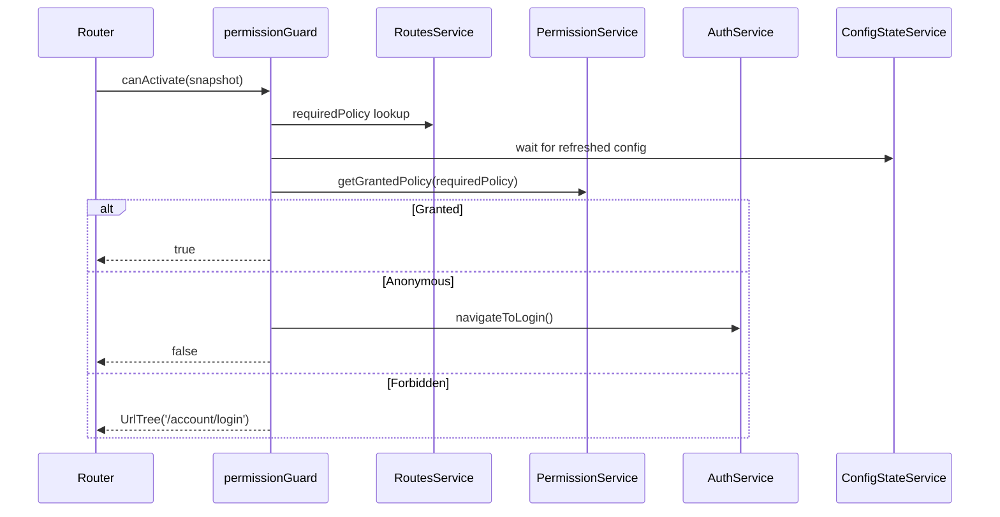

`@abp/ng.core` is the foundational Angular library for ABP Framework. Its source lives in `npm/ng-packs/packages/core/` with the entry barrel `npm/ng-packs/packages/core/src/public-api.ts`. Every other UI library — themes, feature modules, schematics-produced proxies — depends on it. The package owns the abstractions for authentication, HTTP, localization, permissions, routing, and replaceable components.

## Package metadata

`npm/ng-packs/packages/core/package.json` publishes as `@abp/ng.core` with runtime dependencies `@abp/utils`, `just-clone`, `just-compare`, `ts-toolbelt`, `tslib`, and `luxon`. Luxon is loaded by `npm/ng-packs/packages/core/src/lib/utils/date-extensions.ts` to extend `Date.prototype` with ABP-friendly helpers. The library is published under `LGPL-3.0`.

## Folder map

The `src/lib/` tree inside `npm/ng-packs/packages/core/src/lib/` is organised by Angular building block:

| Folder | Purpose |
| --- | --- |
| `abstracts/` | Auth abstractions (`auth.service.ts`, `auth.guard.ts`, `abstract-guard.ts`, `auth-error-filter.ts`) and the base `AbstractNgModelComponent`. |
| `clients/` | `ExternalHttpClient` wrapper used by `RestService` when `skipAddingHeader` is requested. |
| `components/` | `DynamicLayoutComponent`, `ReplaceableRouteContainerComponent`, `RouterOutletComponent`. |
| `constants/` | `default-layouts.ts`, `different-locales.ts`. |
| `directives/` | `autofocus`, `caps-lock`, `debounce`, `for`, `form-submit`, `init`, `permission`, `replaceable-template`, `show-password`, `stop-propagation`. |
| `guards/` | `permission.guard.ts` (and the deprecated `PermissionGuard` class). |
| `handlers/` | `routes.handler.ts` that materialises menu/route metadata at app start. |
| `interceptors/` | `api.interceptor.ts`, `timezone.interceptor.ts`, `transfer-state.interceptor.ts`. |
| `pipes/` | Date helpers, `LocalizationPipe`, `SafeHtmlPipe`, `SortPipe`, `ToInjectorPipe`, etc. |
| `providers/` | Standalone-style `provideAbpCore`, `withOptions`, `withTitleStrategy`, `withCompareFuncFactory`. |
| `proxy/` | Generated DTOs and service proxies for built-in MVC application configuration endpoints. |
| `services/` | The runtime state — `ConfigStateService`, `EnvironmentService`, `RestService`, `PermissionService`, etc. |
| `strategies/` | Container/content/projection/cross-origin strategies for lazy-loaded assets. |
| `tokens/` | InjectionTokens (`CORE_OPTIONS`, `TENANT_KEY`, `DYNAMIC_LAYOUTS_TOKEN`, `PIPE_TO_LOGIN_FN_KEY`, etc.). |
| `utils/` | Pure helpers (route trees, queue manager, localization, multi-tenancy). |
| `validators/` | Reactive form validators (`age`, `credit-card`, `range`, `required`, `string-length`, `unique-character`, `url`, `username`). |

The public surface is re-exported through `npm/ng-packs/packages/core/src/public-api.ts`, which also re-exports the most important folders inside `src/lib/proxy/` so that consumers can use the generated DTOs without referencing the internal path.

## Bootstrapping with provideAbpCore

The recommended way to bootstrap an ABP Angular app is the standalone provider function declared in `npm/ng-packs/packages/core/src/lib/providers/core-module-config.provider.ts`:

```ts
import { provideAbpCore, withOptions } from '@abp/ng.core';

bootstrapApplication(AppComponent, {
  providers: [
    provideAbpCore(
      withOptions({
        environment,
        registerLocaleFn: registerLocale(),
      }),
    ),
  ],
});
```

`provideAbpCore` returns environment providers that:

1. Register `provideHttpClient` with `withInterceptorsFromDi()`, `withXsrfConfiguration({ cookieName: 'XSRF-TOKEN', headerName: 'RequestVerificationToken' })`, `withFetch()`, plus the functional interceptors `transferStateInterceptor` and `timezoneInterceptor` from `npm/ng-packs/packages/core/src/lib/interceptors/`.
2. Register an `provideAppInitializer` that eagerly resolves `LocalizationService`, `LocalStorageListenerService`, and `RoutesHandler` so localization and menu state are ready before the first route activates.
3. Apply optional features supplied via `withOptions`, `withTitleStrategy`, and `withCompareFuncFactory`.

The legacy class form `CoreModule.forRoot(options)` defined in `npm/ng-packs/packages/core/src/lib/core.module.ts` simply delegates to the same `provideAbpCore(withOptions(options))` and is now marked `@deprecated`. Three NgModules still live in `core.module.ts`:

- `BaseCoreModule` — imports and re-exports `CommonModule`, `FormsModule`, `ReactiveFormsModule`, `RouterModule`, `NgxValidateCoreModule`, plus the core directives, pipes, and replaceable components.
- `RootCoreModule` — extends `BaseCoreModule` and configures XSRF.
- `CoreModule` — the public module, kept for backward compatibility.

## Localization module

`npm/ng-packs/packages/core/src/lib/localization.module.ts` exists only for backward compatibility — it bundles `LocalizationPipe`, `AsyncLocalizationPipe`, and `LazyLocalizationPipe` and is marked `@deprecated`. New code should import the pipes directly as standalone.

## Key services

`npm/ng-packs/packages/core/src/lib/services/` is where the SDK's behaviour lives. The most important services are:

<AccordionGroup>
  <Accordion title="ConfigStateService" icon="database">
    Defined in `npm/ng-packs/packages/core/src/lib/services/config-state.service.ts`, it owns an `InternalStore<ApplicationConfigurationDto>` (the DTO comes from `src/lib/proxy/volo/abp/asp-net-core/mvc/application-configurations/models`). It uses the generated `AbpApplicationConfigurationService` and `AbpApplicationLocalizationService` to refresh permissions, settings, features, current user, available languages, and tenant data. `setState`, `refreshAppState`, and the `getOne$`, `getDeep$`, `getSetting$` accessors are the primary API.
  </Accordion>
  <Accordion title="EnvironmentService" icon="leaf">
    `npm/ng-packs/packages/core/src/lib/services/environment.service.ts` keeps the `Environment` config (oAuthConfig, apis, application info). `getApiUrl(apiName)` is the function `RestService` calls to resolve a base URL per API name.
  </Accordion>
  <Accordion title="RestService" icon="globe">
    `npm/ng-packs/packages/core/src/lib/services/rest.service.ts` is the thin HttpClient wrapper used by every generated proxy. It picks between the regular `HttpClient` and the `ExternalHttpClient` from `src/lib/clients/http.client.ts`, fills in the configured API base URL, and forwards errors to `HttpErrorReporterService` unless `skipHandleError` is true.
  </Accordion>
  <Accordion title="HttpErrorReporterService" icon="triangle-exclamation">
    `npm/ng-packs/packages/core/src/lib/services/http-error-reporter.service.ts` exposes a `reporter$` `Subject<HttpErrorResponse>` and an `errors$` `BehaviorSubject<HttpErrorResponse[]>`. Theme packages subscribe to `reporter$` to render the global error component.
  </Accordion>
  <Accordion title="PermissionService" icon="lock">
    `npm/ng-packs/packages/core/src/lib/services/permission.service.ts` reads granted policies from `ConfigStateService` and exposes `getGrantedPolicy(key)`, `getGrantedPolicy$(key)`, `filterItemsByPolicy(items)`, and `filterItemsByPolicy$(items)` for collections that implement `ABP.HasPolicy`.
  </Accordion>
  <Accordion title="SessionStateService" icon="user">
    `npm/ng-packs/packages/core/src/lib/services/` holds it together with `MultiTenancyService`. It maintains the current language, tenant, and timezone in local storage, broadcasting changes to subscribers.
  </Accordion>
  <Accordion title="SubscriptionService" icon="rss">
    A small helper that auto-completes RxJS subscriptions when the injected component is destroyed; used heavily by `ListService` and the extensible components.
  </Accordion>
  <Accordion title="AbpApplicationConfigurationService" icon="server">
    Although technically a generated proxy under `src/lib/proxy/volo/abp/asp-net-core/mvc/application-configurations/`, this service is the SDK's bridge to the server-side `AbpApplicationConfigurationAppService`. `ConfigStateService.refreshAppState()` calls its `.get(options)` method.
  </Accordion>
</AccordionGroup>

## Interceptors

`npm/ng-packs/packages/core/src/lib/interceptors/index.ts` exports:

- `ApiInterceptor` — declared in `api.interceptor.ts`. It wires every outgoing request into `HttpWaitService` (so loaders know what is in flight) and uses `getAdditionalHeaders()` as the extension point that `@abp/ng.oauth` overrides via `OAuthApiInterceptor`.
- `timezoneInterceptor` — functional interceptor in `timezone.interceptor.ts` registered by `provideAbpCore`.
- `transferStateInterceptor` — functional interceptor in `transfer-state.interceptor.ts` for Angular Universal SSR rehydration.

## Guards

`npm/ng-packs/packages/core/src/lib/guards/permission.guard.ts` exports both the legacy `PermissionGuard` class (now marked `@deprecated`) and the functional `permissionGuard` that resolves the route's `requiredPolicy` against `PermissionService`. The companion auth guards live in `npm/ng-packs/packages/core/src/lib/abstracts/auth.guard.ts` and resolve through the abstract `AuthService` — overridden by `@abp/ng.oauth`.



## Providers index and tokens

The providers barrel `npm/ng-packs/packages/core/src/lib/providers/index.ts` re-exports `cookie-language.provider.ts`, `locale.provider.ts`, `include-localization-resources.provider.ts`, and `core-module-config.provider.ts`. The matching tokens barrel `npm/ng-packs/packages/core/src/lib/tokens/index.ts` exposes:

- `CORE_OPTIONS` — the root configuration token (defined alongside `coreOptionsFactory`).
- `TENANT_KEY` — the route/query parameter name used by multi-tenancy.
- `DYNAMIC_LAYOUTS_TOKEN` — the array of `{ name, layout }` definitions registered by theme packages.
- `OTHERS_GROUP` — fallback group title shown when toolbar items have no group.
- `PIPE_TO_LOGIN_FN_KEY` and `CHECK_AUTHENTICATION_STATE_FN_KEY` — replaced by `@abp/ng.oauth` to plug the chosen flow.
- `ROUTES`, `AbpRoutesService` — the runtime menu/route registry.
- `MANAGE_PROFILE_TOKEN`, `SET_TOKEN_RESPONSE_TO_STORAGE`, `TENANT_NOT_FOUND_BY_NAME`, `TITLE_STRATEGY_DISABLE_PROJECT_NAME`, and more.

`AbpRoutesService` (re-exported from `src/lib/services/index.ts`) is registered into the same tokens index; it stores the navigable hierarchy used by the `RoutesComponent` in `@abp/ng.theme.basic`.

## Directives

The barrel `npm/ng-packs/packages/core/src/lib/directives/index.ts` ships standalone directives:

| Directive | Purpose |
| --- | --- |
| `AutofocusDirective` (`autofocus.directive.ts`) | Sets focus after the element is created. |
| `CapsLockDirective` (`caps-lock.directive.ts`) | Emits when caps-lock state changes — wired into login. |
| `InputEventDebounceDirective` (`debounce.directive.ts`) | RxJS-debounced input events. |
| `ForDirective` (`for.directive.ts`) | Iterates over `Iterable` sources with a typed `trackBy`. |
| `FormSubmitDirective` (`form-submit.directive.ts`) | Pairs with NgxValidate to trigger global validation on submit. |
| `InitDirective` (`init.directive.ts`) | Fires once at view init — handy for one-shot initialisation. |
| `PermissionDirective` (`permission.directive.ts`) | `*abpPermission="'X'"` — structurally renders only when the policy is granted. |
| `ReplaceableTemplateDirective` (`replaceable-template.directive.ts`) | The mechanism behind ABP's "replaceable components". |
| `ShowPasswordDirective` (`show-password.directive.ts`) | Toggles a password input's type. |
| `StopPropagationDirective` (`stop-propagation.directive.ts`) | `event.stopPropagation()` helper. |

## Pipes

`npm/ng-packs/packages/core/src/lib/pipes/` exposes `LocalizationPipe`, `AsyncLocalizationPipe`, `LazyLocalizationPipe`, `SafeHtmlPipe`, `HtmlEncodePipe`, `RouteCultureUrlPipe`, `ShortDatePipe`, `ShortTimePipe`, `ShortDateTimePipe`, `SortPipe`, `ToInjectorPipe`, and `UtcToLocalPipe`. The synchronous `LocalizationPipe` resolves keys against `LocalizationService`; the async/lazy versions are needed when the resource bundle is loaded after the component is created.

## Validators

`npm/ng-packs/packages/core/src/lib/validators/index.ts` re-exports built-in reactive form validators used by the account and identity modules: `ageValidator`, `creditCardValidator`, `rangeValidator`, `requiredValidator`, `stringLengthValidator`, `uniqueCharacterValidator`, `urlValidator`, `usernameValidator`. Together with the `FormSubmitDirective`, they integrate with `@ngx-validate/core` (re-exported from `@abp/ng.core`).

## Generated proxy folder

`npm/ng-packs/packages/core/src/lib/proxy/` contains the output of the proxy generator (see `angular/schematics-and-generators`). The `README.md` inside warns that the folder is overwritten on every regeneration and that `generate-proxy.json` acts as a lock file. The `public-api.ts` of `@abp/ng.core` re-exports the most commonly used proxy subtrees so consumers do not have to remember the full namespace:

- `proxy/pages/abp/multi-tenancy`
- `proxy/volo/abp/asp-net-core/mvc/api-exploring`
- `proxy/volo/abp/asp-net-core/mvc/application-configurations` + `.../object-extending`
- `proxy/volo/abp/asp-net-core/mvc/multi-tenancy`
- `proxy/volo/abp/multi-tenancy`
- `proxy/volo/abp/http/modeling`
- `proxy/volo/abp/localization`
- `proxy/volo/abp/models`

<Warning>
Do not commit hand-written code under `npm/ng-packs/packages/core/src/lib/proxy/`. Use the documented schematics to regenerate it.
</Warning>

## Public API summary

`npm/ng-packs/packages/core/src/public-api.ts` re-exports every barrel under `src/lib/`:

```ts
export * from './lib/abstracts';
export * from './lib/components';
export * from './lib/constants';
export * from './lib/core.module';
export * from './lib/directives';
export * from './lib/enums';
export * from './lib/guards';
export * from './lib/localization.module';
export * from './lib/models';
export * from './lib/pipes';
export * from './lib/providers';
export * from './lib/services';
export * from './lib/strategies';
export * from './lib/tokens';
export * from './lib/utils';
export * from './lib/validators';
export * from './lib/interceptors';
export * from './lib/clients';
```

Anything in those barrels is part of the supported public API; everything else lives in subfolders that you should treat as internal.

## Integration cheat sheet

<Steps>
  <Step title="Provide configuration">
    Call `provideAbpCore(withOptions({ environment }))` in your `app.config.ts`. The `environment` object must satisfy `Environment` from `npm/ng-packs/packages/core/src/lib/models/environment.ts`.
  </Step>
  <Step title="Add OAuth">
    Add `provideAbpOAuth()` from `@abp/ng.oauth` to wire the real `AuthService`, `AuthGuard`, and `ApiInterceptor` implementations described in `angular/oauth.mdx`.
  </Step>
  <Step title="Pick a theme">
    Import `provideAbpThemeShared()` and a theme's provider (for example `provideThemeBasicConfig()` from `@abp/ng.theme.basic`).
  </Step>
  <Step title="Register feature routes">
    Lazy-load module routes by calling each feature module's `createRoutes(...)` factory inside the route definitions of `app.routes.ts`.
  </Step>
</Steps>

<Tip>
When writing your own application modules, prefer `RestService` over a hand-rolled `HttpClient` so that you inherit ABP's API-name resolution, XSRF handling, and error reporting for free.
</Tip>
