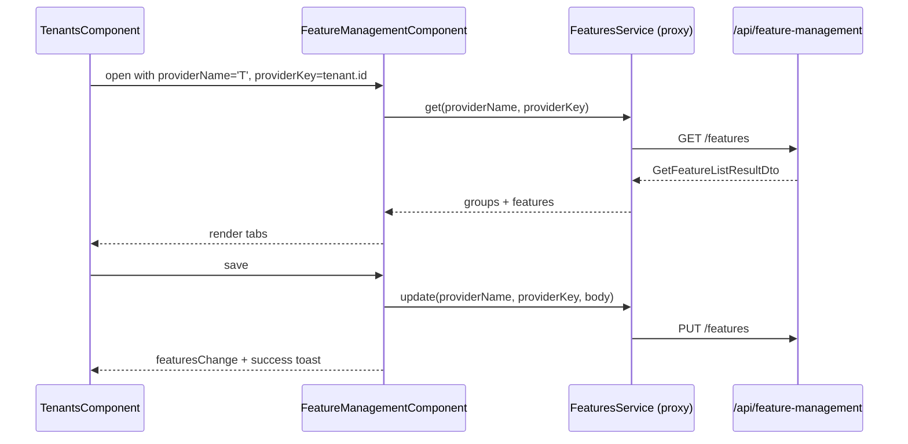
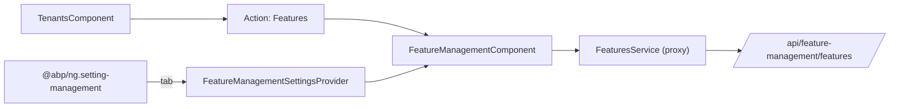
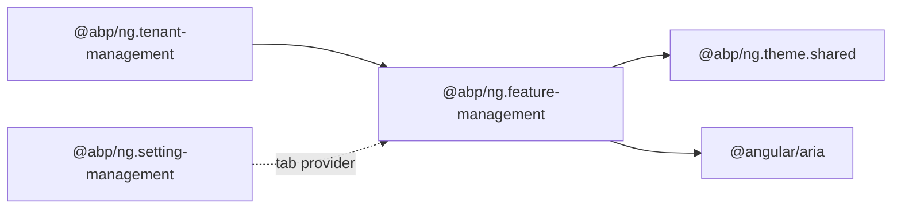
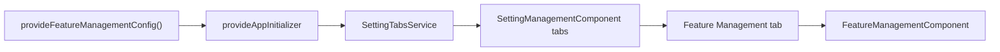

`@abp/ng.feature-management` is the Angular UI for ABP Framework's feature management subsystem. It renders the per-tenant or per-edition feature toggle dialog and exposes the standalone components other modules embed when they need to expose feature flags. The source is `npm/ng-packs/packages/feature-management/` and the public entry barrel is `npm/ng-packs/packages/feature-management/src/public-api.ts`.

## Package metadata

`npm/ng-packs/packages/feature-management/package.json` ships `@abp/ng.feature-management` with `@abp/ng.theme.shared` and `tslib` as runtime dependencies, plus `@angular/aria` as a peer dependency (the tab UI inside the modal uses the new ARIA tab primitives).

## Folder map

| Folder | Role |
| --- | --- |
| `components/feature-management/` | `FeatureManagementComponent` — modal-style host that fetches features and renders tabs. |
| `components/feature-management-tab/` | `FeatureManagementTabComponent` — renders the per-group feature inputs (boolean, free text, selection). |
| `directives/free-text-input.directive.ts` | `FreeTextInputDirective` for free-text feature inputs. |
| `enums/components.ts` | `eFeatureManagementComponents.FeatureManagement = 'FeatureManagement.FeatureManagementComponent'`. |
| `models/feature-management.ts` | Internal TypeScript shapes for groups, features, and input descriptors. |
| `providers/feature-management-config.provider.ts` | The standalone `provideFeatureManagementConfig()` entry point. |
| `providers/feature-management-settings.provider.ts` | Settings-tab integration so administrators can edit feature settings. |
| `feature-management.module.ts` | Legacy NgModule shim for non-standalone consumers. |

## Public surface

`npm/ng-packs/packages/feature-management/src/public-api.ts` re-exports:

```ts
export * from './lib/components';
export * from './lib/directives';
export * from './lib/providers';
export * from './lib/enums/components';
export * from './lib/feature-management.module';
export * from './lib/models';
```

## FeatureManagementComponent

`npm/ng-packs/packages/feature-management/src/lib/components/feature-management/feature-management.component.ts` is the modal-style component that fetches the feature list from `FeaturesService` (in `@abp/ng.feature-management/proxy`). Inputs:

- `visible` — two-way bound flag controlling the modal.
- `providerName` — `T` for tenant features, `E` for edition features.
- `providerKey` — tenant id or edition id.

Outputs:

- `visibleChange` — modal visibility.
- `featuresChange` — emitted after save so the caller can refresh its data.

Internally the component depends on:

- `ModalComponent`, `ModalCloseDirective`, `ButtonComponent`, `ToasterService` from `@abp/ng.theme.shared`.
- `LocalizationPipe`, `ListService`, `SubscriptionService` from `@abp/ng.core`.
- `FeatureManagementTabComponent` from the same package.
- ARIA tabs from `@angular/aria/tabs`.



## FeatureManagementTabComponent

`npm/ng-packs/packages/feature-management/src/lib/components/feature-management-tab/feature-management-tab.component.ts` is what renders the inner tab content — a list of features in a group. Each feature can be a boolean, a free-text input (using `FreeTextInputDirective`), a select with predefined values, or a settings tab. The component uses `FormInputComponent`, `FormCheckboxComponent` from `@abp/ng.theme.shared` for consistent styling.

The directive `FreeTextInputDirective` (`npm/ng-packs/packages/feature-management/src/lib/directives/free-text-input.directive.ts`) helps host applications honour the validator rules attached to free-text feature inputs (regex, integer, etc.).

## Providers

`npm/ng-packs/packages/feature-management/src/lib/providers/feature-management-config.provider.ts` exports the standalone `provideFeatureManagementConfig()` factory used by host applications:

```ts
import { provideFeatureManagementConfig } from '@abp/ng.feature-management';

bootstrapApplication(AppComponent, {
  providers: [
    provideAbpCore(withOptions({ environment })),
    provideAbpOAuth(),
    provideAbpThemeShared(),
    provideFeatureManagementConfig(),
  ],
});
```

It registers:

- The contributors that surface feature management as a settings tab in `@abp/ng.setting-management` (via `feature-management-settings.provider.ts`).
- Any tokens needed by the component to function without `FeatureManagementModule.forRoot()`.

## Replaceable key

```ts
export const enum eFeatureManagementComponents {
  FeatureManagement = 'FeatureManagement.FeatureManagementComponent',
}
```

`ReplaceableComponentsService.add({ key, component })` from `@abp/ng.core` lets you swap the modal entirely — for instance to embed a wizard-style feature wizard instead.

## Legacy module shim

`feature-management.module.ts` keeps `FeatureManagementModule.forRoot()` for non-standalone applications. It is marked `@deprecated` and only re-exports the components plus calls `provideFeatureManagementConfig()` internally.

## Integration with tenant management

`@abp/ng.tenant-management` is the primary consumer. The "Features" entity action contributed in `npm/ng-packs/packages/tenant-management/src/lib/defaults/default-tenants-entity-actions.ts` opens the modal with `providerName = 'T'` and the tenant id. Editions in additional ABP products use the same `FeatureManagementComponent` with `providerName = 'E'`.



## Settings integration

`npm/ng-packs/packages/feature-management/src/lib/providers/feature-management-settings.provider.ts` contributes a tab into the setting management page so that administrators can manage features from a single place. The provider hooks into `SETTING_TABS` (declared in `@abp/ng.setting-management`) and reuses `FeatureManagementComponent` as the tab content.

## Dependency map



## Customisation paths

<CardGroup cols={2}>
  <Card title="Replace the modal" icon="window-restore">
    Provide a replacement against `eFeatureManagementComponents.FeatureManagement` to render features inside a side drawer or a wizard.
  </Card>
  <Card title="Augment free text features" icon="pen">
    Reuse `FreeTextInputDirective` in custom feature renderers to honour the server-side validation contract.
  </Card>
  <Card title="Disable settings tab" icon="toggle-off">
    Provide an empty multi-provider value for `SETTING_TABS` after `provideFeatureManagementConfig()` to remove the feature management tab.
  </Card>
  <Card title="Custom provider name" icon="building">
    The modal accepts any provider name supported by the server, including custom providers registered in your own application module.
  </Card>
</CardGroup>

<Tip>
The directive `FreeTextInputDirective` is what allows free-text feature values to enforce regex/integer constraints. If you write your own feature renderer, use this directive on the `<input>` element to inherit the validation behaviour automatically.
</Tip>

## Component internals

`npm/ng-packs/packages/feature-management/src/lib/components/feature-management/feature-management.component.html` lays out the modal as:

1. `<abp-modal>` header with the localization key `AbpFeatureManagement::Features`.
2. `<abp-tabs>` rendering one `<abp-tab>` per group returned by the backend.
3. Inside each tab, a `<abp-feature-management-tab>` rendering the actual checkboxes and inputs.
4. Footer with a "Save" button bound to `submit()`.

The `submit()` method composes the change set as `UpdateFeaturesDto` and posts it through `FeaturesService.update(providerName, providerKey, dto)`. On success, the component emits `featuresChange` so the host can refresh.

## FeatureManagementTabComponent rendering rules

Each feature in `FeatureManagementTabComponent` is rendered based on its `valueType`:

| `valueType` | Renderer |
| --- | --- |
| `boolean` | `FormCheckboxComponent` from `@abp/ng.theme.shared`. |
| `selection` | A native `<select>` with options from `feature.allowedProviders` and the feature's `allowedValues`. |
| `freeText` (string/number) | `<input>` with `FreeTextInputDirective` to attach the server's regex / integer constraints. |

The component reads the `feature.parentName` field and indents children under their parent to mimic the hierarchy used by the backend.

## Settings tab provider

`npm/ng-packs/packages/feature-management/src/lib/providers/feature-management-settings.provider.ts` calls `inject(SettingTabsService).add(...)` inside a `provideAppInitializer` block. The settings tab uses the same modal component but with `providerName = 'S'` (system features) so administrators can manage tenant-independent feature defaults from the settings page.



## Models

`npm/ng-packs/packages/feature-management/src/lib/models/feature-management.ts` declares the TypeScript shapes mirroring the server-side DTOs:

- `FeatureGroupDto` — grouping container.
- `FeatureDto` — individual feature with `name`, `displayName`, `value`, `provider`, `valueType`.
- `UpdateFeaturesDto` — payload posted on save.

These are also exported from `@abp/ng.feature-management/proxy` for direct REST consumption.

## Free text input directive

`npm/ng-packs/packages/feature-management/src/lib/directives/free-text-input.directive.ts` reads the feature's `valueType` and `feature.value` to derive the right HTML attributes (`type="number"`, `pattern`, `min`, `max`, `required`). It also coordinates with `@ngx-validate/core` so validation errors surface in the same template style used by every other ABP form.

## Embedding the modal

A typical host integration looks like this:

```ts
import {
  FeatureManagementComponent,
  eFeatureManagementComponents,
} from '@abp/ng.feature-management';

@Component({
  selector: 'my-tenants',
  imports: [FeatureManagementComponent],
  template: `
    <abp-feature-management
      [(visible)]="open"
      providerName="T"
      [providerKey]="tenant.id"
      (featuresChange)="onChange()"
    ></abp-feature-management>
  `,
})
export class MyTenantsComponent { /* ... */ }
```

The `providerName = 'T'` aligns with the backend `TenantFeatureProvider` registered by the ABP `FeatureManagement` module. Other provider names: `E` for editions, `U` for users (when the host enables the `UserFeatureManagementProvider`), and any custom provider names registered on the server.

## Localization keys

Every label rendered by the modal comes from the localization resource `AbpFeatureManagement` (defined by the server-side `AbpFeatureManagementResource`). The keys most likely to be customised:

- `AbpFeatureManagement::Features` — modal title.
- `AbpFeatureManagement::SuccessfullySaved` — toast on save.
- `AbpFeatureManagement::DisplayName:{featureName}` — per-feature label fallback.

Replacing these keys in your app's localization JSON adjusts the modal without code changes.

## Proxy entry point

`npm/ng-packs/packages/feature-management/proxy/` ships the Angular client for `Volo.Abp.FeatureManagement.HttpApi`. The primary service `FeaturesService` exposes `get(providerName, providerKey, options?)` and `update(providerName, providerKey, body)`. Hosts that prefer to skip the UI and write their own renderer can still use `@abp/ng.feature-management/proxy` directly.
