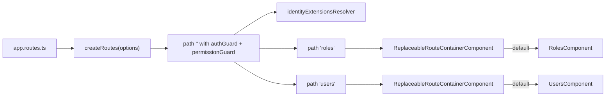
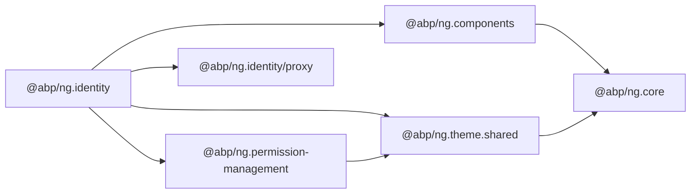

`@abp/ng.identity` is the Angular UI module mirroring the server-side ABP Framework `Volo.Abp.Identity` application. It ships the Roles and Users CRUD screens, the route definitions every host application registers, and the extension contributor tokens that let teams add columns, actions, and form fields without forking the templates. The source is `npm/ng-packs/packages/identity/` and the public surface is `npm/ng-packs/packages/identity/src/public-api.ts`.

## Package metadata

`npm/ng-packs/packages/identity/package.json` exposes the name `@abp/ng.identity` with runtime dependencies `@abp/ng.components`, `@abp/ng.permission-management`, `@abp/ng.theme.shared`, and `tslib`. Three `ng-package.json` files inside the folder define three publishable entry points:

| Path | Import | Purpose |
| --- | --- | --- |
| `npm/ng-packs/packages/identity/` | `@abp/ng.identity` | Main module, components, routes, tokens, resolvers. |
| `npm/ng-packs/packages/identity/proxy/` | `@abp/ng.identity/proxy` | Service proxies and DTOs generated from `Volo.Abp.Identity`. |
| `npm/ng-packs/packages/identity/config/` | `@abp/ng.identity/config` | Defaults consumed by Suite-generated host configurations. |

## Folder map

`npm/ng-packs/packages/identity/src/lib/` contains:

| Folder | Role |
| --- | --- |
| `components/roles/` | `RolesComponent` + template — list/create/edit/delete roles. |
| `components/users/` | `UsersComponent` + template — list/create/edit/delete users, role assignment, lock-out, etc. |
| `defaults/` | Default entity-prop, form-prop, toolbar-action, and entity-action contributors for both resources. |
| `enums/components.ts` | `eIdentityComponents` — string keys used by `ReplaceableComponents` and `EXTENSIONS_IDENTIFIER`. |
| `guards/extensions.guard.ts` | `IdentityExtensionsGuard` — legacy route guard for non-standalone consumers. |
| `models/config-options.ts` | `IdentityConfigOptions` describing contributor maps. |
| `resolvers/` | `identityExtensionsResolver` — runs before route activation to register contributors. |
| `tokens/extensions.token.ts` | The `IDENTITY_*_CONTRIBUTORS` injection tokens. |
| `identity.routes.ts` | The `createRoutes(options)` factory and the `provideIdentity` helper. |
| `identity-routing.module.ts` + `identity.module.ts` | Legacy NgModule glue. |

## Bootstrapping

The recommended setup is to register the identity routes lazily inside the app's main routes file:

```ts
import { createRoutes as identityRoutes } from '@abp/ng.identity';

export const routes: Routes = [
  {
    path: 'identity',
    loadChildren: () => Promise.resolve(identityRoutes({
      entityPropContributors: { /* ... */ },
    })),
  },
];
```

`createRoutes` is declared in `npm/ng-packs/packages/identity/src/lib/identity.routes.ts`. It returns a single parent route at `''` with two children:

- `roles` — `requiredPolicy: 'AbpIdentity.Roles'`, replaceable component key `eIdentityComponents.Roles`, default component `RolesComponent`.
- `users` — `requiredPolicy: 'AbpIdentity.Users'`, replaceable component key `eIdentityComponents.Users`, default component `UsersComponent`.

Both children use `ReplaceableRouteContainerComponent` (from `@abp/ng.core`) so consumers can swap the default component without touching the routing table. The parent route applies `authGuard` and `permissionGuard` together and runs `identityExtensionsResolver`.

The `provideIdentity(options)` helper inside the same file binds each contributor map to its DI token:

| Token | Purpose |
| --- | --- |
| `IDENTITY_ENTITY_ACTION_CONTRIBUTORS` | Row-level actions in the grid. |
| `IDENTITY_TOOLBAR_ACTION_CONTRIBUTORS` | Toolbar buttons above the grid. |
| `IDENTITY_ENTITY_PROP_CONTRIBUTORS` | Columns rendered by `ExtensibleTableComponent`. |
| `IDENTITY_CREATE_FORM_PROP_CONTRIBUTORS` | Fields shown in the create modal. |
| `IDENTITY_EDIT_FORM_PROP_CONTRIBUTORS` | Fields shown in the edit modal. |

## Default contributors

`npm/ng-packs/packages/identity/src/lib/defaults/` holds the out-of-the-box configuration for both resources:

- `default-roles-entity-props.ts` — `RoleName`, `IsDefault`, `IsPublic`.
- `default-roles-entity-actions.ts` — `Edit`, `Permissions`, `Delete`.
- `default-roles-toolbar-actions.ts` — `NewRole`.
- `default-roles-form-props.ts` — name, default, public flags.
- Equivalent files for users: `default-users-entity-props.ts`, `-entity-actions.ts`, `-toolbar-actions.ts`, `-form-props.ts`.

The resolver `identityExtensionsResolver` (in `src/lib/resolvers/`) merges custom contributors with these defaults, then registers them into `ExtensionsService` from `@abp/ng.components/extensible`.

## Components

### RolesComponent

`npm/ng-packs/packages/identity/src/lib/components/roles/roles.component.ts` is a standalone component declaring `providers: [ListService, { provide: EXTENSIONS_IDENTIFIER, useValue: eIdentityComponents.Roles }]`. Its imports include:

- `ExtensibleTableComponent` from `@abp/ng.components/extensible` — renders the grid.
- `PageComponent` from `@abp/ng.components/page` — provides the page chrome.
- `ModalComponent`, `ButtonComponent`, `ConfirmationService`, `ToasterService` from `@abp/ng.theme.shared` — modal editing and notifications.
- `PermissionManagementComponent` from `@abp/ng.permission-management` — embedded into the permissions modal.
- `IdentityRoleService` and `IdentityRoleDto` from `@abp/ng.identity/proxy` — the generated proxies that call `/api/identity/roles`.

### UsersComponent

`npm/ng-packs/packages/identity/src/lib/components/users/users.component.ts` follows the same pattern with `EXTENSIONS_IDENTIFIER = eIdentityComponents.Users`. It additionally uses `IdentityUserService` from `@abp/ng.identity/proxy` and integrates role assignment via `LookupSearchComponent` from `@abp/ng.components/lookup`.

## Replaceable components

The keys exposed in `npm/ng-packs/packages/identity/src/lib/enums/components.ts`:

```ts
export enum eIdentityComponents {
  Roles = 'Identity.RolesComponent',
  Users = 'Identity.UsersComponent',
}
```

Consumers register their own template through `ReplaceableComponentsService.add({ key, component })` from `@abp/ng.core` — no need to clone the routes file.

## Generated proxies

`npm/ng-packs/packages/identity/proxy/` is its own secondary entry point with a dedicated `ng-package.json`. It exposes the generated DTO interfaces (`IdentityRoleDto`, `IdentityUserDto`, etc.) and Angular services (`IdentityRoleService`, `IdentityUserService`, `IdentityRoleAppService`, etc.) produced by the proxy generator described in `angular/schematics-and-generators`. The `RolesComponent` and `UsersComponent` import directly from this entry point.

## Route flow



## Extending the UI

<Steps>
  <Step title="Define contributors">
    Create maps such as `{ [eIdentityComponents.Users]: [<EntityPropContributor>] }` describing the columns or actions you want to add.
  </Step>
  <Step title="Pass them to createRoutes">
    Forward them through `createRoutes({ entityPropContributors, toolbarActionContributors, ... })`. The `provideIdentity` helper inside `identity.routes.ts` binds each map to the matching DI token.
  </Step>
  <Step title="Or use the NgModule form">
    Non-standalone applications can still call `IdentityModule.forChild(options)` defined in `identity.module.ts`, which delegates to the same token binding plus `IdentityExtensionsGuard` from `guards/extensions.guard.ts`.
  </Step>
</Steps>

## Public API surface

`npm/ng-packs/packages/identity/src/public-api.ts` re-exports:

```ts
export * from './lib/components';
export * from './lib/enums';
export * from './lib/guards';
export * from './lib/identity.module';
export * from './lib/models';
export * from './lib/tokens';
export * from './lib/resolvers';
export * from './lib/identity.routes';
```

The proxy and config entry points have their own `public-api.ts` files under `npm/ng-packs/packages/identity/proxy/src/public-api.ts` and `npm/ng-packs/packages/identity/config/src/public-api.ts`.

<Tip>
The roles screen embeds `PermissionManagementComponent` from `@abp/ng.permission-management` to manage role permissions. That same pattern repeats in users (per-user permissions). If you replace `RolesComponent` you can keep the permission modal by importing it from the dedicated package.
</Tip>

## Inside RolesComponent

`npm/ng-packs/packages/identity/src/lib/components/roles/roles.component.ts` follows the standard ABP CRUD recipe:

- `providers: [ListService, { provide: EXTENSIONS_IDENTIFIER, useValue: eIdentityComponents.Roles }]` makes the inherited `ListService<QueryParamsType>` instance scoped to the component while still resolving extension contributors against the right key.
- The component injects `IdentityRoleService` from `@abp/ng.identity/proxy` and uses `ListService.hookToQuery(query => this.service.getList(query))` to drive the table.
- A `selected` signal stores the currently edited role, `form` holds the reactive form generated via `generateFormFromProps(FormPropData)` from `@abp/ng.components/extensible`.
- `ToasterService.success('AbpIdentity::SuccessfullySaved')` and `ConfirmationService.warn('AbpIdentity::AreYouSureToDelete', ...)` give users feedback.
- A `PermissionManagementComponent` is embedded inside an `<abp-modal>` to manage permissions per role.

The template `roles.component.html` lives next to the TypeScript file and uses `PageComponent` from `@abp/ng.components/page` for the chrome, `<abp-extensible-table>` for the grid, `<abp-extensible-form>` inside the create/edit modal, and `<abp-permission-management>` inside the permissions modal.

## Inside UsersComponent

`npm/ng-packs/packages/identity/src/lib/components/users/users.component.ts` repeats the pattern with `EXTENSIONS_IDENTIFIER` set to `eIdentityComponents.Users` and `IdentityUserService` instead of `IdentityRoleService`. The component adds:

- `selectedUserRoles` — fetched via `IdentityUserService.getRolesById(id)` when opening the edit modal.
- `assignableRoles$` — fetched via `IdentityUserService.getAssignableRoles()`.
- The role chooser uses `LookupSearchComponent` from `@abp/ng.components/lookup` for typeahead role selection.
- A second modal hosts `PermissionManagementComponent` with `providerName="U"` and `providerKey=user.id` for per-user permissions.

## Resolvers and the extension lifecycle

`npm/ng-packs/packages/identity/src/lib/resolvers/identity-extensions.resolver.ts` is a functional resolver attached to the parent route. It pulls the contributor maps from the DI tokens, merges them with the defaults in `defaults/`, and registers the resulting `EntityActionList`, `EntityPropList`, `FormPropList`, and `ToolbarActionList` instances against `ExtensionsService` via `eIdentityComponents.Roles` and `eIdentityComponents.Users` keys.

```mermaid
flowchart TB
    Routes[createRoutes(options)] --> Provide[provideIdentity(options)]
    Provide --> Tokens[IDENTITY_*_CONTRIBUTORS values]
    Resolver[identityExtensionsResolver] --> Tokens
    Resolver --> Defaults[default-*-contributors]
    Defaults --> Service[ExtensionsService]
    Tokens --> Service
    Service --> Components[Roles/Users components]
```

## Proxy entry point details

`npm/ng-packs/packages/identity/proxy/` exposes the generated services and DTOs. The most important members are:

- `IdentityRoleService` — `get`, `getList`, `create`, `update`, `delete`, `getAllList`.
- `IdentityUserService` — `get`, `getList`, `create`, `update`, `delete`, `getRolesById`, `updateRoles`, `lockoutUser`, `getAssignableRoles`.
- `OrganizationUnitService`, `SecurityLogService`, `IdentitySessionService` for the related backend resources.
- DTOs: `IdentityRoleDto`, `IdentityUserDto`, `IdentityRoleCreateDto`, `IdentityUserCreateDto`, `IdentityRoleUpdateDto`, `IdentityUserUpdateDto`, `IdentityUserClaimDto`, and pagination wrappers like `PagedResultDto<IdentityRoleDto>`.

These services are generated by the proxy generator described in `angular/schematics-and-generators` and follow the layout in `npm/ng-packs/packages/identity/proxy/src/`.

## Customising the create vs edit form differently

A common scenario is to require different fields when creating versus editing a user. Because the contributors are bound to two distinct tokens (`IDENTITY_CREATE_FORM_PROP_CONTRIBUTORS` vs `IDENTITY_EDIT_FORM_PROP_CONTRIBUTORS`), the host app can pass different maps:

```ts
createRoutes({
  createFormPropContributors: {
    [eIdentityComponents.Users]: [propList => propList.addTail(new FormProp({ id: 'organizationId', name: 'OrgId', type: ePropType.String }))],
  },
  editFormPropContributors: {
    [eIdentityComponents.Users]: [propList => propList.dropByValue('organizationId', (p, id) => p.id === id)],
  },
});
```

Because everything is driven by typed factories under `@abp/ng.components/extensible/lib/models/form-props.ts`, TypeScript prevents incompatible contributors from compiling.

## Adding a custom column

A toolbar contribution example illustrates the same pattern:

```ts
import { ToolbarAction } from '@abp/ng.components/extensible';

const exportAction = new ToolbarAction({
  text: 'Export',
  icon: 'fa fa-file-export',
  visible: () => true,
  action: () => console.log('export'),
});

createRoutes({
  toolbarActionContributors: {
    [eIdentityComponents.Users]: [list => list.addTail(exportAction)],
  },
});
```

After bootstrap the new button appears in the toolbar of `UsersComponent` without modifying any template.

## Dependency graph


