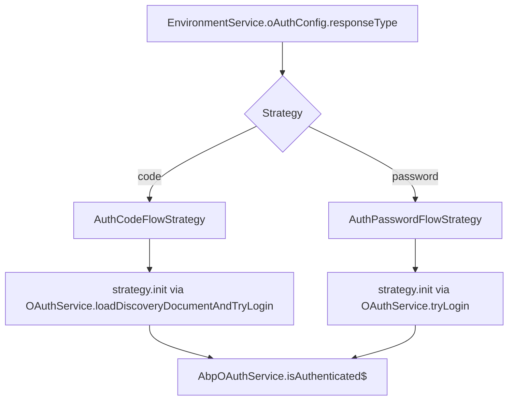
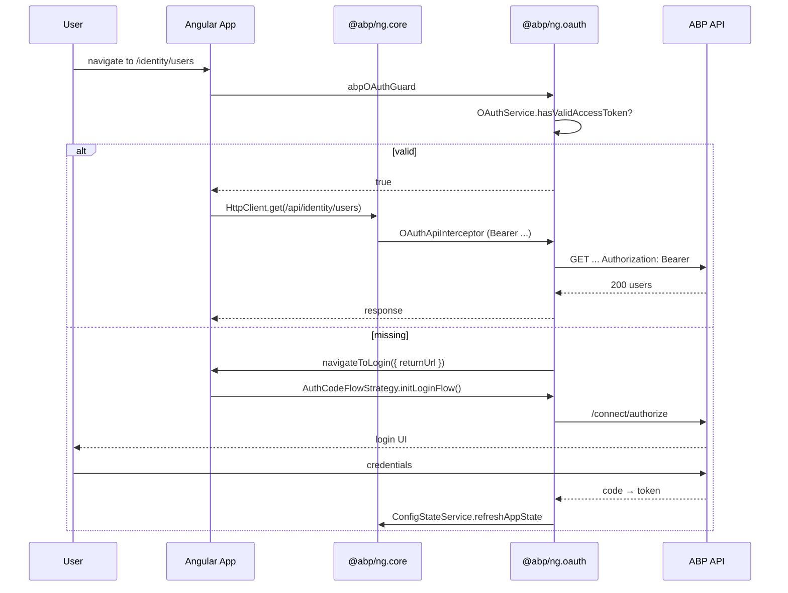
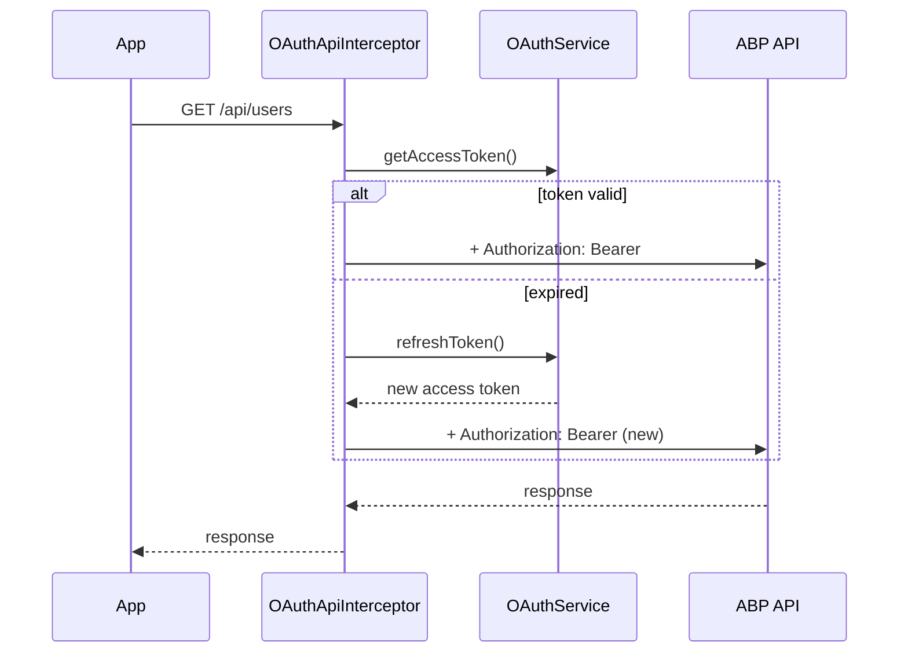

`@abp/ng.oauth` is the official authentication library for ABP Framework Angular applications. It plugs the popular `angular-oauth2-oidc` client into the abstract `AuthService`, `AuthGuard`, and `ApiInterceptor` tokens declared by `@abp/ng.core`. The package lives at `npm/ng-packs/packages/oauth/` and is published as `@abp/ng.oauth`.

## Package metadata

`npm/ng-packs/packages/oauth/package.json` lists the dependencies that matter at runtime: `@abp/ng.core`, `@abp/utils`, `angular-oauth2-oidc`, `just-clone`, and `just-compare`. The package is `LGPL-3.0`. There is exactly one public entry barrel: `npm/ng-packs/packages/oauth/src/public-api.ts`, which re-exports every folder under `src/lib/`.

## Folder map

| Folder | Purpose |
| --- | --- |
| `guards/` | `oauth.guard.ts` — `AbpOAuthGuard` class and `abpOAuthGuard` / `asyncAbpOAuthGuard` functional guards. |
| `handlers/` | `oauth-configuration.handler.ts` — reacts to `EnvironmentService` updates and reconfigures `OAuthService`. |
| `interceptors/` | `api.interceptor.ts` — `OAuthApiInterceptor` adds the `Authorization: Bearer ...` header. |
| `providers/` | `oauth-module-config.provider.ts` exporting `provideAbpOAuth()`, plus `navigate-to-manage-profile.provider.ts`. |
| `services/` | `oauth.service.ts` (`AbpOAuthService`), token storage services, error filter. |
| `strategies/` | `AuthFlowStrategy`, `AuthCodeFlowStrategy`, `AuthPasswordFlowStrategy`. |
| `tokens/` | `auth-flow-strategy.ts` (the `AUTH_FLOW_STRATEGY` factory map) and `cookies.ts`. |
| `utils/` | Storage factories, `check-access-token.ts`, `clear-o-auth-storage.ts`, `pipe-to-login` helpers. |

`npm/ng-packs/packages/oauth/src/lib/oauth.module.ts` only contains a thin backward-compatibility shim — the legacy `AbpOAuthModule.forRoot()` now delegates to `provideAbpOAuth()` and is marked `@deprecated`.

## Bootstrapping

The recommended setup, defined in `npm/ng-packs/packages/oauth/src/lib/providers/oauth-module-config.provider.ts`, is to call the standalone `provideAbpOAuth()` function alongside `provideAbpCore()`:

```ts
import { provideAbpCore, withOptions } from '@abp/ng.core';
import { provideAbpOAuth } from '@abp/ng.oauth';

bootstrapApplication(AppComponent, {
  providers: [
    provideAbpCore(withOptions({ environment })),
    provideAbpOAuth(),
  ],
});
```

The `provideAbpOAuth` function returns a `makeEnvironmentProviders` block that:

1. Replaces the abstract `AuthService` from `@abp/ng.core` with `AbpOAuthService`.
2. Replaces the abstract `AuthGuard` class and the functional `authGuard` / `asyncAuthGuard` with their `AbpOAuth*` counterparts.
3. Replaces `ApiInterceptor` with `OAuthApiInterceptor` so every outbound HTTP call sends the bearer token from `OAuthService.getAccessToken()`.
4. Provides `PIPE_TO_LOGIN_FN_KEY` (the helper used by `RoutesService` to redirect anonymous visitors) and `CHECK_AUTHENTICATION_STATE_FN_KEY` (the function `ConfigStateService` uses to know whether to refresh).
5. Adds `OAuthConfigurationHandler` and `NavigateToManageProfileProvider`.
6. Switches `OAuthStorage` between `BrowserTokenStorageService` and `ServerTokenStorageService` based on `PLATFORM_ID` to keep SSR safe.

## AbpOAuthService

`npm/ng-packs/packages/oauth/src/lib/services/oauth.service.ts` implements `IAuthService` from `@abp/ng.core`. The constructor pulls `OAuthService` (the `angular-oauth2-oidc` instance), `EnvironmentService`, and the chosen `AuthFlowStrategy`. Important methods:

- `init()` — picks a strategy based on `environment.oAuthConfig.responseType` and calls `strategy.init()`.
- `login(params?: LoginParams)` — delegates to the active flow strategy.
- `logout()` — clears storage and revokes tokens.
- `refreshToken()` — re-issues the access token; on failure, falls back to `pipeToLogin`.
- `navigateToLogin(params?)` — pushes the user to the configured login route while preserving the return URL.



## Auth flow strategies

`npm/ng-packs/packages/oauth/src/lib/strategies/auth-flow-strategy.ts` declares the abstract base class and the public interface used by `AbpOAuthService`. The concrete implementations are:

- **`AuthCodeFlowStrategy`** (`auth-code-flow-strategy.ts`) — Authorization Code Flow with PKCE. Calls `OAuthService.loadDiscoveryDocumentAndTryLogin()` and stores the response through `BrowserTokenStorageService`.
- **`AuthPasswordFlowStrategy`** (`auth-password-flow-strategy.ts`) — Resource Owner Password Credentials. Uses `OAuthService.fetchTokenUsingPasswordFlow(username, password)`; the marker `isInternalAuth = true` lets the SDK render the built-in login form instead of redirecting.

The token `AUTH_FLOW_STRATEGY` in `npm/ng-packs/packages/oauth/src/lib/tokens/auth-flow-strategy.ts` exposes a static map of factory functions so that consumers can swap strategies:

```ts
export const AUTH_FLOW_STRATEGY = {
  Code: (injector) => new AuthCodeFlowStrategy(injector),
  Password: (injector) => new AuthPasswordFlowStrategy(injector),
};
```

## OAuth guard

`npm/ng-packs/packages/oauth/src/lib/guards/oauth.guard.ts` ships three guards:

- `AbpOAuthGuard` (class form, `@deprecated`).
- `abpOAuthGuard` (functional `CanActivateFn`) — preferred for `provide: authGuard`.
- `asyncAbpOAuthGuard` (functional `CanActivateFn`) — preferred for `provide: asyncAuthGuard`. It waits for the discovery document and initial token check to finish before deciding, using RxJS `timer/filter/timeout` to avoid race conditions on cold starts.

When the user is not authenticated the guard calls `AuthService.navigateToLogin({ returnUrl: state.url })`. The OAuth guard is also SSR-safe: it injects `PLATFORM_ID` and `RESPONSE_INIT` to short-circuit on the server.

## Interceptor

`npm/ng-packs/packages/oauth/src/lib/interceptors/api.interceptor.ts` extends the abstract `ApiInterceptor` from `@abp/ng.core`. It overrides `getAdditionalHeaders()` to inject `Authorization: Bearer <accessToken>` and, for SSR, also forwards cookies through `RESPONSE_INIT`. Because `provideAbpOAuth()` swaps the provider behind the `ApiInterceptor` token, every consumer of `HTTP_INTERCEPTORS` automatically benefits.

## Token storage

`npm/ng-packs/packages/oauth/src/lib/services/` ships multiple `OAuthStorage` implementations:

| Service | Use case |
| --- | --- |
| `BrowserTokenStorageService` | Default browser storage backed by `localStorage`. |
| `MemoryTokenStorageService` | Falls back to in-memory storage when the browser blocks Web Storage. |
| `ServerTokenStorageService` | Read-only storage used during SSR; reads cookies through `RESPONSE_INIT`. |
| `RememberMeService` | Persists the "remember me" boolean between sessions; used by the account UI. |
| `OAuthErrorFilterService` | Implements `AuthErrorFilterService` from `@abp/ng.core` so that expected `invalid_grant` errors don't surface as toast errors. |

`oAuthStorageFactory` in `npm/ng-packs/packages/oauth/src/lib/utils/storage.factory.ts` is the platform-aware factory wired into the `OAuthStorage` DI token.

## Configuration handler

`npm/ng-packs/packages/oauth/src/lib/handlers/oauth-configuration.handler.ts` watches `EnvironmentService.createOnUpdateStream` and re-applies the OAuth config when the environment changes — for instance after `EnvironmentService.setState({ ... })` swaps the `oAuthConfig` block at runtime. Using `just-compare` it skips unnecessary `OAuthService.configure()` calls.

## Utility helpers

`npm/ng-packs/packages/oauth/src/lib/utils/index.ts` exports helpers consumed by `provideAbpOAuth()`:

- `pipeToLogin` (`auth-utils.ts`) — operator that catches `401` responses and triggers `AuthService.navigateToLogin`.
- `checkAccessToken` (`check-access-token.ts`) — synchronous boolean used by `ConfigStateService` to know whether to fetch the application configuration.
- `clearOAuthStorage` (`clear-o-auth-storage.ts`) — clears all OAuth storage entries; called on logout.
- `oAuthStorage`, `oAuthStorageFactory` (`oauth-storage.ts`, `storage.factory.ts`) — storage factories.

## Manage profile provider

`npm/ng-packs/packages/oauth/src/lib/providers/navigate-to-manage-profile.provider.ts` supplies `MANAGE_PROFILE_TOKEN` from `@abp/ng.core`. When the user opens the current-user menu in `@abp/ng.theme.basic`, that token is invoked to either navigate to the in-app profile route or to redirect to the OpenIddict-hosted profile page, depending on `oAuthConfig`.

## End-to-end flow



## Replacing the default behaviour

Because `@abp/ng.oauth` only registers DI tokens, you can override any of them in a downstream provider list. Common scenarios:

<CardGroup cols={2}>
  <Card title="Switch to memory storage" icon="memory">
    Provide `OAuthStorage` with `MemoryTokenStorageService` after `provideAbpOAuth()` to opt out of `localStorage`.
  </Card>
  <Card title="Custom login redirect" icon="route">
    Override the `PIPE_TO_LOGIN_FN_KEY` token with your own RxJS operator factory before adding `provideAbpOAuth()`.
  </Card>
  <Card title="Force password flow" icon="key">
    Set `oAuthConfig.responseType = 'password'` in your environment, or directly provide `AUTH_FLOW_STRATEGY.Password` to `AuthFlowStrategy`.
  </Card>
  <Card title="Disable SSR token storage" icon="server">
    Override `ServerTokenStorageService` with a no-op implementation if your SSR layer does not forward cookies.
  </Card>
</CardGroup>

<Tip>
Because the legacy `AbpOAuthModule` is now a deprecated shim, prefer `provideAbpOAuth()` everywhere — including in modules generated by older versions of ABP Suite. The functional guards (`abpOAuthGuard`, `asyncAbpOAuthGuard`) are also preferred over the deprecated class guard.
</Tip>

## OAuthConfigurationHandler internals

`npm/ng-packs/packages/oauth/src/lib/handlers/oauth-configuration.handler.ts` is constructed during `provideAppInitializer` (via `provideAbpOAuth`) and:

1. Subscribes to `EnvironmentService.createOnUpdateStream(state => state)`.
2. Maps each emitted environment to its `oAuthConfig` block.
3. Uses `just-compare` to detect actual changes (skipping no-op emissions).
4. Calls `OAuthService.configure(config)` whenever the OAuth config differs.

This makes hot-reloading the OAuth configuration trivial: change `environment.oAuthConfig` at runtime and the next state emission picks it up automatically.

## AuthCodeFlowStrategy walk-through

`npm/ng-packs/packages/oauth/src/lib/strategies/auth-code-flow-strategy.ts`:

```ts
async init() {
  await this.oAuthService.loadDiscoveryDocumentAndTryLogin();
  this.setupAutomaticSilentRefresh();
}

initLoginFlow() {
  this.oAuthService.initLoginFlow(this.state, this.params);
}

logout() {
  this.oAuthService.logOut();
}
```

The strategy keeps the OAuth response cookies stored through `BrowserTokenStorageService`. Silent refresh uses the well-known `silent-refresh.html` (or the configured equivalent) served by the host application.

## AuthPasswordFlowStrategy walk-through

`auth-password-flow-strategy.ts` calls `OAuthService.fetchTokenUsingPasswordFlow(username, password)` when the user submits the internal login form. Successful logins push the response into storage and resolve the promise that the login page awaits.

`isInternalAuth = true` is the marker that `LoginComponent` from `@abp/ng.account` reads to decide whether to render the internal form or to immediately redirect to the OIDC provider.

## Storage selection logic

The factory `oAuthStorageFactory` in `npm/ng-packs/packages/oauth/src/lib/utils/storage.factory.ts`:

1. Returns `ServerTokenStorageService` on the server (Angular Universal SSR).
2. Returns `MemoryTokenStorageService` if `localStorage` cannot be accessed (Safari private mode).
3. Falls back to `BrowserTokenStorageService` for the standard case.

The chosen instance is bound to the `OAuthStorage` token used internally by `angular-oauth2-oidc`.

## NavigateToManageProfile provider

`npm/ng-packs/packages/oauth/src/lib/providers/navigate-to-manage-profile.provider.ts` reads the `oAuthConfig.issuer` value to decide whether to:

- Open the in-app `account/manage-profile` route.
- Redirect to the OpenIddict-hosted profile page (when the issuer exposes one and `internalManageProfile` is false).

The decision is fed to the `MANAGE_PROFILE_TOKEN` from `@abp/ng.core`, which `CurrentUserComponent` in `@abp/ng.theme.basic` invokes when the user clicks "My Account".

## Removing OAuth temporarily

For tests or for hosts that delegate to a custom backend, you can omit `provideAbpOAuth()` entirely. In that case, the consumer must register a different `AuthService` provider (and matching guards/interceptor) before the first HTTP call. The abstract `AuthService` class in `@abp/ng.core` documents the required surface.

## Token refresh sequence



The silent refresh is driven by `OAuthService.setupAutomaticSilentRefresh()` configured during `AuthCodeFlowStrategy.init`. When the refresh fails (network or `invalid_grant`), `OAuthErrorFilterService` swallows the noise and `pipeToLogin` triggers a redirect to the login page.

## ABP-specific OAuth config extension

The `Environment.oAuthConfig` from `@abp/ng.core` extends `angular-oauth2-oidc`'s `AuthConfig` with two optional fields:

- `impersonation?: Impersonation` — used by the `ImpersonationService` shipped in ABP Commercial.
- `ssrAuthorizationUrl?: string` — alternative authorization endpoint used during SSR (for example to avoid CORS issues).

Both fields are read by `AbpOAuthService.init()` when present.

## Logout flow

The logout button triggers `AuthService.logout()` which:

1. Calls `OAuthService.logOut()` (which posts to the `end_session_endpoint` and clears storage).
2. Calls `clearOAuthStorage()` to wipe any ABP-specific remnants.
3. Pushes the user to the configured `postLogoutRedirectUri` (or `/` by default).

`OAuthConfigurationHandler` does not need to react to logout because the next environment update (or login) will reconfigure `OAuthService`.
