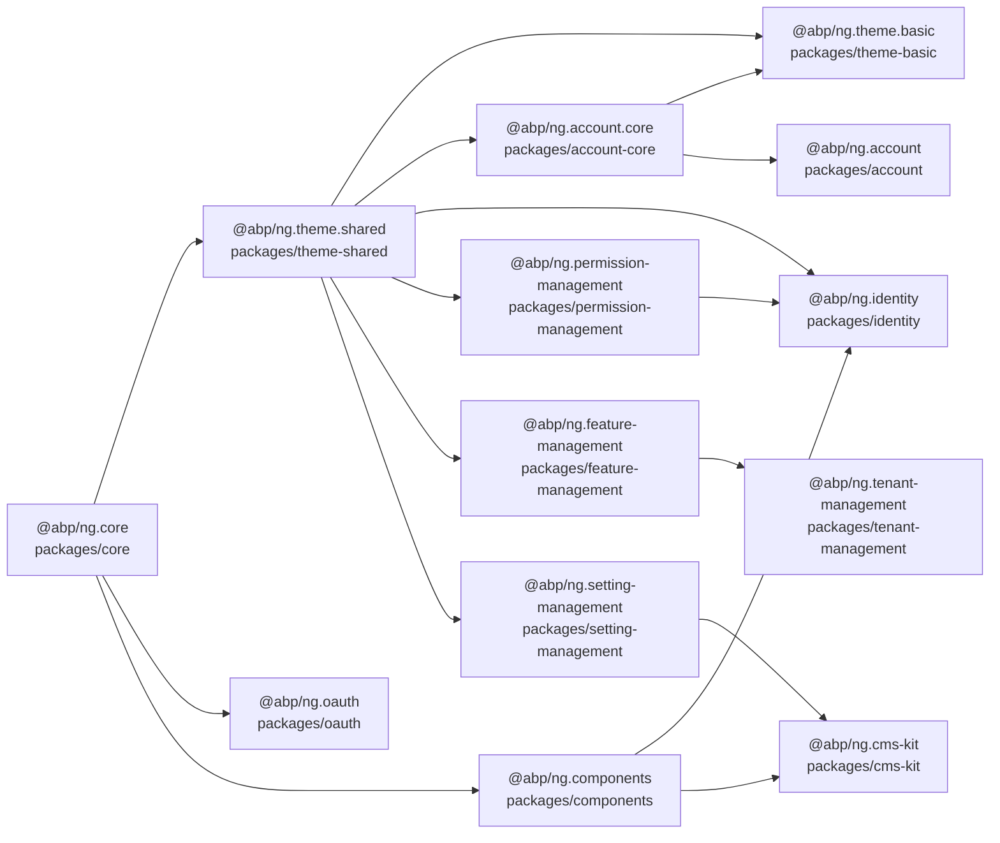
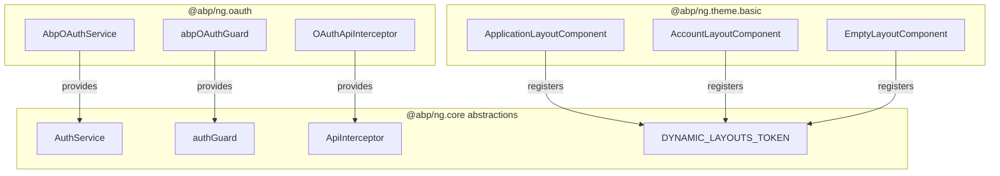
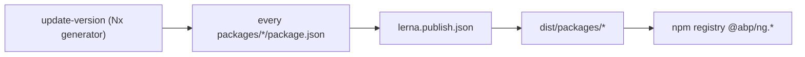

The Angular UI for ABP Framework lives in a single Nx workspace under `npm/ng-packs/`. Every public package exports either runtime building blocks (`@abp/ng.core`, `@abp/ng.oauth`), reusable UI surfaces (`@abp/ng.components`, `@abp/ng.theme.shared`, `@abp/ng.theme.basic`), feature modules that mirror server-side application modules (`@abp/ng.identity`, `@abp/ng.account`, `@abp/ng.tenant-management`, ...), or developer tooling (`@abp/ng.schematics`, `@abp/nx.generators`). This page walks the workspace top-down so you know exactly which folder under `npm/ng-packs/packages/` produces which npm artifact.

## Workspace layout

The root of the Angular monorepo is `npm/ng-packs/`. The two files that drive multi-package builds are `npm/ng-packs/package.json` (Nx + Yarn scripts) and `npm/ng-packs/lerna.version.json` / `npm/ng-packs/lerna.publish.json` (versioning and publishing). The workspace also ships demonstration apps under `npm/ng-packs/apps/` and authoring helpers under `npm/ng-packs/scripts/` and `npm/ng-packs/tools/`.

<Note>
The `nx.json` file at `npm/ng-packs/nx.json` configures Nx targets so that `nx run-many --target=build --all` (used by `npm run build:all`) builds every library independently and respects their dependency graph.
</Note>



## Lerna and Nx scripts

`npm/ng-packs/lerna.version.json` declares `"version": "7.2.3"` and the matching package glob `"packages": ["packages/*"]`, so every directory directly under `npm/ng-packs/packages/` is treated as an independently versioned library. The companion `npm/ng-packs/lerna.publish.json` switches the glob to `dist/packages/*` because publication happens from the Nx build output, not from the source tree. The `npmClient` for both files is `yarn`.

The most relevant npm scripts in `npm/ng-packs/package.json` are:

<CardGroup cols={2}>
  <Card title="build:all" icon="hammer">
    `nx run-many --target=build --all --exclude=dev-app,schematics --prod && npm run build:schematics` — builds every Angular library in parallel, then runs the dedicated schematics build.
  </Card>
  <Card title="build:schematics" icon="wand-magic-sparkles">
    Cd's into `npm/ng-packs/scripts/` and runs `yarn build:schematics`, which transpiles `packages/schematics/` to JavaScript ready to be consumed by `ng generate`.
  </Card>
  <Card title="affected:build" icon="diagram-project">
    Wraps `nx affected:build --parallel 1` so CI only rebuilds libraries impacted by the changed files.
  </Card>
  <Card title="lerna" icon="layer-group">
    Forwards to the local `lerna` binary; combined with the two `lerna.*.json` files it drives version bumps and `npm publish` runs.
  </Card>
</CardGroup>

## Public package inventory

The table below lists every directory under `npm/ng-packs/packages/` with the `name` field from its `package.json` and a one-line role.

| Folder | `package.json#name` | Role |
| --- | --- | --- |
| `packages/core/` | `@abp/ng.core` | Runtime SDK: REST client, configuration state, localization, auth abstractions, route handlers, guards, pipes, directives, generated proxy types under `src/lib/proxy/`. |
| `packages/oauth/` | `@abp/ng.oauth` | OAuth/OIDC integration on top of `angular-oauth2-oidc`; wires `AbpOAuthService` into the abstract `AuthService` defined in `@abp/ng.core`. |
| `packages/components/` | `@abp/ng.components` | UI primitives split into secondary entry points (`chart.js/`, `dynamic-form/`, `extensible/`, `lookup/`, `page/`, `tree/`). |
| `packages/theme-shared/` | `@abp/ng.theme.shared` | Theme-agnostic widgets (toasts, modals, confirmation, loaders, error wrapper) and the `provideAbpThemeShared` configuration helpers. |
| `packages/theme-basic/` | `@abp/ng.theme.basic` | Reference theme: application/account/empty layouts, header bar, navigation, languages, validation error component. |
| `packages/account-core/` | `@abp/ng.account.core` | Pure services used by every theme to render account screens: `AuthWrapperService`, `TenantBoxService`. |
| `packages/account/` | `@abp/ng.account` | Default account UI: login, register, forgot password, reset password, manage profile, change password, personal settings. |
| `packages/identity/` | `@abp/ng.identity` | Roles and Users administration UI plus `identity.routes.ts` and the `provideIdentity` factory. |
| `packages/permission-management/` | `@abp/ng.permission-management` | Permission tree modal used by other modules; entry through `PermissionManagementComponent`. |
| `packages/feature-management/` | `@abp/ng.feature-management` | Feature management modal with `FeatureManagementComponent` and `FeatureManagementTabComponent`. |
| `packages/setting-management/` | `@abp/ng.setting-management` | Tabbed setting page; ships `SettingManagementComponent` and its routes file `setting-management.routes.ts`. |
| `packages/tenant-management/` | `@abp/ng.tenant-management` | Tenant administration UI with feature management modal integration. |
| `packages/cms-kit/` | `@abp/ng.cms-kit` | Public + admin CMS Kit modules split into `admin/`, `public/`, and `proxy/` secondary entry points. |
| `packages/schematics/` | `@abp/ng.schematics` | Angular CLI schematics: `proxy-add`, `proxy-index`, `proxy-refresh`, `proxy-remove`, `api`, `create-lib`, `change-theme`, `ai-config`, `ssr-add`. |
| `packages/generators/` | `@abp/nx.generators` | Nx generators counterpart: `generate-proxy`, `update-version`, `change-theme`. |

<Tip>
The `oauth` package depends only on `@abp/ng.core` and `angular-oauth2-oidc`; everything else (`theme-shared`, `theme-basic`, the feature modules) layers UI on top. You can mix in a custom auth backend by providing a different implementation of `AuthService` and skipping `@abp/ng.oauth` entirely.
</Tip>

## Secondary entry points

Several packages use Angular's ng-packagr secondary entry points. The path between the package root and the inner `ng-package.json` becomes the import subpath:

- `@abp/ng.components/chart.js` → `npm/ng-packs/packages/components/chart.js/`
- `@abp/ng.components/dynamic-form` → `npm/ng-packs/packages/components/dynamic-form/`
- `@abp/ng.components/extensible` → `npm/ng-packs/packages/components/extensible/`
- `@abp/ng.components/lookup` → `npm/ng-packs/packages/components/lookup/`
- `@abp/ng.components/page` → `npm/ng-packs/packages/components/page/`
- `@abp/ng.components/tree` → `npm/ng-packs/packages/components/tree/`
- `@abp/ng.cms-kit/admin` → `npm/ng-packs/packages/cms-kit/admin/`
- `@abp/ng.cms-kit/public` → `npm/ng-packs/packages/cms-kit/public/`
- `@abp/ng.cms-kit/proxy` → `npm/ng-packs/packages/cms-kit/proxy/`

Each secondary entry point declares its own `ng-package.json` and `public-api.ts` (for example `npm/ng-packs/packages/components/extensible/src/public-api.ts`) so consumers can tree-shake whatever they do not import.

## Where the abstractions live

ABP keeps the abstractions (interfaces, tokens, factories) in `@abp/ng.core` so that the concrete implementations published by other packages can be swapped:

- `AuthService`, `AuthGuard`, `ApiInterceptor`, and `PIPE_TO_LOGIN_FN_KEY` are declared in `npm/ng-packs/packages/core/src/lib/abstracts/` and `npm/ng-packs/packages/core/src/lib/tokens/`.
- `@abp/ng.oauth` wires real implementations through `provideAbpOAuth()` in `npm/ng-packs/packages/oauth/src/lib/providers/oauth-module-config.provider.ts`.
- The theme packages register their components against tokens such as `DYNAMIC_LAYOUTS_TOKEN` defined in `npm/ng-packs/packages/core/src/lib/tokens/dynamic-layout.token.ts`.



## Demo app and apps folder

`npm/ng-packs/apps/dev-app/` is the Nx app the maintainers use to exercise every library against a live backend. Its `src/app/app.config.ts` calls `provideAbpCore()`, `provideAbpOAuth()`, `provideThemeBasicConfig()`, `provideAbpThemeShared()`, and the feature `createRoutes(...)` factories — making it a working reference for any ABP-based Angular application. The build script `nx serve dev-app` (aliased by `npm start` in `npm/ng-packs/package.json`) is the canonical way to run it.

## Quality gates

The workspace defines a single `test:all` (`nx run-many --target=test --all`) and a Vitest entry (`test:vitest`) at `npm/ng-packs/package.json`, plus lint targets (`lint:all`, `affected:lint`). Each library carries its own `jest.config.ts` and `vitest.config.mts` alongside `tsconfig.spec.json`. The shared root `npm/ng-packs/tsconfig.base.json` defines path mappings so that intra-workspace imports resolve to source rather than the published `dist/`.

<Card title="Pick a package to learn next" icon="book">
The remaining pages in this section drill into each public package's modules, services, components, and route shapes. `angular/core.mdx` is the right starting point because every other library imports from `@abp/ng.core`.
</Card>

## Build pipeline details

Each library inside `npm/ng-packs/packages/` ships its own `project.json` (Nx project descriptor), `ng-package.json` (ng-packagr entry point), `tsconfig.lib.json`, and `tsconfig.lib.prod.json`. The Nx target `build` for every project calls ng-packagr against `ng-package.json`, while `test` and `lint` invoke Jest/Vitest and ESLint respectively. The shared root `npm/ng-packs/tsconfig.base.json` declares the TypeScript `paths` so that intra-workspace imports such as `import { ConfigStateService } from '@abp/ng.core'` resolve to the source code without first running a build.

The Nx orchestrator uses `npm/ng-packs/nx.json` to define cacheable targets and inputs. CI pipelines call `affected:lint`, `affected:build`, and `affected:test` (defined in `npm/ng-packs/package.json`) so that only libraries impacted by the changed files are rebuilt. Lerna takes over for publishing: `lerna publish` reads `lerna.publish.json` and pushes the contents of `dist/packages/*` to npm under their respective `@abp/ng.*` names.

## Demo apps in apps/

`npm/ng-packs/apps/dev-app/` is the canonical sandbox application. Its `src/app/app.config.ts` provides the entire stack: `provideAbpCore`, `provideAbpOAuth`, `provideAbpThemeShared`, `provideThemeBasicConfig`, plus the feature-module routes (`accountRoutes`, `identityRoutes`, `tenantManagementRoutes`, `settingManagementRoutes`, CMS Kit admin and public routes). When contributors want to test a change, they run `nx serve dev-app` against a live ABP backend.

Other Nx apps in the workspace include unit-test harnesses for libraries with browser-only APIs. They are not published to npm; only the `packages/*` outputs make it to the registry.

## Source-code requirements

`npm/ng-packs/source-code-requirements/` documents the conventions every published package must follow: every component is `standalone`, every public function is exported through the package's `public-api.ts`, deprecated APIs keep their `@deprecated` JSDoc tags, and generated proxies are not re-exported through barrels (matching the warning in `npm/ng-packs/packages/core/src/lib/proxy/README.md`). The `npm/ng-packs/CONTRIBUTING.md` file walks new contributors through the workflow from clone to PR.

## Versioning policy

Library versions are kept in lockstep with the server-side ABP packages. The Nx generator `@abp/nx.generators:update-version` (declared at `npm/ng-packs/packages/generators/generators.json`) is wrapped by the script `update-version` in `npm/ng-packs/package.json`. It rewrites the `version` field of every `packages/*/package.json` and updates the `~` ranges inside each library's `dependencies` block so that, after the bump, every package references its peers at the same version.



## Where to find ABP-specific abstractions

| Abstraction | Source path |
| --- | --- |
| `AuthService`, `IAuthService` | `npm/ng-packs/packages/core/src/lib/abstracts/auth.service.ts` |
| `AuthGuard`, `authGuard`, `asyncAuthGuard` | `npm/ng-packs/packages/core/src/lib/abstracts/auth.guard.ts` |
| `ApiInterceptor` | `npm/ng-packs/packages/core/src/lib/interceptors/api.interceptor.ts` |
| `DYNAMIC_LAYOUTS_TOKEN` | `npm/ng-packs/packages/core/src/lib/tokens/dynamic-layout.token.ts` |
| `RoutesService` (alias `AbpRoutesService`) | `npm/ng-packs/packages/core/src/lib/services/router-events.service.ts` and `tokens/list.token.ts` |
| `ReplaceableComponentsService` | `npm/ng-packs/packages/core/src/lib/services/replaceable-components.service.ts` |
| `ExtensionsService` | `npm/ng-packs/packages/components/extensible/src/lib/services/extensions.service.ts` |
| `SettingTabsService` | `npm/ng-packs/packages/setting-management/config/src/lib/services/` |

Memorising this list pays off because every customisation pattern in ABP Framework Angular ultimately funnels through one of these abstractions.

## Per-package project.json

Each library under `npm/ng-packs/packages/<name>/project.json` declares the Nx targets:

- `build` — invokes ng-packagr against `ng-package.json`, output to `dist/packages/<name>`.
- `test` — runs Jest (or Vitest where configured) using `jest.config.ts` or `vitest.config.mts`.
- `lint` — runs ESLint with the workspace's flat config.

Adding a new target is as simple as editing the project file; Nx picks up new commands without restart. Cacheable targets are declared in `npm/ng-packs/nx.json` so CI reuses outputs across builds.

## Workspace npm scripts walk-through

The relevant scripts from `npm/ng-packs/package.json` for everyday development:

| Script | Effect |
| --- | --- |
| `nx serve dev-app` | Boots the sandbox app pointing at a configured backend. |
| `nx build <name>` | Builds a single library to `dist/packages/<name>`. |
| `nx test <name>` | Runs the test suite for that library only. |
| `nx run-many --target=build --all` | Builds every library and every demo app. |
| `npm run dev:schematics` | Watches the schematics package and rebuilds on change. |
| `npm run debug:schematics` | Invokes `proxy-add` with placeholder arguments for smoke-testing the generator. |
| `npm run mock:schematics` | Boots a local mock backend serving a stub API definition. |
| `npm run dev:ssr` | Runs SSR for the dev app. |
| `npm run prerender` | Pre-renders the dev app to static HTML for SEO testing. |

## CONTRIBUTING.md highlights

The repo-level `npm/ng-packs/CONTRIBUTING.md` enumerates the conventions: standalone-first components, signal inputs/outputs where applicable, no `forRoot` patterns in new code, deprecation tags on legacy classes, and the requirement that every PR ship a corresponding test. The `pre-commit/` folder configures the Husky hook that runs `lint-staged` from `npm/ng-packs/package.json`.

## Tooling expectations

| Tool | Source path |
| --- | --- |
| Nx workspace config | `npm/ng-packs/nx.json` |
| TypeScript base config | `npm/ng-packs/tsconfig.base.json` |
| TypeScript prod config | `npm/ng-packs/tsconfig.prod.json` |
| Vitest config | `npm/ng-packs/vitest.config.mts` |
| Jest preset | `npm/ng-packs/jest.preset.js` and `npm/ng-packs/jest.config.ts` |
| Pre-commit hook | `npm/ng-packs/pre-commit/` |
| Decorate Angular CLI | `npm/ng-packs/decorate-angular-cli.js` |

The decorate script is run as part of the Nx postinstall and rewrites the `ng` binary to route through Nx so that contributors can keep using `ng build` while still benefiting from caching.

## How the demo app wires everything

```ts
// npm/ng-packs/apps/dev-app/src/app/app.config.ts
providers: [
  provideAbpCore(withOptions({ environment })),
  provideAbpOAuth(),
  provideAbpThemeShared(),
  provideThemeBasicConfig(),
  provideFeatureManagementConfig(),
  // ...
],
```

The route file lazy-loads each module via the corresponding `createRoutes(...)` factory:

```ts
{ path: 'identity', loadChildren: () => Promise.resolve(identityRoutes()) },
{ path: 'account', loadChildren: () => Promise.resolve(accountRoutes()) },
{ path: 'tenant-management', loadChildren: () => Promise.resolve(tenantRoutes()) },
{ path: 'setting-management', loadChildren: () => Promise.resolve(settingRoutes()) },
{ path: 'cms-kit', loadChildren: () => Promise.resolve(cmsAdminRoutes()) },
```

Mirroring this layout in a new application is the fastest path to a working ABP-based Angular app.

## When to add a new package

The contribution guidelines recommend adding a new package when:

1. The feature stands on its own (no compile-time dependency on existing feature modules).
2. It can be lazy-loaded behind its own route.
3. It exposes contributor tokens so consumers can extend the UI without forking.

When the feature is small enough, contributing a secondary entry point inside an existing package (the way `@abp/ng.components` is structured) keeps the npm graph minimal.
