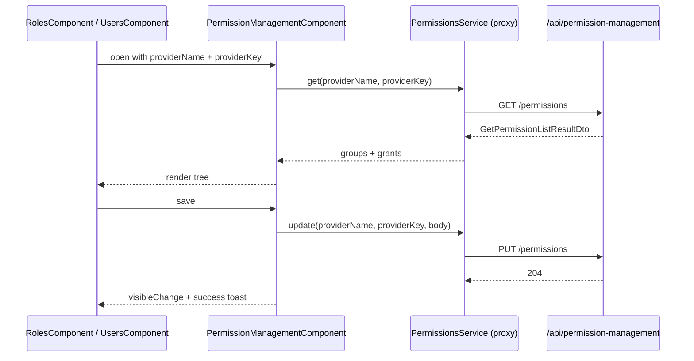
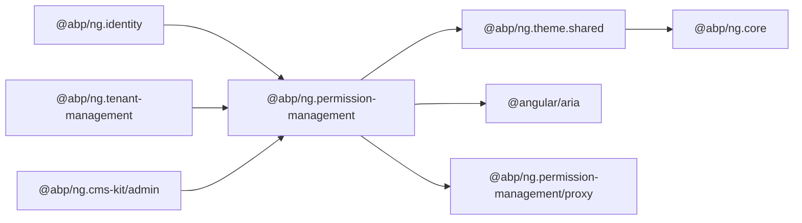
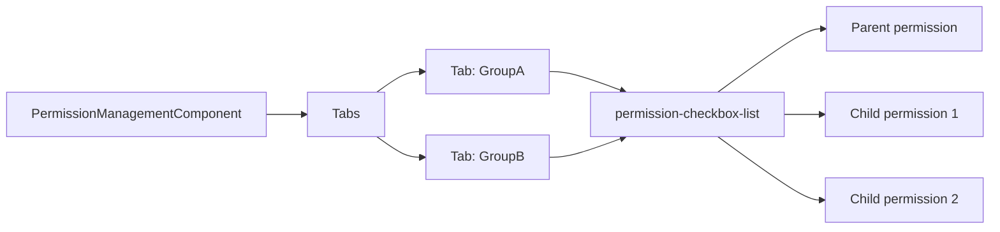

`@abp/ng.permission-management` is the UI module that renders the permission tree dialog every ABP Framework feature uses to grant or revoke policies for a role, a user, a client, or any other ABP permission provider. The library lives at `npm/ng-packs/packages/permission-management/` and ships as `@abp/ng.permission-management` plus the `@abp/ng.permission-management/proxy` and `@abp/ng.permission-management/config` secondary entry points.

## Package metadata

`npm/ng-packs/packages/permission-management/package.json` lists `@abp/ng.theme.shared` and `tslib` as direct dependencies, and `@angular/aria` as a peer dependency. The peer requirement comes from the new `Tabs`, `TabList`, `Tab`, `TabPanel`, and `TabContent` primitives from `@angular/aria/tabs` consumed by the main component.

## Folder map

`npm/ng-packs/packages/permission-management/src/lib/`:

| Folder | Role |
| --- | --- |
| `components/` | The Angular components surface — see below. |
| `defaults/` | `default-resource-permission-entity-props.ts` defines the columns rendered by the resource permission management screen. |
| `enums/components.ts` | `ePermissionManagementComponents` — replaceable keys. |
| `models/` | TypeScript shapes used internally by the components and services. |
| `services/` | `ExtensionsService` integration plus `ResourcePermissionStateService`. |
| `tokens/extensions.token.ts` | Contributor token for resource permissions. |
| `permission-management.module.ts` | Re-exports `PermissionManagementComponent` for legacy consumers. |

`npm/ng-packs/packages/permission-management/src/public-api.ts` re-exports the components, the replaceable-component enum, the models, and the legacy module.

## Components

`npm/ng-packs/packages/permission-management/src/lib/components/`:

| File / folder | Component |
| --- | --- |
| `permission-management.component.ts` | `PermissionManagementComponent` — the modal-based permission tree editor. |
| `resource-permission-management/resource-permission-management.component.ts` | `ResourcePermissionManagementComponent` — admin page that lists every provider key (role, user, client...) and embeds the modal. |
| `resource-permission-management/resource-permission-list/` | The list view inside the resource permission page. |
| `resource-permission-management/resource-permission-form/` | The form for editing a provider's permissions. |
| `resource-permission-management/permission-checkbox-list/` | The grouped checkbox renderer used by both components. |
| `resource-permission-management/provider-key-search/` | Async provider-key search via `LookupSearchComponent` from `@abp/ng.components/lookup`. |

### PermissionManagementComponent

`npm/ng-packs/packages/permission-management/src/lib/components/permission-management.component.ts` is a standalone component exported as `abpPermissionManagement`. Inputs control which provider's permissions are being edited:

- `providerName` (`R` for roles, `U` for users, ...)
- `providerKey` (the role name, user id, etc.)
- `hideBadges`

It depends on:

- `PermissionsService`, `GetPermissionListResultDto`, `UpdatePermissionDto`, `PermissionGroupDto`, `PermissionGrantInfoDto`, `ProviderInfoDto` from `@abp/ng.permission-management/proxy` — the generated REST client.
- `ModalComponent`, `ModalCloseDirective`, `ButtonComponent`, `ToasterService`, `LocaleDirection` from `@abp/ng.theme.shared`.
- `ConfigStateService`, `CurrentUserDto`, `LocalizationPipe` from `@abp/ng.core`.
- The tabs primitives `Tabs`, `TabList`, `Tab`, `TabPanel`, `TabContent` from `@angular/aria/tabs`.

The component fetches the permission groups grouped by tab (one tab per group) and presents grouped checkboxes. Provider badges next to each permission indicate when the permission is granted by a parent provider (a higher-level role, for example), and the component emits `output<Permission>` events on save so the host can refresh its data.



### ResourcePermissionManagementComponent

`npm/ng-packs/packages/permission-management/src/lib/components/resource-permission-management/resource-permission-management.component.ts` is the full page used by ABP Suite to manage permissions for a chosen provider type. The component uses `ExtensibleTableComponent` from `@abp/ng.components/extensible` to render the provider key list, then embeds `PermissionManagementComponent` for the actual edit step.

## Replaceable component keys

`npm/ng-packs/packages/permission-management/src/lib/enums/components.ts`:

```ts
export const enum ePermissionManagementComponents {
  PermissionManagement = 'PermissionManagement.PermissionManagementComponent',
  ResourcePermissions = 'PermissionManagement.ResourcePermissionsComponent',
}
```

Both keys are accepted by `ReplaceableComponentsService.add({ key, component })` from `@abp/ng.core`.

## Tokens and contributors

`npm/ng-packs/packages/permission-management/src/lib/tokens/extensions.token.ts` exports the contributor token consumed by the resource permission management page. It is injected by the resolver that builds the extension state for `ExtensionsService` from `@abp/ng.components/extensible`. The matching defaults live in `npm/ng-packs/packages/permission-management/src/lib/defaults/default-resource-permission-entity-props.ts`.

## Services

`npm/ng-packs/packages/permission-management/src/lib/services/`:

- `ExtensionsService` (`extensions.service.ts`) — wires the contributor tokens into `ExtensionsService` from the extensible package.
- `ResourcePermissionStateService` (`resource-permission-state.service.ts`) — holds the selected resource and the cached `GetPermissionListResultDto` so navigating between tabs feels instant.

## Generated proxies

The folder `npm/ng-packs/packages/permission-management/proxy/` is a secondary entry point with its own `ng-package.json`. It exports the DTOs (`GetPermissionListResultDto`, `PermissionGroupDto`, `PermissionGrantInfoDto`, `ProviderInfoDto`, `UpdatePermissionDto`, `UpdatePermissionsDto`) and the `PermissionsService` Angular service, all generated from the server-side `Volo.Abp.PermissionManagement.HttpApi` contract using the proxy schematic.

## How other modules embed the modal

The most common embedding looks like the one inside `RolesComponent` (`npm/ng-packs/packages/identity/src/lib/components/roles/roles.component.ts`):

```ts
import {
  ePermissionManagementComponents,
  PermissionManagementComponent,
} from '@abp/ng.permission-management';
```

The roles grid hosts a `<abp-modal>` that wraps `<abp-permission-management providerName="R" [providerKey]="selectedRole.name">`. The same shape repeats for `UsersComponent` (provider `U`) and any custom resource module that needs permission editing.

## Dependency map



## Customisation paths

<CardGroup cols={2}>
  <Card title="Custom modal layout" icon="window-restore">
    Provide a replacement against `ePermissionManagementComponents.PermissionManagement`. The modal opening is driven by inputs, so the new component only needs to honour the same input signatures.
  </Card>
  <Card title="Custom resource page" icon="table">
    Replace `ePermissionManagementComponents.ResourcePermissions` to surface custom provider-key search or branding for the admin page.
  </Card>
  <Card title="Hide provider badges" icon="eye-slash">
    Use the `hideBadges` input on `PermissionManagementComponent` when embedding from a host that does not care about provider chains.
  </Card>
  <Card title="Custom resource columns" icon="columns">
    Contribute extra entity props through the token in `tokens/extensions.token.ts` to extend the resource permission management table.
  </Card>
</CardGroup>

<Tip>
Because the modal renders directly on top of `ModalComponent` from `@abp/ng.theme.shared`, you can mount it from any host page — not only the identity module. ABP Suite uses this fact to expose permission editing from custom resource modules generated by the developer.
</Tip>

## Tab and group layout

`PermissionManagementComponent` builds an aria-tabbed UI where each tab corresponds to a `PermissionGroupDto` returned by the backend. Inside each tab, permissions are rendered as a checkbox list grouped by their parent permission (so child permissions appear indented under their parent). The component imports `Tabs`, `TabList`, `Tab`, `TabPanel`, `TabContent` from `@angular/aria/tabs` to satisfy WAI-ARIA tab semantics out of the box.

The `permission-checkbox-list` component (`npm/ng-packs/packages/permission-management/src/lib/components/resource-permission-management/permission-checkbox-list/`) is the leaf-level renderer used in both the admin page and the modal. It propagates check changes upwards so that toggling a parent permission disables its children appropriately.



## Provider chain awareness

The DTO `PermissionGrantInfoDto` returned by `PermissionsService.get(providerName, providerKey)` includes a `grantedProviders` array, each element of which is a `ProviderInfoDto` containing `providerName` and `providerKey`. The modal renders a badge for each provider so users understand whether a permission was granted at the role, user, client, or system level. The `hideBadges` input lets callers opt out of this UI when they prefer a simpler view (for instance when editing the top-level `R` provider where badges add no useful information).

## ResourcePermissionStateService

`npm/ng-packs/packages/permission-management/src/lib/services/resource-permission-state.service.ts` caches the selected resource and the fetched permission state so that switching between provider keys feels instantaneous. The service is injected by the resource permission management page and by the form/list child components so that they all share the same source of truth.

## Resource permission management workflow

The full workflow for the admin page is:

1. `ResourcePermissionManagementComponent` renders an `ExtensibleTableComponent` listing provider keys filtered by `ProviderKeySearchComponent`.
2. Clicking "Manage" triggers `ResourcePermissionStateService.setSelected(providerKey)` and opens the `ResourcePermissionFormComponent`.
3. The form embeds `PermissionManagementComponent` with the chosen provider's `providerName`/`providerKey` and submits changes through `PermissionsService.update(providerName, providerKey, body)`.
4. On success, the service refreshes the list so the cell renderers reflect the new grant state.

## Defaults for contributors

`npm/ng-packs/packages/permission-management/src/lib/defaults/default-resource-permission-entity-props.ts` declares the columns shown by the resource permission management page. Each column maps to a property of the underlying provider list response — typically `providerKey`, `displayName`, and `grantedCount`. Custom hosts can contribute additional columns through the token in `tokens/extensions.token.ts`.

## Models

`npm/ng-packs/packages/permission-management/src/lib/models/` includes the internal TypeScript interfaces shared across the components. They are not part of the proxy entry point because they describe purely client-side state (selected tab index, search query, expanded groups, etc.) rather than DTOs sent to the server.

## Working with custom provider types

Providers in ABP can be `R` (role), `U` (user), `C` (client), or custom strings registered on the server. The Angular UI is provider-agnostic — pass any `providerName` to `PermissionManagementComponent` and the modal works the same way. If the server returns no permissions for the given provider, the modal renders an empty state with the localized message `AbpPermissionManagement::NoPermissionsToGrant`.

## Standalone usage

Because the component is standalone and the public module `PermissionManagementModule` only re-exports it for legacy hosts, modern apps can avoid the module entirely:

```ts
import { PermissionManagementComponent } from '@abp/ng.permission-management';

@Component({
  selector: 'my-permissions',
  imports: [PermissionManagementComponent, ModalComponent, ButtonComponent],
  template: `
    <abp-permission-management
      [(visible)]="open"
      providerName="R"
      [providerKey]="role.name"
    ></abp-permission-management>
  `,
})
export class MyPermissionsComponent { /* ... */ }
```

## API reference

The proxy entry point `@abp/ng.permission-management/proxy` exposes:

- `PermissionsService.get(providerName: string, providerKey: string): Observable<GetPermissionListResultDto>`.
- `PermissionsService.update(providerName: string, providerKey: string, body: UpdatePermissionsDto): Observable<void>`.

The DTOs match the server-side `Volo.Abp.PermissionManagement.HttpApi` contract; refer to the generated TypeScript files under `npm/ng-packs/packages/permission-management/proxy/src/` for the field-level reference.
