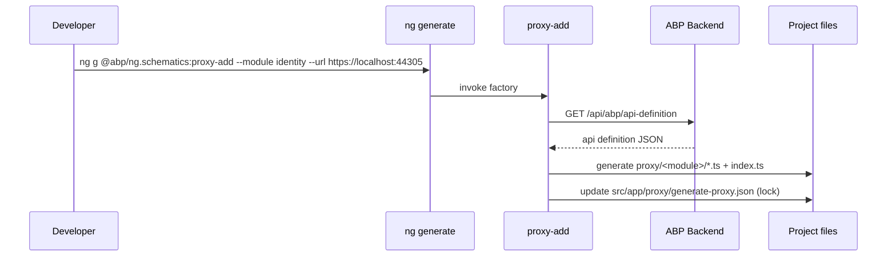
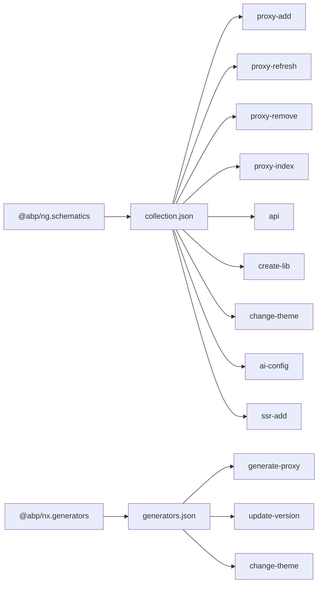

`@abp/ng.schematics` and `@abp/nx.generators` are the developer-tooling packages that automate ABP Framework Angular workflows. They generate the typed REST client proxies consumed by every feature module, scaffold new libraries, switch the bundled theme, and add SSR to existing projects. The source lives at `npm/ng-packs/packages/schematics/` and `npm/ng-packs/packages/generators/`.

## Two complementary packages

`npm/ng-packs/packages/schematics/package.json` publishes `@abp/ng.schematics` with a top-level `schematics` field pointing at `./collection.json`, making the package directly compatible with `ng add` and `ng generate`. Dependencies include `@angular-devkit/core`, `@angular-devkit/schematics`, `@angular/cli`, `got` (used to fetch the API definition), `jsonc-parser`, `should-quote`, and `typescript`.

`npm/ng-packs/packages/generators/package.json` publishes `@abp/nx.generators` with the `generators` field pointing at `./generators.json`. It is the Nx-native counterpart: every generator wraps a workspace operation that Nx ships natively, while the schematics package targets standalone Angular workspaces.

## Schematic collection

`npm/ng-packs/packages/schematics/src/collection.json` lists nine schematics:

| Schematic | Factory | Schema | Purpose |
| --- | --- | --- | --- |
| `proxy-add` | `./commands/proxy-add` | `./commands/proxy-add/schema.json` | Generate REST proxies for a backend module. |
| `proxy-index` | `./commands/proxy-index` | `./commands/proxy-index/schema.json` | Regenerate the `index.ts` files of an existing proxy tree. |
| `proxy-refresh` | `./commands/proxy-refresh` | `./commands/proxy-refresh/schema.json` | Re-run proxy generation using the cached `generate-proxy.json` lock file. |
| `proxy-remove` | `./commands/proxy-remove` | `./commands/proxy-remove/schema.json` | Delete a previously generated proxy module from disk. |
| `api` | `./commands/api` | `./commands/api/schema.json` | Fetch the raw API definition JSON for debugging. |
| `create-lib` | `./commands/create-lib` | `./commands/create-lib/schema.json` | Scaffold a new Angular library or secondary entry point following ABP conventions. |
| `change-theme` | `./commands/change-theme` | `./commands/change-theme/schema.json` | Replace the theme libraries used by the host app. |
| `ai-config` | `./commands/ai-config` | `./commands/ai-config/schema.json` | Generate AI assistant configuration files (Claude, Cursor, Gemini, ...). |
| `server` | `./commands/ssr-add/server` | `./commands/ssr-add/server/schema.json` | Internal helper that wraps the Angular `@schematics/angular:server` schematic. Hidden. |
| `ssr-add` | `./commands/ssr-add` | `./commands/ssr-add/schema.json` | Enable Angular SSR with the right ABP-specific tweaks. |

Each schematic lives under `npm/ng-packs/packages/schematics/src/commands/<name>/index.ts` with a sibling `schema.json` that describes the prompts. The shared TypeScript models (proxy descriptors, project metadata, etc.) live under `npm/ng-packs/packages/schematics/src/models/`, while `npm/ng-packs/packages/schematics/src/constants/` carries `api.ts`, `proxy.ts`, `symbols.ts`, `system-types.ts`, `volo.ts` — the lookup tables that map server-side types into Angular code.

## Proxy lifecycle

The proxy generation pipeline is the heart of `@abp/ng.schematics`. It fetches the JSON definition published by `Volo.Abp.AspNetCore.Mvc.ApiExploring`, converts every service and DTO into Angular code, and stores the result inside the consumer's `src/app/proxy/` folder.



The `proxy-add` schema (`npm/ng-packs/packages/schematics/src/commands/proxy-add/schema.json`) accepts: `module`, `apiName`, `source`, `target`, `url`, `serviceType`, `entryPoint`, plus the flags consumed by the `package.json` debug script:

```json
"debug:schematics": "./node_modules/.bin/nx g ./packages/schematics/src/collection.json:proxy-add --module identity --apiName __default --source __default --target __default --url https://localhost:44305 --serviceType application --entryPoint  __default "
```

The post-build script `debug:schematics-dist` mirrors the same call against the published `dist/` output.

### Lock file

The README at `npm/ng-packs/packages/core/src/lib/proxy/README.md` documents the lock file: `generate-proxy.json` stores the last invocation's parameters so that `proxy-refresh` can re-run the generator without prompting again, and `proxy-index` knows which folders to re-index. The README also warns consumers not to hand-edit anything inside the generated tree because regeneration overwrites the folder, and not to re-export the index.ts files of generated proxy folders from a library's `public-api.ts`.

### proxy-remove

`proxy-remove` deletes the folder generated for a given backend module so the workspace stays clean after a server-side rename. It updates `generate-proxy.json` accordingly.

## Library scaffolder

`create-lib` (`npm/ng-packs/packages/schematics/src/commands/create-lib/schema.json`) scaffolds a new Angular library or secondary entry point. Properties:

- `packageName` — the npm package name.
- `isSecondaryEntrypoint` — boolean. When `true`, the schematic adds the library as a secondary entry point under an existing package (matching how `@abp/ng.components/extensible` is structured).
- `templateType` — `"module"` (legacy NgModule template) or `"standalone"` (Angular 14+ standalone template).
- `override` — overwrite existing files.

It uses the templates in the schematic's `files/` folder to seed `ng-package.json`, `tsconfig.lib.json`, `public-api.ts`, and a default component or module.

## Theme switcher

`change-theme` (`npm/ng-packs/packages/schematics/src/commands/change-theme/schema.json`) swaps `@abp/ng.theme.basic`, `@abp/ng.theme.lepton`, `@abp/ng.theme.lepton-x-lite`, or `@abp/ng.theme.lepton-x` in the host app. The prompt offers four options:

```
1 → Basic
2 → Lepton
3 → LeptonXLite
4 → LeptonX
```

The schematic rewrites the app's providers (`provideThemeBasicConfig` → `provideThemeLeptonXConfig`, etc.), updates the imported stylesheets, and reorders `npm/ng-packs/scripts/` configuration when running from inside the monorepo. The matching Nx generator `@abp/nx.generators:change-theme` does the same on Nx workspaces.

## SSR setup

`ssr-add` (`npm/ng-packs/packages/schematics/src/commands/ssr-add/schema.json`) wraps the upstream Angular SSR schematic and adds the ABP-specific glue (registering `ServerTokenStorageService` from `@abp/ng.oauth`, configuring `provideClientHydration` and the transfer-state interceptor). The hidden `server` schematic in the same folder is the Angular-provided primitive `ssr-add` invokes internally.

## API and AI helpers

- `api` schematic — fetches the raw API definition JSON from the backend; useful when debugging proxy generation issues.
- `ai-config` schematic — generates configuration files for AI assistants (Claude, Cursor, Gemini). The `tool` property is a comma-separated list (for example `claude,cursor,gemini`), `targetProject` is the workspace project, and `overwrite` allows replacing existing files.

## Nx generators

`npm/ng-packs/packages/generators/generators.json` declares three Nx generators:

| Generator | Factory | Purpose |
| --- | --- | --- |
| `generate-proxy` | `./src/generators/generate-proxy/generator` | Nx-native version of the `proxy-add` schematic. |
| `update-version` | `./src/generators/update-version/generator` | Bumps the version field across all packages in the workspace. |
| `change-theme` | `./src/generators/change-theme/generator` | Nx-native theme switcher. |

The matching scripts in `npm/ng-packs/package.json` are:

```json
"update-version": "nx generate @abp/nx.generators:update-version",
```

`generate-proxy`'s schema mirrors the schematic — same `module`, `apiName`, `source`, `target`, `url` arguments — so projects can pick the tooling stack (Angular CLI vs Nx) without rewriting their automation.

## Building schematics inside the monorepo

The root `npm/ng-packs/package.json` exposes:

- `build:schematics` — cd to `scripts/`, runs `yarn build:schematics` which transpiles `packages/schematics/` and `packages/generators/` to JavaScript ready to publish.
- `dev:schematics` — `tsc -p packages/schematics/tsconfig.json -w` for an editable build.
- `mock:schematics` — boots `scripts/mock-schematic/` which serves a local API definition useful for offline testing.
- `debug:schematics` and `debug:schematics-dist` — call `proxy-add` with placeholder arguments to validate the generator output against the source or the published dist.

`npm/ng-packs/packages/schematics/src/index.ts` is the entry point linked by `package.json#main` (and re-exported by the `collection.json`'s factory references).

## Where proxies land

The output of `proxy-add` consistently follows this layout: `src/app/proxy/<module>/<area>/<sub-area>/<service>.service.ts` plus the related models. The default proxy that ships inside `@abp/ng.core` (`npm/ng-packs/packages/core/src/lib/proxy/`) is the canonical example of the expected layout. The README inside that folder calls out two non-obvious points:

- Library authors who publish to npm should re-export generated services directly (`export * from './users/identity-user.service'`) instead of from a barrel `index.ts`, so that consumers do not accidentally import internal types.
- The folder names match the C# namespace; renaming them breaks the next regeneration pass.

## Recommended workflow

<Steps>
  <Step title="Bootstrap proxy folder">
    Run `ng generate @abp/ng.schematics:proxy-add --module identity --apiName default --url https://localhost:44305` once per backend module.
  </Step>
  <Step title="Re-run after server changes">
    Use `proxy-refresh` to regenerate every cached module after backend changes, or `proxy-add` for a single module.
  </Step>
  <Step title="Re-index">
    `proxy-index` rebuilds `index.ts` files when you manually add hand-written extensions in the same folder.
  </Step>
  <Step title="Promote to a library">
    Use `create-lib` to wrap the generated tree in a publishable library — particularly useful for module authors who want their proxies under their own npm package.
  </Step>
  <Step title="Switch theme or add SSR">
    `change-theme` and `ssr-add` are one-shot helpers used during onboarding or theme migrations.
  </Step>
</Steps>



## Versioning across the monorepo

`update-version` (Nx) updates each `package.json` under `npm/ng-packs/packages/*` to match a new ABP version. Because `lerna.version.json` already declares `"version": "7.2.3"` and Nx targets are wired through `nx run-many --target=build --all`, the workflow is: bump versions with `update-version`, run `affected:build`, then publish with `lerna publish` using `lerna.publish.json` (which targets `dist/packages/*`).

<Tip>
Always pair `proxy-add` runs with a build target so TypeScript can catch type drift introduced by backend changes. The Nx-managed workspace makes that trivial: `nx affected:build --parallel 1` after regenerating a proxy will rebuild only the libraries that depend on it.
</Tip>

## proxy-add command in detail

`npm/ng-packs/packages/schematics/src/commands/proxy-add/index.ts` is the schematic factory. The execution path is:

1. Read the `source` Angular project from the workspace config and locate its `environment.ts` to find the `apis` block.
2. Resolve the URL for the requested `apiName` (or use the `--url` argument).
3. Fetch the API definition JSON from `{url}/api/abp/api-definition` using `got`.
4. Parse the JSON into the TypeScript model declared in `npm/ng-packs/packages/schematics/src/models/api-definition.ts`.
5. Walk every module and emit service and DTO files following the templates in `commands/proxy-add/files/`.
6. Update `src/app/proxy/generate-proxy.json` so that `proxy-refresh` can replay the same command.

The supporting models in `npm/ng-packs/packages/schematics/src/models/`:

- `proxy-config.ts` — the schema of the lock file.
- `service.ts` and `method.ts` — describe the shape of generated Angular services.
- `model.ts` and `tree.ts` — describe the DTO tree.
- `import.ts` — manages cross-file imports to produce minimal `import` statements.
- `project.ts` — wraps the Angular workspace project metadata.
- `rule.ts` — the union type used by templates to attach validators.

## Constants tables

`npm/ng-packs/packages/schematics/src/constants/` is the lookup that turns C# types into TypeScript:

- `system-types.ts` — maps `System.*` types to TypeScript primitives (`Guid` → `string`, `DateTime` → `string`).
- `volo.ts` — handles ABP-specific types (`ListResultDto<T>`, `PagedResultDto<T>`, `EntityDto<TKey>`).
- `api.ts` and `proxy.ts` — symbol names emitted in the generated files.
- `symbols.ts` — internal symbol tokens for the generator.

Together they ensure the generated TypeScript matches the contracts consumed by `RestService` from `@abp/ng.core`.

## proxy-refresh and the lock file

`proxy-refresh` reads `src/app/proxy/generate-proxy.json` and re-invokes `proxy-add` for every module recorded there. The lock file records the URL, the API name, the resolved root namespace, and the target project so the regeneration is idempotent.

```json
{
  "rootNamespace": "MyCompany.MyProject",
  "modules": {
    "identity": { "url": "https://localhost:44305", "apiName": "default" },
    "myModule": { "url": "https://localhost:44305", "apiName": "default" }
  }
}
```

`proxy-remove` removes a module from this object and deletes the associated folder.

## proxy-index command

`proxy-index` regenerates the `index.ts` files inside an existing proxy tree. The README at `npm/ng-packs/packages/core/src/lib/proxy/README.md` recommends never re-exporting these index files from a library's `public-api.ts`. The schematic ensures the index files always reflect the latest folder content, even after manual edits.

## create-lib templates

`npm/ng-packs/packages/schematics/src/commands/create-lib/` contains template files that produce:

- `ng-package.json` declaring `lib.entryFile = src/public-api.ts`.
- `public-api.ts` re-exporting the generated module/component.
- `tsconfig.lib.json` / `tsconfig.lib.prod.json` derived from `npm/ng-packs/tsconfig.base.json`.
- A starter component or module depending on `templateType`.
- An entry in the workspace's `angular.json` / `project.json`.

The `isSecondaryEntrypoint` flag re-targets the generated files to live inside an existing package so the developer obtains another `@<scope>/<package>/<entry>` import path — matching the pattern used by `@abp/ng.cms-kit/admin`.

## change-theme command behaviour

`change-theme` reads the existing theme imports inside the host app's providers, removes them, and writes the equivalent imports for the chosen theme. It also updates `angular.json` (or `project.json`) to register the theme's stylesheets and assets. The supported themes are listed in the `name` enum: `1 Basic`, `2 Lepton`, `3 LeptonXLite`, `4 LeptonX`.

## ssr-add command behaviour

`ssr-add` wraps the upstream `@schematics/angular:server` generator (exposed internally as `server` in the same collection). After running the base SSR setup it:

- Adds `provideClientHydration` to the application config.
- Provides `ServerTokenStorageService` from `@abp/ng.oauth` for SSR-safe token storage.
- Registers the `transferStateInterceptor` and `timezoneInterceptor` from `@abp/ng.core` so request bodies survive the hydration boundary.
- Adjusts `tsconfig.server.json` to include ABP-specific paths.

## Nx generate-proxy generator

`npm/ng-packs/packages/generators/src/generators/generate-proxy/generator.ts` re-uses the same models from `@abp/ng.schematics` and translates the Nx-specific `Tree` API into the same generation logic. The schema in `schema.json` mirrors `proxy-add` so the same arguments work on both tooling stacks.

## Nx update-version generator

`npm/ng-packs/packages/generators/src/generators/update-version/generator.ts` walks `packages/*/package.json` and rewrites the `version` field plus the cross-package `^` and `~` ranges. The companion `utils.ts` carries helpers to detect cross-references safely.

## Nx change-theme generator

`npm/ng-packs/packages/generators/src/generators/change-theme/generator.ts` mirrors the schematic for Nx workspaces. The Nx `Tree` makes it easier to inspect `project.json` files than the Angular `SchematicsAngularSchema` used by the schematics package.

## Testing schematics locally

`npm/ng-packs/scripts/mock-schematic/` is a small Node.js Express app that serves a fixed API definition JSON. Running `npm run mock:schematics` boots it on a local port and `npm run debug:schematics` invokes `proxy-add` against the mock. This pattern lets contributors validate schematic changes without spinning up a real ABP backend.

## Files emitted under src/app/proxy

A typical run of `proxy-add --module identity` produces a folder tree like:

```text
src/app/proxy/identity/
├── identity-role.service.ts
├── identity-user.service.ts
├── models.ts
├── enums/
├── account/
└── index.ts
```

The contents of `models.ts` re-export the DTOs, while each service file uses `RestService.request` from `@abp/ng.core`. Components in the host app then import directly:

```ts
import { IdentityRoleService } from 'src/app/proxy/identity';
```

## Stable interface across versions

Even though both `@abp/ng.schematics` and `@abp/nx.generators` track the same version line as the rest of the workspace (`10.4.0-rc.2` at the time of writing), the public CLI surface (schema property names, output file paths) is stable. Upgrades primarily improve generator robustness and add support for new C# constructs without changing the developer-facing arguments.
