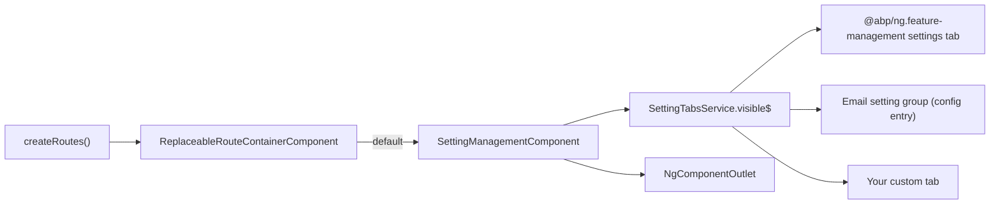
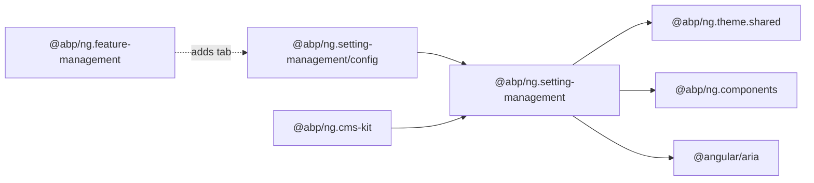
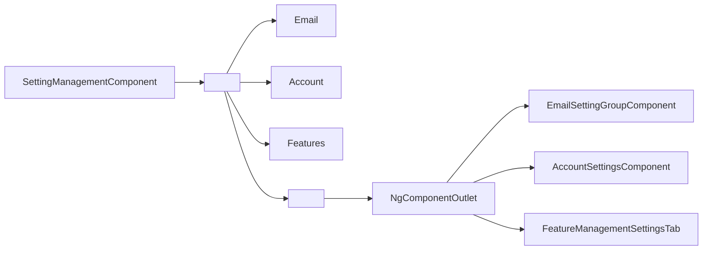
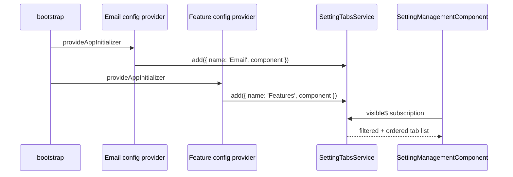

`@abp/ng.setting-management` powers the "Settings" admin page in ABP Framework Angular applications. It renders a tabbed view where each tab is contributed by another package — feature management, account, email, and any custom module. The source is `npm/ng-packs/packages/setting-management/`. The library exposes the main entry point plus `@abp/ng.setting-management/config` and `@abp/ng.setting-management/proxy` secondary entry points.

## Package metadata

`npm/ng-packs/packages/setting-management/package.json` ships `@abp/ng.setting-management` and depends at runtime on `@abp/ng.components`, `@abp/ng.theme.shared`, and `tslib`, with a peer dependency on `@angular/aria` (for the tab primitives used inside the page).

Three `ng-package.json` files mark the publishable entry points:

| Path | Import | Purpose |
| --- | --- | --- |
| `npm/ng-packs/packages/setting-management/` | `@abp/ng.setting-management` | Page component and routes. |
| `npm/ng-packs/packages/setting-management/config/` | `@abp/ng.setting-management/config` | `SettingTabsService`, contributor providers, and the email setting group component. |
| `npm/ng-packs/packages/setting-management/proxy/` | `@abp/ng.setting-management/proxy` | Generated DTOs/services for `Volo.Abp.SettingManagement.HttpApi`. |

## Folder map

`npm/ng-packs/packages/setting-management/src/lib/`:

| Folder / file | Role |
| --- | --- |
| `components/setting-management.component.ts` | `SettingManagementComponent` — the tabbed settings shell. |
| `components/setting-management.component.html` | Template that renders tabs using `Tabs`, `TabList`, `Tab`, `TabPanel` from `@angular/aria/tabs`. |
| `enums/components.ts` | `eSettingManagementComponents.SettingManagement` replaceable key. |
| `enums/route-names.ts` | Route name constants reused by hosts. |
| `setting-management.routes.ts` | The `createRoutes()` factory and the empty `provideSettingManagement()` helper. |
| `setting-management-routing.module.ts`, `setting-management.module.ts` | Legacy NgModule glue. |

`npm/ng-packs/packages/setting-management/src/public-api.ts` exports `SettingManagementModule`, `SettingManagementComponent`, the enums, and the routes factory.

## Route

`npm/ng-packs/packages/setting-management/src/lib/setting-management.routes.ts` exposes:

- `provideSettingManagement()` — returns `[]` today; included to mirror the contributor-style API used by other modules so future versions can plug new tokens without breaking host apps.
- `createRoutes()` — a single route at `''` that is `authGuard`-protected, requires policy `AbpAccount.SettingManagement`, and resolves to `SettingManagementComponent` (replaceable via `eSettingManagementComponents.SettingManagement`).

```ts
import { createRoutes as settingRoutes } from '@abp/ng.setting-management';

export const routes: Routes = [
  { path: 'setting-management', loadChildren: () => Promise.resolve(settingRoutes()) },
];
```

## SettingManagementComponent

`npm/ng-packs/packages/setting-management/src/lib/components/setting-management.component.ts` is a standalone component that injects `SettingTabsService` from `@abp/ng.setting-management/config`. It subscribes to `settingTabsService.visible$` to receive the array of `ABP.Tab` descriptors (filtered by permission) and renders each tab through `<ng-template ngTabPanel>` and `<ng-container *ngComponentOutlet>` from `@angular/common`.

The component imports list — exposed verbatim in the source — is:

```ts
imports: [
  NgComponentOutlet,
  PageComponent,
  LocalizationPipe,
  PermissionDirective,
  ForDirective,
  Tabs,
  TabList,
  Tab,
  TabPanel,
],
```

`PageComponent` comes from `@abp/ng.components/page` so the settings page picks up the standard ABP chrome. `LocalizationPipe`, `PermissionDirective`, and `ForDirective` are all standalone exports of `@abp/ng.core`.



## SettingTabsService (config entry point)

`npm/ng-packs/packages/setting-management/config/src/lib/` exposes the contributor API and the default tabs:

- `SettingTabsService` — observable list of tabs filtered by permission and a public `add(tabs)` method other packages call.
- `policy-names.ts`, `route-names.ts`, `setting-tab-names.ts` — string constants reused by hosts.
- `email-setting-group/email-setting-group.component.ts` — `EmailSettingGroupComponent` registered as the default "Email Setting Group" tab.
- `providers/features.token.ts` and `providers/route.provider.ts` — the multi-providers wiring the email group into `SettingTabsService` at bootstrap.

The package's `public-api.ts` (`npm/ng-packs/packages/setting-management/config/src/public-api.ts`) shows the full surface:

```ts
export * from './lib/components/email-setting-group/email-setting-group.component';
export * from './lib/enums';
export * from './lib/providers';
export * from './lib/proxy';
export * from './lib/services';
export * from './lib/setting-management-config.module';
```

## Replaceable component key

```ts
export const enum eSettingManagementComponents {
  SettingManagement = 'SettingManagement.SettingManagementComponent',
}
```

Replace the entire page through `ReplaceableComponentsService.add({ key, component })` from `@abp/ng.core`.

## Bootstrapping

Most apps register the route only — the contributor side is wired automatically because `@abp/ng.feature-management` and `@abp/ng.setting-management/config` register themselves into `SettingTabsService` during their own provider setup. A typical host file looks like:

```ts
providers: [
  provideAbpCore(withOptions({ environment })),
  provideAbpOAuth(),
  provideAbpThemeShared(),
  provideFeatureManagementConfig(),
],
```

The setting page picks up tabs as packages register them; there is no `provideSettingManagement(...)` call to maintain.

## Contributing a custom tab

The contributor pattern requires three steps:

<Steps>
  <Step title="Build a tab component">
    Author a standalone Angular component that renders the settings UI. Use the `SettingManagementService` from `@abp/ng.setting-management/proxy` to read/write settings against `/api/setting-management`.
  </Step>
  <Step title="Register it with SettingTabsService">
    In your module's provider list call `inject(SettingTabsService).add([{ name: 'MyTab', component: MyTabComponent, order: 100, requiredPolicy: 'MyPolicy' }])` from a `provideAppInitializer` block.
  </Step>
  <Step title="Confirm permission filtering">
    `SettingTabsService` filters tabs by the user's permissions; supply `requiredPolicy` so the tab only renders when the policy is granted.
  </Step>
</Steps>

## Proxy entry point

`npm/ng-packs/packages/setting-management/proxy/` is the generated Angular client for the server-side `Volo.Abp.SettingManagement.HttpApi`. It exposes `SettingManagementService` and the DTOs used to update grouped settings (`UpdateSettingDto`, `SettingDto`, etc.). The proxy was produced by the schematic described in `angular/schematics-and-generators`.

## Module shim

`npm/ng-packs/packages/setting-management/src/lib/setting-management.module.ts` exists for non-standalone consumers; it imports the standalone components and delegates configuration to `provideSettingManagement()`. The companion `setting-management-routing.module.ts` registers the same route shape via `RouterModule.forChild`.

## Dependency map



`@abp/ng.cms-kit` declares `@abp/ng.setting-management` as a runtime dependency precisely because it contributes the "CMS Kit" settings tab through the same `SettingTabsService` API.

<Tip>
Use the `config` entry point (`@abp/ng.setting-management/config`) for cross-module integrations — it carries the contributor API without forcing the consumer to depend on the page component, keeping bundles smaller for theme libraries that only contribute tabs.
</Tip>

## SettingTabsService internals

`SettingTabsService` keeps a `BehaviorSubject<ABP.Tab[]>` of contributed tabs. The `visible$` observable derived from it filters tabs by `requiredPolicy` against `PermissionService` from `@abp/ng.core`, then sorts by the optional `order` field. Tabs without an explicit order keep their registration order.

Adding tabs from another module is straightforward:

```ts
import { SettingTabsService } from '@abp/ng.setting-management/config';
import { provideAppInitializer, inject } from '@angular/core';

export function provideEmailSettingsTab() {
  return provideAppInitializer(() => {
    inject(SettingTabsService).add([
      {
        name: 'AbpEmailing::Menu:EmailSettings',
        order: 1,
        component: EmailSettingGroupComponent,
        requiredPolicy: 'SettingManagement.Emailing',
      },
    ]);
  });
}
```

This is precisely the recipe `@abp/ng.feature-management` and `@abp/ng.cms-kit/admin` use to add their tabs.

## EmailSettingGroupComponent

`npm/ng-packs/packages/setting-management/config/src/lib/components/email-setting-group/email-setting-group.component.ts` is the default email setting renderer registered by the config entry point. It reads `SettingManagementService.getAllSettings('Emailing')` from `@abp/ng.setting-management/proxy`, generates a reactive form using `FormPropList` from `@abp/ng.components/extensible`, and submits changes via `SettingManagementService.setAll(input)`. The component is fully standalone and depends on `@abp/ng.theme.shared` for the form components.

## Template internals

`npm/ng-packs/packages/setting-management/src/lib/components/setting-management.component.html` arranges the tabs vertically on the left (using `<abp-tab-list>` from `@angular/aria/tabs`) and the active panel content on the right. Each `<abp-tab-panel>` uses `<ng-container *ngComponentOutlet="selected.component">` to render the contributed component dynamically. The component template also wraps everything in `<abp-page>` so the title and breadcrumb match the rest of the admin chrome.



## Provider helpers in the config entry point

`npm/ng-packs/packages/setting-management/config/src/lib/providers/` ships small provider helpers:

- `features.token.ts` — declares the multi-provider feature flag that adds the email group when enabled.
- `route.provider.ts` — exposes `SETTING_MANAGEMENT_ROUTE_PROVIDERS`, the multi-provider list that registers the setting management menu items into the application sidebar.

The `setting-management-config.module.ts` ties them together for legacy non-standalone hosts.

## Replaceable key example

```ts
import { ReplaceableComponentsService, eSettingManagementComponents } from '@abp/ng.core';
import { MyCustomSettingsComponent } from './my-settings.component';

inject(ReplaceableComponentsService).add({
  key: eSettingManagementComponents.SettingManagement,
  component: MyCustomSettingsComponent,
});
```

After this call the `ReplaceableRouteContainerComponent` registered in the route renders `MyCustomSettingsComponent` instead of `SettingManagementComponent` whenever the user navigates to the settings URL.

## Permission policy

The default policy is `AbpAccount.SettingManagement` (declared in `npm/ng-packs/packages/setting-management/src/lib/setting-management.routes.ts`). Users without this policy never reach the page because `permissionGuard` from `@abp/ng.core` intercepts the navigation. Custom apps can override the policy by replacing the entire component (via the replaceable key) and applying a different `requiredPolicy` in their own route data.

## Proxy entry point

`npm/ng-packs/packages/setting-management/proxy/` is the Angular client for `Volo.Abp.SettingManagement.HttpApi`. The primary service `SettingManagementService` exposes `getAllSettings(providerName)`, `setAll(input)`, and provider-specific helpers. Contributor components call it directly to read/write the settings they own.

## Why provideSettingManagement() returns an empty array

`provideSettingManagement()` exists today as an explicit no-op. The function is exported anyway so future versions can introduce additional configuration tokens without breaking existing host code. Calling it in the route's `providers` array is a low-friction insurance policy for upcoming features such as a custom tab order strategy or a configurable default tab.

## Settings auto-discovery flow



The page never knows how many tabs exist at compile time; everything is discovered at runtime through the service.
