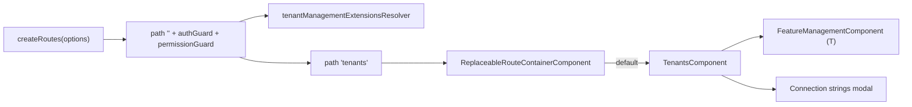
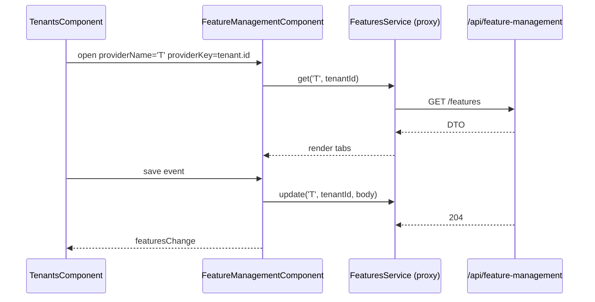
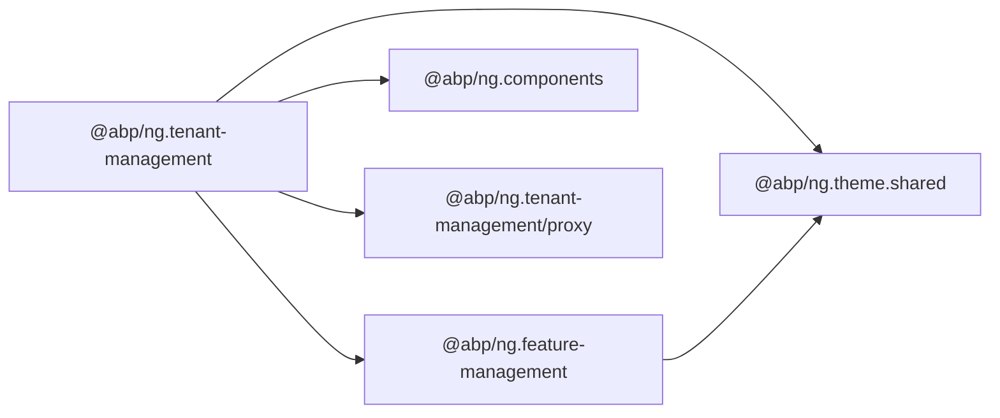
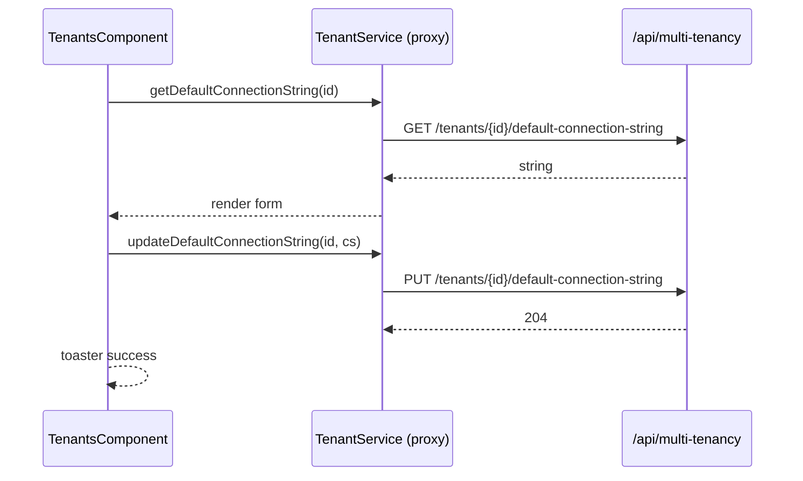
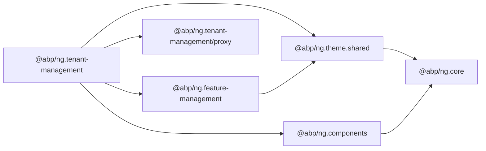

`@abp/ng.tenant-management` is the Angular UI for the ABP Framework `Volo.Abp.TenantManagement` module. It ships a single admin page (`/tenant-management/tenants`) that lists tenants, supports create/edit/delete/connection-strings/features actions, and integrates with `@abp/ng.feature-management` for the per-tenant feature toggle modal. The source is `npm/ng-packs/packages/tenant-management/` and the public surface is `npm/ng-packs/packages/tenant-management/src/public-api.ts`.

## Package metadata

`npm/ng-packs/packages/tenant-management/package.json` declares the name `@abp/ng.tenant-management` and depends on `@abp/ng.feature-management`, `@abp/ng.theme.shared`, and `tslib`. Three publishable entry points exist:

| Path | Import | Purpose |
| --- | --- | --- |
| `npm/ng-packs/packages/tenant-management/` | `@abp/ng.tenant-management` | Page component, routes, contributors. |
| `npm/ng-packs/packages/tenant-management/proxy/` | `@abp/ng.tenant-management/proxy` | Generated DTOs/services for `Volo.Abp.TenantManagement.HttpApi`. |
| `npm/ng-packs/packages/tenant-management/config/` | `@abp/ng.tenant-management/config` | Suite-generated default configuration helpers. |

## Folder map

`npm/ng-packs/packages/tenant-management/src/lib/`:

| Folder / file | Role |
| --- | --- |
| `components/tenants/tenants.component.ts` | `TenantsComponent` — list + CRUD modal. |
| `defaults/default-tenants-entity-props.ts` | Columns: `Name`, `Edition` (where applicable). |
| `defaults/default-tenants-entity-actions.ts` | Actions: `Edit`, `ManageFeatures`, `ManageConnectionStrings`, `Delete`. |
| `defaults/default-tenants-toolbar-actions.ts` | Toolbar buttons (e.g. `NewTenant`). |
| `defaults/default-tenants-form-props.ts` | Create/edit form fields. |
| `enums/components.ts` | `eTenantManagementComponents.Tenants` replaceable key. |
| `guards/` | Internal guards reused by the resolvers. |
| `models/config-options.ts` | `TenantManagementConfigOptions`. |
| `resolvers/tenant-management-extensions.resolver.ts` | Merges contributors into `ExtensionsService`. |
| `tokens/extensions.token.ts` | `TENANT_MANAGEMENT_*_CONTRIBUTORS`. |
| `tenant-management.routes.ts` | `createRoutes(options)` and `provideTenantManagement`. |
| `tenant-management-routing.module.ts`, `tenant-management.module.ts` | Legacy NgModule. |

## Public surface

`npm/ng-packs/packages/tenant-management/src/public-api.ts`:

```ts
export * from './lib/components';
export * from './lib/enums';
export * from './lib/guards';
export * from './lib/models';
export * from './lib/tenant-management.module';
export * from './lib/tokens';
export * from './lib/resolvers';
export * from './lib/tenant-management.routes';
```

## Route shape

`npm/ng-packs/packages/tenant-management/src/lib/tenant-management.routes.ts` exports `provideTenantManagement(options)` (binding contributor tokens) and `createRoutes(options)`. The route tree is:

| Path | Component | Guard | Replaceable key |
| --- | --- | --- | --- |
| `''` (parent) | `RouterOutletComponent` | `authGuard` + `permissionGuard` | — |
| `''` → `tenants` | redirect | — | — |
| `tenants` | `TenantsComponent` (via `ReplaceableRouteContainerComponent`) | inherited | `eTenantManagementComponents.Tenants` |

The parent route runs `tenantManagementExtensionsResolver` so any contributor maps the host passes through `createRoutes(...)` end up registered with `ExtensionsService` before the page activates.



## TenantsComponent

`npm/ng-packs/packages/tenant-management/src/lib/components/tenants/tenants.component.ts` is the standalone component that hosts the list, the create/edit modal, the connection-strings modal, and the feature management modal. It composes:

- `ExtensibleTableComponent` (`@abp/ng.components/extensible`) for the grid.
- `PageComponent` (`@abp/ng.components/page`) for the surrounding shell.
- `ModalComponent`, `ModalCloseDirective`, `ButtonComponent`, `ConfirmationService`, `ToasterService` (`@abp/ng.theme.shared`).
- `ListService`, `TrackByService`, `LocalizationPipe` (`@abp/ng.core`).
- `FeatureManagementComponent` (`@abp/ng.feature-management`) opened with `providerName = 'T'` and the tenant id when the "Features" entity action is clicked.
- `TenantService` and DTOs (`TenantDto`, `TenantCreateDto`, `TenantUpdateDto`, `TenantConnectionStringDto`) from `@abp/ng.tenant-management/proxy`.

The component provides `EXTENSIONS_IDENTIFIER` with the value `eTenantManagementComponents.Tenants` so the contributor lists fetched from `ExtensionsService` apply to its grid and forms.

## Contributors

`npm/ng-packs/packages/tenant-management/src/lib/tokens/extensions.token.ts` exposes the contributor tokens:

| Token | Purpose |
| --- | --- |
| `TENANT_MANAGEMENT_ENTITY_PROP_CONTRIBUTORS` | Columns added to the tenant grid. |
| `TENANT_MANAGEMENT_ENTITY_ACTION_CONTRIBUTORS` | Per-row actions. |
| `TENANT_MANAGEMENT_TOOLBAR_ACTION_CONTRIBUTORS` | Toolbar buttons. |
| `TENANT_MANAGEMENT_CREATE_FORM_PROP_CONTRIBUTORS` | Create form fields. |
| `TENANT_MANAGEMENT_EDIT_FORM_PROP_CONTRIBUTORS` | Edit form fields. |

Host applications pass these through `TenantManagementConfigOptions`:

```ts
import { createRoutes as tenantRoutes } from '@abp/ng.tenant-management';

export const routes: Routes = [
  {
    path: 'tenant-management',
    loadChildren: () => Promise.resolve(tenantRoutes({
      entityPropContributors: { /* ... */ },
      toolbarActionContributors: { /* ... */ },
    })),
  },
];
```

## Default contributors

`npm/ng-packs/packages/tenant-management/src/lib/defaults/`:

- `default-tenants-entity-props.ts` — defines the `Name` (and edition where the feature exists) columns.
- `default-tenants-entity-actions.ts` — `Edit`, `ManageFeatures`, `ManageConnectionStrings`, `Delete`. The `ManageFeatures` action opens `FeatureManagementComponent` with `providerName = 'T'`.
- `default-tenants-toolbar-actions.ts` — `NewTenant` toolbar button.
- `default-tenants-form-props.ts` — `name`, `adminEmailAddress`, `adminPassword` fields.

`tenantManagementExtensionsResolver` merges these defaults with the host's contributions before activating the route.

## Connection strings modal

The `ManageConnectionStrings` entity action opens a dedicated modal inside `TenantsComponent`. It uses `TenantService.getConnectionStrings(id)` and `TenantService.updateConnectionStrings(id, body)` (both generated under `@abp/ng.tenant-management/proxy`) to read/write per-tenant connection strings.

## Replaceable key

```ts
export const enum eTenantManagementComponents {
  Tenants = 'TenantManagement.TenantsComponent',
}
```

`ReplaceableComponentsService.add({ key, component })` from `@abp/ng.core` swaps the entire page.

## Feature integration



## Dependency map



<Tip>
Tenant administration is the cleanest example of ABP's contributor pattern at work: the page renders nothing about features, connection strings, or extra columns by itself — every piece comes from a default contributor that the consumer can override or extend. Treat the route file as a recipe rather than a hard-coded UI.
</Tip>

## Inside TenantsComponent

`npm/ng-packs/packages/tenant-management/src/lib/components/tenants/tenants.component.ts` follows the same recipe as `RolesComponent` in `@abp/ng.identity`:

- `providers: [ListService, { provide: EXTENSIONS_IDENTIFIER, useValue: eTenantManagementComponents.Tenants }]` scopes the list and extensions.
- The component injects `TenantService` from `@abp/ng.tenant-management/proxy` and binds `ListService.hookToQuery(query => this.service.getList(query))` to feed the grid.
- A `selected` signal stores the currently edited tenant, `form` holds the reactive form, and `isModalVisible` and `isConnectionStringsModalVisible` and `isFeatureModalVisible` flags control the three modals.
- `ConfirmationService.warn('AbpTenantManagement::TenantDeletionConfirmationMessage', 'AreYouSure', { messageLocalizationParams: [tenant.name] })` triggers the delete confirmation.

The template `tenants.component.html` uses `<abp-page>` from `@abp/ng.components/page`, `<abp-extensible-table>` for the grid, three `<abp-modal>` instances (create/edit, connection strings, features), and `<abp-feature-management>` inside the third modal.

## Default entity actions

`npm/ng-packs/packages/tenant-management/src/lib/defaults/default-tenants-entity-actions.ts` declares these row actions:

| Action | Visible when | Implementation |
| --- | --- | --- |
| `Edit` | `AbpTenantManagement.Tenants.Update` | Loads the tenant via `TenantService.get(id)` and opens the edit modal. |
| `ManageFeatures` | `AbpFeatureManagementFeatures.Edit` | Opens `<abp-feature-management providerName="T" [providerKey]="tenant.id">`. |
| `ManageConnectionStrings` | `AbpTenantManagement.Tenants.ManageConnectionStrings` | Opens the connection strings modal. |
| `Delete` | `AbpTenantManagement.Tenants.Delete` | Confirms then calls `TenantService.delete(id)`. |

## Connection strings modal

The connection strings modal in `tenants.component.html` renders a form with one row per database configuration. The component calls `TenantService.getDefaultConnectionString(id)`, `TenantService.deleteDefaultConnectionString(id)`, `TenantService.updateDefaultConnectionString(id, connectionString)`, and equivalents for named connection strings. The DTOs `TenantConnectionStringDto` and `TenantConnectionStringsDto` describe the payload shapes.



## Resolver and contributor merge

`npm/ng-packs/packages/tenant-management/src/lib/resolvers/tenant-management-extensions.resolver.ts` is the functional resolver wired into the parent route. It reads the contributor maps from the DI tokens, merges them with the defaults in `defaults/`, and registers the resulting lists with `ExtensionsService` from `@abp/ng.components/extensible` against the key `eTenantManagementComponents.Tenants`.

## Adding a contributor

```ts
import { ToolbarAction } from '@abp/ng.components/extensible';
import { createRoutes as tenantRoutes } from '@abp/ng.tenant-management';
import { eTenantManagementComponents } from '@abp/ng.tenant-management';

export const routes: Routes = [
  {
    path: 'tenant-management',
    loadChildren: () => Promise.resolve(tenantRoutes({
      toolbarActionContributors: {
        [eTenantManagementComponents.Tenants]: [
          list => list.addTail(new ToolbarAction({
            text: 'Import CSV',
            icon: 'fa fa-file-csv',
            action: () => /* open custom modal */ undefined,
          })),
        ],
      },
    })),
  },
];
```

After bootstrap the new toolbar button appears without modifying any template.

## Replacing the entire page

```ts
import { ReplaceableComponentsService, eTenantManagementComponents } from '@abp/ng.core';

inject(ReplaceableComponentsService).add({
  key: eTenantManagementComponents.Tenants,
  component: MyCustomTenantsComponent,
});
```

`ReplaceableRouteContainerComponent` resolves the registered component before activating the route, so navigating to `tenant-management/tenants` renders `MyCustomTenantsComponent` instead.

## Proxy entry point

`npm/ng-packs/packages/tenant-management/proxy/` ships the Angular client for `Volo.Abp.TenantManagement.HttpApi`. The primary service is `TenantService` with the following methods:

- `get(id)`, `getList(input)`, `create(input)`, `update(id, input)`, `delete(id)`.
- `getDefaultConnectionString(id)`, `updateDefaultConnectionString(id, defaultConnectionString)`, `deleteDefaultConnectionString(id)`.
- `getConnectionStrings(id)`, `updateConnectionStrings(id, input)`, `deleteConnectionStrings(id, name)`.

DTOs include `TenantDto`, `TenantCreateDto`, `TenantUpdateDto`, `TenantConnectionStringDto`, `TenantConnectionStringsDto`, and the standard `PagedResultDto<TenantDto>` wrapper.

## Feature integration

The `ManageFeatures` action is hard-wired to `FeatureManagementComponent` from `@abp/ng.feature-management`. This is also why `@abp/ng.tenant-management` depends on `@abp/ng.feature-management` at runtime: there is no way to skip the integration. If a host wants to disable the per-tenant feature toggles, the supported path is to remove the action through the contributor token rather than to drop the dependency.

## Localization keys

The module relies on the `AbpTenantManagement` localization resource. Key examples:

- `AbpTenantManagement::Tenants` — page title.
- `AbpTenantManagement::NewTenant` — create button label.
- `AbpTenantManagement::DisplayName:Name` — column header for the tenant name.
- `AbpTenantManagement::TenantDeletionConfirmationMessage` — used by the delete confirmation.

Replacing those keys in your app's localization JSON adjusts the UI without code changes.

## Dependency map



The graph confirms that a host only needs to add `@abp/ng.tenant-management` to its `package.json`; every other library transitively comes along.
