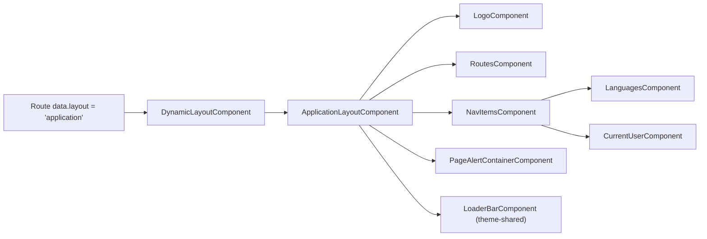
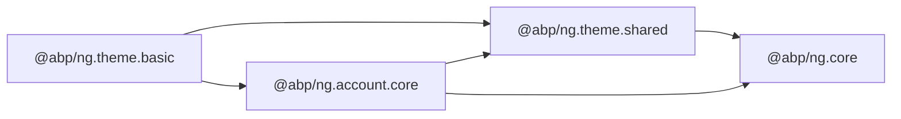
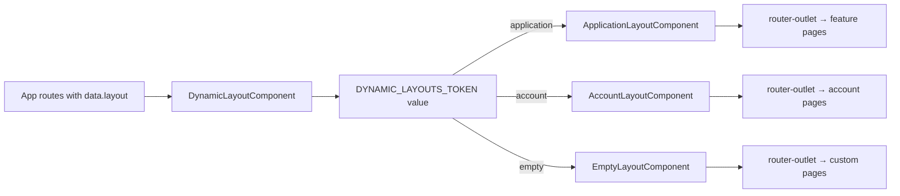

`@abp/ng.theme.basic` is the reference Bootstrap-based theme shipped with ABP Framework Angular packages. It provides the three layouts every feature module activates (`application`, `account`, `empty`), the top navigation bar, the language selector, the current user dropdown, the routes/menu component, and the page alert container. The source lives at `npm/ng-packs/packages/theme-basic/`, and the public surface is `npm/ng-packs/packages/theme-basic/src/public-api.ts`.

## Package metadata

`npm/ng-packs/packages/theme-basic/package.json` declares the package name `@abp/ng.theme.basic` and runtime dependencies on `@abp/ng.account.core`, `@abp/ng.theme.shared`, and `tslib`. The package is published under `LGPL-3.0`. Because it imports from `@abp/ng.account.core` it relies on the account screens existing — feature modules generally include `@abp/ng.account` too.

## Folder map

| Folder | Role |
| --- | --- |
| `components/application-layout/` | The post-login chrome. |
| `components/account-layout/` | The pre-login chrome wrapping login/register/etc. |
| `components/empty-layout/` | A blank `<router-outlet>` host for screens that bring their own layout. |
| `components/logo/` | `LogoComponent`. |
| `components/nav-items/` | `NavItemsComponent` plus `CurrentUserComponent` and `LanguagesComponent`. |
| `components/page-alert-container/` | Container for `PageAlertService` notifications. |
| `components/routes/` | `RoutesComponent` that materialises the side/top menu from `RoutesService`. |
| `components/validation-error/` | `ValidationErrorComponent` rendered by NgxValidate. |
| `handlers/` | `LazyStyleHandler` — loads the theme stylesheet at runtime. |
| `providers/` | `theme-basic-config.provider.ts`, `nav-item.provider.ts`, `styles.provider.ts`, `user-menu.provider.ts`. |
| `tokens/` | DI tokens for theme switching and style URLs. |
| `enums/`, `models/`, `tests/` | Supporting types and the unit tests. |

The `THEME_BASIC_COMPONENTS` constant in `npm/ng-packs/packages/theme-basic/src/lib/theme-basic.module.ts` lists every component exported by the module:

```ts
export const THEME_BASIC_COMPONENTS = [
  ApplicationLayoutComponent,
  AccountLayoutComponent,
  EmptyLayoutComponent,
  ValidationErrorComponent,
  LogoComponent,
  NavItemsComponent,
  RoutesComponent,
  CurrentUserComponent,
  LanguagesComponent,
  PageAlertContainerComponent,
  AuthWrapperComponent,
  TenantBoxComponent,
];
```

## Bootstrapping with provideThemeBasicConfig

`npm/ng-packs/packages/theme-basic/src/lib/providers/theme-basic-config.provider.ts` exports `provideThemeBasicConfig()`. The function:

1. Aggregates the multi-provider arrays `BASIC_THEME_NAV_ITEM_PROVIDERS` (`nav-item.provider.ts`), `BASIC_THEME_USER_MENU_PROVIDERS` (`user-menu.provider.ts`), and `BASIC_THEME_STYLES_PROVIDERS` (`styles.provider.ts`).
2. Wires NgxValidate's `VALIDATION_ERROR_TEMPLATE` to `ValidationErrorComponent`, sets `VALIDATION_TARGET_SELECTOR = '.form-group'`, and `VALIDATION_INVALID_CLASSES = 'is-invalid'`.
3. Registers `LazyStyleHandler` and triggers it inside `provideAppInitializer` so the Bootstrap stylesheet is fetched before the first paint.

```ts
import { provideThemeBasicConfig } from '@abp/ng.theme.basic';

bootstrapApplication(AppComponent, {
  providers: [
    provideAbpCore(withOptions({ environment })),
    provideAbpOAuth(),
    provideAbpThemeShared(),
    provideThemeBasicConfig(),
  ],
});
```

`ThemeBasicModule.forRoot()` in `theme-basic.module.ts` delegates to the same provider and is marked `@deprecated`.

## Layouts

Each layout registers itself against `DYNAMIC_LAYOUTS_TOKEN` (from `@abp/ng.core`) via `BASIC_THEME_NAV_ITEM_PROVIDERS` and is consumed by `DynamicLayoutComponent`. The default mapping (defined in `npm/ng-packs/packages/core/src/lib/constants/default-layouts.ts`) is:

| Route data `layout` | Component |
| --- | --- |
| `application` | `ApplicationLayoutComponent` |
| `account` | `AccountLayoutComponent` |
| `empty` | `EmptyLayoutComponent` |

### ApplicationLayoutComponent

`npm/ng-packs/packages/theme-basic/src/lib/components/application-layout/application-layout.component.ts` is the post-login shell. Its template hosts:

- `<abp-logo>` from `LogoComponent`.
- `<abp-routes>` from `RoutesComponent`, which renders the navigation tree returned by `RoutesService`.
- `<abp-nav-items>` from `NavItemsComponent`, which renders right-aligned items contributed by `NavItemsService` — including `LanguagesComponent` and `CurrentUserComponent` by default.
- `<abp-loader-bar>` and `<abp-page-alert-container>` from `@abp/ng.theme.shared` and `PageAlertContainerComponent`.

### AccountLayoutComponent

`npm/ng-packs/packages/theme-basic/src/lib/components/account-layout/account-layout.component.ts` is the pre-login shell. It composes:

- `AuthWrapperComponent` (`account-layout/auth-wrapper/`) — controls the two-column hero layout and the tenant box.
- `TenantBoxComponent` (`account-layout/tenant-box/`) — invokes `TenantBoxService` from `@abp/ng.account.core` to switch tenants.
- A `<router-outlet>` for the underlying account screens.

### EmptyLayoutComponent

`npm/ng-packs/packages/theme-basic/src/lib/components/empty-layout/` renders only a `<router-outlet>` — useful for full-screen wizards or embedded views.



## Navigation

`npm/ng-packs/packages/theme-basic/src/lib/components/routes/routes.component.ts` reads from `RoutesService` (declared in `@abp/ng.core`'s tokens) to produce a hierarchical menu. The component supports nesting, icon classes, route parameters, and the same `requiredPolicy` filter used by `permissionGuard`. Items hidden by permissions never reach the DOM.

`NavItemsComponent` and its sub-components (`current-user`, `languages`) live under `npm/ng-packs/packages/theme-basic/src/lib/components/nav-items/`. They consume:

- `NavItemsService` from `@abp/ng.theme.shared` for arbitrary contributions.
- `UserMenuService` from `@abp/ng.theme.shared`, seeded by `BASIC_THEME_USER_MENU_PROVIDERS`, for the dropdown items under the user avatar.
- `ConfigStateService` from `@abp/ng.core` for the current user and the available languages.

## Styles loader

`npm/ng-packs/packages/theme-basic/src/lib/handlers/lazy-style.handler.ts` lazy-loads Bootstrap and the FontAwesome stylesheet so the bundle stays small. The list of URLs is provided by `BASIC_THEME_STYLES_PROVIDERS` (`providers/styles.provider.ts`).

## Validation error component

`ValidationErrorComponent` (`components/validation-error/`) is the template NgxValidate uses to render error messages under each form control. The provider registration is part of `provideThemeBasicConfig()`.

## Auth wrapper and tenant box

The account experience leans on the `AuthWrapperService` and `TenantBoxService` from `@abp/ng.account.core`. The wrapping components live under `npm/ng-packs/packages/theme-basic/src/lib/components/account-layout/`:

- `AuthWrapperComponent` arranges branding, tenant selector, and the projected content (login form / register form / etc.).
- `TenantBoxComponent` calls `TenantBoxService.changeTenant` to switch the multi-tenant context, persists the choice through `SessionStateService`, and replays into `ConfigStateService.refreshAppState()`.

## Customisation paths

<CardGroup cols={2}>
  <Card title="Custom logo" icon="image">
    Replace the `LOGO` token from `@abp/ng.theme.shared` after calling `provideThemeBasicConfig()` to swap the logo URL.
  </Card>
  <Card title="Brand styles" icon="palette">
    Override entries in `BASIC_THEME_STYLES_PROVIDERS` so the lazy stylesheet loader fetches your own bundle.
  </Card>
  <Card title="Custom layout" icon="table-columns">
    Register a new component under `DYNAMIC_LAYOUTS_TOKEN` and reference it by its `layout` key in route data — the dynamic layout component will pick it.
  </Card>
  <Card title="Replaceable user menu" icon="user">
    Provide alternative entries through `UserMenuService.add(...)` or by re-providing `BASIC_THEME_USER_MENU_PROVIDERS` after the theme.
  </Card>
</CardGroup>

## Dependency map



The single import chain means every project that pulls `@abp/ng.theme.basic` automatically receives `@abp/ng.theme.shared`, `@abp/ng.account.core`, and `@abp/ng.core` — exactly the runtime stack the layouts need.

<Tip>
If you write a custom theme, mirror the public surface of `@abp/ng.theme.basic`: export the three layout components (registered against `DYNAMIC_LAYOUTS_TOKEN`), provide a `LogoComponent` analogue, and contribute nav items through `NavItemsService` and `UserMenuService`. The rest of the framework will pick up the changes without any code modification.
</Tip>

## Inside ApplicationLayoutComponent

`npm/ng-packs/packages/theme-basic/src/lib/components/application-layout/application-layout.component.ts` is a standalone component that imports `LogoComponent`, `RoutesComponent`, `NavItemsComponent`, `PageAlertContainerComponent`, and the `LoaderBarComponent` from `@abp/ng.theme.shared`. The accompanying template `application-layout.component.html` is organised into:

1. A top navbar wrapping `<abp-logo>`, the responsive toggle, `<abp-routes>` (with `[smallScreen]="true"` on mobile), and `<abp-nav-items>` aligned to the right.
2. A `<abp-page-alert-container>` block right under the navbar.
3. The main `<router-outlet>` inside `<main class="container-fluid">`.
4. Optional `<footer>` projected content.

The component reads from `ConfigStateService` to gate certain features behind permissions and from `LocalizationService` to render translated labels.

## Inside AccountLayoutComponent

`npm/ng-packs/packages/theme-basic/src/lib/components/account-layout/account-layout.component.ts` imports `AuthWrapperComponent` and `TenantBoxComponent` from the same folder. The template defines a two-column hero: the left column holds the branding and tenant box, the right column holds the projected `<router-outlet>` content (login, register, etc.).

`AuthWrapperComponent` looks up the current route's `tenantBoxVisible` data and the `AuthWrapperService.config$` observable from `@abp/ng.account.core` to decide whether to render the tenant box and the auth wrapper background. `TenantBoxComponent` calls `TenantBoxService.findTenant` and updates the session via `SessionStateService.setTenant`.

## RoutesComponent

`npm/ng-packs/packages/theme-basic/src/lib/components/routes/routes.component.ts` builds the navigation tree from `RoutesService.tree$`. Each `RouteContainer` carries:

- `name` — the localization key.
- `path` — the route segment.
- `iconClass` — optional icon (FontAwesome class).
- `requiredPolicy` — optional ABP policy.
- `parentName` — to nest under another route.
- `order` — ordering.

The component automatically hides items the current user cannot access (delegating to `PermissionService` from `@abp/ng.core`) and emits CSS classes that activate the Bootstrap collapse behaviour on mobile.

## CurrentUserComponent and LanguagesComponent

`current-user.component.ts` reads `ConfigStateService.currentUser$` and renders an avatar dropdown populated by `UserMenuService`. The dropdown items declared by `BASIC_THEME_USER_MENU_PROVIDERS` include "My Account", "Sign out", and "Security logs"; each one carries a `requiredPolicy` filter.

`languages.component.ts` lists available languages from `ConfigStateService.languages$` and triggers `SessionStateService.setLanguage(lang)` when the user picks one. The session service then asks `ConfigStateService.refreshAppState()` to fetch translated resources for the new language and updates the `<html lang>` attribute through `RouteBasedCultureService` from `@abp/ng.core`.

## LazyStyleHandler

`npm/ng-packs/packages/theme-basic/src/lib/handlers/lazy-style.handler.ts` registers each URL declared in `BASIC_THEME_STYLES_PROVIDERS` against `LazyLoadService` from `@abp/ng.core`. The handler runs inside `provideAppInitializer` so styles arrive before the first render. Replacing `BASIC_THEME_STYLES_PROVIDERS` (`providers/styles.provider.ts`) is the supported way to point the loader at a custom Bootstrap or FontAwesome bundle.

## Tokens

The theme-basic package adds a small set of tokens under `npm/ng-packs/packages/theme-basic/src/lib/tokens/`:

- `THEME_BASIC_LOGO_URL` — alternative to overriding the `LOGO` token from `@abp/ng.theme.shared`.
- Tokens that name specific style URL slots — useful when tooling needs to swap one stylesheet without touching the rest.

## PageAlertContainerComponent

`page-alert-container/` renders the inline alerts emitted by `PageAlertService` from `@abp/ng.theme.shared`. Each module can call `pageAlertService.add({ type: 'warning', title, message })` to show alerts above the main content area. The container takes care of de-duplication and dismissal events.

## ValidationErrorComponent

`npm/ng-packs/packages/theme-basic/src/lib/components/validation-error/validation-error.component.ts` is the template rendered by `@ngx-validate/core` under each invalid form control. It reads the resolved error messages from the validation engine and applies Bootstrap's `.invalid-feedback` class so the error appears in the right visual position.

## How theme switching works

The schematic `change-theme` in `@abp/ng.schematics` (see `angular/schematics-and-generators.mdx`) rewrites a host app's providers from `provideThemeBasicConfig()` to a different theme's provider call. Because every theme implements the same contracts (registering layouts against `DYNAMIC_LAYOUTS_TOKEN`, contributing user-menu items via `UserMenuService`, etc.), feature modules never need to be touched.


