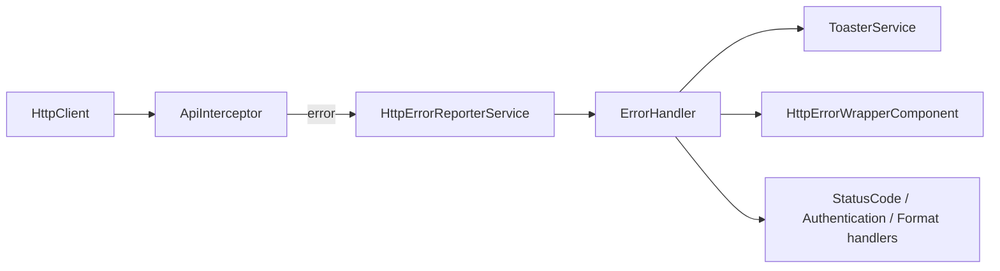
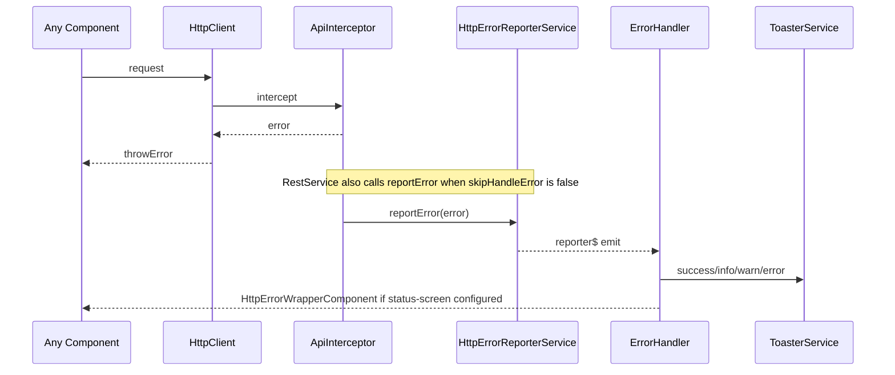

`@abp/ng.theme.shared` is the theme-agnostic UI library every ABP Framework Angular theme builds on top of. It contributes the toast, modal, confirmation, loader, breadcrumb, http-error wrapper, and ngx-datatable integrations, plus the validation glue that makes server-side validation feel native. The source is `npm/ng-packs/packages/theme-shared/` and the public surface is `npm/ng-packs/packages/theme-shared/src/public-api.ts`.

## Package metadata

`npm/ng-packs/packages/theme-shared/package.json` lists the runtime dependencies that explain the package's footprint: `@abp/ng.core`, `@fortawesome/fontawesome-free`, `@ng-bootstrap/ng-bootstrap`, `@ngx-validate/core`, `@popperjs/core`, `@swimlane/ngx-datatable`, `bootstrap`, and `tslib`. Together they define the visual language: Bootstrap 5 components styled with FontAwesome icons, ngx-datatable for grids, NgxValidate for form errors, and ng-bootstrap for non-jQuery widgets.

## Folder map

| Folder | What lives there |
| --- | --- |
| `adapters/` | Bridges to outside libraries — for instance ngx-datatable column adapters. |
| `animations/` | Reusable Angular animation factories used by toasts and modals. |
| `components/` | All Angular components: `breadcrumb/`, `button/`, `card/`, `checkbox/`, `confirmation/`, `form-input/`, `http-error-wrapper/`, `internet-connection-status/`, `loader-bar/`, `loading/`, `modal/`, `password/`, `spinner/`, `toast/`, `toast-container/`. |
| `constants/` | `default-errors.ts`, `scripts.ts`, `styles.ts`, `validation.ts` — the lookup tables shared across packages. |
| `directives/` | `disabled.directive.ts`, `ellipsis.directive.ts`, `loading.directive.ts`, `ngx-datatable-default.directive.ts`, `ngx-datatable-list.directive.ts`, `visible.directive.ts`. |
| `handlers/` | `DocumentDirHandlerService` (RTL), `ErrorHandler` (global toast for runtime errors), navigation-related listeners. |
| `models/` | `confirmation.ts`, `nav-item.ts`, `statistics.ts`, `toaster.ts`, `user-menu.ts`, `validation.ts`. |
| `providers/` | The `provideAbpThemeShared` feature factories plus the bootstrapping aggregates. |
| `services/` | `ToasterService`, `ConfirmationService`, `PageAlertService`, error handler services, `AbstractMenuService`, `NavItemsService`, `UserMenuService`. |
| `tokens/` | DI tokens like `HTTP_ERROR_CONFIG`, `CONFIRMATION_ICONS`, `THEME_CHANGE`, `LOGO`, `THEME_SHARED_APPEND_CONTENT`, `NGX_DATATABLE_MESSAGES`. |
| `utils/` | Date parser/formatter wrappers, validation default-blueprint helpers. |
| `theme-shared.module.ts` | NgModule and the legacy `ThemeSharedModule.forRoot()` shim. |

## Bootstrapping with provideAbpThemeShared

`npm/ng-packs/packages/theme-shared/src/lib/providers/theme-shared-config.provider.ts` exposes `provideAbpThemeShared()` together with these feature functions:

- `withHttpErrorConfig(config: HttpErrorConfig)` — replaces the default `HTTP_ERROR_CONFIG` so the `HttpErrorWrapperComponent` (`components/http-error-wrapper/`) shows a custom layout per status code.
- `withValidationBluePrint(bluePrints)` — merges custom validation blueprints with `DEFAULT_VALIDATION_BLUEPRINTS` (`constants/validation.ts`).
- `withValidationMapErrorsFn(mapErrorsFn)` — overrides the function NgxValidate uses to translate `ValidationErrors` into human messages.
- `withValidateOnSubmit(boolean)` — toggles the global "validate on submit" behaviour.
- `withConfirmationIcon(icons)` — replaces the icons in `ConfirmationComponent`.

```ts
import { provideAbpThemeShared, withHttpErrorConfig, withConfirmationIcon } from '@abp/ng.theme.shared';

provideAbpThemeShared(
  withHttpErrorConfig({ errorScreen: { component: MyErrorComponent } }),
  withConfirmationIcon({ success: 'fa fa-thumbs-up' }),
);
```

The `provideAppInitializer` block inside `provideAbpThemeShared` eagerly instantiates `ErrorHandler`, `THEME_SHARED_APPEND_CONTENT`, and `DocumentDirHandlerService` so that global error handling and RTL handling are wired before the first render.

## Components

All UI primitives sit under `npm/ng-packs/packages/theme-shared/src/lib/components/`. They are re-exported by `theme-shared.module.ts` and listed in the `THEME_SHARED_EXPORTS` array:

<AccordionGroup>
  <Accordion title="Toast" icon="message">
    `ToastComponent` and `ToastContainerComponent` (`components/toast/`, `components/toast-container/`) consume the `ToasterService` (`services/toaster.service.ts`). The service exposes `success`, `info`, `warn`, and `error` methods plus a `clearAll()` helper.
  </Accordion>
  <Accordion title="Modal" icon="window-restore">
    `ModalComponent` (`components/modal/`) and the standalone `ModalCloseDirective` provide a Bootstrap-styled modal with `[open]` two-way binding. Internally uses `ContentProjectionService` from `@abp/ng.core` to support template projection.
  </Accordion>
  <Accordion title="Confirmation" icon="circle-check">
    `ConfirmationComponent` plus the `ConfirmationService` (`services/confirmation.service.ts`) expose `success`, `info`, `warn`, `error` confirmation dialogs returning RxJS observables of `Confirmation.Status`. Icons are configurable via `CONFIRMATION_ICONS`.
  </Accordion>
  <Accordion title="LoaderBar and Spinner" icon="spinner">
    `LoaderBarComponent` (`components/loader-bar/`) listens to `RouterEventsService` and `HttpWaitService` to render the top progress bar. `SpinnerComponent` provides per-content spinners used by `LoadingDirective`.
  </Accordion>
  <Accordion title="Breadcrumb" icon="route">
    `BreadcrumbComponent` and `BreadcrumbItemsComponent` (`components/breadcrumb/`, `components/breadcrumb-items/`) derive breadcrumb entries from the current route hierarchy and `RoutesService`.
  </Accordion>
  <Accordion title="Form widgets" icon="rectangle-list">
    `ButtonComponent`, `FormInputComponent`, `FormCheckboxComponent`, `PasswordComponent`, and the `CardModule` provide consistent form/control templates with validation rendering powered by NgxValidate.
  </Accordion>
  <Accordion title="Http Error Wrapper" icon="triangle-exclamation">
    `HttpErrorWrapperComponent` (`components/http-error-wrapper/`) is rendered whenever an HTTP error matches `HTTP_ERROR_CONFIG`. It receives the underlying error and produces the friendly 401/403/404/500 screen.
  </Accordion>
  <Accordion title="Connection status" icon="wifi">
    `InternetConnectionStatusComponent` consumes `InternetConnectionService` from `@abp/ng.core` to show a banner when the browser goes offline.
  </Accordion>
</AccordionGroup>

## Directives

`npm/ng-packs/packages/theme-shared/src/lib/directives/`:

- `LoadingDirective` (`loading.directive.ts`) — `[abpLoading]` adds an inline spinner when the bound value is `true`.
- `DisabledDirective` (`disabled.directive.ts`) — guards click handlers when the flag is set.
- `AbpVisibleDirective` (`visible.directive.ts`) — keeps the element in the DOM but toggles `visibility: hidden` (useful in flex grids).
- `NgxDatatableDefaultDirective` and `NgxDatatableListDirective` — pre-configure ngx-datatable with paging from `ListService` and ABP-specific messages from `NGX_DATATABLE_MESSAGES`.
- `EllipsisDirective` — clamps long strings with a tooltip.

## Services

`npm/ng-packs/packages/theme-shared/src/lib/services/` is where the runtime hooks live:

| Service | Responsibility |
| --- | --- |
| `ToasterService` (`toaster.service.ts`) | Pushes toast messages to `ToastContainerComponent`. |
| `ConfirmationService` (`confirmation.service.ts`) | Emits confirmation requests rendered by `ConfirmationComponent`. |
| `PageAlertService` (`page-alert.service.ts`) | Pushes inline page alerts consumed by `PageAlertContainerComponent` in `@abp/ng.theme.basic`. |
| `AbstractMenuService` (`abstract-menu.service.ts`) | Base class for menu services. |
| `NavItemsService` (`nav-items.service.ts`) | Toolbar contributions (search box, language selector, current user menu). |
| `UserMenuService` (`user-menu.service.ts`) | Items shown under the current user dropdown. |
| `ErrorHandler` (`handlers/error-handler.service.ts`) | Subscribes to `HttpErrorReporterService` from `@abp/ng.core` and renders the appropriate component. |
| `AbpFormatErrorHandlerService`, `AuthenticationErrorHandlerService`, `RouterErrorHandlerService`, `StatusCodeErrorHandlerService`, `TenantResolveErrorHandlerService`, `UnknownStatusCodeErrorHandlerService` | Each one focuses on a specific class of HTTP error. They are registered through `error-handlers.provider.ts`. |
| `CreateErrorComponentService` (`create-error-component.service.ts`) | Factory that instantiates `HttpErrorWrapperComponent` dynamically into the DOM. |



## Tokens

`npm/ng-packs/packages/theme-shared/src/lib/tokens/index.ts` re-exports the configuration tokens consumed by the providers and components:

- `HTTP_ERROR_CONFIG` (`http-error.token.ts`) — declarative config for how `ErrorHandler` should react to specific status codes (`401`, `403`, `404`, `500`, `0`, `tenantResolve`).
- `CONFIRMATION_ICONS` (`confirmation-icons.token.ts`) — icon class names used by `ConfirmationComponent`.
- `LOGO` (`logo.token.ts`) — image URL used by `@abp/ng.theme.basic`'s `LogoComponent`; configured via `withLogo()` in `logo.provider.ts`.
- `THEME_CHANGE` (`theme-change.token.ts`) — RxJS subject that themes use to react to runtime theme changes.
- `THEME_SHARED_APPEND_CONTENT` (`append-content.token.ts`) — the multi-provider list of components appended to `<body>` (e.g. the toast container).
- `NGX_DATATABLE_MESSAGES` (`ngx-datatable-messages.token.ts`) — localised messages for ngx-datatable.
- `SUPPRESS_UNSAVED_CHANGES_WARNING` (`suppress-unsaved-changes-warning.token.ts`) — overrides the default "leave without saving?" dialog.

## Validation integration

`@abp/ng.theme.shared` is the package that wires `@ngx-validate/core` to ABP's localization. `provideAbpThemeShared` registers:

- `VALIDATION_BLUEPRINTS` — `DEFAULT_VALIDATION_BLUEPRINTS` from `constants/validation.ts`.
- `VALIDATION_MAP_ERRORS_FN` — `defaultMapErrorsFn` from `@ngx-validate/core` so error messages render with ABP localization keys.
- `VALIDATION_VALIDATE_ON_SUBMIT` — defaulted via `withValidateOnSubmit(true)`.

Reactive forms inside ABP feature modules consume this configuration automatically through `FormSubmitDirective` defined in `@abp/ng.core`.

## Date and i18n helpers

The `DateParserFormatter` in `npm/ng-packs/packages/theme-shared/src/lib/utils/` is registered against `NgbDateParserFormatter` so all ng-bootstrap date pickers respect the current locale. The companion `DocumentDirHandlerService` in `src/lib/handlers/` switches the `<html dir>` attribute to `rtl` / `ltr` when the active language changes.

## Legacy module shim

`npm/ng-packs/packages/theme-shared/src/lib/theme-shared.module.ts` keeps `BaseThemeSharedModule`, `RootThemeSharedModule`, and `ThemeSharedModule` for non-standalone applications. `ThemeSharedModule.forRoot()` and `.forChild()` simply call `provideAbpThemeShared()`; both are marked `@deprecated`. Standalone apps should not import the module at all.

<Tip>
Even themes other than `@abp/ng.theme.basic` — for example `@abp/ng.theme.lepton-x` — depend on `@abp/ng.theme.shared` for toasts, confirmations, and the error wrapper. Customising the look of those primitives in one place propagates to every theme.
</Tip>

## Error pipeline in depth

`npm/ng-packs/packages/theme-shared/src/lib/handlers/` contains the registered handlers used by `provideAbpThemeShared()`. `DEFAULT_HANDLERS_PROVIDERS` from `error-handlers.provider.ts` lists each one:

| Handler | File | Triggered when |
| --- | --- | --- |
| `AbpFormatErrorHandlerService` | `services/abp-format-error-handler.service.ts` | The backend returned a structured `IRemoteServiceErrorResponse`. |
| `AuthenticationErrorHandlerService` | `services/authentication-error-handler.service.ts` | The response is 401. |
| `RouterErrorHandlerService` | `services/router-error-handler.service.ts` | The Angular router emits a navigation error. |
| `StatusCodeErrorHandlerService` | `services/status-code-error-handler.service.ts` | The status code matches one of the configured error screens. |
| `TenantResolveErrorHandlerService` | `services/tenant-resolve-error-handler.service.ts` | Multi-tenancy resolution failed. |
| `UnknownStatusCodeErrorHandlerService` | `services/unknown-status-code-error-handler.service.ts` | None of the others match. |

`ErrorHandler` from `handlers/error-handler.service.ts` is the orchestrator: it subscribes to `HttpErrorReporterService.reporter$` and delegates to the first handler whose `canHandle(error)` returns true.



## CreateErrorComponentService

`npm/ng-packs/packages/theme-shared/src/lib/services/create-error-component.service.ts` is the dynamic component factory. When `HTTP_ERROR_CONFIG` declares an `errorScreen`, the service instantiates `HttpErrorWrapperComponent` into the DOM, passing the underlying error and the configured layout. This is how the standard 401/403/404/500 pages render without requiring a router navigation.

## Validation glue

`npm/ng-packs/packages/theme-shared/src/lib/constants/validation.ts` declares `DEFAULT_VALIDATION_BLUEPRINTS`, the mapping between Angular `ValidationErrors` keys and localized resource names. The default mapping covers `required`, `minLength`, `maxLength`, `email`, `pattern`, etc. Consumers can replace any of them via `withValidationBluePrint({ requiredCustom: { key: 'MyResource::Required' } })`.

The interaction with `@ngx-validate/core` happens in two layers:

1. `VALIDATION_BLUEPRINTS` declares which resource key matches each error.
2. `VALIDATION_MAP_ERRORS_FN` (defaulted to `defaultMapErrorsFn` from NgxValidate) takes the raw `ValidationErrors` object and emits messages compatible with the `FormInputComponent` template.

`FormSubmitDirective` from `@abp/ng.core` triggers the global validation on submit; `VALIDATION_VALIDATE_ON_SUBMIT` set to `true` (the default) means errors only show after submit, not while typing.

## Adapters

`npm/ng-packs/packages/theme-shared/src/lib/adapters/` includes the small bridges to external libraries. The most notable is the `NgxDatatableMessagesAdapter` that wires `NGX_DATATABLE_MESSAGES` into the table's `[messages]` input. Combined with `NgxDatatableDefaultDirective`, every grid in the app picks up localized "no data" / "loading" / "totalMessage" strings without per-component configuration.

## Animations

`npm/ng-packs/packages/theme-shared/src/lib/animations/` carries small animation factories (slide-in/out for toasts, fade-in for modals). They are imported by the relevant components and exposed for reuse so custom widgets can match the framework's motion language.

## Append-content token

`THEME_SHARED_APPEND_CONTENT` is registered as a multi-provider with `ToastContainerComponent` and the page alert container so they are appended to `<body>` exactly once per app. The `provideAppInitializer` block inside `provideAbpThemeShared()` calls `inject(THEME_SHARED_APPEND_CONTENT)` to force the providers to instantiate during bootstrap; without that line nothing would render.

## Logo provider

`npm/ng-packs/packages/theme-shared/src/lib/providers/logo.provider.ts` exposes `withLogo()` and the `LOGO` token. The token is consumed by `LogoComponent` in `@abp/ng.theme.basic` (`npm/ng-packs/packages/theme-basic/src/lib/components/logo/logo.component.ts`). Themes that swap the logo do so by re-providing the token after the theme's `provide*Config()` call.

## Internet connection status

`npm/ng-packs/packages/theme-shared/src/lib/components/internet-connection-status/` listens to `InternetConnectionService` from `@abp/ng.core` and shows a top-of-page banner when the network is unreachable. The banner is configurable through the `SUPPRESS_UNSAVED_CHANGES_WARNING` token if you want to disable additional friction during offline editing.
