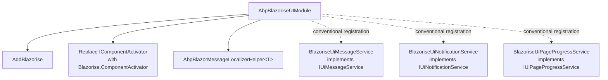

`Volo.Abp.BlazoriseUI` integrates the Blazorise component library
(Bootstrap-flavored by default) with the ABP Framework Blazor stack. It is the
historical default UI library for ABP Blazor templates and supplies the concrete
implementations behind the `IUiMessageService`, `IUiNotificationService`,
`IUiPageProgressService`, breadcrumb model, CRUD page base, extensible data grid,
and extension-property editors. All sources live under
`framework/src/Volo.Abp.BlazoriseUI/`.

## Module entry point

`AbpBlazoriseUIModule` in
`framework/src/Volo.Abp.BlazoriseUI/AbpBlazoriseUIModule.cs` declares:

```csharp
[DependsOn(
    typeof(AbpAspNetCoreComponentsWebModule),
    typeof(AbpDddApplicationContractsModule),
    typeof(AbpAuthorizationModule),
    typeof(AbpGlobalFeaturesModule),
    typeof(AbpFeaturesModule)
)]
public class AbpBlazoriseUIModule : AbpModule
{
    public override void ConfigureServices(ServiceConfigurationContext context)
    {
        ConfigureBlazorise(context);
    }

    private void ConfigureBlazorise(ServiceConfigurationContext context)
    {
        context.Services.AddBlazorise(options =>
        {
            options.Debounce = true;
            options.DebounceInterval = 800;
        });

        context.Services.Replace(
            ServiceDescriptor.Scoped<IComponentActivator, ComponentActivator>());
        context.Services.AddSingleton(typeof(AbpBlazorMessageLocalizerHelper<>));
    }
}
```

`AddBlazorise` registers Blazorise's component services with debouncing turned
on (800ms) so rapid input typing does not flood validation. The
`IComponentActivator` is replaced with Blazorise's own `ComponentActivator` (a
scoped variant). And the localizer helper (defined in
`framework/src/Volo.Abp.AspNetCore.Components.Web/Volo/Abp/AspNetCore/Components/Web/AbpBlazorMessageLocalizerHelper.cs`)
is registered as an open generic singleton so Blazorise's validation engine can
resolve `AbpBlazorMessageLocalizerHelper<T>` for any resource type.

## Message service

`BlazoriseUiMessageService` in
`framework/src/Volo.Abp.BlazoriseUI/BlazoriseUiMessageService.cs` implements
`IUiMessageService` via an `event EventHandler<UiMessageEventArgs>? MessageReceived`
and `[Dependency(ReplaceServices = true)] IScopedDependency`:

```csharp
public Task Info(string message, string? title = null, Action<UiMessageOptions>? options = null)
{
    var uiMessageOptions = CreateDefaultOptions();
    options?.Invoke(uiMessageOptions);
    MessageReceived?.Invoke(this, new UiMessageEventArgs(UiMessageType.Info, message, title, uiMessageOptions));
    return Task.CompletedTask;
}
```

The other type methods (`Success`, `Warn`, `Error`) follow the same shape, and
`Confirm` allocates a `TaskCompletionSource<bool>` that it stuffs into the
event args so the listener can complete it from a dialog button. `CreateDefaultOptions`
preloads `CenterMessage`, `ShowMessageIcon`, and the localized OK/Cancel/Yes
button labels from `IStringLocalizer<AbpUiResource>` (the localizer key set
defined in `framework/src/Localization.Resources.AbpUi/`).

`UiMessageAlert.razor(.cs)` in
`framework/src/Volo.Abp.BlazoriseUI/Components/UiMessageAlert.razor.cs`
subscribes to `MessageReceived` and renders Blazorise's `Modal` with the
appropriate icon, content, and buttons.

## Notification service

`BlazoriseUiNotificationService` in
`framework/src/Volo.Abp.BlazoriseUI/BlazoriseUiNotificationService.cs`
mirrors the message service but for toast-style notifications. It exposes
`NotificationReceived` and a `UiNotificationOptions` builder, and uses
`Blazorise.Snackbar` for the actual UI through `UiNotificationAlert.razor(.cs)`
in `framework/src/Volo.Abp.BlazoriseUI/Components/UiNotificationAlert.razor.cs`.

## Page progress

`BlazoriseUiPageProgressService` in
`framework/src/Volo.Abp.BlazoriseUI/BlazoriseUiPageProgressService.cs`:

```csharp
[Dependency(ReplaceServices = true)]
public class BlazoriseUiPageProgressService : IUiPageProgressService, IScopedDependency
{
    public event EventHandler<UiPageProgressEventArgs>? ProgressChanged;

    public Task Go(int? percentage, Action<UiPageProgressOptions>? options = null)
    {
        var uiPageProgressOptions = CreateDefaultOptions();
        options?.Invoke(uiPageProgressOptions);
        ProgressChanged?.Invoke(this, new UiPageProgressEventArgs(percentage, uiPageProgressOptions));
        return Task.CompletedTask;
    }
}
```

`UiPageProgress.razor(.cs)` in
`framework/src/Volo.Abp.BlazoriseUI/Components/UiPageProgress.razor.cs` listens
for the event and binds to Blazorise's `Bar` progress component. The
WebAssembly and MAUI HTTP message handlers (`AbpBlazorClientHttpMessageHandler`
in
`framework/src/Volo.Abp.AspNetCore.Components.WebAssembly/Volo/Abp/AspNetCore/Components/WebAssembly/AbpBlazorClientHttpMessageHandler.cs`
and `AbpMauiBlazorClientHttpMessageHandler` in
`framework/src/Volo.Abp.AspNetCore.Components.MauiBlazor/Volo/Abp/AspNetCore/Components/MauiBlazor/AbpMauiBlazorClientHttpMessageHandler.cs`)
call `IUiPageProgressService.Go(null)` before each remote request and `Go(-1)`
in `finally`.

## Breadcrumb model

`BreadcrumbItem` in
`framework/src/Volo.Abp.BlazoriseUI/BreadcrumbItem.cs` is the simple
breadcrumb record used by the theming layer:

```csharp
public class BreadcrumbItem
{
    public string Text { get; set; }
    public object? Icon { get; set; }
    public string? Url { get; set; }
    public BreadcrumbItem(string text, string? url = null, object? icon = null);
}
```

`PageLayout.BreadcrumbItems` (defined in
`framework/src/Volo.Abp.AspNetCore.Components.Web.Theming/Layout/PageLayout.cs`)
is typed as `ObservableCollection<BreadcrumbItem>`, so any page that derives
from `AbpCrudPageBase<...>` already has a working breadcrumb pipeline.

## CRUD page base

`AbpCrudPageBase` in
`framework/src/Volo.Abp.BlazoriseUI/AbpCrudPageBase.cs` is the workhorse base
for every list/create/edit page. Like its MudBlazor twin it is built as a
ladder of generic specialisations:

```csharp
public abstract class AbpCrudPageBase<TAppService, TEntityDto, TKey>
    : AbpCrudPageBase<TAppService, TEntityDto, TKey, PagedAndSortedResultRequestDto>
    where TAppService : ICrudAppService<TEntityDto, TKey>
    where TEntityDto : class, IEntityDto<TKey>, new() { }
```

The terminal base inherits from `AbpComponentBase` (see
`framework/src/Volo.Abp.AspNetCore.Components/Volo/Abp/AspNetCore/Components/AbpComponentBase.cs`)
and exposes:

- `AppService` — resolved from `LazyGetRequiredService`.
- `Entities`, `CurrentPage`, `PageSize`, `TotalCount`, `CurrentSorting`.
- `NewEntity` / `EditingEntity`.
- `TableColumns` — `TableColumnDictionary` (defined in
  `framework/src/Volo.Abp.AspNetCore.Components.Web/Volo/Abp/AspNetCore/Components/Web/Extensibility/TableColumns/TableColumnDictionary.cs`).
- `EntityActions` — `EntityActionDictionary` (in
  `framework/src/Volo.Abp.AspNetCore.Components.Web/Volo/Abp/AspNetCore/Components/Web/Extensibility/EntityActions/EntityActionDictionary.cs`).
- `GetEntitiesAsync`, `OpenCreateModalAsync`, `OpenEditModalAsync`,
  `CloseEditModalAsync`, `DeleteEntityAsync`, …

The framework's UI extension system attaches column and action contributors
through these dictionaries — a feature module that wants to add a "Lock"
action to the Users page does it by registering an `EntityAction` against the
appropriate key, without touching the page itself.

## Extensible data grid

`AbpExtensibleDataGrid.razor(.cs)` in
`framework/src/Volo.Abp.BlazoriseUI/Components/AbpExtensibleDataGrid.razor.cs`
wraps Blazorise's `DataGrid<TItem>` and binds it to `TableColumnDictionary`
and `EntityActionDictionary`. `DataGridEntityActionsColumn.razor(.cs)` next
to it renders the actions column with confirmation prompts derived from
`EntityAction.ConfirmationMessage`.

`EntityAction.razor(.cs)` and `EntityActions.razor(.cs)` are the singular and
dropdown forms used by the column. `ActionType.cs` enumerates the action
flavours (`Primary`, `Secondary`, `Default`, `Light`, `Dark`, `Link`, …) that
map to Blazorise's `Color`/`ButtonStyle` props.

## Extension properties

`framework/src/Volo.Abp.BlazoriseUI/Components/ObjectExtending/` contains the
Blazorise renderers for the framework's `Object Extending` system:

| Component | File |
| --- | --- |
| `ExtensionProperties.razor(.cs)` | `framework/src/Volo.Abp.BlazoriseUI/Components/ObjectExtending/ExtensionProperties.razor.cs` |
| `ExtensionPropertyComponentBase.cs` | base for each type |
| `TextExtensionProperty.razor(.cs)` | text input |
| `TextAreaExtensionProperty.razor(.cs)` | textarea |
| `CheckExtensionProperty.razor(.cs)` | boolean |
| `SelectExtensionProperty.razor(.cs)` | enum/list |
| `LookupExtensionProperty.razor(.cs)` | autocomplete |
| `DateTimeExtensionProperty.razor(.cs)` | date |
| `DateTimeOffsetExtensionProperty.razor(.cs)` | datetime with offset |
| `TimeExtensionProperty.razor(.cs)` | time |
| `EnumHelper.cs` | reflection helpers for enum dropdowns |
| `ExtensionPropertyModalType.cs` | `Create` / `Edit` placement |

`BlazoriseExtensionPropertyPolicyChecker` in
`framework/src/Volo.Abp.BlazoriseUI/BlazoriseExtensionPropertyPolicyChecker.cs`
checks `IPermissionDefinitionContext` against the `ObjectExtensionPropertyInfo`
to decide whether the property should be rendered at all (some properties may
be readable but not writable depending on the user's permissions).

`BlazoriseUiObjectExtensionPropertyInfoExtensions` and
`ObjectExtensionPropertyInfoBlazorExtensions` (both in
`framework/src/Volo.Abp.BlazoriseUI/`) provide the small helper methods the
renderers use to translate `ObjectExtensionPropertyInfo` metadata into
Blazorise component props.

## Page alerts and helper components

A few extra components round out the package:

- `PageAlert.razor(.cs)` in
  `framework/src/Volo.Abp.BlazoriseUI/Components/PageAlert.razor.cs` binds to
  `IAlertManager.Alerts` and renders Blazorise `Alert` controls. `AlertWrapper`
  in `framework/src/Volo.Abp.BlazoriseUI/Components/AlertWrapper.cs` keeps a
  per-render `Visible` flag so users can dismiss without mutating the list.
- `SubmitButton.razor(.cs)` and `ToolbarButton.razor(.cs)` standardise the
  "form submit" and "page-level action" buttons across CRUD pages.
- `RadarSpinner.razor` is the loading spinner used while data is fetched.
- `BlazoriseFluentSizingParse.cs` translates ABP's `Size` enum to Blazorise's
  fluent sizing API.
- `AbpBlazoriseUiModalExtensions.cs` adds helpers for opening Blazorise modals
  from imperative code without manually wiring `Modal.Show`.

## Theming layer that depends on Blazorise

The Web-Theming, Server-Theming, WebAssembly-Theming, and MauiBlazor-Theming
packages without the `.MudBlazor` suffix depend on `AbpBlazoriseUIModule`:

- `AbpAspNetCoreComponentsWebThemingModule` in
  `framework/src/Volo.Abp.AspNetCore.Components.Web.Theming/AbpAspNetCoreComponentsWebThemingModule.cs`
  declares `[DependsOn(typeof(AbpBlazoriseUIModule), typeof(AbpUiNavigationModule))]`.
- `AbpAspNetCoreComponentsServerThemingModule` chains it for server-side rendering.
- `AbpAspNetCoreComponentsWebAssemblyThemingModule` chains it for WASM.
- `AbpAspNetCoreComponentsMauiBlazorThemingModule` chains it for MAUI.

That means a starter app that picks Blazorise gets the entire layout / page
toolbar / breadcrumb pipeline for free.

## Service registration map



## Tips

<Note>
The `Confirm` method on `BlazoriseUiMessageService` returns a
`Task<bool>` whose completion source is signalled by the modal's
button-click handler. If no `UiMessageAlert` component is mounted in the
layout, the task never completes and the caller awaits forever. The default
theming module mounts `UiMessageAlert` for you — keep it there.
</Note>

<Tip>
`AbpCrudPageBase` has many generic overloads, but you almost always pick
either the three-parameter version (`TAppService`, `TEntityDto`, `TKey`) for
a simple CRUD page, or the five-parameter version when your DTOs for list,
create, and update differ. Read the chain top-to-bottom in
`framework/src/Volo.Abp.BlazoriseUI/AbpCrudPageBase.cs` to see which
parameters each layer adds.
</Tip>

<Warning>
The Blazorise UI module replaces `IComponentActivator` with Blazorise's
`ComponentActivator`. That overrides the `ServiceProviderComponentActivator`
registered by `AbpAspNetCoreComponentsWebModule` in
`framework/src/Volo.Abp.AspNetCore.Components.Web/Volo/Abp/AspNetCore/Components/Web/AbpAspNetCoreComponentsWebModule.cs`.
Blazorise's activator is a superset (it falls back to DI), so this is
intentional — but if you ever swap UI libraries make sure the new module
either keeps the Blazorise activator or restores the ABP one.
</Warning>
