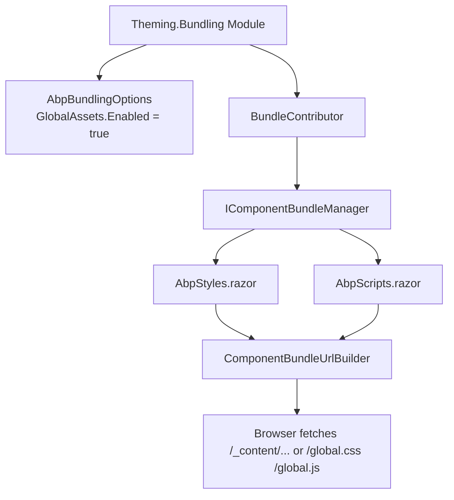

ABP Framework Blazor bundling reuses the same `Volo.Abp.AspNetCore.Mvc.UI.Bundling`
infrastructure as the MVC UI but adds host-specific contributors and a custom
bundler for MAUI. The job of these packages is to produce the `<link>` and
`<script>` tags every Blazor host renders into its shell, and — in the case of
WebAssembly and MAUI — to enable the `GlobalAssets` mode where a single
generated `global.css` / `global.js` file replaces the dozen `<link>` tags a
typical Bootstrap + Blazorise stack needs.

All sources live under:

- `framework/src/Volo.Abp.AspNetCore.Components.Server.Theming/Bundling/`
- `framework/src/Volo.Abp.AspNetCore.Components.Server.Theming.MudBlazor/Bundling/`
- `framework/src/Volo.Abp.AspNetCore.Components.WebAssembly.Theming.Bundling/`
- `framework/src/Volo.Abp.AspNetCore.Components.WebAssembly.Theming.MudBlazor.Bundling/`
- `framework/src/Volo.Abp.AspNetCore.Components.MauiBlazor.Bundling/`
- `framework/src/Volo.Abp.AspNetCore.Components.MauiBlazor.Theming.Bundling/`
- `framework/src/Volo.Abp.AspNetCore.Components.MauiBlazor.Theming.MudBlazor.Bundling/`

The shared `IBundleContributor`, `BundleContributor`, `BundleConfigurationContext`,
and `AbpBundlingOptions` types come from
`framework/src/Volo.Abp.AspNetCore.Mvc.UI.Bundling/` (covered in the `mvc-ui/bundling`
page) and `framework/src/Volo.Abp.AspNetCore.Mvc.UI.Bundling.Abstractions/`.

## How a contributor is registered

A bundling module configures `AbpBundlingOptions.StyleBundles` and
`AbpBundlingOptions.ScriptBundles` with a logical bundle name, and registers
one or more `BundleContributor` classes against it. For example, the
WebAssembly + Blazorise bundling module in
`framework/src/Volo.Abp.AspNetCore.Components.WebAssembly.Theming.Bundling/AbpAspNetCoreComponentsWebAssemblyThemingBundlingModule.cs`
does:

```csharp
Configure<AbpBundlingOptions>(options =>
{
    options.GlobalAssets.Enabled = true;
    options.GlobalAssets.GlobalStyleBundleName = BlazorWebAssemblyStandardBundles.Styles.Global;
    options.GlobalAssets.GlobalScriptBundleName = BlazorWebAssemblyStandardBundles.Scripts.Global;

    options.StyleBundles.Add(BlazorWebAssemblyStandardBundles.Styles.Global, bundle =>
    {
        bundle.AddContributors(typeof(BlazorWebAssemblyStyleContributor));
    });

    options.ScriptBundles.Add(BlazorWebAssemblyStandardBundles.Scripts.Global, bundle =>
    {
        bundle.AddContributors(typeof(BlazorWebAssemblyScriptContributor));
    });

    options.MinificationIgnoredFiles.Add(
        "_content/Microsoft.AspNetCore.Components.WebAssembly.Authentication/AuthenticationService.js");
});
```

`GlobalAssets.Enabled = true` switches the bundling engine into a mode where
all referenced files are concatenated into a single `global.css` / `global.js`
plus a debug-mode "individual files" fallback. This matters for WASM and MAUI
because the browser has to download every asset eagerly during the first load.

The bundle names are constants on a per-package
`*StandardBundles` static class — every bundling package has one:

| Package | Bundle constants | File |
| --- | --- | --- |
| Server.Theming | `BlazorStandardBundles.Styles.Global = "Blazor.Global"` / `Scripts.Global = "Blazor.Global"` | `framework/src/Volo.Abp.AspNetCore.Components.Server.Theming/Bundling/BlazorGlobalBundles.cs` |
| Server.Theming.MudBlazor | `BlazorServerMudBlazorStandardBundles.Styles/Scripts.Global = "Blazor.Global"` | `framework/src/Volo.Abp.AspNetCore.Components.Server.Theming.MudBlazor/Bundling/BlazorServerMudBlazorStandardBundles.cs` |
| WebAssembly.Theming.Bundling | `BlazorWebAssemblyStandardBundles.Styles/Scripts.Global = "BlazorWebAssembly.Global"` | `framework/src/Volo.Abp.AspNetCore.Components.WebAssembly.Theming.Bundling/BlazorWebAssemblyStandardBundles.cs` |
| WebAssembly.Theming.MudBlazor.Bundling | `BlazorWebAssemblyMudBlazorStandardBundles.Styles/Scripts.Global = "BlazorWebAssemblyMudBlazor.Global"` | `framework/src/Volo.Abp.AspNetCore.Components.WebAssembly.Theming.MudBlazor.Bundling/BlazorWebAssemblyMudBlazorStandardBundles.cs` |
| MauiBlazor.Theming.Bundling | `MauiBlazorStandardBundles.Styles/Scripts.Global = "MauiBlazor.Global"` | `framework/src/Volo.Abp.AspNetCore.Components.MauiBlazor.Theming.Bundling/MauiBlazorStandardBundles.cs` |
| MauiBlazor.Theming.MudBlazor.Bundling | `MauiBlazorMudBlazorStandardBundles.Styles/Scripts.Global = "MauiBlazorMudBlazor.Global"` | `framework/src/Volo.Abp.AspNetCore.Components.MauiBlazor.Theming.MudBlazor.Bundling/MauiBlazorMudBlazorStandardBundles.cs` |

## BundleContributor classes per package

### Server.Theming

`framework/src/Volo.Abp.AspNetCore.Components.Server.Theming/Bundling/BlazorGlobalScriptContributor.cs`:

```csharp
public class BlazorGlobalScriptContributor : BundleContributor
{
    public override void ConfigureBundle(BundleConfigurationContext context)
    {
        var options = context.ServiceProvider
            .GetRequiredService<IOptions<AbpAspNetCoreComponentsWebOptions>>().Value;
        if (!options.IsBlazorWebApp)
        {
            context.Files.AddIfNotContains("/_framework/blazor.server.js");
        }
        context.Files.AddIfNotContains("/_content/Volo.Abp.AspNetCore.Components.Web/libs/abp/js/abp.js");
        context.Files.AddIfNotContains("/_content/Volo.Abp.AspNetCore.Components.Web/libs/abp/js/authentication-state-listener.js");
    }
}
```

It conditionally injects `blazor.server.js`. When `IsBlazorWebApp` is `true` the
Blazor Web App host renders its own startup script and we must not duplicate it.

`framework/src/Volo.Abp.AspNetCore.Components.Server.Theming/Bundling/BlazorGlobalStyleContributor.cs`
adds Bootstrap, Font Awesome, `abp.css`, and Blazorise stylesheets out of
`_content/Volo.Abp.AspNetCore.Components.WebAssembly.Theming/libs/...` paths.

`BlazorServerComponentBundleManager` in
`framework/src/Volo.Abp.AspNetCore.Components.Server.Theming/Bundling/BlazorServerComponentBundleManager.cs`
implements `IComponentBundleManager` by delegating to `IBundleManager` (the
MVC UI bundler) and projecting each `BundleFile` to its `FileName`. The
`<AbpScripts />` and `<AbpStyles />` Razor components in
`framework/src/Volo.Abp.AspNetCore.Components.Web.Theming/Bundling/` use this
to render the actual `<script>` / `<link>` tags during server-side rendering.

### Server.Theming.MudBlazor

`framework/src/Volo.Abp.AspNetCore.Components.Server.Theming.MudBlazor/Bundling/BlazorServerMudBlazorScriptContributor.cs`
mirrors the Blazorise variant but injects `_content/MudBlazor/MudBlazor.min.js`
plus the `blazor.server.js`/`abp.js`/listener trio. The matching
`BlazorServerMudBlazorStyleContributor.cs` adds `_content/MudBlazor/MudBlazor.min.css`,
`_content/Volo.Abp.MudBlazorUI/volo.abp.mudblazorui.css`, Font Awesome, ABP CSS,
and flag-icon.

`BlazorServerMudBlazorComponentBundleManager` in
`framework/src/Volo.Abp.AspNetCore.Components.Server.Theming.MudBlazor/Bundling/BlazorServerMudBlazorComponentBundleManager.cs`
is the bundle manager registered for this combination.

### WebAssembly.Theming.Bundling

`framework/src/Volo.Abp.AspNetCore.Components.WebAssembly.Theming.Bundling/BlazorWebAssemblyScriptContributor.cs`:

```csharp
public override void ConfigureBundle(BundleConfigurationContext context)
{
    context.Files.AddIfNotContains("_content/Microsoft.AspNetCore.Components.WebAssembly.Authentication/AuthenticationService.js");
    context.Files.AddIfNotContains("_content/Volo.Abp.AspNetCore.Components.Web/libs/abp/js/abp.js");
    context.Files.AddIfNotContains("_content/Volo.Abp.AspNetCore.Components.Web/libs/abp/js/lang-utils.js");
    context.Files.AddIfNotContains("_content/Volo.Abp.AspNetCore.Components.Web/libs/abp/js/authentication-state-listener.js");
}
```

`BlazorWebAssemblyStyleContributor.cs` next to it lists Bootstrap, Font Awesome,
ABP CSS, flag-icon, Blazorise, `blazorise.bootstrap5.css`, `blazorise.snackbar.css`,
and `volo.abp.blazoriseui.css`.

`WebAssemblyComponentBundleManager` in
`framework/src/Volo.Abp.AspNetCore.Components.WebAssembly.Theming/WebAssemblyComponentBundleManager.cs`
returns *empty* lists because the WASM host does not produce HTML
server-side — the `<head>` is in `wwwroot/index.html` and the bundles live as
single files served by static-web-assets.

### WebAssembly.Theming.MudBlazor.Bundling

`framework/src/Volo.Abp.AspNetCore.Components.WebAssembly.Theming.MudBlazor.Bundling/BlazorWebAssemblyMudBlazorScriptContributor.cs`
swaps Blazorise's listing for MudBlazor's `MudBlazor.min.js` plus the standard
trio. `BlazorWebAssemblyMudBlazorStyleContributor.cs` does the same for the
CSS side. `WebAssemblyMudBlazorComponentBundleManager` in
`framework/src/Volo.Abp.AspNetCore.Components.WebAssembly.Theming.MudBlazor/WebAssemblyMudBlazorComponentBundleManager.cs`
mirrors the empty-list pattern.

### MauiBlazor.Theming.Bundling

`framework/src/Volo.Abp.AspNetCore.Components.MauiBlazor.Theming.Bundling/MauiScriptContributor.cs`
is intentionally smaller — MAUI does not need the Blazor framework JS (no
SignalR) and does not need the `authentication-state-listener`:

```csharp
public override void ConfigureBundle(BundleConfigurationContext context)
{
    context.Files.AddIfNotContains("_content/Volo.Abp.AspNetCore.Components.Web/libs/abp/js/abp.js");
    context.Files.AddIfNotContains("_content/Volo.Abp.AspNetCore.Components.Web/libs/abp/js/lang-utils.js");
}
```

`MauiStyleContributor.cs` reuses the Blazorise-flavoured stylesheet list under
`_content/Volo.Abp.AspNetCore.Components.MauiBlazor.Theming/libs/...`.

### MauiBlazor.Theming.MudBlazor.Bundling

`framework/src/Volo.Abp.AspNetCore.Components.MauiBlazor.Theming.MudBlazor.Bundling/MauiBlazorMudBlazorScriptContributor.cs`
adds `_content/MudBlazor/MudBlazor.min.js` plus the abp.js / lang-utils.js pair.
The matching style contributor adds `_content/MudBlazor/MudBlazor.min.css` plus
ABP and flag-icon styles.

### MauiBlazor.Bundling (the bundler itself)

`framework/src/Volo.Abp.AspNetCore.Components.MauiBlazor.Bundling/Volo/Abp/AspNetCore/Components/MauiBlazor/Bundling/AbpAspNetCoreComponentsMauiBlazorBundlingModule.cs`
is special — it does not register contributors, it owns the *bundle build* step
that actually runs at app start:

```csharp
public async override Task OnApplicationInitializationAsync(ApplicationInitializationContext context)
{
    await InitialGlobalAssetsAsync(context);
}
```

`InitialGlobalAssetsAsync` reads `AbpBundlingOptions.GlobalAssets`, asks
`BundleManager` (defined in
`framework/src/Volo.Abp.AspNetCore.Components.MauiBlazor.Bundling/Volo/Abp/AspNetCore/Components/MauiBlazor/Bundling/BundleManager.cs`)
for the style and script files of the configured bundles, reads the file
content via `IMauiBlazorContentFileProvider`, optionally adjusts CSS
`url(...)` relative paths with `CssRelativePath.Adjust(...)`, concatenates
everything, and writes the result into the `IDynamicFileProvider` under
`/wwwroot/{CssFileName}` / `/wwwroot/{JavaScriptFileName}`.

The supporting classes are:

- `IMauiBlazorContentFileProvider` in
  `framework/src/Volo.Abp.AspNetCore.Components.MauiBlazor.Bundling/Volo/Abp/AspNetCore/Components/MauiBlazor/Bundling/IMauiBlazorContentFileProvide.cs`
  — composes the MAUI app data directory with the virtual file provider.
- `MauiBlazorContentFileProvider` in
  `framework/src/Volo.Abp.AspNetCore.Components.MauiBlazor.Bundling/Volo/Abp/AspNetCore/Components/MauiBlazor/Bundling/MauiBlazorContentFileProvider.cs`
  — the singleton implementation. Falls back to `_rootPath + subpath` if the
  primary lookup fails.
- `MauiBlazorBundlerBase` in
  `framework/src/Volo.Abp.AspNetCore.Components.MauiBlazor.Bundling/Volo/Abp/AspNetCore/Components/MauiBlazor/Bundling/MauiBlazorBundlerBase.cs`
  — abstract base for the per-extension bundlers.
- `ScriptBundler` in `…/Bundling/Scripts/ScriptBundler.cs` and `StyleBundler` in
  `…/Bundling/Styles/StyleBundler.cs` — concatenate JS with `;` separators and
  rewrite CSS relative URLs.
- `AbpBlazorWebView` in
  `framework/src/Volo.Abp.AspNetCore.Components.MauiBlazor.Bundling/Volo/Abp/AspNetCore/Components/MauiBlazor/Bundling/AbpBlazorWebView.cs`
  — subclass of `BlazorWebView` that composes `IMauiBlazorContentFileProvider`
  with the default static-web-assets file provider so the `<head>` of
  `wwwroot/index.html` can `<link>`/`<script>` the generated bundle.

## End-to-end pipeline



For Blazor Server, `BlazorServerComponentBundleManager` reads files from the
in-process bundle and `AbpStyles.razor` emits one `<link>` per file. For
WebAssembly the manager returns empty and the browser just loads `global.css` /
`global.js` because `GlobalAssets.Enabled` materialises them at build/startup.
For MAUI Blazor `AbpAspNetCoreComponentsMauiBlazorBundlingModule` regenerates
the bundle into the `IDynamicFileProvider`, and `AbpBlazorWebView` serves it.

## Shared abstractions

The contributor base, configuration context, and bundling options all come
from the MVC UI bundling layer covered in detail at
[`mvc-ui/bundling`](/mvc-ui/bundling). Notable shared types reused here:

- `Volo.Abp.AspNetCore.Mvc.UI.Bundling.BundleContributor` — the abstract base
  every Blazor-side contributor derives from.
- `Volo.Abp.AspNetCore.Mvc.UI.Bundling.BundleConfigurationContext` — exposes
  `Files`, `ServiceProvider`, and the contributing context.
- `Volo.Abp.AspNetCore.Mvc.UI.Bundling.AbpBundlingOptions` — central options
  bag with `StyleBundles`, `ScriptBundles`, `GlobalAssets`, and
  `MinificationIgnoredFiles`.

## Tips

<Note>
`GlobalAssets.Enabled = true` only makes sense for WebAssembly and MAUI
Blazor: those hosts download every asset eagerly and benefit from a single
concatenated file. Blazor Server keeps `GlobalAssets.Enabled = false`
(the default) so each contributor entry becomes an individual `<link>`/`<script>`
tag and the browser can cache them independently.
</Note>

<Tip>
When you add new contributors, register them on the *same* bundle constant
the host module uses. Mixing constants creates two separate global bundles
and the browser never references the second one — instead, call
`bundle.AddContributors(typeof(MyExtraStyleContributor))` against the
existing `Styles.Global` constant from
`framework/src/Volo.Abp.AspNetCore.Components.WebAssembly.Theming.Bundling/BlazorWebAssemblyStandardBundles.cs`
(or its MudBlazor / MAUI counterpart).
</Tip>

<Warning>
`AbpAspNetCoreComponentsMauiBlazorBundlingModule.InitialGlobalAssetsAsync`
writes its result into `IDynamicFileProvider` at app start. If you bypass
that step by setting `GlobalAssets.Enabled = false` for a MAUI Blazor app,
the `BlazorWebView` will request `global.css` / `global.js` from
`wwwroot/` and get 404s. Either keep the flag enabled or replace
`<link href="global.css">` / `<script src="global.js">` in your
`wwwroot/index.html` with individual `_content/...` references.
</Warning>

<Note>
The legacy classes `ComponentsComponentsBundleContributor` in
`framework/src/Volo.Abp.AspNetCore.Components.WebAssembly.Theming/ComponentsComponentsBundleContributor.cs`
and
`framework/src/Volo.Abp.AspNetCore.Components.MauiBlazor.Theming/ComponentsComponentsBundleContributor.cs`
are marked `[Obsolete("Use GlobalAssets instead.")]`. They participate in an
older bundling API (`Volo.Abp.Bundling.IBundleContributor`, not the MVC UI
one) and only exist to keep older templates compiling.
</Note>
