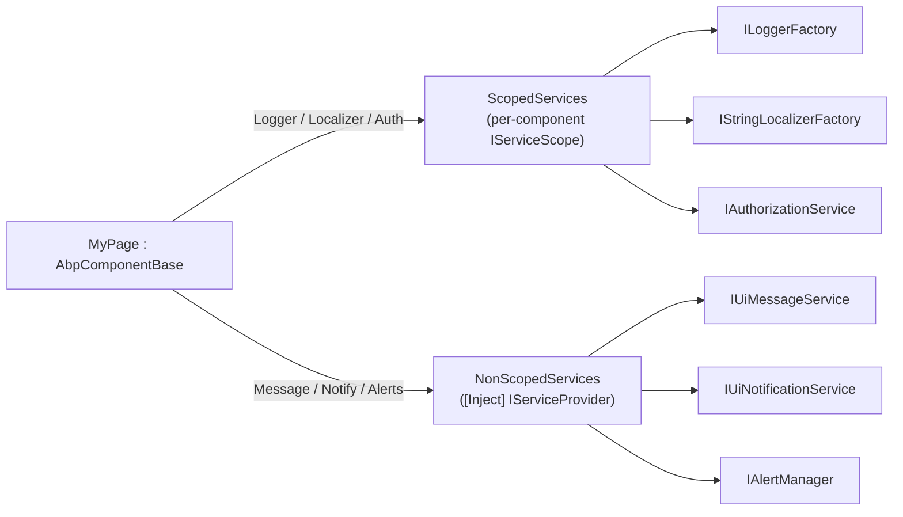

`Volo.Abp.AspNetCore.Components` is the host-independent layer of the ABP
Framework Blazor stack. It defines the abstractions every Blazor host (Server,
WebAssembly, MAUI Blazor) shares: the component base class, the UI feedback
contracts (`IUiMessageService`, `IUiNotificationService`, `IUiPageProgressService`,
`IBlockUiService`, `IAlertManager`, `IUserExceptionInformer`), and the DI plumbing
that registers components as transient services. All sources live under
`framework/src/Volo.Abp.AspNetCore.Components/Volo/Abp/AspNetCore/Components/`.

## Module entry point

The module is `AbpAspNetCoreComponentsModule` in
`framework/src/Volo.Abp.AspNetCore.Components/Volo/Abp/AspNetCore/Components/AbpAspNetCoreComponentsModule.cs`.
It is annotated with `[DependsOn(typeof(AbpObjectMappingModule), typeof(AbpSecurityModule), typeof(AbpTimingModule), typeof(AbpMultiTenancyAbstractionsModule))]`,
so any package that brings it in transitively gets object-mapping, security,
timing, and multi-tenancy abstractions for free. In `PreConfigureServices` it
registers `AbpWebAssemblyConventionalRegistrar` as a conventional registrar so
that all Razor components are auto-discovered, and it adds `ComponentBase` to
`DynamicProxyIgnoreTypes` so Castle does not try to wrap it:

```csharp
public override void PreConfigureServices(ServiceConfigurationContext context)
{
    DynamicProxyIgnoreTypes.Add<ComponentBase>();
    context.Services.AddConventionalRegistrar(new AbpWebAssemblyConventionalRegistrar());
}
```

## AbpComponentBase

`AbpComponentBase` in
`framework/src/Volo.Abp.AspNetCore.Components/Volo/Abp/AspNetCore/Components/AbpComponentBase.cs`
is the abstract base for every Blazor page or component you write. It derives
from `OwningComponentBase`, which means the framework owns the per-component
`IServiceScope` and disposes it with the component. The class exposes a curated
set of "ABP services" through lazy properties so that you do not have to
`[Inject]` them by hand on every component.

### Lazy service properties

The lazy properties split into two categories. **Scoped** services are pulled
from `ScopedServices` (the component-owned scope) via `LazyGetRequiredService`:

- `StringLocalizerFactory` and a `L` localizer constructed for
  `LocalizationResource` (defaults to `DefaultResource`).
- `LoggerFactory` and a typed `Logger` cached per `GetType()`.
- `AuthorizationService` (`Microsoft.AspNetCore.Authorization.IAuthorizationService`).
- `CurrentUser` (`Volo.Abp.Users.ICurrentUser`).
- `CurrentTenant` (`Volo.Abp.MultiTenancy.ICurrentTenant`).

**Non-scoped** services are pulled from a separately injected `NonScopedServices`
provider via `LazyGetNonScopedRequiredService`. This matters because services
like `IUiMessageService` are typically registered as scoped at the *circuit* or
*application* level, not at the component level — resolving them from the
component-owned scope would either fail or return a different instance per
component. The non-scoped ones are:

| Property | Service type |
| --- | --- |
| `Message` | `Volo.Abp.AspNetCore.Components.Messages.IUiMessageService` |
| `Notify` | `Volo.Abp.AspNetCore.Components.Notifications.IUiNotificationService` |
| `UserExceptionInformer` | `Volo.Abp.AspNetCore.Components.ExceptionHandling.IUserExceptionInformer` |
| `AlertManager` | `Volo.Abp.AspNetCore.Components.Alerts.IAlertManager` |
| `Clock` | `Volo.Abp.Timing.IClock` |
| `ObjectMapper` | `Volo.Abp.ObjectMapping.IObjectMapper` (or typed when `ObjectMapperContext` is set) |

`NonScopedServices` itself is `[Inject]`-ed:

```csharp
[Inject]
protected IServiceProvider NonScopedServices { get; set; } = default!;
```

The `Alerts` convenience property delegates to `AlertManager.Alerts` so you can
write `Alerts.Warning("...")` inside a component. The `ObjectMapper` property
honours an `ObjectMapperContext` you can set in your derived class to bind to
`IObjectMapper<TContext>` for typed AutoMapper profiles.

### Localizer creation

`CreateLocalizer()` returns `StringLocalizerFactory.Create(LocalizationResource)`
when `LocalizationResource` is non-null, otherwise it asks for a default
localizer via `StringLocalizerFactory.CreateDefaultOrNull()`. If no default
resource type has been configured through
`AbpLocalizationOptions.DefaultResourceType`, the property throws
`AbpException`, which is exactly the message you see when you forget to set up
localization for a Blazor module:

```text
Set LocalizationResource or define the default localization resource type
(by configuring the AbpLocalizationOptions.DefaultResourceType) to be able
to use the L object!
```

### Async error handling

`HandleErrorAsync(Exception exception)` is the canonical way to surface an
exception to the user from inside a component. It guards against the component
being disposed, then calls `InvokeAsync` to switch onto the renderer's
synchronization context and informs the user via
`UserExceptionInformer.InformAsync(new UserExceptionInformerContext(exception))`
before calling `StateHasChanged()`:

```csharp
protected virtual async Task HandleErrorAsync(Exception exception)
{
    if (IsDisposed) return;

    await InvokeAsync(async () =>
    {
        await UserExceptionInformer.InformAsync(new UserExceptionInformerContext(exception));
        StateHasChanged();
    });
}
```

You typically `try/catch` an async operation in your derived component and call
`await HandleErrorAsync(ex)` in the catch block; the default
`UserExceptionInformer` (declared by
`framework/src/Volo.Abp.AspNetCore.Components/Volo/Abp/AspNetCore/Components/ExceptionHandling/IUserExceptionInformer.cs`)
ends up calling `IUiMessageService.Error(...)` with a localized message and
optional details.

## Alerts

`framework/src/Volo.Abp.AspNetCore.Components/Volo/Abp/AspNetCore/Components/Alerts/`
holds the in-page alert API:

- `IAlertManager` in `Alerts/IAlertManager.cs` exposes a single
  `AlertList Alerts` property.
- `AlertList` in `Alerts/AlertList.cs` is an `ObservableCollection<AlertMessage>`
  with convenience methods `Info`, `Warning`, `Danger`, `Success`, each
  forwarding to `Add(new AlertMessage(type, text, title, dismissible))`.
- `AlertMessage` in `Alerts/AlertMessage.cs` validates `Text` against
  `Check.NotNullOrWhiteSpace` and stores `Type`, `Title`, and `Dismissible`.
- `AlertType` in `Alerts/AlertType.cs` is the standard enum (`Default`,
  `Primary`, `Secondary`, `Success`, `Danger`, `Warning`, `Info`, `Light`,
  `Dark`) mapped one-to-one to Bootstrap alert styles.

Because `AlertList` is observable, theming packages bind a layout component
(e.g. an `Alerts` Razor component) to it and re-render automatically when an
`AlertMessage` is added or removed. The default implementation `AlertManager` —
declared in `Volo.Abp.AspNetCore.Components.Web` —
constructs a fresh `AlertList` per scope so the messages are page-local.

## Messages

The message API is what `AbpComponentBase.Message` exposes:

```csharp
public interface IUiMessageService
{
    Task Info(string message, string? title = null, Action<UiMessageOptions>? options = null);
    Task Success(string message, string? title = null, Action<UiMessageOptions>? options = null);
    Task Warn(string message, string? title = null, Action<UiMessageOptions>? options = null);
    Task Error(string message, string? title = null, Action<UiMessageOptions>? options = null);
    Task<bool> Confirm(string message, string? title = null, Action<UiMessageOptions>? options = null);
}
```

The contract is in
`framework/src/Volo.Abp.AspNetCore.Components/Volo/Abp/AspNetCore/Components/Messages/IUiMessageService.cs`.
`UiMessageOptions` in
`framework/src/Volo.Abp.AspNetCore.Components/Volo/Abp/AspNetCore/Components/Messages/UiMessageOptions.cs`
lets you customise placement and button labels; the same options are honoured by
all theming packages:

| Property | Default | Effect |
| --- | --- | --- |
| `CenterMessage` | `false` | Centers the dialog vertically. |
| `ShowMessageIcon` | `false` | Renders a large icon for the type. |
| `MessageIcon` | `null` | Overrides the built-in icon. |
| `OkButtonText` / `OkButtonIcon` | `null` | OK button content. |
| `ConfirmButtonText` / `ConfirmButtonIcon` | `null` | Yes/confirm button content. |
| `CancelButtonText` / `CancelButtonIcon` | `null` | Cancel button content. |
| `IsMessageHtmlMarkup` | `false` | If `true`, message is rendered as raw HTML. |

`UiMessageType` and `UiMessageEventArgs` (also under the same folder) are used
by host implementations such as the Blazorise message dialog and the MudBlazor
snackbar. A trivial fallback,
`framework/src/Volo.Abp.AspNetCore.Components.Web/Volo/Abp/AspNetCore/Components/Web/Messages/SimpleUiMessageService.cs`,
just calls JS `alert(...)` / `confirm(...)` and is useful as a `Replace`
default when no UI library is in scope.

## Notifications

`framework/src/Volo.Abp.AspNetCore.Components/Volo/Abp/AspNetCore/Components/Notifications/`
defines `IUiNotificationService`, mirroring the message API but for
fire-and-forget toast-style notifications:

```csharp
public interface IUiNotificationService
{
    Task Info(string message, string? title = null, Action<UiNotificationOptions>? options = null);
    Task Success(string message, string? title = null, Action<UiNotificationOptions>? options = null);
    Task Warn(string message, string? title = null, Action<UiNotificationOptions>? options = null);
    Task Error(string message, string? title = null, Action<UiNotificationOptions>? options = null);
}
```

`UiNotificationOptions`, `UiNotificationType`, and `UiNotificationEventArgs`
live under the same folder. A null implementation
`NullUiNotificationService` is provided so a host can register a placeholder
when no UI library is configured.

## Progress

`IUiPageProgressService` in
`framework/src/Volo.Abp.AspNetCore.Components/Volo/Abp/AspNetCore/Components/Progression/IUiPageProgressService.cs`
is consumed by `AbpBlazorClientHttpMessageHandler` in WASM/MAUI to surface a
top-of-page progress bar while remote calls are in flight:

```csharp
public interface IUiPageProgressService
{
    event EventHandler<UiPageProgressEventArgs> ProgressChanged;
    Task Go(int? percentage, Action<UiPageProgressOptions>? options = null);
}
```

`Go(null, ...)` means *indeterminate*, `Go(-1)` means *hide*, and `Go(percent)`
sets a determinate value. `UiPageProgressOptions` and
`UiPageProgressType` live next to the contract.
`NullUiPageProgressService` (in the same folder) is the no-op fallback.

## Block UI

`framework/src/Volo.Abp.AspNetCore.Components/Volo/Abp/AspNetCore/Components/BlockUi/IBlockUiService.cs`
defines a minimal contract for masking part of the DOM:

```csharp
public interface IBlockUiService
{
    Task Block(string? selectors, bool busy = false);
    Task UnBlock();
}
```

`NullBlockUiService` next to it is the safe default. The Web layer replaces it
with `AbpBlockUiService` in
`framework/src/Volo.Abp.AspNetCore.Components.Web/Volo/Abp/AspNetCore/Components/Web/BlockUi/AbpBlockUiService.cs`
which calls `JsRuntime.InvokeVoidAsync("abp.ui.block", selectors, busy)` and
`abp.ui.unblock`, both implemented in the `abp.js` script that ships under
`_content/Volo.Abp.AspNetCore.Components.Web/libs/abp/js/abp.js`.

## Exception handling

`IUserExceptionInformer` lives at
`framework/src/Volo.Abp.AspNetCore.Components/Volo/Abp/AspNetCore/Components/ExceptionHandling/IUserExceptionInformer.cs`
and has both sync and async members:

```csharp
public interface IUserExceptionInformer
{
    void Inform(UserExceptionInformerContext context);
    Task InformAsync(UserExceptionInformerContext context);
}
```

`UserExceptionInformerContext` in the same folder carries the `Exception` plus a
`LogLevel` so a logger can categorise it. `NullUserExceptionInformer` next to it
swallows everything. The Web layer's
`framework/src/Volo.Abp.AspNetCore.Components.Web/Volo/Abp/AspNetCore/Components/Web/ExceptionHandling/UserExceptionInformer.cs`
uses `IExceptionToErrorInfoConverter` to convert the exception into an
`ErrorInfo` and then forwards `errorInfo.Message` / `errorInfo.Details` to
`IUiMessageService.Error`. The matching `AbpExceptionHandlingLogger` and
`AbpExceptionHandlingLoggerProvider` files in the same folder hook into
`ILoggerFactory` so unhandled exceptions logged by Blazor end up in the same
UI flow.

## Component DI registration

Blazor only resolves components via `IComponentActivator`, so registering them
in DI is what makes constructor injection (and per-component scopes) work. The
core package handles this in two places:

`framework/src/Volo.Abp.AspNetCore.Components/Volo/Abp/AspNetCore/Components/DependencyInjection/AbpWebAssemblyConventionalRegistrar.cs`
extends `DefaultConventionalRegistrar` to only register types that derive from
`ComponentBase`, and to register them with `ServiceLifetime.Transient`:

```csharp
public class AbpWebAssemblyConventionalRegistrar : DefaultConventionalRegistrar
{
    protected override bool IsConventionalRegistrationDisabled(Type type)
        => !IsComponent(type) || base.IsConventionalRegistrationDisabled(type);

    private static bool IsComponent(Type type) => typeof(ComponentBase).IsAssignableFrom(type);

    protected override ServiceLifetime? GetDefaultLifeTimeOrNull(Type type) => ServiceLifetime.Transient;
}
```

`framework/src/Volo.Abp.AspNetCore.Components/Volo/Abp/AspNetCore/Components/DependencyInjection/ServiceProviderComponentActivator.cs`
then implements `IComponentActivator` against an `IServiceProvider`, falling
back to `Activator.CreateInstance` for types that were not registered:

```csharp
public IComponent CreateInstance(Type componentType)
{
    var instance = ServiceProvider.GetService(componentType)
                   ?? Activator.CreateInstance(componentType);

    if (instance is not IComponent component)
        throw new ArgumentException(
            $"The type {componentType.FullName} does not implement {nameof(IComponent)}.");

    return component;
}
```

`AbpAspNetCoreComponentsWebModule` in
`framework/src/Volo.Abp.AspNetCore.Components.Web/Volo/Abp/AspNetCore/Components/Web/AbpAspNetCoreComponentsWebModule.cs`
finishes the wiring by `Replace`-ing the default activator with this one.

## End-to-end shape



The split between `ScopedServices` and `NonScopedServices` is exactly what
prevents component-scoped UoW handlers from accidentally tearing down the
shared dialog/snackbar state when a component unmounts.

## Authoring guidelines

<Tip>
When you build a page, derive from `AbpComponentBase` (or one of the theming
`AbpCrudPageBase`/`AbpMudCrudPageBase` derivatives in
`framework/src/Volo.Abp.BlazoriseUI/AbpCrudPageBase.cs` and
`framework/src/Volo.Abp.MudBlazorUI/AbpMudCrudPageBase.cs`). You then get
`L`, `Logger`, `CurrentUser`, `CurrentTenant`, `Message`, `Notify`,
`AlertManager`, and `ObjectMapper` without writing a single `[Inject]`.
</Tip>

<Warning>
Do not call `Message.Error(...)` from a `try`/`catch` directly when the
exception might be an `AbpAuthorizationException` or
`AbpRemoteCallException` — use `HandleErrorAsync(ex)` so that the
`UserExceptionInformer` registered by your host (`UserExceptionInformer` in
`framework/src/Volo.Abp.AspNetCore.Components.Web/Volo/Abp/AspNetCore/Components/Web/ExceptionHandling/UserExceptionInformer.cs`)
can map the framework exception types to localized messages and details
through `IExceptionToErrorInfoConverter`.
</Warning>

<Note>
`AbpComponentBase` does not inject `NavigationManager` or `IJSRuntime` for
you. Those are framework primitives — you keep `[Inject] NavigationManager`
and `[Inject] IJSRuntime` in your own components when you need them. The
core package exists to add ABP-flavoured helpers on top of them, not to
replace them.
</Note>
