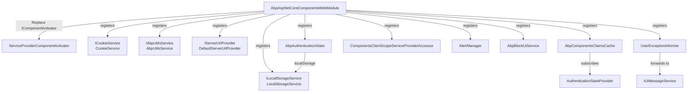

`Volo.Abp.AspNetCore.Components.Web` adds the browser-shaped plumbing on top of
the host-agnostic abstractions in `Volo.Abp.AspNetCore.Components`. Everything in
this package assumes `IJSRuntime` is available — i.e. you are running inside
either a Blazor circuit or a WebAssembly host — and provides concrete
implementations of the contracts (`IUiMessageService`, `IBlockUiService`,
`IUserExceptionInformer`, …) along with cookie, local-storage, and authentication
helpers. The sources sit under
`framework/src/Volo.Abp.AspNetCore.Components.Web/Volo/Abp/AspNetCore/Components/Web/`.

## Module entry point

`AbpAspNetCoreComponentsWebModule` in
`framework/src/Volo.Abp.AspNetCore.Components.Web/Volo/Abp/AspNetCore/Components/Web/AbpAspNetCoreComponentsWebModule.cs`
declares `[DependsOn(typeof(AbpUiModule), typeof(AbpAspNetCoreComponentsModule))]`
and does two things in `ConfigureServices`:

1. Replaces the default `IComponentActivator` with `ServiceProviderComponentActivator`
   (defined in the core package at
   `framework/src/Volo.Abp.AspNetCore.Components/Volo/Abp/AspNetCore/Components/DependencyInjection/ServiceProviderComponentActivator.cs`):
   ```csharp
   context.Services.Replace(ServiceDescriptor.Transient<IComponentActivator, ServiceProviderComponentActivator>());
   ```
2. Flushes any pre-configured `AbpAspNetCoreComponentsWebOptions` action so that
   modules calling `PreConfigure<AbpAspNetCoreComponentsWebOptions>(...)` can
   set `IsBlazorWebApp` before any host module reads it.

`AbpAspNetCoreComponentsWebOptions` in
`framework/src/Volo.Abp.AspNetCore.Components.Web/Volo/Abp/AspNetCore/Components/Web/AbpAspNetCoreComponentsWebOptions.cs`
exposes a single `bool IsBlazorWebApp { get; set; }` (default `false`). This
flag is the master switch read by Server and WebAssembly modules to detect the
unified Blazor Web App host introduced in .NET 8.

## Authentication options and state

`AbpAuthenticationOptions` in
`framework/src/Volo.Abp.AspNetCore.Components.Web/Volo/Abp/AspNetCore/Components/Web/AbpAuthenticationOptions.cs`
holds the URLs the framework uses for login and logout. The defaults are
`"Account/Login"` / `"Account/Logout"` (suited to a Razor Pages Account module),
and the WebAssembly module overrides them to `"authentication/login"` /
`"authentication/logout"` (the conventional `RemoteAuthenticator` routes) when
not running inside a Blazor Web App.

`AbpAuthenticationState` in
`framework/src/Volo.Abp.AspNetCore.Components.Web/Volo/Abp/AspNetCore/Components/Web/Security/AbpAuthenticationState.cs`
is a `ComponentBase` that synchronises the `ICurrentUser` identity into
`localStorage`. On the first render it registers a navigation-changing handler
through `NavigationManager.RegisterLocationChangingHandler(OnLocationChangingAsync)`,
then writes or clears the `authentication-state-id` key based on
`CurrentUser.IsAuthenticated`. When the user navigates to
`AuthenticationOptions.Value.LogoutUrl`, the handler clears the same key. This
plays together with the `_content/Volo.Abp.AspNetCore.Components.Web/libs/abp/js/authentication-state-listener.js`
script that broadcasts authentication changes between browser tabs.

`AbpComponentsClaimsCache` in
`framework/src/Volo.Abp.AspNetCore.Components.Web/Volo/Abp/AspNetCore/Components/Web/Security/AbpComponentsClaimsCache.cs`
keeps the current `ClaimsPrincipal` in sync with
`AuthenticationStateProvider.AuthenticationStateChanged`. It subscribes to the
event in its constructor and exposes `Principal` plus an `InitializeAsync()`
method that performs the initial fetch:

```csharp
public AbpComponentsClaimsCache(IClientScopeServiceProviderAccessor serviceProviderAccessor)
{
    _authenticationStateProvider = serviceProviderAccessor.ServiceProvider.GetService<AuthenticationStateProvider>();
    if (_authenticationStateProvider != null)
    {
        _authenticationStateProvider.AuthenticationStateChanged += async task =>
        {
            Principal = (await task).User;
        };
    }
}
```

Host modules call `AbpComponentsClaimsCache.InitializeAsync()` during their
`OnApplicationInitializationAsync` to populate the principal once before the
router renders. `ApplicationConfigurationChangedService` next to it
(`Security/ApplicationConfigurationChangedService.cs`) is a scoped event bus
with a `Changed` event and `NotifyChanged()` method that the host's
`ICurrentApplicationConfigurationCacheResetService` raises after the cached
DTO is refreshed.

## Browser storage helpers

The Web package gives you typed wrappers over the browser's storage APIs so you
do not have to keep retyping `JsRuntime.InvokeVoidAsync(...)`:

| Service | File | JS function |
| --- | --- | --- |
| `ILocalStorageService` / `LocalStorageService` | `framework/src/Volo.Abp.AspNetCore.Components.Web/Volo/Abp/AspNetCore/Components/Web/LocalStorageService.cs` | `localStorage.setItem` / `getItem` / `removeItem` |
| `ICookieService` / `CookieService` | `framework/src/Volo.Abp.AspNetCore.Components.Web/Volo/Abp/AspNetCore/Components/Web/CookieService.cs` | `abp.utils.setCookieValue` / `getCookieValue` / `deleteCookie` |
| `IAbpUtilsService` / `AbpUtilsService` | `framework/src/Volo.Abp.AspNetCore.Components.Web/Volo/Abp/AspNetCore/Components/Web/AbpUtilsService.cs` | `abp.utils.addClassToTag`, `removeClassFromTag`, `hasClassOnTag`, `replaceLinkHrefById`, `toggleFullscreen`, `requestFullscreen`, `exitFullscreen` |

`LocalStorageService` is marked `[Dependency(ReplaceServices = true)]` and
`ITransientDependency` so any consumer just asks for `ILocalStorageService`:

```csharp
[Dependency(ReplaceServices = true)]
public class LocalStorageService : ILocalStorageService, ITransientDependency
{
    public LocalStorageService(IJSRuntime jsRuntime) { JsRuntime = jsRuntime; }

    public async ValueTask SetItemAsync(string key, string value)
        => await JsRuntime.InvokeVoidAsync("localStorage.setItem", key, value);

    public async ValueTask<string> GetItemAsync(string key)
        => await JsRuntime.InvokeAsync<string>("localStorage.getItem", key);

    public async ValueTask RemoveItemAsync(string key)
        => await JsRuntime.InvokeVoidAsync("localStorage.removeItem", key);
}
```

`CookieService` accepts a `CookieOptions` record
(`framework/src/Volo.Abp.AspNetCore.Components.Web/Volo/Abp/AspNetCore/Components/Web/CookieOptions.cs`)
carrying `ExpireDate`, `Path`, and `Secure`, and serialises `ExpireDate` with
the `"r"` (RFC 1123) format so the JS side can parse it.

`IAbpUtilsService` (contract:
`framework/src/Volo.Abp.AspNetCore.Components.Web/Volo/Abp/AspNetCore/Components/Web/IAbpUtilsService.cs`)
is the DOM helper most theming code uses. The host modules call
`AddClassToTagAsync("body", "rtl")` from
`SetCurrentLanguageAsync` when the active culture is right-to-left
(`framework/src/Volo.Abp.AspNetCore.Components.WebAssembly/Volo/Abp/AspNetCore/Components/WebAssembly/AbpAspNetCoreComponentsWebAssemblyModule.cs`
and the matching MAUI module).

## Server URL provider

`IServerUrlProvider` in
`framework/src/Volo.Abp.AspNetCore.Components.Web/Volo/Abp/AspNetCore/Components/Web/IServerUrlProvider.cs`
returns the base URL the UI should use for remote services. The Web layer ships
two defaults:

```csharp
public interface IServerUrlProvider
{
    Task<string> GetBaseUrlAsync(string? remoteServiceName = null);
}
```

- `DefaultServerUrlProvider` in
  `framework/src/Volo.Abp.AspNetCore.Components.Web/Volo/Abp/AspNetCore/Components/Web/DefaultServerUrlProvider.cs`
  returns `"/"` and is registered as `ISingletonDependency`. Server hosts use it
  because the Blazor circuit lives on the same origin as the API.
- `WebAssemblyServerUrlProvider` in
  `framework/src/Volo.Abp.AspNetCore.Components.WebAssembly/Volo/Abp/AspNetCore/Components/WebAssembly/WebAssemblyServerUrlProvider.cs`
  and `MauiBlazorServerUrlProvider` in
  `framework/src/Volo.Abp.AspNetCore.Components.MauiBlazor/Volo/Abp/AspNetCore/Components/MauiBlazor/MauiBlazorServerUrlProvider.cs`
  both delegate to `IRemoteServiceConfigurationProvider.GetConfigurationOrDefaultAsync(...)`
  and call `.BaseUrl.EnsureEndsWith('/')`. They are registered with
  `[Dependency(ReplaceServices = true)]` so they replace the default.

## Client-scope service provider accessor

Blazor manages its own DI scopes per circuit (Server) or per `WebAssemblyHost`
(WASM), and the `ComponentsClientScopeServiceProviderAccessor` in
`framework/src/Volo.Abp.AspNetCore.Components.Web/Volo/Abp/AspNetCore/Components/Web/DependencyInjection/ComponentsClientScopeServiceProviderAccessor.cs`
is a singleton bridge that lets the framework reach back to the *client* scope
from outside:

```csharp
public class ComponentsClientScopeServiceProviderAccessor :
    IClientScopeServiceProviderAccessor,
    ISingletonDependency
{
    public IServiceProvider ServiceProvider { get; set; } = default!;
}
```

The WASM host's `AbpWebAssemblyHostBuilderExtensions.InitializeApplicationAsync`
in
`framework/src/Volo.Abp.AspNetCore.Components.WebAssembly/Microsoft/AspNetCore/Components/WebAssembly/Hosting/AbpWebAssemblyHostBuilderExtensions.cs`
sets `ServiceProvider` to the actual `WebAssemblyHost.Services` right after the
ABP application initializes, so framework services running in the application
initialization pipeline can still resolve things like `AbpComponentsClaimsCache`,
`WebAssemblyCachedApplicationConfigurationClient`, or `IUiPageProgressService`.

## Alert manager, block UI, simple message service

The Web package provides default implementations for the core feedback
contracts:

- `AlertManager` in
  `framework/src/Volo.Abp.AspNetCore.Components.Web/Volo/Abp/AspNetCore/Components/Web/Alerts/AlertManager.cs`
  is `IAlertManager, IScopedDependency`; it holds a single `AlertList Alerts`
  that lives for the scope lifetime.
- `AbpBlockUiService` in
  `framework/src/Volo.Abp.AspNetCore.Components.Web/Volo/Abp/AspNetCore/Components/Web/BlockUi/AbpBlockUiService.cs`
  forwards to `abp.ui.block` / `abp.ui.unblock` via `IJSRuntime`.
- `SimpleUiMessageService` in
  `framework/src/Volo.Abp.AspNetCore.Components.Web/Volo/Abp/AspNetCore/Components/Web/Messages/SimpleUiMessageService.cs`
  is the minimal `IUiMessageService` that uses native `alert()` / `confirm()`.
  UI library modules (Blazorise, MudBlazor) replace it via
  `[Dependency(ReplaceServices = true)]`.

## Exception handling

`UserExceptionInformer` in
`framework/src/Volo.Abp.AspNetCore.Components.Web/Volo/Abp/AspNetCore/Components/Web/ExceptionHandling/UserExceptionInformer.cs`
is the default `IUserExceptionInformer`. It is registered with
`[Dependency(ReplaceServices = true)]` and `IScopedDependency`. The class:

1. Calls `LogException(context)` against the typed `ILogger<UserExceptionInformer>`.
2. Asks `IExceptionToErrorInfoConverter` (from `Volo.Abp.Http`) to produce an
   `ErrorInfo` (with `Message`, `Details`).
3. Forwards the result to `IUiMessageService.Error(...)` — title only if
   details are present.

The matching `AbpExceptionHandlingLogger` and
`AbpExceptionHandlingLoggerProvider` in the same folder bridge framework
exceptions logged by Blazor's renderer into the same `UserExceptionInformer`
flow so unhandled component errors also pop up as user-visible messages.

## Extensibility metadata

`framework/src/Volo.Abp.AspNetCore.Components.Web/Volo/Abp/AspNetCore/Components/Web/Extensibility/`
defines the data structures used by the table and CRUD components in the
theming layer:

- `EntityActions/EntityAction.cs` — row-level action with `Text`, `Clicked`,
  `ConfirmationMessage`, `Primary`, `Color`, `Icon`, `Visible`, `Disabled`.
- `EntityActions/EntityActionDictionary.cs` — keyed list of `EntityAction` per
  page name.
- `TableColumns/TableColumn.cs` — column metadata with `Title`, `Data`,
  `Width`, `PropertyName`, `DisplayFormat`, `Component`, `Actions`,
  `ValueConverter`, `Sortable`, `Visible`.
- `TableColumns/TableColumnDictionary.cs` — keyed list of `TableColumn`.
- `ILookupApiRequestService.cs` — abstraction for performing lookup HTTP calls
  on behalf of dynamic forms.

These types are consumed by Blazorise and MudBlazor grids (`AbpExtensibleDataGrid`
in `framework/src/Volo.Abp.BlazoriseUI/Components/AbpExtensibleDataGrid.razor.cs`
and `AbpMudExtensibleDataGrid` in
`framework/src/Volo.Abp.MudBlazorUI/Components/AbpMudExtensibleDataGrid.razor.cs`)
to render extensible columns and per-row actions.

## Configuration cache reset

`ICurrentApplicationConfigurationCacheResetService` in
`framework/src/Volo.Abp.AspNetCore.Components.Web/Volo/Abp/AspNetCore/Components/Web/Configuration/ICurrentApplicationConfigurationCacheResetService.cs`
is the cross-host contract used after impersonation, language switching, or
profile updates to invalidate the cached
`ApplicationConfigurationDto`. The default
`NullCurrentApplicationConfigurationCacheResetService` next to it is a no-op,
and each host replaces it:

- Server: `BlazorServerCurrentApplicationConfigurationCacheResetService` in
  `framework/src/Volo.Abp.AspNetCore.Components.Server/Volo/Abp/AspNetCore/Components/Server/Configuration/BlazorServerCurrentApplicationConfigurationCacheResetService.cs`
  publishes `CurrentApplicationConfigurationCacheResetEventData` on the local
  event bus.
- WebAssembly: `BlazorWebAssemblyCurrentApplicationConfigurationCacheResetService`
  in
  `framework/src/Volo.Abp.AspNetCore.Components.WebAssembly/Volo/Abp/AspNetCore/Components/WebAssembly/Configuration/BlazorWebAssemblyCurrentApplicationConfigurationCacheResetService.cs`
  triggers `WebAssemblyCachedApplicationConfigurationClient.InitializeAsync()`.
- MauiBlazor: `MauiCurrentApplicationConfigurationCacheResetService` in
  `framework/src/Volo.Abp.AspNetCore.Components.MauiBlazor/Volo/Abp/AspNetCore/Components/MauiBlazor/MauiCurrentApplicationConfigurationCacheResetService.cs`.

## Localization helper

`AbpBlazorMessageLocalizerHelper<T>` in
`framework/src/Volo.Abp.AspNetCore.Components.Web/Volo/Abp/AspNetCore/Components/Web/AbpBlazorMessageLocalizerHelper.cs`
is the localizer used by Blazorise's validation messages. It accepts a key and
an optional list of arguments, and falls back to the unformatted key if the
formatted lookup throws:

```csharp
public string Localize(string message, IEnumerable<string>? arguments = null)
{
    try
    {
        var argumentsList = arguments?.ToList();
        return argumentsList?.Count > 0
            ? stringLocalizer[message, LocalizeMessageArguments(argumentsList).ToArray()]
            : stringLocalizer[message];
    }
    catch
    {
        return stringLocalizer[message];
    }
}
```

`AbpMudBlazorMessageLocalizerHelper<T>` in
`framework/src/Volo.Abp.MudBlazorUI/AbpMudBlazorMessageLocalizerHelper.cs`
is the MudBlazor counterpart registered by `AbpMudBlazorUIModule`.

## Putting it together



## Tips

<Note>
The Web package only registers the *defaults*. Each UI library
(`Volo.Abp.BlazoriseUI`, `Volo.Abp.MudBlazorUI`) replaces `IUiMessageService`,
`IUiNotificationService`, and `IUiPageProgressService` with implementations
that talk to the library's modal/snackbar APIs. Without one of those
libraries you fall back to the `SimpleUiMessageService` JS-alert flow.
</Note>

<Tip>
If you need to share a value across browser tabs (e.g. selected tenant, theme
toggle) use `ILocalStorageService` plus the
`_content/Volo.Abp.AspNetCore.Components.Web/libs/abp/js/authentication-state-listener.js`
pattern: write the key, listen for the `storage` event in JS, and call back
into .NET through `[JSInvokable]`. The framework itself uses this exact
pattern in `AbpAuthenticationState`.
</Tip>

<Warning>
Do not inject `IClientScopeServiceProviderAccessor.ServiceProvider` from a
constructor that runs at application start — it is only assigned by the host
during `OnApplicationInitializationAsync`. Inject the accessor and read
`accessor.ServiceProvider` lazily, just like
`AbpComponentsClaimsCache` does in
`framework/src/Volo.Abp.AspNetCore.Components.Web/Volo/Abp/AspNetCore/Components/Web/Security/AbpComponentsClaimsCache.cs`.
</Warning>
