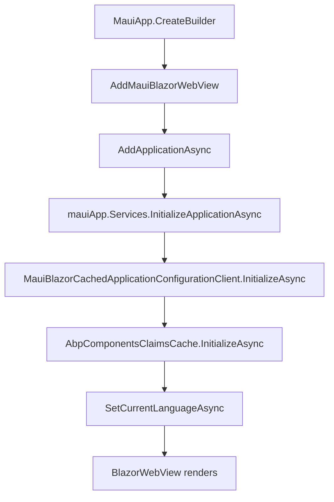

`Volo.Abp.AspNetCore.Components.MauiBlazor` lets you run an ABP Framework Blazor
UI inside a .NET MAUI shell through the `BlazorWebView` control. It mirrors the
WebAssembly story — same `Volo.Abp.AspNetCore.Components.Web` base, same UI
service contracts — but trades the browser host for a native-window
`MauiAppBuilder` and rewires the pieces that differ: tenant access, principal
access, timezone bootstrap, and the HTTP message handler. All sources sit under
`framework/src/Volo.Abp.AspNetCore.Components.MauiBlazor/`.

## Module entry point

`AbpAspNetCoreComponentsMauiBlazorModule` in
`framework/src/Volo.Abp.AspNetCore.Components.MauiBlazor/Volo/Abp/AspNetCore/Components/MauiBlazor/AbpAspNetCoreComponentsMauiBlazorModule.cs`
shares the dependency set with its WebAssembly cousin:

```csharp
[DependsOn(
    typeof(AbpAspNetCoreMvcClientCommonModule),
    typeof(AbpUiModule),
    typeof(AbpAspNetCoreComponentsWebModule)
)]
public class AbpAspNetCoreComponentsMauiBlazorModule : AbpModule
```

### PreConfigureServices

The only `PreConfigureServices` step is to plug the
`AbpMauiBlazorClientHttpMessageHandler` into every generated HTTP client
proxy:

```csharp
PreConfigure<AbpHttpClientBuilderOptions>(options =>
{
    options.ProxyClientBuildActions.Add((_, builder) =>
    {
        builder.AddHttpMessageHandler<AbpMauiBlazorClientHttpMessageHandler>();
    });
});
```

The handler in
`framework/src/Volo.Abp.AspNetCore.Components.MauiBlazor/Volo/Abp/AspNetCore/Components/MauiBlazor/AbpMauiBlazorClientHttpMessageHandler.cs`
does the MAUI equivalent of the WASM handler: it sets `Accept-Language` from
`IMauiBlazorSelectedLanguageProvider`, attaches the antiforgery token if
cookies are in play, sets the current timezone header from
`ICurrentTimezoneProvider`, and wraps the call in
`IUiPageProgressService.Go(null)` so the UI shows an in-flight indicator.

### OnApplicationInitialization

`OnApplicationInitializationAsync` runs the same three init steps as the WASM
host but via the `IClientScopeServiceProviderAccessor` pointing at the MAUI
host's service provider:

1. `MauiBlazorCachedApplicationConfigurationClient.InitializeAsync()` — fetches
   the `ApplicationConfigurationDto` plus the dynamic localization resources
   and stores them in `ApplicationConfigurationCache`.
2. `AbpComponentsClaimsCache.InitializeAsync()` — pulls the current principal
   from the registered `AuthenticationStateProvider`.
3. `SetCurrentLanguageAsync` — sets the thread default culture and toggles
   the `rtl` class on `<body>` for right-to-left languages, identical to the
   WASM module.

```csharp
public async override Task OnApplicationInitializationAsync(ApplicationInitializationContext context)
{
    await context.ServiceProvider.GetRequiredService<IClientScopeServiceProviderAccessor>()
        .ServiceProvider.GetRequiredService<MauiBlazorCachedApplicationConfigurationClient>()
        .InitializeAsync();

    await context.ServiceProvider.GetRequiredService<IClientScopeServiceProviderAccessor>()
        .ServiceProvider.GetRequiredService<AbpComponentsClaimsCache>()
        .InitializeAsync();

    await SetCurrentLanguageAsync(context.ServiceProvider);
}
```

## MauiAppBuilder integration

Wiring up an ABP MAUI Blazor application looks like the standard MAUI
`Program.cs` pattern with an ABP `AddApplicationAsync<TStartupModule>` step
between `AddMauiBlazorWebView` and `Build`:

```csharp
var builder = MauiApp.CreateBuilder();

builder.UseMauiApp<App>()
    .ConfigureFonts(fonts => fonts.AddFont("OpenSans-Regular.ttf", "OpenSansRegular"));

builder.Services.AddMauiBlazorWebView();

await builder.Services.AddApplicationAsync<MyMauiBlazorAppModule>(options =>
{
    options.UseAutofac();
});

var mauiApp = builder.Build();

await mauiApp.Services.GetRequiredService<IAbpApplicationWithExternalServiceProvider>()
    .InitializeApplicationAsync(mauiApp.Services);

return mauiApp;
```

Your `MyMauiBlazorAppModule` declares
`[DependsOn(typeof(AbpAspNetCoreComponentsMauiBlazorThemingModule), ...)]` or its
MudBlazor counterpart. The bundling package
(`framework/src/Volo.Abp.AspNetCore.Components.MauiBlazor.Bundling/Volo/Abp/AspNetCore/Components/MauiBlazor/Bundling/AbpAspNetCoreComponentsMauiBlazorBundlingModule.cs`)
swaps the standard `BlazorWebView` for `AbpBlazorWebView`, which composes the
MAUI content file provider with the default static-web-assets one — that is
how the bundles produced at startup are surfaced inside the WebView.

## Multi-tenancy in MAUI

MAUI apps do not have a host header to resolve the tenant from, so the tenant
identity is whatever the previous session stored locally plus what comes back
from the API. Two services handle the round trip:

`MauiBlazorCurrentTenantAccessor` in
`framework/src/Volo.Abp.AspNetCore.Components.MauiBlazor/Volo/Abp/AspNetCore/Components/MauiBlazor/MauiBlazorCurrentTenantAccessor.cs`
is a singleton `ICurrentTenantAccessor` holding the active `BasicTenantInfo`:

```csharp
[Dependency(ReplaceServices = true)]
public class MauiBlazorCurrentTenantAccessor : ICurrentTenantAccessor, ISingletonDependency
{
    public BasicTenantInfo? Current { get; set; }
}
```

`MauiBlazorRemoteTenantStore` in
`framework/src/Volo.Abp.AspNetCore.Components.MauiBlazor/Volo/Abp/AspNetCore/Components/MauiBlazor/MauiBlazorRemoteTenantStore.cs`
implements `ITenantStore` against the `AbpTenantClientProxy` remote service.
It caches each lookup for 5 minutes in `IDistributedCache<TenantConfiguration>`
and supports both sync and async lookup by `normalizedName` and `Guid`:

```csharp
public async Task<TenantConfiguration?> FindAsync(string normalizedName)
{
    var cacheKey = CreateCacheKey(normalizedName);
    var tenantConfiguration = await Cache.GetOrAddAsync(
        cacheKey,
        async () => CreateTenantConfiguration(await TenantAppService.FindTenantByNameAsync(normalizedName))!,
        () => new DistributedCacheEntryOptions
        {
            AbsoluteExpirationRelativeToNow = TimeSpan.FromMinutes(5)
        }
    );
    return tenantConfiguration;
}
```

`GetListAsync` returns an empty list because the device should not enumerate
all tenants over the network.

## Cached application configuration

`MauiBlazorCachedApplicationConfigurationClient` in
`framework/src/Volo.Abp.AspNetCore.Components.MauiBlazor/Volo/Abp/AspNetCore/Components/MauiBlazor/MauiBlazorCachedApplicationConfigurationClient.cs`
is the MAUI equivalent of
`WebAssemblyCachedApplicationConfigurationClient`. It is registered as
`ISingletonDependency` (one cache per app lifetime) and subscribes to
`AuthenticationStateProvider.AuthenticationStateChanged` to re-initialise
itself whenever the user logs in or out:

```csharp
authenticationStateProvider.AuthenticationStateChanged += async _ => { await InitializeAsync(); };
```

`InitializeAsync()` calls `AbpApplicationConfigurationClientProxy.GetAsync`
followed by `AbpApplicationLocalizationClientProxy.GetAsync` for the dynamic
localization resources, stores the merged DTO in `ApplicationConfigurationCache`,
sets `CurrentTenantAccessor.Current`, and raises
`ApplicationConfigurationChangedService.NotifyChanged()`. `GetAsync()`/`Get()`
then return the cached DTO; if no value has been cached yet they throw an
`AbpException` — the same shape as the WASM client.

`MauiCurrentApplicationConfigurationCacheResetService` in
`framework/src/Volo.Abp.AspNetCore.Components.MauiBlazor/Volo/Abp/AspNetCore/Components/MauiBlazor/MauiCurrentApplicationConfigurationCacheResetService.cs`
implements `ICurrentApplicationConfigurationCacheResetService` by calling the
same `InitializeAsync()`. Pages call this after impersonation or language
switching.

## Principal access and timezone

`MauiBlazorCurrentPrincipalAccessor` in
`framework/src/Volo.Abp.AspNetCore.Components.MauiBlazor/Volo/Abp/AspNetCore/Components/MauiBlazor/MauiBlazorCurrentPrincipalAccessor.cs`
returns the principal published by `AuthenticationStateProvider`, while
`MauiBlazorCurrentTimezoneProvider` in
`framework/src/Volo.Abp.AspNetCore.Components.MauiBlazor/Volo/Abp/AspNetCore/Components/MauiBlazor/MauiBlazorCurrentTimezoneProvider.cs`
holds the timezone string the app has decided to use (typically IANA).

`MauiBlazorCurrentTimezoneService` in
`framework/src/Volo.Abp.AspNetCore.Components.MauiBlazor/Volo/Abp/AspNetCore/Components/MauiBlazor/MauiBlazorCurrentTimezoneService.cs`
performs the actual bootstrap. If `IClock.SupportsMultipleTimezone` is `true`
it prefers the IANA timezone from the cached configuration; otherwise it falls
back to `JsRuntime.InvokeAsync<string>("abp.clock.getBrowserTimeZone")` and
mirrors the value into a cookie via `abp.clock.setBrowserTimeZoneToCookie`:

```csharp
public virtual async Task InitializeAsync()
{
    if (Clock.SupportsMultipleTimezone)
    {
        var configurationDto = await ApplicationConfigurationClient.GetAsync();
        CurrentTimezoneProvider.TimeZone = !configurationDto.Timing.TimeZone.Iana.TimeZoneName.IsNullOrEmpty()
            ? configurationDto.Timing.TimeZone.Iana.TimeZoneName
            : await JsRuntime.InvokeAsync<string>("abp.clock.getBrowserTimeZone");

        await JsRuntime.InvokeAsync<string>("abp.clock.setBrowserTimeZoneToCookie");
    }
}
```

## Selected language provider

`IMauiBlazorSelectedLanguageProvider` in
`framework/src/Volo.Abp.AspNetCore.Components.MauiBlazor/Volo/Abp/AspNetCore/Components/MauiBlazor/IMauiBlazorSelectedLanguageProvider.cs`
is the abstraction the HTTP handler uses to read the active language:

```csharp
public interface IMauiBlazorSelectedLanguageProvider
{
    Task<string?> GetSelectedLanguageAsync();
}
```

`NullMauiBlazorSelectedLanguageProvider` in
`framework/src/Volo.Abp.AspNetCore.Components.MauiBlazor/Volo/Abp/AspNetCore/Components/MauiBlazor/NullMauiBlazorSelectedLanguageProvider.cs`
is the no-op fallback. Real applications register their own implementation
that reads from MAUI `Preferences`, a settings page, or the OS culture.

## Remote server URL

`MauiBlazorServerUrlProvider` in
`framework/src/Volo.Abp.AspNetCore.Components.MauiBlazor/Volo/Abp/AspNetCore/Components/MauiBlazor/MauiBlazorServerUrlProvider.cs`
replaces the default `IServerUrlProvider` and resolves the base URL from the
`RemoteServices:Default` configuration:

```csharp
[Dependency(ReplaceServices = true)]
public class MauiBlazorServerUrlProvider : IServerUrlProvider, ITransientDependency
{
    public async Task<string> GetBaseUrlAsync(string? remoteServiceName = null)
    {
        var remoteServiceConfiguration = await RemoteServiceConfigurationProvider
            .GetConfigurationOrDefaultAsync(remoteServiceName ?? RemoteServiceConfigurationDictionary.DefaultName);

        return remoteServiceConfiguration.BaseUrl.EnsureEndsWith('/');
    }
}
```

This is what the menu links and API proxies use to build absolute URLs to the
backend.

## HTTP message handler

`AbpMauiBlazorClientHttpMessageHandler` in
`framework/src/Volo.Abp.AspNetCore.Components.MauiBlazor/Volo/Abp/AspNetCore/Components/MauiBlazor/AbpMauiBlazorClientHttpMessageHandler.cs`
is wired into every proxy via `PreConfigureServices` above. It performs the
same five duties as the WASM handler — surface progress, set Accept-Language,
attach antiforgery, set timezone — but obtains the selected language from
`IMauiBlazorSelectedLanguageProvider` instead of `localStorage`, because MAUI
applications typically persist preferences through MAUI's `Preferences` store.

## End-to-end startup



## Tips

<Note>
The MAUI module reuses `Volo.Abp.AspNetCore.Components.Web` defaults wherever
possible. That means the same `AbpComponentBase`, `IUiMessageService`,
`IUiNotificationService`, and `IAlertManager` you use on Server and WASM
also work in a MAUI Blazor app — your component code can be 100% shared.
</Note>

<Warning>
`MauiBlazorRemoteTenantStore` calls a remote API through
`AbpTenantClientProxy`. If the device is offline or the API is unreachable,
the call fails and the tenant cannot be resolved. Wrap the tenant-switch
flow with a graceful error path: catch the exception, surface a localized
message through `IUiMessageService`, and fall back to host mode by setting
`CurrentTenantAccessor.Current = null`.
</Warning>

<Tip>
The MAUI Blazor host module does not itself reference MAUI APIs directly —
that responsibility sits in the *Bundling* package
(`Volo.Abp.AspNetCore.Components.MauiBlazor.Bundling`) which depends on
`Microsoft.AspNetCore.Components.WebView.Maui` to materialise the static
asset file provider through `AbpBlazorWebView` in
`framework/src/Volo.Abp.AspNetCore.Components.MauiBlazor.Bundling/Volo/Abp/AspNetCore/Components/MauiBlazor/Bundling/AbpBlazorWebView.cs`.
Keep that separation in mind when you write feature modules — they should
depend on the host module, not the bundling module.
</Tip>
