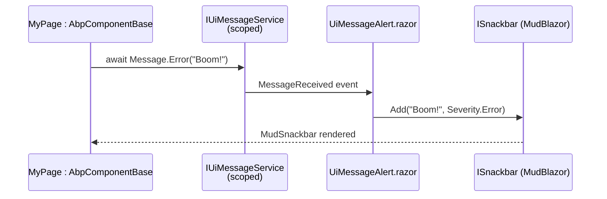
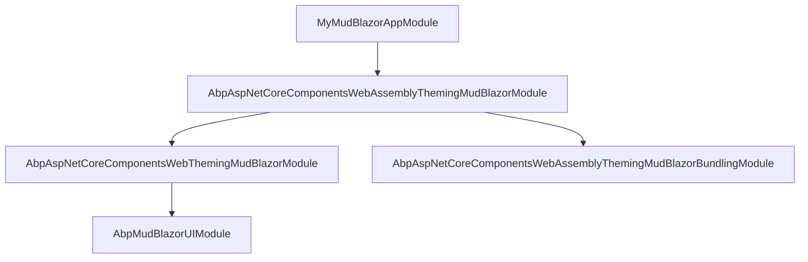

`Volo.Abp.MudBlazorUI` integrates the MudBlazor component library with the ABP
Framework Blazor stack. It registers MudBlazor services with ABP-friendly
defaults, supplies a CRUD page base, and ships Razor wrappers for the framework
contracts (`IUiMessageService`, `IUiNotificationService`, `IUiPageProgressService`,
`IAlertManager`) so that the same `Message.Error(...)` and `Notify.Info(...)`
calls you make from `AbpComponentBase` (defined in
`framework/src/Volo.Abp.AspNetCore.Components/Volo/Abp/AspNetCore/Components/AbpComponentBase.cs`)
end up as MudBlazor snackbars and dialogs. Sources sit under
`framework/src/Volo.Abp.MudBlazorUI/`.

## Module entry point

`AbpMudBlazorUIModule` in
`framework/src/Volo.Abp.MudBlazorUI/AbpMudBlazorUIModule.cs` declares:

```csharp
[DependsOn(
    typeof(AbpAspNetCoreComponentsWebModule),
    typeof(AbpDddApplicationContractsModule),
    typeof(AbpAuthorizationModule),
    typeof(AbpGlobalFeaturesModule),
    typeof(AbpFeaturesModule)
)]
public class AbpMudBlazorUIModule : AbpModule
{
    public override void ConfigureServices(ServiceConfigurationContext context)
    {
        ConfigureMudBlazor(context);
    }

    private void ConfigureMudBlazor(ServiceConfigurationContext context)
    {
        context.Services.AddMudServices(config =>
        {
            config.SnackbarConfiguration.PositionClass = Defaults.Classes.Position.BottomEnd;
            config.SnackbarConfiguration.PreventDuplicates = false;
            config.SnackbarConfiguration.NewestOnTop = true;
            config.SnackbarConfiguration.ShowCloseIcon = true;
            config.SnackbarConfiguration.VisibleStateDuration = 5000;
            config.SnackbarConfiguration.HideTransitionDuration = 500;
            config.SnackbarConfiguration.ShowTransitionDuration = 500;
            config.SnackbarConfiguration.SnackbarVariant = Variant.Filled;
        });

        context.Services.AddSingleton(typeof(AbpMudBlazorMessageLocalizerHelper<>));
    }
}
```

Two side effects matter:

1. `AddMudServices` registers `ISnackbar`, `IDialogService`, `MudThemeProvider`,
   `MudPopoverService`, and the other MudBlazor infrastructure required by
   `<MudDialogProvider />`, `<MudSnackbarProvider />`, and
   `<MudThemeProvider />` in your `App.razor`.
2. `AddSingleton(typeof(AbpMudBlazorMessageLocalizerHelper<>))` registers the
   generic helper (defined in
   `framework/src/Volo.Abp.MudBlazorUI/AbpMudBlazorMessageLocalizerHelper.cs`)
   that MudBlazor form validation uses to look up localized messages with
   safe-fallback semantics.

## MudBlazor theming variants

The MudBlazor flavour is layered across four packages so that each host can
opt in to MudBlazor independently:

| Variant | Module | File |
| --- | --- | --- |
| Shared (UI library) | `AbpMudBlazorUIModule` | `framework/src/Volo.Abp.MudBlazorUI/AbpMudBlazorUIModule.cs` |
| Web theming + Mud | `AbpAspNetCoreComponentsWebThemingMudBlazorModule` | `framework/src/Volo.Abp.AspNetCore.Components.Web.Theming.MudBlazor/AbpAspNetCoreComponentsWebThemingMudBlazorModule.cs` |
| Server theming + Mud | `AbpAspNetCoreComponentsServerThemingMudBlazorModule` | `framework/src/Volo.Abp.AspNetCore.Components.Server.Theming.MudBlazor/AbpAspNetCoreComponentsServerThemingMudBlazorModule.cs` |
| WebAssembly theming + Mud | `AbpAspNetCoreComponentsWebAssemblyThemingMudBlazorModule` | `framework/src/Volo.Abp.AspNetCore.Components.WebAssembly.Theming.MudBlazor/AbpAspNetCoreComponentsWebAssemblyThemingMudBlazorModule.cs` |
| WASM Mud bundling | `AbpAspNetCoreComponentsWebAssemblyThemingMudBlazorBundlingModule` | `framework/src/Volo.Abp.AspNetCore.Components.WebAssembly.Theming.MudBlazor.Bundling/AbpAspNetCoreComponentsWebAssemblyThemingMudBlazorBundlingModule.cs` |
| MAUI Blazor theming + Mud | `AbpAspNetCoreComponentsMauiBlazorThemingMudBlazorModule` | `framework/src/Volo.Abp.AspNetCore.Components.MauiBlazor.Theming.MudBlazor/AbpAspNetCoreComponentsMauiBlazorThemingMudBlazorModule.cs` |
| MAUI Mud bundling | `AbpAspNetCoreComponentsMauiBlazorThemingMudBlazorBundlingModule` | `framework/src/Volo.Abp.AspNetCore.Components.MauiBlazor.Theming.MudBlazor.Bundling/AbpAspNetCoreComponentsMauiBlazorThemingMudBlazorBundlingModule.cs` |

The `Web.Theming.MudBlazor` package re-declares the layout/page-toolbar/
breadcrumb types under a Mud-suffixed namespace so they bind to MudBlazor
components (`MudBreadcrumbs`, `MudButton`, `MudIconButton`, …) instead of
Blazorise ones. Source files sit under
`framework/src/Volo.Abp.AspNetCore.Components.Web.Theming.MudBlazor/Layout/`,
`PageToolbars/`, `Components/`, `Theming/`, `Routing/`, and `Bundling/`.

## Razor component wrappers

The MudBlazor UI package ships Razor components that subscribe to the
`event` -based feedback contracts from
`framework/src/Volo.Abp.AspNetCore.Components/` and forward them to MudBlazor
primitives. They are mounted by the layout (or you mount them yourself in
`App.razor`):

| Component | File | Subscribes to |
| --- | --- | --- |
| `UiMessageAlert.razor` | `framework/src/Volo.Abp.MudBlazorUI/Components/UiMessageAlert.razor` | `IUiMessageService.MessageReceived` |
| `UiNotificationAlert.razor` | `framework/src/Volo.Abp.MudBlazorUI/Components/UiNotificationAlert.razor` | `IUiNotificationService.NotificationReceived` |
| `UiPageProgress.razor` | `framework/src/Volo.Abp.MudBlazorUI/Components/UiPageProgress.razor` | `IUiPageProgressService.ProgressChanged` |
| `PageAlert.razor` | `framework/src/Volo.Abp.MudBlazorUI/Components/PageAlert.razor` | `IAlertManager.Alerts` |
| `AlertWrapper.cs` | `framework/src/Volo.Abp.MudBlazorUI/Components/AlertWrapper.cs` | local model for `PageAlert` |

`AlertWrapper` is a small `public record` that pairs an `AlertMessage` with a
`bool Visible` flag so MudBlazor's `MudAlert` can be dismissed without
removing the entry from the underlying `AlertList`.

## CRUD page base

`AbpMudCrudPageBase` in
`framework/src/Volo.Abp.MudBlazorUI/AbpMudCrudPageBase.cs` is the MudBlazor
twin of `AbpCrudPageBase` from the Blazorise package. It is declared as a
ladder of generic specialisations so simple cases just inherit a
two-type-parameter version:

```csharp
public abstract class AbpMudCrudPageBase<TAppService, TEntityDto, TKey>
    : AbpMudCrudPageBase<TAppService, TEntityDto, TKey, PagedAndSortedResultRequestDto>
    where TAppService : ICrudAppService<TEntityDto, TKey>
    where TEntityDto : class, IEntityDto<TKey>, new() { }
```

The deepest base accepts ten generic parameters and gives you:

- `TAppService AppService` — resolved from DI.
- `IReadOnlyList<TGetListOutputDto> Entities` — current page of items.
- `int CurrentPage`, `int PageSize`, `int TotalCount`, `string? CurrentSorting`.
- `TCreateViewModel NewEntity`, `TUpdateViewModel EditingEntity`.
- `TableColumnDictionary TableColumns` and `EntityActionDictionary EntityActions`
  (the same metadata types defined in
  `framework/src/Volo.Abp.AspNetCore.Components.Web/Volo/Abp/AspNetCore/Components/Web/Extensibility/`).
- `OpenCreateModalAsync`, `OpenEditModalAsync`, `DeleteEntityAsync`,
  `CloseCreateModalAsync`, and so on.

Because the page derives from `AbpComponentBase` you get `L`, `Logger`,
`CurrentUser`, `Message`, `Notify`, `AlertManager`, and `ObjectMapper` for free.
The MudBlazor page wires those into `MudTable`, `MudDialog`, and `MudForm` in
the corresponding `.razor` file you author per entity.

## Mud-flavored components

`framework/src/Volo.Abp.MudBlazorUI/Components/` contains MudBlazor-specific UI
pieces used by the CRUD pages and the table extensibility system:

- `AbpMudExtensibleDataGrid.razor(.cs)` — wraps `MudDataGrid<TItem>` and
  renders columns from `TableColumnDictionary` plus per-row actions from
  `EntityActionDictionary`.
- `MudDataGridEntityActionsColumn.razor(.cs)` — the actions column for the grid.
- `MudEntityAction.razor(.cs)` and `MudEntityActions.razor(.cs)` — single
  action button or dropdown for an `EntityAction`.

## Extension property components

The framework's `Object Extending` system lets feature modules add extra
properties to entities at runtime. MudBlazor binds these to native input
components through the file set in
`framework/src/Volo.Abp.MudBlazorUI/Components/ObjectExtending/`:

| Type | File | Renders |
| --- | --- | --- |
| `MudExtensionProperties.razor(.cs)` | `MudExtensionProperties.razor` | Whole property panel |
| `MudExtensionPropertyComponentBase.cs` | base for each type | Generic plumbing |
| `MudTextExtensionProperty.razor(.cs)` | text fields | `MudTextField<string>` |
| `MudTextAreaExtensionProperty.razor(.cs)` | textarea | `MudTextField` with `Lines` |
| `MudCheckExtensionProperty.razor(.cs)` | booleans | `MudCheckBox<bool>` |
| `MudSelectExtensionProperty.razor(.cs)` | enum dropdowns | `MudSelect<...>` |
| `MudLookupExtensionProperty.razor(.cs)` | lookup pickers | autocomplete via `ILookupApiRequestService` |
| `MudDateTimeExtensionProperty.razor(.cs)` | dates | `MudDatePicker` |
| `MudTimeExtensionProperty.razor` | times | `MudTimePicker` |
| `MudDateTimeOffsetExtensionProperty.razor(.cs)` | datetime with offset | composite |
| `ExtensionPropertyModalType.cs` | enum for placement | `Create` / `Edit` |

`ILookupApiRequestService` is defined in
`framework/src/Volo.Abp.AspNetCore.Components.Web/Volo/Abp/AspNetCore/Components/Web/Extensibility/ILookupApiRequestService.cs`,
and each host implements it (Blazor Server uses
`BlazorServerLookupApiRequestService`, WASM uses
`WebAssemblyLookupApiRequestService`).

## Localizer helper

`AbpMudBlazorMessageLocalizerHelper<T>` in
`framework/src/Volo.Abp.MudBlazorUI/AbpMudBlazorMessageLocalizerHelper.cs`
mirrors the Blazorise helper. It accepts a key plus an enumerable of argument
strings and falls back to the unformatted key if the formatted lookup throws —
exactly the same shape as
`AbpBlazorMessageLocalizerHelper<T>` in
`framework/src/Volo.Abp.AspNetCore.Components.Web/Volo/Abp/AspNetCore/Components/Web/AbpBlazorMessageLocalizerHelper.cs`.

## How user feedback flows



The implementation of `IUiMessageService` used in MudBlazor scenarios is
typically the Blazorise one when MudBlazor is paired with the Blazorise UI
module, or a MudBlazor-specific replacement registered by your application.
MudBlazor users frequently register a thin custom implementation that calls
`ISnackbar.Add(...)` directly and a `IDialogService.ShowAsync<MudConfirmDialog>(...)`
for the `Confirm` overload.

## MudBlazor theming bundle constants

Each MudBlazor bundling module declares a logical bundle name on a
`*StandardBundles` class. These constants are the keys other modules use when
they call `bundle.AddContributors(...)` to add extra MudBlazor stylesheets or
scripts:

| Constant | Value | File |
| --- | --- | --- |
| `BlazorServerMudBlazorStandardBundles.Styles.Global` / `Scripts.Global` | `"Blazor.Global"` | `framework/src/Volo.Abp.AspNetCore.Components.Server.Theming.MudBlazor/Bundling/BlazorServerMudBlazorStandardBundles.cs` |
| `BlazorWebAssemblyMudBlazorStandardBundles.Styles.Global` / `Scripts.Global` | `"BlazorWebAssemblyMudBlazor.Global"` | `framework/src/Volo.Abp.AspNetCore.Components.WebAssembly.Theming.MudBlazor.Bundling/BlazorWebAssemblyMudBlazorStandardBundles.cs` |
| `MauiBlazorMudBlazorStandardBundles.Styles.Global` / `Scripts.Global` | `"MauiBlazorMudBlazor.Global"` | `framework/src/Volo.Abp.AspNetCore.Components.MauiBlazor.Theming.MudBlazor.Bundling/MauiBlazorMudBlazorStandardBundles.cs` |

The contributors registered against these bundles all live next to the
constants — for example the WebAssembly MudBlazor script contributor in
`framework/src/Volo.Abp.AspNetCore.Components.WebAssembly.Theming.MudBlazor.Bundling/BlazorWebAssemblyMudBlazorScriptContributor.cs`
adds `_content/MudBlazor/MudBlazor.min.js`, the abp.js trio, and the
Microsoft auth helper, while its style sibling at
`BlazorWebAssemblyMudBlazorStyleContributor.cs` adds `MudBlazor.min.css`,
`volo.abp.mudblazorui.css`, ABP CSS, and flag-icon.

## Culture-aware authentication redirect

`CultureAwareRedirectToLoginHelper` in
`framework/src/Volo.Abp.AspNetCore.Components.WebAssembly.Theming.MudBlazor/CultureAwareRedirectToLoginHelper.cs`
mirrors the Blazorise variant in
`framework/src/Volo.Abp.AspNetCore.Components.WebAssembly.Theming/CultureAwareRedirectToLoginHelper.cs`.
It rewrites the redirect-to-login URL to include the current culture segment so
that the post-login redirect lands on the same culture-prefixed route the user
came from. It uses `IRouteBasedCultureUrlHelper` (defined in
`framework/src/Volo.Abp.AspNetCore.Components.WebAssembly/Volo/Abp/AspNetCore/Components/WebAssembly/RouteBasedCultureUrlHelper.cs`)
to compose the URL.

## Component bundle managers

| Host | Implementation | File |
| --- | --- | --- |
| Server + Mud | `BlazorServerMudBlazorComponentBundleManager` | `framework/src/Volo.Abp.AspNetCore.Components.Server.Theming.MudBlazor/Bundling/BlazorServerMudBlazorComponentBundleManager.cs` |
| WASM + Mud | `WebAssemblyMudBlazorComponentBundleManager` | `framework/src/Volo.Abp.AspNetCore.Components.WebAssembly.Theming.MudBlazor/WebAssemblyMudBlazorComponentBundleManager.cs` |

The server variant delegates to `IBundleManager` and projects the result. The
WASM variant returns empty lists because the WASM host writes its global
bundles into `wwwroot/index.html` via the generated `global.css` / `global.js`
files described in [`/blazor/bundling`](/blazor/bundling).

## How a MudBlazor application module wires everything



The application module declares the WASM+Mud theming module as a dependency,
which transitively brings in the Web theming + Mud module (the layout/
toolbar/breadcrumb namespace), the bundling module (global asset configuration),
and `AbpMudBlazorUIModule` itself (snackbar config + helper + CRUD base).

## Tips

<Note>
The snackbar position and timing in `AbpMudBlazorUIModule.ConfigureMudBlazor`
are *defaults*. If you need to change them — say, surface long-running
operations at the top of the page — call
`PreConfigure<MudServicesConfiguration>(...)` from your application module
before `AbpMudBlazorUIModule.ConfigureServices` runs, or replace the
configuration entirely from `PostConfigureServices`.
</Note>

<Tip>
`AbpMudCrudPageBase` is generic across as many as ten type parameters. Pick
the shortest generic specialisation that matches your application service —
the others exist so you can override list / create / update DTOs separately
without writing the longer parameter list yourself. The same ladder exists
in the Blazorise variant under
`framework/src/Volo.Abp.BlazoriseUI/AbpCrudPageBase.cs`.
</Tip>

<Warning>
Do not import both `Volo.Abp.BlazoriseUI` and `Volo.Abp.MudBlazorUI` in the
same application. They each declare `IUiMessageService` and friends with
`[Dependency(ReplaceServices = true)]`, so the last module to register
wins — the result is an unpredictable mix of dialogs and snackbars. Pick
one library per application.
</Warning>
