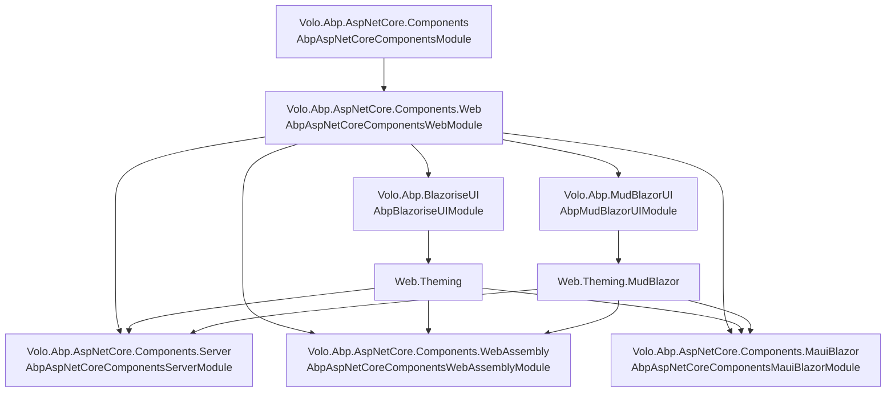

The ABP Framework ships an end-to-end stack for building Blazor UIs that can run as a
classic Blazor Server circuit, as a WebAssembly client, as a hybrid Blazor Web App
host, or as a `BlazorWebView` inside .NET MAUI. The stack is intentionally split
across many small NuGet packages so that an application picks only the layers it
actually uses. The shared abstractions live under
`framework/src/Volo.Abp.AspNetCore.Components/`, the browser-side helpers and
authentication plumbing live under
`framework/src/Volo.Abp.AspNetCore.Components.Web/`, and each host (Server /
WebAssembly / MauiBlazor) layers a thin module on top that registers
host-specific services, HTTP plumbing, and routing.

On top of that *host* axis there is a *theming* axis: every host has a matching
`.Theming` package (Blazorise/Bootstrap based) and a `.Theming.MudBlazor` package.
The `.Theming.Bundling` and `.Theming.MudBlazor.Bundling` packages (only present for
WebAssembly and MauiBlazor) declare the `IBundleContributor` classes that produce
the runtime CSS/JS bundles consumed by the browser through `_content/...`. On Blazor
Server the bundling pipeline reuses `Volo.Abp.AspNetCore.Mvc.UI.Bundling` directly.

## Package map

The complete set of Blazor-related framework packages and their `AbpModule` classes
is summarised below. Every row points at a real file under
`framework/src/` so you can jump straight to the source.

| Package | Module class | File |
| --- | --- | --- |
| `Volo.Abp.AspNetCore.Components` | `AbpAspNetCoreComponentsModule` | `framework/src/Volo.Abp.AspNetCore.Components/Volo/Abp/AspNetCore/Components/AbpAspNetCoreComponentsModule.cs` |
| `Volo.Abp.AspNetCore.Components.Web` | `AbpAspNetCoreComponentsWebModule` | `framework/src/Volo.Abp.AspNetCore.Components.Web/Volo/Abp/AspNetCore/Components/Web/AbpAspNetCoreComponentsWebModule.cs` |
| `Volo.Abp.AspNetCore.Components.Server` | `AbpAspNetCoreComponentsServerModule` | `framework/src/Volo.Abp.AspNetCore.Components.Server/Volo/Abp/AspNetCore/Components/Server/AbpAspNetCoreComponentsServerModule.cs` |
| `Volo.Abp.AspNetCore.Components.WebAssembly` | `AbpAspNetCoreComponentsWebAssemblyModule` | `framework/src/Volo.Abp.AspNetCore.Components.WebAssembly/Volo/Abp/AspNetCore/Components/WebAssembly/AbpAspNetCoreComponentsWebAssemblyModule.cs` |
| `Volo.Abp.AspNetCore.Components.MauiBlazor` | `AbpAspNetCoreComponentsMauiBlazorModule` | `framework/src/Volo.Abp.AspNetCore.Components.MauiBlazor/Volo/Abp/AspNetCore/Components/MauiBlazor/AbpAspNetCoreComponentsMauiBlazorModule.cs` |
| `Volo.Abp.AspNetCore.Components.MauiBlazor.Bundling` | `AbpAspNetCoreComponentsMauiBlazorBundlingModule` | `framework/src/Volo.Abp.AspNetCore.Components.MauiBlazor.Bundling/Volo/Abp/AspNetCore/Components/MauiBlazor/Bundling/AbpAspNetCoreComponentsMauiBlazorBundlingModule.cs` |
| `Volo.Abp.AspNetCore.Components.Web.Theming` | `AbpAspNetCoreComponentsWebThemingModule` | `framework/src/Volo.Abp.AspNetCore.Components.Web.Theming/AbpAspNetCoreComponentsWebThemingModule.cs` |
| `Volo.Abp.AspNetCore.Components.Web.Theming.MudBlazor` | `AbpAspNetCoreComponentsWebThemingMudBlazorModule` | `framework/src/Volo.Abp.AspNetCore.Components.Web.Theming.MudBlazor/AbpAspNetCoreComponentsWebThemingMudBlazorModule.cs` |
| `Volo.Abp.AspNetCore.Components.Server.Theming` | `AbpAspNetCoreComponentsServerThemingModule` | `framework/src/Volo.Abp.AspNetCore.Components.Server.Theming/AbpAspNetCoreComponentsServerThemingModule.cs` |
| `Volo.Abp.AspNetCore.Components.Server.Theming.MudBlazor` | `AbpAspNetCoreComponentsServerThemingMudBlazorModule` | `framework/src/Volo.Abp.AspNetCore.Components.Server.Theming.MudBlazor/AbpAspNetCoreComponentsServerThemingMudBlazorModule.cs` |
| `Volo.Abp.AspNetCore.Components.WebAssembly.Theming` | `AbpAspNetCoreComponentsWebAssemblyThemingModule` | `framework/src/Volo.Abp.AspNetCore.Components.WebAssembly.Theming/AbpAspNetCoreComponentsWebAssemblyThemingModule.cs` |
| `Volo.Abp.AspNetCore.Components.WebAssembly.Theming.Bundling` | `AbpAspNetCoreComponentsWebAssemblyThemingBundlingModule` | `framework/src/Volo.Abp.AspNetCore.Components.WebAssembly.Theming.Bundling/AbpAspNetCoreComponentsWebAssemblyThemingBundlingModule.cs` |
| `Volo.Abp.AspNetCore.Components.WebAssembly.Theming.MudBlazor` | `AbpAspNetCoreComponentsWebAssemblyThemingMudBlazorModule` | `framework/src/Volo.Abp.AspNetCore.Components.WebAssembly.Theming.MudBlazor/AbpAspNetCoreComponentsWebAssemblyThemingMudBlazorModule.cs` |
| `Volo.Abp.AspNetCore.Components.WebAssembly.Theming.MudBlazor.Bundling` | `AbpAspNetCoreComponentsWebAssemblyThemingMudBlazorBundlingModule` | `framework/src/Volo.Abp.AspNetCore.Components.WebAssembly.Theming.MudBlazor.Bundling/AbpAspNetCoreComponentsWebAssemblyThemingMudBlazorBundlingModule.cs` |
| `Volo.Abp.AspNetCore.Components.MauiBlazor.Theming` | `AbpAspNetCoreComponentsMauiBlazorThemingModule` | `framework/src/Volo.Abp.AspNetCore.Components.MauiBlazor.Theming/AbpAspNetCoreComponentsMauiBlazorThemingModule.cs` |
| `Volo.Abp.AspNetCore.Components.MauiBlazor.Theming.Bundling` | `AbpAspNetCoreComponentsMauiBlazorThemingBundlingModule` | `framework/src/Volo.Abp.AspNetCore.Components.MauiBlazor.Theming.Bundling/AbpAspNetCoreComponentsMauiBlazorThemingModule.cs` |
| `Volo.Abp.AspNetCore.Components.MauiBlazor.Theming.MudBlazor` | `AbpAspNetCoreComponentsMauiBlazorThemingMudBlazorModule` | `framework/src/Volo.Abp.AspNetCore.Components.MauiBlazor.Theming.MudBlazor/AbpAspNetCoreComponentsMauiBlazorThemingMudBlazorModule.cs` |
| `Volo.Abp.AspNetCore.Components.MauiBlazor.Theming.MudBlazor.Bundling` | `AbpAspNetCoreComponentsMauiBlazorThemingMudBlazorBundlingModule` | `framework/src/Volo.Abp.AspNetCore.Components.MauiBlazor.Theming.MudBlazor.Bundling/AbpAspNetCoreComponentsMauiBlazorThemingMudBlazorBundlingModule.cs` |
| `Volo.Abp.BlazoriseUI` | `AbpBlazoriseUIModule` | `framework/src/Volo.Abp.BlazoriseUI/AbpBlazoriseUIModule.cs` |
| `Volo.Abp.MudBlazorUI` | `AbpMudBlazorUIModule` | `framework/src/Volo.Abp.MudBlazorUI/AbpMudBlazorUIModule.cs` |

## How the packages layer together

The component packages form a directed graph: every host module depends on
`AbpAspNetCoreComponentsWebModule` in
`framework/src/Volo.Abp.AspNetCore.Components.Web/Volo/Abp/AspNetCore/Components/Web/AbpAspNetCoreComponentsWebModule.cs`,
which in turn depends on `AbpAspNetCoreComponentsModule` in
`framework/src/Volo.Abp.AspNetCore.Components/Volo/Abp/AspNetCore/Components/AbpAspNetCoreComponentsModule.cs`.
The theming packages then sit on top of a chosen host and pull in either
`Volo.Abp.BlazoriseUI` or `Volo.Abp.MudBlazorUI`:

The arrows above mirror the `[DependsOn(...)]` attributes you can read in each
module file: for example `AbpAspNetCoreComponentsWebAssemblyModule` in
`framework/src/Volo.Abp.AspNetCore.Components.WebAssembly/Volo/Abp/AspNetCore/Components/WebAssembly/AbpAspNetCoreComponentsWebAssemblyModule.cs`
declares `[DependsOn(typeof(AbpAspNetCoreMvcClientCommonModule), typeof(AbpUiModule), typeof(AbpAspNetCoreComponentsWebModule))]`,
while `AbpAspNetCoreComponentsServerThemingMudBlazorModule` in
`framework/src/Volo.Abp.AspNetCore.Components.Server.Theming.MudBlazor/AbpAspNetCoreComponentsServerThemingMudBlazorModule.cs`
chains `AbpAspNetCoreComponentsServerModule`, `AbpAspNetCoreMvcUiPackagesModule`,
`AbpAspNetCoreComponentsWebThemingMudBlazorModule`, and
`AbpAspNetCoreMvcUiBundlingModule`.

## Picking the right combination

A real application picks one host module, one UI library, and at most one theming
package per host. The most common combinations are:

<CardGroup cols={2}>
  <Card title="Blazor Server + MudBlazor" icon="server">
    `AbpAspNetCoreComponentsServerThemingMudBlazorModule` in
    `framework/src/Volo.Abp.AspNetCore.Components.Server.Theming.MudBlazor/AbpAspNetCoreComponentsServerThemingMudBlazorModule.cs`
    pulls server hosting, MudBlazor UI, the layout helpers, and the
    `BlazorServerMudBlazor.Global` bundle.
  </Card>
  <Card title="Blazor WebAssembly + Blazorise" icon="globe">
    `AbpAspNetCoreComponentsWebAssemblyThemingModule` in
    `framework/src/Volo.Abp.AspNetCore.Components.WebAssembly.Theming/AbpAspNetCoreComponentsWebAssemblyThemingModule.cs`
    chains the WebAssembly host with Blazorise and the
    `BlazorWebAssembly.Global` global-assets bundle.
  </Card>
  <Card title="Blazor WebAssembly + MudBlazor" icon="atom">
    `AbpAspNetCoreComponentsWebAssemblyThemingMudBlazorModule` in
    `framework/src/Volo.Abp.AspNetCore.Components.WebAssembly.Theming.MudBlazor/AbpAspNetCoreComponentsWebAssemblyThemingMudBlazorModule.cs`
    pairs the WASM host with MudBlazor and the MudBlazor global-assets bundle.
  </Card>
  <Card title="MAUI Blazor + Blazorise / MudBlazor" icon="mobile">
    `AbpAspNetCoreComponentsMauiBlazorThemingModule` and
    `AbpAspNetCoreComponentsMauiBlazorThemingMudBlazorModule` under
    `framework/src/Volo.Abp.AspNetCore.Components.MauiBlazor.Theming*/`
    bring the hybrid `BlazorWebView` flavour with both UI libraries.
  </Card>
</CardGroup>

## What lives in each layer

The four host-agnostic concerns are concentrated in
`framework/src/Volo.Abp.AspNetCore.Components/`:

- **Component base** — `AbpComponentBase` in
  `framework/src/Volo.Abp.AspNetCore.Components/Volo/Abp/AspNetCore/Components/AbpComponentBase.cs`
  derives from `OwningComponentBase` and lazily resolves `IUiMessageService`,
  `IUiNotificationService`, `IAlertManager`, `IObjectMapper`,
  `IAuthorizationService`, `ICurrentUser`, and `ICurrentTenant`.
- **Alerts / messages / notifications / progress / block UI** — the contracts under
  `framework/src/Volo.Abp.AspNetCore.Components/Volo/Abp/AspNetCore/Components/Alerts/`,
  `…/Messages/`, `…/Notifications/`, `…/Progression/`, `…/BlockUi/`.
- **Exception display** — `IUserExceptionInformer` in
  `framework/src/Volo.Abp.AspNetCore.Components/Volo/Abp/AspNetCore/Components/ExceptionHandling/IUserExceptionInformer.cs`.
- **Component DI registration** — `AbpWebAssemblyConventionalRegistrar` and
  `ServiceProviderComponentActivator` under
  `framework/src/Volo.Abp.AspNetCore.Components/Volo/Abp/AspNetCore/Components/DependencyInjection/`.

`framework/src/Volo.Abp.AspNetCore.Components.Web/` adds the **browser-side**
concerns: `ILocalStorageService`, `ICookieService`, `IServerUrlProvider`,
`AbpAuthenticationOptions`, `AbpComponentsClaimsCache`, the
`AlertManager`/`AbpBlockUiService`/`UserExceptionInformer` implementations under
`framework/src/Volo.Abp.AspNetCore.Components.Web/Volo/Abp/AspNetCore/Components/Web/`,
and the `IClientScopeServiceProviderAccessor` bridge that lets non-scoped services
reach back into the Blazor circuit/scope from
`framework/src/Volo.Abp.AspNetCore.Components.Web/Volo/Abp/AspNetCore/Components/Web/DependencyInjection/ComponentsClientScopeServiceProviderAccessor.cs`.

`framework/src/Volo.Abp.AspNetCore.Components.Server/Volo/Abp/AspNetCore/Components/Server/AbpAspNetCoreComponentsServerModule.cs`
plugs the framework into ASP.NET Core: it calls `AddServerSideBlazor`, ignores
`/_blazor` from auditing and unit-of-work, and maps the `MapBlazorHub` /
`MapFallbackToPage("/_Host")` endpoints when `AbpAspNetCoreComponentsWebOptions.IsBlazorWebApp`
is false. The cookie-auth helper extension lives next to it at
`framework/src/Volo.Abp.AspNetCore.Components.Server/Microsoft/AspNetCore/Authentication/Cookies/CookieAuthenticationOptionsExtensions.cs`.

`framework/src/Volo.Abp.AspNetCore.Components.WebAssembly/` carries the
`WebAssemblyHostBuilder` integration in
`framework/src/Volo.Abp.AspNetCore.Components.WebAssembly/Microsoft/AspNetCore/Components/WebAssembly/Hosting/AbpWebAssemblyHostBuilderExtensions.cs`,
the `WebAssemblyAuthenticationStateProvider` that wraps Microsoft's
`RemoteAuthenticationService` in
`framework/src/Volo.Abp.AspNetCore.Components.WebAssembly/Volo/Abp/AspNetCore/Components/WebAssembly/WebAssemblyAuthenticationStateProvider.cs`,
and a delegating `HttpClient` handler
(`AbpBlazorClientHttpMessageHandler` in
`framework/src/Volo.Abp.AspNetCore.Components.WebAssembly/Volo/Abp/AspNetCore/Components/WebAssembly/AbpBlazorClientHttpMessageHandler.cs`)
that injects Accept-Language, antiforgery, and timezone headers into every API
call. The Blazor Web App helpers live under
`framework/src/Volo.Abp.AspNetCore.Components.WebAssembly/Volo/Abp/AspNetCore/Components/WebAssembly/WebApp/`.

`framework/src/Volo.Abp.AspNetCore.Components.MauiBlazor/` mirrors the WASM
package for the hybrid host: `AbpMauiBlazorClientHttpMessageHandler`,
`MauiBlazorCachedApplicationConfigurationClient`,
`MauiBlazorCurrentTenantAccessor`, `MauiBlazorCurrentPrincipalAccessor`,
`MauiBlazorCurrentTimezoneService`, and `IMauiBlazorSelectedLanguageProvider`
together adapt the same `AbpAspNetCoreComponentsWebModule` contracts to a
`BlazorWebView`-hosted runtime.

## Theming and bundling axes

Theming packages add the layout components (`PageHeader`, `PageLayout`,
`DynamicLayoutComponent`, `BreadcrumbItem`, `PageToolbar`, …) on top of the
selected UI library. They live in the `Components/`, `Layout/`, `PageToolbars/`,
`Routing/`, and `Theming/` folders of each `*.Theming` and
`*.Theming.MudBlazor` package, for example
`framework/src/Volo.Abp.AspNetCore.Components.Web.Theming/Layout/PageLayout.cs`
and
`framework/src/Volo.Abp.AspNetCore.Components.Web.Theming.MudBlazor/Layout/PageLayout.cs`.

Bundling packages register `IBundleContributor`s that funnel through
`AbpBundlingOptions` (the same options used by the MVC UI). The contributors
list `_content/...` paths that are mounted by the static-web-assets pipeline:

- `framework/src/Volo.Abp.AspNetCore.Components.Server.Theming/Bundling/BlazorGlobalScriptContributor.cs`
- `framework/src/Volo.Abp.AspNetCore.Components.Server.Theming/Bundling/BlazorGlobalStyleContributor.cs`
- `framework/src/Volo.Abp.AspNetCore.Components.Server.Theming.MudBlazor/Bundling/BlazorServerMudBlazorScriptContributor.cs`
- `framework/src/Volo.Abp.AspNetCore.Components.Server.Theming.MudBlazor/Bundling/BlazorServerMudBlazorStyleContributor.cs`
- `framework/src/Volo.Abp.AspNetCore.Components.WebAssembly.Theming.Bundling/BlazorWebAssemblyScriptContributor.cs`
- `framework/src/Volo.Abp.AspNetCore.Components.WebAssembly.Theming.Bundling/BlazorWebAssemblyStyleContributor.cs`
- `framework/src/Volo.Abp.AspNetCore.Components.WebAssembly.Theming.MudBlazor.Bundling/BlazorWebAssemblyMudBlazorScriptContributor.cs`
- `framework/src/Volo.Abp.AspNetCore.Components.WebAssembly.Theming.MudBlazor.Bundling/BlazorWebAssemblyMudBlazorStyleContributor.cs`
- `framework/src/Volo.Abp.AspNetCore.Components.MauiBlazor.Theming.Bundling/MauiScriptContributor.cs`
- `framework/src/Volo.Abp.AspNetCore.Components.MauiBlazor.Theming.Bundling/MauiStyleContributor.cs`
- `framework/src/Volo.Abp.AspNetCore.Components.MauiBlazor.Theming.MudBlazor.Bundling/MauiBlazorMudBlazorScriptContributor.cs`
- `framework/src/Volo.Abp.AspNetCore.Components.MauiBlazor.Theming.MudBlazor.Bundling/MauiBlazorMudBlazorStyleContributor.cs`

## UI library packages

`Volo.Abp.BlazoriseUI` in `framework/src/Volo.Abp.BlazoriseUI/` registers
Blazorise (`AddBlazorise` with `Debounce = true`, `DebounceInterval = 800` in
`framework/src/Volo.Abp.BlazoriseUI/AbpBlazoriseUIModule.cs`) and provides
Blazorise implementations of `IUiMessageService`,
`IUiNotificationService`, and `IUiPageProgressService` plus the
`AbpCrudPageBase<...>` family in
`framework/src/Volo.Abp.BlazoriseUI/AbpCrudPageBase.cs`. `Volo.Abp.MudBlazorUI`
in `framework/src/Volo.Abp.MudBlazorUI/` does the equivalent for MudBlazor:
`AddMudServices` configuration in
`framework/src/Volo.Abp.MudBlazorUI/AbpMudBlazorUIModule.cs`, the
`AbpMudCrudPageBase` base class, and `Mud*` extension-property components under
`framework/src/Volo.Abp.MudBlazorUI/Components/`.

## Cross-cutting helpers worth knowing

A handful of helpers do not fit neatly into a single host or theme, but show up
across all of them. They are worth a quick callout so you know where to look
when you need them:

- `AbpUtilsService` in
  `framework/src/Volo.Abp.AspNetCore.Components.Web/Volo/Abp/AspNetCore/Components/Web/AbpUtilsService.cs`
  exposes `AddClassToTagAsync`, `RemoveClassFromTagAsync`,
  `ReplaceLinkHrefByIdAsync`, and the `RequestFullscreenAsync` /
  `ExitFullscreenAsync` / `ToggleFullscreenAsync` trio over `IJSRuntime`.
- `AbpBlazorClientHttpMessageHandler` in
  `framework/src/Volo.Abp.AspNetCore.Components.WebAssembly/Volo/Abp/AspNetCore/Components/WebAssembly/AbpBlazorClientHttpMessageHandler.cs`
  and `AbpMauiBlazorClientHttpMessageHandler` in
  `framework/src/Volo.Abp.AspNetCore.Components.MauiBlazor/Volo/Abp/AspNetCore/Components/MauiBlazor/AbpMauiBlazorClientHttpMessageHandler.cs`
  both wrap remote service calls with progress-bar, language, antiforgery, and
  timezone behaviour.
- `WebAssemblyCachedApplicationConfigurationClient` in
  `framework/src/Volo.Abp.AspNetCore.Components.WebAssembly/Volo/Abp/AspNetCore/Components/WebAssembly/WebAssemblyCachedApplicationConfigurationClient.cs`
  and `MauiBlazorCachedApplicationConfigurationClient` in
  `framework/src/Volo.Abp.AspNetCore.Components.MauiBlazor/Volo/Abp/AspNetCore/Components/MauiBlazor/MauiBlazorCachedApplicationConfigurationClient.cs`
  pull `ApplicationConfigurationDto` and the dynamic localization resources
  from the server and cache them for the lifetime of the client.

## Autofac on WebAssembly

If you want Autofac's container instead of the default `ServiceProvider`, add a
reference to `framework/src/Volo.Abp.Autofac.WebAssembly/` and call
`options.ApplicationCreationOptions.UseAutofac()` inside the
`AddApplicationAsync` delegate. The Autofac WASM module hooks into the same
`WebAssemblyHostBuilder` flow described in `/blazor/web-assembly` so your
modules continue to use ABP's conventional registration via
`AbpWebAssemblyConventionalRegistrar` in
`framework/src/Volo.Abp.AspNetCore.Components/Volo/Abp/AspNetCore/Components/DependencyInjection/AbpWebAssemblyConventionalRegistrar.cs`.

## Where to read next

<CardGroup cols={2}>
  <Card title="Components Core" icon="cube" href="/blazor/components-core">
    `Volo.Abp.AspNetCore.Components`: `AbpComponentBase`, alerts, messages,
    notifications, progress, block UI, and the component DI registrar.
  </Card>
  <Card title="Components Web" icon="globe" href="/blazor/components-web">
    `Volo.Abp.AspNetCore.Components.Web`: cookies, local storage, authentication
    options, claims cache, and exception logging glue.
  </Card>
  <Card title="Server" icon="server" href="/blazor/server">
    `Volo.Abp.AspNetCore.Components.Server`: `AddServerSideBlazor`,
    `MapBlazorHub`, cookie-auth helpers, and the Blazor Web App switch.
  </Card>
  <Card title="WebAssembly" icon="atom" href="/blazor/web-assembly">
    `Volo.Abp.AspNetCore.Components.WebAssembly`: `WebAssemblyHostBuilder`
    integration, OIDC remote auth, and the HTTP message handler.
  </Card>
  <Card title="MAUI Blazor" icon="mobile" href="/blazor/maui-blazor">
    `Volo.Abp.AspNetCore.Components.MauiBlazor`: hybrid `BlazorWebView`
    runtime, current-tenant accessor, and timezone bootstrap.
  </Card>
  <Card title="Theming" icon="palette" href="/blazor/theming">
    `*.Theming` packages: `PageLayout`, `PageHeader`, `PageToolbar`,
    `IThemeManager`, `AbpRouterOptions`, and the dynamic layout component.
  </Card>
  <Card title="MudBlazor UI" icon="atom" href="/blazor/mudblazor-ui">
    `Volo.Abp.MudBlazorUI`: `AbpMudCrudPageBase`, Mud extension properties,
    snackbar configuration, and MudBlazor theming variants.
  </Card>
  <Card title="Blazorise UI" icon="layer-group" href="/blazor/blazorise-ui">
    `Volo.Abp.BlazoriseUI`: `AbpCrudPageBase`, Blazorise component activator,
    breadcrumb items, and Blazorise extension properties.
  </Card>
  <Card title="Bundling" icon="boxes-stacked" href="/blazor/bundling">
    `*.Theming.Bundling` packages: `IBundleContributor` registrations,
    `GlobalAssets`, and the MAUI dynamic file provider.
  </Card>
</CardGroup>
