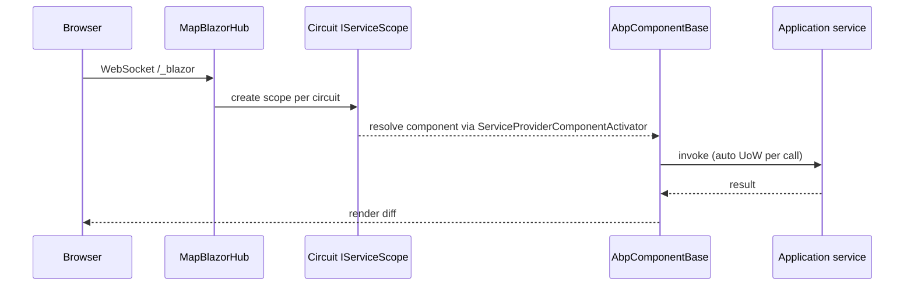

`Volo.Abp.AspNetCore.Components.Server` is the host module that turns an ABP
Framework ASP.NET Core application into a Blazor Server (or Blazor Web App with
server interactivity) host. It is a small package — only four `.cs` files — but
it carries the wiring that connects Blazor's circuit lifetime, SignalR hub, and
ASP.NET Core authentication into the rest of the ABP runtime. The sources sit
under `framework/src/Volo.Abp.AspNetCore.Components.Server/`.

## Module entry point

`AbpAspNetCoreComponentsServerModule` in
`framework/src/Volo.Abp.AspNetCore.Components.Server/Volo/Abp/AspNetCore/Components/Server/AbpAspNetCoreComponentsServerModule.cs`
depends on a focused set of upstream modules:

```csharp
[DependsOn(
    typeof(AbpHttpClientModule),
    typeof(AbpAspNetCoreComponentsWebModule),
    typeof(AbpAspNetCoreSignalRModule),
    typeof(AbpEventBusModule),
    typeof(AbpAspNetCoreMvcContractsModule)
)]
public class AbpAspNetCoreComponentsServerModule : AbpModule
```

`AbpAspNetCoreComponentsWebModule` brings the cookies, local-storage and
exception-handling glue from
`framework/src/Volo.Abp.AspNetCore.Components.Web/`; `AbpAspNetCoreSignalRModule`
brings SignalR (the transport Blazor circuits ride on); and
`AbpAspNetCoreMvcContractsModule` makes the ASP.NET Core MVC contracts (used by
`MapFallbackToPage("/_Host")`) available without dragging the full MVC UI in.

### What ConfigureServices does

The module performs four tasks in order:

1. **Registers a dedicated `HttpClient`** named after
   `BlazorServerLookupApiRequestService` with automatic decompression so the
   server-side lookup helper can hit the API:
   ```csharp
   context.Services.AddHttpClient(nameof(BlazorServerLookupApiRequestService))
       .ConfigurePrimaryHttpMessageHandler(() => new HttpClientHandler
       {
           AutomaticDecompression = DecompressionMethods.All
       });
   ```
2. **Calls `AddServerSideBlazor`** with `DetailedErrors = true` in development
   environments, and replays any pre-configured `IServerSideBlazorBuilder`
   actions registered through ABP's pre-configure pipeline:
   ```csharp
   var serverSideBlazorBuilder = context.Services.AddServerSideBlazor(options =>
   {
       if (context.Services.GetHostingEnvironment().IsDevelopment())
       {
           options.DetailedErrors = true;
       }
   });
   context.Services.ExecutePreConfiguredActions(serverSideBlazorBuilder);
   ```
3. **Excludes `/_blazor` from auditing and unit-of-work** middleware so the
   long-lived SignalR upgrade and the per-message envelopes do not create
   spurious audit logs or UoW scopes:
   ```csharp
   Configure<AbpAspNetCoreUnitOfWorkOptions>(options =>
   {
       options.IgnoredUrls.AddIfNotContains("/_blazor");
   });
   Configure<AbpAspNetCoreAuditingOptions>(options =>
   {
       options.IgnoredUrls.AddIfNotContains("/_blazor");
   });
   ```
4. **Maps the Blazor hub and fallback page** unless `IsBlazorWebApp` is set.
   This is the toggle that distinguishes a classic Blazor Server app from the
   .NET 8 Blazor Web App host:
   ```csharp
   if (!context.Services.ExecutePreConfiguredActions<AbpAspNetCoreComponentsWebOptions>().IsBlazorWebApp)
   {
       var preConfigureActions = context.Services.GetPreConfigureActions<HttpConnectionDispatcherOptions>();
       Configure<AbpEndpointRouterOptions>(options =>
       {
           options.EndpointConfigureActions.Add(endpointContext =>
           {
               endpointContext.Endpoints.MapBlazorHub(httpConnectionDispatcherOptions =>
               {
                   preConfigureActions.Configure(httpConnectionDispatcherOptions);
               });
               endpointContext.Endpoints.MapFallbackToPage("/_Host");
           });
       });
   }
   ```

`AbpAspNetCoreComponentsWebOptions.IsBlazorWebApp` is defined in
`framework/src/Volo.Abp.AspNetCore.Components.Web/Volo/Abp/AspNetCore/Components/Web/AbpAspNetCoreComponentsWebOptions.cs`.
When you opt in to the Blazor Web App model (typical for the latest startup
templates) you set it to `true` and the application itself calls
`AddRazorComponents().AddInteractiveServerComponents()` plus
`MapRazorComponents<TApp>().AddInteractiveServerRenderMode()` so the module
above stays out of the way.

## Cookie authentication helper

`framework/src/Volo.Abp.AspNetCore.Components.Server/Microsoft/AspNetCore/Authentication/Cookies/CookieAuthenticationOptionsExtensions.cs`
contains an extension method that bridges `CookieAuthenticationOptions` and
ABP's OpenIddict/OIDC token-introspection helper. The current `IntrospectAccessToken`
overload is marked `[Obsolete]` and forwards to `CheckTokenExpiration`:

```csharp
[Obsolete("Use CheckTokenExpiration method instead.")]
public static CookieAuthenticationOptions IntrospectAccessToken(
    this CookieAuthenticationOptions options,
    string oidcAuthenticationScheme = "oidc")
{
    return options.CheckTokenExpiration(oidcAuthenticationScheme, null, TimeSpan.FromMinutes(1));
}
```

`CheckTokenExpiration` itself comes from `Volo.Abp.AspNetCore.Authentication.OpenIdConnect`
(via the `AbpHttpClientModule` transitive graph) and wires a
`CookieAuthenticationEvents.OnValidatePrincipal` handler that hits the OIDC
provider's `/connect/introspect` endpoint, refreshes the cookie or signs the
user out as needed. The shape of the helper means a typical Blazor Server +
OIDC setup looks like:

```csharp
services
    .AddAuthentication(CookieAuthenticationDefaults.AuthenticationScheme)
    .AddCookie(options =>
    {
        options.LoginPath = "/Account/Login";
        options.CheckTokenExpiration("oidc", remoteFailureUri: null,
            checkInterval: TimeSpan.FromMinutes(5));
    })
    .AddOpenIdConnect("oidc", ...);
```

`AbpAuthenticationOptions` (the `LoginUrl`/`LogoutUrl` defaults `"Account/Login"` /
`"Account/Logout"`) in
`framework/src/Volo.Abp.AspNetCore.Components.Web/Volo/Abp/AspNetCore/Components/Web/AbpAuthenticationOptions.cs`
matches the Razor Pages account module used by the templates.

## Server-side application configuration reset

`BlazorServerCurrentApplicationConfigurationCacheResetService` in
`framework/src/Volo.Abp.AspNetCore.Components.Server/Volo/Abp/AspNetCore/Components/Server/Configuration/BlazorServerCurrentApplicationConfigurationCacheResetService.cs`
publishes `CurrentApplicationConfigurationCacheResetEventData` on the local
event bus when something invalidates the cached `ApplicationConfigurationDto`
(language switch, impersonation, profile update). It is registered with
`[Dependency(ReplaceServices = true)]` so it overrides the
`NullCurrentApplicationConfigurationCacheResetService` default from the Web
package:

```csharp
[Dependency(ReplaceServices = true)]
public class BlazorServerCurrentApplicationConfigurationCacheResetService :
    ICurrentApplicationConfigurationCacheResetService,
    ITransientDependency
{
    public async Task ResetAsync(Guid? userId = null)
    {
        await _localEventBus.PublishAsync(new CurrentApplicationConfigurationCacheResetEventData(userId));
    }
}
```

A scoped handler in the MVC layer subscribes to that event data and clears the
in-memory cache so the next configuration read goes back to the database.

## Lookup HTTP service

`BlazorServerLookupApiRequestService` in
`framework/src/Volo.Abp.AspNetCore.Components.Server/Volo/Abp/AspNetCore/Components/Server/Extensibility/BlazorServerLookupApiRequestService.cs`
implements `ILookupApiRequestService` for the dynamic lookup picker components
in the theming layer. It can talk to either a local API (Blazor Server mode,
same process) or a remote API (Blazor "tiered" mode, separate API host) by
branching on `IRemoteServiceConfigurationProvider.GetConfigurationOrDefaultOrNullAsync("Default")`:

- **Tiered mode** — sets `client.BaseAddress` to `remoteServiceConfig.BaseUrl`,
  authenticates the request with `IRemoteServiceHttpClientAuthenticator`, and
  forwards the call.
- **Server mode** — sets `client.BaseAddress` to `NavigationManager.BaseUri` and
  copies headers from the current `HttpContext.Request.Headers` so the call
  retains its authentication cookie.

It is registered as `ITransientDependency` so each invocation gets a fresh
`HttpClient` from the named factory configured in `ConfigureServices`.

## Circuit lifetime and per-request scopes

ABP integrates with Blazor circuits via the existing scope mechanism rather
than custom `CircuitHandler` subclasses. Each circuit hangs onto a Blazor scope
through the framework's `IClientScopeServiceProviderAccessor` set up in the
Web package, and `AbpComponentBase` allocates per-component sub-scopes through
`OwningComponentBase`. The unit-of-work and auditing exclusions of `/_blazor`
above mean that long-running SignalR connections do not hold UoW open between
messages; instead, ABP application services start their own UoW per call
through the standard interceptors.



## Pre-configure hooks

Two pre-configure points let other ABP modules influence the server runtime
without inheriting from the module:

- `PreConfigure<IServerSideBlazorBuilder>(builder => ...)` — replayed against
  the builder returned by `AddServerSideBlazor`. This is where you set
  `CircuitOptions.MaxRetainedDisconnectedCircuits` or attach a custom
  `RootComponents` mapping.
- `PreConfigure<HttpConnectionDispatcherOptions>(options => ...)` — replayed
  against the dispatcher options the module passes into `MapBlazorHub`. Use it
  to bump `ApplicationMaxBufferSize`, `TransportMaxBufferSize`, or
  `LongPolling.PollTimeout`.

Both are consumed inside the `EndpointConfigureActions` registration above, so
the order of evaluation is: `PreConfigure` callbacks run during module
`PreConfigureServices`; `ConfigureServices` of
`AbpAspNetCoreComponentsServerModule` resolves them into the closure passed to
`MapBlazorHub`; the ABP endpoint router executes the closure when the
application starts.

## Choosing Blazor Server vs. Blazor Web App

The decision is encoded in `AbpAspNetCoreComponentsWebOptions.IsBlazorWebApp`:

| Flag value | Endpoint mapping owner | Hosting model |
| --- | --- | --- |
| `false` (default) | `AbpAspNetCoreComponentsServerModule` calls `MapBlazorHub` and `MapFallbackToPage("/_Host")` | Classic Blazor Server with `_Host.cshtml`. |
| `true` | Application calls `MapRazorComponents<TApp>().AddInteractiveServerRenderMode()` itself | Blazor Web App; server interactivity is one of the render modes. |

Set the flag before the host module runs:

```csharp
PreConfigure<AbpAspNetCoreComponentsWebOptions>(options =>
{
    options.IsBlazorWebApp = true;
});
```

The same flag is read by
`framework/src/Volo.Abp.AspNetCore.Components.Server.Theming/Bundling/BlazorGlobalScriptContributor.cs`
and `framework/src/Volo.Abp.AspNetCore.Components.Server.Theming.MudBlazor/Bundling/BlazorServerMudBlazorScriptContributor.cs`
to decide whether to inject the bootstrap `<script src="/_framework/blazor.server.js">`
or leave that to the Web App's Razor host file.

## Tips and pitfalls

<Note>
`AddServerSideBlazor` is called *unconditionally* by
`AbpAspNetCoreComponentsServerModule.ConfigureServices`. That means even in
Blazor Web App mode the SignalR-based circuit services are wired up, which
matches what `AddInteractiveServerRenderMode` expects. Do not call
`AddServerSideBlazor` yourself a second time.
</Note>

<Warning>
If you forget to add `/_blazor` to `AbpAspNetCoreUnitOfWorkOptions.IgnoredUrls`,
the SignalR handshake briefly opens a unit of work that lives for the entire
circuit. The module adds it for you via
`framework/src/Volo.Abp.AspNetCore.Components.Server/Volo/Abp/AspNetCore/Components/Server/AbpAspNetCoreComponentsServerModule.cs`,
but custom middleware that wraps the same path needs to mirror the rule or
short-lived UoW state will leak across messages.
</Warning>

<Tip>
The `BlazorServerLookupApiRequestService` decides between "same process" and
"remote API" automatically. If you split your solution into a Blazor Server
host plus a separate API gateway, just register the `Default` remote service
URL in `appsettings.json` under `RemoteServices:Default:BaseUrl` and the
lookup picker will route through the gateway with the
`IRemoteServiceHttpClientAuthenticator` you wired up.
</Tip>
