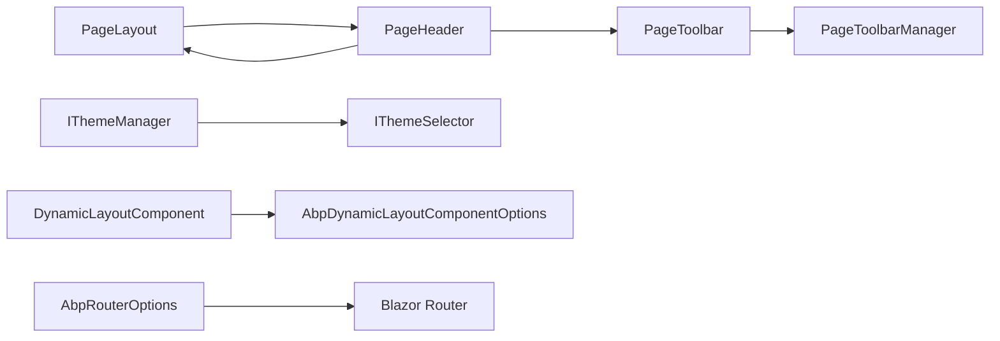

The `*.Theming` packages are the layout and shell layer of the ABP Framework
Blazor stack. They define the cross-cutting `PageLayout`, `PageHeader`, dynamic
layout component, page toolbars, breadcrumb model, theme selector, and router
options that every host (Server / WebAssembly / MAUI Blazor) consumes. Theming
sources live in three sibling packages — one per UI library — with matching
host-specific bundling modules sitting on top:

- `framework/src/Volo.Abp.AspNetCore.Components.Web.Theming/` — Blazorise-based.
- `framework/src/Volo.Abp.AspNetCore.Components.Web.Theming.MudBlazor/` — MudBlazor-based.
- `framework/src/Volo.Abp.AspNetCore.Components.Server.Theming/` — Server bundling on top of the Blazorise theming.
- `framework/src/Volo.Abp.AspNetCore.Components.Server.Theming.MudBlazor/` — Server bundling on top of the MudBlazor theming.
- `framework/src/Volo.Abp.AspNetCore.Components.WebAssembly.Theming/` — WASM theming + Blazorise.
- `framework/src/Volo.Abp.AspNetCore.Components.WebAssembly.Theming.MudBlazor/` — WASM theming + MudBlazor.
- `framework/src/Volo.Abp.AspNetCore.Components.MauiBlazor.Theming/` — MAUI theming + Blazorise.
- `framework/src/Volo.Abp.AspNetCore.Components.MauiBlazor.Theming.MudBlazor/` — MAUI theming + MudBlazor.

## Module entry points

| Module | File |
| --- | --- |
| `AbpAspNetCoreComponentsWebThemingModule` | `framework/src/Volo.Abp.AspNetCore.Components.Web.Theming/AbpAspNetCoreComponentsWebThemingModule.cs` |
| `AbpAspNetCoreComponentsWebThemingMudBlazorModule` | `framework/src/Volo.Abp.AspNetCore.Components.Web.Theming.MudBlazor/AbpAspNetCoreComponentsWebThemingMudBlazorModule.cs` |
| `AbpAspNetCoreComponentsServerThemingModule` | `framework/src/Volo.Abp.AspNetCore.Components.Server.Theming/AbpAspNetCoreComponentsServerThemingModule.cs` |
| `AbpAspNetCoreComponentsServerThemingMudBlazorModule` | `framework/src/Volo.Abp.AspNetCore.Components.Server.Theming.MudBlazor/AbpAspNetCoreComponentsServerThemingMudBlazorModule.cs` |
| `AbpAspNetCoreComponentsWebAssemblyThemingModule` | `framework/src/Volo.Abp.AspNetCore.Components.WebAssembly.Theming/AbpAspNetCoreComponentsWebAssemblyThemingModule.cs` |
| `AbpAspNetCoreComponentsWebAssemblyThemingMudBlazorModule` | `framework/src/Volo.Abp.AspNetCore.Components.WebAssembly.Theming.MudBlazor/AbpAspNetCoreComponentsWebAssemblyThemingMudBlazorModule.cs` |
| `AbpAspNetCoreComponentsMauiBlazorThemingModule` | `framework/src/Volo.Abp.AspNetCore.Components.MauiBlazor.Theming/AbpAspNetCoreComponentsMauiBlazorThemingModule.cs` |
| `AbpAspNetCoreComponentsMauiBlazorThemingMudBlazorModule` | `framework/src/Volo.Abp.AspNetCore.Components.MauiBlazor.Theming.MudBlazor/AbpAspNetCoreComponentsMauiBlazorThemingMudBlazorModule.cs` |

The Web-Theming module is the canonical one and is depended on by every host
variant. It declares `[DependsOn(typeof(AbpBlazoriseUIModule), typeof(AbpUiNavigationModule))]`
and registers `AbpAuthenticationState` as a dynamic layout component:

```csharp
public class AbpAspNetCoreComponentsWebThemingModule : AbpModule
{
    public override void ConfigureServices(ServiceConfigurationContext context)
    {
        Configure<AbpDynamicLayoutComponentOptions>(options =>
        {
            options.Components.Add(typeof(AbpAuthenticationState), null);
        });
    }
}
```

The MudBlazor variant in
`framework/src/Volo.Abp.AspNetCore.Components.Web.Theming.MudBlazor/AbpAspNetCoreComponentsWebThemingMudBlazorModule.cs`
is identical except for `[DependsOn(typeof(AbpMudBlazorUIModule), typeof(AbpUiNavigationModule))]`.

## Sub-namespaces in a theming package

Every theming package follows the same internal folder layout:

| Folder | Concern |
| --- | --- |
| `Theming/` | `ITheme`, `IThemeManager`, `IThemeSelector`, `AbpThemingOptions`, `ThemeInfo`, `ThemeDictionary`, `ThemeNameAttribute` |
| `Layout/` | `PageLayout`, `PageHeader.razor(.cs)`, `PageHeaderOptions`, `StandardLayouts` |
| `Components/` | `DynamicLayoutComponent.razor(.cs)`, `LayoutHooks/LayoutHook.razor(.cs)` |
| `PageToolbars/` | `IPageToolbarContributor`, `IPageToolbarManager`, `PageToolbar`, `PageToolbarContributionContext`, `PageToolbarItem`, `PageToolbarItemList`, `PageToolbarDictionary`, `PageToolbarManager`, `SimplePageToolbarContributor`, `PageToolbarExtensions` |
| `Toolbars/` | `AbpToolbarOptions`, `IToolbarContributor`, `IToolbarManager`, `ToolbarManager`, `StandardToolbars`, `Toolbar`, `ToolbarItem`, `ToolbarConfigurationContext`, `IToolbarConfigurationContext` |
| `Routing/` | `AbpRouterOptions`, `RouterAssemblyList` |
| `Bundling/` | `AbpScripts.razor`, `AbpStyles.razor`, `IComponentBundleManager`, `IComponentBundleUrlBuilder`, `ComponentBundleUrlBuilder` |

The Web-Theming variant ships everything under
`framework/src/Volo.Abp.AspNetCore.Components.Web.Theming/`, e.g.
`Layout/PageLayout.cs`, `Components/DynamicLayoutComponent.razor.cs`,
`PageToolbars/PageToolbarManager.cs`, `Theming/DefaultThemeManager.cs`. The
MudBlazor variant has the same files under
`framework/src/Volo.Abp.AspNetCore.Components.Web.Theming.MudBlazor/`.

## Page layout

`PageLayout` in
`framework/src/Volo.Abp.AspNetCore.Components.Web.Theming/Layout/PageLayout.cs`
is a scoped, `INotifyPropertyChanged`-emitting model bag that drives the active
page's chrome:

```csharp
public class PageLayout : IScopedDependency, INotifyPropertyChanged
{
    public virtual string? Title { get; set; }
    public string? MenuItemName { get; set; }
    public bool ShowToolbar { get; set; } = true;
    public virtual ObservableCollection<BreadcrumbItem> BreadcrumbItems { get; } = new();
    public virtual ObservableCollection<PageToolbarItem> ToolbarItems { get; } = new();

    public event PropertyChangedEventHandler? PropertyChanged;
    public void Reset();
}
```

`Title`, `MenuItemName`, and `BreadcrumbItems` are typically set inside
`OnInitializedAsync` of a page; `PageHeader` and the main menu observe the
changes through `PropertyChanged` and the `ObservableCollection.CollectionChanged`
event. `Reset()` is called by `PageHeader.Dispose()` so the chrome clears when a
page unmounts.

`StandardLayouts` in
`framework/src/Volo.Abp.AspNetCore.Components.Web.Theming/Layout/StandardLayouts.cs`
declares the four layout names every UI library theme should provide:

```csharp
public static class StandardLayouts
{
    public const string Application = "Application";
    public const string Account     = "Account";
    public const string Public      = "Public";
    public const string Empty       = "Empty";
}
```

A theme resolves a layout name to a `Type` (the actual layout component) through
`ITheme.GetLayout(name, fallbackToDefault: true)`.

## Theming services

`framework/src/Volo.Abp.AspNetCore.Components.Web.Theming/Theming/` defines the
theme-resolution chain:

- `ITheme` — `Type GetLayout(string name, bool fallbackToDefault = true);`
- `IThemeManager` — exposes `CurrentTheme`.
- `IThemeSelector` — exposes `GetCurrentThemeInfo()` returning a `ThemeInfo`.
- `AbpThemingOptions` — holds a `ThemeDictionary Themes` and a
  `string? DefaultThemeName`.
- `ThemeInfo` — wraps a `Type ThemeType` and reads its `Name` from
  `ThemeNameAttribute.GetName(themeType)`.
- `ThemeDictionary` — keyed dictionary of registered themes.
- `ThemeExtensions` — extension helpers on the dictionary/options.
- `DefaultThemeManager` and `DefaultThemeSelector` — the conventional pair.

`DefaultThemeSelector` in
`framework/src/Volo.Abp.AspNetCore.Components.Web.Theming/Theming/DefaultThemeSelector.cs`
picks the configured `DefaultThemeName`, falling back to the first registered
theme. `DefaultThemeManager` in
`framework/src/Volo.Abp.AspNetCore.Components.Web.Theming/Theming/DefaultThemeManager.cs`
resolves the actual `ITheme` instance from DI using the type the selector
returns:

```csharp
protected virtual ITheme GetCurrentTheme()
{
    if (_currentTheme != null) return _currentTheme;
    _currentTheme = (ITheme)ServiceProvider.GetRequiredService(ThemeSelector.GetCurrentThemeInfo().ThemeType);
    return _currentTheme;
}
```

A starter app does not need to implement `ITheme` directly — the LeptonX or
Basic theme packages built on top of these abstractions do that.

## Dynamic layout component

`AbpDynamicLayoutComponentOptions` in
`framework/src/Volo.Abp.AspNetCore.Components.Web.Theming/AbpDynamicLayoutComponentOptions.cs`
holds a typed map of components to render into the layout:

```csharp
public class AbpDynamicLayoutComponentOptions
{
    public Dictionary<Type, IDictionary<string, object>?> Components { get; set; }
}
```

`DynamicLayoutComponent` in
`framework/src/Volo.Abp.AspNetCore.Components.Web.Theming/Components/DynamicLayoutComponent.razor.cs`
reads the options and renders each entry via a `DynamicComponent`-style
fragment. Modules contribute extra components by configuring the options:

```csharp
Configure<AbpDynamicLayoutComponentOptions>(options =>
{
    options.Components.Add(typeof(MyDiagnosticBadge), new Dictionary<string, object>
    {
        ["IsCompact"] = true
    });
});
```

`LayoutHook` in
`framework/src/Volo.Abp.AspNetCore.Components.Web.Theming/Components/LayoutHooks/LayoutHook.razor.cs`
is the matching marker used by layout authors to expose a named extension slot
into which dynamic components are rendered.

## Page header

`PageHeader` in
`framework/src/Volo.Abp.AspNetCore.Components.Web.Theming/Layout/PageHeader.razor.cs`
binds to `PageLayout` and a `PageToolbar`:

```csharp
public partial class PageHeader : ComponentBase, IDisposable
{
    [Inject] public PageLayout PageLayout { get; private set; } = default!;

    [Parameter] public string? Title { get => PageLayout.Title; set => PageLayout.Title = value; }
    [Parameter] public bool BreadcrumbShowHome { get; set; } = true;
    [Parameter] public bool BreadcrumbShowCurrent { get; set; } = true;
    [Parameter] public PageToolbar? Toolbar { get; set; }
    [Parameter] public List<BreadcrumbItem> BreadcrumbItems { get; set; }
    [Parameter] public RenderFragment ChildContent { get; set; } = default!;
}
```

On `OnParametersSetAsync` the header pulls items from
`PageToolbarManager.GetItemsAsync(Toolbar)` and either renders them directly
(when `PageHeaderOptions.RenderToolbar = true`) or pushes them onto
`PageLayout.ToolbarItems` so a separate toolbar control elsewhere in the
layout can render them. On dispose it calls `PageLayout.Reset()`.

`PageHeaderOptions` next to it controls `RenderToolbar` and other defaults.

## Page toolbars

Page toolbars are the per-page action bar (Save / Delete / Refresh). They are
built from a `PageToolbar` (a list of `IPageToolbarContributor`) and rendered
as `PageToolbarItem` instances.

| Class | File |
| --- | --- |
| `PageToolbar` | `framework/src/Volo.Abp.AspNetCore.Components.Web.Theming/PageToolbars/PageToolbar.cs` |
| `IPageToolbarContributor` | `framework/src/Volo.Abp.AspNetCore.Components.Web.Theming/PageToolbars/IPageToolbarContributor.cs` |
| `PageToolbarContributorList` | `framework/src/Volo.Abp.AspNetCore.Components.Web.Theming/PageToolbars/PageToolbarContributorList.cs` |
| `IPageToolbarManager` | `framework/src/Volo.Abp.AspNetCore.Components.Web.Theming/PageToolbars/IPageToolbarManager.cs` |
| `PageToolbarManager` | `framework/src/Volo.Abp.AspNetCore.Components.Web.Theming/PageToolbars/PageToolbarManager.cs` |
| `PageToolbarContributionContext` | `framework/src/Volo.Abp.AspNetCore.Components.Web.Theming/PageToolbars/PageToolbarContributionContext.cs` |
| `PageToolbarItem` / `PageToolbarItemList` / `PageToolbarDictionary` | same folder |
| `SimplePageToolbarContributor` | same folder |

`PageToolbarManager.GetItemsAsync` opens a fresh service scope per call so the
contributors can resolve scoped services, then orders the items by their
`Order` property:

```csharp
public virtual async Task<PageToolbarItem[]> GetItemsAsync(PageToolbar toolbar)
{
    if (toolbar == null || !toolbar.Contributors.Any()) return Array.Empty<PageToolbarItem>();

    using var scope = ServiceScopeFactory.CreateScope();
    var context = new PageToolbarContributionContext(scope.ServiceProvider);

    foreach (var contributor in toolbar.Contributors)
        await contributor.ContributeAsync(context);

    return context.Items.OrderBy(i => i.Order).ToArray();
}
```

## Main toolbars

The *main* toolbars are global elements (header actions, language switcher,
user menu) and live in the `Toolbars/` folder.

```csharp
public static class StandardToolbars
{
    public const string Main = "Main";
}
```

`AbpToolbarOptions` in
`framework/src/Volo.Abp.AspNetCore.Components.Web.Theming/Toolbars/AbpToolbarOptions.cs`
holds a `List<IToolbarContributor> Contributors`. `IToolbarManager.GetAsync(name)`
in
`framework/src/Volo.Abp.AspNetCore.Components.Web.Theming/Toolbars/IToolbarManager.cs`
returns the named `Toolbar`. `ToolbarManager` and `ToolbarConfigurationContext`
next to it materialise the toolbar by invoking each contributor.

The application module typically configures both the main toolbar and a page
toolbar dictionary in `ConfigureServices`:

```csharp
Configure<AbpToolbarOptions>(o =>
{
    o.Contributors.Add(new MyHeaderToolbarContributor());
});
```

## Breadcrumbs

`BreadcrumbItem` is defined inside the UI library packages — for Blazorise in
`framework/src/Volo.Abp.BlazoriseUI/BreadcrumbItem.cs`:

```csharp
public class BreadcrumbItem
{
    public string Text { get; set; }
    public object? Icon { get; set; }
    public string? Url { get; set; }
    public BreadcrumbItem(string text, string? url = null, object? icon = null);
}
```

Pages push items into `PageLayout.BreadcrumbItems` in their `OnInitializedAsync`
and the layout renders the trail. The MudBlazor variant ships its own
`BreadcrumbItem` in the MudBlazorUI package — they are semantically identical.

## Routing extensibility

`AbpRouterOptions` in
`framework/src/Volo.Abp.AspNetCore.Components.Web.Theming/Routing/AbpRouterOptions.cs`
exposes the app assembly plus a `RouterAssemblyList AdditionalAssemblies`:

```csharp
public class AbpRouterOptions
{
    public Assembly AppAssembly { get; set; } = default!;
    public RouterAssemblyList AdditionalAssemblies { get; }
}
```

`RouterAssemblyList` in the same folder is a thin `List<Assembly>` with
de-duplication. The Web App template feeds this to Blazor's `<Router>`:

```razor
<Router AppAssembly="@Options.AppAssembly"
        AdditionalAssemblies="@Options.AdditionalAssemblies">
```

ABP feature modules add their assembly to `AdditionalAssemblies` in
`ConfigureServices` so their `@page` routes become routable.

## Bundling abstractions

The theming packages ship `<AbpStyles />` and `<AbpScripts />` Razor components
in `framework/src/Volo.Abp.AspNetCore.Components.Web.Theming/Bundling/AbpStyles.razor`
and `AbpScripts.razor`. They consume:

- `IComponentBundleManager` in
  `framework/src/Volo.Abp.AspNetCore.Components.Web.Theming/Bundling/IComponentBundleManager.cs`
  — returns `IReadOnlyList<string>` for a bundle name. Host packages implement
  it differently (Server reads from `IBundleManager`, WASM returns empty).
- `IComponentBundleUrlBuilder` in
  `framework/src/Volo.Abp.AspNetCore.Components.Web.Theming/Bundling/IComponentBundleUrlBuilder.cs`
  — turns a relative bundle path into the host's absolute URL.
- `ComponentBundleUrlBuilder` in
  `framework/src/Volo.Abp.AspNetCore.Components.Web.Theming/Bundling/ComponentBundleUrlBuilder.cs`
  — default implementation that respects an `appBasePath` or extracts it from
  `NavigationManager.BaseUri`, leaves external URLs (`https://`, `//`)
  untouched, and prepends the path base when needed.

The actual bundle contents are populated by `IBundleContributor` classes in the
`*.Theming.Bundling` packages — see `/blazor/bundling`.

## How the pieces fit together



## Tips

<Note>
Every theming package wires `AbpAuthenticationState` (defined in
`framework/src/Volo.Abp.AspNetCore.Components.Web/Volo/Abp/AspNetCore/Components/Web/Security/AbpAuthenticationState.cs`)
into `AbpDynamicLayoutComponentOptions`. That is why your layout does not
need to mount the state listener manually — the dynamic layout component
renders it for you.
</Note>

<Tip>
Keep `PageLayout` mutations inside `OnParametersSetAsync` or
`OnInitializedAsync`, never inside the `BuildRenderTree` flow. The class
fires `PropertyChanged` on every setter, so changing `Title` during render
can cause an infinite re-render loop.
</Tip>

<Warning>
The MudBlazor theming variant
(`framework/src/Volo.Abp.AspNetCore.Components.Web.Theming.MudBlazor/`)
re-declares many of the same types (`PageLayout`, `PageHeader`,
`PageToolbar`, etc.) under the
`Volo.Abp.AspNetCore.Components.Web.Theming.MudBlazor` root namespace. Pick
one variant per application — mixing the Blazorise and MudBlazor theming
modules in the same module graph will give you duplicate registrations of
`PageLayout` from two assemblies.
</Warning>
