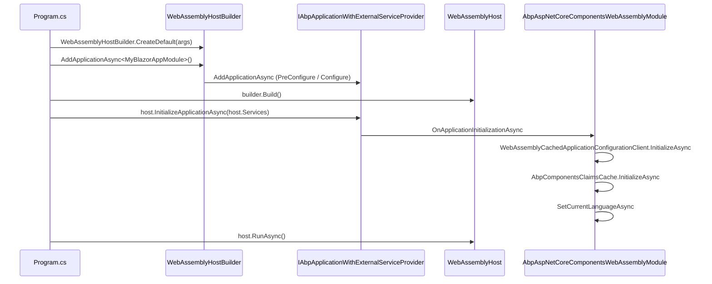

`Volo.Abp.AspNetCore.Components.WebAssembly` adapts the ABP Framework to run
inside a `Microsoft.AspNetCore.Components.WebAssembly.Hosting.WebAssemblyHost`.
It owns the bootstrap extensions you call from `Program.cs` (`AddApplicationAsync`,
`InitializeApplicationAsync`), the OIDC remote-authentication state provider
that wraps Microsoft's `RemoteAuthenticationService<...>`, a delegating
`HttpClient` handler that injects culture/anti-forgery/timezone headers into
every API call, and a cached application-configuration client that survives
across page reloads. All sources live under
`framework/src/Volo.Abp.AspNetCore.Components.WebAssembly/`.

## Module entry point

`AbpAspNetCoreComponentsWebAssemblyModule` in
`framework/src/Volo.Abp.AspNetCore.Components.WebAssembly/Volo/Abp/AspNetCore/Components/WebAssembly/AbpAspNetCoreComponentsWebAssemblyModule.cs`
depends on the MVC client and the shared Web layer:

```csharp
[DependsOn(
    typeof(AbpAspNetCoreMvcClientCommonModule),
    typeof(AbpUiModule),
    typeof(AbpAspNetCoreComponentsWebModule)
)]
public class AbpAspNetCoreComponentsWebAssemblyModule : AbpModule
```

### PreConfigureServices

`PreConfigureServices` does two things. First it pulls the
`WebAssemblyHostEnvironment` out of the service collection (via
`services.GetWebAssemblyHostEnvironment()` defined in
`framework/src/Volo.Abp.AspNetCore.Components.WebAssembly/Microsoft/Extensions/DependencyInjection/AbpWebAssemblyServiceCollectionExtensions.cs`)
and writes its `Environment` into `IAbpHostEnvironment.EnvironmentName` when
nothing else has set it yet. Second, it adds the
`AbpBlazorClientHttpMessageHandler` to every HTTP client proxy:

```csharp
PreConfigure<AbpHttpClientBuilderOptions>(options =>
{
    options.ProxyClientBuildActions.Add((_, builder) =>
    {
        builder.AddHttpMessageHandler<AbpBlazorClientHttpMessageHandler>();
    });
});
```

That handler, defined in
`framework/src/Volo.Abp.AspNetCore.Components.WebAssembly/Volo/Abp/AspNetCore/Components/WebAssembly/AbpBlazorClientHttpMessageHandler.cs`,
runs `IUiPageProgressService.Go(null)` to show an indeterminate progress bar,
sets the `Accept-Language` header from `localStorage["Abp.SelectedLanguage"]`,
fetches the antiforgery `XSRF-TOKEN` cookie via `ICookieService` and forwards
it as `RequestVerificationToken`, sets the current timezone header from
`ICurrentTimezoneProvider`, and finally hides the progress bar in `finally`.
The HTTPS branch also enables `SetBrowserRequestStreamingEnabled(true)` so
large request bodies stream.

### ConfigureServices

`ConfigureServices` does three things:

1. Adds the default `IHttpClientFactory` (`AddHttpClient()`).
2. Plugs an `AbpExceptionHandlingLoggerProvider` (from the Web package) into the
   `WebAssemblyHostBuilder.Logging` pipeline so unhandled exceptions in
   components are routed through ABP's `IUserExceptionInformer`.
3. If `IsBlazorWebApp` is `false`, overrides the login/logout URLs to the
   `RemoteAuthenticator`-style routes:
   ```csharp
   Configure<AbpAuthenticationOptions>(options =>
   {
       options.LoginUrl = "authentication/login";
       options.LogoutUrl = "authentication/logout";
   });
   ```

### PostConfigureServices

`PostConfigureServices` swaps Microsoft's `RemoteAuthenticationService<,,>` for
ABP's `WebAssemblyAuthenticationStateProvider<,,>` whenever an OIDC-flavoured
state provider was registered earlier:

```csharp
var msAuthenticationStateProvider = context.Services
    .FirstOrDefault(x => x.ServiceType == typeof(AuthenticationStateProvider));

if (msAuthenticationStateProvider is { ImplementationType: not null } &&
    msAuthenticationStateProvider.ImplementationType.IsGenericType &&
    msAuthenticationStateProvider.ImplementationType.GetGenericTypeDefinition()
        == typeof(RemoteAuthenticationService<,,>))
{
    var webAssemblyType = typeof(WebAssemblyAuthenticationStateProvider<,,>)
        .MakeGenericType(msAuthenticationStateProvider.ImplementationType.GenericTypeArguments);
    context.Services.Replace(ServiceDescriptor.Scoped(typeof(AuthenticationStateProvider), webAssemblyType));
}
```

This means you keep calling `builder.Services.AddOidcAuthentication(...)` as
usual; ABP just inherits the type parameters and gets the augmented behaviour
described below.

### OnApplicationInitialization

`OnApplicationInitializationAsync` runs three async steps via the
`IClientScopeServiceProviderAccessor`:

1. `WebAssemblyCachedApplicationConfigurationClient.InitializeAsync()` — loads
   the `ApplicationConfigurationDto` from the server and stores it in
   `ApplicationConfigurationCache`.
2. `AbpComponentsClaimsCache.InitializeAsync()` — pulls the current principal
   from the authentication state provider.
3. `SetCurrentLanguageAsync` — sets `CultureInfo.DefaultThreadCurrentCulture`
   and `DefaultThreadCurrentUICulture` from the configuration, and toggles the
   `rtl` class on `<body>` for right-to-left languages.

## WebAssemblyHostBuilder integration

`AbpWebAssemblyHostBuilderExtensions` in
`framework/src/Volo.Abp.AspNetCore.Components.WebAssembly/Microsoft/AspNetCore/Components/WebAssembly/Hosting/AbpWebAssemblyHostBuilderExtensions.cs`
is what your `Program.cs` calls. The async overload is the recommended one:

```csharp
var builder = WebAssemblyHostBuilder.CreateDefault(args);
builder.RootComponents.Add<App>("#app");

await builder.AddApplicationAsync<MyBlazorAppModule>(options =>
{
    // options.HostBuilder is the WebAssemblyHostBuilder
    // options.ApplicationCreationOptions is the AbpApplicationCreationOptions
});

var host = builder.Build();
await host.Services.GetRequiredService<IAbpApplicationWithExternalServiceProvider>()
    .InitializeApplicationAsync(host.Services);
await host.RunAsync();
```

Behind the scenes the extension:

1. Registers `Castle.DynamicProxy`'s `AsyncStateMachineAttribute` workaround.
2. Registers `IConfiguration` and the `WebAssemblyHostBuilder` itself as
   singletons.
3. Calls `services.AddApplicationAsync<TStartupModule>(...)` which constructs
   the ABP module tree and runs `PreConfigureServices`/`ConfigureServices`.
4. Picks up `builder.HostEnvironment.Environment` and writes it into
   `AbpApplicationCreationOptions.Environment` when it is blank.

The matching `InitializeApplicationAsync` extension also pins
`ComponentsClientScopeServiceProviderAccessor.ServiceProvider` to the host's
`IServiceProvider` so that the framework's "client scope" is the same scope as
the WASM host's root scope.

`AbpWebAssemblyApplicationCreationOptions` in
`framework/src/Volo.Abp.AspNetCore.Components.WebAssembly/Volo/Abp/AspNetCore/Components/WebAssembly/AbpWebAssemblyApplicationCreationOptions.cs`
is a small DTO that exposes both `HostBuilder` and the wrapped
`AbpApplicationCreationOptions` to your configuration delegate.

<Tip>
The Autofac variant lives in
`framework/src/Volo.Abp.Autofac.WebAssembly/`. Add a reference and call
`options.ApplicationCreationOptions.UseAutofac()` from inside the
`AddApplicationAsync` configuration delegate to swap the conventional
registrar for the Autofac one.
</Tip>

## OIDC authentication state provider

`WebAssemblyAuthenticationStateProvider<TRemoteAuthenticationState, TAccount, TProviderOptions>`
in
`framework/src/Volo.Abp.AspNetCore.Components.WebAssembly/Volo/Abp/AspNetCore/Components/WebAssembly/WebAssemblyAuthenticationStateProvider.cs`
extends Microsoft's `RemoteAuthenticationService<,,>`. It does three things on
top of the base behaviour:

- Tracks every access token it sees in a static
  `ConcurrentDictionary<string, string>` keyed by the token value itself.
- When more than one token is present, revokes the stale ones by calling
  `httpClient.RevokeTokenAsync(...)` (Duende.IdentityModel) against
  `authority.EnsureEndsWith('/') + WebAssemblyAuthenticationStateProviderOptions.TokenRevocationUrl`.
  The default revocation path is `"connect/revocat"` (intentional — it matches
  the OpenIddict endpoint) defined in
  `framework/src/Volo.Abp.AspNetCore.Components.WebAssembly/Volo/Abp/AspNetCore/Components/WebAssembly/WebAssemblyAuthenticationStateProviderOptions.cs`.
- Re-initialises `WebAssemblyCachedApplicationConfigurationClient` whenever the
  state shows an authenticated user but the cached configuration still says
  the user is anonymous.

Token revocation is skipped when two tokens share the same `AbpClaimTypes.SessionId`
claim — that is how the framework prevents revoking a token that is still in
use by the current session.

### Blazor Web App access tokens

For Blazor Web App scenarios (server-rendered shell with a WASM island),
`framework/src/Volo.Abp.AspNetCore.Components.WebAssembly/Microsoft/Extensions/DependencyInjection/AbpBlazorWebAppServiceCollectionExtensions.cs`
exposes `AddBlazorWebAppServices()`:

```csharp
public static IServiceCollection AddBlazorWebAppServices(this IServiceCollection services)
{
    services.AddSingleton<AuthenticationStateProvider, RemoteAuthenticationStateProvider>();
    services.Replace(ServiceDescriptor.Transient<IAbpAccessTokenProvider, CookieBasedWebAssemblyAbpAccessTokenProvider>());
    return services;
}
```

`RemoteAuthenticationStateProvider` in
`framework/src/Volo.Abp.AspNetCore.Components.WebAssembly/Volo/Abp/AspNetCore/Components/WebAssembly/WebApp/RemoteAuthenticationStateProvider.cs`
delegates straight to `ICurrentPrincipalAccessor.Principal`, and
`CookieBasedWebAssemblyAbpAccessTokenProvider` in the same folder returns
`null` because the access token lives in a server-side cookie.

The legacy `AddBlazorWebAppTieredServices` overload is marked `[Obsolete]` and
keeps the old `PersistentComponentStateAbpAccessTokenProvider` for templates
that have not migrated yet. That provider, defined in
`framework/src/Volo.Abp.AspNetCore.Components.WebAssembly/Volo/Abp/AspNetCore/Components/WebAssembly/WebApp/PersistentComponentStateAbpAccessTokenProvider.cs`,
reads the token from `PersistentComponentState` using the
`PersistentAccessToken.Key = "access_token"` constant.

## Cached application configuration

`WebAssemblyCachedApplicationConfigurationClient` in
`framework/src/Volo.Abp.AspNetCore.Components.WebAssembly/Volo/Abp/AspNetCore/Components/WebAssembly/WebAssemblyCachedApplicationConfigurationClient.cs`
implements `ICachedApplicationConfigurationClient`. It:

1. Calls `AbpApplicationConfigurationClientProxy.GetAsync(...)` to fetch the
   server-rendered `ApplicationConfigurationDto`.
2. Calls `AbpApplicationLocalizationClientProxy.GetAsync(...)` for the
   dynamic localization resources for the current culture.
3. Stores the merged DTO in `ApplicationConfigurationCache`.
4. If the principal is anonymous, calls
   `JSRuntime.InvokeVoidAsync("abp.utils.removeOidcUser")` to flush the OIDC
   user store in browser storage.
5. Updates `CurrentTenantAccessor.Current` from
   `configurationDto.CurrentTenant`.
6. Synchronises the browser timezone with `ICurrentTimezoneProvider` and writes
   it to a cookie via `abp.clock.setBrowserTimeZoneToCookie`.
7. Raises `ApplicationConfigurationChangedService.NotifyChanged()`.

`Get()` and `GetAsync()` then return the cached value; if nothing has been
cached yet they throw
`"WebAssemblyCachedApplicationConfigurationClient should be initialized before using it."`
which surfaces fast if you forget to call `InitializeApplicationAsync` from
`Program.cs`.

## Other replaced services

| Service | Implementation | File |
| --- | --- | --- |
| `IServerUrlProvider` | `WebAssemblyServerUrlProvider` | `framework/src/Volo.Abp.AspNetCore.Components.WebAssembly/Volo/Abp/AspNetCore/Components/WebAssembly/WebAssemblyServerUrlProvider.cs` |
| `ICurrentTenantAccessor` | `WebAssemblyCurrentTenantAccessor` (singleton) | `framework/src/Volo.Abp.AspNetCore.Components.WebAssembly/Volo/Abp/AspNetCore/Components/WebAssembly/WebAssemblyCurrentTenantAccessor.cs` |
| `ICurrentTimezoneProvider` consumer | `WebAssemblyCurrentTimezoneProvider` | `framework/src/Volo.Abp.AspNetCore.Components.WebAssembly/Volo/Abp/AspNetCore/Components/WebAssembly/WebAssemblyCurrentTimezoneProvider.cs` |
| `ICurrentPrincipalAccessor` | `WebAssemblyRemoteCurrentPrincipalAccessor` | `framework/src/Volo.Abp.AspNetCore.Components.WebAssembly/Volo/Abp/AspNetCore/Components/WebAssembly/WebAssemblyRemoteCurrentPrincipalAccessor.cs` |
| `IMultiTenantUrlProvider` | `WebAssemblyMultiTenantUrlProvider` | `framework/src/Volo.Abp.AspNetCore.Components.WebAssembly/Volo/Abp/AspNetCore/Components/WebAssembly/MultiTenant/WebAssemblyMultiTenantUrlProvider.cs` |
| `ICurrentApplicationConfigurationCacheResetService` | `BlazorWebAssemblyCurrentApplicationConfigurationCacheResetService` | `framework/src/Volo.Abp.AspNetCore.Components.WebAssembly/Volo/Abp/AspNetCore/Components/WebAssembly/Configuration/BlazorWebAssemblyCurrentApplicationConfigurationCacheResetService.cs` |
| `ILookupApiRequestService` | `WebAssemblyLookupApiRequestService` | `framework/src/Volo.Abp.AspNetCore.Components.WebAssembly/Volo/Abp/AspNetCore/Components/WebAssembly/Extensibility/WebAssemblyLookupApiRequestService.cs` |

## Culture routing helpers

`IRouteBasedCultureNavigationHelper` in
`framework/src/Volo.Abp.AspNetCore.Components.WebAssembly/Volo/Abp/AspNetCore/Components/WebAssembly/IRouteBasedCultureNavigationHelper.cs`
and its default `RouteBasedCultureNavigationHelper` in
`framework/src/Volo.Abp.AspNetCore.Components.WebAssembly/Volo/Abp/AspNetCore/Components/WebAssembly/RouteBasedCultureNavigationHelper.cs`
encapsulate the routing rule that culture lives at the *first segment* of the
URL (`/tr/Account/Login`, `/en/Books`). The helper handles three cases:

- No-op if the first segment already matches the target culture.
- Replace the segment if it matches another known culture.
- Prefix the culture if no culture is currently in the URL.

`IRouteBasedCultureUrlHelper` and `RouteBasedCultureUrlHelper` next door build
canonical URLs for menu links so the active culture survives navigation.

## End-to-end startup



## Tips

<Note>
`AbpBlazorClientHttpMessageHandler` runs *before* Microsoft's
`BaseAddressAuthorizationMessageHandler` because ABP adds it via
`PreConfigure<AbpHttpClientBuilderOptions>.ProxyClientBuildActions` to every
generated proxy client. Authorisation headers therefore go through after the
ABP handler has set culture, antiforgery, and timezone headers — exactly
once per call.
</Note>

<Warning>
Static dictionaries inside
`WebAssemblyAuthenticationStateProvider.AccessTokens` are shared across the
whole WASM process. That is fine because WASM runs single-user per browser
session, but be aware that hot-reloading during development may carry tokens
across reloads and you might see a `RevokeToken` call that targets a token
from your previous session.
</Warning>

<Tip>
The `WebAssemblyCachedApplicationConfigurationClient.InitializeAsync` call is
performed automatically by the module. You only need to call it manually if
you trigger a deep state change (impersonation, tenant switch) — and the
preferred way to do that is to call
`ICurrentApplicationConfigurationCacheResetService.ResetAsync(...)` which is
implemented for WASM in
`framework/src/Volo.Abp.AspNetCore.Components.WebAssembly/Volo/Abp/AspNetCore/Components/WebAssembly/Configuration/BlazorWebAssemblyCurrentApplicationConfigurationCacheResetService.cs`.
</Tip>
