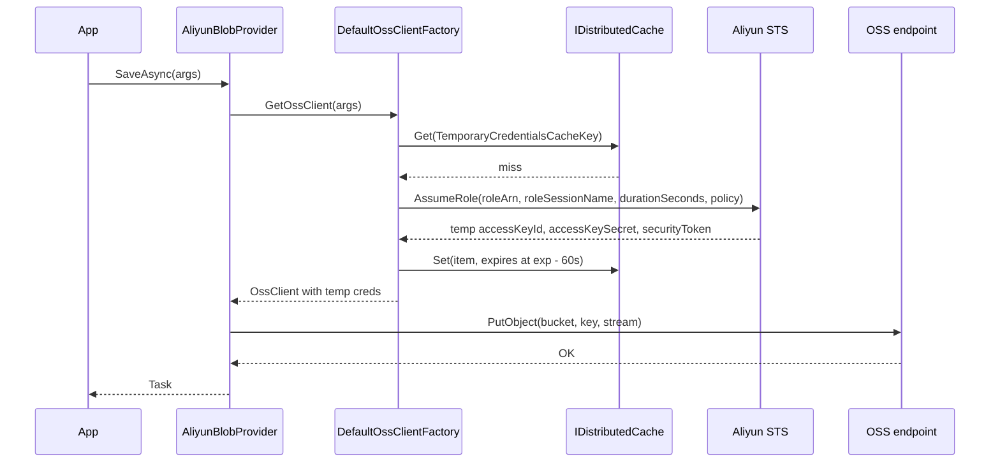

The `Volo.Abp.BlobStoring.Aliyun` package implements `IBlobProvider` against Aliyun Object Storage Service (OSS) using the official `Aliyun.OSS.SDK.NetCore` library. It supports two credential modes — sub-account access keys for long-lived deployments and Security Token Service (STS) temporary credentials for scoped per-tenant or per-user access. Source: `framework/src/Volo.Abp.BlobStoring.Aliyun/Volo/Abp/BlobStoring/Aliyun/`.

## Package layout

```
framework/src/Volo.Abp.BlobStoring.Aliyun/Volo/Abp/BlobStoring/Aliyun/
├── AbpBlobStoringAliyunModule.cs
├── AliyunBlobContainerConfigurationExtensions.cs
├── AliyunBlobNamingNormalizer.cs
├── AliyunBlobProvider.cs
├── AliyunBlobProviderConfiguration.cs
├── AliyunBlobProviderConfigurationNames.cs
├── AliyunTemporaryCredentialsCacheItem.cs
├── DefaultAliyunBlobNameCalculator.cs
├── DefaultOssClientFactory.cs
├── IAliyunBlobNameCalculator.cs
└── IOssClientFactory.cs
```

The shape — `*BlobProvider` + `*BlobProviderConfiguration` + `*BlobContainerConfigurationExtensions` + `Default*ClientFactory` — mirrors the AWS package one-for-one. The Aliyun-specific twist is in the `IOssClientFactory` abstraction that hides credential mode behind a uniform `OssClient` accessor.

## Module

`AbpBlobStoringAliyunModule.cs` declares dependencies on `AbpBlobStoringModule` and `AbpCachingModule` (the latter so STS credentials can be cached in `IDistributedCache`).

## AliyunBlobProvider

`AliyunBlobProvider.cs` is registered as `ITransientDependency`. It composes:

- `IAliyunBlobNameCalculator` — produces the OSS object key (with multi-tenant prefix).
- `IOssClientFactory` — yields an `OssClient` configured with sub-account or STS credentials.
- `IBlobNormalizeNamingService` — runs registered naming normalizers.

### SaveAsync

The save path mirrors the other providers:

1. Compute the bucket name (`GetContainerName(args)`).
2. Compute the OSS object key (`AliyunBlobNameCalculator.Calculate(args)`).
3. Get an `OssClient` from `IOssClientFactory` (using either the sub-account key/secret or STS-derived credentials).
4. If `args.OverrideExisting` is false and the object exists, throw `BlobAlreadyExistsException`.
5. If `CreateContainerIfNotExists` is true, ensure the bucket exists via `ossClient.DoesBucketExist` + `CreateBucket`.
6. Call `ossClient.PutObject(bucket, key, args.BlobStream)`.

### Other operations

- `DeleteAsync` — `ossClient.DeleteObject(bucket, key)` after an existence check.
- `ExistsAsync` — `ossClient.DoesObjectExist(bucket, key)`.
- `GetOrNullAsync` — `ossClient.GetObject(bucket, key)` returns an `OssObject` whose `Content` stream is returned to the caller (and must be disposed).

## AliyunBlobProviderConfiguration

The configuration in `AliyunBlobProviderConfiguration.cs` is one of the larger ones because STS support requires several extra fields:

| Property | Purpose | Required for |
|---|---|---|
| `AccessKeyId` | Sub-account access key id (or STS RAM principal key id). | always |
| `AccessKeySecret` | Sub-account secret. | always |
| `Endpoint` | OSS endpoint URL (`oss-cn-hangzhou.aliyuncs.com`, etc.). | always |
| `UseSecurityTokenService` | Toggle STS mode. | STS mode |
| `RegionId` | Region used by the STS endpoint. | STS mode |
| `RoleArn` | Role ARN to assume — `acs:ram::$accountID:role/$roleName`. | STS mode |
| `RoleSessionName` | Identifier for the STS session (e.g. `tenant-{id}`). | STS mode |
| `DurationSeconds` | STS credential lifetime (900–3600s). | STS mode |
| `Policy` | Inline RAM policy scoping the temporary credentials. | STS mode |
| `ContainerName` | Override the bucket name. | optional |
| `CreateContainerIfNotExists` | Create the bucket on first save. | optional |
| `TemporaryCredentialsCacheKey` | Cache key under which STS credentials are stored. | auto-generated |

The constraints come straight from `AliyunBlobProviderConfiguration.cs`:

- `DurationSeconds` accepts 900–3600 (15 minutes to 1 hour) — note this is narrower than the AWS range of up to 36 hours.
- The XML doc on `Policy` explicitly states: "If policy is empty, the user will get all permissions under this role" — a sharp difference from AWS where empty policies are rejected.
- `ContainerName` follows OSS bucket naming: 3–63 chars, lowercase, digits, hyphens, no consecutive hyphens.

## DefaultOssClientFactory

`DefaultOssClientFactory.cs` implements `IOssClientFactory`. The factory:

1. Reads `args.Configuration.GetAliyunConfiguration()` to determine credential mode.
2. In sub-account mode, returns `new OssClient(endpoint, accessKeyId, accessKeySecret)`.
3. In STS mode, calls `Aliyun.Acs.Core.DefaultAcsClient.GetAcsResponse(new AssumeRoleRequest { ... })` with `RoleArn`, `RoleSessionName`, `DurationSeconds`, and `Policy`. The resulting credentials are cached under `TemporaryCredentialsCacheKey` for `DurationSeconds - 60` and a new `OssClient(endpoint, tempAccessKeyId, tempAccessKeySecret, securityToken)` is returned.

The cache item type is `AliyunTemporaryCredentialsCacheItem` (`AliyunTemporaryCredentialsCacheItem.cs`), which holds the three STS fields plus an expiration timestamp.

To customize the factory (for example to point at a non-standard STS endpoint), register your own `IOssClientFactory` via `context.Services.Replace(...)`.

## DefaultAliyunBlobNameCalculator and naming normalizer

`DefaultAliyunBlobNameCalculator.cs` follows the conventional prefix pattern `host/{blobName}` or `tenants/{tenantId}/{blobName}`.

`AliyunBlobNamingNormalizer.cs` enforces OSS naming rules: lowercase, digits, hyphens; no leading/trailing/consecutive hyphens; 3–63 chars.

## Configuration extension

`AliyunBlobContainerConfigurationExtensions.cs`:

```csharp
public static AliyunBlobProviderConfiguration GetAliyunConfiguration(this BlobContainerConfiguration containerConfiguration)
    => new AliyunBlobProviderConfiguration(containerConfiguration);

public static BlobContainerConfiguration UseAliyun(
    this BlobContainerConfiguration containerConfiguration,
    Action<AliyunBlobProviderConfiguration> aliyunConfigureAction)
{
    containerConfiguration.ProviderType = typeof(AliyunBlobProvider);
    containerConfiguration.NamingNormalizers.TryAdd<AliyunBlobNamingNormalizer>();

    aliyunConfigureAction(new AliyunBlobProviderConfiguration(containerConfiguration));

    return containerConfiguration;
}
```

## Typical configuration

### Sub-account mode

```csharp
[DependsOn(typeof(AbpBlobStoringAliyunModule))]
public class MyAppModule : AbpModule
{
    public override void ConfigureServices(ServiceConfigurationContext context)
    {
        var cfg = context.Services.GetConfiguration();

        Configure<AbpBlobStoringOptions>(options =>
        {
            options.Containers.Configure<ReportContainer>(c =>
            {
                c.UseAliyun(oss =>
                {
                    oss.AccessKeyId     = cfg["Storage:Aliyun:AccessKeyId"]!;
                    oss.AccessKeySecret = cfg["Storage:Aliyun:AccessKeySecret"]!;
                    oss.Endpoint        = cfg["Storage:Aliyun:Endpoint"]!;
                    oss.ContainerName   = "my-org-reports";
                    oss.CreateContainerIfNotExists = false;
                });
            });
        });
    }
}
```

### STS mode

```csharp
c.UseAliyun(oss =>
{
    oss.AccessKeyId        = cfg["Storage:Aliyun:RamUserAccessKeyId"]!;
    oss.AccessKeySecret    = cfg["Storage:Aliyun:RamUserAccessKeySecret"]!;
    oss.Endpoint           = "oss-cn-hangzhou.aliyuncs.com";

    oss.UseSecurityTokenService = true;
    oss.RegionId           = "cn-hangzhou";
    oss.RoleArn            = "acs:ram::123456:role/oss-tenant-role";
    oss.RoleSessionName    = $"tenant-{tenantId}";
    oss.DurationSeconds    = 3600;
    oss.Policy             = """
        {
          "Version": "1",
          "Statement": [{
            "Effect": "Allow",
            "Action": ["oss:PutObject", "oss:GetObject"],
            "Resource": ["acs:oss:*:*:my-org-reports/tenants/{tenantId}/*"]
          }]
        }
        """;
    oss.ContainerName      = "my-org-reports";
});
```

The STS configuration scopes the temporary credentials to a specific prefix under the bucket — so even if the application accidentally tried to write outside the tenant prefix, OSS would reject it.

## Flow with STS



## Operational notes

<AccordionGroup>
  <Accordion title="STS credential rotation" icon="rotate">
    The factory caches with TTL = `DurationSeconds - 60`. Once it expires, the next call mints fresh credentials. Because Aliyun caps `DurationSeconds` at 3600 seconds, expect a fresh STS call at most every hour per cache key.
  </Accordion>
  <Accordion title="Endpoint selection" icon="globe">
    `Endpoint` must match the region of the bucket. For internal-only access from an ECS instance in the same region, use the `-internal` endpoint variant (e.g. `oss-cn-hangzhou-internal.aliyuncs.com`) to avoid public network charges.
  </Accordion>
  <Accordion title="Inline policies and IAM" icon="lock">
    The `Policy` field is a JSON document with Aliyun's RAM syntax. Aliyun policies look very similar to AWS IAM policies but have key differences: `Resource` strings start with `acs:` not `arn:`, and `Action` strings use `oss:` not `s3:`.
  </Accordion>
  <Accordion title="Cross-region replication" icon="copy">
    The provider doesn't manage cross-region replication. Use OSS's native replication configuration outside ABP.
  </Accordion>
  <Accordion title="MultipartUpload for large objects" icon="boxes">
    The SDK's `PutObject` is suitable for objects up to 5 GB. For larger blobs, subclass `AliyunBlobProvider` and use `MultipartUpload` calls (`InitiateMultipartUpload`, `UploadPart`, `CompleteMultipartUpload`).
  </Accordion>
</AccordionGroup>

## The temporary credentials cache item

`AliyunTemporaryCredentialsCacheItem.cs` holds the STS response: `AccessKeyId`, `AccessKeySecret`, `SecurityToken`, and `Expiration`. The factory inspects `Expiration > DateTime.UtcNow.AddSeconds(60)` before reusing — a 60-second safety margin matching the AWS implementation.

When you need different containers to share STS credentials (for example, because they all assume the same role), set `TemporaryCredentialsCacheKey` to a fixed value on each one. The default is `Guid.NewGuid().ToString("N")` per `BlobContainerConfiguration` instance, which results in a separate STS round-trip per container.

## Sub-account vs main account credentials

Aliyun draws a sharp line between the account root credentials and sub-account credentials issued through RAM (Resource Access Management). The provider only accepts sub-account credentials — pasting root credentials works but is strongly discouraged because root keys cannot be scoped.

To set up a sub-account for OSS:

1. Create a RAM user in the Aliyun console.
2. Attach the `AliyunOSSFullAccess` policy (or a custom policy scoped to the buckets you use).
3. Generate access key + secret for the user.
4. Plug them into `AccessKeyId` / `AccessKeySecret` in `AliyunBlobProviderConfiguration`.

For STS, create a RAM role with a trust policy that allows the RAM user to call `AssumeRole`, attach OSS policies to the role, and set `RoleArn` to `acs:ram::<accountId>:role/<roleName>`.

## Naming nuances vs AWS

Although both OSS and S3 share the same surface-level naming rules, two differences matter:

- OSS bucket names must be lowercase from the start (S3 historically allowed uppercase under specific regions).
- OSS object keys cannot start with a `/`. The framework's naming normalizer strips any leading slash before passing the key to `PutObject`.

These rules are encoded in `AliyunBlobNamingNormalizer.cs` and applied automatically through the configuration's normalizer list.

## Endpoint format

`Endpoint` accepts both the public hostname (`oss-cn-hangzhou.aliyuncs.com`) and the internal hostname (`oss-cn-hangzhou-internal.aliyuncs.com`). Internal endpoints route traffic over Aliyun's private backbone, which is free and faster than public traffic — use them whenever the application runs in the same Aliyun region as the bucket.

## Region matrix

A few of the most-used Aliyun regions and the corresponding endpoint values:

| Region (RegionId) | Public endpoint | Internal endpoint |
|---|---|---|
| `cn-hangzhou` | `oss-cn-hangzhou.aliyuncs.com` | `oss-cn-hangzhou-internal.aliyuncs.com` |
| `cn-shanghai` | `oss-cn-shanghai.aliyuncs.com` | `oss-cn-shanghai-internal.aliyuncs.com` |
| `cn-beijing` | `oss-cn-beijing.aliyuncs.com` | `oss-cn-beijing-internal.aliyuncs.com` |
| `cn-shenzhen` | `oss-cn-shenzhen.aliyuncs.com` | `oss-cn-shenzhen-internal.aliyuncs.com` |
| `cn-hongkong` | `oss-cn-hongkong.aliyuncs.com` | `oss-cn-hongkong-internal.aliyuncs.com` |
| `ap-southeast-1` | `oss-ap-southeast-1.aliyuncs.com` | `oss-ap-southeast-1-internal.aliyuncs.com` |
| `us-west-1` | `oss-us-west-1.aliyuncs.com` | `oss-us-west-1-internal.aliyuncs.com` |

Configure `Endpoint` to the public variant when the app runs outside Aliyun's network, and to the internal variant when it runs on ECS in the same region — internal traffic is free.

## OssClient lifetime considerations

The Aliyun OSS .NET SDK's `OssClient` is thread-safe and reusable; the `IOssClientFactory` returns either a cached client (sub-account mode) or a freshly-built one (STS mode where the credentials may have changed). For STS mode the factory caches by `TemporaryCredentialsCacheKey`, so callers with the same cache key share a client.

## STS policy fragments

The `Policy` field accepts an inline RAM policy that scopes the STS-issued credentials. Two practical templates:

**Bucket-wide read/write**

```json
{
  "Version": "1",
  "Statement": [{
    "Effect": "Allow",
    "Action": ["oss:PutObject", "oss:GetObject", "oss:DeleteObject"],
    "Resource": ["acs:oss:*:*:my-org-reports/*"]
  }]
}
```

**Tenant-scoped read/write**

```json
{
  "Version": "1",
  "Statement": [{
    "Effect": "Allow",
    "Action": ["oss:PutObject", "oss:GetObject"],
    "Resource": ["acs:oss:*:*:my-org-reports/tenants/c2d6c6e6-.../*"]
  }]
}
```

The second template confines the credentials to a single tenant's prefix. Combined with `IsMultiTenant = true` on the container, this gives you defense-in-depth: even if the application has a bug that constructs the wrong tenant prefix, OSS itself refuses access outside the scoped prefix.

## Cross references

- The AWS S3 sibling has a similar credential matrix; see [AWS S3](/blob/aws-s3).
- For the shared abstraction, return to [BLOB Core](/blob/core).
- For S3-compatible local development, see [MinIO](/blob/minio).
