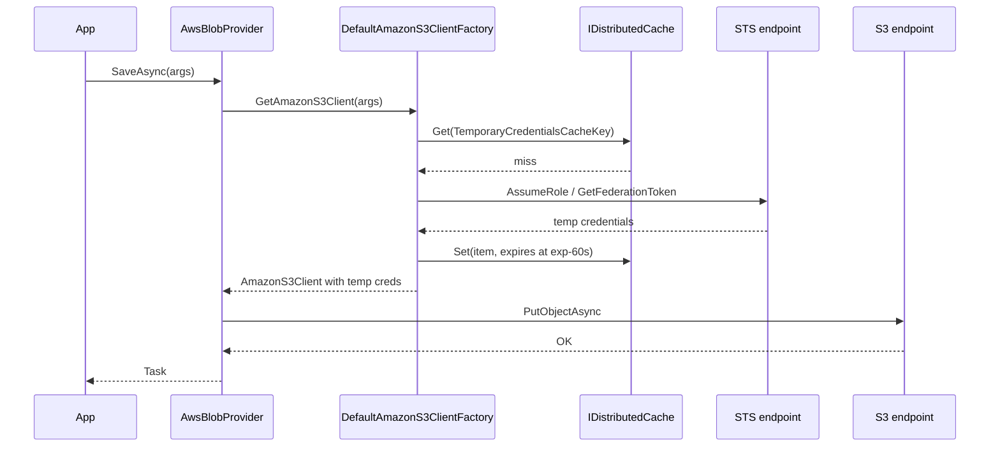

The `Volo.Abp.BlobStoring.Aws` package implements `IBlobProvider` against Amazon S3 using the official `AWSSDK.S3` and `AWSSDK.SecurityToken` libraries. It supports four credential modes — static access keys, named SDK profiles, STS temporary credentials, and STS federated credentials — each driven by a flag on `AwsBlobProviderConfiguration`. The provider also speaks any S3-compatible service that accepts the SDK's region/endpoint conventions. Source: `framework/src/Volo.Abp.BlobStoring.Aws/Volo/Abp/BlobStoring/Aws/`.

## Package layout

```
framework/src/Volo.Abp.BlobStoring.Aws/Volo/Abp/BlobStoring/Aws/
├── AbpBlobStoringAwsModule.cs
├── AwsBlobContainerConfigurationExtensions.cs
├── AwsBlobNamingNormalizer.cs
├── AwsBlobProvider.cs
├── AwsBlobProviderConfiguration.cs
├── AwsBlobProviderConfigurationNames.cs
├── AwsTemporaryCredentialsCacheItem.cs
├── DefaultAmazonS3ClientFactory.cs
├── DefaultAwsBlobNameCalculator.cs
├── IAmazonS3ClientFactory.cs
└── IAwsBlobNameCalculator.cs
```

## Module

`AbpBlobStoringAwsModule.cs` declares the module's dependency on `AbpBlobStoringModule` (the core abstraction) and on `AbpCachingModule` so the temporary credentials can be cached in `IDistributedCache`. Concrete services are registered automatically via their `ITransientDependency` / `ISingletonDependency` markers.

## AwsBlobProvider

`AwsBlobProvider.cs` composes three collaborators in its constructor:

```csharp
public AwsBlobProvider(
    IAwsBlobNameCalculator awsBlobNameCalculator,
    IAmazonS3ClientFactory amazonS3ClientFactory,
    IBlobNormalizeNamingService blobNormalizeNamingService)
{
    AwsBlobNameCalculator = awsBlobNameCalculator;
    AmazonS3ClientFactory = amazonS3ClientFactory;
    BlobNormalizeNamingService = blobNormalizeNamingService;
}
```

The `IAmazonS3ClientFactory` is what hides the credential mode behind a uniform `await GetAmazonS3Client(args)` call inside the provider.

### SaveAsync

```csharp
public override async Task SaveAsync(BlobProviderSaveArgs args)
{
    var blobName = AwsBlobNameCalculator.Calculate(args);
    var configuration = args.Configuration.GetAwsConfiguration();
    var containerName = GetContainerName(args);

    using (var amazonS3Client = await GetAmazonS3Client(args))
    {
        if (!args.OverrideExisting && await BlobExistsAsync(amazonS3Client, containerName, blobName))
        {
            throw new BlobAlreadyExistsException(
                $"Saving BLOB '{args.BlobName}' does already exists in the container '{containerName}'! Set {nameof(args.OverrideExisting)} if it should be overwritten.");
        }

        if (configuration.CreateContainerIfNotExists)
        {
            await CreateContainerIfNotExists(amazonS3Client, containerName);
        }

        await amazonS3Client.PutObjectAsync(new PutObjectRequest
        {
            BucketName = containerName,
            Key = blobName,
            InputStream = args.BlobStream
        });
    }
}
```

The provider wraps the `IAmazonS3` client in a `using` block so any HTTP connections it manages are released eagerly. The factory may return a long-lived client or a short-lived one depending on the credential mode (temporary credentials need short-lived clients because the SDK caches the credentials inside).

`CreateContainerIfNotExists` uses `AmazonS3Util.DoesS3BucketExistV2Async` plus `PutBucketAsync` so the provider can lazily bootstrap a bucket the same way Azure does. Note that S3 bucket names are *globally* unique across all AWS accounts, so this flag often surfaces collisions early during integration testing.

### DeleteAsync, ExistsAsync, GetOrNullAsync

The remaining operations follow the same shape:

- `DeleteAsync` issues `DeleteObjectAsync`. Returns `true` only when the blob existed first (checked via `BlobExistsAsync`).
- `ExistsAsync` issues `GetObjectMetadataAsync` and catches `AmazonS3Exception` with `ErrorCode == "NotFound"` to return `false`.
- `GetOrNullAsync` issues `GetObjectAsync` and returns `response.ResponseStream`; the SDK returns a chunked stream that the consumer must dispose.

## AwsBlobProviderConfiguration

The configuration class at `AwsBlobProviderConfiguration.cs` is the largest of all the provider configurations because S3 supports many credential variants. The full surface:

| Property | Purpose | Type |
|---|---|---|
| `AccessKeyId` | Static IAM user key id | `string?` |
| `SecretAccessKey` | Static IAM user secret | `string?` |
| `UseCredentials` | Use the static `AccessKeyId`/`SecretAccessKey` pair | `bool` |
| `UseTemporaryCredentials` | Use STS `AssumeRole` to mint short-lived credentials | `bool` |
| `UseTemporaryFederatedCredentials` | Use STS `GetFederationToken` for federated identities | `bool` |
| `ProfileName` | Named profile from the shared SDK config file | `string?` |
| `ProfilesLocation` | Override the shared credentials file location | `string?` |
| `DurationSeconds` | Validity period for STS credentials (900–129600s) | `int` |
| `Name` | Federation user name (`GetFederationToken`) or role session name | `string` |
| `Policy` | Inline IAM policy for the temporary credentials | `string?` |
| `Region` | AWS region (`us-east-1`, `eu-west-1`, ...) | `string` |
| `ContainerName` | Override the bucket name | `string?` |
| `CreateContainerIfNotExists` | Create the bucket on first save | `bool` |
| `TemporaryCredentialsCacheKey` | Distributed cache key for the temporary credentials | `string?` (auto-generated by default) |

Of these, exactly one of `UseCredentials`, `UseTemporaryCredentials`, `UseTemporaryFederatedCredentials` should be true; the rest of the credential properties depend on which mode you picked.

### Credential mode matrix

<AccordionGroup>
  <Accordion title="Static access keys (UseCredentials)" icon="key">
    Set `AccessKeyId` and `SecretAccessKey`, set `UseCredentials = true`, set `Region`. The factory constructs an `AmazonS3Client(accessKey, secretKey, RegionEndpoint.GetBySystemName(Region))`. Use for dev, simple deployments, or scenarios where the AWS credentials are stored as ABP settings.
  </Accordion>
  <Accordion title="Named SDK profile (no flag set)" icon="user">
    Set `ProfileName` (and optionally `ProfilesLocation`). The factory uses the AWS SDK's `SharedCredentialsFile` to look up `[profile-name]` and bind the resulting credentials. Use for developer machines where multiple AWS accounts are configured.
  </Accordion>
  <Accordion title="STS AssumeRole (UseTemporaryCredentials)" icon="clock">
    Set `Name` to a role session name and `Policy` to an inline policy that scopes the session. The factory calls `STSClient.AssumeRoleAsync` with `DurationSeconds`, caches the result under `TemporaryCredentialsCacheKey` for the lifetime of `DurationSeconds - 60`, and reuses it across requests. The cached item type is `AwsTemporaryCredentialsCacheItem` (`AwsTemporaryCredentialsCacheItem.cs`).
  </Accordion>
  <Accordion title="STS GetFederationToken (UseTemporaryFederatedCredentials)" icon="users">
    Set `Name` to the federated user name. Federation tokens carry tighter restrictions (cannot call IAM APIs, max 36-hour duration) and are intended for scenarios where end users get scoped access to S3 directly. The factory calls `STSClient.GetFederationTokenAsync`.
  </Accordion>
</AccordionGroup>

### Why `DurationSeconds` matters

The constant `AwsBlobProviderConfigurationNames.DurationSeconds` accepts 900–129600 seconds (15 minutes to 36 hours). The factory subtracts a 60-second safety margin before caching to avoid using a credential that is about to expire. If you call `SaveAsync` exactly at the boundary, the next request fetches fresh credentials.

## DefaultAmazonS3ClientFactory

`DefaultAmazonS3ClientFactory.cs` implements `IAmazonS3ClientFactory`. The factory is responsible for inspecting `AwsBlobProviderConfiguration` and producing an `IAmazonS3` client of the right shape. It uses `IDistributedCache<AwsTemporaryCredentialsCacheItem>` so multi-instance deployments share the same STS credentials and don't quintuple the throttling on the STS API.

If you need a custom S3 client (e.g. to override `AmazonS3Config.ServiceURL` for an S3-compatible endpoint like DigitalOcean Spaces), replace this factory by registering your own implementation:

```csharp
context.Services.Replace(ServiceDescriptor.Transient<IAmazonS3ClientFactory, MyS3CompatibleClientFactory>());
```

The default factory leaves the `ServiceURL` unset so the SDK uses the standard `https://s3.{region}.amazonaws.com` endpoint.

## DefaultAwsBlobNameCalculator

`DefaultAwsBlobNameCalculator.cs` implements `IAwsBlobNameCalculator` using the same `host/` or `tenants/{tenantId}/` prefix scheme as the other providers. The blob name is the object key passed to `PutObjectRequest.Key`.

## AwsBlobContainerConfigurationExtensions

`AwsBlobContainerConfigurationExtensions.cs` defines the `UseAws` fluent extension that sets `ProviderType = typeof(AwsBlobProvider)`, registers `AwsBlobNamingNormalizer`, and runs the user lambda against an `AwsBlobProviderConfiguration` wrapper.

## Naming rules

`AwsBlobNamingNormalizer.cs` enforces S3's bucket naming rules: lowercase letters, digits, hyphens, dots; 3–63 characters; no double dots; cannot be formatted as an IP address. The normalizer rejects names that cannot be made valid because S3 returns opaque errors for invalid bucket names that are hard to diagnose from caller code.

## Typical configuration

```csharp
[DependsOn(typeof(AbpBlobStoringAwsModule))]
public class MyAppModule : AbpModule
{
    public override void ConfigureServices(ServiceConfigurationContext context)
    {
        var cfg = context.Services.GetConfiguration();

        Configure<AbpBlobStoringOptions>(options =>
        {
            options.Containers.Configure<ReportContainer>(c =>
            {
                c.UseAws(aws =>
                {
                    aws.UseCredentials = true;
                    aws.AccessKeyId      = cfg["Storage:Aws:AccessKeyId"]!;
                    aws.SecretAccessKey  = cfg["Storage:Aws:SecretAccessKey"]!;
                    aws.Region           = cfg["Storage:Aws:Region"]!;
                    aws.ContainerName    = "my-org-reports";
                    aws.CreateContainerIfNotExists = false;
                });
            });
        });
    }
}
```

A federated configuration looks like:

```csharp
c.UseAws(aws =>
{
    aws.UseTemporaryFederatedCredentials = true;
    aws.Name             = $"tenant-{tenantId}";
    aws.Policy           = JsonSerializer.Serialize(myInlinePolicy);
    aws.DurationSeconds  = 3600;
    aws.Region           = "us-west-2";
    aws.ContainerName    = "my-org-reports";
});
```

## Flow with STS



## Operational notes

<AccordionGroup>
  <Accordion title="Credential rotation" icon="rotate">
    The cache TTL is `DurationSeconds - 60`. Once expired, the next call mints fresh credentials via STS. There is no application-level rotation logic to write.
  </Accordion>
  <Accordion title="Multi-region access" icon="globe">
    The provider doesn't multiplex across regions — each container is bound to one region. If you need to serve from multiple regions, configure multiple containers with distinct `Region` values.
  </Accordion>
  <Accordion title="S3-compatible providers" icon="hard-drive">
    Replace `IAmazonS3ClientFactory` to point `AmazonS3Config.ServiceURL` at DigitalOcean Spaces, Wasabi, Cloudflare R2, etc. Most S3-compatible services require `ForcePathStyle = true`.
  </Accordion>
  <Accordion title="Server-side encryption" icon="lock">
    The provider doesn't set SSE headers on upload. Override `AwsBlobProvider.SaveAsync` in a subclass to add `ServerSideEncryptionMethod = ServerSideEncryptionMethod.AES256` (or KMS) to the `PutObjectRequest`.
  </Accordion>
  <Accordion title="Large uploads and multipart" icon="boxes">
    `PutObjectAsync` handles streams up to 5 GB. For multi-GB or unknown-size streams, swap to `TransferUtility.UploadAsync` in a subclass for multipart upload.
  </Accordion>
</AccordionGroup>

## The temporary credentials cache item

`AwsTemporaryCredentialsCacheItem.cs` is the DTO stored in `IDistributedCache` between STS rounds. It carries `AccessKeyId`, `SecretAccessKey`, `SessionToken`, and the wall-clock expiration. The factory checks `Expiration > DateTime.UtcNow.AddSeconds(60)` before reusing — a 60-second safety margin that protects against clock skew.

The cache key defaults to `Guid.NewGuid().ToString("N")` generated at configuration time, which means each `BlobContainerConfiguration` has its own cache key. If you want different containers to *share* STS credentials (because they assume the same role), set `TemporaryCredentialsCacheKey` to the same value on each container.

## DefaultAwsBlobNameCalculator and overriding it

The default calculator at `DefaultAwsBlobNameCalculator.cs`:

```csharp
public virtual string Calculate(BlobProviderArgs args)
{
    if (CurrentTenant.Id == null) return $"host/{args.BlobName}";
    return $"tenants/{CurrentTenant.Id.Value:D}/{args.BlobName}";
}
```

A common customization is to shard objects by the first character of the blob name so the S3 prefix listing distribution remains balanced:

```csharp
public class HashedAwsBlobNameCalculator : IAwsBlobNameCalculator, ITransientDependency
{
    protected ICurrentTenant CurrentTenant { get; }
    public HashedAwsBlobNameCalculator(ICurrentTenant ct) => CurrentTenant = ct;

    public string Calculate(BlobProviderArgs args)
    {
        var prefix = CurrentTenant.Id == null ? "host" : $"tenants/{CurrentTenant.Id:D}";
        var firstChar = args.BlobName[0];
        return $"{prefix}/{firstChar}/{args.BlobName}";
    }
}
```

Register via `context.Services.Replace(ServiceDescriptor.Transient<IAwsBlobNameCalculator, HashedAwsBlobNameCalculator>())`.

## Existence checks in S3

The S3 SDK does not have a true "exists" operation; the framework's `BlobExistsAsync` uses `GetObjectMetadataAsync` and catches `AmazonS3Exception` with HTTP 404. This pattern allocates an exception on the "missing" path, which is the most common case during `SaveAsync` when `OverrideExisting = false`. For very hot save paths consider skipping the existence check entirely and relying on optimistic put plus `If-None-Match: *` headers — implementable via a subclass.

## S3-compatible endpoints

The provider works against any S3-compatible API when you swap the `IAmazonS3ClientFactory`. A custom factory for DigitalOcean Spaces, Cloudflare R2, Wasabi, or Backblaze B2 typically sets:

```csharp
var config = new AmazonS3Config
{
    ServiceURL = "https://nyc3.digitaloceanspaces.com",  // or your provider
    ForcePathStyle = true,
};
return new AmazonS3Client(awsCfg.AccessKeyId, awsCfg.SecretAccessKey, config);
```

The `ForcePathStyle = true` flag is critical for many S3-compatible services that do not support virtual-hosted style buckets. Register your factory with `Services.Replace(ServiceDescriptor.Transient<IAmazonS3ClientFactory, MyS3CompatibleClientFactory>())`.

## Common errors and what they mean

| Error | Likely cause |
|---|---|
| `Access Denied` on `PutObject` | Missing `s3:PutObject` permission on the IAM policy or the role's policy isn't applied. |
| `NoSuchBucket` | The bucket name in `ContainerName` doesn't exist and `CreateContainerIfNotExists` is false. |
| `InvalidAccessKeyId` | Static keys are wrong or the SDK is using the profile mode without realizing it. |
| `ExpiredToken` (intermittent) | The STS credentials cache expired due to clock skew; reduce `DurationSeconds` or sync the host clock to NTP. |
| `SignatureDoesNotMatch` | Region mismatch — the bucket is in a different region than the configured `Region`. |

## Cross references

- For an Azure-flavored alternative, see [Azure](/blob/azure).
- For S3-compatible on-prem storage with a free license, see [MinIO](/blob/minio).
- For the shared abstraction, return to [BLOB Core](/blob/core).
