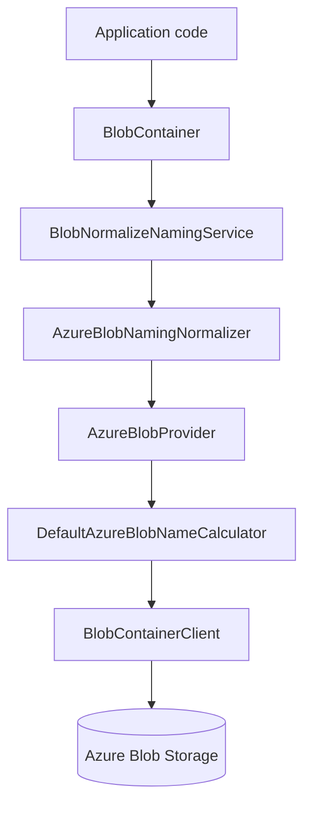

The `Volo.Abp.BlobStoring.Azure` package implements `IBlobProvider` against Azure Blob Storage using the official `Azure.Storage.Blobs` SDK. The provider is registered as `ITransientDependency` so the default `BlobProviderSelector` discovers it automatically when a container's configuration sets `ProviderType = typeof(AzureBlobProvider)`. Source lives under `framework/src/Volo.Abp.BlobStoring.Azure/Volo/Abp/BlobStoring/Azure/`.

## Package layout

```
framework/src/Volo.Abp.BlobStoring.Azure/Volo/Abp/BlobStoring/Azure/
├── AbpBlobStoringAzureModule.cs
├── AzureBlobContainerConfigurationExtensions.cs
├── AzureBlobNamingNormalizer.cs
├── AzureBlobProvider.cs
├── AzureBlobProviderConfiguration.cs
├── AzureBlobProviderConfigurationNames.cs
├── DefaultAzureBlobNameCalculator.cs
└── IAzureBlobNameCalculator.cs
```

## Module

`AbpBlobStoringAzureModule.cs` depends on `AbpBlobStoringModule` so the core abstraction is loaded together with the Azure provider. The module body is empty — services are registered by convention via their `ITransientDependency` markers.

## AzureBlobProvider

`AzureBlobProvider.cs` is the implementation. It composes two collaborators: `IAzureBlobNameCalculator` (which computes the blob key including any tenant prefix) and the shared `IBlobNormalizeNamingService` from the core package.

### SaveAsync

```csharp
public override async Task SaveAsync(BlobProviderSaveArgs args)
{
    var blobName = AzureBlobNameCalculator.Calculate(args);
    var configuration = args.Configuration.GetAzureConfiguration();

    if (!args.OverrideExisting && await BlobExistsAsync(args, blobName))
    {
        throw new BlobAlreadyExistsException(
            $"Saving BLOB '{args.BlobName}' does already exists in the container '{GetContainerName(args)}'! Set {nameof(args.OverrideExisting)} if it should be overwritten.");
    }

    if (configuration.CreateContainerIfNotExists)
    {
        await CreateContainerIfNotExists(args);
    }

    await GetBlobClient(args, blobName).UploadAsync(args.BlobStream, true);
}
```

Three things to note:

<Steps>
  <Step title="Blob name calculation">
    `AzureBlobNameCalculator.Calculate(args)` (in `DefaultAzureBlobNameCalculator.cs`) prefixes the blob name with `host/` or `tenants/{tenantId}/` depending on `ICurrentTenant.Id`, mirroring the multi-tenant layout used by the File System provider.
  </Step>
  <Step title="Override-existing semantics">
    Even though `UploadAsync(stream, overwrite: true)` is passed `true` unconditionally, the manual `BlobExistsAsync` check above means the framework still throws `BlobAlreadyExistsException` when the caller set `OverrideExisting = false`. The `true` literal is a safety net for race conditions where two writers compete.
  </Step>
  <Step title="Container creation on demand">
    When `AzureBlobProviderConfiguration.CreateContainerIfNotExists` is true, `CreateContainerIfNotExists(args)` calls `BlobContainerClient.CreateIfNotExistsAsync`. This is the right setting for SaaS apps where new tenants imply new container names that didn't exist at deploy time.
  </Step>
</Steps>

### DeleteAsync, ExistsAsync, GetOrNullAsync

The remaining operations delegate to the SDK:

```csharp
public override async Task<bool> DeleteAsync(BlobProviderDeleteArgs args)
{
    var blobName = AzureBlobNameCalculator.Calculate(args);
    if (await BlobExistsAsync(args, blobName))
    {
        return await GetBlobClient(args, blobName).DeleteIfExistsAsync();
    }
    return false;
}

public override async Task<bool> ExistsAsync(BlobProviderExistsArgs args)
{
    var blobName = AzureBlobNameCalculator.Calculate(args);
    return await BlobExistsAsync(args, blobName);
}

public override async Task<Stream?> GetOrNullAsync(BlobProviderGetArgs args)
{
    var blobName = AzureBlobNameCalculator.Calculate(args);
    if (!await BlobExistsAsync(args, blobName)) return null;
    var blobClient = GetBlobClient(args, blobName);
    return await blobClient.OpenReadAsync(cancellationToken: args.CancellationToken);
}
```

`OpenReadAsync` returns a stream that the SDK reads in chunks lazily from Azure — perfect for the `IBlobContainer.GetOrNullAsync` contract, which expects the caller to dispose the returned stream when done.

### Helpers — GetBlobClient and GetBlobContainerClient

The provider wraps every call through `GetBlobContainerClient(args)`, which uses `args.Configuration.GetAzureConfiguration().ConnectionString` together with the calculated container name (from `GetContainerName(args)`) to construct a `BlobContainerClient`. The `GetBlobClient(args, blobName)` helper then returns the `BlobClient` for the specific blob.

The container client is *not* cached across calls — Azure SDK clients are cheap to construct because they pool HTTP connections internally via `HttpClient.SharedDefault`. If you observe per-tenant client construction costs, replace the calculator or wrap the provider in your own caching decorator.

## DefaultAzureBlobNameCalculator

The calculator at `DefaultAzureBlobNameCalculator.cs` implements `IAzureBlobNameCalculator`. The default rule:

```
{host or tenants/{tenantId}}/{blobName}
```

When the container is multi-tenant and `ICurrentTenant.Id` is non-null, the prefix is `tenants/{tenantId-guid-D}`; otherwise the prefix is `host`. The blob name itself already passed through `BlobNormalizeNamingService` before reaching the provider, so it is guaranteed not to contain characters Azure forbids.

If you implement your own `IAzureBlobNameCalculator`, register it with `context.Services.Replace(ServiceDescriptor.Transient<IAzureBlobNameCalculator, MyCalculator>())`. Use this to flatten multi-tenant prefixes when you bind a separate Azure container per tenant, or to add a hash-based subfolder for hot-key avoidance.

## AzureBlobProviderConfiguration

`AzureBlobProviderConfiguration.cs`:

```csharp
public class AzureBlobProviderConfiguration
{
    public string ConnectionString {
        get => _containerConfiguration.GetConfiguration<string>(AzureBlobProviderConfigurationNames.ConnectionString);
        set => _containerConfiguration.SetConfiguration(AzureBlobProviderConfigurationNames.ConnectionString, Check.NotNullOrWhiteSpace(value, nameof(value)));
    }

    /// <summary>
    /// This name may only contain lowercase letters, numbers, and hyphens, and must begin with a letter or a number.
    /// Each hyphen must be preceded and followed by a non-hyphen character.
    /// The name must also be between 3 and 63 characters long.
    /// If this parameter is not specified, the ContainerName of the <see cref="BlobProviderArgs"/> will be used.
    /// </summary>
    public string? ContainerName {
        get => _containerConfiguration.GetConfigurationOrDefault<string>(AzureBlobProviderConfigurationNames.ContainerName);
        set => _containerConfiguration.SetConfiguration(AzureBlobProviderConfigurationNames.ContainerName, value);
    }

    /// <summary>
    /// Default value: false.
    /// </summary>
    public bool CreateContainerIfNotExists {
        get => _containerConfiguration.GetConfigurationOrDefault(AzureBlobProviderConfigurationNames.CreateContainerIfNotExists, false);
        set => _containerConfiguration.SetConfiguration(AzureBlobProviderConfigurationNames.CreateContainerIfNotExists, value);
    }

    private readonly BlobContainerConfiguration _containerConfiguration;
    public AzureBlobProviderConfiguration(BlobContainerConfiguration containerConfiguration)
    {
        _containerConfiguration = containerConfiguration;
    }
}
```

The three settings — keyed by string constants in `AzureBlobProviderConfigurationNames.cs` — are:

| Property | Required | Default | Notes |
|---|---|---|---|
| `ConnectionString` | yes | none | Standard Azure Storage connection string. Supports both shared-key strings and SAS-based ones. |
| `ContainerName` | no | (use container name from `BlobProviderArgs`) | Override when the application-level container name does not satisfy Azure's stricter naming rules. |
| `CreateContainerIfNotExists` | no | `false` | When `true`, `BlobContainerClient.CreateIfNotExistsAsync` runs before every `SaveAsync`. |

The container-name comment is copied here because the rules are easy to forget: 3–63 chars, lowercase letters/digits/hyphens, hyphens only between non-hyphen chars. `AzureBlobNamingNormalizer` (in `AzureBlobNamingNormalizer.cs`) enforces this on every container name passed in: it lowercases, replaces invalid characters with hyphens, and rejects names that cannot be made valid.

## AzureBlobContainerConfigurationExtensions

`AzureBlobContainerConfigurationExtensions.cs`:

```csharp
public static AzureBlobProviderConfiguration GetAzureConfiguration(this BlobContainerConfiguration containerConfiguration)
    => new AzureBlobProviderConfiguration(containerConfiguration);

public static BlobContainerConfiguration UseAzure(
    this BlobContainerConfiguration containerConfiguration,
    Action<AzureBlobProviderConfiguration> azureConfigureAction)
{
    containerConfiguration.ProviderType = typeof(AzureBlobProvider);
    containerConfiguration.NamingNormalizers.TryAdd<AzureBlobNamingNormalizer>();

    azureConfigureAction(new AzureBlobProviderConfiguration(containerConfiguration));

    return containerConfiguration;
}
```

`UseAzure`:

1. Sets `ProviderType = typeof(AzureBlobProvider)` so the selector routes to Azure.
2. Adds `AzureBlobNamingNormalizer` to the normalizer chain.
3. Runs the user's lambda against the typed wrapper.

## Typical configuration

```csharp
[DependsOn(typeof(AbpBlobStoringAzureModule))]
public class MyAppModule : AbpModule
{
    public override void ConfigureServices(ServiceConfigurationContext context)
    {
        var azureConn = context.Services.GetConfiguration()["Storage:Azure"];

        Configure<AbpBlobStoringOptions>(options =>
        {
            options.Containers.Configure<ReportContainer>(c =>
            {
                c.UseAzure(azure =>
                {
                    azure.ConnectionString = azureConn!;
                    azure.ContainerName = "reports";
                    azure.CreateContainerIfNotExists = true;
                });
            });
        });
    }
}
```

After the module loads, `IBlobContainer<ReportContainer>` writes to the Azure container named `reports`, prefixing blob keys with `host/` or `tenants/{tenantId}/` based on the current tenant.



## Operational notes

<AccordionGroup>
  <Accordion title="Connection string types" icon="link">
    The provider works with both **shared key** strings (`DefaultEndpointsProtocol=https;AccountName=...;AccountKey=...`) and **SAS-based** strings (`BlobEndpoint=...;SharedAccessSignature=...`). For Azure Managed Identity, supply a connection string that uses the `BlobEndpoint=...` form and rely on `DefaultAzureCredential` by replacing `BlobContainerClient` construction in a subclass.
  </Accordion>
  <Accordion title="Create container on first use vs at deploy time" icon="toggle-on">
    Setting `CreateContainerIfNotExists = true` is convenient but slow on hot paths because every save calls `CreateIfNotExistsAsync`. For predictable container names (a small fixed set), pre-create them during deployment with `az storage container create` and leave the flag at `false`.
  </Accordion>
  <Accordion title="Multi-tenant container vs container-per-tenant" icon="users">
    The default calculator stores all tenants in one Azure container under different prefixes. To switch to container-per-tenant, set `IsMultiTenant = false` and provide an `IAzureBlobNameCalculator` that derives the Azure container name from `CurrentTenant.Id`.
  </Accordion>
  <Accordion title="Streaming uploads" icon="upload">
    `BlobClient.UploadAsync(stream, true)` handles arbitrarily large streams by issuing block uploads. There is no special configuration needed for multi-GB blobs.
  </Accordion>
  <Accordion title="Access tier" icon="layer-group">
    The provider does not set an access tier on upload; blobs land in the default tier. To pick Cool or Archive, subclass `AzureBlobProvider`, call `UploadAsync(args.BlobStream, new BlobUploadOptions { AccessTier = AccessTier.Cool })`, and replace the provider via `Services.Replace(ServiceDescriptor.Transient<AzureBlobProvider, MyAzureBlobProvider>())`.
  </Accordion>
</AccordionGroup>

## Reading the existence check helper

Inside `AzureBlobProvider.cs`, the `BlobExistsAsync(args, blobName)` helper is the kernel that every public method calls before doing anything else. It does the equivalent of:

```csharp
protected virtual async Task<bool> BlobExistsAsync(BlobProviderArgs args, string blobName)
{
    var blobContainerClient = GetBlobContainerClient(args);
    var blobClient = blobContainerClient.GetBlobClient(blobName);
    return await blobClient.ExistsAsync(args.CancellationToken);
}
```

The Azure SDK's `ExistsAsync` issues a `HEAD` request which is significantly cheaper than `GetProperties` or `DownloadStreaming`. The implication for performance: even `GetOrNullAsync` makes two round-trips (one for existence, one for the actual read) unless the file is known to exist. For very hot paths where you know the blob is there, prefer a higher-level caching layer in front of the BLOB container.

## CreateContainerIfNotExists deep dive

The helper `CreateContainerIfNotExists(args)` runs:

```csharp
protected virtual async Task CreateContainerIfNotExists(BlobProviderArgs args)
{
    var blobContainerClient = GetBlobContainerClient(args);
    await blobContainerClient.CreateIfNotExistsAsync();
}
```

This is a guarded `PUT` against Azure — the SDK returns 201 if created, 409 if the container already exists (and the SDK swallows that into "no-op"). The operation is *not* idempotent in terms of cost: each `SaveAsync` pays the network round-trip. For workloads that save many small blobs per second, either set `CreateContainerIfNotExists = false` and create the container at deploy time, or wrap the provider with a singleton "container creation memoizer" that runs `CreateIfNotExistsAsync` only once per process per container name.

## Combining configurations

Because `BlobContainerConfiguration` supports a fallback chain (the default container's configuration acts as the parent of every named container), you can put the `ConnectionString` on the default container and override `ContainerName` per typed container:

```csharp
Configure<AbpBlobStoringOptions>(options =>
{
    options.Containers.ConfigureDefault(c => c.UseAzure(a =>
    {
        a.ConnectionString = cfg["Storage:Azure"]!;
        a.CreateContainerIfNotExists = true;
    }));

    options.Containers.Configure<ReportContainer>(c => c.UseAzure(a => a.ContainerName = "reports"));
    options.Containers.Configure<AvatarContainer>(c => c.UseAzure(a => a.ContainerName = "avatars"));
});
```

Each typed container inherits the connection string and `CreateContainerIfNotExists` flag from the default, then overrides only what is different. The fallback chain is wired automatically inside `BlobContainerConfigurations`.

## Subclassing to add features

A common subclassing recipe for Azure: server-side encryption via customer-managed keys.

```csharp
public class AzureCmkBlobProvider : AzureBlobProvider
{
    public AzureCmkBlobProvider(IAzureBlobNameCalculator c, IBlobNormalizeNamingService n) : base(c, n) { }

    public override async Task SaveAsync(BlobProviderSaveArgs args)
    {
        var blobName = AzureBlobNameCalculator.Calculate(args);
        var configuration = args.Configuration.GetAzureConfiguration();

        if (!args.OverrideExisting && await BlobExistsAsync(args, blobName))
            throw new BlobAlreadyExistsException(...);

        if (configuration.CreateContainerIfNotExists)
            await CreateContainerIfNotExists(args);

        await GetBlobClient(args, blobName).UploadAsync(
            args.BlobStream,
            new BlobUploadOptions
            {
                EncryptionScope = "my-cmk-scope"
            });
    }
}
```

Register the subclass via `context.Services.Replace(ServiceDescriptor.Transient<AzureBlobProvider, AzureCmkBlobProvider>())`.

## Related providers

- The S3-compatible cousin lives in [AWS S3](/blob/aws-s3). The configuration shape is similar but Amazon's SDK has its own `IAmazonS3ClientFactory`.
- For on-prem S3-compatible storage, see [MinIO](/blob/minio).
- For Google Cloud, see [Google Cloud](/blob/google-cloud).
- For a refresher on the abstraction Azure plugs into, return to [BLOB Core](/blob/core).
