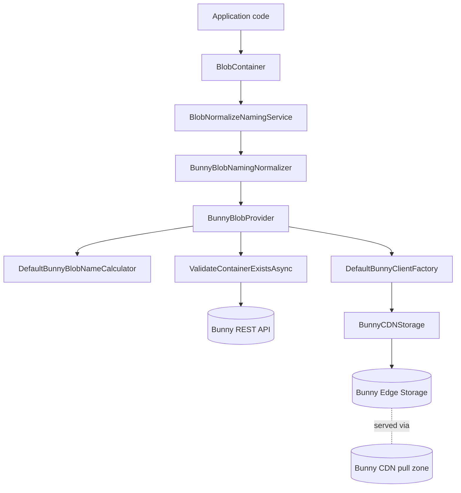

The `Volo.Abp.BlobStoring.Bunny` package implements `IBlobProvider` against Bunny.net Edge Storage using the `BunnyCDN.Net.Storage` client. Bunny Edge Storage is a globally distributed object storage layer that pairs naturally with Bunny's pull-zone CDN — uploads land in your storage zone, and the CDN serves them from edge nodes. This is the right ABP provider when you want assets to be served via Bunny's CDN without managing a separate origin. Source: `framework/src/Volo.Abp.BlobStoring.Bunny/Volo/Abp/BlobStoring/Bunny/`.

## Package layout

```
framework/src/Volo.Abp.BlobStoring.Bunny/Volo/Abp/BlobStoring/Bunny/
├── AbpBunnyBlobStoringModule .cs
├── BunnyApiException.cs
├── BunnyBlobContainerConfigurationExtensions.cs
├── BunnyBlobNamingNormalizer.cs
├── BunnyBlobProvider.cs
├── BunnyBlobProviderConfiguration.cs
├── BunnyBlobProviderConfigurationNames.cs
├── BunnyStorageZoneModel.cs
├── DefaultBunnyBlobNameCalculator.cs
├── DefaultBunnyClientFactory.cs
├── IBunnyBlobNameCalculator.cs
└── IBunnyClientFactory.cs
```

The module file `AbpBunnyBlobStoringModule .cs` (yes, the file name has a trailing space before `.cs` in the repo) depends on `AbpBlobStoringModule`. Services are registered via convention.

## BunnyBlobProvider

`BunnyBlobProvider.cs` implements `BlobProviderBase` and composes three collaborators:

```csharp
public BunnyBlobProvider(
    IBunnyBlobNameCalculator bunnyBlobNameCalculator,
    IBlobNormalizeNamingService blobNormalizeNamingService,
    IBunnyClientFactory bunnyClientFactory)
{
    BunnyBlobNameCalculator = bunnyBlobNameCalculator;
    BlobNormalizeNamingService = blobNormalizeNamingService;
    BunnyClientFactory = bunnyClientFactory;
}
```

The `IBunnyClientFactory` hides the construction of `BunnyCDNStorage` instances. The `BunnyCDN.Net.Storage` client requires per-zone configuration so the factory caches a client per access key + zone tuple.

### SaveAsync

```csharp
public async override Task SaveAsync(BlobProviderSaveArgs args)
{
    var configuration = args.Configuration.GetBunnyConfiguration();
    var containerName = GetContainerName(args);
    var blobName = BunnyBlobNameCalculator.Calculate(args);

    await ValidateContainerExistsAsync(containerName, configuration);

    var bunnyStorage = await GetBunnyCDNStorageAsync(args);

    if (!args.OverrideExisting && await BlobExistsAsync(bunnyStorage, containerName, blobName))
    {
        throw new BlobAlreadyExistsException(
            $"Blob '{args.BlobName}' already exists in container '{containerName}'. " +
            $"Set {nameof(args.OverrideExisting)} to true to overwrite.");
    }

    using var memoryStream = new MemoryStream();
    await args.BlobStream.CopyToAsync(memoryStream);
    memoryStream.Position = 0;

    await bunnyStorage.UploadAsync(memoryStream, $"{containerName}/{blobName}");
}
```

A few Bunny-specific details:

<Steps>
  <Step title="Storage zone validation">
    `ValidateContainerExistsAsync` calls Bunny's REST API (`https://api.bunny.net/storagezone`) to verify the zone exists. When `CreateContainerIfNotExists` is true and the zone is missing, the provider creates it via `POST /storagezone`. The `BunnyApiException` (in `BunnyApiException.cs`) wraps HTTP failures with the original status code.
  </Step>
  <Step title="MemoryStream materialization">
    The provider buffers the input stream into a `MemoryStream` before calling `BunnyCDNStorage.UploadAsync`. This is because the SDK's upload path issues a single HTTP PUT and needs a seekable stream — the same pattern used by the Google provider.
  </Step>
  <Step title="Path layout">
    The upload key is `{containerName}/{blobName}`. The blob name already includes any tenant prefix (`host/...` or `tenants/{tid}/...`) computed by `DefaultBunnyBlobNameCalculator`.
  </Step>
</Steps>

### Other operations

- `DeleteAsync` calls `BunnyCDNStorage.DeleteObjectAsync(path)` after an existence check.
- `ExistsAsync` calls `BunnyCDNStorage.GetStorageObjectsAsync(folderPath)` and looks for the exact file name.
- `GetOrNullAsync` calls `BunnyCDNStorage.DownloadObjectAsBytesAsync(path)` and wraps the byte array in a `MemoryStream`.

## BunnyBlobProviderConfiguration

`BunnyBlobProviderConfiguration.cs`:

```csharp
public class BunnyBlobProviderConfiguration
{
    public string? Region {
        get => _containerConfiguration.GetConfigurationOrDefault(BunnyBlobProviderConfigurationNames.Region, "de");
        set => _containerConfiguration.SetConfiguration(BunnyBlobProviderConfigurationNames.Region, value);
    }

    public string? ContainerName {
        get => _containerConfiguration.GetConfigurationOrDefault<string>(BunnyBlobProviderConfigurationNames.ContainerName);
        set => _containerConfiguration.SetConfiguration(BunnyBlobProviderConfigurationNames.ContainerName, value);
    }

    public bool CreateContainerIfNotExists {
        get => _containerConfiguration.GetConfigurationOrDefault(BunnyBlobProviderConfigurationNames.CreateContainerIfNotExists, false);
        set => _containerConfiguration.SetConfiguration(BunnyBlobProviderConfigurationNames.CreateContainerIfNotExists, value);
    }

    public string AccessKey {
        get => _containerConfiguration.GetConfiguration<string>(BunnyBlobProviderConfigurationNames.AccessKey);
        set => _containerConfiguration.SetConfiguration(BunnyBlobProviderConfigurationNames.AccessKey, value);
    }
}
```

The four settings:

| Property | Purpose | Default |
|---|---|---|
| `Region` | Bunny Edge Storage primary region (`de`, `ny`, `la`, `sg`, `syd`, ...). | `"de"` (Falkenstein) |
| `ContainerName` | Override the storage zone name (must be globally unique, 4–64 chars, lowercase letters, digits, hyphens). | `null` |
| `CreateContainerIfNotExists` | Create the storage zone if it does not exist. | `false` |
| `AccessKey` | Storage zone access password (Bunny calls this "FTP & API Password"). | (required) |

The constants live in `BunnyBlobProviderConfigurationNames.cs`.

## DefaultBunnyClientFactory and DefaultBunnyBlobNameCalculator

`DefaultBunnyClientFactory.cs` implements `IBunnyClientFactory`. It constructs a `BunnyCDNStorage(storageZoneName, accessKey, region)` and caches instances per `(accessKey, zoneName)` tuple so per-request construction overhead disappears.

`DefaultBunnyBlobNameCalculator.cs` implements `IBunnyBlobNameCalculator` with the same `host/` or `tenants/{tenantId}/` prefix scheme used everywhere else.

`BunnyStorageZoneModel.cs` is the DTO the provider deserializes from Bunny's REST API when verifying or creating storage zones (`Name`, `Region`, `Origin`, etc.).

## Naming normalizer

`BunnyBlobNamingNormalizer.cs` enforces Bunny's zone name rules: lowercase letters, digits, hyphens; 4–64 chars; no spaces; globally unique.

## Configuration extension

`BunnyBlobContainerConfigurationExtensions.cs`:

```csharp
public static BunnyBlobProviderConfiguration GetBunnyConfiguration(this BlobContainerConfiguration containerConfiguration)
    => new BunnyBlobProviderConfiguration(containerConfiguration);

public static BlobContainerConfiguration UseBunny(
    this BlobContainerConfiguration containerConfiguration,
    Action<BunnyBlobProviderConfiguration> bunnyConfigureAction)
{
    containerConfiguration.ProviderType = typeof(BunnyBlobProvider);
    containerConfiguration.NamingNormalizers.TryAdd<BunnyBlobNamingNormalizer>();

    bunnyConfigureAction(new BunnyBlobProviderConfiguration(containerConfiguration));

    return containerConfiguration;
}
```

## Typical configuration

```csharp
[DependsOn(typeof(AbpBunnyBlobStoringModule))]
public class MyAppModule : AbpModule
{
    public override void ConfigureServices(ServiceConfigurationContext context)
    {
        var cfg = context.Services.GetConfiguration();

        Configure<AbpBlobStoringOptions>(options =>
        {
            options.Containers.Configure<MarketingAssetsContainer>(c =>
            {
                c.UseBunny(b =>
                {
                    b.AccessKey     = cfg["Storage:Bunny:AccessKey"]!;
                    b.ContainerName = "my-org-marketing";
                    b.Region        = "de";
                    b.CreateContainerIfNotExists = true;
                });
            });
        });
    }
}
```

Once written, the blob can be served via a Bunny pull zone configured against the storage zone — typically `https://my-org-marketing.b-cdn.net/host/{blobName}` or similar, depending on your pull zone routing.

## Flow



## Operational notes

<AccordionGroup>
  <Accordion title="Region selection" icon="globe">
    The `Region` value selects the *primary* region for the storage zone. Bunny replicates to all configured replica regions automatically. To enable replicas, configure them through Bunny's dashboard — this provider only sets the primary.
  </Accordion>
  <Accordion title="Access keys per zone" icon="key">
    Bunny issues a separate access key per storage zone. Store them in a secret manager and rotate by re-issuing the key in Bunny's dashboard and updating the configuration.
  </Accordion>
  <Accordion title="Public vs private serving" icon="lock-open">
    Bunny Edge Storage zones are private; serving them publicly requires a pull zone pointed at the storage zone. The provider doesn't manage pull zones — configure them out-of-band.
  </Accordion>
  <Accordion title="Pricing and bandwidth" icon="dollar-sign">
    Bunny charges for stored data plus CDN bandwidth. For purely application-internal storage with no CDN serving, the per-GB price is higher than AWS S3 or GCS; for CDN-heavy workloads it's typically cheaper.
  </Accordion>
  <Accordion title="Quotas and uploads" icon="upload">
    Bunny's upload limit per object is 5 GB. For larger objects, split the blob client-side or use chunked uploads via the REST API.
  </Accordion>
</AccordionGroup>

## BunnyStorageZoneModel

`BunnyStorageZoneModel.cs` mirrors the Bunny REST API's storage-zone DTO. It carries `Id`, `Name`, `Region`, `ReplicationRegions`, and other fields. The provider uses it during `ValidateContainerExistsAsync` to check whether a zone with the requested name exists for the configured access key — and during `CreateContainerIfNotExists` to issue a new-zone POST.

A simplified view of the validation method:

```csharp
protected virtual async Task ValidateContainerExistsAsync(string zoneName, BunnyBlobProviderConfiguration cfg)
{
    var zones = await GetStorageZonesAsync(cfg);
    if (zones.All(z => z.Name != zoneName))
    {
        if (cfg.CreateContainerIfNotExists)
        {
            await CreateStorageZoneAsync(zoneName, cfg);
        }
        else
        {
            throw new BunnyApiException(
                $"Bunny storage zone '{zoneName}' does not exist. Set CreateContainerIfNotExists if it should be created automatically.");
        }
    }
}
```

The call to `GetStorageZonesAsync` hits `GET https://api.bunny.net/storagezone` with `AccessKey` as the API key. This is *the account API key* (Bunny calls it the "Account API Key"), distinct from the storage-zone-specific access key used by `BunnyCDNStorage`.

## BunnyApiException

`BunnyApiException.cs` is a small `AbpException` derivative that wraps Bunny REST API failures:

```csharp
public class BunnyApiException : AbpException
{
    public HttpStatusCode? StatusCode { get; }
    public BunnyApiException(string message, HttpStatusCode? statusCode = null, Exception? inner = null)
        : base(message, inner) => StatusCode = statusCode;
}
```

When you see `BunnyApiException` in logs, look at the wrapped `StatusCode` to understand the failure mode — 401 means the API key is wrong, 404 means the zone doesn't exist, 409 means a zone with that name already exists for a *different* account.

## DefaultBunnyClientFactory

`DefaultBunnyClientFactory.cs` produces `BunnyCDNStorage` instances keyed by `(AccessKey, ContainerName, Region)`. The cache is process-local and uses a `ConcurrentDictionary<(string, string, string?), BunnyCDNStorage>` so repeated `GetBunnyCDNStorageAsync(args)` calls within the same process reuse the same client.

The cache is unbounded — for typical ABP apps with a handful of containers this is fine. If you have hundreds of dynamically-named containers, replace the factory with a bounded LRU implementation.

## DefaultBunnyBlobNameCalculator

The calculator at `DefaultBunnyBlobNameCalculator.cs` follows the conventional `host/{blobName}` and `tenants/{tenantId-D}/{blobName}` pattern. Override the calculator if you want a flat layout (one storage zone per tenant, no prefix).

## Region codes

Bunny uses two-letter region codes for the primary storage zone region:

| Code | Location |
|---|---|
| `de` | Falkenstein, Germany |
| `ny` | New York, USA |
| `la` | Los Angeles, USA |
| `sg` | Singapore |
| `syd` | Sydney, Australia |
| `uk` | London, United Kingdom |
| `se` | Stockholm, Sweden |
| `br` | São Paulo, Brazil |
| `jh` | Johannesburg, South Africa |

The provider defaults to `"de"` when the `Region` property is not set. Choose the region geographically nearest your application server to minimize upload latency; Bunny's CDN handles geographically distant downloads via the replica regions you configure in the dashboard.

## Storage zones vs CDN pull zones

Bunny separates the *storage zone* (where the bytes live) from the *pull zone* (the CDN front-end). The ABP provider only manages the storage zone — it has no concept of pull zones. To serve a stored blob publicly, you must:

1. Create a pull zone in the Bunny dashboard.
2. Configure the pull zone's origin to point to the storage zone (e.g. `https://storage.bunnycdn.com/my-org-marketing/`).
3. Use the pull zone's URL (e.g. `https://my-org-marketing.b-cdn.net/...`) when rendering links to blobs.

The blob path you store via the provider becomes the path portion of the CDN URL. With the default name calculator, a saved `logo.png` ends up at `https://{pullzone}.b-cdn.net/host/logo.png` (host scope) or `.../tenants/{tenantId}/logo.png` (tenant scope). For a flat layout where tenants don't appear in the URL, override `IBunnyBlobNameCalculator`.

## Cross references

- For self-hosted S3-compatible storage with similar CDN-ready semantics, see [MinIO](/blob/minio).
- For Azure CDN-fronted blob storage, see [Azure](/blob/azure).
- For the shared abstraction, return to [BLOB Core](/blob/core).
