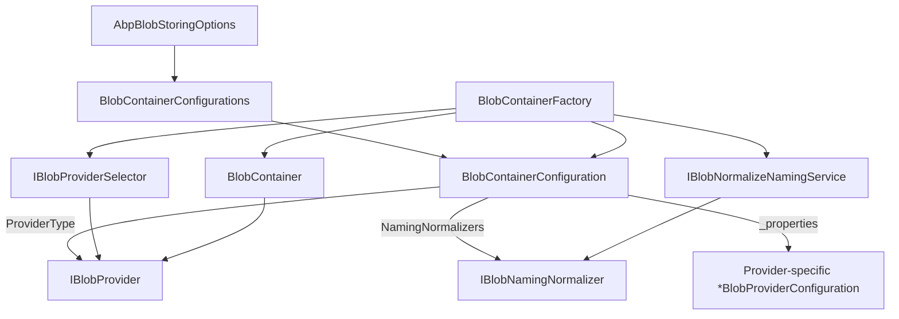

The `Volo.Abp.BlobStoring` package is the back-end-agnostic core of the ABP Framework's BLOB storing system. It defines the stream-based `IBlobContainer` API consumers call, the per-provider `IBlobProvider` contract that the actual storage back ends implement, the configuration model rooted in `AbpBlobStoringOptions`, and the helper services for container creation, provider selection, and naming normalization. Every file referenced on this page lives under `framework/src/Volo.Abp.BlobStoring/Volo/Abp/BlobStoring/`.

## Package layout

```
framework/src/Volo.Abp.BlobStoring/Volo/Abp/BlobStoring/
├── AbpBlobStoringModule.cs
├── AbpBlobStoringOptions.cs
├── BlobAlreadyExistsException.cs
├── BlobContainer.cs
├── BlobContainerConfiguration.cs
├── BlobContainerConfigurationExtensions.cs
├── BlobContainerConfigurationProviderExtensions.cs
├── BlobContainerConfigurations.cs
├── BlobContainerExtensions.cs
├── BlobContainerFactory.cs
├── BlobContainerFactoryExtensions.cs
├── BlobContainerNameAttribute.cs
├── BlobNormalizeNaming.cs
├── BlobNormalizeNamingService.cs
├── BlobProviderArgs.cs
├── BlobProviderBase.cs
├── BlobProviderDeleteArgs.cs
├── BlobProviderExistsArgs.cs
├── BlobProviderGetArgs.cs
├── BlobProviderSaveArgs.cs
├── BlobProviderSelectorExtensions.cs
├── DefaultBlobContainerConfigurationProvider.cs
├── DefaultBlobProviderSelector.cs
├── DefaultContainer.cs
├── IBlobContainer.cs
├── IBlobContainerConfigurationProvider.cs
├── IBlobContainerFactory.cs
├── IBlobNamingNormalizer.cs
├── IBlobNormalizeNamingService.cs
├── IBlobProvider.cs
└── IBlobProviderSelector.cs
```

## AbpBlobStoringModule

`AbpBlobStoringModule.cs` is the module class. It depends on multi-tenancy and threading and registers two open-generic services:

```csharp
[DependsOn(typeof(AbpMultiTenancyModule), typeof(AbpThreadingModule))]
public class AbpBlobStoringModule : AbpModule
{
    public override void ConfigureServices(ServiceConfigurationContext context)
    {
        context.Services.AddTransient(
            typeof(IBlobContainer<>),
            typeof(BlobContainer<>)
        );

        context.Services.AddTransient(
            typeof(IBlobContainer),
            serviceProvider => serviceProvider
                .GetRequiredService<IBlobContainer<DefaultContainer>>()
        );
    }
}
```

The two registrations cover the two ways application code can consume the BLOB system:

- `IBlobContainer<TContainer>` is bound to the open generic `BlobContainer<TContainer>` so each typed container is wired separately.
- `IBlobContainer` (the non-generic) resolves to `IBlobContainer<DefaultContainer>`, where `DefaultContainer` is a marker class defined in `DefaultContainer.cs`:

```csharp
[BlobContainerName(Name)]
public class DefaultContainer
{
    public const string Name = "default";
}
```

Injecting `IBlobContainer` without a type parameter therefore stores blobs in a container named `"default"`.

## IBlobContainer — the consumer API

`IBlobContainer.cs` defines the stream-based API:

```csharp
public interface IBlobContainer<TContainer> : IBlobContainer where TContainer : class { }

public interface IBlobContainer
{
    Task SaveAsync(string name, Stream stream, bool overrideExisting = false, CancellationToken cancellationToken = default);
    Task<bool> DeleteAsync(string name, CancellationToken cancellationToken = default);
    Task<bool> ExistsAsync(string name, CancellationToken cancellationToken = default);
    Task<Stream> GetAsync(string name, CancellationToken cancellationToken = default);
    Task<Stream?> GetOrNullAsync(string name, CancellationToken cancellationToken = default);
}
```

Behaviors documented in the file itself:

- `SaveAsync` throws `BlobAlreadyExistsException` (defined in `BlobAlreadyExistsException.cs`) if `overrideExisting == false` and a blob with the given name already exists.
- `DeleteAsync` returns `true` when a blob was actually removed and `false` when no blob with that name was present.
- `GetAsync` throws `AbpException` when the blob is missing; `GetOrNullAsync` returns `null` instead.

`BlobContainerExtensions.cs` adds convenience overloads that wrap byte arrays and strings in streams so callers don't have to construct `MemoryStream` instances themselves.

## BlobContainer — the routing implementation

`BlobContainer.cs` ships two classes. The generic `BlobContainer<TContainer>` delegates everything to an inner non-generic `IBlobContainer` obtained from `IBlobContainerFactory.Create<TContainer>()`:

```csharp
public class BlobContainer<TContainer> : IBlobContainer<TContainer> where TContainer : class
{
    protected readonly IBlobContainer Container;
    public BlobContainer(IBlobContainerFactory blobContainerFactory)
        => Container = blobContainerFactory.Create<TContainer>();
}
```

The non-generic `BlobContainer` is the real implementation. It composes seven collaborators:

| Collaborator | Source |
|---|---|
| `BlobContainerConfiguration Configuration` | passed in via constructor; obtained from `IBlobContainerConfigurationProvider`. |
| `IBlobProvider Provider` | selected by `IBlobProviderSelector` based on `Configuration.ProviderType`. |
| `ICurrentTenant` | scope for tenant-aware storage. |
| `ICancellationTokenProvider` | falls back to a default token if the caller passes `default`. |
| `IBlobNormalizeNamingService` | runs `IBlobNamingNormalizer`s registered on the configuration. |
| `IServiceProvider` | available for providers that need to resolve additional services. |
| `string ContainerName` | the resolved name (either from `[BlobContainerName]` or the type's `FullName`). |

Every operation follows the same pattern, exemplified by `SaveAsync`:

```csharp
public virtual async Task SaveAsync(string name, Stream stream, bool overrideExisting = false, CancellationToken cancellationToken = default)
{
    using (CurrentTenant.Change(GetTenantIdOrNull()))
    {
        var blobNormalizeNaming = BlobNormalizeNamingService.NormalizeNaming(Configuration, ContainerName, name);

        await Provider.SaveAsync(new BlobProviderSaveArgs(
            blobNormalizeNaming.ContainerName!,
            Configuration,
            blobNormalizeNaming.BlobName!,
            stream,
            overrideExisting,
            CancellationTokenProvider.FallbackToProvider(cancellationToken)));
    }
}
```

Three things happen on every call:

1. `CurrentTenant.Change(GetTenantIdOrNull())` either pins to the current tenant (if `IsMultiTenant`) or to `null` (host scope). This guarantees the provider sees the right tenant inside its own logic.
2. `BlobNormalizeNamingService.NormalizeNaming` runs every registered `IBlobNamingNormalizer` against the container name and blob name. Each provider package adds its own normalizer to enforce that-back-end's character rules.
3. The provider receives a typed `BlobProviderSaveArgs` (or `BlobProviderGetArgs`, etc.) carrying the normalized names, the configuration object, the stream, and a cancellation token.

`GetAsync` differs by wrapping the optional result of `GetOrNullAsync` and throwing `AbpException("Could not find the requested BLOB '...' in the container '...'!")` if it was missing.

## DefaultContainer and BlobContainerNameAttribute

`DefaultContainer.cs` and `BlobContainerNameAttribute.cs` together define how a container's textual name is resolved:

```csharp
public class BlobContainerNameAttribute : Attribute
{
    public string Name { get; }

    public BlobContainerNameAttribute(string name) => Name = Check.NotNullOrWhiteSpace(name, nameof(name));

    public virtual string GetName(Type type) => Name;

    public static string GetContainerName<T>() => GetContainerName(typeof(T));

    public static string GetContainerName(Type type)
    {
        var nameAttribute = type.GetCustomAttribute<BlobContainerNameAttribute>();
        return nameAttribute == null ? type.FullName! : nameAttribute.GetName(type);
    }
}
```

If you don't decorate your marker class, the container name defaults to the type's `FullName`. The `Default Container` is `"default"` because of `[BlobContainerName("default")]` on `DefaultContainer`.

## AbpBlobStoringOptions and BlobContainerConfigurations

`AbpBlobStoringOptions.cs` is intentionally tiny:

```csharp
public class AbpBlobStoringOptions
{
    public BlobContainerConfigurations Containers { get; }
    public AbpBlobStoringOptions() => Containers = new BlobContainerConfigurations();
}
```

All real configuration goes through `Containers`, an instance of `BlobContainerConfigurations` (`BlobContainerConfigurations.cs`). That class holds a default `BlobContainerConfiguration` plus a dictionary of named overrides:

- `ConfigureDefault(Action<BlobContainerConfiguration>)` mutates the default container configuration.
- `Configure<TContainer>(Action<BlobContainerConfiguration>)` mutates the configuration for a specific typed container, identified by `BlobContainerNameAttribute.GetContainerName<TContainer>()`.
- `Configure(string name, Action<BlobContainerConfiguration>)` does the same by string name.
- `GetConfiguration(string)` is what `DefaultBlobContainerConfigurationProvider` uses to resolve the live configuration at runtime — values not set on a specific container fall through to the default.

The fallback is implemented by passing the default `BlobContainerConfiguration` as the `fallbackConfiguration` constructor argument when the named configuration is created (see `BlobContainerConfiguration.cs` `GetConfigurationOrNull` walking `_fallbackConfiguration`).

## BlobContainerConfiguration

`BlobContainerConfiguration.cs` is the central state object for one container. Its properties:

```csharp
public class BlobContainerConfiguration
{
    public Type? ProviderType { get; set; }
    public bool IsMultiTenant { get; set; } = true;
    public ITypeList<IBlobNamingNormalizer> NamingNormalizers { get; }

    public BlobContainerConfiguration(BlobContainerConfiguration? fallbackConfiguration = null);

    public T? GetConfigurationOrDefault<T>(string name, T? defaultValue = default);
    public object? GetConfigurationOrNull(string name, object? defaultValue = null);
    public BlobContainerConfiguration SetConfiguration(string name, object? value);
    public BlobContainerConfiguration ClearConfiguration(string name);
}
```

- `ProviderType` records which `IBlobProvider` to route to. The `Use*` extensions (e.g. `UseAzure`, `UseAws`) set this.
- `IsMultiTenant` defaults to `true`. Setting it to `false` shares the blobs across all tenants.
- `NamingNormalizers` is the list of normalizers the system asks for character-sanity before sending names to the provider.
- The free-form `_properties` dictionary, accessed via `SetConfiguration` and `GetConfiguration*`, is how provider-specific values (connection strings, region names, bucket names, etc.) are persisted.

`BlobContainerConfigurationExtensions.cs` adds typed accessors via per-provider helpers; for example, the file-system extension `GetFileSystemConfiguration` wraps the configuration in a `FileSystemBlobProviderConfiguration` for typed reads.

## IBlobProvider and the args hierarchy

`IBlobProvider.cs` is the back-end contract:

```csharp
public interface IBlobProvider
{
    Task SaveAsync(BlobProviderSaveArgs args);
    Task<bool> DeleteAsync(BlobProviderDeleteArgs args);
    Task<bool> ExistsAsync(BlobProviderExistsArgs args);
    Task<Stream?> GetOrNullAsync(BlobProviderGetArgs args);
}
```

`BlobProviderBase.cs` adds a couple of helpers — notably `TryCopyToMemoryStreamAsync` which buffers an arbitrary read-only stream into a seekable `MemoryStream`, useful for providers whose SDK needs random access.

### BlobProviderArgs

`BlobProviderArgs.cs` is the base for every args record:

```csharp
public abstract class BlobProviderArgs
{
    public string ContainerName { get; }
    public BlobContainerConfiguration Configuration { get; }
    public string BlobName { get; }
    public CancellationToken CancellationToken { get; }

    protected BlobProviderArgs(string containerName, BlobContainerConfiguration configuration, string blobName, CancellationToken cancellationToken = default);
}
```

The four subclasses add operation-specific data:

| Args type | Source file | Extra members |
|---|---|---|
| `BlobProviderSaveArgs` | `BlobProviderSaveArgs.cs` | `Stream BlobStream`, `bool OverrideExisting` |
| `BlobProviderGetArgs` | `BlobProviderGetArgs.cs` | (nothing extra) |
| `BlobProviderDeleteArgs` | `BlobProviderDeleteArgs.cs` | (nothing extra) |
| `BlobProviderExistsArgs` | `BlobProviderExistsArgs.cs` | (nothing extra) |

Args are constructed by `BlobContainer` and passed to the provider — providers should never construct args themselves.

## IBlobProviderSelector and DefaultBlobProviderSelector

`IBlobProviderSelector.cs` declares a single method `Get(string containerName)` that returns the right `IBlobProvider`. `DefaultBlobProviderSelector.cs` is the implementation registered as `ITransientDependency`:

```csharp
public virtual IBlobProvider Get(string containerName)
{
    Check.NotNull(containerName, nameof(containerName));
    var configuration = ConfigurationProvider.Get(containerName);

    if (!BlobProviders.Any())
    {
        throw new AbpException("No BLOB Storage provider was registered! ...");
    }

    if (configuration.ProviderType == null)
    {
        throw new AbpException("No BLOB Storage provider was used! ...");
    }

    foreach (var provider in BlobProviders)
    {
        if (ProxyHelper.GetUnProxiedType(provider).IsAssignableTo(configuration.ProviderType))
        {
            return provider;
        }
    }

    throw new AbpException("Could not find the BLOB Storage provider with the type ...");
}
```

The `ProxyHelper.GetUnProxiedType` call comes from `framework/src/Volo.Abp.Castle.Core/Volo/Abp/DynamicProxy/ProxyHelper.cs` and unwraps Castle-DynamicProxy wrappers so that the type comparison against `configuration.ProviderType` succeeds even when interception is enabled.

The selector enumerates every `IBlobProvider` registered in DI — that's how the per-package modules `AbpBlobStoringFileSystemModule`, `AbpBlobStoringAzureModule`, etc., make their providers available without any global registration: each `*BlobProvider` is marked `ITransientDependency` and the conventional registrar picks them up.

## IBlobContainerFactory and BlobContainerFactory

`IBlobContainerFactory.cs` declares `Create(string)` and the extension `Create<TContainer>()` in `BlobContainerFactoryExtensions.cs` which resolves the name from `[BlobContainerName]`.

`BlobContainerFactory.cs`:

```csharp
public virtual IBlobContainer Create(string name)
{
    var configuration = ConfigurationProvider.Get(name);

    return new BlobContainer(
        name,
        configuration,
        ProviderSelector.Get(name),
        CurrentTenant,
        CancellationTokenProvider,
        BlobNormalizeNamingService,
        ServiceProvider
    );
}
```

This is the single seam where the abstraction binds to a concrete provider — and the only place in the system where `BlobContainer` is constructed.

## Configuration provider

`IBlobContainerConfigurationProvider.cs` declares `Get(string)`. `DefaultBlobContainerConfigurationProvider.cs`:

```csharp
public virtual BlobContainerConfiguration Get(string name)
    => Options.Containers.GetConfiguration(name);
```

The provider hands back the `BlobContainerConfiguration` stored under that name in `AbpBlobStoringOptions.Containers`. The provider can be replaced if you want runtime-driven configuration (for example, looking up tenant-specific keys from a database).

## Naming normalization

`IBlobNamingNormalizer.cs` is the per-provider contract:

```csharp
public interface IBlobNamingNormalizer
{
    string NormalizeContainerName(string containerName);
    string NormalizeBlobName(string blobName);
}
```

`BlobNormalizeNamingService.cs` orchestrates them. The service iterates every normalizer type listed in `BlobContainerConfiguration.NamingNormalizers`, resolves it from a child scope, and runs both normalizations through the chain in order. When no normalizers are registered, both names pass through unchanged.

This lets each provider — say `AzureBlobNamingNormalizer` (`framework/src/Volo.Abp.BlobStoring.Azure/.../AzureBlobNamingNormalizer.cs`) — enforce that Azure container names contain only lowercase letters, digits, and hyphens, while AWS's normalizer enforces the slightly different S3 bucket naming rules.

## A glance at extension points



The pieces compose into a clean separation: options describe *what* providers and naming rules are configured; the factory composes a container around them; the container calls the provider through normalized args.

## Common consumer recipes

<AccordionGroup>
  <Accordion title="Define a typed container" icon="cube">
    Create a marker class `public class ReportContainer { }` and decorate it with `[BlobContainerName("reports")]` if you need a stable string name. Inject `IBlobContainer<ReportContainer>`.
  </Accordion>
  <Accordion title="Configure for one provider" icon="gear">
    In a module's `ConfigureServices`, write `Configure<AbpBlobStoringOptions>(options =>options.Containers.Configure<ReportContainer>(c => c.UseAzure(...)));`. The provider package's `Use*` extension sets `ProviderType` and registers the per-provider naming normalizer.
  </Accordion>
  <Accordion title="Configure the default container" icon="circle">
    `options.Containers.ConfigureDefault(c => c.UseFileSystem(fs => fs.BasePath = "..."))` makes the bare `IBlobContainer` work without specifying a container type.
  </Accordion>
  <Accordion title="Disable multi-tenancy for a specific container" icon="users-slash">
    Inside the `Configure<TContainer>` lambda, set `c.IsMultiTenant = false`. Useful for global static assets shared by every tenant.
  </Accordion>
  <Accordion title="Read or write strings/bytes directly" icon="file-lines">
    The convenience methods in `BlobContainerExtensions.cs` give you `SaveAsync(name, byte[])`, `GetAllBytesAsync(name)`, `GetAllStringAsync(name)`, etc., without manual `MemoryStream` wrapping.
  </Accordion>
</AccordionGroup>

## Where to read about each provider

The per-provider pages document the configuration class, the SDK they wrap, and the on-disk/storage layout:

- [File System](/blob/file-system) — `FileSystemBlobProvider`
- [Azure](/blob/azure) — `AzureBlobProvider`
- [AWS S3](/blob/aws-s3) — `AwsBlobProvider`
- [Google Cloud](/blob/google-cloud) — `GoogleBlobProvider`
- [Aliyun OSS](/blob/aliyun-oss) — `AliyunBlobProvider`
- [MinIO](/blob/minio) — `MinioBlobProvider`
- [Bunny](/blob/bunny) — `BunnyBlobProvider`
- [In-Memory](/blob/in-memory) — `MemoryBlobProvider`
- [BLOB Database](/blob/database-module) — database-backed module
