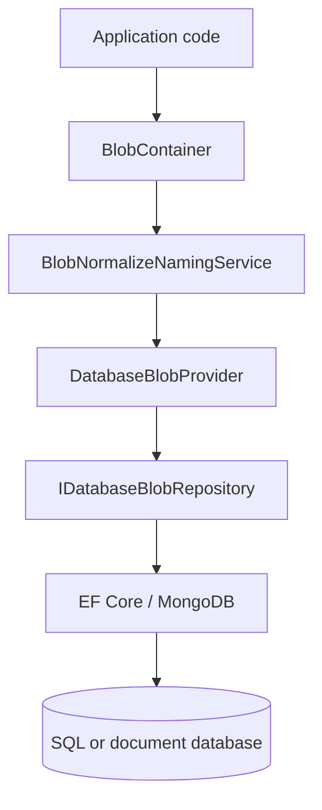
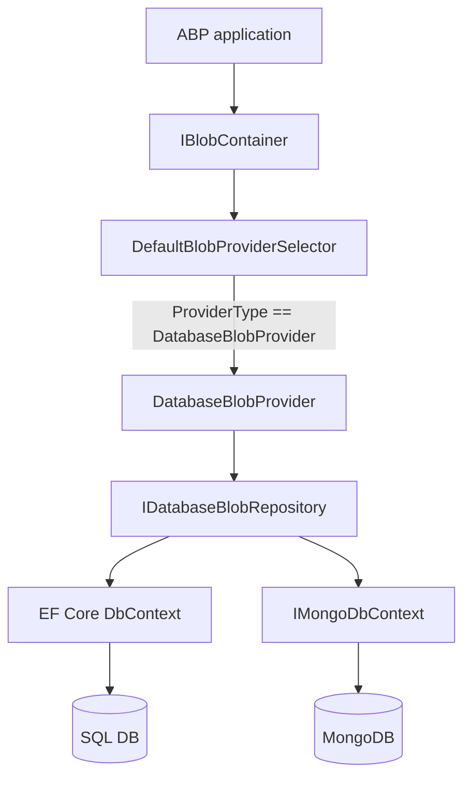

The `Volo.Abp.BlobStoring.Database` module is the database-backed counterpart of the in-framework BLOB providers. It stores blobs as rows in a relational table (or a MongoDB collection), eliminating the need to deploy and operate a separate object store. The module lives in the ABP modules tree at `modules/blob-storing-database/` and ships as a stack of `Domain.Shared` / `Domain` / `EntityFrameworkCore` / `MongoDB` projects in the same shape as every other ABP module.

This page gives a concise overview and links to the deeper module pages elsewhere in the wiki where the full data model, repository, and migration story are documented.

## Module location

```
modules/blob-storing-database/
├── NuGet.md
├── Volo.Abp.BlobStoring.Database.abpmdl
├── Volo.Abp.BlobStoring.Database.abpsln
├── Volo.Abp.BlobStoring.Database.sln.DotSettings
├── Volo.Abp.BlobStoring.Database.slnx
├── host/                                         ← sample host
├── src/
│   ├── Volo.Abp.BlobStoring.Database.Domain.Shared/
│   ├── Volo.Abp.BlobStoring.Database.Domain/
│   ├── Volo.Abp.BlobStoring.Database.EntityFrameworkCore/
│   └── Volo.Abp.BlobStoring.Database.MongoDB/
└── test/                                         ← integration tests
```

The split into `Domain.Shared`, `Domain`, and one project per persistence provider follows the standard ABP module template — exactly the same layout as the Identity, Tenant Management, and Permission Management modules.

## When the database module is the right choice

<AccordionGroup>
  <Accordion title="Single-instance app with no S3-compatible service available" icon="server">
    On-prem deployments where the operations team doesn't want to add MinIO or another object store to the stack often prefer the database — backups, monitoring, and disaster recovery already cover the database.
  </Accordion>
  <Accordion title="Strong transactional guarantees" icon="link">
    BLOBs persisted alongside business data participate in the same transaction. If the transaction rolls back, the blob is gone too — no two-phase commit needed.
  </Accordion>
  <Accordion title="Small attachments (KB to a few MB)" icon="paperclip">
    For user avatars, signature images, PDFs under a few MB, etc., the database is fine. The provider uses `byte[]` columns (`varbinary(max)` in SQL Server, `bytea` in PostgreSQL, `LONGBLOB` in MySQL) or GridFS in MongoDB.
  </Accordion>
  <Accordion title="Compliance constraints that ban external object stores" icon="shield">
    When customer policies prohibit cloud object storage, persisting in the application database may be the only acceptable option.
  </Accordion>
</AccordionGroup>

And when it is **not** the right choice:

- Streaming video, large CAD files, very large datasets — your DB performance and backup windows will suffer. Use [Azure](/blob/azure), [AWS S3](/blob/aws-s3), or [MinIO](/blob/minio) instead.
- High-throughput write workloads — every blob save is a transaction; you'll saturate the DB on hot paths long before you'd saturate an object store.
- Cross-region replication — easy with cloud providers, hard with a single DB instance.

## High-level architecture

The module sits in the same role as the file-system or Azure providers: it registers an `IBlobProvider` implementation (`DatabaseBlobProvider`) and a `Use*` extension (`UseDatabase`). The shape is identical to the other providers — the only difference is that the persistence target is `IDbBlobContainerRepository` (EF Core or MongoDB) instead of `Azure.Storage.Blobs.BlobClient`.



Configuration is symmetrical to the other providers:

```csharp
[DependsOn(
    typeof(AbpBlobStoringDatabaseModule),
    typeof(AbpBlobStoringDatabaseEntityFrameworkCoreModule))]
public class MyAppModule : AbpModule
{
    public override void ConfigureServices(ServiceConfigurationContext context)
    {
        Configure<AbpBlobStoringOptions>(options =>
        {
            options.Containers.ConfigureDefault(c => c.UseDatabase());
        });
    }
}
```

The `UseDatabase` extension sets `ProviderType = typeof(DatabaseBlobProvider)` and wires the database-specific naming normalizer.

## Where to read the deep documentation

The cross-cutting wiki pages for the module — entity definitions, repository contracts, DB-Context setup, and migration tooling — live alongside the rest of the ABP modules in this documentation:

<CardGroup cols={2}>
  <Card title="Domain layer" icon="cube" href="/module-blob-database/persistence">
    The `BlobContainer` and `DatabaseBlob` aggregates, `IBlobRepository`, and domain services.
  </Card>
  <Card title="EF Core integration" icon="database" href="/module-blob-database/persistence">
    `DbContext`, `OnModelCreating` entity configuration, and the EF Core repository implementation.
  </Card>
  <Card title="MongoDB integration" icon="leaf" href="/module-blob-database/persistence">
    The MongoDB collection mapping and `IMongoDbContext` extensions.
  </Card>
  <Card title="Migrations & host" icon="play" href="/module-blob-database/persistence">
    The sample host under `modules/blob-storing-database/host/` and the database-migration story.
  </Card>
</CardGroup>

Those pages cover:

- The `DatabaseBlobContainer` aggregate (`modules/blob-storing-database/src/Volo.Abp.BlobStoring.Database.Domain/.../DatabaseBlobContainer.cs`).
- The `DatabaseBlob` entity (`modules/blob-storing-database/src/Volo.Abp.BlobStoring.Database.Domain/.../DatabaseBlob.cs`) with its `Content` byte array column.
- The `IDatabaseBlobRepository` and `IDatabaseBlobContainerRepository` contracts under `modules/blob-storing-database/src/Volo.Abp.BlobStoring.Database.Domain/.../IDatabaseBlobRepository.cs`.
- The EF Core implementations under `modules/blob-storing-database/src/Volo.Abp.BlobStoring.Database.EntityFrameworkCore/`.
- The MongoDB implementations under `modules/blob-storing-database/src/Volo.Abp.BlobStoring.Database.MongoDB/`.
- The migration tooling under `modules/blob-storing-database/host/`.

## Multi-tenancy

The module respects `BlobContainerConfiguration.IsMultiTenant` the same way the framework providers do — when multi-tenant, the `DatabaseBlob` rows carry the `TenantId` column populated from `ICurrentTenant.Id` and are filtered by the module's `IMultiTenant` data filter. No additional configuration is required.

## Performance characteristics

<AccordionGroup>
  <Accordion title="Read latency" icon="bolt">
    Reading a blob involves a single primary-key lookup, no I/O outside the database. Cold reads from EF Core typically take 1–5 ms for blobs under 1 MB.
  </Accordion>
  <Accordion title="Write latency" icon="pen">
    Writes go through the EF Core change tracker and require a full transaction commit. Expect 5–20 ms for blobs under 1 MB depending on the DB engine.
  </Accordion>
  <Accordion title="DB sizing" icon="database">
    Each blob row is roughly `(size + ~200) bytes`. A typical user-attachment workload of 50 KB/blob × 100k blobs ≈ 5 GB on disk plus indexes. Plan backup windows accordingly.
  </Accordion>
  <Accordion title="Connection pooling" icon="recycle">
    The provider participates in the standard EF Core connection pool. There is no separate connection pool to size.
  </Accordion>
  <Accordion title="Sharding and read replicas" icon="copy">
    Sharding is the application's responsibility; the provider doesn't pre-shard by blob name. For read-heavy workloads, configure EF Core to route reads to a read replica.
  </Accordion>
</AccordionGroup>

## Comparison with the framework providers

| Aspect | Database module | File System | Azure / AWS / GCS / MinIO | Bunny |
|---|---|---|---|---|
| Persistence | Same DB as business data | Local disk | Cloud / self-hosted object store | Edge storage zone |
| Transactional with app data | yes | no | no | no |
| Cross-instance shared | yes (any instance can read) | only via shared FS | yes | yes |
| Backup story | DB backup covers it | separate FS backup | provider snapshot | replica setup |
| Suitable max blob size | a few MB | several GB | unlimited (provider-specific) | 5 GB per object |
| Configuration verbosity | minimal — `UseDatabase()` | one BasePath | connection string + options | access key + zone |

## Cross references

- For the abstraction the module plugs into, see [BLOB Core](/blob/core).
- For an overview of every provider in the ABP BLOB stack, see [Overview](/blob/overview).
- For cloud or self-hosted object storage alternatives, see [Azure](/blob/azure), [AWS S3](/blob/aws-s3), [Google Cloud](/blob/google-cloud), [MinIO](/blob/minio), or [Aliyun OSS](/blob/aliyun-oss).
- For ephemeral test setups that don't touch a database, see [In-Memory](/blob/in-memory).

## Schema preview

While the in-depth schema documentation lives on the module-specific pages, a high-level preview of the relational schema produced by the EF Core integration:

| Table | Columns of interest |
|---|---|
| `AbpBlobContainers` | `Id (uniqueidentifier PK)`, `Name (nvarchar(64))`, `TenantId (uniqueidentifier nullable)` |
| `AbpBlobs` | `Id (uniqueidentifier PK)`, `ContainerId (uniqueidentifier FK)`, `TenantId`, `Name`, `Content (varbinary(max))`, `CreationTime`, `LastModificationTime` |

The composite unique index on `(ContainerId, Name)` ensures blob names are unique per container, and the `TenantId` column carries the standard ABP multi-tenant filter automatically (via `IMultiTenant`).

The MongoDB integration uses an analogous collection structure:

```json
{
  "_id": "...",
  "containerId": "...",
  "tenantId": "...",
  "name": "...",
  "content": "BinData(...)",
  "creationTime": "...",
  "lastModificationTime": "..."
}
```

Inline binary storage is suitable for blobs under MongoDB's 16 MB document limit. For larger objects, the module also supports GridFS via a separate repository implementation (`MongoGridFsDatabaseBlobRepository`) that splits content into chunks.

## Migration story

The Domain.Shared project contains the database name constants. When you reference `Volo.Abp.BlobStoring.Database.EntityFrameworkCore` in your migrations project, the entity configuration is applied via `builder.ConfigureBlobStoring()` in `OnModelCreating`. After `dotnet ef migrations add`, the resulting migration script creates the `AbpBlobContainers` and `AbpBlobs` tables.

For MongoDB there is no migration; the module creates the collections lazily on first access.

## Performance tuning checklist

<AccordionGroup>
  <Accordion title="Index on Name within container" icon="bolt">
    The default migration creates a unique index on `(ContainerId, Name)`. This is the index used by every lookup, so it must remain in place.
  </Accordion>
  <Accordion title="Move Content to a separate filegroup" icon="files">
    On SQL Server, moving `AbpBlobs.Content` to a dedicated filegroup with `FILESTREAM` can dramatically improve large-blob throughput. Implement via a custom migration.
  </Accordion>
  <Accordion title="Read-replica routing for downloads" icon="copy">
    Reads of immutable content are great candidates for read replicas. Configure EF Core's connection strategy to send `GetOrNullAsync` reads to a replica.
  </Accordion>
  <Accordion title="Compress large binary content" icon="file-zipper">
    The provider stores raw bytes. For text-heavy blobs (XML, JSON) consider compressing client-side before `SaveAsync` and decompressing after `GetOrNullAsync`.
  </Accordion>
  <Accordion title="Soft-delete blobs" icon="trash-can">
    The default delete is hard. If you need soft-delete (auditing, recovery), subclass `DatabaseBlobProvider` to mark rows with `IsDeleted = true` instead of `Remove(blob)`.
  </Accordion>
</AccordionGroup>

## Provider selection from configuration

Because the database module is a drop-in `IBlobProvider` like every other framework provider, a deployment can pick between database, file system, Azure, AWS, etc. at runtime from configuration:

```csharp
public override void ConfigureServices(ServiceConfigurationContext context)
{
    var providerName = context.Services.GetConfiguration()["Storage:Provider"];

    Configure<AbpBlobStoringOptions>(options =>
    {
        options.Containers.ConfigureDefault(c =>
        {
            switch (providerName)
            {
                case "Database":
                    c.UseDatabase();
                    break;
                case "FileSystem":
                    c.UseFileSystem(fs => fs.BasePath = "/data/blobs");
                    break;
                case "Azure":
                    c.UseAzure(a => a.ConnectionString = context.Services.GetConfiguration()["Storage:Azure"]!);
                    break;
                default:
                    c.UseMemory();
                    break;
            }
        });
    });
}
```

Application code that injects `IBlobContainer` is oblivious to which provider is active — the abstraction's whole point.

## What you should not store in the database

The database provider is at its best for *small* attachments (tens to hundreds of KB) and *transactional* artifacts (audit attachments, signed PDFs, generated reports tied to a domain operation). It is at its worst for:

- Large media (videos, high-resolution images): bloats backups, dominates the buffer cache, slows down queries on unrelated tables.
- Public assets served at high QPS: every request hits the DB; a CDN-fronted object store is dramatically cheaper.
- Append-heavy logs: row contention on the table goes up linearly with concurrent writes.

For any of these, switch to [Azure](/blob/azure), [AWS S3](/blob/aws-s3), [Google Cloud](/blob/google-cloud), [MinIO](/blob/minio), or [Bunny](/blob/bunny). The module page links above remain useful reference material for the schema.

## A note on streaming

EF Core does not stream `varbinary(max)` columns by default — it materializes the full column into a `byte[]` on read. For 100 KB attachments this is harmless. For multi-MB blobs it consumes memory equal to the blob size for every read. If you must store larger objects in the DB, consider two patterns:

- **Chunking**: split the blob across multiple rows of a `(BlobId, Sequence, Content)` table and read sequentially. The module does not implement chunking; you would build it on top.
- **FILESTREAM**: on SQL Server, configure the `Content` column as `FILESTREAM` and use the dedicated streaming APIs. Requires server configuration outside ABP.

For MongoDB, GridFS is the documented approach for objects over 16 MB; the module's `MongoGridFsDatabaseBlobRepository` (when configured) automatically chunks blobs into the `fs.files` / `fs.chunks` collection pair.

## Replacing the provider

The database module's `DatabaseBlobProvider` is registered as `ITransientDependency`. If you need custom behavior — say, encryption-at-rest using a customer-supplied key — subclass it:

```csharp
public class EncryptedDatabaseBlobProvider : DatabaseBlobProvider
{
    public EncryptedDatabaseBlobProvider(IDatabaseBlobRepository r, ...) : base(r, ...) { }

    public override async Task SaveAsync(BlobProviderSaveArgs args)
    {
        using var encrypted = await EncryptStreamAsync(args.BlobStream);
        var newArgs = new BlobProviderSaveArgs(
            args.ContainerName, args.Configuration, args.BlobName,
            encrypted, args.OverrideExisting, args.CancellationToken);
        await base.SaveAsync(newArgs);
    }

    public override async Task<Stream?> GetOrNullAsync(BlobProviderGetArgs args)
    {
        var stream = await base.GetOrNullAsync(args);
        return stream == null ? null : await DecryptStreamAsync(stream);
    }
}
```

Register the override via `context.Services.Replace(ServiceDescriptor.Transient<DatabaseBlobProvider, EncryptedDatabaseBlobProvider>())`.

## Cross-database portability

Because the EF Core integration relies only on `varbinary(max)`-equivalent columns and the standard ABP repository pattern, the same code runs against SQL Server, PostgreSQL, MySQL, Oracle, and SQLite. Each provider's migration may use a different column type (`bytea` for PostgreSQL, `LONGBLOB` for MySQL) but the C# surface is identical.

## Host project under modules/blob-storing-database/host

The repository ships a sample host under `modules/blob-storing-database/host/` that demonstrates how to wire the module into an ASP.NET Core app from scratch. The host is useful in two ways:

- It serves as a reference for how `[DependsOn]` should be structured when consuming the module.
- It is the entry point the EF Core migration tooling uses (`dotnet ef migrations add`, `dotnet ef database update`).

When integrating the module into your own application, you typically do not copy the host wholesale — instead, you copy the module-dependency wiring from `MyHostModule.cs` and the migration `DbContext` setup from the EF Core project.

## Test project under modules/blob-storing-database/test

`modules/blob-storing-database/test/` contains the integration tests for the module. They exercise the full save / get / exists / delete cycle against both EF Core and MongoDB backends, including multi-tenant scoping. Reading the test code is a fast way to understand the expected contract — especially the corner cases around `OverrideExisting`, missing blobs, and tenant scope changes mid-test.

## Where the module fits in the BLOB stack



Notice that the database module sits at the same layer as `AzureBlobProvider`, `AwsBlobProvider`, etc. — there is nothing privileged about the database path; the abstraction treats it as just another provider.
