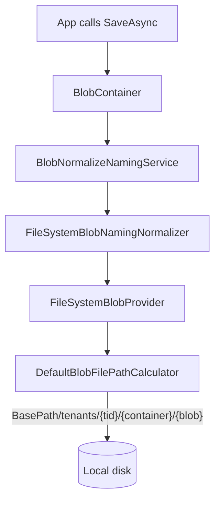

The `Volo.Abp.BlobStoring.FileSystem` package implements `IBlobProvider` against the local file system. Every blob is written to a configurable base directory, scoped by tenant, container, and blob name — so on a single dev machine you can keep blobs durable, version-controlled-friendly, and inspectable with Explorer or `ls`. The package source lives at `framework/src/Volo.Abp.BlobStoring.FileSystem/Volo/Abp/BlobStoring/FileSystem/`.

## Package layout

```
framework/src/Volo.Abp.BlobStoring.FileSystem/Volo/Abp/BlobStoring/FileSystem/
├── AbpBlobStoringFileSystemModule.cs
├── DefaultBlobFilePathCalculator.cs
├── FileSystemBlobContainerConfigurationExtensions.cs
├── FileSystemBlobNamingNormalizer.cs
├── FileSystemBlobProvider.cs
├── FileSystemBlobProviderConfiguration.cs
├── FileSystemBlobProviderConfigurationNames.cs
└── IBlobFilePathCalculator.cs
```

## Module

`AbpBlobStoringFileSystemModule.cs`:

```csharp
[DependsOn(typeof(AbpBlobStoringModule))]
public class AbpBlobStoringFileSystemModule : AbpModule
{
}
```

The module brings the core abstraction along. There is no `ConfigureServices` override — every concrete service in the package is marked `ITransientDependency` and is picked up by the conventional registrar automatically.

## FileSystemBlobProvider

`FileSystemBlobProvider.cs` is the concrete provider, registered as `ITransientDependency` so the `DefaultBlobProviderSelector` (in `framework/src/Volo.Abp.BlobStoring/.../DefaultBlobProviderSelector.cs`) can discover it. It composes a single dependency, `IBlobFilePathCalculator`, that maps the `BlobProviderArgs` (container + blob name + multi-tenant scope) to an actual file path. Stream operations then go through `System.IO.File`.

### SaveAsync

```csharp
public override async Task SaveAsync(BlobProviderSaveArgs args)
{
    var filePath = FilePathCalculator.Calculate(args);

    if (!args.OverrideExisting && await ExistsAsync(filePath))
    {
        throw new BlobAlreadyExistsException($"Saving BLOB '{args.BlobName}' does already exists in the container '{args.ContainerName}'! Set {nameof(args.OverrideExisting)} if it should be overwritten.");
    }

    DirectoryHelper.CreateIfNotExists(Path.GetDirectoryName(filePath)!);

    var fileMode = args.OverrideExisting ? FileMode.Create : FileMode.CreateNew;

    await Policy.Handle<IOException>()
        .WaitAndRetryAsync(2, retryCount => TimeSpan.FromSeconds(retryCount))
        .ExecuteAsync(async () =>
        {
            using (var fileStream = File.Open(filePath, fileMode, FileAccess.Write))
            {
                await args.BlobStream.CopyToAsync(fileStream, args.CancellationToken);
                await fileStream.FlushAsync();
            }
        });
}
```

Three things matter in this method:

<Steps>
  <Step title="Existence check before write">
    When the caller didn't ask to override an existing blob, the provider proactively checks `ExistsAsync(filePath)` and throws `BlobAlreadyExistsException` from `framework/src/Volo.Abp.BlobStoring/Volo/Abp/BlobStoring/BlobAlreadyExistsException.cs`. The throw happens *before* any directory is created.
  </Step>
  <Step title="Directory creation">
    `DirectoryHelper.CreateIfNotExists(Path.GetDirectoryName(filePath)!)` ensures the parent directory exists. The helper lives at `framework/src/Volo.Abp.Core/Volo/Abp/IO/DirectoryHelper.cs` and is the idiomatic ABP wrapper around `Directory.CreateDirectory`.
  </Step>
  <Step title="Polly retry">
    The actual `File.Open` is wrapped in a Polly retry: two retries with linearly increasing wait time (1 second, then 2). This soaks up the transient `IOException`s that virus scanners and Windows file system filters routinely raise when a file has just been written and is being indexed.
  </Step>
</Steps>

### DeleteAsync, ExistsAsync, GetOrNullAsync

The remaining operations are direct translations of the file path:

```csharp
public override Task<bool> DeleteAsync(BlobProviderDeleteArgs args)
{
    var filePath = FilePathCalculator.Calculate(args);
    return Task.FromResult(FileHelper.DeleteIfExists(filePath));
}

public override Task<bool> ExistsAsync(BlobProviderExistsArgs args)
{
    var filePath = FilePathCalculator.Calculate(args);
    return ExistsAsync(filePath);
}

public override async Task<Stream?> GetOrNullAsync(BlobProviderGetArgs args)
{
    var filePath = FilePathCalculator.Calculate(args);
    if (!File.Exists(filePath)) return null;

    return await Policy.Handle<IOException>()
        .WaitAndRetryAsync(2, retryCount => TimeSpan.FromSeconds(retryCount))
        .ExecuteAsync(() => Task.FromResult(File.OpenRead(filePath)));
}
```

`FileHelper.DeleteIfExists` (`framework/src/Volo.Abp.Core/Volo/Abp/IO/FileHelper.cs`) returns `true` only when the file was present and was removed — exactly the contract `IBlobContainer.DeleteAsync` expects.

`GetOrNullAsync` returns `File.OpenRead(filePath)` directly. The caller is responsible for disposing the stream (the same convention as the rest of the BLOB API). The Polly retry covers the open call rather than the read so that a quickly-scanned-then-released file does not surface as an error.

## IBlobFilePathCalculator and DefaultBlobFilePathCalculator

`IBlobFilePathCalculator.cs`:

```csharp
public interface IBlobFilePathCalculator
{
    string Calculate(BlobProviderArgs args);
}
```

The default implementation `DefaultBlobFilePathCalculator.cs`:

```csharp
public virtual string Calculate(BlobProviderArgs args)
{
    var fileSystemConfiguration = args.Configuration.GetFileSystemConfiguration();
    var blobPath = fileSystemConfiguration.BasePath;

    if (CurrentTenant.Id == null)
    {
        blobPath = Path.Combine(blobPath, "host");
    }
    else
    {
        blobPath = Path.Combine(blobPath, "tenants", CurrentTenant.Id.Value.ToString("D"));
    }

    if (fileSystemConfiguration.AppendContainerNameToBasePath)
    {
        blobPath = Path.Combine(blobPath, args.ContainerName);
    }

    blobPath = Path.Combine(blobPath, args.BlobName);
    return blobPath;
}
```

The on-disk layout is therefore:

```
{BasePath}/
├── host/
│   └── {containerName}/
│       └── {blobName}
└── tenants/
    └── {tenantId-guid}/
        └── {containerName}/
            └── {blobName}
```

Setting `AppendContainerNameToBasePath = false` collapses every container into the tenant directory directly, useful when you want to mount a tenant's blobs as a single folder per environment.

You can replace `IBlobFilePathCalculator` to customize the layout — for example, sharding by the first two characters of the blob name to avoid millions of files in a single directory.

## FileSystemBlobProviderConfiguration

`FileSystemBlobProviderConfiguration.cs`:

```csharp
public class FileSystemBlobProviderConfiguration
{
    public string BasePath
    {
        get => _containerConfiguration.GetConfiguration<string>(FileSystemBlobProviderConfigurationNames.BasePath);
        set => _containerConfiguration.SetConfiguration(FileSystemBlobProviderConfigurationNames.BasePath, Check.NotNullOrWhiteSpace(value, nameof(value)));
    }

    public bool AppendContainerNameToBasePath
    {
        get => _containerConfiguration.GetConfigurationOrDefault(FileSystemBlobProviderConfigurationNames.AppendContainerNameToBasePath, true);
        set => _containerConfiguration.SetConfiguration(FileSystemBlobProviderConfigurationNames.AppendContainerNameToBasePath, value);
    }

    private readonly BlobContainerConfiguration _containerConfiguration;

    public FileSystemBlobProviderConfiguration(BlobContainerConfiguration containerConfiguration)
    {
        _containerConfiguration = containerConfiguration;
    }
}
```

The two settings are:

| Property | Purpose | Default |
|---|---|---|
| `BasePath` | The root directory under which all blobs are stored. Must be set; the setter validates non-empty. | (none) |
| `AppendContainerNameToBasePath` | Whether to include the container name as a directory segment. | `true` |

The actual values are stored in the underlying `BlobContainerConfiguration._properties` dictionary keyed by the constants in `FileSystemBlobProviderConfigurationNames.cs`.

## FileSystemBlobContainerConfigurationExtensions

`FileSystemBlobContainerConfigurationExtensions.cs` provides the fluent configuration API:

```csharp
public static FileSystemBlobProviderConfiguration GetFileSystemConfiguration(this BlobContainerConfiguration containerConfiguration)
    => new FileSystemBlobProviderConfiguration(containerConfiguration);

public static BlobContainerConfiguration UseFileSystem(
    this BlobContainerConfiguration containerConfiguration,
    Action<FileSystemBlobProviderConfiguration> fileSystemConfigureAction)
{
    containerConfiguration.ProviderType = typeof(FileSystemBlobProvider);
    containerConfiguration.NamingNormalizers.TryAdd<FileSystemBlobNamingNormalizer>();

    fileSystemConfigureAction(new FileSystemBlobProviderConfiguration(containerConfiguration));

    return containerConfiguration;
}
```

`UseFileSystem` does three things:

1. Sets `ProviderType = typeof(FileSystemBlobProvider)` so the provider selector routes save/get/exists/delete to this provider.
2. Adds `FileSystemBlobNamingNormalizer` to the configuration's normalizer list. The normalizer (defined in `FileSystemBlobNamingNormalizer.cs`) replaces characters that are invalid in Windows file names — `/`, `\`, `:`, `*`, `?`, `"`, `<`, `>`, `|` — with safe equivalents.
3. Runs the user-supplied lambda against a wrapper that translates property assignments into `SetConfiguration` calls on the underlying `BlobContainerConfiguration`.

## Putting it together

A typical module configuration in an ABP app:

```csharp
[DependsOn(typeof(AbpBlobStoringFileSystemModule))]
public class MyAppModule : AbpModule
{
    public override void ConfigureServices(ServiceConfigurationContext context)
    {
        Configure<AbpBlobStoringOptions>(options =>
        {
            options.Containers.ConfigureDefault(container =>
            {
                container.UseFileSystem(fs =>
                {
                    fs.BasePath = Path.Combine(AppContext.BaseDirectory, "blobs");
                });
            });
        });
    }
}
```

After this, any `IBlobContainer` injection writes blobs to `./blobs/host/default/{blobName}` (host scope) or `./blobs/tenants/{tenantId}/default/{blobName}` (tenant scope).



## Notes on operations and reliability

<AccordionGroup>
  <Accordion title="Permissions" icon="user-shield">
    The process must have write access to `BasePath`. On Windows, hosting under IIS often means granting `IIS_IUSRS` modify rights on the directory. On Linux, the systemd unit's user must own (or have write on) `BasePath`.
  </Accordion>
  <Accordion title="Backups" icon="archive">
    Because the layout is a plain directory tree, any file-level backup tool (rsync, robocopy, restic, Azure File Sync) works without further integration. There is no metadata sidecar to keep in sync.
  </Accordion>
  <Accordion title="Multi-instance deployments" icon="server">
    Two ABP processes writing to the same `BasePath` need a shared file system (SMB, NFS) — and you should accept that some operations (delete + create with the same name) are not atomic across nodes. For multi-instance prod, use a real object storage provider (Azure, S3, GCS, MinIO).
  </Accordion>
  <Accordion title="Disk usage observability" icon="chart-line">
    Because blobs are tenant-scoped under `tenants/{tenantId}/`, you can compute per-tenant storage usage with a plain `du`-style script — useful for SaaS billing.
  </Accordion>
  <Accordion title="Cleaning up empty directories" icon="broom">
    `DeleteAsync` only removes the file, not parent directories. If your application creates and deletes many blobs, schedule a periodic sweep with `Directory.EnumerateDirectories(...).Where(d => !Directory.EnumerateFileSystemEntries(d).Any())`.
  </Accordion>
</AccordionGroup>

## Cross references

- The base abstraction `BlobProviderBase` and the args types are documented in [BLOB Core](/blob/core).
- For multi-instance prod where the file system is not shared, see [Azure](/blob/azure), [AWS S3](/blob/aws-s3), [Google Cloud](/blob/google-cloud), or [MinIO](/blob/minio).
- The same `IBlobNamingNormalizer` contract used by `FileSystemBlobNamingNormalizer` is implemented in every cloud provider package — Azure has its own normalizer because Azure's container naming rules are stricter than Windows file names.
- For tests, prefer [In-Memory](/blob/in-memory) so you don't litter the test host with files.

## Replacing the path calculator

A common reason to replace `IBlobFilePathCalculator` is to flatten the layout for non-multi-tenant deployments:

```csharp
public class FlatBlobFilePathCalculator : IBlobFilePathCalculator, ITransientDependency
{
    public string Calculate(BlobProviderArgs args)
    {
        var cfg = args.Configuration.GetFileSystemConfiguration();
        var path = cfg.BasePath;
        if (cfg.AppendContainerNameToBasePath)
            path = Path.Combine(path, args.ContainerName);
        return Path.Combine(path, args.BlobName);
    }
}
```

Register it via `context.Services.Replace(ServiceDescriptor.Transient<IBlobFilePathCalculator, FlatBlobFilePathCalculator>())` and every File-System-backed container drops the `host/` or `tenants/{tid}/` segments.

Another common pattern: shard by the first two characters of the blob name so a single directory does not accumulate millions of files (a classic FAT/NTFS performance issue):

```csharp
public class ShardedBlobFilePathCalculator : DefaultBlobFilePathCalculator
{
    public ShardedBlobFilePathCalculator(ICurrentTenant ct) : base(ct) { }

    public override string Calculate(BlobProviderArgs args)
    {
        var base_ = base.Calculate(args);
        var dir = Path.GetDirectoryName(base_)!;
        var name = Path.GetFileName(base_);
        var shard = name.Length >= 2 ? name[..2] : "00";
        return Path.Combine(dir, shard, name);
    }
}
```

The `DefaultBlobFilePathCalculator.Calculate` is `virtual`, so subclassing keeps the multi-tenant logic and just appends the shard subdirectory.

## Symlinks and bind mounts

Because the provider uses plain `System.IO`, the `BasePath` may be a symbolic link or a bind mount. This is the standard way to redirect a Docker container's `BasePath` to a persistent volume:

```yaml
services:
  myapp:
    image: myapp:latest
    volumes:
      - /srv/blobs:/data/blobs
    environment:
      Storage__FileSystem__BasePath: /data/blobs
```

Inside the container, `BasePath = /data/blobs` resolves to `/srv/blobs` on the host. Backups operate against `/srv/blobs` while the application is oblivious.
