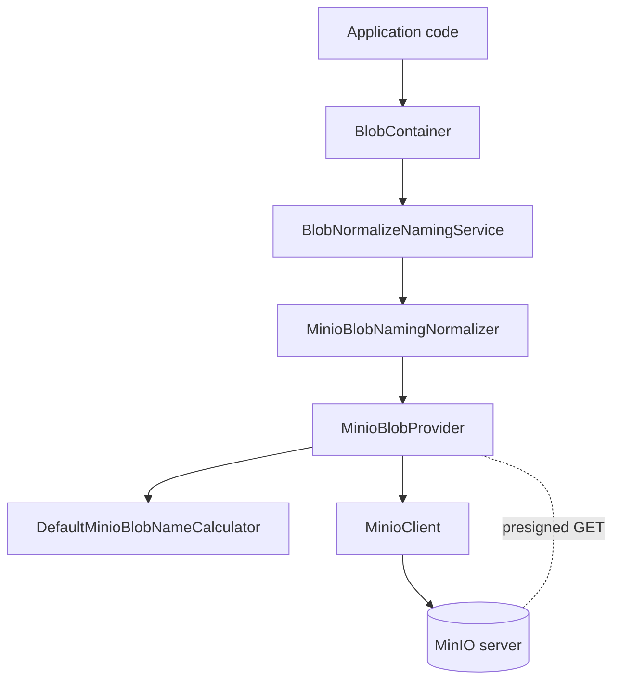

The `Volo.Abp.BlobStoring.Minio` package implements `IBlobProvider` against MinIO using the official `Minio` .NET client. MinIO is a self-hosted, S3-compatible object store — perfect for on-prem deployments, air-gapped clusters, or local development where you want S3 semantics without the AWS dependency. Source: `framework/src/Volo.Abp.BlobStoring.Minio/`.

## Package layout

```
framework/src/Volo.Abp.BlobStoring.Minio/
├── Microsoft/Extensions/DependencyInjection/
│   └── MinioHttpClientFactoryServiceCollectionExtensions.cs
└── Volo/Abp/BlobStoring/Minio/
    ├── AbpBlobStoringMinioModule.cs
    ├── DefaultMinioBlobNameCalculator.cs
    ├── IMinioBlobNameCalculator.cs
    ├── MinioBlobContainerConfigurationExtensions.cs
    ├── MinioBlobNamingNormalizer.cs
    ├── MinioBlobProvider.cs
    ├── MinioBlobProviderConfiguration.cs
    └── MinioBlobProviderConfigurationNames.cs
```

The `Microsoft.Extensions.DependencyInjection` extensions file is the only place in the BLOB stack that touches `IHttpClientFactory` directly — MinIO benefits from named `HttpClient` reuse because the official client otherwise constructs a new `HttpClient` per `MinioClient` instance.

## Module

`AbpBlobStoringMinioModule.cs` depends on `AbpBlobStoringModule`. Its `ConfigureServices` calls `services.AddMinioHttpClientFactory()` from `MinioHttpClientFactoryServiceCollectionExtensions.cs`, which registers an HTTP client for the MinIO SDK and is passed in when the client is constructed.

## MinioBlobProvider

`MinioBlobProvider.cs` implements `BlobProviderBase` and composes:

- `IMinioBlobNameCalculator` — produces the object key (with multi-tenant prefix).
- `IBlobNormalizeNamingService` — runs naming normalizers.
- `IHttpClientFactory` — injected through the `IHttpContextAccessor`-friendly factory so the SDK can share connections.

### SaveAsync

1. Compute the bucket name from `GetContainerName(args)` (falls back to `args.ContainerName` if `MinioBlobProviderConfiguration.BucketName` is not set).
2. Compute the object name with `MinioBlobNameCalculator.Calculate(args)`.
3. Construct a `MinioClient` via the SDK builder, configured with `EndPoint`, `AccessKey`, `SecretKey`, and `WithSSL`.
4. If `CreateBucketIfNotExists` is true, call `BucketExistsAsync` + `MakeBucketAsync`.
5. Check `args.OverrideExisting` against an existence check; throw `BlobAlreadyExistsException` if blocked.
6. Call `client.PutObjectAsync(new PutObjectArgs().WithBucket(bucket).WithObject(key).WithStreamData(args.BlobStream))`.

### Other operations

- `DeleteAsync` calls `client.RemoveObjectAsync` after an existence check.
- `ExistsAsync` calls `client.StatObjectAsync` and catches `ObjectNotFoundException`.
- `GetOrNullAsync` uses `client.GetObjectAsync` with a streaming callback that copies the data into a `MemoryStream`, then returns the stream.

The provider also exposes a `GeneratePresignedGetUrlAsync` helper (in `MinioBlobProvider.cs`) that produces a presigned GET URL valid for `MinioBlobProviderConfiguration.PresignedGetExpirySeconds` — useful for serving private blobs to browsers without proxying through the application.

## MinioBlobProviderConfiguration

The configuration class at `MinioBlobProviderConfiguration.cs`:

| Property | Purpose | Default |
|---|---|---|
| `BucketName` | Override the MinIO bucket name; defaults to the ABP container name. | `null` |
| `EndPoint` | URL, hostname, IPv4, or IPv6 of the MinIO server. | (required) |
| `AccessKey` | MinIO access key (analogous to S3 access key id). | (required) |
| `SecretKey` | MinIO secret key. | (required) |
| `WithSSL` | Whether the client should use HTTPS. | `false` |
| `CreateBucketIfNotExists` | Whether to create the bucket on first save. | `false` |
| `PresignedGetExpirySeconds` | Default TTL for presigned GET URLs. | `7 * 24 * 3600` (7 days) |

The constants the configuration writes to are in `MinioBlobProviderConfigurationNames.cs`, keyed by `Volo.Abp.BlobStoring.Minio.*`.

The setter for `AccessKey`, `SecretKey`, and `EndPoint` calls `Check.NotNullOrWhiteSpace`, so missing values fail fast at configuration time rather than producing opaque MinIO errors at the first save.

## Naming normalizer and calculator

`MinioBlobNamingNormalizer.cs` applies MinIO's naming rules, which match S3 closely: lowercase, digits, hyphens, dots; 3–63 chars; no consecutive dots or hyphens. The normalizer rejects names that cannot be made valid.

`DefaultMinioBlobNameCalculator.cs` implements `IMinioBlobNameCalculator` and prefixes object keys with `host/` or `tenants/{tenantId}/`. Override the calculator to flatten the layout when each tenant has its own MinIO bucket.

## Configuration extension

`MinioBlobContainerConfigurationExtensions.cs`:

```csharp
public static MinioBlobProviderConfiguration GetMinioConfiguration(this BlobContainerConfiguration containerConfiguration)
    => new MinioBlobProviderConfiguration(containerConfiguration);

public static BlobContainerConfiguration UseMinio(
    this BlobContainerConfiguration containerConfiguration,
    Action<MinioBlobProviderConfiguration> minioConfigureAction)
{
    containerConfiguration.ProviderType = typeof(MinioBlobProvider);
    containerConfiguration.NamingNormalizers.TryAdd<MinioBlobNamingNormalizer>();

    minioConfigureAction(new MinioBlobProviderConfiguration(containerConfiguration));

    return containerConfiguration;
}
```

The signature is identical to the other providers — set `ProviderType`, register the naming normalizer, run the user's lambda.

## Typical configuration

```csharp
[DependsOn(typeof(AbpBlobStoringMinioModule))]
public class MyAppModule : AbpModule
{
    public override void ConfigureServices(ServiceConfigurationContext context)
    {
        var cfg = context.Services.GetConfiguration();

        Configure<AbpBlobStoringOptions>(options =>
        {
            options.Containers.Configure<ReportContainer>(c =>
            {
                c.UseMinio(minio =>
                {
                    minio.EndPoint  = cfg["Storage:Minio:EndPoint"]!;
                    minio.AccessKey = cfg["Storage:Minio:AccessKey"]!;
                    minio.SecretKey = cfg["Storage:Minio:SecretKey"]!;
                    minio.WithSSL   = true;
                    minio.BucketName = "my-org-reports";
                    minio.CreateBucketIfNotExists = true;
                    minio.PresignedGetExpirySeconds = 60 * 60; // 1 hour
                });
            });
        });
    }
}
```

For local development with the official `minio/minio` Docker image:

```csharp
minio.EndPoint  = "localhost:9000";
minio.AccessKey = "minioadmin";
minio.SecretKey = "minioadmin";
minio.WithSSL   = false;
```

## Flow



## Operational notes

<AccordionGroup>
  <Accordion title="Presigned URLs" icon="link">
    `PresignedGetExpirySeconds` defaults to 7 days, which is also the MinIO server-side maximum unless reconfigured. For untrusted clients, reduce this to minutes and generate URLs per request.
  </Accordion>
  <Accordion title="HTTPS endpoints" icon="lock">
    When `WithSSL = true`, the endpoint should be specified without scheme (e.g. `minio.internal.example.com`, not `https://minio.internal.example.com`). The SDK adds the scheme based on the flag.
  </Accordion>
  <Accordion title="Bucket creation costs" icon="folder-plus">
    `CreateBucketIfNotExists = true` is safe for development and small deployments but causes a `BucketExistsAsync` round-trip on every save. For high-throughput workloads, pre-create buckets and leave the flag at `false`.
  </Accordion>
  <Accordion title="Connection reuse" icon="recycle">
    The `MinioHttpClientFactoryServiceCollectionExtensions` registration ensures the MinIO SDK reuses pooled connections. Without this, each `MinioClient` would create its own `HttpClient`, leading to socket exhaustion under load.
  </Accordion>
  <Accordion title="Compatibility with other S3-compatible services" icon="server">
    Although this provider is named MinIO, it works with any S3-compatible service the official MinIO client supports (Wasabi, Backblaze B2 via S3, Cloudflare R2). For services that require path-style URLs, use `MinioClient.Build()` directly in a subclassed provider.
  </Accordion>
</AccordionGroup>

## MinioHttpClientFactoryServiceCollectionExtensions

The HTTP-client extension at `framework/src/Volo.Abp.BlobStoring.Minio/Microsoft/Extensions/DependencyInjection/MinioHttpClientFactoryServiceCollectionExtensions.cs` registers a named HTTP client (typically `"minio"`) with `IHttpClientFactory`. Inside the provider, the `MinioClient` is constructed with `.WithHttpClient(httpClientFactory.CreateClient("minio"))` so the client reuses the factory-managed pool.

Without this registration, the MinIO SDK would call `new HttpClient()` inside `MinioClient.Build()` every time the provider was resolved, leaking sockets under load. The extension prevents that by deferring construction to the factory which pools and disposes the underlying handlers.

If you want to customize the `HttpClient` for MinIO (custom certificates, additional middleware), do it through `services.AddHttpClient("minio", c => ...).ConfigurePrimaryHttpMessageHandler(...)` after calling `AddMinioHttpClientFactory()`.

## Presigned URL helpers

The provider exposes presigned-GET URL generation via:

```csharp
public virtual async Task<string> GeneratePresignedGetUrlAsync(
    BlobProviderGetArgs args, int? expirySeconds = null)
{
    var configuration = args.Configuration.GetMinioConfiguration();
    var bucket = GetContainerName(args);
    var key = MinioBlobNameCalculator.Calculate(args);

    var client = await GetMinioClient(args);
    return await client.PresignedGetObjectAsync(
        new PresignedGetObjectArgs()
            .WithBucket(bucket)
            .WithObject(key)
            .WithExpiry(expirySeconds ?? configuration.PresignedGetExpirySeconds));
}
```

The MinIO presigned URL contract is identical to S3's: a temporary URL signed with the server's credentials that any HTTP client can use to fetch the object directly without going through your application. This is the most common way to serve private user uploads — your application generates the URL, your front-end loads the image straight from MinIO.

The TTL defaults to 7 days because that's the longest TTL the MinIO server allows by default. For short-lived URLs, pass a smaller `expirySeconds`.

## MinIO as a development drop-in

A common pattern is to run MinIO locally (Docker container with port 9000) and have the production environment use real AWS S3 — both backed by the same `IBlobContainer` abstraction. The trick is to configure each environment from `appsettings.json`:

```json
{
  "Storage": {
    "Provider": "Minio",
    "Minio": {
      "EndPoint": "localhost:9000",
      "AccessKey": "minioadmin",
      "SecretKey": "minioadmin",
      "WithSSL": false,
      "BucketName": "dev-bucket"
    },
    "Aws": {
      "AccessKeyId": "...",
      "SecretAccessKey": "...",
      "Region": "us-east-1",
      "ContainerName": "prod-bucket"
    }
  }
}
```

Then read `Storage:Provider` in `ConfigureServices` and branch:

```csharp
if (cfg["Storage:Provider"] == "Minio")
{
    options.Containers.ConfigureDefault(c => c.UseMinio(m => { ... }));
}
else
{
    options.Containers.ConfigureDefault(c => c.UseAws(a => { ... }));
}
```

No application code outside the configuration changes between environments.

## Bucket policies

MinIO supports bucket policies analogous to S3's. The provider doesn't set them on `MakeBucketAsync` — newly created buckets are private by default. If you want public-read access for static assets, run:

```csharp
await client.SetPolicyAsync(new SetPolicyArgs()
    .WithBucket(bucket)
    .WithPolicy(JsonSerializer.Serialize(new
    {
        Version = "2012-10-17",
        Statement = new[] {
            new { Effect = "Allow", Principal = new { AWS = "*" },
                  Action = "s3:GetObject", Resource = $"arn:aws:s3:::{bucket}/*" }
        }
    })));
```

Most ABP apps use presigned URLs for private serving rather than public buckets — see the presigned URL section above.

## TLS configuration

When `WithSSL = true` and you use a self-signed certificate (common in on-prem MinIO deployments), the .NET HTTP client will reject the connection unless you trust the certificate. Add the certificate to the system trust store, or override the named HTTP client's primary handler:

```csharp
services.AddHttpClient("minio").ConfigurePrimaryHttpMessageHandler(() =>
    new HttpClientHandler
    {
        ServerCertificateCustomValidationCallback = (msg, cert, chain, errors) =>
            cert!.Thumbprint == "<your-expected-thumbprint>"
    });
```

## Lifecycle in containers

Running MinIO under `docker-compose` typically pairs the storage volume with the ABP application:

```yaml
services:
  myapp:
    image: myapp:latest
    environment:
      Storage__Minio__EndPoint: minio:9000
      Storage__Minio__AccessKey: minioadmin
      Storage__Minio__SecretKey: minioadmin
      Storage__Minio__WithSSL: "false"
    depends_on:
      - minio

  minio:
    image: minio/minio:latest
    command: server /data --console-address ":9001"
    environment:
      MINIO_ROOT_USER: minioadmin
      MINIO_ROOT_PASSWORD: minioadmin
    volumes:
      - minio-data:/data
    ports:
      - "9000:9000"
      - "9001:9001"

volumes:
  minio-data:
```

The MinIO console at `http://localhost:9001` lets you inspect buckets and objects visually while developing. For production, switch `MINIO_ROOT_USER`/`MINIO_ROOT_PASSWORD` to secrets and add proper TLS.

## Cross references

- For the hosted Amazon equivalent, see [AWS S3](/blob/aws-s3).
- For the shared abstraction MinIO plugs into, see [BLOB Core](/blob/core).
- For an even simpler self-hosted setup (no daemon needed), see [File System](/blob/file-system).
