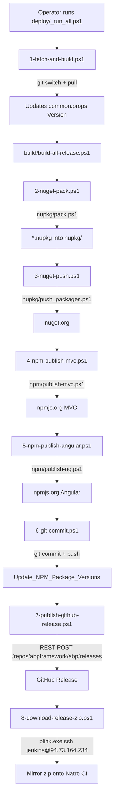

The ABP Framework ships a self-contained release pipeline alongside its source. Three top-level folders cooperate to take the multi-solution monorepo from a freshly pulled branch all the way to a tagged GitHub release with packages on `nuget.org` and `npmjs.org`. This page is the directory map that orients you before you read the deeper script-by-script pages.

## Top-Level Layout

The repository root at `/home/daytona/repos/abpframework/abp/` keeps build orchestration in three siblings — `build/`, `deploy/`, and `tools/` — plus a handful of MSBuild property files (`common.props`, `common.test.props`, `configureawait.props`, `Directory.Packages.props`) that are consumed by every `.csproj`. The release version literally lives in `common.props` as the `<Version>` element, which makes it the single source of truth that every script reads. The current value at the time of writing is `10.4.0-rc.2` with a matching `<LeptonXVersion>5.4.0-rc.2</LeptonXVersion>`.

<CardGroup cols={3}>
  <Card title="build/" icon="hammer">
    Developer-facing build and test scripts: `build-all.ps1`, `build-all-release.ps1`, `test-all.ps1`, and the shared `common.ps1` that enumerates the solution list.
  </Card>
  <Card title="deploy/" icon="rocket">
    Numbered release pipeline (`1-fetch-and-build.ps1` … `8-download-release-zip.ps1`) plus `_run_all.ps1`, `new-github-release-function.psm1`, and `plink.exe`.
  </Card>
  <Card title="tools/" icon="screwdriver-wrench">
    Out-of-band helpers: the `nuget/` folder with `nuget.exe`, the Go-based `github-changelog-generator/`, and the .NET console `localization-key-synchronizer/`.
  </Card>
</CardGroup>

A handful of single-file utilities also live at the repo root. `delete-bin-obj.ps1` recursively wipes every `bin/` and `obj/` directory outside `node_modules/` to reset a workspace. `NuGet.Config` pins the only feed used during the release (`https://api.nuget.org/v3/index.json`). `latest-versions.json` is a flat JSON array of the public release history that release tooling and the documentation site read to populate version dropdowns — the head entry being `{ "version": "10.3.0", "leptonx": { "version": "5.3.0" } }`.

## Directory Map

The full file layout for everything covered by this build section follows. Paths are repo-relative under `/home/daytona/repos/abpframework/abp/`.

```text
build/
├── build-all.ps1            # dev-mode build (Debug)
├── build-all-release.ps1    # full Release build, used by deploy/1
├── common.ps1               # solution list + dev/full toggle
└── test-all.ps1             # xUnit + XPlat coverage collector

deploy/
├── 1-fetch-and-build.ps1
├── 2-nuget-pack.ps1
├── 3-nuget-push.ps1
├── 4-npm-publish-mvc.ps1
├── 5-npm-publish-angular.ps1
├── 6-git-commit.ps1
├── 7-publish-github-release.ps1
├── 8-download-release-zip.ps1
├── _run_all.ps1                       # orchestrates 1..8
├── new-github-release-function.psm1   # 346-line release helper module
├── plink.exe                          # PuTTY SSH binary for step 8
└── readme.md                          # release runbook

tools/
├── nuget/
│   └── nuget.exe                      # classic nuget CLI
├── github-changelog-generator/
│   ├── README.md
│   ├── config.yaml                    # repo/milestone/groups config
│   ├── generator.exe                  # prebuilt Go binary
│   └── src/GithubChangelogGenerator/  # Go source (cobra + viper)
├── localization-key-synchronizer/
│   ├── LocalizationKeySynchronizer.exe
│   ├── LocalizationKeySynchronizer.slnx
│   ├── README.md
│   └── src/                           # .NET 10 console app
└── smtp-prober-email-sender.exe       # ad-hoc SMTP diagnostic exe

delete-bin-obj.ps1
NuGet.Config
latest-versions.json
common.props / common.test.props / configureawait.props
Directory.Packages.props
codecov.yml
```

## Release Pipeline at a Glance

The numbered scripts in `deploy/` are run in sequence, either manually one-by-one (the way the `deploy/readme.md` runbook describes) or via `deploy/_run_all.ps1`, which wraps a `Start-Transcript -Append _run_all_log.txt` around the entire flow and feeds the branch/version/RC prompts forward into each step.



The picture maps one-to-one onto the script filenames so it doubles as a navigation index. Every numbered step dot-sources `..\nupkg\common.ps1` — *not* `build\common.ps1` — to pick up the shared `Write-Info`, `Get-Current-Version` and `Get-Current-Branch` helpers, plus the master `$projects` list that drives `dotnet pack`.

### Two `common.ps1` Files

A subtle but important detail: the repo has *two* PowerShell files called `common.ps1`, and they do different jobs.

| Path | Used by | Responsibilities |
|---|---|---|
| `build/common.ps1` | `build/build-all.ps1`, `build/build-all-release.ps1`, `build/test-all.ps1` | Defines `$solutionPaths` — the list of solution *folders* fed to `dotnet build` and `dotnet test`. Knows about the `-f` flag. Prints the yellow "development mode" warning. |
| `nupkg/common.ps1` | `nupkg/pack.ps1`, `nupkg/push_packages.ps1`, `nupkg/unit_test.ps1`, and *every* script in `deploy/` | Defines `$solutions` and `$projects` — the list of project *folders* (~250 entries) fed to `dotnet pack` and `dotnet nuget push`. Exposes helper functions `Write-Info`, `Write-Error`, `Seperator`, `Read-File`, `Get-Current-Version`, `Get-Current-Branch`. |

That split mirrors a real distinction in the codebase: solutions are the unit of *building*, individual projects are the unit of *shipping*. The `build/` layer needs to know about the ~30 solutions, while the `deploy/` layer needs to know about the ~250 packages.

<Note>
  Steps 2-5 delegate the heavy lifting to siblings of `deploy/` that are not in the wiki scope: `nupkg/pack.ps1`, `nupkg/push_packages.ps1`, `npm/publish-mvc.ps1`, and `npm/publish-ng.ps1`. The deploy scripts are thin wrappers that handle prompts, secrets, and `cd` semantics.
</Note>

## Secrets and Inputs

`deploy/readme.md` instructs the release engineer to drop three plain-text files into `deploy/` before running anything. None of them are committed to GitHub.

<CardGroup cols={3}>
  <Card title="nuget-api-key.txt" icon="key">
    Read by `deploy/3-nuget-push.ps1` and forwarded to `nupkg/push_packages.ps1` as the `--api-key` argument for `dotnet nuget push`.
  </Card>
  <Card title="npm-auth-token.txt" icon="key">
    Read by both `deploy/4-npm-publish-mvc.ps1` and `deploy/5-npm-publish-angular.ps1`, then injected with `npm set //registry.npmjs.org/:_authToken`.
  </Card>
  <Card title="ssh-password.txt" icon="key">
    Read by `deploy/8-download-release-zip.ps1` and fed to `plink.exe -ssh jenkins@94.73.164.234 -pw $password` to mirror the release onto Natro.
  </Card>
</CardGroup>

The GitHub release step also reads `deploy/github-api-key.txt` through the `Read-File` helper defined in `nupkg/common.ps1`, and the `_run_all.ps1` entry point asks for the branch name (for example `rel-10.4`), the new version (defaulting to whatever `common.props` already holds), and whether the build is an RC/preview.

## Build Targets That Cross-Cut Everything

The MSBuild side of the build is configured by four shared property files at the repo root. Every package project imports them through `Directory.Build.props`, so changing a tag in one place propagates to ~250 projects.

| File | Role |
|---|---|
| `common.props` | Sets `<Version>`, `<LeptonXVersion>`, `<PackageProjectUrl>`, `<PackageLicenseExpression>` (LGPL-3.0-only), `<RepositoryUrl>`, `<PackageReadmeFile>`, and bundles `*.abppkg` content. |
| `common.test.props` | Adds the test runtime config knobs (`GenerateRuntimeConfigurationFiles=true`) and suppresses metadata attributes that conflict with xUnit. |
| `configureawait.props` | Conditionally pulls in `ConfigureAwait.Fody` + `Fody` *only* in Release configuration. |
| `Directory.Packages.props` | Central Package Management: `<ManagePackageVersionsCentrally>true</ManagePackageVersionsCentrally>` plus a single `<PackageVersion>` entry per third-party dependency. |

The `codecov.yml` in the root closes the loop with the CI: it pins coverage reports to the `dev` branch with a `1%` project threshold and `allow_coverage_offsets: true`, which is exactly what `build/test-all.ps1` is producing through `dotnet test --collect:"XPlat Code Coverage"`.

## Continuous Integration

`/.github/workflows/build-and-test.yml` is the GitHub Actions counterpart of the developer scripts. It runs on `push` to `dev` and on every PR targeting `dev` or `rel-*`, installs PowerShell on an `ubuntu-22.04` runner, sets up `dotnet-version: 10.0.x`, caches `~/.nuget/packages` against a key derived from `**/*.csproj` and `Directory.Packages.props`, then literally invokes:

```yaml
- name: Build All
  run: ./build-all.ps1
  working-directory: ./build
  shell: pwsh
- name: Test All
  run: ./test-all.ps1
  working-directory: ./build
  shell: pwsh
```

So the same `build/*.ps1` scripts a contributor uses on their laptop are the ones CI runs. The coverage XML is uploaded with `codecov/codecov-action@v5` using OIDC. A second workflow, `/.github/workflows/publish-release.yml`, is a `workflow_dispatch` trigger that takes `tag_name`, `prerelease`, and `branchName` inputs, checks out the branch with `actions/checkout@v2`, and calls `actions/create-release@v1` with `GITHUB_TOKEN: ${{ secrets.RELEASE_TOKEN }}` — a streamlined alternative to running `deploy/7-publish-github-release.ps1` locally.

## Property Files in More Detail

Every shipping `.csproj` in the repo is small — usually just a few `<PackageReference>` tags and one or two `<ProjectReference>` lines — because the shared logic lives in three files that get imported automatically by MSBuild. Knowing how those imports compose makes it possible to predict what a `dotnet build` will do without opening any project file.

`common.props` is the package-metadata file. It is what stamps the version, the icon URL (`https://abp.io/assets/abp_nupkg.png`), the LGPL-3.0-only license, the GitHub repository URL (`https://github.com/abpframework/abp/`), the readme file path, the symbol-packaging tweak that bundles `.pdb` files inside the main `.nupkg`, and the source link reference. It also handles the `*.abppkg` and `*.abppkg.analyze.json` files that ABP's runtime uses to discover modules — these are packed as `content\` so they end up inside every nuget package alongside the DLL.

`common.test.props` is a smaller sibling that test projects import on top of `common.props`. It enables `<GenerateRuntimeConfigurationFiles>true</GenerateRuntimeConfigurationFiles>` so xUnit assemblies become executable under `dotnet test`, and suppresses three auto-attributes (`GenerateAssemblyConfigurationAttribute`, `GenerateAssemblyCompanyAttribute`, `GenerateAssemblyProductAttribute`) that would otherwise collide when test assemblies are merged.

`configureawait.props` adds the `ConfigureAwait.Fody` weaver — but only when `$(Configuration) == 'Release'`. The condition means a developer running `dotnet build` (Debug) sees plain `await` semantics, while a release build run by `build/build-all-release.ps1` produces IL where every `await` has an implicit `.ConfigureAwait(false)`. That gap is intentional: it lets contributors set breakpoints inside `async` methods during development without weaver-rewritten stack traces, while still shipping the synchronization-context-free behaviour in production.

`Directory.Packages.props` sits at the top of all of these by enabling Central Package Management. Once `<ManagePackageVersionsCentrally>true</ManagePackageVersionsCentrally>` is set, any `<PackageReference>` in any project that carries a `Version` attribute becomes a build error. That sounds restrictive, but it removes the "which version of Newtonsoft.Json are we using *this week*" question from the entire codebase.

## What's *Not* in `build/`

The `build/` folder is deliberately small — four scripts plus the dot-sourced common file. A surprising amount of release-related logic actually lives in *neighbour* folders:

- The list of `.nupkg` projects, the pack loop, and the push loop are all in `nupkg/` (`nupkg/common.ps1`, `nupkg/pack.ps1`, `nupkg/push_packages.ps1`).
- The Angular and MVC NPM publish loops are in `npm/` (`npm/publish-ng.ps1`, `npm/publish-mvc.ps1`, plus `npm/lerna.json` for the workspace).
- The release zip mirror lives at the *remote* Natro server in `c:\ci\scripts\download-latest-abp-release.ps1`, which `deploy/8-download-release-zip.ps1` invokes over SSH via `plink.exe`.

So when reading `build/build-all-release.ps1`, remember that "all" actually means "all the solutions listed in `build/common.ps1`" — a release additionally exercises the `nupkg/` and `npm/` orchestration that builds *packages* from those solutions. The ABP release is genuinely multi-folder.

## Where to Go Next

<CardGroup cols={2}>
  <Card title="Build Scripts" icon="hammer" href="/build/build-scripts">
    The `build/*.ps1` scripts: dev vs full solution list, `dotnet build`, `dotnet test --collect XPlat Code Coverage`, and the `delete-bin-obj.ps1` reset helper.
  </Card>
  <Card title="Deploy Scripts" icon="rocket" href="/build/deploy-scripts">
    Every numbered script in `deploy/`, what prompts it asks for, what secret files it expects, and how `_run_all.ps1` glues them together.
  </Card>
  <Card title="NuGet Tools" icon="cube" href="/build/nuget-tools">
    `tools/nuget/nuget.exe`, the `NuGet.Config` package source, the `nupkg/` output convention, and how `latest-versions.json` drives version selection.
  </Card>
  <Card title="Localization Sync" icon="language" href="/build/localization-key-synchronizer">
    `tools/localization-key-synchronizer/`: the .NET 10 Spectre.Console app that finds missing/mismatched localization keys across module JSON files.
  </Card>
  <Card title="Changelog Generator" icon="file-lines" href="/build/changelog-generator">
    `tools/github-changelog-generator/`: a Go + cobra + viper CLI that turns a GitHub milestone (or tag range) into grouped Markdown.
  </Card>
</CardGroup>

## Conventions That Show Up Repeatedly

Three patterns reappear throughout the build folder, so spotting them once saves time later. First, almost every PowerShell script begins with `param(...)` followed by a `Read-Host` fallback, which means each script can be run interactively *or* automated from `_run_all.ps1`. Second, every script ends with `cd ..\deploy #always return to the deploy directory` to keep the working directory stable for the next step in the chain. Third, secrets are loaded from a fixed filename in `deploy/`, falling back to `Read-Host` only if the file is missing — this is what makes the same script work on a developer workstation and on a CI runner.

## What Each Folder Owns

A useful mental model is to think of the three top-level folders as having distinct *temporal* roles:

| Folder | When it runs | Inputs | Outputs |
|---|---|---|---|
| `build/` | On every PR + on every release | The solution roster in `build/common.ps1`; the version in `common.props`; the centrally-pinned packages in `Directory.Packages.props` | `bin/*` and `obj/*` directories per project; `TestResults/*/coverage.cobertura.xml` files |
| `deploy/` | Only on release | Secret files in `deploy/`; the branch and version typed at the `Read-Host` prompts; outputs from `build/` | `*.nupkg` on nuget.org; `@abp/*` on npmjs.org; a tagged GitHub Release; a mirrored zip on Natro |
| `tools/` | Out of band, by hand | Operator-supplied (a GitHub token; a culture JSON file; a `*.nupkg` to inspect) | Standalone Markdown, JSON, or console output |

The first two flow together. The third is independent: the changelog generator runs only *after* the GitHub release exists, and the localization synchronizer runs whenever a module maintainer notices drift.

## Helper Files Worth Knowing About

A handful of files don't fit cleanly into any of the three folders but are essential to the pipeline:

<CardGroup cols={2}>
  <Card title="delete-bin-obj.ps1" icon="trash">
    Repo-root script that recursively wipes every `bin/` and `obj/` folder outside `node_modules/`. The usual cure for `obj/project.assets.json` confusion after a branch switch.
  </Card>
  <Card title="latest-versions.json" icon="list-ol">
    Hand-maintained array of `{ "version", "leptonx": { "version" } }` records, newest first. Drives the version dropdown on `abp.io` and the ABP CLI's update detection.
  </Card>
  <Card title="codecov.yml" icon="gauge">
    Pins coverage status to `branch: dev` with a `1%` project threshold and `allow_coverage_offsets: true`. The collector that produces coverage is `dotnet test --collect:"XPlat Code Coverage"` inside `build/test-all.ps1`.
  </Card>
  <Card title="NuGet.md" icon="file-lines">
    A short package-readme that `common.props` injects into every `.nupkg` via `<None Include="..\..\NuGet.md" Pack="true" PackagePath="\"/>`. Shows up under the Readme tab on nuget.org for every Volo.Abp.* package.
  </Card>
</CardGroup>

## Reading the Source vs the Docs

The release tooling is heavily run-by-hand: every script asks a question, prints a banner, then chains into the next one. The `deploy/readme.md` runbook describes the *intent* of each step, but the script bodies and this wiki describe the *current behaviour*. Where the two disagree — for example `deploy/readme.md` still labels step 6 as "new-github-release.ps1" while the actual file is `7-publish-github-release.ps1` — the code is the source of truth.

A few file-naming quirks reinforce this. `nupkg/common.ps1.bak` is checked in alongside `nupkg/common.ps1` because contributors occasionally need to diff `$projects` changes between releases without leaning on `git log`. `nupkg/0` is a single-byte placeholder that keeps the otherwise-`*.nupkg`-only folder visible in git status when there are no built packages. And `deploy/plink.exe` is committed precisely so a fresh Windows release machine can run step 8 with zero pre-installed software.

## Other GitHub Workflows

Besides `build-and-test.yml` and `publish-release.yml` mentioned above, `/.github/workflows/` contains several smaller scheduled and trigger-driven workflows that round out the automation story. `angular.yml` builds and tests the `npm/ng-packs/` workspace on PRs that touch Angular source. `auto-pr.yml` handles automatic PR forwarding. `codeql-analysis.yml` is the standard GitHub Advanced Security scan. `image-compression.yml` re-compresses images checked into docs. `labeler.yml` and `auto-add-seo.yml` apply labels and SEO metadata to PRs. `nuget-packages-version-change-detector.yml` watches `Directory.Packages.props` for upstream version bumps and opens PRs when a tracked dependency releases a new version. `stale.yml` and `lock.yml` handle issue housekeeping. `update-studio-docs.yml` syncs documentation from the ABP Studio repo. `update-versions.yml` is the workflow that keeps `latest-versions.json` current after a release. `cancel-workflow.yml` cancels redundant in-flight workflow runs when a newer commit is pushed.

Most of these are out-of-scope for this build section, but they all interact with the same files described here — versions in `common.props`, packages in `Directory.Packages.props`, and the release catalog in `latest-versions.json`.

## A One-Screen Mental Model

If you take only one thing from this page, take this: the *whole* release pipeline pivots on two files in the repo root — `common.props` (for the version) and `latest-versions.json` (for the catalog). Every script in `build/` and `deploy/` either reads those two files, or modifies them, or produces an artefact whose identity is derived from them. Once you know that, the eight numbered scripts in `deploy/` stop feeling like an arbitrary sequence and start looking like a chain of small, single-purpose transforms with the version as the carrier.

## How to Reproduce a Release Locally

A useful exercise for a new contributor is to run the dev-mode equivalent of a release on a single solution. The full set of dependencies is the same set CI uses:

<Steps>
  <Step title="Install the .NET SDK pinned in global.json">
    The repository pins `dotnet-version: 10.0.x` (see `/.github/workflows/build-and-test.yml`). Install the matching SDK so `dotnet --version` agrees with what CI has.
  </Step>
  <Step title="Install PowerShell">
    The CI workflow does `sudo apt-get install -y powershell` on its `ubuntu-22.04` runner. Locally, install PowerShell 7+ (`pwsh`) for any OS, or use Windows PowerShell on Windows.
  </Step>
  <Step title="Restore once, then build">
    From the repo root: `cd build`, then `./build-all.ps1`. The first run will hydrate `~/.nuget/packages` from `Directory.Packages.props`, which takes 10-20 minutes depending on bandwidth.
  </Step>
  <Step title="Run the tests">
    Still in `build/`: `./test-all.ps1`. Coverage XML lands under each test project's `TestResults/<guid>/coverage.cobertura.xml`.
  </Step>
  <Step title="Optionally pack">
    From the repo root: `cd nupkg`, then `powershell -File pack.ps1`. Packages will pile up in `nupkg/*.nupkg` ready to be inspected (or pushed to a private feed for testing).
  </Step>
</Steps>

The skipped steps (`dotnet nuget push`, `npm publish`, `git push`, the GitHub release POST) are exactly the ones that require secrets — which is why they are gated behind separate scripts that look for files in `deploy/`.

## Glossary

A handful of repo-specific terms reappear in the script bodies and the deeper pages. They're collected here for reference.

| Term | What it means |
|---|---|
| **Solution** | A folder containing a `.sln` file. The framework, each module under `modules/*`, each template under `templates/*`, and the internal `source-code/` solution are all solutions. Enumerated by `build/common.ps1` as `$solutionPaths` and by `nupkg/common.ps1` as `$solutions`. |
| **Project** | A folder containing a `.csproj` file. The shipping projects are enumerated by `nupkg/common.ps1` as `$projects`, the master list of what becomes a `.nupkg`. |
| **Module** | A bounded-context bundle of projects under `modules/<name>/src/*`. Examples: `modules/identity`, `modules/cms-kit`, `modules/blob-storing-database`. |
| **Template** | A starter shape generated by `abp new`. Lives under `templates/<name>`. Built only during full (`-f`) builds. |
| **`*.abppkg`** | An ABP-specific marker file packed into every NuGet package as `content\*.abppkg`. Used by ABP's runtime to discover modules without scanning every assembly. |
| **Dev mode vs full** | Running `build-all.ps1` without `-f` is dev mode (15 base solutions). Running with `-f`, or running `build-all-release.ps1` (which hardcodes `-f`), is full mode (~25+ solutions including templates and `source-code`). |
| **RC / pre-release** | A release whose version ends in `-rc.N` or `-preview.N`. Tagged with `prerelease: true` on the GitHub release and skipped over by the default version-selection logic on `abp.io`. |
| **`nupkg/`** | Both an output folder (where `*.nupkg` files land after `dotnet pack`) and a script folder (where `pack.ps1` and `push_packages.ps1` live). The duality is historical and intentional. |
| **Natro** | The internal CI mirror server identified by IP `94.73.164.234`. Step 8 of the release pipeline copies the release zip onto Natro via `plink.exe` so the production website can serve it without depending on github.com being reachable. |

## Titles to Look For When Searching the Code

When grepping the repo for build-related logic, a handful of strings are reliable anchors:

- `Write-Info` — the green-on-black banner printer defined in `nupkg/common.ps1`. Every deploy step uses it to mark phase transitions.
- `Get-Current-Version` — also in `nupkg/common.ps1`; reads `<Version>` from `common.props`. Anywhere this function appears, the script is making a version-aware decision.
- `Set-Location` — every build/deploy loop uses this to enter a subfolder and `dotnet *` from there. If a script ends without `Set-Location $rootFolder` (or `cd ..\deploy`), it's a bug.
- `--no-build` — the marker that a script is running *after* a previous `dotnet build`. Indicates a chained pipeline.
- `--skip-duplicate` — only `dotnet nuget push` calls use this, and only intentionally. Indicates the script is designed to be re-runnable after a partial failure.

The next pages drill into each of these patterns inside the actual script bodies.
