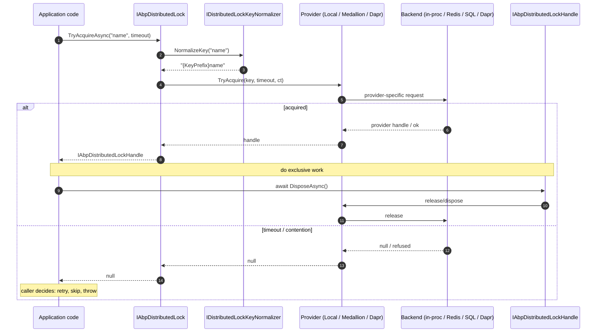

The ABP Framework provides a tiny, swappable distributed lock abstraction in `framework/src/Volo.Abp.DistributedLocking.Abstractions` and three providers:

- `Volo.Abp.DistributedLocking.Abstractions` ships the contract, the in-process default (`LocalAbpDistributedLock`), and a no-op (`NullAbpDistributedLock`).
- `Volo.Abp.DistributedLocking` plugs in `Medallion.Threading` so any `IDistributedLockProvider` (Redis, SQL Server, Azure, ZooKeeper, FileSystem) works.
- `Volo.Abp.DistributedLocking.Dapr` calls the Dapr distributed lock building block.

All three implement the same one-method interface, so application code never depends on a particular provider.

## The contract

`framework/src/Volo.Abp.DistributedLocking.Abstractions/Volo/Abp/DistributedLocking/IAbpDistributedLock.cs`:

```csharp
public interface IAbpDistributedLock
{
    /// <summary>
    /// Tries to acquire a named lock. Returns a disposable handle on success,
    /// or null if the lock could not be acquired within the timeout.
    /// </summary>
    Task<IAbpDistributedLockHandle?> TryAcquireAsync(
        [NotNull] string name,
        TimeSpan timeout = default,
        CancellationToken cancellationToken = default
    );
}
```

And the handle:

```csharp
// IAbpDistributedLockHandle.cs
public interface IAbpDistributedLockHandle : IAsyncDisposable { }
```

The canonical usage:

```csharp
await using (var handle = await _distributedLock.TryAcquireAsync("invoice-batch", TimeSpan.FromSeconds(5)))
{
    if (handle == null)
    {
        // Someone else holds the lock - back off
        return;
    }

    // Critical section
    await DoExclusiveWorkAsync();
}
```

A `null` handle means *did not acquire*. The lock is released by `DisposeAsync()` on the handle - never call any release method manually.

## Default registration

`Volo.Abp.DistributedLocking.Abstractions` registers `LocalAbpDistributedLock` as a singleton via `ISingletonDependency`. So if you reference *just* the abstractions package, you get an in-process implementation that coordinates threads within the current process only.

```csharp
// LocalAbpDistributedLock.cs
public class LocalAbpDistributedLock : IAbpDistributedLock, ISingletonDependency
{
    protected IDistributedLockKeyNormalizer DistributedLockKeyNormalizer { get; }

    public LocalAbpDistributedLock(IDistributedLockKeyNormalizer distributedLockKeyNormalizer)
    {
        DistributedLockKeyNormalizer = distributedLockKeyNormalizer;
    }

    public async Task<IAbpDistributedLockHandle?> TryAcquireAsync(
        string name,
        TimeSpan timeout = default,
        CancellationToken cancellationToken = default)
    {
        Check.NotNullOrWhiteSpace(name, nameof(name));
        var key = DistributedLockKeyNormalizer.NormalizeKey(name);
        var disposable = await KeyedLock.TryLockAsync(key, timeout, cancellationToken);
        if (disposable == null)
        {
            return null;
        }
        return new LocalAbpDistributedLockHandle(disposable);
    }
}
```

`KeyedLock.TryLockAsync` (in `Volo.Abp.Core/Volo/Abp/Threading/KeyedLock.cs`) keeps a static `ConcurrentDictionary<string, SemaphoreSlim>` and grants one semaphore slot per key.

The wrapping `LocalAbpDistributedLockHandle` simply disposes the inner `IDisposable`:

```csharp
public class LocalAbpDistributedLockHandle : IAbpDistributedLockHandle
{
    private readonly IDisposable _disposable;

    public LocalAbpDistributedLockHandle(IDisposable disposable) => _disposable = disposable;

    public ValueTask DisposeAsync()
    {
        _disposable.Dispose();
        return default;
    }
}
```

<Warning>
`LocalAbpDistributedLock` only coordinates threads in the **same process**. Two web nodes will both successfully acquire the same name. Use it only in single-instance deployments, tests, or as a deliberate fallback.
</Warning>

## Null lock for tests

`NullAbpDistributedLock` always succeeds and returns a handle that holds `NullDisposable.Instance`:

```csharp
public class NullAbpDistributedLock : IAbpDistributedLock
{
    public Task<IAbpDistributedLockHandle?> TryAcquireAsync(string name,
        TimeSpan timeout = default, CancellationToken cancellationToken = default)
    {
        return Task.FromResult<IAbpDistributedLockHandle?>(
            new LocalAbpDistributedLockHandle(NullDisposable.Instance));
    }
}
```

Register it in tests when you do not want to model contention:

```csharp
context.Services.Replace(ServiceDescriptor.Singleton<IAbpDistributedLock, NullAbpDistributedLock>());
```

## Key normalization and prefix

Every implementation runs the lock name through `IDistributedLockKeyNormalizer`:

```csharp
// IDistributedLockKeyNormalizer.cs
public interface IDistributedLockKeyNormalizer
{
    string NormalizeKey(string name);
}

// DistributedLockKeyNormalizer.cs
public class DistributedLockKeyNormalizer : IDistributedLockKeyNormalizer, ITransientDependency
{
    protected AbpDistributedLockOptions Options { get; }

    public DistributedLockKeyNormalizer(IOptions<AbpDistributedLockOptions> options)
        => Options = options.Value;

    public virtual string NormalizeKey(string name) => $"{Options.KeyPrefix}{name}";
}
```

`AbpDistributedLockOptions` exposes just one knob:

```csharp
public class AbpDistributedLockOptions
{
    public string KeyPrefix { get; set; } = "";
}
```

Configure it once per host when several apps share a backend:

```csharp
Configure<AbpDistributedLockOptions>(options =>
{
    options.KeyPrefix = "MyApp:";
});
```

So `TryAcquireAsync("invoice-batch")` actually tries to acquire `MyApp:invoice-batch`.

<Note>
Unlike `IDistributedCacheKeyNormalizer`, the lock normalizer **does not** prepend tenant id. If you want tenant-scoped locks, encode the tenant in the lock name yourself: `await _lock.TryAcquireAsync($"t:{tenantId}:invoice-batch")`.
</Note>

## Acquire / release flow



## Medallion provider - Volo.Abp.DistributedLocking

Installing `Volo.Abp.DistributedLocking` swaps the in-process default for `MedallionAbpDistributedLock`, which calls into the `Medallion.Threading` ecosystem.

Module:

```csharp
// AbpDistributedLockingModule.cs
[DependsOn(
    typeof(AbpDistributedLockingAbstractionsModule),
    typeof(AbpThreadingModule)
    )]
public class AbpDistributedLockingModule : AbpModule { }
```

Implementation:

```csharp
// MedallionAbpDistributedLock.cs
[Dependency(ReplaceServices = true)]
public class MedallionAbpDistributedLock : IAbpDistributedLock, ITransientDependency
{
    protected IDistributedLockProvider DistributedLockProvider { get; }
    protected ICancellationTokenProvider CancellationTokenProvider { get; }
    protected IDistributedLockKeyNormalizer DistributedLockKeyNormalizer { get; }

    public MedallionAbpDistributedLock(
        IDistributedLockProvider distributedLockProvider,
        ICancellationTokenProvider cancellationTokenProvider,
        IDistributedLockKeyNormalizer distributedLockKeyNormalizer)
    {
        DistributedLockProvider = distributedLockProvider;
        CancellationTokenProvider = cancellationTokenProvider;
        DistributedLockKeyNormalizer = distributedLockKeyNormalizer;
    }

    public async Task<IAbpDistributedLockHandle?> TryAcquireAsync(
        string name, TimeSpan timeout = default, CancellationToken cancellationToken = default)
    {
        Check.NotNullOrWhiteSpace(name, nameof(name));
        var key = DistributedLockKeyNormalizer.NormalizeKey(name);

        CancellationTokenProvider.FallbackToProvider(cancellationToken);

        var handle = await DistributedLockProvider.TryAcquireLockAsync(
            key, timeout, CancellationTokenProvider.FallbackToProvider(cancellationToken));

        if (handle == null) return null;
        return new MedallionAbpDistributedLockHandle(handle);
    }
}
```

`[Dependency(ReplaceServices = true)]` replaces the `LocalAbpDistributedLock` registration coming from the abstractions module. The handle just defers `DisposeAsync` to the Medallion handle:

```csharp
public class MedallionAbpDistributedLockHandle : IAbpDistributedLockHandle
{
    public IDistributedSynchronizationHandle Handle { get; }

    public MedallionAbpDistributedLockHandle(IDistributedSynchronizationHandle handle)
        => Handle = handle;

    public ValueTask DisposeAsync() => Handle.DisposeAsync();
}
```

The module **does not** register a concrete `IDistributedLockProvider` - that is up to the host. Pick one of the Medallion providers and add it in your module's `ConfigureServices`.

### Wiring an `IDistributedLockProvider`

Redis (using `DistributedLock.Redis`):

```csharp
context.Services.AddSingleton<IDistributedLockProvider>(sp =>
{
    var connection = ConnectionMultiplexer.Connect("redis-primary:6379,abortConnect=false");
    return new RedisDistributedSynchronizationProvider(connection.GetDatabase());
});
```

SQL Server (using `DistributedLock.SqlServer`):

```csharp
context.Services.AddSingleton<IDistributedLockProvider>(sp =>
    new SqlDistributedSynchronizationProvider("Server=...;Database=Locks;..."));
```

File system (cheap and good for single-host setups):

```csharp
context.Services.AddSingleton<IDistributedLockProvider>(sp =>
    new FileDistributedSynchronizationProvider(new DirectoryInfo("/var/lib/myapp/locks")));
```

After this `IAbpDistributedLock.TryAcquireAsync(...)` produces a real distributed lock.

### Escape hatch: getting the raw Medallion handle

If a caller needs Medallion-specific APIs (e.g. `IDistributedSynchronizationHandle.HandleLostToken`), use `AbpDistributedLockHandleExtensions`:

```csharp
public static class AbpDistributedLockHandleExtensions
{
    public static IDistributedSynchronizationHandle ToDistributedSynchronizationHandle(
        this IAbpDistributedLockHandle handle)
    {
        return handle.As<MedallionAbpDistributedLockHandle>().Handle;
    }
}
```

```csharp
await using var handle = await _lock.TryAcquireAsync("job");
if (handle == null) return;

var medallion = handle.ToDistributedSynchronizationHandle();
medallion.HandleLostToken.Register(() => _logger.LogWarning("Lost lock 'job'"));
```

The cast will throw if a different `IAbpDistributedLock` implementation is registered, so guard it accordingly.

## Dapr provider - Volo.Abp.DistributedLocking.Dapr

For Dapr-based deployments the package `Volo.Abp.DistributedLocking.Dapr` registers `DaprAbpDistributedLock` against the [Dapr distributed lock building block](https://docs.dapr.io/developing-applications/building-blocks/distributed-lock/).

Module:

```csharp
[DependsOn(
    typeof(AbpDistributedLockingAbstractionsModule),
    typeof(AbpDaprModule))]
public class AbpDistributedLockingDaprModule : AbpModule { }
```

Options:

```csharp
public class AbpDistributedLockDaprOptions
{
    public string StoreName { get; set; } = default!;
    public string? Owner { get; set; }
    public TimeSpan DefaultExpirationTimeout { get; set; }

    public AbpDistributedLockDaprOptions()
    {
        DefaultExpirationTimeout = TimeSpan.FromMinutes(2);
    }
}
```

| Property | Required | Notes |
| --- | --- | --- |
| `StoreName` | Yes | Name of the Dapr lock component (e.g. `redislock`). |
| `Owner` | No | Lock owner identifier. If null, a fresh `Guid.NewGuid()` is used **per acquire** - so locks effectively cannot be re-entered by the same logical owner. |
| `DefaultExpirationTimeout` | No | Server-side expiry that protects against orphaned locks. Defaults to 2 minutes. |

Implementation:

```csharp
[Dependency(ReplaceServices = true)]
public class DaprAbpDistributedLock : IAbpDistributedLock, ITransientDependency
{
    protected IAbpDaprClientFactory DaprClientFactory { get; }
    protected AbpDistributedLockDaprOptions DistributedLockDaprOptions { get; }
    protected IDistributedLockKeyNormalizer DistributedLockKeyNormalizer { get; }

    public async Task<IAbpDistributedLockHandle?> TryAcquireAsync(
        string name, TimeSpan timeout = default, CancellationToken cancellationToken = default)
    {
        name = DistributedLockKeyNormalizer.NormalizeKey(name);

        var daprClient = await DaprClientFactory.CreateAsync();
        var lockResponse = await daprClient.Lock(
            DistributedLockDaprOptions.StoreName,
            name,
            DistributedLockDaprOptions.Owner ?? Guid.NewGuid().ToString(),
            (int)DistributedLockDaprOptions.DefaultExpirationTimeout.TotalSeconds,
            cancellationToken);

        if (lockResponse == null || !lockResponse.Success) return null;
        return new DaprAbpDistributedLockHandle(lockResponse);
    }
}
```

And the handle:

```csharp
public class DaprAbpDistributedLockHandle : IAbpDistributedLockHandle
{
    protected TryLockResponse LockResponse { get; }

    public DaprAbpDistributedLockHandle(TryLockResponse lockResponse) => LockResponse = lockResponse;

    public async ValueTask DisposeAsync() => await LockResponse.DisposeAsync();
}
```

`TryLockResponse.DisposeAsync()` issues the Dapr `unlock` call.

### Wiring the Dapr provider

In your host module:

```csharp
[DependsOn(typeof(AbpDistributedLockingDaprModule))]
public class MyAppHostModule : AbpModule
{
    public override void ConfigureServices(ServiceConfigurationContext context)
    {
        Configure<AbpDistributedLockDaprOptions>(options =>
        {
            options.StoreName = "redislock";              // your Dapr component name
            options.Owner = Environment.MachineName;       // identify the holder
            options.DefaultExpirationTimeout = TimeSpan.FromSeconds(30);
        });
    }
}
```

<Warning>
The Dapr distributed lock API is still marked as Alpha in some Dapr versions. The implementation suppresses the `DAPR_DISTRIBUTEDLOCK` analyzer warning explicitly (`#pragma warning disable DAPR_DISTRIBUTEDLOCK`). Pin a Dapr component / SDK version known to support it before using this in production.
</Warning>

<Note>
The `timeout` argument passed to `IAbpDistributedLock.TryAcquireAsync` is **ignored** by `DaprAbpDistributedLock` - the Dapr lock API has no concept of an acquisition timeout. The `DefaultExpirationTimeout` option is for the *server-side TTL*, not for how long the caller is willing to wait. If you need wait-and-retry semantics, wrap `TryAcquireAsync` in your own retry loop.
</Note>

## Picking a provider

| Provider | Package | Where it stores state | Use when |
| --- | --- | --- | --- |
| `LocalAbpDistributedLock` | `Volo.Abp.DistributedLocking.Abstractions` (default) | In-process `KeyedLock` | Single-node deployment, tests. |
| `NullAbpDistributedLock` | `Volo.Abp.DistributedLocking.Abstractions` | Nowhere | Unit tests where you do not want contention. |
| `MedallionAbpDistributedLock` + `RedisDistributedSynchronizationProvider` | `Volo.Abp.DistributedLocking` + `DistributedLock.Redis` | Redis | You already run Redis and want the lowest-latency option. |
| `MedallionAbpDistributedLock` + `SqlDistributedSynchronizationProvider` | `Volo.Abp.DistributedLocking` + `DistributedLock.SqlServer` | SQL Server (`sp_getapplock`) | You do not run Redis but have SQL Server. |
| `MedallionAbpDistributedLock` + `FileDistributedSynchronizationProvider` | `Volo.Abp.DistributedLocking` + `DistributedLock.FileSystem` | File system | Single-host with multiple processes, or local dev. |
| `DaprAbpDistributedLock` | `Volo.Abp.DistributedLocking.Dapr` | Whatever the Dapr lock component is configured against | Dapr-based microservices. |

## Common patterns

### Try-once-and-skip

For background workers that should not pile up if one node is already processing:

```csharp
public async Task ProcessInvoicesAsync(CancellationToken ct)
{
    await using var handle = await _lock.TryAcquireAsync("invoices.batch", TimeSpan.Zero, ct);
    if (handle == null)
    {
        _logger.LogDebug("Another node holds the lock, skipping run.");
        return;
    }

    await _processor.RunAsync(ct);
}
```

`TimeSpan.Zero` means *do not wait*. If you cannot get the lock right now, give up.

### Wait-with-budget

For request-driven critical sections:

```csharp
public async Task<Result> CommitAsync(Guid orderId, CancellationToken ct)
{
    await using var handle = await _lock.TryAcquireAsync(
        $"order:{orderId}",
        timeout: TimeSpan.FromSeconds(5),
        cancellationToken: ct);

    if (handle == null) throw new BusinessException("Order.Locked");

    return await _service.CommitInternalAsync(orderId, ct);
}
```

### Tenant-scoped lock

Locks are not tenant-aware by default. Encode the tenant id yourself:

```csharp
var name = _currentTenant.Id.HasValue
    ? $"t:{_currentTenant.Id}:cleanup"
    : "host:cleanup";

await using var handle = await _lock.TryAcquireAsync(name);
```

### Detecting lock loss (Medallion only)

```csharp
await using var handle = await _lock.TryAcquireAsync("long-running");
if (handle == null) return;

var medallion = handle.ToDistributedSynchronizationHandle();
using var reg = medallion.HandleLostToken.Register(() =>
{
    _logger.LogWarning("Lost distributed lock - aborting work.");
    _cts.Cancel();
});

await DoLongWorkAsync(_cts.Token);
```

## Reference

### `Volo.Abp.DistributedLocking.Abstractions`

| File | Type | Purpose |
| --- | --- | --- |
| `Volo/Abp/DistributedLocking/AbpDistributedLockingAbstractionsModule.cs` | Module | Empty container, lets others depend on abstractions only. |
| `Volo/Abp/DistributedLocking/IAbpDistributedLock.cs` | Interface | `TryAcquireAsync(name, timeout, ct)` returning `IAbpDistributedLockHandle?`. |
| `Volo/Abp/DistributedLocking/IAbpDistributedLockHandle.cs` | Interface | Marker `IAsyncDisposable`. |
| `Volo/Abp/DistributedLocking/AbpDistributedLockOptions.cs` | Options | `KeyPrefix`. |
| `Volo/Abp/DistributedLocking/IDistributedLockKeyNormalizer.cs` | Interface | `NormalizeKey(name)`. |
| `Volo/Abp/DistributedLocking/DistributedLockKeyNormalizer.cs` | Default impl | Prepends `KeyPrefix`. |
| `Volo/Abp/DistributedLocking/LocalAbpDistributedLock.cs` | Default impl | Uses `KeyedLock` (`Volo.Abp.Core/Volo/Abp/Threading/KeyedLock.cs`). |
| `Volo/Abp/DistributedLocking/LocalAbpDistributedLockHandle.cs` | Default handle | Wraps an `IDisposable`. |
| `Volo/Abp/DistributedLocking/NullAbpDistributedLock.cs` | Test impl | Always succeeds with a `NullDisposable` handle. |

### `Volo.Abp.DistributedLocking`

| File | Type | Purpose |
| --- | --- | --- |
| `Volo/Abp/DistributedLocking/AbpDistributedLockingModule.cs` | Module | Depends on abstractions + `AbpThreadingModule`. |
| `Volo/Abp/DistributedLocking/MedallionAbpDistributedLock.cs` | Replacement | `[Dependency(ReplaceServices = true)]` over `LocalAbpDistributedLock`, delegates to `IDistributedLockProvider`. |
| `Volo/Abp/DistributedLocking/MedallionAbpDistributedLockHandle.cs` | Handle | Forwards `DisposeAsync` to Medallion handle. |
| `Volo/Abp/DistributedLocking/AbpDistributedLockHandleExtensions.cs` | Extensions | `ToDistributedSynchronizationHandle()` escape hatch. |

### `Volo.Abp.DistributedLocking.Dapr`

| File | Type | Purpose |
| --- | --- | --- |
| `Volo/Abp/DistributedLocking/Dapr/AbpDistributedLockingDaprModule.cs` | Module | Depends on abstractions + `AbpDaprModule`. |
| `Volo/Abp/DistributedLocking/Dapr/AbpDistributedLockDaprOptions.cs` | Options | `StoreName`, `Owner`, `DefaultExpirationTimeout`. |
| `Volo/Abp/DistributedLocking/Dapr/DaprAbpDistributedLock.cs` | Replacement | Uses `IAbpDaprClientFactory` + `DaprClient.Lock`. |
| `Volo/Abp/DistributedLocking/Dapr/DaprAbpDistributedLockHandle.cs` | Handle | Disposes `TryLockResponse` to unlock. |

Related pages:

<CardGroup cols={2}>
  <Card title="Caching Overview" icon="map" href="/caching/overview">
    Big-picture view of the caching + locking stack.
  </Card>
  <Card title="Caching Core" icon="layer-group" href="/caching/volo-abp-caching">
    The cache abstractions you typically pair with distributed locks.
  </Card>
</CardGroup>
