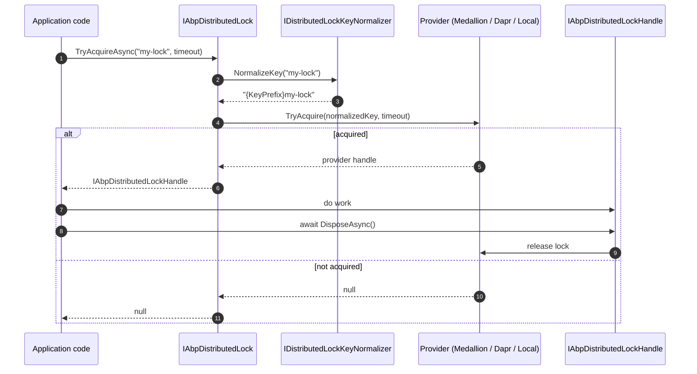

The ABP Framework caching and distributed locking stack lives under `framework/src/Volo.Abp.Caching*` and `framework/src/Volo.Abp.DistributedLocking*`. It layers strongly typed wrappers on top of `Microsoft.Extensions.Caching.Distributed.IDistributedCache` and `Microsoft.Extensions.Caching.Hybrid.HybridCache`, then adds tenant-aware key normalization, unit-of-work integration, multi-item APIs, and a `Medallion.Threading`-based distributed lock contract with in-process and Dapr providers.

This page is the map. Each row points to the dedicated page for that package.

## Package map

| Package | Purpose | Page |
| --- | --- | --- |
| `Volo.Abp.Caching` | Typed `IDistributedCache<TCacheItem>` / `<TCacheItem,TCacheKey>`, `AbpDistributedCacheOptions`, key normalizer, hybrid cache wrapper, UoW integration. | [Caching Core](/caching/volo-abp-caching) |
| `Volo.Abp.Caching.StackExchangeRedis` | Replaces the default in-memory `IDistributedCache` with a Redis-backed `AbpRedisCache` that also implements `ICacheSupportsMultipleItems`. | [Redis Cache](/caching/stackexchange-redis) |
| `Volo.Abp.DistributedLocking.Abstractions` | `IAbpDistributedLock`, `IAbpDistributedLockHandle`, `LocalAbpDistributedLock`, `NullAbpDistributedLock`, `IDistributedLockKeyNormalizer`, `AbpDistributedLockOptions`. | [Distributed Locking](/caching/distributed-locking) |
| `Volo.Abp.DistributedLocking` | Replaces the default `LocalAbpDistributedLock` with `MedallionAbpDistributedLock` backed by `Medallion.Threading.IDistributedLockProvider`. | [Distributed Locking](/caching/distributed-locking) |
| `Volo.Abp.DistributedLocking.Dapr` | Replaces `IAbpDistributedLock` with `DaprAbpDistributedLock` that calls the Dapr distributed lock building block. | [Distributed Locking](/caching/distributed-locking) |

<Info>
The ABP Framework caching abstractions ride on top of `Microsoft.Extensions.Caching.Distributed.IDistributedCache`. Any backend that registers an `IDistributedCache` implementation (memory, Redis, SQL Server, custom) automatically participates - `Volo.Abp.Caching.StackExchangeRedis` is just the canonical production choice.
</Info>

## How the pieces connect

```mermaid
flowchart TB
    subgraph App[Application Code]
        Svc[Application Service / Domain Service]
    end

    subgraph Typed[Typed Cache Layer: Volo.Abp.Caching]
        IDC["IDistributedCache&lt;TCacheItem&gt;"]
        IDC2["IDistributedCache&lt;TCacheItem, TCacheKey&gt;"]
        HCache["IHybridCache&lt;TCacheItem&gt;"]
        Norm[IDistributedCacheKeyNormalizer]
        Opts[AbpDistributedCacheOptions]
        Ser[IDistributedCacheSerializer]
    end

    subgraph MS[Microsoft.Extensions.Caching]
        MSIDC[IDistributedCache]
        MSHC[HybridCache]
    end

    subgraph Providers[Cache providers]
        Mem[MemoryDistributedCache - default]
        Redis[AbpRedisCache - StackExchangeRedis]
    end

    subgraph Locks[Distributed Locking]
        IL[IAbpDistributedLock]
        LL[LocalAbpDistributedLock]
        ML[MedallionAbpDistributedLock]
        DL[DaprAbpDistributedLock]
        LKey[IDistributedLockKeyNormalizer]
    end

    Svc --> IDC
    Svc --> HCache
    Svc --> IL

    IDC --> IDC2
    IDC2 --> MSIDC
    IDC2 --> Norm
    IDC2 --> Ser
    IDC2 --> Opts
    HCache --> MSHC
    HCache --> Norm

    MSIDC --> Mem
    MSIDC --> Redis
    MSHC --> Redis
    MSHC --> Mem

    IL -.singleton default.-> LL
    IL -.Volo.Abp.DistributedLocking replaces.-> ML
    IL -.Volo.Abp.DistributedLocking.Dapr replaces.-> DL
    LL --> LKey
    ML --> LKey
    DL --> LKey
```

The arrows labelled "replaces" use `[Dependency(ReplaceServices = true)]` so installing the Medallion or Dapr module is enough to swap the implementation - no further wiring required.

## Read path through the typed cache

The next diagram shows the inner machinery of a single `GetOrAddAsync<TCacheItem>` call. Each numbered step maps to code in `framework/src/Volo.Abp.Caching/Volo/Abp/Caching/DistributedCache.cs`.

```mermaid
sequenceDiagram
    autonumber
    participant Caller as Application code
    participant Wrap as DistributedCache&lt;TItem&gt;
    participant Inner as DistributedCache&lt;TItem,string&gt;
    participant UoW as IUnitOfWorkManager
    participant Norm as IDistributedCacheKeyNormalizer
    participant Tenant as ICurrentTenant
    participant Ser as IDistributedCacheSerializer
    participant Backend as IDistributedCache (memory or Redis)

    Caller->>Wrap: GetOrAddAsync(key, factory)
    Wrap->>Inner: forward call
    Inner->>UoW: ShouldConsiderUow?
    alt In a UoW and considerUow=true
        Inner->>UoW: read UnitOfWorkCacheItem
    end
    Inner->>Norm: NormalizeKey(key, cacheName, ignoreTenancy)
    Norm->>Tenant: CurrentTenant.Id
    Norm-->>Inner: "t:{tenantId},c:{cacheName},k:{prefix}{key}"
    Inner->>Backend: Get(normalizedKey)
    alt cache hit
        Backend-->>Inner: byte[]
        Inner->>Ser: Deserialize&lt;TItem&gt;(bytes)
        Inner-->>Caller: TItem
    else cache miss
        Inner->>Caller: invoke factory()
        Caller-->>Inner: TItem
        Inner->>Ser: Serialize(item)
        Inner->>Backend: Set(normalizedKey, bytes, options)
        Inner-->>Caller: TItem
    end
```

`DistributedCache<TCacheItem>` is the convenience wrapper that fixes `TCacheKey = string` and delegates to `DistributedCache<TCacheItem, string>`, the class that actually owns serialization, normalization, UoW integration, and error suppression.

## Lock path



Every implementation returns an `IAbpDistributedLockHandle` (which is just `IAsyncDisposable`). Disposing it releases the lock - the canonical usage is `await using var handle = await lock.TryAcquireAsync("name");`.

## Package interactions

<CardGroup cols={2}>
  <Card title="Caching Core" icon="layer-group" href="/caching/volo-abp-caching">
    Typed `IDistributedCache<TCacheItem>` / `IHybridCache<TCacheItem>`, tenant-aware key normalization, unit-of-work scoped entries, multi-item APIs, `CacheNameAttribute`, `IgnoreMultiTenancyAttribute`.
  </Card>
  <Card title="Redis Cache" icon="database" href="/caching/stackexchange-redis">
    `AbpRedisCache` extends `Microsoft.Extensions.Caching.StackExchangeRedis.RedisCache` with `ICacheSupportsMultipleItems` for batched `GetMany` / `SetMany` / `RefreshMany` / `RemoveMany`.
  </Card>
  <Card title="Local & Medallion Locks" icon="lock" href="/caching/distributed-locking">
    Default `LocalAbpDistributedLock` uses an in-process `KeyedLock`; installing `Volo.Abp.DistributedLocking` swaps in `MedallionAbpDistributedLock` so any `Medallion.Threading` provider (Redis, SQL, Azure, ZooKeeper, FileSystem) works.
  </Card>
  <Card title="Dapr Locks" icon="cloud" href="/caching/distributed-locking">
    `Volo.Abp.DistributedLocking.Dapr` registers `DaprAbpDistributedLock` which calls `DaprClient.Lock(...)` against any Dapr lock component. `AbpDistributedLockDaprOptions.StoreName` selects the component.
  </Card>
</CardGroup>

## When to pick what

<AccordionGroup>
  <Accordion title="Single-process app, dev environment">
    Use only `Volo.Abp.Caching` (already pulled in by most modules). The default `IDistributedCache` is `MemoryDistributedCache` and the default `IAbpDistributedLock` is `LocalAbpDistributedLock`. Both are good enough for tests and single-node deployments. `AbpCachingModule` also flips `AbpDistributedCacheOptions.HideErrors = false` in `Development` so cache bugs surface instead of being swallowed.
  </Accordion>
  <Accordion title="Multi-node web app">
    Add `Volo.Abp.Caching.StackExchangeRedis` and `Volo.Abp.DistributedLocking` plus a Medallion provider (`DistributedLock.Redis`, `DistributedLock.SqlServer`, etc.). Each module replaces the in-memory default through DI - no consumer code changes.
  </Accordion>
  <Accordion title="Dapr-based microservices">
    Use `Volo.Abp.DistributedLocking.Dapr` and configure `AbpDistributedLockDaprOptions.StoreName` to point at a Dapr lock component. For caching you can either keep Redis directly or sit behind a Dapr state store.
  </Accordion>
  <Accordion title="Tests that need no real lock">
    Register `NullAbpDistributedLock` (in `Volo.Abp.DistributedLocking.Abstractions`) - it returns a handle that wraps `NullDisposable.Instance`, so `TryAcquireAsync` always succeeds without coordinating with anything.
  </Accordion>
</AccordionGroup>

## Source layout

```text
framework/src/
├── Volo.Abp.Caching/
│   └── Volo/Abp/Caching/
│       ├── AbpCachingModule.cs
│       ├── AbpDistributedCacheOptions.cs
│       ├── CacheNameAttribute.cs
│       ├── DistributedCache.cs
│       ├── DistributedCacheKeyNormalizeArgs.cs
│       ├── DistributedCacheKeyNormalizer.cs
│       ├── ICacheSupportsMultipleItems.cs
│       ├── IDistributedCache.cs
│       ├── IDistributedCacheKeyNormalizer.cs
│       ├── IDistributedCacheSerializer.cs
│       ├── UnitOfWorkCacheItem.cs
│       ├── Utf8JsonDistributedCacheSerializer.cs
│       └── Hybrid/
│           ├── AbpHybridCache.cs
│           ├── AbpHybridCacheJsonSerializer.cs
│           ├── AbpHybridCacheJsonSerializerFactory.cs
│           ├── AbpHybridCacheOptions.cs
│           └── IHybridCache.cs
├── Volo.Abp.Caching.StackExchangeRedis/
│   └── Volo/Abp/Caching/StackExchangeRedis/
│       ├── AbpCachingStackExchangeRedisModule.cs
│       ├── AbpRedisCache.cs
│       └── AbpRedisExtensions.cs
├── Volo.Abp.DistributedLocking.Abstractions/
│   └── Volo/Abp/DistributedLocking/
│       ├── AbpDistributedLockingAbstractionsModule.cs
│       ├── AbpDistributedLockOptions.cs
│       ├── DistributedLockKeyNormalizer.cs
│       ├── IAbpDistributedLock.cs
│       ├── IAbpDistributedLockHandle.cs
│       ├── IDistributedLockKeyNormalizer.cs
│       ├── LocalAbpDistributedLock.cs
│       ├── LocalAbpDistributedLockHandle.cs
│       └── NullAbpDistributedLock.cs
├── Volo.Abp.DistributedLocking/
│   └── Volo/Abp/DistributedLocking/
│       ├── AbpDistributedLockHandleExtensions.cs
│       ├── AbpDistributedLockingModule.cs
│       ├── MedallionAbpDistributedLock.cs
│       └── MedallionAbpDistributedLockHandle.cs
└── Volo.Abp.DistributedLocking.Dapr/
    └── Volo/Abp/DistributedLocking/Dapr/
        ├── AbpDistributedLockDaprOptions.cs
        ├── AbpDistributedLockingDaprModule.cs
        ├── DaprAbpDistributedLock.cs
        └── DaprAbpDistributedLockHandle.cs
```

<Tip>
Hot tip when reading the codebase: every cache call inside ABP modules - permission grant cache, feature/setting providers, dynamic claims, OpenIddict token cache, BLOB metadata cache - goes through `IDistributedCache<TCacheItem>`. Grep for `IDistributedCache<` to find every cache item type in the framework.
</Tip>

## Cross references

The caching and locking modules are pulled in transitively by many other parts of the framework. The most common consumers:

- **`Volo.Abp.PermissionManagement`** caches granted permissions keyed by user/role using `IDistributedCache<PermissionGrantCacheItem>`.
- **`Volo.Abp.FeatureManagement`** and **`Volo.Abp.SettingManagement`** cache resolved values per provider.
- **`Volo.Abp.OpenIddict`** caches application / scope lookups.
- **`Volo.Abp.BackgroundJobs`** uses `IAbpDistributedLock` to serialise job pickup across workers.
- **`Volo.Abp.EventBus.Distributed`** uses `IAbpDistributedLock` for inbox/outbox processing.

Read the per-package pages next:

<CardGroup cols={2}>
  <Card title="Volo.Abp.Caching" href="/caching/volo-abp-caching">
    Cache item types, key normalization, UoW integration, hybrid cache.
  </Card>
  <Card title="Volo.Abp.Caching.StackExchangeRedis" href="/caching/stackexchange-redis">
    Redis wiring, configuration keys, `ICacheSupportsMultipleItems`.
  </Card>
  <Card title="Volo.Abp.DistributedLocking" href="/caching/distributed-locking">
    Lock abstractions, Medallion integration, Dapr provider.
  </Card>
  <Card title="Source tree" href="https://github.com/abpframework/abp/tree/dev/framework/src">
    Open the packages on GitHub.
  </Card>
</CardGroup>
