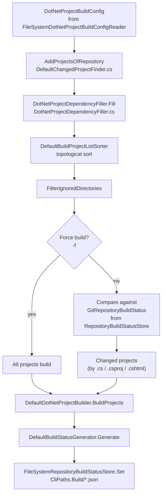
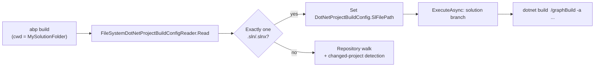

# `abp build` — Building a repository or solution

`abp build` is the command ABP Framework uses to keep large multi-repository codebases compiling efficiently. Given either an `*.sln`/`*.slnx` file or a configured `abp-build-config.json`, it discovers the projects across the current repository and any *depending* repositories, figures out which ones have changed since the last successful build (using `LibGit2Sharp`), sorts them topologically, and shells out to `dotnet build` for each changed project — or to `dotnet build <sln> /graphBuild` when a single solution file is detected.

The command itself, `BuildCommand`, lives in `framework/src/Volo.Abp.Cli.Core/Volo/Abp/Cli/Commands/BuildCommand.cs` and is intentionally thin: it parses options, reads a `DotNetProjectBuildConfig`, and delegates to the `Build/` feature folder.

## Class structure

```csharp
// framework/src/Volo.Abp.Cli.Core/Volo/Abp/Cli/Commands/BuildCommand.cs
public class BuildCommand : IConsoleCommand, ITransientDependency
{
    public const string Name = "build";

    public IDotNetProjectDependencyFiller DotNetProjectDependencyFiller { get; set; }
    public IChangedProjectFinder ChangedProjectFinder { get; set; }
    public IDotNetProjectBuilder DotNetProjectBuilder { get; set; }
    public IRepositoryBuildStatusStore RepositoryBuildStatusStore { get; set; }
    public IDotNetProjectBuildConfigReader DotNetProjectBuildConfigReader { get; set; }
    public IBuildStatusGenerator BuildStatusGenerator { get; set; }
    public IBuildProjectListSorter BuildProjectListSorter { get; set; }
    // ...
}
```

Every collaborator is a public property — `BuildCommand` uses property injection so that callers can swap a single piece (for example, a stub `IRepositoryBuildStatusStore` in tests) without re-wiring the constructor. The interfaces all live under `framework/src/Volo.Abp.Cli.Core/Volo/Abp/Cli/Build/`.

| Property | Default implementation | Source file |
| --- | --- | --- |
| `DotNetProjectDependencyFiller` | `DotNetProjectDependencyFiller` | `framework/src/Volo.Abp.Cli.Core/Volo/Abp/Cli/Build/DotNetProjectDependencyFiller.cs` |
| `ChangedProjectFinder` | `DefaultChangedProjectFinder` | `framework/src/Volo.Abp.Cli.Core/Volo/Abp/Cli/Build/DefaultChangedProjectFinder.cs` |
| `DotNetProjectBuilder` | `DefaultDotNetProjectBuilder` | `framework/src/Volo.Abp.Cli.Core/Volo/Abp/Cli/Build/DefaultDotNetProjectBuilder.cs` |
| `RepositoryBuildStatusStore` | `FileSystemRepositoryBuildStatusStore` | `framework/src/Volo.Abp.Cli.Core/Volo/Abp/Cli/Build/FileSystemRepositoryBuildStatusStore.cs` |
| `DotNetProjectBuildConfigReader` | `FileSystemDotNetProjectBuildConfigReader` | `framework/src/Volo.Abp.Cli.Core/Volo/Abp/Cli/Build/FileSystemDotNetProjectBuildConfigReader.cs` |
| `BuildStatusGenerator` | `DefaultBuildStatusGenerator` | `framework/src/Volo.Abp.Cli.Core/Volo/Abp/Cli/Build/DefaultBuildStatusGenerator.cs` |
| `BuildProjectListSorter` | `DefaultBuildProjectListSorter` | `framework/src/Volo.Abp.Cli.Core/Volo/Abp/Cli/Build/DefaultBuildProjectListSorter.cs` |

## `ExecuteAsync` — orchestration

The body of `ExecuteAsync` reads four options, builds a `DotNetProjectBuildConfig`, and picks between solution-wide and project-graph paths. The full method from `framework/src/Volo.Abp.Cli.Core/Volo/Abp/Cli/Commands/BuildCommand.cs`:

```csharp
public Task ExecuteAsync(CommandLineArgs commandLineArgs)
{
    var sw = new Stopwatch();
    sw.Start();

    var workingDirectory = commandLineArgs.Options.GetOrNull(
        Options.WorkingDirectory.Short, Options.WorkingDirectory.Long);   // -wd

    var dotnetBuildArguments = commandLineArgs.Options.GetOrNull(
        Options.DotnetBuildArguments.Short, Options.DotnetBuildArguments.Long); // -a

    var buildName = commandLineArgs.Options.GetOrNull(
        Options.BuildName.Short, Options.BuildName.Long);                 // -n

    var forceBuild = commandLineArgs.Options.ContainsKey(Options.ForceBuild.Short)
                  || commandLineArgs.Options.ContainsKey(Options.ForceBuild.Long); // -f

    var buildConfig = DotNetProjectBuildConfigReader.Read(workingDirectory ?? Directory.GetCurrentDirectory());
    buildConfig.BuildName = buildName;
    buildConfig.ForceBuild = forceBuild;

    if (string.IsNullOrEmpty(buildConfig.SlFilePath))
    {
        var changedProjectFiles = ChangedProjectFinder.FindByRepository(buildConfig);

        var buildSucceededProjects = DotNetProjectBuilder.BuildProjects(
            changedProjectFiles, dotnetBuildArguments ?? "");

        var buildStatus = BuildStatusGenerator.Generate(
            buildConfig, changedProjectFiles, buildSucceededProjects);

        RepositoryBuildStatusStore.Set(buildName, buildConfig.GitRepository, buildStatus);
    }
    else
    {
        DotNetProjectBuilder.BuildSolution(buildConfig.SlFilePath, dotnetBuildArguments ?? "");
    }

    sw.Stop();
    Console.WriteLine("Build operation is completed in " + sw.ElapsedMilliseconds + " (ms)");
    return Task.CompletedTask;
}
```

Two branches:

- **`SlFilePath` is set** → `BuildSolution` runs `dotnet build <sln> /graphBuild`. Used when the working directory contains a single `.sln`/`.slnx` and no `abp-build-config.json` overrides it.
- **`SlFilePath` is empty** → the repository walk runs. `ChangedProjectFinder` returns the changed project list; `BuildProjects` shells out per project; `BuildStatusGenerator` summarises the run; `RepositoryBuildStatusStore` persists the summary to disk so the next invocation can short-circuit unchanged projects.

## `DotNetProjectBuildConfig` — the input schema

`DotNetProjectBuildConfig` (`framework/src/Volo.Abp.Cli.Core/Volo/Abp/Cli/Build/DotNetProjectBuildConfig.cs`) is the smallest type in the build feature:

```csharp
public class DotNetProjectBuildConfig
{
    public string BuildName { get; set; }
    public string SlFilePath { get; set; }
    public GitRepository GitRepository { get; set; }
    public bool ForceBuild { get; set; }
}
```

Two distinct shapes feed it, both implemented by `FileSystemDotNetProjectBuildConfigReader`:

1. **Single-solution mode.** When `Directory.GetFiles(directoryPath, "*.sln" + "*.slnx", TopDirectoryOnly).Count == 1`, `SlFilePath` is set to that file and `GitRepository` is read from the closest `abp-build-config.json` (searched up the directory tree) — or constructed by walking up to the `.git` folder and reading branch/repo data via `LibGit2Sharp`.
2. **Multi-repository mode.** When the working directory itself contains an `abp-build-config.json`, the JSON is deserialised straight into a `GitRepository` graph. `SlFilePath` stays empty so `ExecuteAsync` falls through to the repository walk.

A `GitRepository` (`framework/src/Volo.Abp.Cli.Core/Volo/Abp/Cli/Build/GitRepository.cs`) records `Name`, `BranchName`, `RootPath`, `DependingRepositories` (other repos that this one consumes), and `IgnoredDirectories`:

```csharp
public class GitRepository
{
    public string Name { get; set; }
    public string BranchName { get; set; }
    public string RootPath { get; set; }
    public List<GitRepository> DependingRepositories { get; set; }
    public List<string> IgnoredDirectories { get; set; }
    // ...
}
```

That recursive shape is what lets `abp build` traverse, say, the ABP framework repo plus a downstream commercial repo in one shot — each `DependingRepositories[i]` carries its own root path and its own ignore list.

## Project graph and changed-project detection

`DefaultChangedProjectFinder` is the heart of the multi-repository branch (`framework/src/Volo.Abp.Cli.Core/Volo/Abp/Cli/Build/DefaultChangedProjectFinder.cs`). It does four things in order:

1. **Collect all projects.** `FindAllProjects` walks `buildConfig.GitRepository` and every depending repository's `RootPath`, scoops up all `*.csproj` files, and wraps them in `DotNetProjectInfo` records.
2. **Resolve dependencies.** `_dotNetProjectDependencyFiller.Fill(projects)` reads each `*.csproj` and populates `DotNetProjectInfo.Dependencies` with the corresponding project references. The implementation lives in `framework/src/Volo.Abp.Cli.Core/Volo/Abp/Cli/Build/DotNetProjectDependencyFiller.cs`.
3. **Topologically sort.** `_buildProjectListSorter.SortByDependencies(...)` from `framework/src/Volo.Abp.Cli.Core/Volo/Abp/Cli/Build/DefaultBuildProjectListSorter.cs` runs a depth-first topological sort with cycle detection (`throw new ArgumentException("Cyclic dependency found! Item: " + item)`).
4. **Filter ignored directories.** `FilterIgnoredDirectories` drops every project whose path starts with any `GitRepository.IgnoredDirectories` entry across the full graph (recursive walk over depending repos included).

`FindByRepository(buildConfig)` then asks the `IRepositoryBuildStatusStore` for the last build status. For each project that has not changed since the recorded timestamp — comparing only files whose extension is in `_changeDetectionFileExtensions` (`.cs`, `.csproj`, `.cshtml`) — and whose dependencies have not changed either, the project is dropped from the result. When `buildConfig.ForceBuild` is `true` the filter is skipped entirely.



## `DefaultDotNetProjectBuilder` — the `dotnet` shell-out

`DefaultDotNetProjectBuilder` in `framework/src/Volo.Abp.Cli.Core/Volo/Abp/Cli/Build/DefaultDotNetProjectBuilder.cs` is the layer that actually runs the compiler. Two methods:

```csharp
public List<string> BuildProjects(List<DotNetProjectInfo> projects, string arguments)
{
    var builtProjects = new ConcurrentBag<string>();
    var totalProjectCountToBuild = projects.Count;
    var buildingProjectIndex = 0;

    try
    {
        foreach (var project in projects)
        {
            if (builtProjects.Contains(project.CsProjPath))
                continue;

            buildingProjectIndex++;

            Console.WriteLine($"Building....:  ({buildingProjectIndex}/{totalProjectCountToBuild}){project.CsProjPath}");
            BuildInternal(project, arguments, builtProjects);
        }
    }
    catch (Exception e) { Console.WriteLine(e); }

    return builtProjects.ToList();
}

public void BuildSolution(string slnPath, string arguments)
{
    var buildArguments = "/graphBuild " + arguments.TrimStart('"').TrimEnd('"');
    Console.WriteLine("Executing...: dotnet build " + slnPath + " " + buildArguments);

    var output = CmdHelper.RunCmdAndGetOutput("dotnet build " + slnPath + " " + buildArguments,
        out int buildStatus);

    if (buildStatus == 0)  WriteOutput(output, ConsoleColor.Green);
    else                  { WriteOutput(output, ConsoleColor.Red); throw new Exception("Build failed!"); }
}
```

`BuildSolution` always passes `/graphBuild` so MSBuild walks the project reference graph itself — the same flag the `dotnet build /graphBuild` calls inside `NewCommand.RunGraphBuildForMicroserviceServiceTemplate` use. `BuildProjects` instead runs `dotnet build` once per `*.csproj` and tracks already-built projects in a `ConcurrentBag<string>` so that a project pulled in twice (via two different roots) is not rebuilt.

Both methods rely on `ICmdHelper.RunCmdAndGetOutput`, defined in `framework/src/Volo.Abp.Cli.Core/Volo/Abp/Cli/Utils/CmdHelper.cs`, which wraps `Process.Start` with `RedirectStandardOutput = true` so the build log can be coloured red/green on completion.

## Build status persistence

After each successful repository walk, `BuildStatusGenerator.Generate(...)` produces a `GitRepositoryBuildStatus` (`framework/src/Volo.Abp.Cli.Core/Volo/Abp/Cli/Build/GitRepositoryBuildStatus.cs`) that records which projects succeeded together with the current git commit SHA, then `FileSystemRepositoryBuildStatusStore.Set(...)` writes it to disk.

The store keys files by `repository.GetUniqueName(buildName)` and saves them under `CliPaths.Build`:

```csharp
// framework/src/Volo.Abp.Cli.Core/Volo/Abp/Cli/Build/FileSystemRepositoryBuildStatusStore.cs
var buildStatusFile = Path.Combine(CliPaths.Build, status.GetUniqueName(buildNamePrefix)) + ".json";
```

`CliPaths.Build` resolves to `~/.abp/cli/build-status/` (`%USERPROFILE%\.abp\cli\build-status\` on Windows). When `Set` finds an existing status file, it deserialises it and merges the new run via `existingRepositoryStatus.MergeWith(status)` so partial runs (e.g. one project failed) do not wipe out earlier successes. The merged JSON is then serialised with `Formatting.Indented` so engineers can inspect it manually.

`BuildName` (the `-n` / `--build-name` option) is the prefix that allows multiple parallel CI lanes to share the same machine without overwriting each other's status. A typical CI setup runs `abp build -n release-ci` on the release branch and `abp build -n pr-12345` for pull requests, ending up with two distinct status files under `CliPaths.Build`.

## Solution-file fast path

The "single solution" code path is intentionally simpler than the multi-repo case because MSBuild's `/graphBuild` already understands the project graph. Workflow:



This is the path most ABP solution authors hit — `abp build` inside a freshly scaffolded `Acme.BookStore` folder simply runs `dotnet build Acme.BookStore.sln /graphBuild` with whatever extra arguments are passed via `-a`. The build status JSON files are not produced in that mode.

## Options

`BuildCommand` exposes four options (`framework/src/Volo.Abp.Cli.Core/Volo/Abp/Cli/Commands/BuildCommand.cs`, nested `Options` class):

| Short | Long | Effect |
| --- | --- | --- |
| `-wd` | `--working-directory` | Path that replaces `Directory.GetCurrentDirectory()` when reading the config. |
| `-a`  | `--dotnet-build-arguments` | Forwarded verbatim after `dotnet build`. Common values: `-c Release`, `--no-restore`. |
| `-n`  | `--build-name` | Prefix used by `RepositoryBuildStatusStore` to namespace status files. |
| `-f`  | `--force` | Sets `DotNetProjectBuildConfig.ForceBuild = true`, bypassing the changed-project filter. |

The usage block in the source also mentions `-m|--max-parallel-builds` for forward-compatibility, but the current `DefaultDotNetProjectBuilder.BuildProjects` runs projects sequentially.

## Why a custom builder?

`dotnet build /graphBuild` already handles a single solution. The reason `abp build` exists is the multi-repository case: ABP's own engineering uses one repository per major product (framework, commercial modules, suite, studio). With `abp-build-config.json` files in each repo plus `DependingRepositories` graphs that point at the others, a single `abp build -n nightly` command can:

- Detect which `.cs` / `.csproj` / `.cshtml` files changed across every repo since the last `nightly` build (via `LibGit2Sharp` diff).
- Topologically sort the union of projects.
- Skip repositories whose previous status JSON says "all green and no changes".
- Persist the new status so the next CI run can short-circuit again.

That makes `abp build` the only command in the CLI catalogue that is essentially CI plumbing — `NewCommand`, `UpdateCommand`, `InstallLibsCommand`, and the proxy generators are all developer-workstation commands.

## `DotNetProjectInfo` and the dependency graph

`DotNetProjectInfo` (`framework/src/Volo.Abp.Cli.Core/Volo/Abp/Cli/Build/DotNetProjectInfo.cs`) is the in-memory representation of a single project — it carries `CsProjPath`, `Dependencies`, and the human-readable `Name`. The equality comparer used by the sorter (`framework/src/Volo.Abp.Cli.Core/Volo/Abp/Cli/Build/DotNetProjectInfoEqualityComparer.cs`) hashes on `CsProjPath` so two `DotNetProjectInfo` instances pointing at the same file are treated as one node even if they were constructed from different repositories.

`DotNetProjectDependencyFiller.Fill(projects)` is what makes a flat list of project paths into a graph. It opens each `.csproj` and reads:

- Every `<ProjectReference Include="..." />` element — these become direct `Dependencies` edges.
- Every `<PackageReference Include="Volo.Abp..." />` — these are *not* tracked as build dependencies (since they come from NuGet), but they are noted so that other commands can use the same `DotNetProjectInfo` records for version checks.

The depth-first traversal in `DefaultBuildProjectListSorter.SortByDependenciesVisit` uses a `Dictionary<DotNetProjectInfo, bool>` whose `bool` value is "currently in DFS stack". A second visit to a node still flagged as in-progress raises `ArgumentException("Cyclic dependency found! Item: " + item)`, so cyclic project references fail loudly rather than producing a quiet stack overflow.

## When `abp build` is run inside a fresh `abp new` solution

The fast path is dominant for end-user workflows. After `abp new Acme.BookStore -t app --ui mvc`, the current directory contains exactly one `Acme.BookStore.sln`. `FileSystemDotNetProjectBuildConfigReader.Read(cwd)` sees `solutionFiles.Count == 1`, sets `buildConfig.SlFilePath = "Acme.BookStore.sln"`, and walks up to the closest `.git` directory to populate `buildConfig.GitRepository`. `ExecuteAsync` then takes the `else` branch and runs:

```text
dotnet build Acme.BookStore.sln /graphBuild
```

The Stopwatch around the entire body prints the elapsed time in milliseconds at the end (`Console.WriteLine("Build operation is completed in " + sw.ElapsedMilliseconds + " (ms)")`). No build-status JSON is written.

## When `abp build` is run against a multi-repo monorepo

The multi-repo flow only kicks in when the working directory contains an `abp-build-config.json` (the constant name is `_buildConfigName` in `FileSystemDotNetProjectBuildConfigReader`). A typical config:

```json
{
  "Name": "abp",
  "BranchName": "dev",
  "RootPath": "C:\\src\\abp",
  "DependingRepositories": [
    {
      "Name": "abp-commercial",
      "BranchName": "dev",
      "RootPath": "C:\\src\\abp-commercial",
      "DependingRepositories": [],
      "IgnoredDirectories": [ "test\\fixtures" ]
    }
  ],
  "IgnoredDirectories": [ "samples", "templates" ]
}
```

With that config, `ChangedProjectFinder.FindByRepository(buildConfig)`:

1. Collects every `*.csproj` under `C:\src\abp` and `C:\src\abp-commercial`.
2. Fills dependencies, topologically sorts, filters `IgnoredDirectories` for both repos.
3. Compares the sorted list against `~/.abp/cli/build-status/abp-dev.json` (or whatever `repository.GetUniqueName(buildName)` produces).
4. Returns only the changed projects plus their transitive dependents.

`DefaultDotNetProjectBuilder.BuildProjects` then runs `dotnet build` once per remaining project, in topological order. `DefaultBuildStatusGenerator.Generate` records which builds succeeded (`buildSucceededProjects`) plus the relevant git commit SHA per repository. `FileSystemRepositoryBuildStatusStore.Set` merges the new run into any existing status file under `CliPaths.Build` and re-writes it.

The next `abp build -n nightly` only re-builds projects whose `.cs` / `.csproj` / `.cshtml` files have changed since the recorded commit, or whose dependencies (transitively) have changed. `--force` (`-f`) bypasses the filter entirely and always rebuilds the full sorted list.

## Related pages

<CardGroup cols={2}>
  <Card title="update" icon="arrow-up" href="/cli/update-command">
    Sister command for keeping packages in sync — also drives `dotnet` and `npm` via `ICmdHelper`.
  </Card>
  <Card title="install-libs" icon="cube" href="/cli/install-libs">
    What runs after a fresh build to populate `wwwroot/libs`.
  </Card>
</CardGroup>
