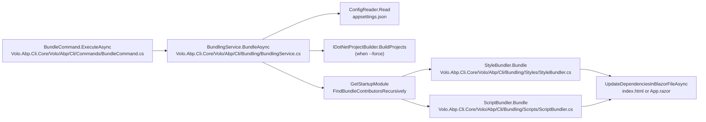

# `abp bundle` — Blazor asset bundling

The ABP Framework ships an `abp bundle` command that consolidates the style and script files contributed by every referenced ABP module into a single CSS file and a single JS file, then patches the host HTML so that Blazor WebAssembly and MAUI Blazor apps load the bundle instead of dozens of individual `_content/...` links. The command is implemented by `framework/src/Volo.Abp.Cli.Core/Volo/Abp/Cli/Commands/BundleCommand.cs` and delegates the actual work to `IBundlingService` from `framework/src/Volo.Abp.Cli.Core/Volo/Abp/Cli/Bundling/IBundlingService.cs`.

`BundleCommand.ExecuteAsync` resolves three pieces of user input from `CommandLineArgs`: the working directory (`-wd|--working-directory`, defaults to `Directory.GetCurrentDirectory()`), a `--force` switch that triggers a `dotnet build` before bundling, and a `-t|--project-type` switch whose only legal values are `webassembly` (the default) and `maui-blazor`. Those constants are declared in `framework/src/Volo.Abp.Cli.Core/Volo/Abp/Cli/Bundling/BundlingConsts.cs` as `BundlingConsts.WebAssembly` and `BundlingConsts.MauiBlazor`. Anything else is rejected with a `CliUsageException` produced by `ExceptionMessageHelper.GetInvalidOptionExceptionMessage("Project Type")`.

<Note>
`BundleCommand` is a plain `ITransientDependency` registered through the conventional DI scan in `AbpCliCoreModule`. It only validates the project type and existence of the working directory before handing control to `BundlingService.BundleAsync`, which is where the bulk of the bundling pipeline lives in `framework/src/Volo.Abp.Cli.Core/Volo/Abp/Cli/Bundling/BundlingService.cs`.
</Note>

## Bundling pipeline

The `BundlingService` class implements the full bundling pipeline and pulls in eight collaborators through property injection: `IDotNetProjectBuilder` from `framework/src/Volo.Abp.Cli.Core/Volo/Abp/Cli/Build/IDotNetProjectBuilder.cs`, `IJavascriptMinifier` and `ICssMinifier` from the `Volo.Abp.Minify` package, `IScriptBundler` from `framework/src/Volo.Abp.Cli.Core/Volo/Abp/Cli/Bundling/Scripts/IScriptBundler.cs`, `IStyleBundler` from `framework/src/Volo.Abp.Cli.Core/Volo/Abp/Cli/Bundling/Styles/IStyleBundler.cs`, `IConfigReader` from `framework/src/Volo.Abp.Cli.Core/Volo/Abp/Cli/Configuration/IConfigReader.cs`, and `CliVersionService` for the target framework version check.

<Steps>
  <Step title="OS guard for MAUI Blazor">
    `BundlingService.BundleAsync` short-circuits with a warning when `RuntimeInformation.IsOSPlatform(OSPlatform.OSX)` is true and the requested project type is `maui-blazor`. The check is the very first line of `BundleAsync` in `framework/src/Volo.Abp.Cli.Core/Volo/Abp/Cli/Bundling/BundlingService.cs` and reflects the fact that MAUI workloads do not build on macOS via the same path.
  </Step>
  <Step title="Locate the csproj">
    `Directory.GetFiles(directory, "*.csproj")` must return at least one project file. When none is found the service raises a `BundlingException` (declared in `framework/src/Volo.Abp.Cli.Core/Volo/Abp/Cli/Bundling/BundlingException.cs`) with the message "No project file found in the directory. The working directory must have a Blazor project file."
  </Step>
  <Step title="Validate project SDK and TFM">
    `CheckProjectIsSupportedTypeAsync` loads the csproj with `XmlDocument` and checks the root `Sdk` attribute. For `webassembly` the SDK must equal `Microsoft.NET.Sdk.BlazorWebAssembly`; for `maui-blazor` it must equal `Microsoft.NET.Sdk.Razor`. Both constants live in `BundlingConsts.cs`. It also compares the project's `<TargetFramework>` against `CliVersionService.GetCurrentCliVersionAsync()` and refuses to run when the CLI version's major number is not present in the TFM string.
  </Step>
  <Step title="Read AbpCli configuration">
    `ConfigReader.Read` (in `framework/src/Volo.Abp.Cli.Core/Volo/Abp/Cli/Configuration/ConfigReader.cs`) loads `appsettings.json` from `wwwroot/` (WebAssembly) or the project root (MAUI Blazor), parses it as JSON with comment handling enabled, and deserializes the `AbpCli` section into `AbpCliConfig`. The class is declared in `framework/src/Volo.Abp.Cli.Core/Volo/Abp/Cli/Configuration/AbpCliConfig.cs` and exposes a single `BundleConfig Bundle` property defined in `framework/src/Volo.Abp.Cli.Core/Volo/Abp/Cli/Bundling/BundleConfig.cs`.
  </Step>
  <Step title="Optional build">
    When `--force` is supplied, `BundlingService` builds a `List<DotNetProjectInfo>` with the discovered csproj path and calls `DotNetProjectBuilder.BuildProjects(...)` on `IDotNetProjectBuilder`. The build infrastructure lives under `framework/src/Volo.Abp.Cli.Core/Volo/Abp/Cli/Build/` and is the same code used by `abp build`.
  </Step>
  <Step title="Locate the runtime assembly">
    `PathHelper.GetWebAssemblyFilePath` (in `framework/src/Volo.Abp.Cli.Core/Volo/Abp/Cli/Bundling/PathHelper.cs`) computes `bin/Debug/<framework>/<project>.dll` for Blazor WebAssembly; for MAUI Blazor `PathHelper.GetMauiBlazorAssemblyFilePath` scans `bin/` recursively, excluding `android` and `windows10` flavours. A missing assembly raises `BundlingException("No assembly file found. Please build the project first.")`.
  </Step>
  <Step title="Reflect over modules">
    `GetStartupModule` loads the assembly with `Assembly.LoadFrom` and finds the single type that satisfies `AbpModule.IsAbpModule`. `FindBundleContributorsRecursively` then walks every transitive `IDependedTypesProvider` attribute, looks up `IBundleContributor` implementations per assembly, and records each contributor in a `List<BundleTypeDefinition>` together with the dependency depth.
  </Step>
  <Step title="Build the script and style contexts">
    The list is sorted by `Level` descending so leaf modules contribute first. `GetStyleContext` and `GetScriptContext` iterate the definitions, `Activator.CreateInstance` each `BundleContributorType`, and call `AddStyles(styleContext)` / `AddScripts(scriptContext)`. For WebAssembly projects that are not `IsBlazorWebApp`, the script context is seeded with `_framework/blazor.webassembly.js`.
  </Step>
  <Step title="Bundle or pass through">
    When `BundleConfig.Mode` is `BundlingMode.Bundle` or `BundlingMode.BundleAndMinify`, the service constructs a `BundleOptions` (see `framework/src/Volo.Abp.Cli.Core/Volo/Abp/Cli/Bundling/BundleOptions.cs`) and calls `StyleBundler.Bundle` / `ScriptBundler.Bundle`. Otherwise it falls back to `GenerateStyleDefinitions` / `GenerateScriptDefinitions`, which simply emit one `<link>` / `<script>` tag per `BundleDefinition`.
  </Step>
  <Step title="Patch the host file">
    `UpdateDependenciesInBlazorFileAsync` reads `wwwroot/index.html` (or `App.razor` when `BundleConfig.IsBlazorWebApp` is `true`), preserves the original `Encoding` reported by `StreamReader`, locates the `<!--ABP:Styles-->...<!--/ABP:Styles-->` and `<!--ABP:Scripts-->...<!--/ABP:Scripts-->` markers from `BundlingConsts`, and rewrites the regions in place.
  </Step>
</Steps>

## `BundleConfig` and `BundlingMode`

`BundleConfig` is the strongly-typed representation of the `AbpCli:Bundle` section in `appsettings.json`. Its fields, defined in `framework/src/Volo.Abp.Cli.Core/Volo/Abp/Cli/Bundling/BundleConfig.cs`, drive every branch in `BundlingService`:

<CardGroup cols={2}>
  <Card title="Mode" icon="sliders">
    `BundlingMode Mode { get; set; } = BundlingMode.BundleAndMinify;` — the bundling strategy. `BundlingMode` itself comes from `framework/src/Volo.Abp.Cli.Core/Volo/Abp/Cli/Bundling/BundlingMode.cs` and is re-exported from `Volo.Abp.Bundling`.
  </Card>
  <Card title="Name" icon="tag">
    `string Name { get; set; } = "global";` — the output file name. The service falls back to `"global"` when this string is empty, so the bundle is written to `wwwroot/global.css` and `wwwroot/global.js`.
  </Card>
  <Card title="IsBlazorWebApp" icon="window">
    `bool IsBlazorWebApp { get; set; } = false;` — when `true`, `BundlingService` patches `App.razor` instead of `wwwroot/index.html`, searching both the parent `.Host` project and the sibling project obtained by stripping `.Client` from the project directory name.
  </Card>
  <Card title="InteractiveAuto" icon="bolt">
    `bool InteractiveAuto { get; set; } = false;` — flows into `BundleContext.InteractiveAuto`, which contributors use to decide whether `blazor.web.js` and `blazor.webassembly.js` should both be emitted.
  </Card>
</CardGroup>

`BundleConfig.Parameters` is a `BundleParameterDictionary` (from `Volo.Abp.Bundling`) that lets contributors read arbitrary key/value pairs from configuration. `BundlingService.GetStyleContext` and `GetScriptContext` both copy `bundleConfig.Parameters` into the freshly created `BundleContext`, so theme contributors can consume it via `context.Parameters["MyKey"]` without round-tripping through the global configuration.

## `BundlerBase`, `ScriptBundler`, and `StyleBundler`

`BundlerBase` in `framework/src/Volo.Abp.Cli.Core/Volo/Abp/Cli/Bundling/BundlerBase.cs` is the shared implementation behind both bundlers. It accepts an `IMinifier` (NUglify-based) through its constructor, exposes an abstract `FileExtension` (`.js` or `.css`), and implements `Bundle(BundleOptions options, BundleContext context)` by splitting `context.BundleDefinitions` into two groups: items with `ExcludeFromBundle == false` are concatenated into the bundle file at `wwwroot/<bundleName><extension>`, while items with `ExcludeFromBundle == true` are emitted as separate tags by the subclass-provided `GenerateDefinition` method.

```csharp
// framework/src/Volo.Abp.Cli.Core/Volo/Abp/Cli/Bundling/BundlerBase.cs
public string Bundle(BundleOptions options, BundleContext context)
{
    var bundleFilePath = Path.Combine(
        PathHelper.GetWwwRootPath(options.Directory),
        $"{options.BundleName}{FileExtension}");

    var bundleFileDefinitions = context.BundleDefinitions
        .Where(t => t.ExcludeFromBundle == false).ToList();
    var fileDefinitionsExcludingFromBundle = context.BundleDefinitions
        .Where(t => t.ExcludeFromBundle).ToList();

    var bundledContent = options.ProjectType == BundlingConsts.WebAssembly
        ? BundleWebAssemblyFiles(options, bundleFileDefinitions)
        : BundleMauiBlazorFiles(options, bundleFileDefinitions);

    File.WriteAllText(bundleFilePath, bundledContent);
    return GenerateDefinition(bundleFilePath, fileDefinitionsExcludingFromBundle);
}
```

`BundleWebAssemblyFiles` is the more interesting branch: it opens `bin/Debug/<framework>/<project>.staticwebassets.runtime.json`, reads the `ContentRoots` array, and resolves each `_content/<PackageId>/...` reference back to a physical file on disk by searching the content roots for a directory whose name matches `<PackageId>`. References that start with `_framework/` are resolved against `PathHelper.GetWebAssemblyFrameworkFolderPath`. Everything else is read straight from `wwwroot/`. `BundleMauiBlazorFiles` is simpler — it walks every file under `bin/` and picks the one whose path ends with the requested source.

`BundlerBase.GetFileContent` is where minification happens: it reads the file, skips files whose name ends with `.min<ext>` or `.prod<ext>` or whose content is under 10 lines (treated as already-minified), then invokes `Minifier.Minify(content)`. NUglify failures are caught and logged at warning level so an unparseable third-party file does not break the whole bundle.

<AccordionGroup>
  <Accordion title="ScriptBundler" icon="square-js">
    `framework/src/Volo.Abp.Cli.Core/Volo/Abp/Cli/Bundling/Scripts/ScriptBundler.cs` overrides `FileExtension` to `.js`, constructs the `IJavascriptMinifier` via base constructor, and implements `GenerateDefinition` to emit a `<script src="<bundle>.js?_v=<ticks>"></script>` tag followed by one extra `<script>` tag per `ExcludeFromBundle` definition. `ProcessBeforeAddingToTheBundle` ensures every snippet ends with a `;` and a newline so concatenated scripts do not collide.
  </Accordion>
  <Accordion title="StyleBundler" icon="palette">
    `framework/src/Volo.Abp.Cli.Core/Volo/Abp/Cli/Bundling/Styles/StyleBundler.cs` mirrors the script bundler but emits `<link rel="stylesheet">` tags. Its `ProcessBeforeAddingToTheBundle` calls `CssRelativePath.Adjust(content, referencePath, bundleDirectory)` from `Volo.Abp.Bundling.Styles` so that `url(...)` references inside the CSS are rewritten relative to the bundle's new location at `wwwroot/<name>.css`.
  </Accordion>
  <Accordion title="Cache-busting query strings" icon="clock">
    Both bundlers append `?_v=<File.GetLastWriteTime(bundleFilePath).Ticks>` to the emitted reference. That gives the browser a deterministic version token that changes every time the bundle is regenerated, which avoids stale caches without leaking content hashes.
  </Accordion>
</AccordionGroup>

## Placeholder replacement

`BundlingConsts` defines the four sentinel comments that mark the editable regions in the host file: `<!--ABP:Styles-->`, `<!--/ABP:Styles-->`, `<!--ABP:Scripts-->`, and `<!--/ABP:Scripts-->`. `BundlingService.UpdatePlaceholders` finds the start and end indexes for each pair, removes the entire range, and re-inserts the new content. The method intentionally keeps the placeholder comments in the replacement string returned by `GenerateDefinition`, so subsequent runs continue to find the anchors.

`UpdateDependenciesInBlazorFileAsync` preserves the file encoding via `StreamReader(filename, detectEncodingFromByteOrderMarks: true)` and writes the result through `StreamWriter(filename, append: false, fileEncoding)`. That detail matters for legacy projects whose `index.html` was authored as UTF-8 with BOM — without it the BOM would silently change on every run.

## Bundle modes and pass-through behaviour

`BundlingMode` (`framework/src/Volo.Abp.Cli.Core/Volo/Abp/Cli/Bundling/BundlingMode.cs`, re-exported from `Volo.Abp.Bundling`) has three values. `BundleAndMinify` runs the bundler and minifier together — the default and the path most users hit. `Bundle` concatenates files but skips `Minifier.Minify`, useful when debugging a minifier regression. The third value (anything other than `Bundle` or `BundleAndMinify`) drops into the `GenerateStyleDefinitions` / `GenerateScriptDefinitions` branch, which writes one tag per source without producing a bundle file at all — handy for local dev when you want browser source maps to point at the original files.

```csharp
// framework/src/Volo.Abp.Cli.Core/Volo/Abp/Cli/Bundling/BundlingService.cs
if (bundleConfig.Mode is BundlingMode.Bundle || bundleConfig.Mode is BundlingMode.BundleAndMinify)
{
    var options = new BundleOptions
    {
        Directory = directory,
        FrameworkVersion = frameworkVersion,
        ProjectFileName = projectName,
        BundleName = bundleConfig.Name.IsNullOrEmpty() ? "global" : bundleConfig.Name,
        Minify = bundleConfig.Mode == BundlingMode.BundleAndMinify,
        ProjectType = projectType
    };

    styleDefinitions = StyleBundler.Bundle(options, styleContext);
    scriptDefinitions = ScriptBundler.Bundle(options, scriptContext);
}
else
{
    styleDefinitions = GenerateStyleDefinitions(styleContext);
    scriptDefinitions = GenerateScriptDefinitions(scriptContext);
}
```

The `BundleOptions` instance threads four invariants through the bundler: the working directory, the resolved `FrameworkVersion` (used to compute `bin/Debug/<framework>/` paths), the `ProjectFileName` (used to find `<name>.staticwebassets.runtime.json` and `<name>.dll`), and the bundle name. The fields are declared `[NotNull]` via JetBrains annotations in `BundleOptions.cs`.

## `IBundleContributor` discovery

`FindBundleContributorsRecursively` is the place where ABP module metadata meets reflection. Each `AbpModule`-derived type may declare any number of `IDependedTypesProvider` attributes (such as `[DependsOn(typeof(AbpAspNetCoreMvcUiThemeSharedModule))]`), and each contributor type is expected to live inside one of those depended-on assemblies. The loop runs once per module, looking for all non-abstract, non-interface types that are assignable to `IBundleContributor`:

```csharp
// framework/src/Volo.Abp.Cli.Core/Volo/Abp/Cli/Bundling/BundlingService.cs
var bundleContributors = module.Assembly
    .GetTypes()
    .Where(t => !t.IsAbstract && !t.IsInterface && t.IsAssignableTo<IBundleContributor>())
    .ToList();

if (bundleContributors.Count > 1)
{
    throw new BundlingException(
        $"Each project must contain only one class implementing {nameof(IBundleContributor)}");
}
```

Two-pass deduplication keeps the highest `Level` seen for each contributor so the final `OrderByDescending(t => t.Level)` produces a depth-first order: leaf modules run first, the root module last. That is exactly the order an `IBundleContributor.AddStyles` call expects so that root-module overrides win.

<Warning>
The "one contributor per assembly" rule is strict. If you copy an existing contributor into a new partial class without removing the original, `BundleCommand` will fail with the exception above before producing any output. The rule lives in `BundlingService.FindBundleContributorsRecursively`.
</Warning>

## Configuration example

A typical `wwwroot/appsettings.json` for a Blazor WebAssembly host points at the bundling options like this. The shape is exactly what `ConfigReader.Read` deserializes into `AbpCliConfig.Bundle`.

```json
{
  "AbpCli": {
    "Bundle": {
      "Mode": "BundleAndMinify",
      "Name": "global",
      "IsBlazorWebApp": false,
      "InteractiveAuto": false,
      "Parameters": {
        "LeptonXTheme.Layout": "side-menu"
      }
    }
  }
}
```

`AbpCliConfig.Bundle` is initialised to `new BundleConfig()` in `framework/src/Volo.Abp.Cli.Core/Volo/Abp/Cli/Configuration/AbpCliConfig.cs`, so projects without an `AbpCli` section still get the default `BundleAndMinify` mode and the `global` bundle name. The fallback branch in `ConfigReader.Read` returns `new AbpCliConfig()` when the JSON document does not contain the `AbpCli` property.

## Wiring into the host HTML

The expected layout of `wwwroot/index.html` for a Blazor WebAssembly project is illustrated below. `BundleCommand` does not insert the placeholders for you — they ship in the ABP solution templates and `BundlingService.UpdatePlaceholders` raises an `IndexOutOfRangeException` (via `string.IndexOf` returning `-1` and `Remove(-1, ...)`) if either marker pair is missing.

```html
<!-- wwwroot/index.html (excerpt) -->
<head>
    <!--ABP:Styles-->
    <link href="_content/Volo.Abp.AspNetCore.Components.Web.LeptonXTheme/libs/abp/css/theme.css" rel="stylesheet" />
    <!--/ABP:Styles-->
</head>
<body>
    <!--ABP:Scripts-->
    <script src="_framework/blazor.webassembly.js"></script>
    <!--/ABP:Scripts-->
</body>
```

When `BundleConfig.IsBlazorWebApp` is `true`, the search shifts to `App.razor`. The lookup logic in `BundlingService.BundleAsync` first replaces `.Client` in the project directory name (so a `Acme.MyApp.Blazor.Client` project will look in the sibling `Acme.MyApp.Blazor`), then falls back to replacing `.Blazor` with `.Host`. That accommodates both the layered application template (Client/Host split) and the no-layers Blazor WebApp template, both of which are generated by the templates documented in [`cli/project-building`](/cli/project-building).

## Error surface and exit codes

`BundlingException` is the dedicated exception type, declared in `framework/src/Volo.Abp.Cli.Core/Volo/Abp/Cli/Bundling/BundlingException.cs`. `CliUsageException` (from `framework/src/Volo.Abp.Cli.Core/Volo/Abp/Cli/CliUsageException.cs`) is reserved for argument-parsing problems — invalid project type, missing working directory — and triggers `BundleCommand.GetUsageInfo()` to be rendered. Everything else bubbles up to `CliService` (in `framework/src/Volo.Abp.Cli.Core/Volo/Abp/Cli/CliService.cs`), which logs the message and returns a non-zero exit code so CI pipelines can stop on a bundling failure.



## Cache busting and the `?_v=<ticks>` token

Both `ScriptBundler.GenerateDefinition` and `StyleBundler.GenerateDefinition` (in `framework/src/Volo.Abp.Cli.Core/Volo/Abp/Cli/Bundling/Scripts/ScriptBundler.cs` and `Styles/StyleBundler.cs`) read `File.GetLastWriteTime(bundleFilePath).Ticks` and append it as a `?_v=<ticks>` query string on the emitted `<script>` and `<link>` tags. That timestamp is millisecond-precise on every platform that `BundleCommand` runs on, so two consecutive `abp bundle` invocations will always produce different version tokens — there is no risk of a cache that retained the previous bundle silently serving it instead.

The token is intentionally not a content hash. Hashes would require a second pass over the bundled bytes after they are written; the timestamp short-circuits that pass and still satisfies the only constraint the browser cares about, which is "the URL changed since last time". Browsers treat `?_v=...` as part of the request URL and cache the response separately for each value, so a fresh deployment automatically invalidates every cached bundle reference.

## `BundleContext` and `BundleDefinition` from `Volo.Abp.Bundling`

`BundlingService.GetStyleContext` and `GetScriptContext` both construct a `BundleContext` (from `Volo.Abp.Bundling`) and populate it with `BundleDefinition` entries through `IBundleContributor.AddStyles` and `IBundleContributor.AddScripts`. The CLI itself does not declare the contributor types — the Blazor host project's referenced modules do. The CLI just discovers them, instantiates them with `Activator.CreateInstance`, and lets each one append the styles/scripts it owns. Every contributor's `Source` is a relative path inside the published `wwwroot/` and is resolved at bundle time against either the `_content/<PackageId>/` static-web-assets root or the `_framework/` runtime root.

`BundleDefinition.AdditionalProperties` is a free-form `Dictionary<string, string>` that contributors use to attach attributes such as `type="module"` or `crossorigin="anonymous"`. Both `ScriptBundler.GenerateDefinition` and `StyleBundler.GenerateDefinition` iterate the dictionary and serialise the pairs verbatim, which means contributors can express arbitrary HTML attribute syntax without changes to the bundler.

## A worked example

Imagine a Blazor WebAssembly project at `~/work/Acme.BookStore.Blazor/`. After `abp bundle`, the directory looks like this:

```text
Acme.BookStore.Blazor/
├── Acme.BookStore.Blazor.csproj
├── wwwroot/
│   ├── appsettings.json          ← read by ConfigReader
│   ├── index.html                ← rewritten between ABP:Styles/Scripts markers
│   ├── global.css                ← StyleBundler output, all contributors concatenated
│   └── global.js                 ← ScriptBundler output, all contributors concatenated
└── bin/Debug/net9.0/
    ├── Acme.BookStore.Blazor.dll
    ├── Acme.BookStore.Blazor.staticwebassets.runtime.json
    └── wwwroot/_framework/...
```

The `<!--ABP:Styles-->` and `<!--ABP:Scripts-->` regions in `index.html` will contain a single `<link href="global.css?_v=...">` and `<script src="global.js?_v=...">` respectively, plus one extra tag per `ExcludeFromBundle` contributor. The bundled `global.css` will inline every theme stylesheet contributed by the module dependency tree, and `global.js` will inline every JavaScript dependency including `_framework/blazor.webassembly.js`.

If you re-run `abp bundle --force`, `BundlingService.BundleAsync` first invokes `IDotNetProjectBuilder.BuildProjects` to refresh `bin/Debug/...` before regenerating the bundle. Without `--force`, the bundle is computed from whatever the last `dotnet build` produced, which is exactly the workflow you want when iterating on a `.razor` file: the build server already produced the assets, the bundler just stitches them together.

## Pitfalls and edge cases

The bundler's behaviour is mostly invisible until something prevents discovery. A handful of edge cases are worth knowing about because the resulting errors can be cryptic without the file references.

<AccordionGroup>
  <Accordion title="Missing staticwebassets.runtime.json" icon="file-circle-xmark">
    `BundlerBase.BundleWebAssemblyFiles` opens `bin/Debug/<framework>/<project>.staticwebassets.runtime.json` to find the content roots for each `_content/<PackageId>/` reference. If you have never run `dotnet build` (or the build was incremental and skipped the static-web-assets task), the file is absent and the bundler throws `BundlingException("Unable to find static web assets file. You need to build the project to generate static web assets file.")`. Re-run with `--force` to ensure a full build.
  </Accordion>
  <Accordion title="Two contributors in the same project" icon="circle-exclamation">
    `FindBundleContributorsRecursively` enforces "exactly one IBundleContributor per assembly". If you copy an existing contributor into a sibling file without removing the original, the count rises to two and the bundler aborts with `"Each project must contain only one class implementing IBundleContributor"`. Either delete the duplicate or move the second contributor into its own project.
  </Accordion>
  <Accordion title="Target framework mismatch" icon="hourglass">
    `BundlingService.CheckProjectIsSupportedTypeAsync` rejects projects whose `<TargetFramework>` does not contain `net<X>.0` where `<X>` matches the CLI's major version (resolved via `CliVersionService.GetCurrentCliVersionAsync`). The error message names both versions explicitly so you know whether to upgrade the CLI or the project.
  </Accordion>
  <Accordion title="App.razor without ABP markers" icon="comment-slash">
    When `BundleConfig.IsBlazorWebApp` is `true`, the rewriter looks for `<!--ABP:Styles-->` and `<!--ABP:Scripts-->` markers in `App.razor`. `UpdatePlaceholders` uses `string.IndexOf` and `Remove(startIndex, length)` — a missing marker pair throws an `ArgumentOutOfRangeException` because `IndexOf` returns `-1`. The fix is to add the marker pairs to `App.razor`; the templates that ship with `app-pro` and `app-nolayers-pro` already include them.
  </Accordion>
  <Accordion title="macOS + MAUI Blazor" icon="apple">
    The very first line of `BundlingService.BundleAsync` is `if (RuntimeInformation.IsOSPlatform(OSPlatform.OSX) && projectType == BundlingConsts.MauiBlazor)` and exits with a warning. There is no override — MAUI Blazor builds on macOS take a different path that the bundler does not understand. Run on Windows or Linux instead, or skip the bundle step entirely for the macOS build of a MAUI Blazor host.
  </Accordion>
</AccordionGroup>

## CI integration

In CI pipelines, the typical sequence is `dotnet restore` → `dotnet build -c Release` → `abp bundle -f` → `dotnet publish`. The `--force` switch is redundant when the prior `dotnet build` already produced `bin/Debug/<framework>/`, but it does not hurt — `IDotNetProjectBuilder.BuildProjects` is incremental and exits quickly when nothing changed. The `BundlingException` cases above translate into non-zero exit codes via `CliService`, so a missing static-web-assets manifest or duplicate contributor will fail the build.

## Comparison with the runtime asset pipeline

ASP.NET Core MVC's own bundling pipeline (also part of `Volo.Abp.Bundling`) processes the same `IBundleContributor` interface but at runtime, serving the bundle dynamically through a controller and Razor view component. `abp bundle` is the ahead-of-time equivalent for Blazor WebAssembly, where every kilobyte that crosses the wire is paid for once when the app starts. The shared abstraction means a contributor written for the MVC theme will also work in the Blazor WebAssembly host that consumes `abp bundle` — same class, same `AddStyles`/`AddScripts`, different consumer.

The advantages of the AOT approach are concrete: a single CSS file means one HTTP round-trip instead of a dozen, the minifier can run once at build time instead of on every request, and the resulting `wwwroot/global.css` is served by static-file middleware with HTTP caching headers. The trade-off is that any module dependency change requires a re-run of `abp bundle`; that is why `abp add-module` invokes `BundleCommand.ExecuteAsync` automatically for Blazor WebAssembly hosts, as covered in [`cli/project-modification`](/cli/project-modification).

## Where to look next

The bundling code reuses the shared `Volo.Abp.Bundling` types (`BundleContext`, `BundleDefinition`, `IBundleContributor`) which are documented in the [Bundling Module](/mvc-ui/bundling) area. The `IDotNetProjectBuilder` invocation under `--force` runs the same build orchestrator covered in [`cli/build-and-libs`](/cli/build-command); the version probe at the top of `BundlingService` calls into the version probe described under [`cli/internals-and-args`](/cli/command-selector).
