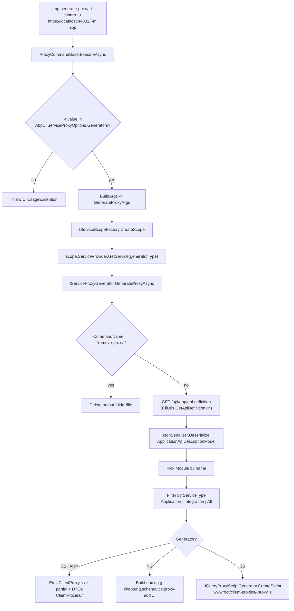

# `abp generate-proxy` — Building client proxies from an ABP API

`abp generate-proxy` reads the ABP API description from a running server (`/api/abp/api-definition`) and emits client-side proxies that match every controller and DTO it finds. The same command supports three back-end targets: C# (`Volo.Abp.Http.Client` style proxy classes), Angular (delegated to the `@abp/ng.schematics:proxy-add` schematic), and JavaScript (jQuery-style proxy scripts that match what ABP's MVC UI ships). The dispatch is shared between two layers: `GenerateProxyCommand` + `ProxyCommandBase<T>` build the arguments and pick the right generator, then `IServiceProxyGenerator` does the language-specific work.

All sources are under `framework/src/Volo.Abp.Cli.Core/Volo/Abp/Cli/`:

- `Commands/GenerateProxyCommand.cs`
- `Commands/ProxyCommandBase.cs`
- `Commands/RemoveProxyCommand.cs` (the inverse, sharing the same base class)
- `ServiceProxying/IServiceProxyGenerator.cs`
- `ServiceProxying/ServiceProxyGeneratorBase.cs`
- `ServiceProxying/GenerateProxyArgs.cs`
- `ServiceProxying/ServiceType.cs`
- `ServiceProxying/AbpCliServiceProxyOptions.cs`
- `ServiceProxying/CSharp/CSharpServiceProxyGenerator.cs`
- `ServiceProxying/Angular/AngularServiceProxyGenerator.cs`
- `ServiceProxying/JavaScript/JavaScriptServiceProxyGenerator.cs`

## Command shell

```csharp
// framework/src/Volo.Abp.Cli.Core/Volo/Abp/Cli/Commands/GenerateProxyCommand.cs
public class GenerateProxyCommand : ProxyCommandBase<GenerateProxyCommand>
{
    public const string Name = "generate-proxy";

    protected override string CommandName => Name;

    public GenerateProxyCommand(
        IOptions<AbpCliServiceProxyOptions> serviceProxyOptions,
        IServiceScopeFactory serviceScopeFactory)
        : base(serviceProxyOptions, serviceScopeFactory) { }

    public override string GetUsageInfo() { /* ...examples... */ }

    public static string GetShortDescription()
    {
        return "Generates client service proxies and DTOs to consume HTTP APIs.";
    }
}
```

The class itself is essentially a typed marker — it overrides `CommandName` and adds examples to the usage text but inherits all behaviour from `ProxyCommandBase<T>`. `RemoveProxyCommand` (`framework/src/Volo.Abp.Cli.Core/Volo/Abp/Cli/Commands/RemoveProxyCommand.cs`) does the same thing with `Name = "remove-proxy"`, and the base class checks `args.CommandName == RemoveProxyCommand.Name` to flip every generator into delete mode.

## `ProxyCommandBase<T>` — argument building and dispatch

`ProxyCommandBase<T>` lives in `framework/src/Volo.Abp.Cli.Core/Volo/Abp/Cli/Commands/ProxyCommandBase.cs` and does three things: validate the `-t|--type` argument, build a `GenerateProxyArgs`, and resolve the matching `IServiceProxyGenerator` from a scoped service provider.

```csharp
public async Task ExecuteAsync(CommandLineArgs commandLineArgs)
{
    var generateType = commandLineArgs.Options.GetOrNull(
        Options.GenerateType.Short, Options.GenerateType.Long)?.ToUpperInvariant();

    if (string.IsNullOrWhiteSpace(generateType))
        throw new CliUsageException("Option Type is required" + Environment.NewLine + GetUsageInfo());

    if (!ServiceProxyOptions.Generators.ContainsKey(generateType))
        throw new CliUsageException("Option Type value is invalid" + Environment.NewLine + GetUsageInfo());

    using (var scope = ServiceScopeFactory.CreateScope())
    {
        var generatorType = ServiceProxyOptions.Generators[generateType];
        var serviceProxyGenerator = scope.ServiceProvider.GetService(generatorType)
                                                          .As<IServiceProxyGenerator>();
        await serviceProxyGenerator.GenerateProxyAsync(BuildArgs(commandLineArgs));
    }
}
```

The type string is upper-cased so `-t csharp`, `-t CSHARP`, and `-t Csharp` all resolve to the same generator. The values live in the three generator classes as `public const string Name = "CSHARP" | "NG" | "JS"`.

### `AbpCliServiceProxyOptions`

The dictionary the lookup hits is configured by `AbpCliCoreModule`:

```csharp
// framework/src/Volo.Abp.Cli.Core/Volo/Abp/Cli/AbpCliCoreModule.cs
Configure<AbpCliServiceProxyOptions>(options =>
{
    options.Generators[JavaScriptServiceProxyGenerator.Name] = typeof(JavaScriptServiceProxyGenerator);
    options.Generators[AngularServiceProxyGenerator.Name]    = typeof(AngularServiceProxyGenerator);
    options.Generators[CSharpServiceProxyGenerator.Name]     = typeof(CSharpServiceProxyGenerator);
});
```

`AbpCliServiceProxyOptions` (`framework/src/Volo.Abp.Cli.Core/Volo/Abp/Cli/ServiceProxying/AbpCliServiceProxyOptions.cs`) is a small wrapper around `IDictionary<string, Type> Generators`. External hosts can add their own generator by post-configuring the options dictionary; the lookup is just a string-typed dispatch.

### `BuildArgs` — option harvesting

`BuildArgs` reads every shared option, decides defaults, and produces a `GenerateProxyArgs`:

```csharp
private GenerateProxyArgs BuildArgs(CommandLineArgs commandLineArgs)
{
    var url           = commandLineArgs.Options.GetOrNull(Options.Url.Short, Options.Url.Long);
    var target        = commandLineArgs.Options.GetOrNull(Options.Target.Long);
    var module        = commandLineArgs.Options.GetOrNull(Options.Module.Short, Options.Module.Long) ?? "app";
    var output        = commandLineArgs.Options.GetOrNull(Options.Output.Short, Options.Output.Long);
    var apiName       = commandLineArgs.Options.GetOrNull(Options.ApiName.Short, Options.ApiName.Long);
    var source        = commandLineArgs.Options.GetOrNull(Options.Source.Short, Options.Source.Long);
    var workDirectory = commandLineArgs.Options.GetOrNull(Options.WorkDirectory.Short, Options.WorkDirectory.Long)
                        ?? Directory.GetCurrentDirectory();
    var folder        = commandLineArgs.Options.GetOrNull(Options.Folder.Long);
    var serviceTypeArg= commandLineArgs.Options.GetOrNull(Options.ServiceType.Short, Options.ServiceType.Long);
    var entryPointArg = commandLineArgs.Options.GetOrNull(Options.EntryPoint.Short, Options.EntryPoint.Long);

    ServiceType? serviceType = null;
    if (!serviceTypeArg.IsNullOrWhiteSpace())
    {
        serviceType = serviceTypeArg.ToLowerInvariant() == "application"  ? ServiceType.Application
                    : serviceTypeArg.ToLowerInvariant() == "integration"  ? ServiceType.Integration
                                                                          : ServiceType.All;
    }

    var withoutContracts = commandLineArgs.Options.ContainsKey(Options.WithoutContracts.Short)
                        || commandLineArgs.Options.ContainsKey(Options.WithoutContracts.Long);

    return new GenerateProxyArgs(CommandName, workDirectory, module, url, output, target, apiName, source,
                                 folder, serviceType, entryPointArg, withoutContracts,
                                 commandLineArgs.Options);
}
```

`GenerateProxyArgs` (`framework/src/Volo.Abp.Cli.Core/Volo/Abp/Cli/ServiceProxying/GenerateProxyArgs.cs`) is the language-agnostic record passed to every generator. The most important fields:

| Field | Source option | Used by |
| --- | --- | --- |
| `CommandName` | (constant from `ProxyCommandBase.CommandName`) | Distinguishes `generate-proxy` from `remove-proxy`. |
| `Module` | `-m` / `--module` (default `"app"`) | Picks the module to extract from `ApplicationApiDescriptionModel.Modules`. |
| `Url` | `-u` / `--url` | API definition root URL. |
| `Output` | `-o` / `--output` | Output file/folder (JS-only). |
| `ApiName`, `Source`, `Target` | `-a`, `-s`, `--target` | Angular schematic inputs. |
| `Folder` | `--folder` (default `ClientProxies`) | C# proxy output folder. |
| `ServiceType` | `-st` / `--service-type` | Application / Integration / All. |
| `WithoutContracts` | `-c` / `--without-contracts` | Skip interface, DTO emission for C#. |
| `EntryPoint` | `-ep` / `--entry-point` | Angular secondary entry point. |
| `ExtraProperties` | (the rest of `commandLineArgs.Options`) | Generators that need access to raw flags (the Angular generator inspects `p`/`prompt`). |

## `IServiceProxyGenerator` and `ServiceProxyGeneratorBase<T>`

The contract is one method:

```csharp
// framework/src/Volo.Abp.Cli.Core/Volo/Abp/Cli/ServiceProxying/IServiceProxyGenerator.cs
public interface IServiceProxyGenerator
{
    Task GenerateProxyAsync(GenerateProxyArgs args);
}
```

The shared base class adds the HTTP fetch:

```csharp
// framework/src/Volo.Abp.Cli.Core/Volo/Abp/Cli/ServiceProxying/ServiceProxyGeneratorBase.cs
public abstract class ServiceProxyGeneratorBase<T> : IServiceProxyGenerator where T : IServiceProxyGenerator
{
    public IJsonSerializer JsonSerializer { get; }
    public CliHttpClientFactory CliHttpClientFactory { get; }
    public ILogger<T> Logger { get; set; }

    protected virtual async Task<ApplicationApiDescriptionModel> GetApplicationApiDescriptionModelAsync(
        GenerateProxyArgs args, ApplicationApiDescriptionModelRequestDto requestDto = null)
    {
        Check.NotNull(args.Url, nameof(args.Url));

        var client = CliHttpClientFactory.CreateClient(needsAuthentication: false);

        var apiDefinitionResult = await client.GetStringAsync(
            CliUrls.GetApiDefinitionUrl(args.Url, requestDto));
        var apiDefinition = JsonSerializer.Deserialize<ApplicationApiDescriptionModel>(apiDefinitionResult);

        var moduleDefinition = apiDefinition.Modules.FirstOrDefault(
            x => string.Equals(x.Key, args.Module, StringComparison.CurrentCultureIgnoreCase)).Value;
        if (moduleDefinition == null)
            throw new CliUsageException($"Module name: {args.Module} is invalid");

        var serviceType = GetServiceType(args);
        switch (serviceType)
        {
            case ServiceType.Application:
                moduleDefinition.Controllers.RemoveAll(x => x.Value.IsIntegrationService);
                break;
            case ServiceType.Integration:
                moduleDefinition.Controllers.RemoveAll(x => !x.Value.IsIntegrationService);
                break;
        }

        var apiDescriptionModel = ApplicationApiDescriptionModel.Create();
        apiDescriptionModel.Types = apiDefinition.Types;
        apiDescriptionModel.AddModule(moduleDefinition);
        return apiDescriptionModel;
    }

    protected abstract ServiceType? GetDefaultServiceType(GenerateProxyArgs args);
}
```

Two responsibilities:

- **HTTP fetch.** `CliUrls.GetApiDefinitionUrl(url, requestDto)` builds `<url>/api/abp/api-definition[?includeTypes=true]` (see `framework/src/Volo.Abp.Cli.Core/Volo/Abp/Cli/CliUrls.cs`, line 51). The `CliHttpClientFactory` returns a typed `HttpClient` using the `CliConsts.HttpClientName` registration so the TLS fix-up in `CliHttpClientHandler` applies.
- **Module + service-type filtering.** The deserialised `ApplicationApiDescriptionModel` is filtered to the module the user requested. Then `ServiceType` controls whether application services, integration services, or both are kept. `ServiceType` itself is a three-state enum:

```csharp
// framework/src/Volo.Abp.Cli.Core/Volo/Abp/Cli/ServiceProxying/ServiceType.cs
public enum ServiceType : byte { All = 0, Application = 1, Integration = 2 }
```

## C# generator

`CSharpServiceProxyGenerator` (`framework/src/Volo.Abp.Cli.Core/Volo/Abp/Cli/ServiceProxying/CSharp/CSharpServiceProxyGenerator.cs`) is the most involved. Highlights:

- **Name and defaults.**

  ```csharp
  public const string Name = "CSHARP";
  private const string ProxyDirectory = "ClientProxies";
  private static readonly string[] ServicePostfixes = {
      "AppService", "ApplicationService", "IntService", "IntegrationService", "Service"
  };
  ```

- **Templates.** Three string constants (`ClassTemplate`, `InterfaceTemplate`, `DtoTemplate`) carry the C# scaffolding with placeholders like `<namespace>`, `<using>`, `<className>`, `<serviceInterface>`, `<method>`, `<property>`. Each template starts with `// This file is automatically generated by ABP framework to use MVC Controllers from CSharp` so users know the file is regenerated.
- **`GenerateProxyAsync` flow.**

  ```csharp
  public override async Task GenerateProxyAsync(GenerateProxyArgs args)
  {
      CheckWorkDirectory(args.WorkDirectory);
      CheckFolder(args.Folder);

      if (args.CommandName == RemoveProxyCommand.Name)
      {
          var folder = args.Folder.IsNullOrWhiteSpace() ? ProxyDirectory : args.Folder;
          var folderPath = Path.Combine(args.WorkDirectory, folder);
          if (Directory.Exists(folderPath))
              Directory.Delete(folderPath, true);
          Logger.LogInformation($"Delete {GetLoggerOutputPath(folderPath, args.WorkDirectory)}");
          return;
      }

      var applicationApiDescriptionModel = await GetApplicationApiDescriptionModelAsync(args,
          new ApplicationApiDescriptionModelRequestDto { IncludeTypes = !args.WithoutContracts });

      foreach (var controller in applicationApiDescriptionModel.Modules.Values.SelectMany(x => x.Controllers)
                   .Where(x => x.Value.Interfaces.Any()
                            && ServicePostfixes.Any(s => x.Value.Interfaces.Last().Type.EndsWith(s))))
      {
          await GenerateClassFileAsync(args, controller.Value);
      }

      if (!args.WithoutContracts)
          await GenerateDtoFileAsync(args, applicationApiDescriptionModel);

      await CreateJsonFile(args, applicationApiDescriptionModel);
  }
  ```

- **Output layout.** Files land in `<WorkDirectory>/<Folder>/<Module>` (default `<cwd>/ClientProxies/app/`). Each controller produces a `*ClientProxy.cs` (matching `ClassTemplate`) plus a `*ClientProxy.partial.cs` (using `ClassTemplateEmptyPart` so the user can customise without losing edits on regeneration). When `--without-contracts` is **not** passed, interfaces and DTOs are emitted using `InterfaceTemplate` and `DtoTemplate`. A `<Module>-generate-proxy.json` snapshot of the full API description is written next to the proxies so future incremental regenerations can diff against it.
- **Default service type.** `GetDefaultServiceType(args)` returns `ServiceType.All`, so C# proxies cover application and integration services unless the user narrows with `-st`.

## Angular generator

`AngularServiceProxyGenerator` (`framework/src/Volo.Abp.Cli.Core/Volo/Abp/Cli/ServiceProxying/Angular/AngularServiceProxyGenerator.cs`) does not generate code itself — it delegates to the `@abp/ng.schematics` schematic and lets the Angular tooling produce the actual files. The CLI's job is to assemble the right `npx ng g` command line:

```csharp
public const string Name = "NG";

public async override Task GenerateProxyAsync(GenerateProxyArgs args)
{
    CheckAngularJsonFile();
    await CheckNgSchematicsAsync();

    var schematicsCommandName = args.CommandName == RemoveProxyCommand.Name ? "proxy-remove" : "proxy-add";
    var prompt = args.ExtraProperties.ContainsKey("p") || args.ExtraProperties.ContainsKey("prompt");
    var defaultValue = prompt ? null : "__default";

    var module     = args.ExtraProperties.ContainsKey("t") || args.ExtraProperties.ContainsKey("module") ? args.Module : defaultValue;
    var apiName    = args.ApiName    ?? defaultValue;
    var source     = args.Source     ?? defaultValue;
    var target     = args.Target     ?? defaultValue;
    var url        = args.Url        ?? defaultValue;
    var entryPoint = args.EntryPoint ?? defaultValue;

    var commandBuilder = new StringBuilder("npx ng g @abp/ng.schematics:" + schematicsCommandName);

    if (module     != null) commandBuilder.Append($" --module {module}");
    if (apiName    != null) commandBuilder.Append($" --api-name {apiName}");
    if (source     != null) commandBuilder.Append($" --source {source}");
    if (target     != null) commandBuilder.Append($" --target {target}");
    if (url        != null) commandBuilder.Append($" --url {url}");
    // ...entry-point handling, then CmdHelper.RunCmd(commandBuilder.ToString());
}
```

Two preflight checks: `CheckAngularJsonFile` ensures the working directory is actually an Angular workspace (`angular.json` exists), and `CheckNgSchematicsAsync` makes sure `@abp/ng.schematics` is installed at a compatible version using `CliVersionService` for compatibility ranges. The literal string `__default` is what the schematic recognises as "use prompts default"; passing `null` instead causes the schematic to ask the user interactively.

## JavaScript generator

`JavaScriptServiceProxyGenerator` (`framework/src/Volo.Abp.Cli.Core/Volo/Abp/Cli/ServiceProxying/JavaScript/JavaScriptServiceProxyGenerator.cs`) sits between the two extremes. It does the API fetch like the C# generator, then hands the model to the same `JQueryProxyScriptGenerator` that ABP's MVC UI uses at runtime:

```csharp
public const string Name = "JS";
private const string DefaultOutput = "wwwroot/client-proxies";

public async override Task GenerateProxyAsync(GenerateProxyArgs args)
{
    CheckWorkDirectory(args.WorkDirectory);

    var output = Path.Combine(args.WorkDirectory, DefaultOutput, $"{args.Module}-proxy.js");
    if (!args.Output.IsNullOrWhiteSpace())
    {
        output = args.Output.EndsWith(".js")
            ? Path.Combine(args.WorkDirectory, args.Output)
            : Path.Combine(args.WorkDirectory, Path.GetDirectoryName(args.Output), $"{args.Module}-proxy.js");
    }

    if (args.CommandName == RemoveProxyCommand.Name)
    {
        RemoveProxy(args, output);
        return;
    }

    var applicationApiDescriptionModel = await GetApplicationApiDescriptionModelAsync(args);
    var script = RemoveInitializedEventTrigger(_jQueryProxyScriptGenerator.CreateScript(applicationApiDescriptionModel));

    Directory.CreateDirectory(Path.GetDirectoryName(output));
    // ...write script to output...
}
```

Key details:

- **Output convention.** When `-o` is omitted, files end up at `wwwroot/client-proxies/<module>-proxy.js`. When `-o` is a file path ending in `.js`, the path is used verbatim. When `-o` is a folder, the file is `<folder>/<module>-proxy.js`.
- **Reuse of `JQueryProxyScriptGenerator`.** That class lives in `Volo.Abp.Http.ProxyScripting.Generators.JQuery` (one of the `Volo.Abp.Http` packages); the same code path is used at runtime to serve `/abp/service-proxies/jquery.js` to ABP MVC pages. Generating the file offline simply pre-renders that endpoint into a static `.js`.
- **`RemoveInitializedEventTrigger`.** The runtime script includes `abp.event.trigger('abp.serviceProxyScriptInitialized');` to notify other scripts. Static files do not need that broadcast, so the generator strips it before writing.

## End-to-end flow



## Failure modes and exit codes

Every check throws `CliUsageException` (caught by `CliService.RunAsync`, exit code 1):

- Missing `-t` / `--type`.
- `-t` value not in `AbpCliServiceProxyOptions.Generators`.
- Missing `args.Url` (raised by `ServiceProxyGeneratorBase.GetApplicationApiDescriptionModelAsync` via `Check.NotNull`).
- Invalid module name (raised when `apiDefinition.Modules` lookup is null).
- For C#: `CheckWorkDirectory` / `CheckFolder` validations.
- For Angular: missing `angular.json` (`CheckAngularJsonFile`) or incompatible `@abp/ng.schematics` (`CheckNgSchematicsAsync`).

Network failures from `client.GetStringAsync(...)` bubble up as `HttpRequestException` and are reported by `CliService.RunAsync` as fatal exceptions (telemetry error + rethrow), which result in a non-zero exit code without the friendly usage hint.

## Why two layers?

The `ProxyCommandBase<T>` / `IServiceProxyGenerator` split is what lets `RemoveProxyCommand` exist as a 30-line file. `RemoveProxyCommand` inherits `ProxyCommandBase<RemoveProxyCommand>`, supplies `CommandName = "remove-proxy"`, and every generator's `GenerateProxyAsync` branches on `args.CommandName == RemoveProxyCommand.Name` to delete instead of write. The same option dictionary, the same fetch logic, the same DI scope rules apply — only the per-generator "remove" branch differs.

The generator dictionary is also extensible at composition time. A downstream module can post-configure `AbpCliServiceProxyOptions` to register a Vue or Swift generator without touching the framework code:

```csharp
context.Services.Configure<AbpCliServiceProxyOptions>(o =>
{
    o.Generators["VUE"] = typeof(VueServiceProxyGenerator);
});
```

`ProxyCommandBase.ExecuteAsync` will then accept `abp generate-proxy -t vue ...` for free.

## Related pages

<CardGroup cols={2}>
  <Card title="Command Selector" icon="route" href="/cli/command-selector">
    How `-t csharp` gets parsed into `commandLineArgs.Options` before reaching `ProxyCommandBase`.
  </Card>
  <Card title="new" icon="folder-plus" href="/cli/new-command">
    The `new` command runs `dotnet build /graphBuild` on microservice templates; `generate-proxy` complements it after the server is running.
  </Card>
</CardGroup>
