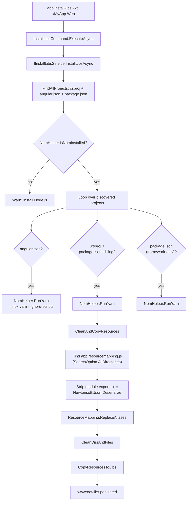

# `abp install-libs` — Populating `wwwroot/libs` for ABP projects

`abp install-libs` is the command that turns an ABP Framework solution from "compiles" into "runs in a browser". MVC, Razor Pages, Blazor Server, and Blazor WebAssembly templates all expect a set of client-side assets (LeptonX CSS, jQuery, Datatables, Tom-Select, etc.) to be available under `wwwroot/libs`. Those assets are NPM packages declared in the project's `package.json` and copied to disk according to rules in `abp.resourcemapping.js`. `install-libs` performs both halves: it runs `yarn` to populate `node_modules`, then copies the relevant files into `wwwroot/libs` based on the mapping file. For Angular and standalone JavaScript projects it simply runs `yarn` because their build chain handles the asset copy itself.

The command class is `InstallLibsCommand` (`framework/src/Volo.Abp.Cli.Core/Volo/Abp/Cli/Commands/InstallLibsCommand.cs`); the worker class is `InstallLibsService` in `framework/src/Volo.Abp.Cli.Core/Volo/Abp/Cli/LIbs/` (note the unusual casing of the folder, kept for backwards compatibility).

## Command surface

`InstallLibsCommand` is short enough to read in one go:

```csharp
// framework/src/Volo.Abp.Cli.Core/Volo/Abp/Cli/Commands/InstallLibsCommand.cs
public class InstallLibsCommand : IConsoleCommand, ITransientDependency
{
    public const string Name = "install-libs";

    public ILogger<InstallLibsCommand> Logger { get; set; }
    protected IInstallLibsService InstallLibsService { get; }

    public InstallLibsCommand(IInstallLibsService installLibsService)
    {
        InstallLibsService = installLibsService;
        Logger = NullLogger<InstallLibsCommand>.Instance;
    }

    public async Task ExecuteAsync(CommandLineArgs commandLineArgs)
    {
        var workingDirectoryArg = commandLineArgs.Options.GetOrNull(
            Options.WorkingDirectory.Short, Options.WorkingDirectory.Long);

        var workingDirectory = workingDirectoryArg ?? Directory.GetCurrentDirectory();

        if (!Directory.Exists(workingDirectory))
        {
            throw new CliUsageException(
                "Specified directory does not exist." +
                Environment.NewLine + Environment.NewLine +
                GetUsageInfo());
        }

        await InstallLibsService.InstallLibsAsync(workingDirectory);
    }
    // ...usage + GetShortDescription + Options.WorkingDirectory
}
```

The single option (`-wd` / `--working-directory`) overrides the current directory; everything else lives behind `IInstallLibsService`. The interface itself, in `framework/src/Volo.Abp.Cli.Core/Volo/Abp/Cli/LIbs/IInstallLibsService.cs`, has one member:

```csharp
public interface IInstallLibsService
{
    Task InstallLibsAsync(string directory);
}
```

`InstallLibsService` (`framework/src/Volo.Abp.Cli.Core/Volo/Abp/Cli/LIbs/InstallLibsService.cs`) is the default implementation, marked `ITransientDependency`. The same service is reused by `NewCommand.RunInstallLibsForWebTemplateAsync` and by `NpmPackagesUpdater.Update` after a successful version bump.

## Project discovery

`InstallLibsAsync` first asks the file system "what kind of projects live here?" via `FindAllProjects(directory)`. The method walks the directory tree, applying an exclusion list that lives at the top of the file:

```csharp
private readonly static List<string> ExcludeDirectory = new List<string>
{
    "node_modules",
    ".git",
    ".idea",
    "_templates",
    Path.Combine("bin", "debug"),
    Path.Combine("obj", "debug")
};
```

Three searches run in parallel inside `FindAllProjects`:

1. **`.csproj` files** that contain `Microsoft.NET.Sdk.Web`, `Microsoft.NET.Sdk.Razor`, or `Microsoft.NET.Sdk.BlazorWebAssembly` in their text and have a sibling `package.json`. These are the MVC / Razor / Blazor projects that need the full mapping-aware install.
2. **`angular.json` files** — wherever they appear, that directory is treated as an Angular workspace.
3. **`package.json` files** that do not sit next to an Angular workspace or a `.csproj`, but whose dependencies include `react-native`, `next`, `vue`, or `react`. These are standalone JS framework apps shipped by some ABP templates.

`DetectFrameworkTypeFromPackageJson` (also in `InstallLibsService.cs`) does the framework classification by parsing the `package.json` with `JObject.Parse` and probing both `dependencies` and `devDependencies` keys (case-insensitive `HashSet<string>`). It prioritises React Native over React because the `react-native` package declares `react` as a peer dependency.

```csharp
if (dependencies.Contains("react-native")) return JavaScriptFrameworkType.ReactNative;
if (dependencies.Contains("next"))         return JavaScriptFrameworkType.NextJs;
if (dependencies.Contains("vue"))          return JavaScriptFrameworkType.Vue;
if (dependencies.Contains("react"))        return JavaScriptFrameworkType.React;
return JavaScriptFrameworkType.None;
```

## Per-project handling

After discovery, `InstallLibsAsync` iterates the union of project paths and dispatches by extension:

```csharp
foreach (var projectPath in projectPaths)
{
    var projectDirectory = Path.GetDirectoryName(projectPath);

    if (projectPath.EndsWith("angular.json"))
    {
        NpmHelper.RunYarn(projectDirectory);
    }

    if (projectPath.EndsWith(".csproj"))
    {
        var packageJsonFilePath = Path.Combine(Path.GetDirectoryName(projectPath), "package.json");
        if (!File.Exists(packageJsonFilePath)) continue;

        NpmHelper.RunYarn(projectDirectory);
        await CleanAndCopyResources(projectDirectory);
    }

    if (projectPath.EndsWith("package.json"))
    {
        var frameworkType = DetectFrameworkTypeFromPackageJson(projectPath);
        if (frameworkType != JavaScriptFrameworkType.None)
        {
            // ...log framework name...
            NpmHelper.RunYarn(projectDirectory);
        }
    }
}
```

Three cases, three behaviours:

- **Angular** — just `yarn`. The Angular CLI handles bundling on its own; there is no `wwwroot/libs` to fill.
- **`.csproj` + `package.json`** — run `yarn` to populate `node_modules`, then call `CleanAndCopyResources` to honour `abp.resourcemapping.js`.
- **Standalone JS framework** — log the framework name and run `yarn`. No `wwwroot/libs` mapping because the framework's own build (Next.js / Vite / Metro) handles assets.

`NpmHelper.RunYarn` (in `framework/src/Volo.Abp.Cli.Core/Volo/Abp/Cli/Utils/NpmHelper.cs`) does **not** require global `yarn`:

```csharp
public void RunYarn(string directory)
{
    Logger.LogInformation($"Running Yarn on {directory}");
    CmdHelper.RunCmd($"npx yarn --ignore-scripts", directory);
}
```

The `npx yarn` invocation pulls a Yarn 1.x binary on demand. The `--ignore-scripts` flag matters: it stops `node-gyp` builds in transitive dependencies from breaking the install on machines without a C++ toolchain.

## Pre-flight: NPM detection

Before any of the loops run, `InstallLibsAsync` checks that NPM itself is installed:

```csharp
if (!NpmHelper.IsNpmInstalled())
{
    Logger.LogWarning("NPM is not installed, visit https://nodejs.org/en/download/ and install NPM");
    return;
}
```

`NpmHelper.IsNpmInstalled` shells out to `npm -v` and parses the output as a `SemanticVersion`. There is also an `IsYarnAvailable()` helper that requires yarn `> 1.20.0`, but the install-libs flow does not call it because `RunYarn` uses `npx`. The Yarn check is reserved for paths that need a globally installed Yarn (used elsewhere in the CLI, e.g. by some legacy commands).

## `abp.resourcemapping.js` and `ResourceMapping`

For MVC/Razor/Blazor projects, the real work is in `CleanAndCopyResources(string fileDirectory)`. The method scans the project directory for every `abp.resourcemapping.js` file (modules often ship their own), deserialises each, merges them, and applies the union as a single sweep over `wwwroot/libs`:

```csharp
var mappingFiles = Directory.GetFiles(fileDirectory, "abp.resourcemapping.js", SearchOption.AllDirectories);
var resourceMapping = new ResourceMapping
{
    Clean = new List<string> { LibsDirectory }   // LibsDirectory = "./wwwroot/libs"
};

foreach (var mappingFile in mappingFiles)
{
    using (var reader = File.OpenText(mappingFile))
    {
        var mappingFileContent = await reader.ReadToEndAsync();

        // System.Text.Json doesn't support the property name without quotes.
        var mapping = Newtonsoft.Json.JsonConvert.DeserializeObject<ResourceMapping>(mappingFileContent
            .Replace("module.exports", string.Empty)
            .Replace("=", string.Empty).Trim().TrimEnd(';'));

        mapping.ReplaceAliases();
        // ...merge into resourceMapping...
    }
}

EnsureLibsFolderExists(fileDirectory, LibsDirectory);
CleanDirsAndFiles(fileDirectory, resourceMapping);
CopyResourcesToLibs(fileDirectory, resourceMapping);
```

The `abp.resourcemapping.js` files are not strict JSON — they look like:

```js
module.exports = {
  aliases: {
    "@node_modules": "./node_modules"
  },
  clean: ["./wwwroot/libs"],
  mappings: {
    "@node_modules/@abp/bootstrap/dist/css/abp.css": "@libs/abp/css/",
    "@node_modules/jquery/dist/jquery.js": "@libs/jquery/"
  }
};
```

The CLI normalises the file into JSON by stripping the leading `module.exports`, the `=`, and the trailing `;`, then feeds the rest to Newtonsoft.Json. (The comment in the source explains why Newtonsoft instead of `System.Text.Json` — unquoted property names.)

`ResourceMapping` (`framework/src/Volo.Abp.Cli.Core/Volo/Abp/Cli/LIbs/ResourceMapping.cs`) is a small POCO:

```csharp
public class ResourceMapping
{
    public Dictionary<string, string> Aliases { get; set; }
    public List<string> Clean { get; set; }
    public Dictionary<string, string> Mappings { get; set; }

    public ResourceMapping()
    {
        Aliases = new Dictionary<string, string>
        {
            {"@node_modules", "./node_modules"},
            {"@libs", "./wwwroot/libs"},
        };
        Clean = new List<string>();
        Mappings = new Dictionary<string, string>();
    }

    public void ReplaceAliases()
    {
        // for each Mappings entry: Replace "@node_modules" / "@libs" with real path
        // for each Clean entry:    Replace "@node_modules" / "@libs" with real path
    }
}
```

The two built-in aliases (`@node_modules`, `@libs`) save every module author from typing the same relative paths. Module mapping files frequently add their own aliases — `ReplaceAliases()` resolves them all before the copy loop runs.

## Clean and copy

`CleanDirsAndFiles` uses `Microsoft.Extensions.FileSystemGlobbing.Matcher` to expand every glob in `resourceMapping.Clean` and delete the matched files. After file deletion it walks the directory tree under the first clean root (typically `./wwwroot/libs`) in reverse order, removing any now-empty folders so old, no-longer-needed module directories disappear from disk:

```csharp
var directoryInfos = Directory.GetDirectories(Path.Combine(directory, resourceMapping.Clean.First()),
    "*", SearchOption.AllDirectories);
directoryInfos.Reverse();
foreach (var directoryInfo in directoryInfos)
{
    if (!Directory.EnumerateFileSystemEntries(directoryInfo).Any())
        Directory.Delete(directoryInfo);
}
```

`CopyResourcesToLibs` then iterates every entry in `resourceMapping.Mappings`. The mapping `key` is a glob (relative to the project root), and the `value` is the destination folder under `wwwroot/libs`. `FindFiles` runs the glob; each matched file is copied unless it already exists (`if (File.Exists(destFilePath)) continue`), preserving the relative `Stem` so that a glob like `@node_modules/datatables.net/**` flattens correctly under `wwwroot/libs/datatables.net/`.

`FindFiles` itself supports negation by prefixing a pattern with `!`:

```csharp
foreach (var pattern in patterns)
{
    if (pattern.StartsWith("!"))
        matcher.AddExclude(NormalizeGlob(pattern).TrimStart('!'));
    else
        matcher.AddInclude(NormalizeGlob(pattern));
}
```

`NormalizeGlob` ensures patterns that point at directories rather than files end up with a `/**` suffix so the matcher walks every descendant.

## install-libs flow



## Where `install-libs` is invoked

The command is exposed three ways:

1. **Manually** — `abp install-libs` typed by the user, dispatched by `CommandSelector` to `InstallLibsCommand`. Registered in `framework/src/Volo.Abp.Cli.Core/Volo/Abp/Cli/AbpCliCoreModule.cs` (`options.Commands[InstallLibsCommand.Name] = typeof(InstallLibsCommand)`).
2. **After `abp new`** — `NewCommand.RunInstallLibsForWebTemplateAsync` runs unless `--skip-installing-libs` (`-sib`) is set. See [new](/cli/new-command).
3. **After `abp update`** — `NpmPackagesUpdater.Update` calls `InstallLibsService.InstallLibsAsync` once every `package.json` has been rewritten so the new versions land in `wwwroot/libs` immediately. See [update](/cli/update-command).

All three callers share the same `IInstallLibsService.InstallLibsAsync(string directory)` signature.

## Constants and paths

A few constants matter for debugging:

- `InstallLibsService.LibsDirectory = "./wwwroot/libs"` — the default clean root and the destination for the `@libs` alias.
- The `_excludeDirectory` list above prevents the recursive `package.json` walk from descending into `node_modules/`, which would otherwise return the entire dependency tree.
- `Encoding.Default` is **not** used here — `InstallLibsService` only mutates files via `Directory.Delete` / `File.Copy`. The `package.json` files themselves are read by Newtonsoft.Json with its default encoding detection.

## Failure modes

Two CLI usage exceptions can be thrown from this path:

- **`Specified directory does not exist.`** — from `InstallLibsCommand.ExecuteAsync` when `-wd` points at a missing directory. Caught by `CliService.RunAsync` as a `CliUsageException`, surfaced as a `LogWarning`, exit code 1.
- **"NPM is not installed, visit https://nodejs.org/en/download/ and install NPM"** — from `InstallLibsService` when `NpmHelper.IsNpmInstalled` returns false. Surfaced as a warning, then the method returns gracefully with exit code 0. The intent is that an MVC/Blazor template can still be scaffolded on a developer machine without Node, with a clear instruction to install it later.

Errors raised by `yarn` (network, version conflicts) propagate through `ICmdHelper.RunCmd` as ordinary process exit codes; `RunYarn` does not check them, so a failed install does not abort the loop. That tradeoff keeps `install-libs` idempotent and lets the user re-run the command after fixing the upstream NPM issue without resetting state.

## Cross-references

<CardGroup cols={2}>
  <Card title="new" icon="folder-plus" href="/cli/new-command">
    Auto-runs install-libs after extracting the template ZIP.
  </Card>
  <Card title="update" icon="arrow-up" href="/cli/update-command">
    Calls `IInstallLibsService` to sync `wwwroot/libs` after package bumps.
  </Card>
</CardGroup>
