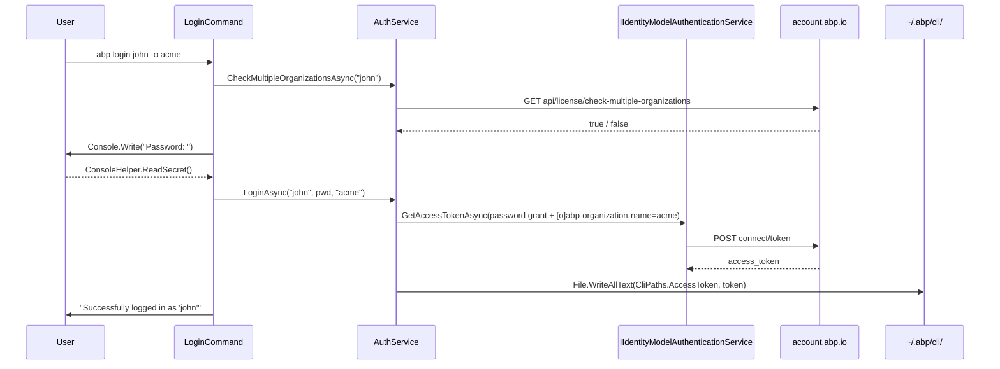

# `abp login`, `abp logout`, `abp login-info` — commercial account auth

ABP Framework ships three commands that own the developer's session against `account.abp.io`: `abp login` signs in with either a password grant or a device code grant, `abp logout` revokes the token, and `abp login-info` prints the cached profile. All three commands live in `framework/src/Volo.Abp.Cli.Core/Volo/Abp/Cli/Commands/` and delegate to a single `AuthService` that lives in `framework/src/Volo.Abp.Cli.Core/Volo/Abp/Cli/Auth/AuthService.cs`. The cached access token is the only credential the rest of the CLI ever reads — every authenticated HTTP call goes through `CliHttpClientFactory.CreateClient(needsAuthentication: true)` which calls `CliHttpClientExtensions.AddAbpAuthenticationToken` to attach the bearer token from disk.

`AuthService` implements `IAuthService` (declared in `framework/src/Volo.Abp.Cli.Core/Volo/Abp/Cli/Auth/IAuthService.cs`) and depends on `IIdentityModelAuthenticationService` from the `Volo.Abp.IdentityModel` package — the Duende-based OAuth client that the ABP commercial portal uses for both ABP Studio and the ABP CLI. The class is registered as `ITransientDependency`, so every command gets a fresh instance, but the state it cares about (the token) is on disk.

<Note>
None of the auth code calls into ASP.NET Core or HttpContext. The CLI is a standalone host running outside any web request, so the access token comes from `CliPaths.AccessToken` and is attached manually with `httpClient.SetBearerToken(accessToken)` from `Duende.IdentityModel.Client`.
</Note>

## The `CliPaths.AccessToken` file

`CliPaths` (in `framework/src/Volo.Abp.Cli.Core/Volo/Abp/Cli/CliPaths.cs`) collects every well-known path the CLI uses. The token, computer id, MCP cache, and log directories all live under `~/.abp/`. The token specifically is written to `~/.abp/cli/access-token.bin`:

```csharp
// framework/src/Volo.Abp.Cli.Core/Volo/Abp/Cli/CliPaths.cs
public static string Root => Path.Combine(AbpRootPath, "cli");
public static string AccessToken => Path.Combine(AbpRootPath, "cli", "access-token.bin");
public static string Lic => Path.Combine(Path.GetTempPath(), Encoding.ASCII.GetString(
    new byte[] { 65, 98, 112, 76, 105, 99, 101, 110, 115, 101, 46, 98, 105, 110 })); // "AbpLicense.bin"
public static readonly string AbpRootPath = Path.Combine(
    Environment.GetFolderPath(Environment.SpecialFolder.UserProfile), ".abp");
```

The `.bin` suffix is misleading — the file is plain UTF-8 text containing the access token. `AuthService.LoginAsync` writes it with `File.WriteAllText(CliPaths.AccessToken, accessToken, Encoding.UTF8)` after ensuring `CliPaths.Root` exists. The companion file `CliPaths.Lic` is the license cache under `%TEMP%/AbpLicense.bin`; `LogoutAsync` deletes it as part of the sign-out sequence.

<CardGroup cols={2}>
  <Card title="access-token.bin" icon="key">
    Bearer token cached after `abp login` succeeds. Read by `CliHttpClientExtensions.AddAbpAuthenticationToken` every time `CliHttpClientFactory.CreateClient(needsAuthentication: true)` is called.
  </Card>
  <Card title="AbpLicense.bin" icon="certificate">
    License blob the commercial templates check. Path obfuscated with an ASCII byte literal in `CliPaths.cs` so it isn't trivially grep-able, but the bytes spell out `AbpLicense.bin`. Deleted by `AuthService.LogoutAsync`.
  </Card>
  <Card title="computer-id.bin" icon="computer">
    Stable per-machine identifier used by telemetry collection. Created lazily under `CliPaths.ComputerId`.
  </Card>
  <Card title="cli/logs/" icon="file-lines">
    Serilog file sink target referenced by `CliPaths.Log`. The MCP server also writes to `CliPaths.McpLog` here.
  </Card>
</CardGroup>

## `LoginCommand` and its two grant flows

`framework/src/Volo.Abp.Cli.Core/Volo/Abp/Cli/Commands/LoginCommand.cs` accepts a positional `<username>` and three options: `-p|--password`, `-o|--organization`, and the bare `--device` switch. Its `ExecuteAsync` chooses between the password grant and the device code grant based on whether `--device` is present:

```csharp
// framework/src/Volo.Abp.Cli.Core/Volo/Abp/Cli/Commands/LoginCommand.cs
public async Task ExecuteAsync(CommandLineArgs commandLineArgs)
{
    if (!commandLineArgs.Options.ContainsKey("device"))
    {
        if (commandLineArgs.Target.IsNullOrEmpty())
        {
            throw new CliUsageException("Username name is missing!" + ...);
        }

        var organization = commandLineArgs.Options.GetOrNull(
            Options.Organization.Short, Options.Organization.Long);

        if (await HasMultipleOrganizationAndThisNotSpecified(commandLineArgs, organization))
        {
            return;
        }

        var password = commandLineArgs.Options.GetOrNull(Options.Password.Short, Options.Password.Long);
        if (password == null)
        {
            Console.Write("Password: ");
            password = ConsoleHelper.ReadSecret();
        }

        await AuthService.LoginAsync(commandLineArgs.Target, password, organization);
        Logger.LogInformation($"Successfully logged in as '{commandLineArgs.Target}'");
    }
    else
    {
        await AuthService.DeviceLoginAsync();
        var loginInfo = await AuthService.GetLoginInfoAsync();
        Logger.LogInformation($"Successfully logged in as '{loginInfo.Username}'");
    }
}
```

`ConsoleHelper.ReadSecret` (in `framework/src/Volo.Abp.Cli.Core/Volo/Abp/Cli/Utils/ConsoleHelper.cs`) masks every keystroke as `*`, so `abp login john` followed by an interactive prompt never echoes the password. The error mapper `LogCliError` recognises a handful of well-known server messages — `"Invalid username or password"`, `"RequiresTwoFactor"` (in which case it directs the user to `abp login --device`), and an HTML error page that ships as a stringified small-tag snippet.

### Password grant

`AuthService.LoginAsync` builds an `IdentityClientConfiguration` with `OidcConstants.GrantTypes.Password` against `CliUrls.AccountAbpIo` (`https://account.abp.io/` by default, see `framework/src/Volo.Abp.Cli.Core/Volo/Abp/Cli/CliUrls.cs`). The client id is the literal string `"abp-cli"`, the requested scope is `"abpio offline_access"`, and there is no client secret:

```csharp
// framework/src/Volo.Abp.Cli.Core/Volo/Abp/Cli/Auth/AuthService.cs
public async Task LoginAsync(string userName, string password, string organizationName = null)
{
    var configuration = new IdentityClientConfiguration(
        CliUrls.AccountAbpIo,
        "abpio offline_access",
        "abp-cli",
        null,
        OidcConstants.GrantTypes.Password,
        userName,
        password);

    if (!organizationName.IsNullOrWhiteSpace())
    {
        configuration["[o]abp-organization-name"] = organizationName;
    }

    var accessToken = await AuthenticationService.GetAccessTokenAsync(configuration);

    if (!Directory.Exists(CliPaths.Root))
    {
        Directory.CreateDirectory(CliPaths.Root);
    }
    File.WriteAllText(CliPaths.AccessToken, accessToken, Encoding.UTF8);
}
```

The `[o]abp-organization-name` key is a `Volo.Abp.IdentityModel` convention — the `[o]` prefix tells `IdentityModelAuthenticationService` to forward the value as an OAuth extra parameter rather than a client configuration property. That parameter is how the multi-tenant ABP commercial portal resolves which organization the user is signing in to.

### Device code grant

`AuthService.DeviceLoginAsync` constructs the same `IdentityClientConfiguration` but with `OidcConstants.GrantTypes.DeviceCode`. The Duende implementation prints a verification URL and code on stdout, polls the token endpoint, and returns the access token once the browser-side approval completes. No password ever enters the CLI process in this flow, which is why two-factor accounts must use it:

```csharp
// framework/src/Volo.Abp.Cli.Core/Volo/Abp/Cli/Auth/AuthService.cs
public async Task DeviceLoginAsync()
{
    var configuration = new IdentityClientConfiguration(
        CliUrls.AccountAbpIo,
        "abpio offline_access",
        "abp-cli",
        null,
        OidcConstants.GrantTypes.DeviceCode);

    var accessToken = await AuthenticationService.GetAccessTokenAsync(configuration);

    File.WriteAllText(CliPaths.AccessToken, accessToken, Encoding.UTF8);
}
```

<Warning>
`DeviceLoginAsync` does not call `Directory.CreateDirectory(CliPaths.Root)` before writing the token — it assumes the password path ran first or that the user has previously used the CLI. If `~/.abp/cli/` does not exist yet, the device flow will throw a `DirectoryNotFoundException` on the `File.WriteAllText` line. This is a minor quirk worth being aware of for fresh installs.
</Warning>

### Multi-organization preflight

When `--organization` is not supplied, `LoginCommand.HasMultipleOrganizationAndThisNotSpecified` calls `AuthService.CheckMultipleOrganizationsAsync` against `api/license/check-multiple-organizations?username=<user>` on the account server. The endpoint returns a boolean — if `true`, the CLI prints "You have multiple organizations, please specify your organization with `--organization` parameter." and short-circuits without ever calling `LoginAsync`. That preflight is the reason `abp login` may make one HTTP call before the actual token request.

## `LogoutCommand` and remote revocation

`framework/src/Volo.Abp.Cli.Core/Volo/Abp/Cli/Commands/LogoutCommand.cs` is a thin wrapper: it just calls `AuthService.LogoutAsync` and logs `"You are logged out."`. The real work is in `AuthService.LogoutAsync`:

```csharp
// framework/src/Volo.Abp.Cli.Core/Volo/Abp/Cli/Auth/AuthService.cs
public async Task LogoutAsync()
{
    string accessToken = null;
    if (File.Exists(CliPaths.AccessToken))
    {
        accessToken = File.ReadAllText(CliPaths.AccessToken);
        File.Delete(CliPaths.AccessToken);
    }

    if (File.Exists(CliPaths.Lic))
    {
        if (!string.IsNullOrWhiteSpace(accessToken))
        {
            await LogoutAsync(accessToken);
        }

        File.Delete(CliPaths.Lic);
    }
}
```

The method intentionally deletes the local token first, then fires the remote revocation. If the network call fails (`CliConsts.LogoutUrl` unreachable, response is non-2xx) the CLI logs a warning but does not throw — the local state is already cleared. The remote endpoint posts `{ "token": "<access-token>" }` as JSON via `CliHttpClientFactory.CreateClient()`, and the URL is the `CliConsts.LogoutUrl` constant declared in `framework/src/Volo.Abp.Cli.Core/Volo/Abp/Cli/CliConsts.cs`.

`LogoutAsync` also deletes `CliPaths.Lic` (`AbpLicense.bin` in `%TEMP%`). That covers the case where a commercial template wrote a license blob during `dotnet run` and the user expects `abp logout` to wipe it. The two deletes are independent: removing the token without removing the license, or removing the license without the token, is consistent with the file-existence guards.

## `LoginInfoCommand` and the profile endpoint

`framework/src/Volo.Abp.Cli.Core/Volo/Abp/Cli/Commands/LoginInfoCommand.cs` prints the cached login profile by calling `AuthService.GetLoginInfoAsync`, which in turn calls `GET {AccountAbpIo}api/license/login-info` with the current bearer token and deserializes the JSON body into a `LoginInfo` DTO declared in `framework/src/Volo.Abp.Cli.Core/Volo/Abp/Cli/Auth/LoginInfo.cs`:

```csharp
// framework/src/Volo.Abp.Cli.Core/Volo/Abp/Cli/Auth/LoginInfo.cs
public class LoginInfo
{
    public Guid? Id { get; set; }
    public string Name { get; set; }
    public string Surname { get; set; }
    public string Username { get; set; }
    public string EmailAddress { get; set; }
    public string Organization { get; set; }
    public bool HasSourceCodeAccess { get; set; }
}
```

`HasSourceCodeAccess` is the flag the commercial templates check before `abp get-source` is allowed to fetch a Pro module — see [`cli/source-and-modules`](/cli/source-and-modules) for the consumer side. The endpoint call uses `GetHttpResponseMessageWithRetryAsync` with the default Polly retry policy (2s, 4s, 7s), so transient outages on `account.abp.io` do not immediately surface as a sign-in failure.

```csharp
// framework/src/Volo.Abp.Cli.Core/Volo/Abp/Cli/Auth/AuthService.cs
public async Task<LoginInfo> GetLoginInfoAsync()
{
    if (!IsLoggedIn())
    {
        return null;
    }

    var url = $"{CliUrls.AccountAbpIo}api/license/login-info";
    var client = CliHttpClientFactory.CreateClient();

    using (var response = await client.GetHttpResponseMessageWithRetryAsync(
        url, CancellationTokenProvider.Token, Logger))
    {
        if (!response.IsSuccessStatusCode)
        {
            Logger.LogError($"Remote server returns '{response.StatusCode}'");
            return null;
        }

        await RemoteServiceExceptionHandler.EnsureSuccessfulHttpResponseAsync(response);
        var responseContent = await response.Content.ReadAsStringAsync();
        return JsonSerializer.Deserialize<LoginInfo>(responseContent);
    }
}
```

`AuthService.IsLoggedIn()` is the simple `File.Exists(CliPaths.AccessToken)` probe that gates every authenticated call in the CLI. `LoginInfoCommand.ExecuteAsync` checks it first and prints `"You are not logged in."` without making any HTTP call when the file is absent.

## How the token reaches every other command

`CliHttpClientFactory.CreateClient(needsAuthentication: true)` is the single entry point that injects the token into subsequent requests:

```csharp
// framework/src/Volo.Abp.Cli.Core/Volo/Abp/Cli/Http/CliHttpClientFactory.cs
public HttpClient CreateClient(bool needsAuthentication = true, TimeSpan? timeout = null, string clientName = null)
{
    var httpClient = _clientFactory.CreateClient(clientName ?? CliConsts.HttpClientName);
    httpClient.Timeout = timeout ?? DefaultTimeout;

    if (needsAuthentication)
    {
        httpClient.AddAbpAuthenticationToken();
    }

    return httpClient;
}
```

```csharp
// framework/src/Volo.Abp.Cli.Core/Volo/Abp/Cli/Http/CliHttpClientExtensions.cs
public static void AddAbpAuthenticationToken(this HttpClient httpClient)
{
    if (!AuthService.IsLoggedIn())
    {
        return;
    }

    var accessToken = File.ReadAllText(CliPaths.AccessToken, Encoding.UTF8);
    if (!accessToken.IsNullOrEmpty())
    {
        httpClient.SetBearerToken(accessToken);
    }
}
```

The flow has three implications worth understanding. First, every HTTP call in the CLI reads the token from disk on demand — there is no in-memory cache, so removing `access-token.bin` mid-process immediately stops new requests from being authenticated. Second, the same file is shared with ABP Studio because both tools use the same `CliPaths` constants, so signing in via either tool authenticates the other. Third, calls that explicitly pass `needsAuthentication: false` (such as `AbpIoSourceCodeStore` when downloading public templates) skip the token attachment entirely — the public mirror does not require auth.

## Sequence — `abp login john -o acme`



The device flow replaces the password grant block with the standard RFC 8628 polling exchange, which `IIdentityModelAuthenticationService` handles internally — `AuthService` never sees the user code, only the final token.

## Errors you may see

<AccordionGroup>
  <Accordion title="Invalid username or password!" icon="circle-exclamation">
    Mapped from the OAuth `invalid_grant` error inside `LoginCommand.LogCliError`. The fix is to verify the credentials on `https://account.abp.io/`.
  </Accordion>
  <Accordion title="Two factor authentication is enabled for your account" icon="shield-halved">
    Mapped from `RequiresTwoFactor`. `LogCliError` prints "Please use `abp login --device` command to login." because the password grant cannot relay a 2FA challenge.
  </Accordion>
  <Accordion title="You have multiple organizations, please specify your organization" icon="building">
    Emitted by `LoginCommand.HasMultipleOrganizationAndThisNotSpecified` before the token request is made. Re-run with `-o <org-slug>`.
  </Accordion>
  <Accordion title="You are not logged in." icon="user-slash">
    Returned by both `LoginInfoCommand` and any authenticated command that calls `AuthService.IsLoggedIn()` first. `~/.abp/cli/access-token.bin` does not exist or was deleted.
  </Accordion>
  <Accordion title="Cannot logout from remote service! Response: ..." icon="plug-circle-xmark">
    Warning-level message from `AuthService.LogoutAsync(string)`. The local token has already been deleted; the warning means the revocation endpoint did not return 2xx.
  </Accordion>
</AccordionGroup>

## Related building blocks

- `CliHttpClientHandler` in `framework/src/Volo.Abp.Cli.Core/Volo/Abp/Cli/Http/CliHttpClientHandler.cs` configures the system web proxy and `CredentialCache.DefaultCredentials`, which lets the OAuth call traverse corporate proxies.
- `RemoteServiceExceptionHandler` in `framework/src/Volo.Abp.Cli.Core/Volo/Abp/Cli/ProjectBuilding/RemoteServiceExceptionHandler.cs` is shared between `AuthService.GetLoginInfoAsync` and the package endpoints documented in [`cli/source-and-modules`](/cli/source-and-modules).
- The `IApiKeyService` implementation `AbpIoApiKeyService` in `framework/src/Volo.Abp.Cli.Core/Volo/Abp/Cli/Licensing/AbpIoApiKeyService.cs` uses the same bearer token to fetch the developer api key the project templates need.
- `MemoryService` in `framework/src/Volo.Abp.Cli.Core/Volo/Abp/Cli/Memory/MemoryService.cs` writes auxiliary state to `memory.bin` next to the running assembly. It is not auth-related but shares the "single file, no encryption" philosophy of `AccessToken`.

Once the token is on disk, every downstream command — `abp new`, `abp add-module`, `abp get-source`, `abp mcp` — can call `account.abp.io` and `nuget.abp.io` without ever asking the user for credentials again. The MCP command additionally double-checks the license expiry inside `McpCommand.ValidateLicenseAsync`, so a stale token will refuse to start the MCP server even though the file exists.
