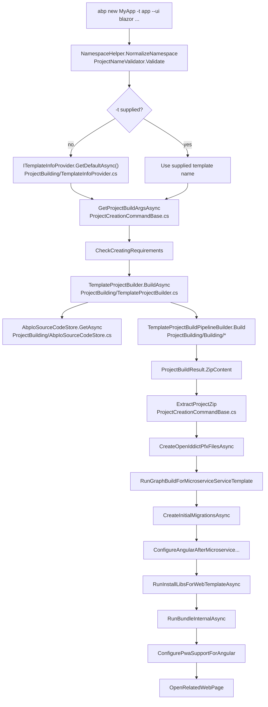

# `abp new` — Scaffolding a new ABP solution

`abp new <ProjectName>` is the entry point users hit on day one. Behind the friendly surface the command orchestrates ten or so collaborators in `Volo.Abp.Cli.Core`: it normalises arguments, picks a template, downloads the template ZIP from `abp.io`, replaces placeholders, writes the result to disk, and then runs follow-up steps like `install-libs`, `bundle`, the initial EF Core migration, and the OpenIddict PFX certificate generation. The orchestrator class is `NewCommand`, and almost all of its work is inherited from `ProjectCreationCommandBase`. Both live in `framework/src/Volo.Abp.Cli.Core/Volo/Abp/Cli/Commands/`.

## Class hierarchy

```csharp
// framework/src/Volo.Abp.Cli.Core/Volo/Abp/Cli/Commands/NewCommand.cs
public class NewCommand : ProjectCreationCommandBase, IConsoleCommand, ITransientDependency
{
    public const string Name = "new";
    // ...
}
```

`ProjectCreationCommandBase` (`framework/src/Volo.Abp.Cli.Core/Volo/Abp/Cli/Commands/ProjectCreationCommandBase.cs`) carries the `Options` constant pattern, the post-build pipeline helpers, and the inheritable `GetProjectBuildArgsAsync` method. `NewCommand` itself only contributes:

1. The `Name = "new"` constant.
2. An `ExecuteAsync` that strings the base methods together.
3. A `TemplateProjectBuilder` field — the one collaborator that does the actual template download.
4. Telemetry tagging that distinguishes solution creates from module creates.

The same base class is reused by tools that need the project-creation workflow without exposing the `new` command name.

## Constructor injection map

`NewCommand`'s constructor pulls in every collaborator the create flow needs. The list is worth reading because each item maps to one step downstream:

| Constructor parameter | Source file | Role |
| --- | --- | --- |
| `ConnectionStringProvider` | `framework/src/Volo.Abp.Cli.Core/Volo/Abp/Cli/Commands/Services/ConnectionStringProvider.cs` | Derives a default connection string per DBMS when the user does not pass `--connection-string`. |
| `SolutionPackageVersionFinder` | `framework/src/Volo.Abp.Cli.Core/Volo/Abp/Cli/ProjectModification/SolutionPackageVersionFinder.cs` | Reads `Volo.Abp.*` package versions from the parent microservice solution for service templates. |
| `ICmdHelper` | `framework/src/Volo.Abp.Cli.Core/Volo/Abp/Cli/Utils/CmdHelper.cs` | Wraps `Process.Start` for `dotnet`, `npm`, `yarn`, `gulp`, `dotnet ef`. |
| `IInstallLibsService` | `framework/src/Volo.Abp.Cli.Core/Volo/Abp/Cli/LIbs/InstallLibsService.cs` | Runs `yarn` + resource copy after the template is extracted. |
| `CliService` | `framework/src/Volo.Abp.Cli.Core/Volo/Abp/Cli/CliService.cs` | Allows the create flow to recursively invoke other commands. |
| `AngularPwaSupportAdder` | `framework/src/Volo.Abp.Cli.Core/Volo/Abp/Cli/ProjectModification/AngularPwaSupportAdder.cs` | Adds `@angular/pwa` when `-p` is passed. |
| `InitialMigrationCreator` | `framework/src/Volo.Abp.Cli.Core/Volo/Abp/Cli/Commands/Services/InitialMigrationCreator.cs` | Runs `dotnet ef migrations add Initial` against the EF migrations project. |
| `ThemePackageAdder` | `framework/src/Volo.Abp.Cli.Core/Volo/Abp/Cli/ProjectModification/ThemePackageAdder.cs` | Swaps the default LeptonX theme packages when `--theme` is used. |
| `ILocalEventBus` | `framework/src/Volo.Abp.EventBus` | Publishes `ProjectCreationProgressEvent` / `ProjectPostRequirementsCheckedEvent` for IDE integrations. |
| `IBundlingService` | `framework/src/Volo.Abp.Cli.Core/Volo/Abp/Cli/Bundling/BundlingService.cs` | Runs `abp bundle` after the project is on disk. |
| `ITemplateInfoProvider` | `framework/src/Volo.Abp.Cli.Core/Volo/Abp/Cli/ProjectBuilding/TemplateInfoProvider.cs` | Resolves the default template name when `-t` is omitted. |
| `TemplateProjectBuilder` | `framework/src/Volo.Abp.Cli.Core/Volo/Abp/Cli/ProjectBuilding/TemplateProjectBuilder.cs` | The pipeline that turns `ProjectBuildArgs` into a ZIP byte array. |
| `AngularThemeConfigurer` | `framework/src/Volo.Abp.Cli.Core/Volo/Abp/Cli/ProjectModification/AngularThemeConfigurer.cs` | Rewrites `angular.json` to point at the chosen theme. |
| `CliVersionService` | `framework/src/Volo.Abp.Cli.Core/Volo/Abp/Cli/Version/CliVersionService.cs` | Enforces "preview templates require a preview CLI" in Release builds. |
| `ITelemetryService` | `framework/src/Volo.Abp.Cli.Core/Volo/Abp/Cli/Telemetry/*` | Records `AbpCliCommandsNewSolution` or `AbpCliCommandsNewModule`. |

## `ExecuteAsync` step by step

The entire method is small enough to inspect at once. Open `framework/src/Volo.Abp.Cli.Core/Volo/Abp/Cli/Commands/NewCommand.cs`:

```csharp
public async Task ExecuteAsync(CommandLineArgs commandLineArgs)
{
    var projectName = NamespaceHelper.NormalizeNamespace(commandLineArgs.Target);
    if (string.IsNullOrWhiteSpace(projectName))
        throw new CliUsageException("Project name is missing!" + Environment.NewLine + Environment.NewLine + GetUsageInfo());

    ProjectNameValidator.Validate(projectName);

    Logger.LogInformation("Creating your project...");
    Logger.LogInformation("Project name: " + projectName);

    var template = commandLineArgs.Options.GetOrNull(Options.Template.Short, Options.Template.Long);
    if (template != null)
        Logger.LogInformation("Template: " + template);
    else
        template = (await TemplateInfoProvider.GetDefaultAsync()).Name;

    var isTiered = commandLineArgs.Options.ContainsKey(Options.Tiered.Long);
    if (isTiered) Logger.LogInformation("Tiered: yes");

    var projectArgs = await GetProjectBuildArgsAsync(commandLineArgs, template, projectName);
    await CheckCreatingRequirements(projectArgs);

    var result = await TemplateProjectBuilder.BuildAsync(projectArgs);

    // ...telemetry...

    ExtractProjectZip(result, projectArgs.OutputFolder);
    Logger.LogInformation($"'{projectName}' has been successfully created to '{projectArgs.OutputFolder}'");
    await CheckCreatedRequirements(projectArgs);

    await CreateOpenIddictPfxFilesAsync(projectArgs);
    await RunGraphBuildForMicroserviceServiceTemplate(projectArgs);
    await CreateInitialMigrationsAsync(projectArgs);
    await ConfigureAngularAfterMicroserviceServiceCreatedAsync(projectArgs, template);

    var skipInstallLibs = commandLineArgs.Options.ContainsKey(Options.SkipInstallingLibs.Long)
                       || commandLineArgs.Options.ContainsKey(Options.SkipInstallingLibs.Short);
    if (!skipInstallLibs)
    {
        await RunInstallLibsForWebTemplateAsync(projectArgs);
        ConfigureAngularJsonForThemeSelection(projectArgs);
    }

    var skipBundling = commandLineArgs.Options.ContainsKey(Options.SkipBundling.Long)
                    || commandLineArgs.Options.ContainsKey(Options.SkipBundling.Short);
    if (!skipBundling)
        await RunBundleInternalAsync(projectArgs);

    await ConfigurePwaSupportForAngular(projectArgs);

    if (!commandLineArgs.Options.ContainsKey(Options.NoOpenWebPage.Long))
        OpenRelatedWebPage(projectArgs, template, isTiered, commandLineArgs);
}
```

The flow has four phases: argument validation, template resolution, build, and post-build. The Mermaid diagram below maps each box back to a method.



## `ProjectBuildArgs` — the parsed command

`GetProjectBuildArgsAsync` in `framework/src/Volo.Abp.Cli.Core/Volo/Abp/Cli/Commands/ProjectCreationCommandBase.cs` translates `CommandLineArgs` into a `ProjectBuildArgs` record. It reads roughly a dozen options:

```csharp
var version = commandLineArgs.Options.GetOrNull(Options.Version.Short, Options.Version.Long);
var preview = commandLineArgs.Options.ContainsKey(Options.Preview.Long);
var pwa = commandLineArgs.Options.ContainsKey(Options.ProgressiveWebApp.Short);
var databaseProvider = GetDatabaseProvider(commandLineArgs);              // -d ef|mongodb
var connectionString = GetConnectionString(commandLineArgs);              // -cs / --connection-string
var databaseManagementSystem = GetDatabaseManagementSystem(commandLineArgs); // --dbms postgres|mysql|...
var uiFramework = GetUiFramework(commandLineArgs, template);              // -u mvc|angular|blazor|none
var publicWebSite = uiFramework != UiFramework.None
    && commandLineArgs.Options.ContainsKey(Options.PublicWebSite.Long);   // --with-public-website
var mobileApp = GetMobilePreference(commandLineArgs, template);           // -m none|maui|react-native
var gitHubAbpLocalRepositoryPath = commandLineArgs.Options.GetOrNull(Options.GitHubAbpLocalRepositoryPath.Long); // --abp-path
var gitHubVoloLocalRepositoryPath = commandLineArgs.Options.GetOrNull(Options.GitHubVoloLocalRepositoryPath.Long); // --volo-path
var templateSource = commandLineArgs.Options.GetOrNull(Options.TemplateSource.Short, Options.TemplateSource.Long); // -ts
var outputFolder = commandLineArgs.Options.GetOrNull(Options.OutputFolder.Short, Options.OutputFolder.Long);       // -o
```

Two pieces of conditional logic are worth calling out:

- **Preview gate.** When `--preview` is passed and the build is not `DEBUG`, the method asks `CliVersionService.GetCurrentCliVersionAsync()` and throws `CliUsageException("You can only create a new preview solution with preview CLI version. ...")` if the running CLI is on a stable channel.
- **Microservice service templates.** When `template` matches `MicroserviceServiceTemplateBase.IsMicroserviceServiceTemplate(...)`, the method scans the current directory for an existing `*.sln`/`*.slnx`, uses `SolutionPackageVersionFinder.FindByCsprojVersion(slnPath)` to inherit the package version, and recomputes `outputFolder` via `MicroserviceServiceTemplateBase.CalculateTargetFolder(...)` so the new service ends up under `apps/services/<Name>` rather than `./<Name>`.

A `SolutionName.Parse(projectName)` call then builds the `Acme.BookStore` / `Acme.BookStore.Web` namespace tree used throughout the template files. The final `ProjectBuildArgs` constructor (in `framework/src/Volo.Abp.Cli.Core/Volo/Abp/Cli/ProjectBuilding/ProjectBuildArgs.cs`) takes 19 parameters — it is the contract every template consumes.

## `TemplateProjectBuilder.BuildAsync`

`TemplateProjectBuilder` in `framework/src/Volo.Abp.Cli.Core/Volo/Abp/Cli/ProjectBuilding/TemplateProjectBuilder.cs` is the single `IProjectBuilder` implementation. Its `BuildAsync` does three things:

```csharp
public async Task<ProjectBuildResult> BuildAsync(ProjectBuildArgs args)
{
    var templateInfo = await GetTemplateInfoAsync(args);
    NormalizeArgs(args, templateInfo);

    await EventBus.PublishAsync(new ProjectCreationProgressEvent {
        Message = "Downloading the solution template"
    }, false);

    var templateFile = await SourceCodeStore.GetAsync(
        args.TemplateName,
        SourceCodeTypes.Template,
        args.Version,
        args.TemplateSource,
        args.ExtraProperties.ContainsKey(NewCommand.Options.Preview.Long),
        trustUserVersion: args.TrustUserVersion
    );

    ConfigureThemeOptions(args, templateFile.Version);

    // ... developer API key handling, license-code injection ...

    var context = new ProjectBuildContext(templateInfo, null, null, null, templateFile, args);

    if (context.Template is AppTemplateBase appTemplateBase)
    {
        appTemplateBase.HasDbMigrations = SemanticVersion.Parse(templateFile.Version) < new SemanticVersion(4, 3, 99);
    }

    await EventBus.PublishAsync(new ProjectCreationProgressEvent {
        Message = "Customizing the solution template"
    }, false);

    TemplateProjectBuildPipelineBuilder.Build(context).Execute();

    // ...build ProjectBuildResult zip content...
}
```

### Resolving the template

`GetTemplateInfoAsync(args)` looks up the template's metadata (display name, doc URL, default DB provider/UI) from one of the classes under `framework/src/Volo.Abp.Cli.Core/Volo/Abp/Cli/ProjectBuilding/Templates/`. Built-in templates include `AppTemplate` / `AppProTemplate` (web app), `ConsoleTemplate`, `MauiTemplate`, `MvcModuleTemplate` (`module` / `module-pro`), and the various microservice templates.

### Downloading the template ZIP

`SourceCodeStore.GetAsync` is provided by `AbpIoSourceCodeStore` in `framework/src/Volo.Abp.Cli.Core/Volo/Abp/Cli/ProjectBuilding/AbpIoSourceCodeStore.cs`. It POSTs to `abp.io` (or `account.abp.io` for commercial templates) via the named HTTP client `CliConsts.HttpClientName`, optionally authenticating with the developer's API key when a Pro template is requested. The returned `TemplateFile` carries the raw ZIP bytes plus the resolved `Version`.

When `args.TemplateSource` is set (the `-ts` flag), the store fetches the ZIP from the user-supplied URL or local path instead. This is what allows `abp new` to consume a custom nightly drop or a private branch artifact.

### The build pipeline

`TemplateProjectBuildPipelineBuilder.Build(context).Execute()` then runs the in-memory pipeline:

- Steps are defined under `framework/src/Volo.Abp.Cli.Core/Volo/Abp/Cli/ProjectBuilding/Building/`.
- Each step receives the in-memory ZIP entries (`context.TemplateFile.Bytes` unpacked into `context.Files`), mutates them, and passes the result to the next step.
- Steps include placeholder replacement (`Acme.BookStore` → user-supplied namespace), connection-string injection, UI-specific file pruning, theme swaps, and microservice-aware re-wiring.

The result of `Execute()` is a flat list of in-memory `FileEntry` records. `BuildAsync` repacks those into a ZIP and returns a `ProjectBuildResult` with `ZipContent` set.

### Developer API key and license

While the pipeline runs, `TemplateProjectBuilder.BuildAsync` also asks `IApiKeyService.GetApiKeyOrNullAsync()` (from `framework/src/Volo.Abp.Cli.Core/Volo/Abp/Cli/Auth/`). When the user has run `abp login`, the call returns a `DeveloperApiKeyResult` with `ApiKey` and `LicenseCode` properties. Both end up in `ProjectBuildArgs.ExtraProperties["api-key"]` and `["license-code"]`, so the pipeline can stamp the license into `appsettings.json` for ABP Commercial templates. The `AppProTemplate.TemplateName` branch throws `UserFriendlyException(apiKeyResult.ErrorMessage)` when the user tries to scaffold a commercial template without being logged in.

## Extracting the ZIP

Back in `ProjectCreationCommandBase.ExtractProjectZip`, the in-memory ZIP from `ProjectBuildResult.ZipContent` is written to `outputFolder` using `System.IO.Compression`. The method preserves directory structure and creates `bin/`, `obj/`, and `wwwroot/libs/` placeholders so that subsequent `install-libs` and `dotnet build` steps work without manual mkdir calls. The matching code paths in `framework/src/Volo.Abp.Cli.Core/Volo/Abp/Cli/Commands/ProjectCreationCommandBase.cs` set file write times so the project does not look "older" than the user expects in their IDE.

## Post-build steps

Each post-build step is a separate protected method on `ProjectCreationCommandBase`. They run unconditionally unless an opt-out flag is passed:

- **`CreateOpenIddictPfxFilesAsync`** generates the signing/encryption certificates expected by the OpenIddict module by calling `dotnet dev-certs`-style commands through `ICmdHelper.RunCmd`. Used by all web app templates that ship OpenIddict.
- **`RunGraphBuildForMicroserviceServiceTemplate`** invokes `dotnet build /graphBuild` on the parent microservice solution so the new service appears in the dependency graph immediately.
- **`CreateInitialMigrationsAsync`** uses `InitialMigrationCreator` to run `dotnet ef migrations add Initial` against the migrations project. The class also patches the generated `Designer.cs` files to use a stable timestamp so repeat scaffolds produce identical output.
- **`ConfigureAngularAfterMicroserviceServiceCreatedAsync`** runs `npx ng g @abp/ng.schematics:create-lib --package-name <kebabName>` inside `apps/angular` when the parent microservice solution uses Angular as its UI. The exact invocation is built in `CreateAngularLibraryAsync(...)`.
- **`RunInstallLibsForWebTemplateAsync`** delegates to `IInstallLibsService.InstallLibsAsync(outputFolder)` so the freshly extracted project gets its `wwwroot/libs` populated. The shared `install-libs` command and `NewCommand` therefore call the same code — see [`install-libs`](/cli/install-libs).
- **`RunBundleInternalAsync`** calls `IBundlingService` (Blazor only) to run `abp bundle` against the new project and write the resulting `_framework/blazor.boot.json` bundles.
- **`ConfigurePwaSupportForAngular`** invokes `AngularPwaSupportAdder` (and `npx ng add @angular/pwa`) when the `-p` flag is set and the UI is Angular.
- **`OpenRelatedWebPage`** opens the matching documentation URL in the user's browser (e.g. `abp.io/docs/latest/Get-Started`) unless `--no-open-web-page` is set.

## Telemetry

After `ExtractProjectZip`, `NewCommand` records the run:

```csharp
var activityName = ActivityNameConsts.AbpCliCommandsNewSolution;

if (ModuleTemplateBase.IsModuleTemplate(template))
{
    activityName = ActivityNameConsts.AbpCliCommandsNewModule;
}

await _telemetryService.AddActivityAsync(activityName, o =>
{
    o[ActivityPropertyNames.CreationTool] = AbpTool.OldCli;
    o[ActivityPropertyNames.Template] = template;
});
```

`ModuleTemplateBase.IsModuleTemplate` (under `framework/src/Volo.Abp.Cli.Core/Volo/Abp/Cli/ProjectBuilding/Templates/Module/`) checks whether the template is one of the module template names (`module`, `module-pro`). That branch lets ABP analytics distinguish "new solution" creates from "new module" creates without overloading a single activity. Telemetry is suppressed entirely when `ABP_STUDIO_ENABLE_TELEMETRY=false` (see [Program Entry](/cli/program-entry)).

## Post-create requirement checks

`CheckCreatedRequirements(projectArgs)` runs after `ExtractProjectZip` and warns when expected infrastructure is missing. The current implementation only checks Redis:

```csharp
if (projectArgs.ExtraProperties.ContainsKey("PreRequirements:Redis"))
{
    var isConnected = false;
    try
    {
        var redis = await ConnectionMultiplexer.ConnectAsync("127.0.0.1",
            options => options.ConnectTimeout = 3000);
        isConnected = redis.IsConnected;
    }
    catch (Exception) { /* ignored */ }
    finally
    {
        if (!isConnected)
            requirementWarningMessages.Add("\t* Redis is not installed or not running on your computer.");
    }
}
```

The template pipeline sets `ProjectBuildArgs.ExtraProperties["PreRequirements:Redis"]` for templates that wire Redis as the distributed cache (tiered apps, microservices). The warning is also broadcast as a `ProjectPostRequirementsCheckedEvent` on `ILocalEventBus` so IDE integrations can surface it.

## Option surface

Every option `NewCommand` accepts is defined on `ProjectCreationCommandBase.Options`. The most important entries:

| Option | Short / Long | Where it is read |
| --- | --- | --- |
| Template | `-t` / `--template` | `ExecuteAsync` — falls back to `ITemplateInfoProvider.GetDefaultAsync()`. |
| Version | `-v` / `--version` | `GetProjectBuildArgsAsync` — feeds `AbpIoSourceCodeStore.GetAsync`. |
| Preview | `--preview` | Gated by `CliVersionService` in Release builds. |
| Tiered | `--tiered` | Stored in `commandLineArgs.Options` and read by the pipeline steps. |
| Output | `-o` / `--output-folder` | Sets `outputFolderRoot`; combined with `--create-solution-folder` (`-csf`). |
| Database provider | `-d` / `--database-provider` | `ef` or `mongodb` → `DatabaseProvider` enum. |
| DBMS | `--dbms` / `--database-management-system` | SQL Server, PostgreSQL, MySQL, Oracle, SQLite. |
| Connection string | `-cs` / `--connection-string` | Else derived by `ConnectionStringProvider.GetByDbms`. |
| UI | `-u` / `--ui` | `mvc` / `angular` / `blazor` / `blazor-server` / `none`. |
| Mobile | `-m` / `--mobile` | `none` / `react-native` / `maui`. |
| Theme | `--theme` | Reapplied by `ThemePackageAdder`. |
| Skip install-libs | `-sib` / `--skip-installing-libs` | Skips `RunInstallLibsForWebTemplateAsync`. |
| Skip bundling | `-sb` / `--skip-bundling` | Skips `RunBundleInternalAsync`. |
| Local repo paths | `--abp-path`, `--volo-path` | Sourced when the user is hacking on the framework itself. |
| Template source | `-ts` / `--template-source` | URL or local path for a non-default template ZIP. |
| Skip cache | `--skip-cache` | Forces re-download of the template ZIP. |

## Why split into `NewCommand` + base?

The split is what makes the same plumbing reusable. `ProjectCreationCommandBase` exposes `protected` versions of every step (`ExtractProjectZip`, `CreateInitialMigrationsAsync`, etc.), so the (commercial) ABP Suite and ABP Studio can drive project creation programmatically without re-implementing the post-build choreography. The `Options` nested class is also `public` precisely so external consumers can read user inputs using the same constants `NewCommand` does.

## Related pages

<CardGroup cols={2}>
  <Card title="install-libs" icon="cube" href="/cli/install-libs">
    The `RunInstallLibsForWebTemplateAsync` step in detail.
  </Card>
  <Card title="update" icon="arrow-up" href="/cli/update-command">
    Counterpart for existing solutions: updates packages instead of scaffolding.
  </Card>
</CardGroup>
