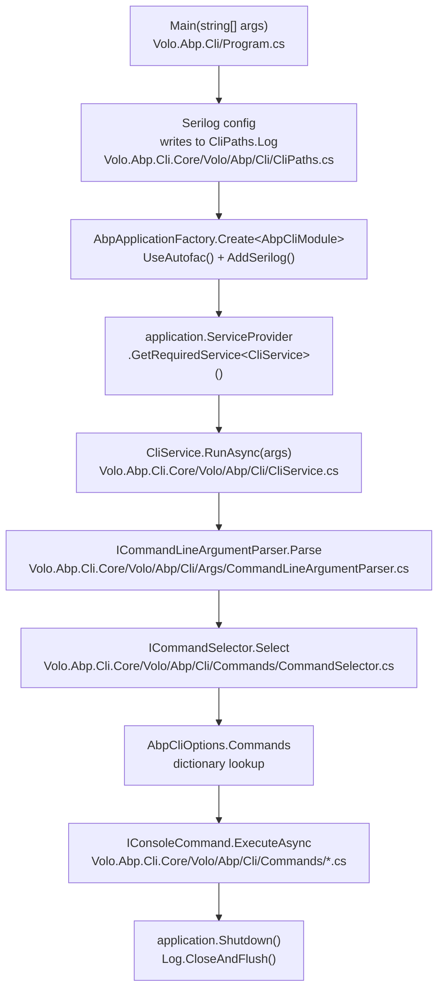

# ABP CLI Overview

The ABP Framework ships a global `dotnet` tool called `abp` that drives most day-to-day developer workflows around an ABP solution: scaffolding new applications, adding modules, updating package versions, generating service proxies, bundling Blazor assets, building dependent repositories, signing in to the commercial license server, and acting as an MCP server for AI tooling. The tool lives in two NuGet packages — `Volo.Abp.Cli` (the executable host) and `Volo.Abp.Cli.Core` (the command library) — both rooted under `framework/src/` in the ABP Framework repository.

The executable side is intentionally tiny: `framework/src/Volo.Abp.Cli/Volo/Abp/Cli/Program.cs` only wires Serilog, builds the ABP host with `AbpApplicationFactory.Create<AbpCliModule>(...)`, and forwards `args` into `CliService.RunAsync`. All the real work — argument parsing, command discovery, project building, proxy generation — happens behind `ICliCommand` implementations registered by `framework/src/Volo.Abp.Cli.Core/Volo/Abp/Cli/AbpCliCoreModule.cs`.

<Info>
The `abp` tool name and command list are independent of ABP Studio's own CLI (`abp-studio-cli`). The pages in this group describe the classic `Volo.Abp.Cli` tool, which is the surface used by `dotnet tool install -g Volo.Abp.Cli`.
</Info>

The CLI itself is one of the few ABP Framework components that runs as a console application rather than a library. Every command, however, is composed from the same building blocks the framework provides everywhere else: ABP modules, options pattern, transient/scoped/singleton dependency injection, property-injected loggers, and `IServiceScopeFactory` for per-request isolation. Reading the CLI source is therefore a tidy way to learn the framework's composition patterns in a self-contained codebase.

## Two-package layout

ABP keeps the CLI host distinct from the command implementations so that other hosts (ABP Studio, integration tests) can reuse the commands without dragging in the `Program.cs` entry point or Autofac wiring.

| Package | Project file | Role |
| --- | --- | --- |
| `Volo.Abp.Cli` | `framework/src/Volo.Abp.Cli/Volo.Abp.Cli.csproj` | `dotnet` tool entry — owns `Program.cs`, the Serilog setup, the `AbpCliModule`, and the telemetry session enricher under `Telemetry/`. |
| `Volo.Abp.Cli.Core` | `framework/src/Volo.Abp.Cli.Core/Volo.Abp.Cli.Core.csproj` | Reusable command library — owns `AbpCliCoreModule`, `AbpCliOptions`, `CliService`, the `Commands/` catalogue, `Args/` parser, and feature folders (`Build/`, `Bundling/`, `LIbs/`, `ProjectBuilding/`, `ProjectModification/`, `ServiceProxying/`). |

`Volo.Abp.Cli.csproj` only depends on `Volo.Abp.Cli.Core` plus `Volo.Abp.Autofac` and Serilog sinks; everything else is pulled in transitively. That dependency direction is enforced by `framework/src/Volo.Abp.Cli/Volo/Abp/Cli/AbpCliModule.cs`, which only declares `[DependsOn(typeof(AbpCliCoreModule), typeof(AbpAutofacModule))]`.

## Two-package boundary in practice

Three concrete dependencies cross the boundary between `Volo.Abp.Cli` and `Volo.Abp.Cli.Core`:

- **`AbpCliModule` depends on `AbpCliCoreModule`** — the only required dependency direction. Adding a new command never requires editing `Volo.Abp.Cli`; the new file goes into `Volo.Abp.Cli.Core/Volo/Abp/Cli/Commands/` and the registration happens inside `AbpCliCoreModule.ConfigureServices`.
- **`Program.cs` references `CliService`** — `application.ServiceProvider.GetRequiredService<CliService>()` resolves a type that lives in `Volo.Abp.Cli.Core`. This is the only direct type reference `Program.cs` has into the core library.
- **Serilog file path uses `CliPaths.Log`** — also defined in `Volo.Abp.Cli.Core/Volo/Abp/Cli/CliPaths.cs`. Sharing the constant means that any other host embedding the CLI library writes logs to the same place users already expect.

Nothing else crosses the boundary, which is why ABP Studio and the Suite can host the same commands without ever taking a binary dependency on the `Volo.Abp.Cli` package.

## Boot flow

The Mermaid diagram below traces a single `abp <command> <target> [options]` invocation from `Main` to the command's `ExecuteAsync`. Every box is a real type — follow the file path under each step to read the source.



`Program.Main` only contains four meaningful statements: the encoding fix-up, the Serilog `LoggerConfiguration`, the `using (var application = AbpApplicationFactory.Create<AbpCliModule>(...))` block, and the `await ... CliService.RunAsync(args)` call. Every other behaviour — version checks, telemetry, prompt mode, batch mode, MCP mode — lives in `CliService` (`framework/src/Volo.Abp.Cli.Core/Volo/Abp/Cli/CliService.cs`).

<Card title="Read the host entry point" icon="play" href="/cli/program-entry">
  `Program.cs`, `AbpCliModule`, Serilog sinks, exit-code handling, and the telemetry environment variable.
</Card>

## Command registration

`AbpCliCoreModule.ConfigureServices` in `framework/src/Volo.Abp.Cli.Core/Volo/Abp/Cli/AbpCliCoreModule.cs` builds the `AbpCliOptions.Commands` dictionary one entry at a time. Each entry maps the command's `Name` constant (e.g. `NewCommand.Name == "new"`) to its `Type`. The same module also registers `AbpCliServiceProxyOptions.Generators` for the proxy generators and configures the two named HTTP clients (`CliConsts.HttpClientName`, `CliConsts.GithubHttpClientName`) used by everything that downloads templates or queries NuGet. Because the dictionary is constructed once per process at module initialisation, mutating it after `IAbpApplication.Initialize()` has no effect — downstream hosts must post-configure `AbpCliOptions` before the host is initialised.

```csharp
// framework/src/Volo.Abp.Cli.Core/Volo/Abp/Cli/AbpCliCoreModule.cs
Configure<AbpCliOptions>(options =>
{
    options.Commands[HelpCommand.Name] = typeof(HelpCommand);
    options.Commands[NewCommand.Name] = typeof(NewCommand);
    options.Commands[UpdateCommand.Name] = typeof(UpdateCommand);
    options.Commands[GenerateProxyCommand.Name] = typeof(GenerateProxyCommand);
    // ...30 more entries
});
```

`AbpCliOptions` itself (`framework/src/Volo.Abp.Cli.Core/Volo/Abp/Cli/AbpCliOptions.cs`) is a small record that also carries `DisabledModulesToAddToSolution`, `CacheTemplates`, and `ToolName` — application hosts that consume the CLI library (such as ABP Studio) can mutate those at startup.

## Command catalogue

Every file in `framework/src/Volo.Abp.Cli.Core/Volo/Abp/Cli/Commands/` that implements `IConsoleCommand` becomes a row in the catalogue below. The `Name` column comes from the `public const string Name` field on the type; the `Source` column links the exact file you would read to understand the command's behaviour. Pages later in this group expand the seven most-used commands.

| Command | Class | Source path |
| --- | --- | --- |
| `add-module` | `AddModuleCommand` | `framework/src/Volo.Abp.Cli.Core/Volo/Abp/Cli/Commands/AddModuleCommand.cs` |
| `add-package` | `AddPackageCommand` | `framework/src/Volo.Abp.Cli.Core/Volo/Abp/Cli/Commands/AddPackageCommand.cs` |
| `build` | `BuildCommand` | `framework/src/Volo.Abp.Cli.Core/Volo/Abp/Cli/Commands/BuildCommand.cs` |
| `bundle` | `BundleCommand` | `framework/src/Volo.Abp.Cli.Core/Volo/Abp/Cli/Commands/BundleCommand.cs` |
| `clean` | `CleanCommand` | `framework/src/Volo.Abp.Cli.Core/Volo/Abp/Cli/Commands/CleanCommand.cs` |
| `clear-download-cache` | `ClearDownloadCacheCommand` | `framework/src/Volo.Abp.Cli.Core/Volo/Abp/Cli/Commands/ClearDownloadCacheCommand.cs` |
| `cli` | `CliCommand` | `framework/src/Volo.Abp.Cli.Core/Volo/Abp/Cli/Commands/CliCommand.cs` |
| `create-migration-and-run-migrator` | `CreateMigrationAndRunMigratorCommand` | `framework/src/Volo.Abp.Cli.Core/Volo/Abp/Cli/Commands/CreateMigrationAndRunMigratorCommand.cs` |
| `generate-jwks` | `GenerateJwksCommand` | `framework/src/Volo.Abp.Cli.Core/Volo/Abp/Cli/Commands/GenerateJwksCommand.cs` |
| `generate-proxy` | `GenerateProxyCommand` | `framework/src/Volo.Abp.Cli.Core/Volo/Abp/Cli/Commands/GenerateProxyCommand.cs` |
| `generate-razor-page` | `GenerateRazorPage` | `framework/src/Volo.Abp.Cli.Core/Volo/Abp/Cli/Commands/GenerateRazorPage.cs` |
| `get-source` | `GetSourceCommand` | `framework/src/Volo.Abp.Cli.Core/Volo/Abp/Cli/Commands/GetSourceCommand.cs` |
| `help` | `HelpCommand` | `framework/src/Volo.Abp.Cli.Core/Volo/Abp/Cli/Commands/HelpCommand.cs` |
| `install-libs` | `InstallLibsCommand` | `framework/src/Volo.Abp.Cli.Core/Volo/Abp/Cli/Commands/InstallLibsCommand.cs` |
| `list-modules` | `ListModulesCommand` | `framework/src/Volo.Abp.Cli.Core/Volo/Abp/Cli/Commands/ListModulesCommand.cs` |
| `list-templates` | `ListTemplatesCommand` | `framework/src/Volo.Abp.Cli.Core/Volo/Abp/Cli/Commands/ListTemplatesCommand.cs` |
| `login` | `LoginCommand` | `framework/src/Volo.Abp.Cli.Core/Volo/Abp/Cli/Commands/LoginCommand.cs` |
| `login-info` | `LoginInfoCommand` | `framework/src/Volo.Abp.Cli.Core/Volo/Abp/Cli/Commands/LoginInfoCommand.cs` |
| `logout` | `LogoutCommand` | `framework/src/Volo.Abp.Cli.Core/Volo/Abp/Cli/Commands/LogoutCommand.cs` |
| `mcp` | `McpCommand` | `framework/src/Volo.Abp.Cli.Core/Volo/Abp/Cli/Commands/McpCommand.cs` |
| `new` | `NewCommand` | `framework/src/Volo.Abp.Cli.Core/Volo/Abp/Cli/Commands/NewCommand.cs` |
| `prompt` | `PromptCommand` | `framework/src/Volo.Abp.Cli.Core/Volo/Abp/Cli/Commands/PromptCommand.cs` |
| `recreate-initial-migration` | `RecreateInitialMigrationCommand` | `framework/src/Volo.Abp.Cli.Core/Volo/Abp/Cli/Commands/Internal/RecreateInitialMigrationCommand.cs` |
| `remove-proxy` | `RemoveProxyCommand` | `framework/src/Volo.Abp.Cli.Core/Volo/Abp/Cli/Commands/RemoveProxyCommand.cs` |
| `suite` | `SuiteCommand` | `framework/src/Volo.Abp.Cli.Core/Volo/Abp/Cli/Commands/SuiteCommand.cs` |
| `switch-to-local` | `SwitchToLocal` | `framework/src/Volo.Abp.Cli.Core/Volo/Abp/Cli/Commands/SwitchToLocalCommand.cs` |
| `switch-to-nightly` | `SwitchToNightlyCommand` | `framework/src/Volo.Abp.Cli.Core/Volo/Abp/Cli/Commands/SwitchToNightlyCommand.cs` |
| `switch-to-prerc` | `SwitchToPreRcCommand` | `framework/src/Volo.Abp.Cli.Core/Volo/Abp/Cli/Commands/SwitchToPreRcCommand.cs` |
| `switch-to-preview` | `SwitchToPreviewCommand` | `framework/src/Volo.Abp.Cli.Core/Volo/Abp/Cli/Commands/SwitchToPreviewCommand.cs` |
| `switch-to-stable` | `SwitchToStableCommand` | `framework/src/Volo.Abp.Cli.Core/Volo/Abp/Cli/Commands/SwitchToStableCommand.cs` |
| `translate` | `TranslateCommand` | `framework/src/Volo.Abp.Cli.Core/Volo/Abp/Cli/Commands/TranslateCommand.cs` |
| `update` | `UpdateCommand` | `framework/src/Volo.Abp.Cli.Core/Volo/Abp/Cli/Commands/UpdateCommand.cs` |

`HelpCommand` is also the fallback target: `CommandSelector.Select` in `framework/src/Volo.Abp.Cli.Core/Volo/Abp/Cli/Commands/CommandSelector.cs` returns `typeof(HelpCommand)` whenever the parsed `commandLineArgs.Command` is null/whitespace or is not found in `AbpCliOptions.Commands`. That makes a bare `abp` invocation render the catalogue automatically, using the `GetShortDescription` static method that every command exposes — see `HelpCommand.GetUsageInfo` for the reflection-based loop.

### Command grouping by feature area

The catalogue table mixes commands users see daily with internal/automation commands. Grouping them by feature area helps when navigating the source tree:

| Feature area | Commands | Primary backing folder |
| --- | --- | --- |
| Solution scaffolding | `new`, `list-templates`, `clear-download-cache` | `framework/src/Volo.Abp.Cli.Core/Volo/Abp/Cli/ProjectBuilding/` |
| Package + module management | `add-package`, `add-module`, `list-modules`, `update`, `switch-to-*` | `framework/src/Volo.Abp.Cli.Core/Volo/Abp/Cli/ProjectModification/` |
| Front-end assets | `install-libs`, `bundle` | `framework/src/Volo.Abp.Cli.Core/Volo/Abp/Cli/LIbs/`, `Bundling/` |
| HTTP API tooling | `generate-proxy`, `remove-proxy` | `framework/src/Volo.Abp.Cli.Core/Volo/Abp/Cli/ServiceProxying/` |
| Multi-repo / CI plumbing | `build`, `clean`, `cli` | `framework/src/Volo.Abp.Cli.Core/Volo/Abp/Cli/Build/`, `Utils/` |
| Licensing & accounts | `login`, `login-info`, `logout` | `framework/src/Volo.Abp.Cli.Core/Volo/Abp/Cli/Auth/`, `Licensing/` |
| Code generation | `generate-razor-page`, `generate-jwks`, `create-migration-and-run-migrator`, `recreate-initial-migration` | `framework/src/Volo.Abp.Cli.Core/Volo/Abp/Cli/Commands/` (with helpers in `Services/`) |
| Localisation | `translate` | `framework/src/Volo.Abp.Cli.Core/Volo/Abp/Cli/Commands/TranslateCommand.cs` |
| Interactive modes | `prompt`, `batch`, `mcp`, `suite`, `help` | `framework/src/Volo.Abp.Cli.Core/Volo/Abp/Cli/CliService.cs` |

The "Interactive modes" row is special because `prompt` and `batch` short-circuit `CommandSelector` and are handled directly inside `CliService.RunAsync` — see [Command Selector](/cli/command-selector) for the branching logic.

### Conventions every command follows

Even though there are 34 distinct command classes, they all observe the same shape — recognising the pattern is the fastest way to read an unfamiliar one:

- **`public const string Name = "..."`.** Used as the dictionary key in `AbpCliOptions.Commands` and (by convention) appears in `GetUsageInfo` strings.
- **`public static string GetShortDescription()`.** Read via reflection by `HelpCommand` to render the catalogue. Commands that omit this method are silently hidden from the top-level help list.
- **`public static class Options { ... }`.** Nested class with one inner class per option, each carrying `Short` and `Long` `const string` fields. Read via `commandLineArgs.Options.GetOrNull(Options.X.Short, Options.X.Long)` so command code does not duplicate the string literals.
- **`: IConsoleCommand, ITransientDependency`.** Every command implements `IConsoleCommand` (`framework/src/Volo.Abp.Cli.Core/Volo/Abp/Cli/Commands/IConsoleCommand.cs`) and registers itself as a transient service. `CliService` resolves the command inside a per-call `IServiceScope`, so any `IScopedDependency` resolved transitively is unique to the invocation.
- **`public ILogger<TCommand> Logger { get; set; }`.** Property-injected logger initialised to `NullLogger<TCommand>.Instance` in the constructor. Autofac fills the property after construction; the null default keeps unit tests from needing to mock the logger.

When you read a new command file, scanning for those five elements gives you almost the entire surface area in under a minute.

## Cross-cutting infrastructure

A small set of feature folders sits under `framework/src/Volo.Abp.Cli.Core/Volo/Abp/Cli/` and is consumed by many commands at once:

- `Analyticses/` — `ICliAnalyticsCollect` and the no-op implementation used when telemetry is disabled.
- `Args/` — `CommandLineArgumentParser`, `CommandLineArgs`, `AbpCommandLineOptions` (case-insensitive dictionary), and the `CommandLineArgsExtensions` helpers like `IsMcpCommand()`.
- `Auth/` — `IApiKeyService`, `AccessTokenAuthenticator`, and developer API-key caching used by `login`, `logout`, and the template downloader.
- `Build/` — interfaces/implementations that `BuildCommand` resolves: `IDotNetProjectBuildConfigReader`, `IChangedProjectFinder`, `IDotNetProjectBuilder`, `IBuildStatusGenerator`, `IRepositoryBuildStatusStore`.
- `Bundling/` — `IBundlingService` plus per-style/style-bundlers used by `bundle` and by `NewCommand` after a Blazor template is scaffolded.
- `Configuration/` — the `AppData` JSON config under `CliPaths` consumed by `LoginInfoCommand` and the API-key service.
- `GitHub/` — typed clients for fetching release information from `github.com/abpframework`, behind `CliConsts.GithubHttpClientName`.
- `Http/` — `CliHttpClientFactory`, `CliHttpClientHandler` (forces TLS 1.2), and `RemoteServiceExceptionHandler`.
- `LIbs/` — `IInstallLibsService` and `ResourceMapping` (yes, the folder is spelt `LIbs`).
- `Licensing/` — `DeveloperApiKeyResult` and the loop that injects `api-key` / `license-code` into `ProjectBuildArgs.ExtraProperties`.
- `Memory/` — `MemoryService`, a key/value store backed by a JSON file used to cache the "last version check" timestamp (see `CliService.IsLatestVersionCheckExpiredAsync`).
- `ProjectBuilding/` — `ITemplateInfoProvider`, `TemplateProjectBuilder`, `AbpIoSourceCodeStore`, and the `Templates/` sub-hierarchy with one class per official template.
- `ProjectModification/` — the `VoloNugetPackagesVersionUpdater`, `NpmPackagesUpdater`, `SolutionModuleAdder`, and `PackagePreviewSwitcher` used by `update`, `add-module`, `add-package`, and the `switch-to-*` commands.
- `ServiceProxying/` — `IServiceProxyGenerator` and the three concrete generators (CSharp, Angular, JavaScript).

- `Utils/` — `ICmdHelper`, `CmdHelper`, and `NpmHelper` (process shell-outs to `dotnet`, `git`, `npm`, `yarn`, `gulp`).
- `Version/` — `CliVersionService`, `PackageVersionCheckerService`, and `LatestStableVersionResult` used by both `CliService.CheckCliVersionAsync` and `update`.

These folders are referenced repeatedly in the deeper pages of this group; treat the listings above as a roadmap rather than something to memorise. Wherever a deep page references "see `framework/src/Volo.Abp.Cli.Core/Volo/Abp/Cli/<Folder>/<File>.cs`", that path will correspond to one of the rows in the lists above.

## Telemetry envelope

Every CLI run is wrapped in a telemetry activity by `CliService.RunAsync` (`framework/src/Volo.Abp.Cli.Core/Volo/Abp/Cli/CliService.cs`): `await using var _ = _telemetryService.TrackActivityAsync(ActivityNameConsts.AbpCliRun)`. Inside, each commandable workflow opens its own child activity — `NewCommand` records `AbpCliCommandsNewSolution` or `AbpCliCommandsNewModule`, `UpdateCommand` records `AbpCliCommandsUpdate`, and so on. These activity names are constants in `Volo.Abp.Internal.Telemetry.Constants.ActivityNameConsts`.

The session enricher is `TelemetrySessionInfoEnricher` in `framework/src/Volo.Abp.Cli/Volo/Abp/Cli/Telemetry/TelemetryCliSessionProvider.cs`. The enricher is **removed** from the service collection when telemetry is off and `ITelemetryService` is replaced with `NullTelemetryService` (`framework/src/Volo.Abp.Cli/Volo/Abp/Cli/Telemetry/NullTelemetryService.cs`) whenever the `ABP_STUDIO_ENABLE_TELEMETRY` environment variable equals `false`. The remaining code paths still call `TrackActivityAsync` — they just turn into no-ops.

## Where to add a new command

The mechanical steps to introduce a new top-level command (whether built into the framework or registered by a downstream host):

1. Create a class under `framework/src/Volo.Abp.Cli.Core/Volo/Abp/Cli/Commands/MyCommand.cs` implementing `IConsoleCommand, ITransientDependency`.
2. Declare `public const string Name = "my-command";` and a nested `public static class Options { ... }` if the command takes arguments.
3. Implement `ExecuteAsync(CommandLineArgs)` and `GetUsageInfo()`.
4. Add `public static string GetShortDescription()` so the command shows up in `abp` (the help fallback) — otherwise it stays hidden but still works when invoked directly.
5. Register the command in `AbpCliCoreModule.ConfigureServices`: `options.Commands[MyCommand.Name] = typeof(MyCommand);`.
6. The DI container picks up the `ITransientDependency` marker automatically, so no `services.AddTransient(...)` is required.

Downstream hosts can perform step 5 from their own module's `ConfigureServices` and skip step 1 if they only want to override an existing command — `AbpCliOptions.Commands["new"] = typeof(MyNewCommand);` swaps the built-in `NewCommand` for a custom subclass.

## Module dependency chain

The `[DependsOn]` attribute on `AbpCliCoreModule` (in `framework/src/Volo.Abp.Cli.Core/Volo/Abp/Cli/AbpCliCoreModule.cs`) is what determines which ABP services are present in the CLI host:

```csharp
[DependsOn(
    typeof(AbpDddDomainModule),
    typeof(AbpJsonModule),
    typeof(AbpIdentityModelModule),
    typeof(AbpMinifyModule),
    typeof(AbpHttpModule),
    typeof(AbpLocalizationModule)
)]
public class AbpCliCoreModule : AbpModule
{
    // ...
}
```

- `AbpDddDomainModule` pulls in the domain primitives used by template metadata (`AppTemplate`, `MicroserviceTemplate`, etc.).
- `AbpJsonModule` is what `AbpIoSourceCodeStore` and `PackageVersionCheckerService` use to deserialise template descriptors and `latest-versions.json`.
- `AbpIdentityModelModule` provides the `IdentityModel`-based authentication primitives used by `Auth/` for the developer license server.
- `AbpMinifyModule` is consumed by the JS proxy generator path that emits compressed `wwwroot/client-proxies/*.js`.
- `AbpHttpModule` carries `Volo.Abp.Http.Modeling.ApplicationApiDescriptionModel` — the very model that `generate-proxy` deserialises from `/api/abp/api-definition`.
- `AbpLocalizationModule` is needed because some command output is localised (e.g. `abp login` error messages).

## File-system layout the CLI relies on

A successful CLI run touches a small set of well-known paths on the user's machine. All of them are constants on `CliPaths` (`framework/src/Volo.Abp.Cli.Core/Volo/Abp/Cli/CliPaths.cs`):

| Path | Role |
| --- | --- |
| `~/.abp/logs/abp-cli-logs.txt` | Default Serilog file sink for interactive runs (see `Program.cs`). |
| `~/.abp/logs/abp-cli-mcp-logs.txt` | Separate file sink for `abp mcp` so stdout JSON-RPC stays clean. |
| `~/.abp/cli/memory.json` | Backing store for `MemoryService` — tracks the daily version-check timestamp via `CliConsts.MemoryKeys.LatestCliVersionCheckDate`. |
| `~/.abp/cli/build-status/*.json` | `FileSystemRepositoryBuildStatusStore` output for `abp build`. |
| `~/.abp/cli/templates/*` | Cached template ZIPs honoured by `AbpIoSourceCodeStore` when `--skip-cache` is not set. |
| `~/.abp/cli/access-token.bin` | Developer API key cached by `Auth/` after `abp login`. |

## A worked example: tracing `abp new`

To anchor the architecture in something concrete, walk through what happens when a developer types `abp new Acme.BookStore -t app --ui mvc -d ef --dbms postgres`:

1. **`Program.Main`** (`framework/src/Volo.Abp.Cli/Volo/Abp/Cli/Program.cs`) sets `Console.OutputEncoding`, configures Serilog with a console + file sink, then builds the host with `AbpApplicationFactory.Create<AbpCliModule>(options => { options.UseAutofac(); options.Services.AddLogging(c => c.AddSerilog()); })`.
2. **`AbpCliModule`** (`framework/src/Volo.Abp.Cli/Volo/Abp/Cli/AbpCliModule.cs`) brings in `AbpCliCoreModule` via `[DependsOn]`, which is what actually populates `AbpCliOptions.Commands`.
3. **`CliService.RunAsync(args)`** is resolved from the root service provider. It logs `"ABP CLI {version}"` (the banner) using `CliVersionService.GetCurrentCliVersionAsync()`.
4. **`CommandLineArgumentParser.Parse`** (`framework/src/Volo.Abp.Cli.Core/Volo/Abp/Cli/Args/CommandLineArgumentParser.cs`) pops `new` as the command, `Acme.BookStore` as the target, then loops the remaining tokens into `Options { t -> "app", ui -> "mvc", d -> "ef", dbms -> "postgres" }`.
5. **`CommandSelector.Select`** (`framework/src/Volo.Abp.Cli.Core/Volo/Abp/Cli/Commands/CommandSelector.cs`) returns `typeof(NewCommand)` because `AbpCliOptions.Commands["new"]` resolves to that type.
6. **`CliService.RunInternalAsync`** opens a fresh `IServiceScope`, resolves `NewCommand` from the scope, and awaits `command.ExecuteAsync(commandLineArgs)`.
7. **`NewCommand.ExecuteAsync`** (`framework/src/Volo.Abp.Cli.Core/Volo/Abp/Cli/Commands/NewCommand.cs`) calls into `ProjectCreationCommandBase.GetProjectBuildArgsAsync` to build a `ProjectBuildArgs`, then drives `TemplateProjectBuilder.BuildAsync` and the post-build steps. See [new](/cli/new-command) for the full breakdown.
8. **`application.Shutdown()`** + **`Log.CloseAndFlush()`** fire from `Program.Main` when control returns. Any pending Serilog batches are flushed to `~/.abp/logs/abp-cli-logs.txt`.

Every other command — `update`, `build`, `install-libs`, `generate-proxy` — follows the same eight-step shape with only step 7 differing.

## Reading order

<CardGroup cols={2}>
  <Card title="Program Entry" icon="terminal" href="/cli/program-entry">
    How `Program.cs` builds the ABP host, configures Serilog, and hands control to `CliService`.
  </Card>
  <Card title="Command Selector" icon="route" href="/cli/command-selector">
    How `CommandSelector` and `CommandLineArgumentParser` turn `string[] args` into an `IConsoleCommand`.
  </Card>
  <Card title="new" icon="folder-plus" href="/cli/new-command">
    Scaffolding a solution: `NewCommand`, `ProjectCreationCommandBase`, and the `ProjectBuilding/` pipeline.
  </Card>
  <Card title="build" icon="hammer" href="/cli/build-command">
    Building the dependency graph: `BuildCommand`, `DotNetProjectBuildConfig`, and the changed-project finder.
  </Card>
  <Card title="update" icon="arrow-up" href="/cli/update-command">
    Version bumps: `VoloNugetPackagesVersionUpdater`, `NpmPackagesUpdater`, and the `switch-to-*` commands.
  </Card>
  <Card title="install-libs" icon="cube" href="/cli/install-libs">
    Wiring `wwwroot/libs`: `InstallLibsCommand`, `IInstallLibsService`, and `abp.resourcemapping.js`.
  </Card>
  <Card title="generate-proxy" icon="code" href="/cli/generate-proxy">
    Producing client proxies: `ProxyCommandBase`, `ServiceProxyGeneratorBase`, and the three concrete generators.
  </Card>
</CardGroup>

## How a CLI run unfolds

Putting the boot flow and the catalogue together, a typical run looks like this end-to-end:

1. The user types `abp update -sp ./MySolution -v 8.2.0`.
2. The `dotnet` tool shim hands those tokens to `Program.Main` (`framework/src/Volo.Abp.Cli/Volo/Abp/Cli/Program.cs`).
3. Serilog is configured; `AbpApplicationFactory.Create<AbpCliModule>(...)` brings in `AbpCliCoreModule` and registers every command from `framework/src/Volo.Abp.Cli.Core/Volo/Abp/Cli/Commands/`.
4. `CliService.RunAsync(args)` parses the tokens into `CommandLineArgs { Command = "update", Target = null, Options = {sp -> ./MySolution, v -> 8.2.0} }`.
5. `CommandSelector.Select(commandLineArgs)` looks up `"update"` in `AbpCliOptions.Commands` and returns `typeof(UpdateCommand)`.
6. A new DI scope is created; `UpdateCommand` is resolved with property-injected `Logger` and constructor-injected `VoloNugetPackagesVersionUpdater`, `NpmPackagesUpdater`, `ITelemetryService`.
7. `UpdateCommand.ExecuteAsync` runs, telemetry is recorded under `ActivityNameConsts.AbpCliCommandsUpdate`, and the scope is disposed.
8. `Program.Main` calls `application.Shutdown()` and `Log.CloseAndFlush()` so the file sink under `CliPaths.Log` is committed before the process exits.

## How the catalogue connects to runtime behaviour

Three interfaces glue everything together — they are the contracts you replace when forking the CLI:

| Interface | Default implementation | What it does |
| --- | --- | --- |
| `ICommandLineArgumentParser` | `CommandLineArgumentParser` in `framework/src/Volo.Abp.Cli.Core/Volo/Abp/Cli/Args/` | Turns `string[] args` into `CommandLineArgs` (`Command`, `Target`, `Options`). |
| `ICommandSelector` | `CommandSelector` in `framework/src/Volo.Abp.Cli.Core/Volo/Abp/Cli/Commands/` | Maps `CommandLineArgs.Command` to a `Type` registered in `AbpCliOptions.Commands`. |
| `IConsoleCommand` | One per command in `framework/src/Volo.Abp.Cli.Core/Volo/Abp/Cli/Commands/` | Provides `ExecuteAsync(CommandLineArgs)` and `GetUsageInfo()` for help text. |

Every box in the boot-flow Mermaid diagram corresponds to one of these contracts. Even `HelpCommand` itself is just an `IConsoleCommand` registered with `Name = "help"` — it enumerates `AbpCliOptions.Commands` and uses reflection to find each command's static `GetShortDescription()` method to render the catalogue.

## When to read which command page

<AccordionGroup>
  <Accordion title="I'm onboarding a new contributor to Volo.Abp.Cli.Core">
    Read the [Program Entry](/cli/program-entry) page first to understand the host lifecycle, then [Command Selector](/cli/command-selector) for the parser contract. After that, pick one command page (e.g. `update`) and trace a real invocation through `CliService.RunAsync` to the matching `ExecuteAsync`.
  </Accordion>
  <Accordion title="I'm wiring CLI behaviour into ABP Studio or another host">
    Read [Program Entry](/cli/program-entry) to see what `AbpCliModule` actually depends on (it only pulls in `AbpCliCoreModule` and `AbpAutofacModule`). The rest of the catalogue is just `AbpCliOptions.Commands` entries you can mutate from a downstream module.
  </Accordion>
  <Accordion title="I'm debugging a failed `abp new` or `abp update`">
    Skip ahead to [new](/cli/new-command) or [update](/cli/update-command). Each page lists the exact `Volo.Abp.Cli.Core/Volo/Abp/Cli/ProjectModification/*` collaborator that mutates the file system, plus the on-disk paths (e.g. `CliPaths.Log`, `CliPaths.Build`) where you can inspect state.
  </Accordion>
</AccordionGroup>
