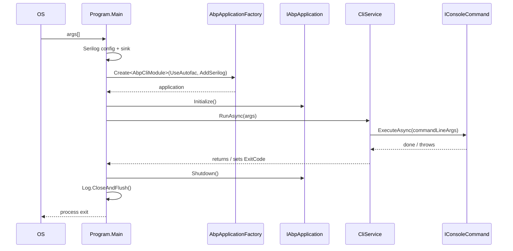

# Program Entry — `Volo.Abp.Cli/Program.cs`

The ABP Framework CLI is a thin `dotnet` tool wrapper around the ABP host. Its `Main` method lives in `framework/src/Volo.Abp.Cli/Volo/Abp/Cli/Program.cs` and does only five things: fix the console encoding to UTF-8, configure Serilog, build an `IAbpApplication` rooted on `AbpCliModule`, resolve `CliService`, and forward `args`. That tight surface is intentional — every commandable behaviour belongs in `Volo.Abp.Cli.Core`, leaving the executable free to be embedded by other hosts.

## `Main` line by line

The full `Main` body is short enough to inspect at once. Open `framework/src/Volo.Abp.Cli/Volo/Abp/Cli/Program.cs` and follow along:

```csharp
private static async Task Main(string[] args)
{
    Console.OutputEncoding = System.Text.Encoding.UTF8;

    var loggerOutputTemplate = "{Message:lj}{NewLine}{Exception}";
    var config = new LoggerConfiguration()
        .MinimumLevel.Information()
        .MinimumLevel.Override("Microsoft", LogEventLevel.Warning)
        .MinimumLevel.Override("Volo.Abp", LogEventLevel.Warning)
        .MinimumLevel.Override("System.Net.Http.HttpClient", LogEventLevel.Warning)
        .MinimumLevel.Override("Volo.Abp.IdentityModel", LogEventLevel.Information)
#if DEBUG
        .MinimumLevel.Override("Volo.Abp.Cli", LogEventLevel.Debug)
#else
        .MinimumLevel.Override("Volo.Abp.Cli", LogEventLevel.Information)
#endif
        .Enrich.FromLogContext();
    // ...sink selection + AbpApplicationFactory.Create...
}
```

The `Console.OutputEncoding = Encoding.UTF8` line matters more than it looks: many of the commands print non-ASCII characters (template URLs, license messages, Turkish/German diagnostics). Without the UTF-8 override, Windows consoles default to the OEM code page and corrupt the output. The matching `Encoding.RegisterProvider(CodePagesEncodingProvider.Instance)` call in `framework/src/Volo.Abp.Cli.Core/Volo/Abp/Cli/AbpCliCoreModule.cs` then allows the rest of the process to use legacy code pages where templates need them.

## Serilog configuration

The Serilog configuration above is shared by every invocation. Note the explicit overrides:

- `Microsoft` and `Volo.Abp` are clamped to `Warning` so the framework's own startup chatter does not drown out command output.
- `System.Net.Http.HttpClient` is silenced because every template download and NuGet probe goes through a typed `HttpClient` and would otherwise log `Information` entries.
- `Volo.Abp.IdentityModel` stays at `Information` because the `login` / `logout` commands depend on it and need their progress visible.
- `Volo.Abp.Cli` itself is `Debug` in `DEBUG` builds and `Information` in `Release` builds — controlled by the build configuration of `framework/src/Volo.Abp.Cli/Volo.Abp.Cli.csproj`.

## Sink selection: MCP vs. interactive

`Program.cs` then picks between two sink configurations based on `args[0]`. The MCP protocol uses stdout for JSON-RPC framing, so any console logging would corrupt the stream. The fix is to skip `WriteTo.Console` entirely when the first argument is `mcp`:

```csharp
if (args.Length > 0 && args[0].Equals("mcp", StringComparison.OrdinalIgnoreCase))
{
    Log.Logger = config
        .WriteTo.File(Path.Combine(CliPaths.Log, "abp-cli-mcp-logs.txt"), outputTemplate: loggerOutputTemplate)
        .CreateLogger();
}
else
{
    Log.Logger = config
        .WriteTo.File(Path.Combine(CliPaths.Log, "abp-cli-logs.txt"), outputTemplate: loggerOutputTemplate)
        .WriteTo.Console(theme: AnsiConsoleTheme.Sixteen, outputTemplate: loggerOutputTemplate)
        .CreateLogger();
}
```

The `CliPaths.Log` constant comes from `framework/src/Volo.Abp.Cli.Core/Volo/Abp/Cli/CliPaths.cs`. It points at `%USERPROFILE%\.abp\logs` on Windows and `~/.abp/logs` on Unix. Two distinct files keep MCP traces separate from regular CLI logs so support engineers can ask for the right one. Inside `CliService.RunAsync`, every MCP-aware code path then routes warnings and errors through `IMcpLogger` instead of `ILogger<CliService>` for the same reason — see `framework/src/Volo.Abp.Cli.Core/Volo/Abp/Cli/CliService.cs`.

<Note>
The MCP sink decision is positional: `abp mcp` triggers it, but `abp --some-flag mcp` does not. That mirrors how `dotnet` tool entry points are invoked.
</Note>

## Building the ABP host

After Serilog is configured, the `using` block creates and disposes the ABP application:

```csharp
using (var application = AbpApplicationFactory.Create<AbpCliModule>(
    options =>
    {
        options.UseAutofac();
        options.Services.AddLogging(c => c.AddSerilog());
    }))
{
    application.Initialize();

    await application.ServiceProvider
        .GetRequiredService<CliService>()
        .RunAsync(args);

    application.Shutdown();

    Log.CloseAndFlush();
}
```

`AbpApplicationFactory.Create<TModule>` is the standalone counterpart to the ASP.NET Core integration: it spins up a plain `ServiceCollection`, registers the module graph, and returns an `IAbpApplicationWithInternalServiceProvider`. The two callback statements switch the container to Autofac (required for property injection, which `CliService` uses heavily) and add Serilog as the logging provider for everything resolved from the container.

`AbpCliModule` itself, defined in `framework/src/Volo.Abp.Cli/Volo/Abp/Cli/AbpCliModule.cs`, is empty besides its `[DependsOn]` attribute:

```csharp
[DependsOn(
    typeof(AbpCliCoreModule),
    typeof(AbpAutofacModule)
)]
public class AbpCliModule : AbpModule
{
}
```

All real wiring happens in `AbpCliCoreModule` (under `framework/src/Volo.Abp.Cli.Core/Volo/Abp/Cli/AbpCliCoreModule.cs`), which:

1. Registers two named `HttpClient` instances (`CliConsts.HttpClientName` and `CliConsts.GithubHttpClientName`) — see `framework/src/Volo.Abp.Cli.Core/Volo/Abp/Cli/Http/CliHttpClientHandler.cs` for the primary handler.
2. Calls `Encoding.RegisterProvider(CodePagesEncodingProvider.Instance)` so template downloads in non-UTF encodings still work.
3. Builds `AbpCliOptions.Commands` — one assignment per built-in command.
4. Builds `AbpCliServiceProxyOptions.Generators` for the three proxy generators.
5. Calls `ConfigureTelemetry` to wire the telemetry session enricher conditionally.

## The host lifecycle



The `Shutdown` call disposes scoped services in reverse module-dependency order. `Log.CloseAndFlush()` then drains any pending Serilog batches to the rolling file under `CliPaths.Log`, so even an aggressive `Ctrl+C` on a long-running `new` command leaves the failure visible on disk.

## `CliService` — what runs inside `RunAsync`

`CliService` is the single entry point reached from `Main`. The class is declared `: ITransientDependency` in `framework/src/Volo.Abp.Cli.Core/Volo/Abp/Cli/CliService.cs`. Its constructor pulls in `ICommandLineArgumentParser`, `ICommandSelector`, `IServiceScopeFactory`, `PackageVersionCheckerService`, `ICmdHelper`, `MemoryService`, `CliVersionService`, `ITelemetryService`, and `IMcpLogger`. The dependencies make the responsibilities visible at a glance:

| Dependency | Role |
| --- | --- |
| `ICommandLineArgumentParser` | Turn `string[] args` into a `CommandLineArgs`. |
| `ICommandSelector` | Map `commandLineArgs.Command` to a registered `IConsoleCommand` type. |
| `IServiceScopeFactory` | Resolve each command inside a fresh DI scope (commands are transient). |
| `PackageVersionCheckerService` | Hit NuGet/MyGet for `Volo.Abp.Cli` to detect updates. |
| `MemoryService` | Persist the "last version check" timestamp under `CliPaths.MemoryFile`. |
| `CliVersionService` | Report the current `SemanticVersion`. |
| `ITelemetryService` | Wrap the full run in an `AbpCliRun` activity (see `framework/src/Volo.Abp.Cli.Core/Volo/Abp/Cli/Telemetry/TelemetryCliSessionProvider.cs`). |
| `IMcpLogger` | Route messages to the MCP sink when the command corrupts stdout otherwise. |

`RunAsync` then:

1. Parses `args` into `commandLineArgs`.
2. Calls `CliVersionService.GetCurrentCliVersionAsync()` for the banner (`ABP CLI {currentCliVersion}`), suppressed in MCP mode.
3. In `Release` builds, calls `CheckCliVersionAsync(currentCliVersion)` — but only when 24 hours have passed since the last check (`MemoryService.GetAsync(CliConsts.MemoryKeys.LatestCliVersionCheckDate)`).
4. Opens a telemetry activity named `ActivityNameConsts.AbpCliRun`.
5. Dispatches based on `commandLineArgs.IsCommand("prompt")`, `IsCommand("batch")`, or default — see `RunPromptAsync`, `RunBatchAsync`, `RunInternalAsync`.

The shared `RunInternalAsync` is the simplest of the three and shows the dispatch contract:

```csharp
private async Task RunInternalAsync(CommandLineArgs commandLineArgs)
{
    var commandType = CommandSelector.Select(commandLineArgs);

    using (var scope = ServiceScopeFactory.CreateScope())
    {
        var command = (IConsoleCommand)scope.ServiceProvider.GetRequiredService(commandType);
        await command.ExecuteAsync(commandLineArgs);
    }
}
```

Each command runs inside its own scope so that the framework's unit-of-work and any other scoped services it consumes are isolated per invocation. This matters for `batch` mode where a single CLI process may execute dozens of commands sequentially.

## Exit-code handling

`Main` returns `Task` rather than `Task<int>`. Exit codes are propagated via `Environment.ExitCode` from inside `CliService.RunAsync`:

```csharp
catch (CliUsageException usageException)
{
    if (commandLineArgs.IsMcpCommand())
    {
        _mcpLogger.Error(McpLogSource, usageException.Message);
    }
    else
    {
        Logger.LogWarning(usageException.Message);
    }
    Environment.ExitCode = 1;
}
catch (Exception ex)
{
    await _telemetryService.AddErrorActivityAsync(ex.Message);
    // ... rethrow
}
```

- A `CliUsageException` (from `framework/src/Volo.Abp.Cli.Core/Volo/Abp/Cli/CliUsageException.cs`) — thrown by every command when arguments are missing or invalid — produces a warning, sets `ExitCode = 1`, and exits cleanly.
- Any other exception is reported to telemetry as an error activity and then rethrown so the runtime crashes the process with a non-zero exit code by default.
- Successful runs leave `Environment.ExitCode` at zero.

<Tip>
In MCP mode, the exception goes through `IMcpLogger.Error` so the structured error reaches the MCP client over stdout, rather than via a human-readable Serilog console line.
</Tip>

## Telemetry opt-out

The last private method in `AbpCliCoreModule` (`framework/src/Volo.Abp.Cli.Core/Volo/Abp/Cli/AbpCliCoreModule.cs`) controls whether the run is reported:

```csharp
private const string EnableTelemetryVariableName = "ABP_STUDIO_ENABLE_TELEMETRY";

private static void ConfigureTelemetry(IServiceCollection services)
{
    var enableTelemetryEnvironmentVariable =
        Environment.GetEnvironmentVariable(EnableTelemetryVariableName, EnvironmentVariableTarget.Machine)
        ?? Environment.GetEnvironmentVariable(EnableTelemetryVariableName, EnvironmentVariableTarget.User)
        ?? Environment.GetEnvironmentVariable(EnableTelemetryVariableName, EnvironmentVariableTarget.Process);

    if (enableTelemetryEnvironmentVariable.IsNullOrEmpty() ||
        !enableTelemetryEnvironmentVariable.Equals("false", StringComparison.InvariantCultureIgnoreCase))
    {
        services.Remove(services.First(p => p.ImplementationType == typeof(TelemetrySessionInfoEnricher)));
    }
    else
    {
        services.Replace(ServiceDescriptor.Singleton<ITelemetryService, NullTelemetryService>());
    }
}
```

The environment variable is checked across all three `EnvironmentVariableTarget` scopes, with `Machine` winning over `User` winning over `Process`. When the variable is unset or has any value other than `false`, the standard telemetry pipeline runs minus the `TelemetrySessionInfoEnricher` (which carries the ABP Studio session — irrelevant for the standalone CLI). When the variable is `false`, `ITelemetryService` is replaced with `NullTelemetryService` (under `framework/src/Volo.Abp.Cli/Volo/Abp/Cli/Telemetry/NullTelemetryService.cs`), which short-circuits every `AddActivityAsync` / `TrackActivityAsync` call.

## What `Program.cs` does not do

A few responsibilities that live elsewhere despite being adjacent to the entry point:

- **Argument parsing.** Done by `CommandLineArgumentParser` (`framework/src/Volo.Abp.Cli.Core/Volo/Abp/Cli/Args/CommandLineArgumentParser.cs`). `Program.cs` only passes the raw `string[] args` along.
- **Version checking.** Done by `CliService.CheckCliVersionAsync`, gated by `MemoryService` so it does not happen more than once per day.
- **Banner.** `Logger.LogInformation($"ABP CLI {currentCliVersion}")` happens inside `CliService.RunAsync`, not in `Main`.
- **Help fallback.** `CommandSelector.Select` returns `typeof(HelpCommand)` when the parsed command is unknown — `Program.cs` never inspects `args`.

Splitting these out keeps `Program.cs` so small that a custom host can copy it verbatim and only swap the Serilog sinks.

## `CliPaths` and on-disk state

`Program.cs` references `CliPaths.Log` directly. The class lives in `framework/src/Volo.Abp.Cli.Core/Volo/Abp/Cli/CliPaths.cs` and centralises every persistent location the CLI uses:

| Constant | Purpose | Used by |
| --- | --- | --- |
| `CliPaths.AppData` | Root directory: `~/.abp/` (or `%USERPROFILE%\.abp\`). | All other paths derive from this. |
| `CliPaths.Log` | Where the Serilog file sinks write. | `Program.cs`. |
| `CliPaths.Memory` | JSON file backing `MemoryService`. | `CliService.IsLatestVersionCheckExpiredAsync`. |
| `CliPaths.Build` | Per-build status JSON files. | `FileSystemRepositoryBuildStatusStore.Set`. |
| `CliPaths.AccessToken` | Cached developer access token from `abp login`. | `Auth/` services. |

`Program.cs` does not create any of those directories itself — `Path.Combine(CliPaths.Log, "abp-cli-logs.txt")` is fed straight to Serilog's `WriteTo.File(...)`, which creates the directory on first write. The matching `CliConsts.MemoryKeys` constants live in `framework/src/Volo.Abp.Cli.Core/Volo/Abp/Cli/CliConsts.cs` and key the in-memory dictionary that the memory service serialises.

## The two named HTTP clients

`AbpCliCoreModule.ConfigureServices` (`framework/src/Volo.Abp.Cli.Core/Volo/Abp/Cli/AbpCliCoreModule.cs`) registers two named clients that every other service consumes:

```csharp
context.Services.AddHttpClient(CliConsts.HttpClientName)
    .ConfigurePrimaryHttpMessageHandler(() => new CliHttpClientHandler());

context.Services.AddHttpClient(CliConsts.GithubHttpClientName, client =>
{
    client.DefaultRequestHeaders.UserAgent.ParseAdd("MyAgent/1.0");
});
```

- `CliConsts.HttpClientName` — used by `AbpIoSourceCodeStore` (template downloads), `CliHttpClientFactory` (proxy generation), `IApiKeyService` (developer key validation). The primary handler `CliHttpClientHandler` (`framework/src/Volo.Abp.Cli.Core/Volo/Abp/Cli/Http/CliHttpClientHandler.cs`) forces TLS 1.2 so the CLI works against older Windows runtimes.
- `CliConsts.GithubHttpClientName` — used by `PackageVersionCheckerService.GetLatestStableVersionsInternalAsync` to fetch `latest-versions.json` and by anything under `Volo.Abp.Cli.Core/Volo/Abp/Cli/GitHub/`. The custom `User-Agent` keeps GitHub's anonymous rate-limit happy.

Both clients are scoped per request via `IHttpClientFactory`, so each command call gets a fresh handler from the pool without ever creating a top-level `HttpClient` instance.

## Composition rules for embedded hosts

Because `AbpCliModule` is empty and `AbpCliCoreModule` only configures options and HTTP clients, embedding the CLI library in a larger host is a short list of steps:

1. Reference `Volo.Abp.Cli.Core` and `Volo.Abp.Autofac` (or another DI integration that supports property injection).
2. Add a module that declares `[DependsOn(typeof(AbpCliCoreModule), typeof(AbpAutofacModule))]`.
3. Configure Serilog (or any other `Microsoft.Extensions.Logging` provider) on `IServiceCollection`.
4. Resolve `CliService` and call `RunAsync(args)`.

That is precisely what `Program.cs` does, minus the `Console.OutputEncoding` and MCP sink branch. Hosts that need to run multiple commands per process can resolve `CliService` once and call `RunAsync` repeatedly — each invocation already creates its own `IServiceScope` inside `RunInternalAsync` so state does not leak between commands.

## Sub-pages

<CardGroup cols={2}>
  <Card title="Command Selector" icon="route" href="/cli/command-selector">
    The dispatcher that picks an `IConsoleCommand` based on the parsed first argument.
  </Card>
  <Card title="Overview" icon="list" href="/cli/overview">
    Back to the package map and full command catalogue.
  </Card>
</CardGroup>
