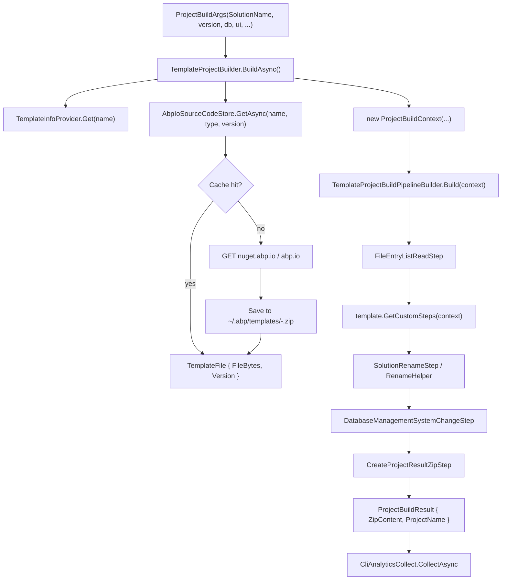

# `ProjectBuilding` — the engine behind `abp new`, `abp get-source`, `abp add-module`

`abp new MyCompany.MyProject` is the most user-visible command in the ABP Framework CLI, but the work it performs is identical to `abp get-source` and the install branch of `abp add-module` underneath: download a versioned source-zip from `nuget.abp.io`, unpack it into a `FileEntryList`, mutate the entries through a pipeline of `ProjectBuildPipelineStep`s, re-zip the result, and either extract it to disk (`get-source`) or stream it to the next stage (`add-module`). Every part of that flow lives under `framework/src/Volo.Abp.Cli.Core/Volo/Abp/Cli/ProjectBuilding/`, and the entry point that ties it together is `IProjectBuilder`.

This page walks the pipeline from `ProjectBuildArgs` through `ISourceCodeStore.GetAsync` and the pipeline builders into the individual steps and templates. The matching page [`cli/project-modification`](/cli/project-modification) covers the on-disk mutations that happen after the project has been extracted; the source-fetch overview in [`cli/source-and-modules`](/cli/source-and-modules) documents the user-facing commands.

## `ProjectBuildArgs` — the canonical input

`framework/src/Volo.Abp.Cli.Core/Volo/Abp/Cli/ProjectBuilding/ProjectBuildArgs.cs` declares the immutable record every builder accepts. The constructor takes one positional `SolutionName`, plus optional template name, version, output folder, database/UI choices, GitHub local repository paths (for monorepo development), Theme/ThemeStyle preferences, plus an `ExtraProperties` dictionary that flows through every pipeline step:

```csharp
// framework/src/Volo.Abp.Cli.Core/Volo/Abp/Cli/ProjectBuilding/ProjectBuildArgs.cs
public ProjectBuildArgs(
    [NotNull] SolutionName solutionName,
    [CanBeNull] string templateName = null,
    [CanBeNull] string version = null,
    string outputFolder = null,
    DatabaseProvider databaseProvider = DatabaseProvider.NotSpecified,
    DatabaseManagementSystem databaseManagementSystem = DatabaseManagementSystem.NotSpecified,
    UiFramework uiFramework = UiFramework.NotSpecified,
    MobileApp? mobileApp = null,
    bool publicWebSite = false,
    [CanBeNull] string abpGitHubLocalRepositoryPath = null,
    [CanBeNull] string voloGitHubLocalRepositoryPath = null,
    [CanBeNull] string templateSource = null,
    Dictionary<string, string> extraProperties = null,
    [CanBeNull] string connectionString = null,
    bool pwa = false,
    Theme? theme = null,
    ThemeStyle? themeStyle = null,
    bool skipCache = false,
    bool trustUserVersion = false)
```

`SolutionName` (in `framework/src/Volo.Abp.Cli.Core/Volo/Abp/Cli/ProjectBuilding/SolutionName.cs`) parses `Acme.BookStore` into `CompanyName = "Acme"` and `ProjectName = "BookStore"`. The `Parse(fullName, microserviceName)` overload exists for the microservice templates where the solution is `Acme.BookStore.Catalog` — there the company is `Acme.BookStore` and the project is `Catalog`. Both branches throw `UserFriendlyException` when either side is empty, which is what surfaces as "Solution name is not valid" in `abp new`.

`ExtraProperties` is the catch-all bag for switches that do not have a strongly-typed property: `preview`, `tiered`, `with-source-code`, `add-to-solution-file`, and the API key/license code that `TemplateProjectBuilder` writes back after talking to `account.abp.io`. Pipeline steps consume the bag via `context.BuildArgs.ExtraProperties.ContainsKey("…")`, which is why many of the templates' `GetCustomSteps` overrides reach into the dictionary directly.

## `IProjectBuilder` and its four implementations

The `IProjectBuilder` contract (in `framework/src/Volo.Abp.Cli.Core/Volo/Abp/Cli/ProjectBuilding/IProjectBuilder.cs`) is a single method `Task<ProjectBuildResult> BuildAsync(ProjectBuildArgs args)`. Four implementations live alongside it:

<CardGroup cols={2}>
  <Card title="TemplateProjectBuilder" icon="folder-tree">
    `framework/src/Volo.Abp.Cli.Core/Volo/Abp/Cli/ProjectBuilding/TemplateProjectBuilder.cs` — used by `abp new`. Resolves a `TemplateInfo` via `TemplateInfoProvider`, configures theme options, and runs `TemplateProjectBuildPipelineBuilder.Build(context).Execute()`.
  </Card>
  <Card title="ModuleProjectBuilder" icon="cubes">
    `framework/src/Volo.Abp.Cli.Core/Volo/Abp/Cli/ProjectBuilding/ModuleProjectBuilder.cs` — used by `abp get-source` and `abp add-module --new`. Resolves a `ModuleInfo` via `ModuleInfoProvider`, runs `ModuleProjectBuildPipelineBuilder.Build(context).Execute()`.
  </Card>
  <Card title="NugetPackageProjectBuilder" icon="cube">
    `framework/src/Volo.Abp.Cli.Core/Volo/Abp/Cli/ProjectBuilding/NugetPackageProjectBuilder.cs` — used by `abp add-package --with-source-code` for `Volo.*` NuGet packages. Runs `NugetPackageProjectBuildPipelineBuilder.Build(context).Execute()`.
  </Card>
  <Card title="NpmPackageProjectBuilder" icon="js">
    `framework/src/Volo.Abp.Cli.Core/Volo/Abp/Cli/ProjectBuilding/NpmPackageProjectBuilder.cs` — used by `abp add-package @abp/…` and the Angular flow inside `SolutionModuleAdder`. Runs `NpmPackageProjectBuildPipelineBuilder.Build(context).Execute()`.
  </Card>
</CardGroup>

All four follow the same outline: resolve metadata (`TemplateInfo` / `ModuleInfo` / `NugetPackageInfo` / `NpmPackageInfo`), call `ISourceCodeStore.GetAsync(name, type, version, templateSource, includePreReleases)`, mash the result into a `ProjectBuildContext`, run a pipeline, and emit a `ProjectBuildResult` carrying the final zip bytes.

```csharp
// framework/src/Volo.Abp.Cli.Core/Volo/Abp/Cli/ProjectBuilding/TemplateProjectBuilder.cs (abridged)
var templateInfo = await GetTemplateInfoAsync(args);
NormalizeArgs(args, templateInfo);

await EventBus.PublishAsync(new ProjectCreationProgressEvent {
    Message = "Downloading the solution template" }, false);

var templateFile = await SourceCodeStore.GetAsync(
    args.TemplateName,
    SourceCodeTypes.Template,
    args.Version,
    args.TemplateSource,
    args.ExtraProperties.ContainsKey(NewCommand.Options.Preview.Long),
    trustUserVersion: args.TrustUserVersion);

ConfigureThemeOptions(args, templateFile.Version);

// API key resolution (apiKeyResult flows into args.ExtraProperties["api-key"]/"license-code")
var apiKeyResult = await ApiKeyService.GetApiKeyOrNullAsync();

var context = new ProjectBuildContext(templateInfo, null, null, null, templateFile, args);

if (context.Template is AppTemplateBase appTemplateBase)
{
    appTemplateBase.HasDbMigrations =
        SemanticVersion.Parse(templateFile.Version) < new SemanticVersion(4, 3, 99);
}

await EventBus.PublishAsync(new ProjectCreationProgressEvent {
    Message = "Customizing the solution template" }, false);

TemplateProjectBuildPipelineBuilder.Build(context).Execute();
```

`NormalizeArgs` fills in `args.DatabaseProvider`/`args.UiFramework` from `templateInfo.DefaultDatabaseProvider`/`DefaultUiFramework` when they were left as `NotSpecified`. `HasDbMigrations` is a quirk of legacy templates: anything pre-4.4 ships the `DbMigrations` project pre-baked, so the rename step keeps it; later templates lean on the `EntityFrameworkCore` project itself and `HasDbMigrations` becomes `false`.

## `ISourceCodeStore` and `AbpIoSourceCodeStore`

`framework/src/Volo.Abp.Cli.Core/Volo/Abp/Cli/ProjectBuilding/ISourceCodeStore.cs` exposes a single `GetAsync` method. The default implementation `AbpIoSourceCodeStore` (in `framework/src/Volo.Abp.Cli.Core/Volo/Abp/Cli/ProjectBuilding/AbpIoSourceCodeStore.cs`) is the only one ABP ships, but the interface lets ABP Studio swap a richer store in when it hosts the CLI in-process.

`GetAsync` does five things in order:

<Steps>
  <Step title="Ensure the cache directory exists">
    `DirectoryHelper.CreateIfNotExists(CliPaths.TemplateCache)` makes sure `~/.abp/templates/` is present. Without it, the cache-write step would fail and require manual recovery.
  </Step>
  <Step title="Resolve latest version when none was supplied">
    `GetLatestSourceCodeVersionAsync(name, type, null, includePreReleases)` calls `https://abp.io/api/download/...?latest=true` or the NuGet API. When the remote is unreachable, the store falls back to enumerating the cache directory and logs every cached `<name>-<version>.zip` it finds.
  </Step>
  <Step title="Hit the local cache">
    `<name>-<version>.zip` under `CliPaths.TemplateCache` is returned as-is unless `skipCache` is `true`. The hit path bypasses the HTTP call entirely, which is what makes a repeat `abp new` essentially offline.
  </Step>
  <Step title="Fall back to local GitHub mirror">
    When `args.AbpGitHubLocalRepositoryPath` or `VoloGitHubLocalRepositoryPath` is set, the store reads the zip directly out of a checkout of `github.com/abpframework/abp` or the Volo monorepo. That hook is used by core maintainers running unreleased modules.
  </Step>
  <Step title="Download from nuget.abp.io / abp.io">
    The fallback path calls `https://nuget.abp.io/{apiKey}/download/<name>/<version>.zip` for Pro modules (with the bearer token attached by `CliHttpClientFactory.CreateClient(needsAuthentication: true)`) or `https://abp.io/api/download/...` for the open-source ones. The resulting bytes are written to the cache before being returned.
  </Step>
</Steps>

The return type is `TemplateFile` declared in `framework/src/Volo.Abp.Cli.Core/Volo/Abp/Cli/ProjectBuilding/TemplateFile.cs`. It carries the raw `FileBytes`, the requested `Version`, the `LatestVersion` (used by `TemplateProjectBuilder.ConfigureThemeOptions` to gate features), and a `RepositoryNugetVersion` that lets the pipeline rewrite `*.csproj` `<Version>` properties against the actual on-disk numbers.

## `ProjectBuildContext` — the per-build shared state

`framework/src/Volo.Abp.Cli.Core/Volo/Abp/Cli/ProjectBuilding/Building/ProjectBuildContext.cs` is the bag every pipeline step reads and writes. It carries the `TemplateFile`, the `ProjectBuildArgs`, optional `TemplateInfo` / `ModuleInfo` / `NugetPackageInfo` / `NpmPackageInfo`, the mutable `FileEntryList` (assigned by `FileEntryListReadStep`), a `Symbols` list, and a `Result` whose `ZipContent` is set by `CreateProjectResultZipStep`:

```csharp
// framework/src/Volo.Abp.Cli.Core/Volo/Abp/Cli/ProjectBuilding/Building/ProjectBuildContext.cs
public class ProjectBuildContext
{
    public TemplateFile TemplateFile { get; }
    public ProjectBuildArgs BuildArgs { get; }
    public TemplateInfo Template { get; }
    public ModuleInfo Module { get; }
    public NugetPackageInfo NugetPackage { get; }
    public NpmPackageInfo NpmPackage { get; }
    public FileEntryList Files { get; set; }
    public ProjectResult Result { get; set; }
    public List<string> Symbols { get; }
}
```

Pipeline steps that need to know "what flavour of build is this" branch on `context.Template != null`, `context.Module != null`, and so on. `Symbols` is reserved for future per-build conditional code stripping (the source comment reads `//TODO: Fill the symbols, like "UI-Angular", "CMS-KIT"!`).

## `FileEntry`, `FileEntryList`, and the rename helper

`framework/src/Volo.Abp.Cli.Core/Volo/Abp/Cli/ProjectBuilding/Files/FileEntry.cs` represents a single zip entry: a `Name`, the raw `Bytes`, the detected `Encoding`, a derived `Content` string, and `IsBinaryFile`/`IsDirectory` flags. The encoding is detected by reading the BOM at the head of the byte array — UTF-8, UTF-16 LE, UTF-16 BE, UTF-7, UTF-32, or default UTF-8. The binary check is a hard-coded list of extensions (`.exe .dll .bin .suo .obj .pdb .png jpg jpeg .ico .woff .woff2 .eot .svg .ttf`) so binary assets are never accidentally string-replaced.

```csharp
// framework/src/Volo.Abp.Cli.Core/Volo/Abp/Cli/ProjectBuilding/Files/FileEntry.cs
public void NormalizeLineEndings()
{
    if (Content.IsNullOrEmpty()) return;
    SetContent(Content.NormalizeLineEndings());
}
```

`NormalizeLineEndings` is called by every step that mutates content (`FileEntryExtensions.ReplaceText` in `framework/src/Volo.Abp.Cli.Core/Volo/Abp/Cli/ProjectBuilding/Files/FileEntryExtensions.cs` always normalises before replacing) so the final zip ships with consistent `Environment.NewLine` separators regardless of what the upstream tarball had.

`FileEntryList` is a simple `List<FileEntry>` (see `framework/src/Volo.Abp.Cli.Core/Volo/Abp/Cli/ProjectBuilding/Files/FileEntryList.cs`). The shared rename helper `RenameHelper` in `framework/src/Volo.Abp.Cli.Core/Volo/Abp/Cli/ProjectBuilding/Building/Steps/RenameHelper.cs` is the workhorse — every "MyCompanyName/MyProjectName" placeholder substitution goes through it, including the directory rename for the namespace, the file rename for each `.cs` file, and the in-file string replacement.

## `TemplateProjectBuildPipelineBuilder` — the canonical pipeline

`framework/src/Volo.Abp.Cli.Core/Volo/Abp/Cli/ProjectBuilding/Building/TemplateProjectBuildPipelineBuilder.cs` is a static class that wires together the 10–20 steps a template needs. The order matters — the read step has to come first so the file list exists, and the zip step has to come last so the in-memory mutations are captured:

```csharp
// framework/src/Volo.Abp.Cli.Core/Volo/Abp/Cli/ProjectBuilding/Building/TemplateProjectBuildPipelineBuilder.cs
public static ProjectBuildPipeline Build(ProjectBuildContext context)
{
    var pipeline = new ProjectBuildPipeline(context);

    pipeline.Steps.Add(new FileEntryListReadStep());

    if (SemanticVersion.Parse(context.TemplateFile.Version) > new SemanticVersion(4, 3, 99))
    {
        pipeline.Steps.Add(new CreateAppSettingsSecretsStep());
    }

    pipeline.Steps.AddRange(context.Template.GetCustomSteps(context));

    pipeline.Steps.Add(new ProjectReferenceReplaceStep());
    pipeline.Steps.Add(new TemplateCodeDeleteStep());
    pipeline.Steps.Add(new SolutionRenameStep());

    if (context.Template.IsPro())
        pipeline.Steps.Add(new LicenseCodeReplaceStep());

    if (context.Template.Name == AppTemplate.TemplateName ||
        context.Template.Name == AppProTemplate.TemplateName)
        pipeline.Steps.Add(new DatabaseManagementSystemChangeStep(
            context.Template.As<AppTemplateBase>().HasDbMigrations));

    if ((context.BuildArgs.UiFramework is UiFramework.Mvc or UiFramework.Blazor or UiFramework.BlazorServer or UiFramework.BlazorWebApp)
        && context.BuildArgs.MobileApp == MobileApp.None
        && context.Template.Name != MicroserviceProTemplate.TemplateName
        && context.Template.Name != MicroserviceServiceProTemplate.TemplateName)
        pipeline.Steps.Add(new RemoveRootFolderStep());

    pipeline.Steps.Add(new CheckRedisPreRequirements());
    pipeline.Steps.Add(new CreateProjectResultZipStep());

    return pipeline;
}
```

The `context.Template.GetCustomSteps(context)` call is the polymorphic extension point: every `TemplateInfo` subclass adds its own steps before the generic post-processing kicks in. `AppTemplateBase.GetCustomSteps` is the most elaborate one, with separate hooks for tenant schema, database provider, project deletion, theme, ports, SSL randomisation, NuGet.config, Docker, and connection strings.

`ModuleProjectBuildPipelineBuilder.Build` (in `framework/src/Volo.Abp.Cli.Core/Volo/Abp/Cli/ProjectBuilding/Building/ModuleProjectBuildPipelineBuilder.cs`) is much shorter — it only reads, replaces project references, normalises `<Common.props>` properties, marks proxy JSON files as embedded resources, applies licence + secrets for Pro modules, updates `NuGet.Config`, and zips. `NugetPackageProjectBuildPipelineBuilder` and `NpmPackageProjectBuildPipelineBuilder` follow similar minimalist patterns.

## Pipeline steps in `Building/Steps/`

`framework/src/Volo.Abp.Cli.Core/Volo/Abp/Cli/ProjectBuilding/Building/Steps/` contains over thirty `ProjectBuildPipelineStep` subclasses. They fall into five categories:

<AccordionGroup>
  <Accordion title="Read / write boundary" icon="file-zipper">
    `FileEntryListReadStep` (in `framework/src/Volo.Abp.Cli.Core/Volo/Abp/Cli/ProjectBuilding/Building/Steps/FileEntryListReadStep.cs`) walks the `TemplateFile.FileBytes` zip with SharpZipLib and produces a `FileEntryList`. `CreateProjectResultZipStep` (in `framework/src/Volo.Abp.Cli.Core/Volo/Abp/Cli/ProjectBuilding/Building/Steps/CreateProjectResultZipStep.cs`) does the reverse: write every `FileEntry` back into a new zip at compression level 3.
  </Accordion>
  <Accordion title="Rename and project plumbing" icon="i-cursor">
    `SolutionRenameStep`, `SolutionRenamer`, `ProjectRenameStep`, `TemplateProjectRenameStep`, `RenameProjectInTyeStep`, `MoveFileStep`, `MoveFolderStep`, and `RemoveRootFolderStep` together turn `MyCompanyName.MyProjectName` into `Acme.BookStore` everywhere the placeholder appears.
  </Accordion>
  <Accordion title="Database and connection strings" icon="database">
    `DatabaseManagementSystemChangeStep`, `ConnectionStringChangeStep`, `ConnectionStringRenameStep`, `AppNoLayersDatabaseManagementSystemChangeStep`, `AppNoLayersMigrateDatabaseChangeStep`, and `AppModuleDatabaseManagementSystemChangeStep` mutate every `.cs`, `.json`, and `.csproj` file to switch from `UseSqlServer` to `UseMySQL`/`UseNpgsql`/`UseSQLite`/`UseOracle`/`UseMongoDb` as required.
  </Accordion>
  <Accordion title="Theme, ports, and randomisation" icon="dice">
    `ChangeThemeStep`, `ChangeThemeStyleStep`, `RemoveUnnecessaryPortsStep`, `TemplateRandomSslPortStep`, `RandomizeStringEncryptionStep`, and `RandomizeAuthServerPassPhraseStep` ensure two freshly generated projects do not collide on ports, encryption keys, or auth server pass phrases.
  </Accordion>
  <Accordion title="Cleanup and special cases" icon="broom">
    `TemplateCodeDeleteStep`, `LicenseCodeReplaceStep`, `RemoveProjectFromSolutionStep`, `RemoveProjectFromPrometheusStep`, `RemoveProjectFromTyeStep`, `ReplaceConfigureAwaitPropsStep`, `ReplaceCommonPropsStep`, `MakeProxyJsonFileEmbeddedStep`, and `CheckRedisPreRequirements` handle smaller transformations that depend on the project's specific shape.
  </Accordion>
</AccordionGroup>

`ProjectBuildPipelineStep` itself is a one-method abstract class (in `framework/src/Volo.Abp.Cli.Core/Volo/Abp/Cli/ProjectBuilding/Building/ProjectBuildPipelineStep.cs`):

```csharp
public abstract class ProjectBuildPipelineStep
{
    public abstract void Execute(ProjectBuildContext context);
}
```

`ProjectBuildPipeline` (in `framework/src/Volo.Abp.Cli.Core/Volo/Abp/Cli/ProjectBuilding/Building/ProjectBuildPipeline.cs`) is a one-method orchestrator that calls every step in order. There is no rollback and no cross-step coordination beyond what's stored in `ProjectBuildContext` — steps that need to share state attach it to `context.Files` (mutation) or `context.Result` (output) or `context.BuildArgs.ExtraProperties` (cross-cutting flags).

## The template catalogue under `Templates/`

`framework/src/Volo.Abp.Cli.Core/Volo/Abp/Cli/ProjectBuilding/Templates/` carries one folder per template family. Each folder owns a base class (with the shared steps) plus the concrete templates (each declaring a `TemplateName` constant matching the `abp new -t <name>` switch):

| Folder | Concrete templates | Template names |
| --- | --- | --- |
| `App/` | `AppTemplate`, `AppProTemplate`, `AppNoLayersTemplate`, `AppNoLayersProTemplate` | `app`, `app-pro`, `app-nolayers`, `app-nolayers-pro` |
| `Console/` | `ConsoleTemplate` | `console` |
| `Maui/` | `MauiTemplate` | `maui` |
| `Microservice/` | `MicroserviceProTemplate`, `MicroserviceServiceProTemplate` | `microservice-pro`, `microservice-service-pro` |
| `Module/` | `ModuleTemplate`, `ModuleProTemplate` | `module`, `module-pro` |
| `Wpf/` | `WpfTemplate` | `wpf` |

A concrete template is a small file that sets the `TemplateName` constant and points at the public documentation URL. For example `framework/src/Volo.Abp.Cli.Core/Volo/Abp/Cli/ProjectBuilding/Templates/App/AppTemplate.cs`:

```csharp
public class AppTemplate : AppTemplateBase
{
    public const string TemplateName = "app";
    public const Theme DefaultTheme = Theme.LeptonXLite;

    public AppTemplate() : base(TemplateName)
    {
        DocumentUrl = CliConsts.DocsLink + "latest/solution-templates/layered-web-application";
    }
}
```

`AppTemplateBase.GetCustomSteps` (in `framework/src/Volo.Abp.Cli.Core/Volo/Abp/Cli/ProjectBuilding/Templates/App/AppTemplateBase.cs`) is the largest customisation surface — it composes more than a dozen helpers in order: `ConfigureTenantSchema`, `SwitchDatabaseProvider`, `DeleteUnrelatedProjects`, `RemoveMigrations`, `ConfigureTieredArchitecture`, `ConfigurePublicWebSite`, `ConfigureTheme`, `ConfigureVersion`, `RemoveUnnecessaryPorts`, `RandomizeSslPorts`, `RandomizeStringEncryption`, `RandomizeAuthServerPassPhrase`, `UpdateNuGetConfig`, `ConfigureDockerFiles`, `ChangeConnectionString`, and `CleanupFolderHierarchy`.

The simpler templates (`ConsoleTemplate`, `WpfTemplate`, `MauiTemplate`, `ModuleTemplate`) inherit nearly-empty bases — their `GetCustomSteps` overrides are short because the shared `TemplateProjectBuildPipelineBuilder` already covers most of what they need.

## `TemplateInfoProvider` — `abp new` template selection

`framework/src/Volo.Abp.Cli.Core/Volo/Abp/Cli/ProjectBuilding/TemplateInfoProvider.cs` translates the `-t|--template` switch into a `TemplateInfo` instance. The lookup is a `switch` statement that returns `new AppTemplate()`, `new AppNoLayersTemplate()`, and so on. `GetDefaultAsync` calls `AuthService.GetLoginInfoAsync` plus the Pro license check, and picks `AppProTemplate.TemplateName` for licensed users or `AppTemplate.TemplateName` otherwise:

```csharp
// framework/src/Volo.Abp.Cli.Core/Volo/Abp/Cli/ProjectBuilding/TemplateInfoProvider.cs
public async Task<TemplateInfo> GetDefaultAsync()
{
    var defaultTemplateName = await CheckProLicenseAsync()
        ? AppProTemplate.TemplateName
        : AppTemplate.TemplateName;
    return Get(defaultTemplateName);
}
```

That fallthrough explains why a freshly installed CLI with no commercial license defaults to the open-source `app` template, while a logged-in commercial user defaults to `app-pro` without specifying it.

## `Events/` — progress reporting

`framework/src/Volo.Abp.Cli.Core/Volo/Abp/Cli/ProjectBuilding/Events/ProjectCreationProgressEvent.cs` and `ProjectPostRequirementsCheckedEvent.cs` are the two events `TemplateProjectBuilder` publishes through `ILocalEventBus`. They carry only a `Message` string and exist so an out-of-process host (ABP Studio) can render real progress while a build is happening, instead of staring at a blank console for the 10–30 seconds the download + pipeline takes:

```csharp
// framework/src/Volo.Abp.Cli.Core/Volo/Abp/Cli/ProjectBuilding/Events/ProjectCreationProgressEvent.cs
public class ProjectCreationProgressEvent
{
    public string Message { get; set; }
}
```

`TemplateProjectBuilder.BuildAsync` publishes `"Downloading the solution template"` immediately before the `ISourceCodeStore.GetAsync` call and `"Customizing the solution template"` immediately before the pipeline runs. Both messages flow through the in-process event bus so the host that subscribed via `ILocalEventBus.Subscribe<ProjectCreationProgressEvent>` can rebroadcast them to its UI layer.

## `Analyticses/` — telemetry submission

`framework/src/Volo.Abp.Cli.Core/Volo/Abp/Cli/ProjectBuilding/Analyticses/CliAnalyticsCollect.cs` posts a `CliAnalyticsCollectInputDto` (declared in `CliAnalyticsCollectInputDto.cs` next to it) to `https://abp.io/api/clitelemetry/collect-cli-usage` after every build. The DTO carries the tool name, the command, database provider, tiered flag, UI framework, the (sanitised) options list, the project name, the template name, and the template version. `TemplateProjectBuilder`, `ModuleProjectBuilder`, `NugetPackageProjectBuilder`, and `NpmPackageProjectBuilder` all call `CliAnalyticsCollect.CollectAsync(...)` near the end of `BuildAsync` so every build is accounted for.

The options list is sanitised before submission: `template-source`, `output-folder`, `version`, `database-provider`, `ui`, `mobile`, `tiered`, and `preview` are stripped because they leak project-specific paths or licensing data. What remains is the list of feature flags the user opted into, which is what the dashboard charts.

## End-to-end flow



After `BuildAsync` returns, the caller — either `NewCommand.ExecuteAsync` (which extracts to disk via SharpZipLib) or `SolutionModuleAdder.AddAsync` (which streams into the host solution) — takes over.

## Related pages

- [`cli/source-and-modules`](/cli/source-and-modules) covers the user-facing commands that drive this pipeline (`abp new`, `abp get-source`, `abp list-templates`).
- [`cli/project-modification`](/cli/project-modification) takes over after extraction — that's where `SolutionModuleAdder`, `ProjectNugetPackageAdder`, and the `*Adder` helpers mutate the already-on-disk solution.
- [`cli/login-and-auth`](/cli/login-and-auth) explains how `AbpIoSourceCodeStore` and `TemplateProjectBuilder` acquire the bearer token that `nuget.abp.io` requires for Pro downloads.
- [`cli/bundle-command`](/cli/bundle-command) is the only other command that does its own multi-step in-process pipeline; it is independent of `ProjectBuilding/` but shares the `Files` model.
