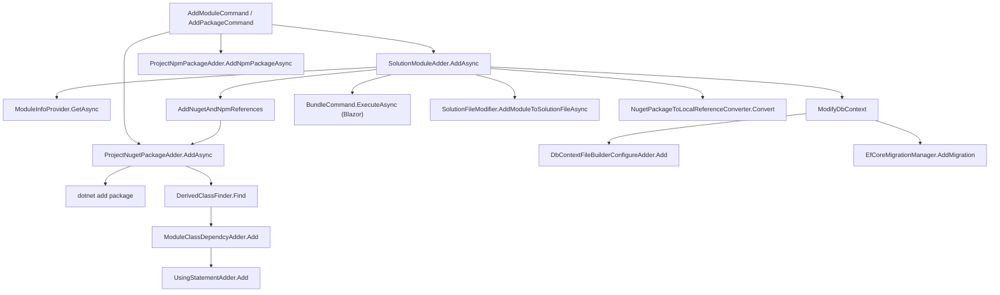

# `ProjectModification` — mutating an existing solution

Where `ProjectBuilding` produces a brand-new project from a template zip, `ProjectModification` works on an existing on-disk solution: it adds a module, installs a NuGet package, inserts `[DependsOn]` attributes, updates `package.json`, applies EF Core migrations, and rewires references. Every type covered here lives under `framework/src/Volo.Abp.Cli.Core/Volo/Abp/Cli/ProjectModification/`. The two top-level orchestrators are `SolutionModuleAdder` (used by `abp add-module`) and `ProjectNugetPackageAdder` / `ProjectNpmPackageAdder` (used by `abp add-package`); everything else is a focused helper they delegate into.

The page covers the orchestrators first, then the file-level mutators (`UsingStatementAdder`, `ModuleClassDependcyAdder`, `DbContextFileBuilderConfigureAdder`), and finally the auxiliary helpers (`DerivedClassFinder`, `EfCoreMigrationManager`, `NpmGlobalPackagesChecker`, `SolutionPackageVersionFinder`, `SolutionFileModifier`).

## `SolutionModuleAdder` — the `abp add-module` engine

`framework/src/Volo.Abp.Cli.Core/Volo/Abp/Cli/ProjectModification/SolutionModuleAdder.cs` is a 900-line orchestrator. Its `AddAsync(solutionFile, moduleName, version, skipDbMigrations, withSourceCode, addSourceCodeToSolutionFile, newTemplate, newProTemplate, skipOpeningDocumentation)` method walks ten distinct phases and publishes `ModuleInstallingProgressEvent` (declared in `framework/src/Volo.Abp.Cli.Core/Volo/Abp/Cli/ProjectModification/Events/ModuleInstallingProgressEvent.cs`) between each so a hosting tool can render real progress:

```csharp
// framework/src/Volo.Abp.Cli.Core/Volo/Abp/Cli/ProjectModification/SolutionModuleAdder.cs
public virtual async Task<ModuleWithMastersInfo> AddAsync(
    [NotNull] string solutionFile, [NotNull] string moduleName,
    string version, bool skipDbMigrations = false,
    bool withSourceCode = false, bool addSourceCodeToSolutionFile = false,
    bool newTemplate = false, bool newProTemplate = false,
    bool skipOpeningDocumentation = false)
{
    await PublishEventAsync(1, "Retrieving module info...");
    var module = await GetModuleInfoAsync(moduleName, newTemplate, newProTemplate);

    await PublishEventAsync(2, "Removing incompatible packages from module...");
    module = RemoveIncompatiblePackages(module, version);

    var projectFiles = ProjectFinder.GetProjectFiles(solutionFile);
    await AddNugetAndNpmReferences(module, projectFiles, !(newTemplate || newProTemplate), version);

    var modulesFolderInSolution = Path.Combine(Path.GetDirectoryName(solutionFile), "modules");

    if (withSourceCode || newTemplate || newProTemplate)
    {
        await PublishEventAsync(5, $"Downloading source code of {moduleName}");
        await DownloadSourceCodesToSolutionFolder(module, modulesFolderInSolution, version, newTemplate, newProTemplate);

        await PublishEventAsync(6, "Deleting incompatible projects from the module source code");
        await RemoveUnnecessaryProjectsAsync(Path.GetDirectoryName(solutionFile), module, projectFiles);

        if (addSourceCodeToSolutionFile)
            await SolutionFileModifier.AddModuleToSolutionFileAsync(module, solutionFile);

        await PublishEventAsync(8, "Changing nuget references to local references");
        await NugetPackageToLocalReferenceConverter.Convert(module, solutionFile, ...);

        await AddAngularSourceCode(modulesFolderInSolution, solutionFile, module.Name, newTemplate || newProTemplate);
    }
    else
    {
        await AddAngularPackages(solutionFile, module);
        await TryConfigureModuleConfigurationsForAngular(solutionFile, module);
    }

    await RunBundleForBlazorAsync(projectFiles, module);
    await ModifyDbContext(projectFiles, module, skipDbMigrations);

    if (module.Name.Contains("LeptonX"))
        await SetLeptonXAbpVersionsAsync(solutionFile, Path.Combine(modulesFolderInSolution, module.Name));

    if (!skipOpeningDocumentation)
    {
        var documentationLink = module.GetFirstDocumentationLinkOrNull();
        if (documentationLink != null) CmdHelper.Open(documentationLink);
    }

    return module;
}
```

<Steps>
  <Step title="Resolve module metadata">
    `GetModuleInfoAsync` calls `ModuleInfoProvider.GetAsync(moduleName)` (the same provider that backs `abp list-modules`, in `framework/src/Volo.Abp.Cli.Core/Volo/Abp/Cli/ProjectBuilding/ModuleInfoProvider.cs`) and returns a `ModuleWithMastersInfo` declared in `framework/src/Volo.Abp.Cli.Core/Volo/Abp/Cli/ProjectModification/ModuleWithMastersInfo.cs`.
  </Step>
  <Step title="Filter incompatible packages">
    `RemoveIncompatiblePackages(module, version)` walks `module.NugetPackages` and discards any whose minimum version is newer than the requested ABP version, so the user does not end up with a half-installed module that depends on a package they cannot resolve.
  </Step>
  <Step title="Install NuGet/NPM references in host projects">
    `AddNugetAndNpmReferences` loops every project file returned by `ProjectFinder.GetProjectFiles` and dispatches to `ProjectNugetPackageAdder` for NuGet packages and `ProjectNpmPackageAdder.AddMvcPackageAsync` for the MVC/Razor side of the NPM packages.
  </Step>
  <Step title="Download source when --with-source-code or --new">
    When the user asked for source code, the module is downloaded via `SourceCodeDownloadService` (covered in [`cli/source-and-modules`](/cli/source-and-modules)) into `<solution>/modules/<ModuleName>/`. Unrelated projects (other DB providers, other UI frameworks) are then deleted by `RemoveUnnecessaryProjectsAsync`.
  </Step>
  <Step title="Convert NuGet references to ProjectReference">
    `NugetPackageToLocalReferenceConverter.Convert` rewrites every `<PackageReference Include="Volo.Module">` in the host csproj files to `<ProjectReference Include="..\modules\Volo.Module\src\Volo.Module\Volo.Module.csproj" />`. The Angular projects get the same treatment via `AngularSourceCodeAdder`.
  </Step>
  <Step title="Run bundle and migrations">
    `RunBundleForBlazorAsync` invokes `BundleCommand.ExecuteAsync` for the Blazor host projects so the new module's static assets land in `wwwroot/global.css/global.js` (see [`cli/bundle-command`](/cli/bundle-command)). `ModifyDbContext` adds the EF Core configuration calls and, when `skipDbMigrations` is `false`, runs `EfCoreMigrationManager.AddMigration` to scaffold the `Added_<Module>_Module_*` migration.
  </Step>
</Steps>

The progress events are coarse-grained (one per phase, ten phases total). They flow through `ILocalEventBus`, so ABP Studio subscribes once and renders a progress bar while the CLI does its work. The `LeptonX` special case at the bottom is a version pinning hook for the commercial theme — it ensures the freshly downloaded theme source compiles against the host's ABP version.

## `ProjectNugetPackageAdder` — `dotnet add package` plus `[DependsOn]`

`framework/src/Volo.Abp.Cli.Core/Volo/Abp/Cli/ProjectModification/ProjectNugetPackageAdder.cs` does the work of `abp add-package <name>`. Its `AddAsync(solutionFile, projectFile, package, version, useDotnetCliToInstall, withSourceCode, addSourceCodeToSolutionFile)` performs four sub-tasks:

```csharp
// framework/src/Volo.Abp.Cli.Core/Volo/Abp/Cli/ProjectModification/ProjectNugetPackageAdder.cs
public async Task AddAsync(string solutionFile, string projectFile, NugetPackageInfo package,
    string version = null, bool useDotnetCliToInstall = true,
    bool withSourceCode = false, bool addSourceCodeToSolutionFile = false)
{
    if (projectFile == null)
    {
        projectFile = GetProjectFile(solutionFile, package);
    }

    solutionFile ??= FindSolutionFile(projectFile);
    if (version == null) version = GetAbpVersionOrNull(projectFile);

    await AddAsPackageReference(projectFile, package, version, useDotnetCliToInstall);

    if (withSourceCode)
    {
        await AddSourceCode(projectFile, solutionFile, package, version);

        var projectFilesInSolution = Directory.GetFiles(
            Path.GetDirectoryName(solutionFile), "*.csproj", SearchOption.AllDirectories);
        foreach (var projectFileInSolution in projectFilesInSolution)
        {
            await ConvertPackageReferenceToProjectReference(projectFileInSolution, solutionFile, package);
        }

        if (addSourceCodeToSolutionFile)
            await SolutionFileModifier.AddPackageToSolutionFileAsync(package, solutionFile);
    }
}
```

`AddAsPackageReference` either shells out to `dotnet add package <name> -v <version>` (when `useDotnetCliToInstall == true`) or edits the csproj XML directly. The shell-out path is the default because it gives the user the same restore output they would see from a manual `dotnet` invocation.

After the package reference lands, `ProjectNugetPackageAdder` uses `DerivedClassFinder` to find the project's `AbpModule`-derived class and `ModuleClassDependcyAdder` to insert the `[DependsOn(typeof(<Module>))]` attribute. That two-step is what makes `abp add-package` semantically richer than `dotnet add package`: not only is the dependency in the csproj, the ABP module graph is updated so the module's services are registered at runtime.

```csharp
// framework/src/Volo.Abp.Cli.Core/Volo/Abp/Cli/ProjectModification/ConvertPackageReferenceToProjectReference (excerpt)
var newNode = doc.CreateElement("ProjectReference");
var includeAttr = doc.CreateAttribute("Include");
includeAttr.Value = referenceProjectPath;
newNode.Attributes.Append(includeAttr);
nodes[0]?.ParentNode?.ReplaceChild(newNode, nodes[0]);
```

The `XmlDocument` path uses `PreserveWhitespace = true` so the rewritten csproj looks the same as before except for the swapped node. That detail matters in source control — without preserved whitespace, every `add-package` would produce a noisy diff.

## `ProjectNpmPackageAdder` — `yarn add` plus Angular source

`framework/src/Volo.Abp.Cli.Core/Volo/Abp/Cli/ProjectModification/ProjectNpmPackageAdder.cs` covers two flavours of NPM consumer: the MVC/Razor host (`AddMvcPackageAsync`) and the Angular workspace (`AddNpmPackageAsync`). Both share the same `yarn add` invocation but differ in what they do after:

```csharp
// framework/src/Volo.Abp.Cli.Core/Volo/Abp/Cli/ProjectModification/ProjectNpmPackageAdder.cs
public async Task AddNpmPackageAsync(string directory, NpmPackageInfo npmPackage,
    string version = null, bool withSourceCode = false)
{
    var packageJsonFilePath = Path.Combine(directory, "package.json");
    if (!File.Exists(packageJsonFilePath))
    {
        Logger.LogError("package.json not found!");
        return;
    }

    NpmHelper.EnsureSafePackageName(npmPackage.Name);
    NpmHelper.EnsureSafeVersion(version);

    if (!File.ReadAllText(packageJsonFilePath).Contains($"\"{npmPackage.Name}\""))
    {
        var versionPostfix = version != null ? $"@{version}" : string.Empty;
        using (DirectoryHelper.ChangeCurrentDirectory(directory))
        {
            Logger.LogInformation("yarn add " + npmPackage.Name + versionPostfix);
            CmdHelper.RunCmd("npx yarn add " + npmPackage.Name + versionPostfix + " --ignore-scripts");
        }
    }

    if (withSourceCode && await DownloadAngularSourceCode(directory, npmPackage, version))
    {
        await AngularSourceCodeAdder.AddAsync(directory, npmPackage);
    }
}
```

`NpmHelper.EnsureSafePackageName` and `EnsureSafeVersion` (in `framework/src/Volo.Abp.Cli.Core/Volo/Abp/Cli/Utils/NpmHelper.cs`) reject any name containing shell metacharacters before the string ever reaches `yarn`. The `--ignore-scripts` flag is the standard guard against malicious postinstall scripts.

`DownloadAngularSourceCode` is the source-code branch: it confirms the package is in the downloadable list (returned by `INpmPackageInfoProvider.GetPackageListAsync()`), wipes any prior copy under `<angular>/projects/<package>/`, and calls `SourceCodeDownloadService.DownloadNpmPackageAsync(name, targetFolder, version)`. After the source lands, `AngularSourceCodeAdder` (in `framework/src/Volo.Abp.Cli.Core/Volo/Abp/Cli/ProjectModification/AngularSourceCodeAdder.cs`) updates `angular.json`, `tsconfig.base.json`, and the Angular workspace's `package.json` so the new project is recognised by `ng build`.

The MVC variant `AddMvcPackageAsync` is much smaller: `yarn add` followed by `InstallLibsService.InstallLibsAsync(directory)` which runs the equivalent of `abp install-libs` to copy `node_modules` assets into `wwwroot/libs/`. That covers the Razor/MVC project's static asset pipeline.

## `ModuleClassDependcyAdder` and `UsingStatementAdder`

`framework/src/Volo.Abp.Cli.Core/Volo/Abp/Cli/ProjectModification/ModuleClassDependcyAdder.cs` is the small helper that inserts `[DependsOn(typeof(NewModule))]` into an existing AbpModule-derived class. It splits the supplied module identifier into namespace + class, uses `UsingStatementAdder` to add the `using` directive if missing, then locates the first `public class` line and prepends the `DependsOn` attribute right before it:

```csharp
// framework/src/Volo.Abp.Cli.Core/Volo/Abp/Cli/ProjectModification/ModuleClassDependcyAdder.cs
public virtual void Add(string path, string module)
{
    ParseModuleNameAndNameSpace(module, out var nameSpace, out var moduleName);

    var file = File.ReadAllText(path);
    file = UsingStatementAdder.Add(file, nameSpace);

    if (!file.Contains(moduleName))
    {
        file = InsertDependsOnAttribute(file, moduleName);
    }

    File.WriteAllText(path, file);
}

protected virtual string GetDependsOnAttribute(string moduleName)
{
    return "[DependsOn(typeof(" + moduleName + "))]" + Environment.NewLine + "    ";
}
```

`UsingStatementAdder` (in `framework/src/Volo.Abp.Cli.Core/Volo/Abp/Cli/ProjectModification/UsingStatementAdder.cs`) is even smaller. It scans for the last `using …;` directive before the `namespace` keyword and appends the new `using` directly after, preserving file style:

```csharp
// framework/src/Volo.Abp.Cli.Core/Volo/Abp/Cli/ProjectModification/UsingStatementAdder.cs
public string Add(string fileContent, string nameSpace)
{
    if (fileContent.Contains($" {nameSpace};")) return fileContent;

    var index = GetIndexOfTheEndOfTheLastUsingStatement(fileContent);
    if (index < 0 || index >= fileContent.Length) index = 0;

    var usingStatement = Environment.NewLine + "using " + nameSpace + ";";
    return fileContent.Insert(index, usingStatement);
}
```

The check `fileContent.Contains($" {nameSpace};")` is deliberately conservative — leading space + trailing semicolon — so the lookup does not match commented-out `usings` or substrings of longer namespaces. The fallback to `index = 0` when no existing `using` is found puts the directive at the top of the file before any namespace declaration.

## `DbContextFileBuilderConfigureAdder` — `OnModelCreating` patching

`framework/src/Volo.Abp.Cli.Core/Volo/Abp/Cli/ProjectModification/DbContextFileBuilderConfigureAdder.cs` is responsible for inserting the `builder.ConfigureModule()` calls into the host `OnModelCreating(ModelBuilder builder)` method. It accepts a string of the shape `"Namespace:Extension, Namespace2:Extension2"` and inserts every extension into the DbContext, adding the corresponding `using`:

```csharp
// framework/src/Volo.Abp.Cli.Core/Volo/Abp/Cli/ProjectModification/DbContextFileBuilderConfigureAdder.cs
public bool Add(string path, string moduleConfiguration)
{
    var file = File.ReadAllText(path);
    var parsedModuleConfiguration = moduleConfiguration.Split(", ");
    var namespaces = parsedModuleConfiguration.Select(GetNamespace);
    var configurationLines = parsedModuleConfiguration.Select(GetLineToAdd);

    var indexToInsert = FindIndexToInsert(file);
    if (indexToInsert <= 0 || indexToInsert >= file.Length)
    {
        Logger.LogWarning($"\"OnModelCreating(ModelBuilder builder)\" method couldn't be found in {path}");
        return false;
    }

    foreach (var configurationLine in configurationLines)
    {
        if (file.Contains(configurationLine)) continue;
        file = file.Insert(indexToInsert, "    " + configurationLine + Environment.NewLine + "        ");
    }

    foreach (var namespaceOfConfiguration in namespaces)
    {
        file = UsingStatementAdder.Add(file, namespaceOfConfiguration);
    }

    File.WriteAllText(path, file);
    return true;
}

protected int FindIndexToInsert(string file)
{
    var indexOfMethodDeclaration = file.IndexOf("OnModelCreating(", StringComparison.Ordinal);
    var indexOfOpeningBracket = indexOfMethodDeclaration + file.Substring(indexOfMethodDeclaration).IndexOf('{');

    var stack = 1;
    var index = indexOfOpeningBracket;
    while (stack > 0)
    {
        index++;
        if (index >= file.Length) break;
        if (file[index] == '{') stack++;
        else if (file[index] == '}') stack--;
    }
    return index;
}
```

`FindIndexToInsert` walks the method body with a tiny brace-stack so the insertion point is at the matching `}` of `OnModelCreating`. That avoids inserting inside a nested `using` block or a control-flow brace, which would compile but be in the wrong place. `GetLineToAdd` builds the call from the right-hand side of the `:` (`"builder." + ext + "();"`) and `GetNamespace` returns the left-hand side as the using directive.

## `DerivedClassFinder` — locating the host's `AbpModule`

`framework/src/Volo.Abp.Cli.Core/Volo/Abp/Cli/ProjectModification/DerivedClassFinder.cs` scans every `.cs` file under the csproj directory (excluding `bin/` and `obj/`) and uses Roslyn (`Microsoft.CodeAnalysis.CSharp.CSharpSyntaxTree`) to parse the syntax tree and detect classes that derive from a supplied base class. `SolutionModuleAdder` and `ProjectNugetPackageAdder` both use it to find the project's `AbpModule`-derived class so `ModuleClassDependcyAdder.Add` can patch the right file:

```csharp
// framework/src/Volo.Abp.Cli.Core/Volo/Abp/Cli/ProjectModification/DerivedClassFinder.cs (excerpt)
foreach (var csFile in csFiles)
{
    try
    {
        if (IsDerived(csFile, baseClass))
        {
            moduleFilePaths.Add(csFile);
        }
    }
    catch (Exception)
    {
        // Unparseable files (partial classes with unresolved generics, etc.) are skipped silently.
    }
}
```

The Roslyn parse is wrapped in a try/catch so a single malformed file does not abort the whole `add-module`. The trade-off is that a project whose AbpModule class is in a file Roslyn cannot parse will silently have no `[DependsOn]` added — the user will see the package land in the csproj but no runtime registration.

## `EfCoreMigrationManager` — running `dotnet ef migrations add`

`framework/src/Volo.Abp.Cli.Core/Volo/Abp/Cli/ProjectModification/EfCoreMigrationManager.cs` shells out to `dotnet ef migrations add` for the project containing the `DbMigrationsDbContext`. It first probes the project for a `TenantDbContext` (the separate-tenant-schema feature) and, if found, runs the add-migration twice — once into the regular `Migrations/` folder, once into `TenantMigrations/`:

```csharp
// framework/src/Volo.Abp.Cli.Core/Volo/Abp/Cli/ProjectModification/EfCoreMigrationManager.cs
public void AddMigration(string dbMigrationsCsprojFile, string module)
{
    var dbMigrationsProjectFolder = Path.GetDirectoryName(dbMigrationsCsprojFile);
    var moduleName = ParseModuleName(module);
    var migrationName = "Added_" + moduleName + "_Module" + GetUniquePostFix();

    var tenantDbContextName = FindTenantDbContextName(dbMigrationsProjectFolder);
    var dbContextName = tenantDbContextName != null
        ? FindDbContextName(dbMigrationsProjectFolder)
        : null;

    if (!string.IsNullOrEmpty(tenantDbContextName))
        RunAddMigrationCommand(dbMigrationsProjectFolder, migrationName, tenantDbContextName, "TenantMigrations");

    RunAddMigrationCommand(dbMigrationsProjectFolder, migrationName, dbContextName, "Migrations");
}
```

The migration name pattern `Added_<Module>_Module_<UniquePostfix>` keeps the migration history human-readable. The postfix is a short timestamp so two consecutive `add-module` calls do not collide. `SolutionModuleAdder.ModifyDbContext` is the caller — it skips the whole step when `skipDbMigrations: true` is supplied.

## `SolutionFileModifier` — sln/slnx surgery

`framework/src/Volo.Abp.Cli.Core/Volo/Abp/Cli/ProjectModification/SolutionFileModifier.cs` wraps the `dotnet sln add`/`remove` commands. It is used by `ProjectNugetPackageAdder` when `addSourceCodeToSolutionFile: true` is supplied and by `SolutionModuleAdder` when the user passed `--add-to-solution-file`:

```csharp
// framework/src/Volo.Abp.Cli.Core/Volo/Abp/Cli/ProjectModification/SolutionFileModifier.cs
public async Task RemoveProjectFromSolutionFileAsync(string solutionFile, string projectName)
{
    var workingDirectory = Path.GetDirectoryName(solutionFile);
    var list = _cmdHelper.RunCmdAndGetOutput($"dotnet sln \"{solutionFile}\" list",
        workingDirectory: workingDirectory);

    foreach (var line in list.Split(new[] { Environment.NewLine, "\n" }, StringSplitOptions.None))
    {
        if (Path.GetFileNameWithoutExtension(line.Trim())
            .Equals(projectName, StringComparison.InvariantCultureIgnoreCase))
        {
            _cmdHelper.RunCmd(
                $"dotnet sln \"{solutionFile}\" remove \"{line.Trim()}\"",
                workingDirectory: workingDirectory);
            break;
        }
    }
}

public async Task AddPackageToSolutionFileAsync(NugetPackageInfo package, string solutionFile)
{
    _cmdHelper.RunCmd($"dotnet sln \"{solutionFile}\" add " +
                      $"\"packages\\{package.Name}\\{package.Name}.csproj\" " +
                      "--solution-folder src");
}
```

The relative path `packages\<Name>\<Name>.csproj` matches the convention `ProjectNugetPackageAdder.AddSourceCode` uses to drop the source under `<solution>/packages/<Name>/`. Using `dotnet sln` instead of parsing the file by hand keeps `.sln` and `.slnx` compatibility — `dotnet sln` accepts both.

## `SolutionPackageVersionFinder` — pinning to the host version

`framework/src/Volo.Abp.Cli.Core/Volo/Abp/Cli/ProjectModification/SolutionPackageVersionFinder.cs` resolves the host's ABP version from one of two sources: an existing csproj's `<PackageReference Include="Volo.Abp..." Version="..." />` element, or a `Volo.Abp*.dll` file inside `bin/`. The two-tier resolution accommodates both fresh checkouts (no build artefacts yet, so the csproj wins) and modified solutions (where the csproj might have a `*` wildcard that needs to be resolved against the on-disk dll):

```csharp
// framework/src/Volo.Abp.Cli.Core/Volo/Abp/Cli/ProjectModification/SolutionPackageVersionFinder.cs
public string FindByDllVersion(string solutionFile, string dllName = "Volo.Abp*")
{
    var projectFilesUnderSrc = GetProjectFilesOfSolution(solutionFile);
    foreach (var projectFile in projectFilesUnderSrc)
    {
        var dllFiles = Directory.GetFiles(Path.GetDirectoryName(projectFile)!,
            $"{dllName}.dll", SearchOption.AllDirectories);
        if (dllFiles.Any())
        {
            var version = FileVersionInfo.GetVersionInfo(dllFiles.First());
            return $"{version.FileMajorPart}.{version.FileMinorPart}.{version.FileBuildPart}";
        }
    }
    return null;
}

public string FindByCsprojVersion(string solutionFile,
    string packagePrefix = "Volo.Abp", string excludedKeywords = "LeptonX",
    string includedKeyword = null)
{
    // ... scans csproj XML for <PackageReference> matching the prefix
}
```

`AddModuleCommand.ExecuteAsync` calls `FindByCsprojVersion` first, then `FindByDllVersion` for LeptonX-specific lookups when the csproj has a wildcard. The `excludedKeywords = "LeptonX"` default keeps the regular lookup from picking up the LeptonX package version when looking for a plain `Volo.Abp.*` reference.

## `NpmGlobalPackagesChecker` — `yarn` precondition

`framework/src/Volo.Abp.Cli.Core/Volo/Abp/Cli/ProjectModification/NpmGlobalPackagesChecker.cs` is a one-method helper called near the top of `SolutionModuleAdder.AddAsync`. It ensures `yarn` is installed globally because the package-add path uses `npx yarn add` to install NPM packages, and a missing yarn would produce confusing errors deep inside the package install. The check is purely advisory — if yarn is missing, the helper installs it via `NpmHelper.InstallYarn`:

```csharp
// framework/src/Volo.Abp.Cli.Core/Volo/Abp/Cli/ProjectModification/NpmGlobalPackagesChecker.cs
public void Check()
{
    var installedNpmPackages = NpmHelper.GetInstalledNpmPackages();
    if (!installedNpmPackages.Contains(" yarn@"))
    {
        NpmHelper.InstallYarn();
    }
}
```

The leading space in `" yarn@"` is deliberate — it avoids a false-positive match against package names that happen to end with `yarn` such as `super-yarn`.

## `BlazorProjectTypeChecker` and `ProjectFinder`

`framework/src/Volo.Abp.Cli.Core/Volo/Abp/Cli/ProjectModification/BlazorProjectTypeChecker.cs` distinguishes a Blazor Server project from a Blazor WebAssembly project by reading the csproj content. The check is a static method:

```csharp
public static bool IsBlazorServerProject(string blazorProjectPath)
{
    var content = File.ReadAllText(blazorProjectPath);
    return !content.Contains("Microsoft.NET.Sdk.BlazorWebAssembly")
        && content.Contains("Volo.Abp.AspNetCore.Components.Server");
}
```

`SolutionModuleAdder.RunBundleForBlazorAsync` uses the checker to decide whether the freshly installed module's static assets need to be re-bundled via `BundleCommand.ExecuteAsync` — only WebAssembly hosts need the bundle. `ProjectFinder` (in `framework/src/Volo.Abp.Cli.Core/Volo/Abp/Cli/ProjectModification/ProjectFinder.cs`) is the catalog walker that returns every csproj under a solution; it backs every `foreach` over `projectFiles` in the adders.

## `PackagePreviewSwitcher` and `VoloNugetPackagesVersionUpdater`

Two additional helpers ship in the same folder. `PackagePreviewSwitcher` (in `PackagePreviewSwitcher.cs`) toggles a solution between stable, preview, nightly, pre-rc, and local NuGet sources by editing `NuGet.Config`. It powers the `abp switch-to-*` commands (`SwitchToLocalCommand`, `SwitchToNightlyCommand`, etc. in `framework/src/Volo.Abp.Cli.Core/Volo/Abp/Cli/Commands/`). `VoloNugetPackagesVersionUpdater` bumps every `<PackageReference Include="Volo.*">` to a target version in one pass — that is the engine behind `abp update`.

```csharp
// framework/src/Volo.Abp.Cli.Core/Volo/Abp/Cli/ProjectModification/PackagePreviewSwitcher.cs (sketch)
// Reads NuGet.Config, manipulates <packageSources> and <packageSourceMapping>
// to switch between abp.io stable, preview, nightly, and the local file feed.
```

## `Events/ModuleInstallingProgressEvent`

`framework/src/Volo.Abp.Cli.Core/Volo/Abp/Cli/ProjectModification/Events/ModuleInstallingProgressEvent.cs` is the only event the modification layer publishes:

```csharp
public class ModuleInstallingProgressEvent
{
    public int CurrentStep { get; set; }
    public string Message { get; set; }
}
```

`SolutionModuleAdder.PublishEventAsync(int step, string message)` is what fires the event before each of the ten phases described earlier. The companion event in `ProjectBuilding/Events/ProjectCreationProgressEvent.cs` is published during `abp new`; both event types share the same `ILocalEventBus` and let ABP Studio render a unified progress UI across "create" and "add" flows.

## End-to-end map



## Related pages

- [`cli/source-and-modules`](/cli/source-and-modules) covers the user-facing commands that invoke these adders.
- [`cli/project-building`](/cli/project-building) handles the from-scratch pipeline; this page handles the on-disk mutations.
- [`cli/bundle-command`](/cli/bundle-command) is invoked by `SolutionModuleAdder.RunBundleForBlazorAsync` for Blazor WebAssembly hosts.
- [`cli/service-proxying`](/cli/service-proxying) shares `ProxyCommandBase` with `RemoveProxyCommand` — that command does not modify projects but does mutate the proxies these adders rely on.
