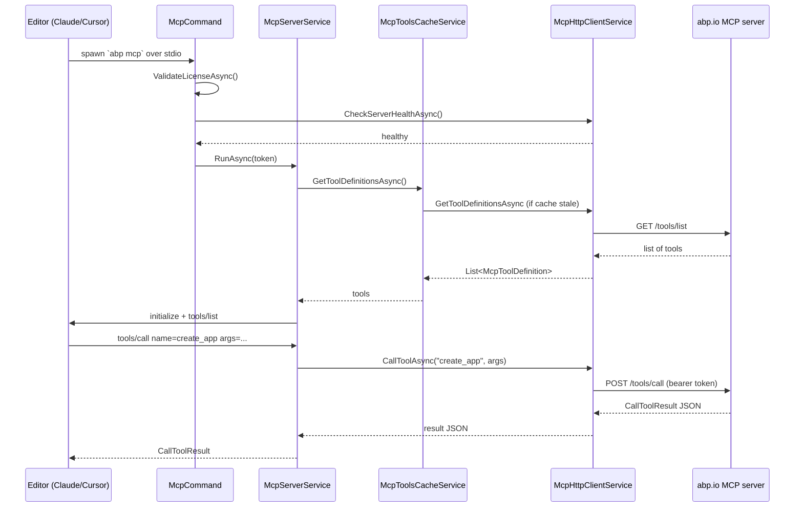

# `abp prompt` and `abp mcp` — AI tooling integration

ABP Framework exposes two commands aimed at AI-assisted development. `abp prompt` is a placeholder hook reserved for an interactive REPL experience and is implemented in `framework/src/Volo.Abp.Cli.Core/Volo/Abp/Cli/Commands/PromptCommand.cs`. `abp mcp` is a full Model Context Protocol (MCP) stdio server implemented in `framework/src/Volo.Abp.Cli.Core/Volo/Abp/Cli/Commands/McpCommand.cs` and `framework/src/Volo.Abp.Cli.Core/Volo/Abp/Cli/Commands/Services/McpServerService.cs`. The MCP command lets editors like Claude Desktop, Cursor, and VS Code connect to ABP-specific tools — scaffolding, project introspection, license checks — while staying inside the editor.

The two commands share an ecosystem: the `ai-rules/` folder at the repository root (`/home/daytona/repos/abpframework/abp/ai-rules/`) carries the `.mdc` rule files that ABP solution templates copy into new projects so that the AI assistant has ABP-specific context. The MCP server is what loads those rules at runtime and proxies them through to the host editor; the prompt command is the placeholder for a future interactive shell.

## `PromptCommand` — placeholder for an interactive shell

`framework/src/Volo.Abp.Cli.Core/Volo/Abp/Cli/Commands/PromptCommand.cs` is intentionally a stub today. It implements `IConsoleCommand` and `ITransientDependency` so it appears in the command catalogue, but its `ExecuteAsync` just returns `Task.CompletedTask`:

```csharp
// framework/src/Volo.Abp.Cli.Core/Volo/Abp/Cli/Commands/PromptCommand.cs
public class PromptCommand : IConsoleCommand, ITransientDependency
{
    public const string Name = "prompt";

    public Task ExecuteAsync(CommandLineArgs commandLineArgs)
    {
        return Task.CompletedTask;
    }

    public string GetUsageInfo()
    {
        var sb = new StringBuilder();
        sb.AppendLine("Usage:");
        sb.AppendLine("  abp prompt");
        sb.AppendLine("See the documentation for more info: https://abp.io/docs/latest/cli");
        return sb.ToString();
    }

    public static string GetShortDescription()
    {
        return "Starts with prompt mode.";
    }
}
```

The command is registered through the conventional DI scan in `AbpCliCoreModule` and shows up in `abp help`. Because the stub is part of the published surface, third-party tooling can dispatch to it without breaking; the placeholder lets the team evolve the prompt mode without renaming the command name later. The real interactive flows today happen through `abp mcp` plus an MCP-aware editor.

## `McpCommand` — boot, license gate, server loop

`framework/src/Volo.Abp.Cli.Core/Volo/Abp/Cli/Commands/McpCommand.cs` is the entry point that an editor's MCP launcher invokes. It accepts a single positional argument — `get-config` — that switches between "start the MCP stdio server" and "print a JSON snippet the user pastes into their MCP client config".

```csharp
// framework/src/Volo.Abp.Cli.Core/Volo/Abp/Cli/Commands/McpCommand.cs
public async Task ExecuteAsync(CommandLineArgs commandLineArgs)
{
    await ValidateLicenseAsync();

    var option = commandLineArgs.Target;
    if (!string.IsNullOrEmpty(option)
        && option.Equals("get-config", StringComparison.OrdinalIgnoreCase))
    {
        await PrintConfigurationAsync();
        return;
    }

    await using var _ = _telemetryService.TrackActivityAsync(ActivityNameConsts.AbpCliCommandsMcp);

    _mcpLogger.Info(LogSource, "Checking ABP.IO MCP Server connection...");
    var isHealthy = await _mcpHttpClient.CheckServerHealthAsync();
    if (!isHealthy)
    {
        throw new CliUsageException(
            "Could not connect to ABP.IO MCP Server. " +
            "The MCP server requires a connection to fetch tool definitions. ...");
    }

    _mcpLogger.Info(LogSource, "Starting ABP MCP Server...");
    var cts = new CancellationTokenSource();
    Console.CancelKeyPress += (sender, e) => { e.Cancel = true; cts.Cancel(); };
    try   { await _mcpServerService.RunAsync(cts.Token); }
    catch (OperationCanceledException) { /* Ctrl+C */ }
    finally { Console.CancelKeyPress -= /* ... */; cts.Dispose(); }
}
```

The boot sequence is deliberate: license check first (otherwise the server starts and only fails when an editor calls a tool), telemetry second (so the session length is logged), health probe third (to give an early, clear error when `account.abp.io` is unreachable), and then `RunAsync(cts.Token)` blocks until either the cancellation token fires or the stdio peer disconnects. `Console.CancelKeyPress` is wired so Ctrl+C does not kill the process — it just signals the cancellation token cleanly.

### License gate

`ValidateLicenseAsync` is the gatekeeper. It calls `AuthService.GetLoginInfoAsync()` (see [`cli/login-and-auth`](/cli/login-and-auth)) and refuses to start the server if the user is not logged in to an organization, or if the license has expired:

```csharp
// framework/src/Volo.Abp.Cli.Core/Volo/Abp/Cli/Commands/McpCommand.cs
private async Task ValidateLicenseAsync()
{
    var loginInfo = await _authService.GetLoginInfoAsync();
    if (string.IsNullOrEmpty(loginInfo?.Organization))
    {
        throw new CliUsageException("Please log in with your account!");
    }

    var licenseResult = await _apiKeyService.GetApiKeyOrNullAsync();
    if (licenseResult == null || !licenseResult.HasActiveLicense)
    {
        var errorMessage = licenseResult?.ErrorMessage ?? "No active license found.";
        throw new CliUsageException(errorMessage);
    }

    if (licenseResult.LicenseEndTime.HasValue
        && licenseResult.LicenseEndTime.Value < DateTime.UtcNow)
    {
        throw new CliUsageException(
            "Your license has expired. Please renew your license to use the MCP server.");
    }
}
```

`IApiKeyService` is declared in `framework/src/Volo.Abp.Cli.Core/Volo/Abp/Cli/Licensing/IApiKeyService.cs` with `AbpIoApiKeyService` as the implementation under the same folder. The result `DeveloperApiKeyResult` carries `HasActiveLicense` and `LicenseEndTime`, which the gate uses to refuse expired tokens even when the bearer is still valid.

### `get-config` and editor configuration

`PrintConfigurationAsync` emits the JSON snippet an editor expects in its `mcp_servers` config. It builds a strongly-typed `McpClientConfiguration` (declared in `framework/src/Volo.Abp.Cli.Core/Volo/Abp/Cli/Commands/Models/McpClientConfiguration.cs`) and serialises it with camelCase property names:

```csharp
// framework/src/Volo.Abp.Cli.Core/Volo/Abp/Cli/Commands/McpCommand.cs
private Task PrintConfigurationAsync()
{
    var config = new McpClientConfiguration
    {
        McpServers = new Dictionary<string, McpServerConfig>
        {
            ["abp"] = new McpServerConfig
            {
                Command = "abp",
                Args = new List<string> { "mcp" },
                Env = new Dictionary<string, string>()
            }
        }
    };

    var json = JsonSerializer.Serialize(config, new JsonSerializerOptions
    {
        WriteIndented = true,
        PropertyNamingPolicy = JsonNamingPolicy.CamelCase
    });

    Console.WriteLine(json);
    return Task.CompletedTask;
}
```

The output drops directly into Claude Desktop's `claude_desktop_config.json` or Cursor's MCP configuration, telling the host to spawn `abp mcp` and speak the protocol over stdio.

```json
{
  "mcpServers": {
    "abp": {
      "command": "abp",
      "args": ["mcp"],
      "env": {}
    }
  }
}
```

## `McpServerService` — registering tools dynamically

`framework/src/Volo.Abp.Cli.Core/Volo/Abp/Cli/Commands/Services/McpServerService.cs` is where the protocol implementation lives. It uses `ModelContextProtocol.Server.McpServer.Create(...)` with a `StdioServerTransport` so all wire traffic flows over stdin/stdout. Importantly, it passes `NullLoggerFactory.Instance` to the transport so the MCP library does not write protocol logs to stdout — every log line is routed through `IMcpLogger` instead (file + stderr).

```csharp
// framework/src/Volo.Abp.Cli.Core/Volo/Abp/Cli/Commands/Services/McpServerService.cs
public async Task RunAsync(CancellationToken cancellationToken = default)
{
    _mcpLogger.Info(LogSource, "Starting ABP MCP Server (stdio)");

    var options = new McpServerOptions();
    await RegisterAllToolsAsync(options);

    var server = McpServer.Create(
        new StdioServerTransport("abp-mcp-server", NullLoggerFactory.Instance),
        options);

    await server.RunAsync(cancellationToken);
    _mcpLogger.Info(LogSource, "ABP MCP Server stopped");
}
```

Tools are registered dynamically — the local CLI does not know the list of ABP tools at compile time. Instead `McpToolsCacheService` either serves a cached `~/.abp/cli/mcp-tools.json` (the `CliPaths.McpToolsCache` constant in `framework/src/Volo.Abp.Cli.Core/Volo/Abp/Cli/CliPaths.cs`) or falls back to fetching the catalogue from the ABP.IO MCP server when the cache is older than 24 hours:

```csharp
// framework/src/Volo.Abp.Cli.Core/Volo/Abp/Cli/Commands/Services/McpServerService.cs
private async Task RegisterAllToolsAsync(McpServerOptions options)
{
    var toolDefinitions = await _toolsCacheService.GetToolDefinitionsAsync();
    _mcpLogger.Info(LogSource, $"Registering {toolDefinitions.Count} tools");
    foreach (var toolDef in toolDefinitions)
    {
        RegisterToolFromDefinition(options, toolDef);
    }
}
```

Each tool is represented by an `McpToolDefinition` (DTO in `framework/src/Volo.Abp.Cli.Core/Volo/Abp/Cli/Commands/Models/McpToolDefinition.cs`) with a name, description, and JSON-schema `InputSchema`. `RegisterTool` builds an `AbpMcpServerTool` (in `framework/src/Volo.Abp.Cli.Core/Volo/Abp/Cli/Commands/Services/AbpMcpServerTool.cs`) and adds it to `options.ToolCollection`.

```csharp
// framework/src/Volo.Abp.Cli.Core/Volo/Abp/Cli/Commands/Services/AbpMcpServerTool.cs
internal class AbpMcpServerTool : McpServerTool
{
    public override Tool ProtocolTool => new Tool
    {
        Name = _name,
        Description = _description,
        InputSchema = _inputSchema,
        OutputSchema = _outputSchema
    };

    public override ValueTask<CallToolResult> InvokeAsync(
        RequestContext<CallToolRequestParams> context,
        CancellationToken cancellationToken) => _handler(context, cancellationToken);
}
```

### Proxying tool invocations

When the editor calls a tool, `HandleToolInvocationAsync` forwards the JSON arguments to the ABP.IO MCP server via `McpHttpClientService.CallToolAsync`, then deserialises the JSON response as `CallToolResult`:

```csharp
// framework/src/Volo.Abp.Cli.Core/Volo/Abp/Cli/Commands/Services/McpServerService.cs
private async ValueTask<CallToolResult> HandleToolInvocationAsync(
    string toolName,
    RequestContext<CallToolRequestParams> context,
    CancellationToken cancellationToken)
{
    _mcpLogger.Debug(LogSource, $"Tool '{toolName}' called with arguments: {context.Params.Arguments}");

    try
    {
        var argumentsJson = JsonSerializer.SerializeToElement(context.Params.Arguments);
        var resultJson = await _mcpHttpClient.CallToolAsync(toolName, argumentsJson);
        var callToolResult = TryDeserializeResult(resultJson, toolName);
        if (callToolResult != null) { return callToolResult; }
        return CreateErrorResult(ToolErrorMessages.InvalidResponseFormat);
    }
    catch (Exception ex)
    {
        _mcpLogger.Error(LogSource, $"Tool '{toolName}' execution failed '{ex.Message}'", ex);
        return CreateErrorResult(ToolErrorMessages.UnexpectedError);
    }
}
```

The error-handling is sanitised — internal exceptions never reach the editor as raw stack traces. The two canned messages live in a private nested `ToolErrorMessages` class: `"The tool execution completed but returned an invalid response format. Please try again."` and `"The tool execution failed due to an unexpected error. Please try again later."`.

### `McpHttpClientService` and tool name whitelisting

`framework/src/Volo.Abp.Cli.Core/Volo/Abp/Cli/Commands/Services/McpHttpClientService.cs` is a singleton wrapper around `CliHttpClientFactory`. Two safety-rails are worth highlighting. First, it whitelists tool names against the list it received from the catalogue, so an editor cannot trick the proxy into calling an arbitrary URL by inventing a tool name. Second, every call requires authentication — `_httpClientFactory.CreateClient(needsAuthentication: true)` attaches the cached access token.

```csharp
// framework/src/Volo.Abp.Cli.Core/Volo/Abp/Cli/Commands/Services/McpHttpClientService.cs
if (_validToolNames != null && !_validToolNames.Contains(toolName))
{
    _mcpLogger.Warning(LogSource, $"Attempted to call unknown tool: {toolName}");
    return CreateErrorResponse($"Unknown tool: {toolName}");
}

var baseUrl = await GetMcpServerUrlAsync();
var url = $"{baseUrl}/tools/call";

using var httpClient = _httpClientFactory.CreateClient(needsAuthentication: true);
var jsonContent = JsonSerializer.Serialize(
    new { name = toolName, arguments }, JsonSerializerOptionsWeb);
var content = new StringContent(jsonContent, Encoding.UTF8, "application/json");
var response = await httpClient.PostAsync(url, content);
```

## `McpToolsCacheService` and persistent state

`framework/src/Volo.Abp.Cli.Core/Volo/Abp/Cli/Commands/Services/McpToolsCacheService.cs` keeps the tool catalogue cached for 24 hours under `CliPaths.McpToolsCache` (`~/.abp/cli/mcp-tools.json`). The freshness check is recorded through `MemoryService` (in `framework/src/Volo.Abp.Cli.Core/Volo/Abp/Cli/Memory/MemoryService.cs`), which keeps simple key/value pairs in a flat text file under `memory.bin`. Together with `CliPaths.McpConfig` and `CliPaths.McpLog`, the MCP server owns three persistent files alongside the access token:

<CardGroup cols={2}>
  <Card title="~/.abp/cli/mcp-tools.json" icon="toolbox">
    Cached tool definitions returned by the ABP.IO MCP server. Path constant `CliPaths.McpToolsCache`. Refreshed every 24 hours by `McpToolsCacheService`.
  </Card>
  <Card title="~/.abp/cli/mcp-config.json" icon="gear">
    Local MCP configuration. Path constant `CliPaths.McpConfig`. Used by tools that need to remember user preferences across invocations.
  </Card>
  <Card title="~/.abp/cli/logs/mcp.log" icon="file-lines">
    Serilog file sink target for `IMcpLogger`. Path constant `CliPaths.McpLog`. Receives every log line at or above the configured level.
  </Card>
  <Card title="memory.bin" icon="memory">
    Generic state store used by `McpToolsCacheService` to track the last refresh timestamp. Lives next to the CLI executable per `CliPaths.Memory`.
  </Card>
</CardGroup>

## `IMcpLogger` — split file + stderr logging

`framework/src/Volo.Abp.Cli.Core/Volo/Abp/Cli/Commands/Services/IMcpLogger.cs` declares Debug/Info/Warning/Error methods that take a `source` string for the call site. The default implementation `McpLogger` (in `framework/src/Volo.Abp.Cli.Core/Volo/Abp/Cli/Commands/Services/McpLogger.cs`) is `ISingletonDependency` and writes everything to the Serilog `ILogger<McpLogger>` (which the host has configured to write to `CliPaths.McpLog`). Warnings and errors are additionally forwarded to `Console.Error.WriteLine`, so the editor's console panel still sees them even though stdout is reserved for the MCP wire protocol:

```csharp
// framework/src/Volo.Abp.Cli.Core/Volo/Abp/Cli/Commands/Services/McpLogger.cs
public class McpLogger : IMcpLogger, ISingletonDependency
{
    private const string LogPrefix = "[MCP]";

    public void Debug(string source, string message) => Log(McpLogLevel.Debug, source, message);
    public void Info(string source, string message)  => Log(McpLogLevel.Info, source, message);
    public void Warning(string source, string message) => Log(McpLogLevel.Warning, source, message);
    public void Error(string source, string message)   => Log(McpLogLevel.Error, source, message);
}
```

`ABP_MCP_LOG_LEVEL` is the environment variable that toggles the verbosity threshold. The class header lists it explicitly: *"Log level is controlled via ABP_MCP_LOG_LEVEL environment variable"*. The default is `Info`, so debug messages do not flood the log file by default.

## `ai-rules/` tie-in

The repo root `ai-rules/` directory (`/home/daytona/repos/abpframework/abp/ai-rules/`) holds Cursor-format `.mdc` rule files that ship with ABP solution templates. The structure exposes one rule per topic — `common/abp-core.mdc`, `common/ddd-patterns.mdc`, `common/application-layer.mdc`, `common/authorization.mdc`, `common/multi-tenancy.mdc`, `common/infrastructure.mdc`, `common/dependency-rules.mdc`, `common/development-flow.mdc`, and `common/cli-commands.mdc`. The README explains their purpose:

> Large language models don't retain memory between completions. Rules provide persistent, reusable context at the prompt level. When applied, rule contents are included at the start of the model context.

These rules are not loaded by `abp mcp` directly — the MCP server uses tool definitions fetched from `account.abp.io` for runtime behaviour. The rules are instead copied into freshly scaffolded projects by the `abp new` pipeline (the template steps that handle this live under `framework/src/Volo.Abp.Cli.Core/Volo/Abp/Cli/ProjectBuilding/Templates/`, documented in [`cli/project-building`](/cli/project-building)). When the developer opens the new project in an MCP-aware editor, both the rule files and the MCP server are present, giving the AI assistant ABP-specific context plus the ability to call ABP-specific tools.

## Sequence — editor calls an ABP MCP tool



The same diagram applies to every other tool invocation. The CLI is purely a proxy plus license gate; the actual capabilities live in the cloud MCP server, which is why the local install is small and the editor only needs the `abp` tool to participate.

## Sibling commands worth knowing

<AccordionGroup>
  <Accordion title="abp suite" icon="briefcase">
    `framework/src/Volo.Abp.Cli.Core/Volo/Abp/Cli/Commands/SuiteCommand.cs` launches ABP Suite, which has its own UI on `http://localhost:3000`. The license validation in `McpCommand.ValidateLicenseAsync` mirrors what `SuiteCommand.ExecuteAsync` does under `#if !DEBUG` so both Pro tools share the same gate.
  </Accordion>
  <Accordion title="abp clear-download-cache" icon="trash">
    `framework/src/Volo.Abp.Cli.Core/Volo/Abp/Cli/Commands/ClearDownloadCacheCommand.cs` removes `~/.abp/templates/` and is a useful escape hatch when the MCP tools cache or the template cache misbehaves.
  </Accordion>
  <Accordion title="abp help prompt / abp help mcp" icon="circle-question">
    `HelpCommand` (in `framework/src/Volo.Abp.Cli.Core/Volo/Abp/Cli/Commands/HelpCommand.cs`) prints the per-command usage that both `PromptCommand.GetUsageInfo` and `McpCommand.GetUsageInfo` emit. Run `abp help mcp` to see the `get-config` switch documented inline.
  </Accordion>
</AccordionGroup>

## What the user experiences

The end-to-end flow for setting up the MCP integration is three commands:

```bash
# 1. Make sure the CLI can authenticate (writes ~/.abp/cli/access-token.bin)
abp login john -o acme

# 2. Print the MCP server configuration the editor expects
abp mcp get-config

# 3. Drop the JSON into Claude / Cursor / VS Code MCP settings
#    The editor will spawn `abp mcp` on demand.
```

Once configured, the editor restarts the MCP server every time the user opens a workspace; the cached tool catalogue means the second-and-later start is offline-friendly for 24 hours. License expiration during a session will not interrupt the running server — `ValidateLicenseAsync` only fires at startup — but the next restart will refuse to come online with the same message the editor saw the first time.
