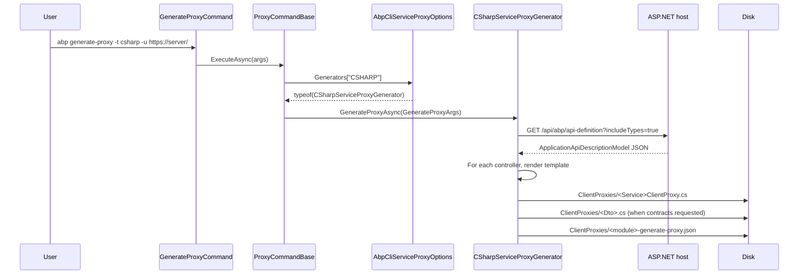

# `abp generate-proxy` and the `ServiceProxying` pipeline

ABP Framework's auto API controllers expose every application service over HTTP, and ABP ships a service-proxy generator that lets the consumer side call those endpoints with the same C#/TypeScript/JavaScript surface that the server defines. The CLI commands `abp generate-proxy` and `abp remove-proxy` are the developer entry points; the generators that do the work live under `framework/src/Volo.Abp.Cli.Core/Volo/Abp/Cli/ServiceProxying/`. This page walks the `IServiceProxyGenerator` contract, the `ServiceProxyGeneratorBase<T>` helper that fetches `api/abp/api-definition`, and the three concrete generators — `CSharpServiceProxyGenerator`, `AngularServiceProxyGenerator`, and `JavaScriptServiceProxyGenerator`.

The two commands share `ProxyCommandBase<T>` (in `framework/src/Volo.Abp.Cli.Core/Volo/Abp/Cli/Commands/ProxyCommandBase.cs`), which parses arguments into `GenerateProxyArgs` and dispatches to the right generator based on the `-t|--type` switch. The generators themselves branch on `args.CommandName == RemoveProxyCommand.Name` to switch between "write files" and "delete files". The user-facing commands are documented under [`cli/source-and-modules`](/cli/source-and-modules) (for `RemoveProxyCommand`) and `abp generate-proxy` is a sibling under the same base class.

## `IServiceProxyGenerator` and registration

`framework/src/Volo.Abp.Cli.Core/Volo/Abp/Cli/ServiceProxying/IServiceProxyGenerator.cs` declares a single method:

```csharp
public interface IServiceProxyGenerator
{
    Task GenerateProxyAsync(GenerateProxyArgs args);
}
```

`AbpCliServiceProxyOptions` (in `framework/src/Volo.Abp.Cli.Core/Volo/Abp/Cli/ServiceProxying/AbpCliServiceProxyOptions.cs`) carries a `Generators` dictionary keyed by uppercase type name:

```csharp
public class AbpCliServiceProxyOptions
{
    public IDictionary<string, Type> Generators { get; }
    public AbpCliServiceProxyOptions() { Generators = new Dictionary<string, Type>(); }
}
```

`AbpCliCoreModule` (in `framework/src/Volo.Abp.Cli.Core/Volo/Abp/Cli/AbpCliCoreModule.cs`) registers the three built-in generators against the keys `JS`, `NG`, and `CSHARP`:

```csharp
// framework/src/Volo.Abp.Cli.Core/Volo/Abp/Cli/AbpCliCoreModule.cs
Configure<AbpCliServiceProxyOptions>(options =>
{
    options.Generators[JavaScriptServiceProxyGenerator.Name] = typeof(JavaScriptServiceProxyGenerator);
    options.Generators[AngularServiceProxyGenerator.Name] = typeof(AngularServiceProxyGenerator);
    options.Generators[CSharpServiceProxyGenerator.Name] = typeof(CSharpServiceProxyGenerator);
});
```

That dictionary is what `ProxyCommandBase.ExecuteAsync` looks up to find the concrete generator type. Adding a custom generator (for, say, Vue or Flutter) is as simple as registering an `IServiceProxyGenerator` implementation against a new dictionary key in the consumer's module.

## `ProxyCommandBase` and `GenerateProxyArgs`

`framework/src/Volo.Abp.Cli.Core/Volo/Abp/Cli/Commands/ProxyCommandBase.cs` is shared by `GenerateProxyCommand` (in `framework/src/Volo.Abp.Cli.Core/Volo/Abp/Cli/Commands/GenerateProxyCommand.cs`) and `RemoveProxyCommand` (in `framework/src/Volo.Abp.Cli.Core/Volo/Abp/Cli/Commands/RemoveProxyCommand.cs`). The base class reads every option once, validates the `-t|--type` flag against `ServiceProxyOptions.Generators`, then resolves the generator from a fresh DI scope:

```csharp
// framework/src/Volo.Abp.Cli.Core/Volo/Abp/Cli/Commands/ProxyCommandBase.cs
public async Task ExecuteAsync(CommandLineArgs commandLineArgs)
{
    var generateType = commandLineArgs.Options
        .GetOrNull(Options.GenerateType.Short, Options.GenerateType.Long)?.ToUpperInvariant();

    if (string.IsNullOrWhiteSpace(generateType))
        throw new CliUsageException("Option Type is required" + ... );

    if (!ServiceProxyOptions.Generators.ContainsKey(generateType))
        throw new CliUsageException("Option Type value is invalid" + ... );

    using (var scope = ServiceScopeFactory.CreateScope())
    {
        var generatorType = ServiceProxyOptions.Generators[generateType];
        var serviceProxyGenerator = scope.ServiceProvider
            .GetService(generatorType).As<IServiceProxyGenerator>();
        await serviceProxyGenerator.GenerateProxyAsync(BuildArgs(commandLineArgs));
    }
}
```

`BuildArgs` is the single place where every CLI option becomes a strongly-typed `GenerateProxyArgs` (in `framework/src/Volo.Abp.Cli.Core/Volo/Abp/Cli/ServiceProxying/GenerateProxyArgs.cs`):

```csharp
// framework/src/Volo.Abp.Cli.Core/Volo/Abp/Cli/Commands/ProxyCommandBase.cs
private GenerateProxyArgs BuildArgs(CommandLineArgs commandLineArgs)
{
    var url = commandLineArgs.Options.GetOrNull(Options.Url.Short, Options.Url.Long);
    var target = commandLineArgs.Options.GetOrNull(Options.Target.Long);
    var module = commandLineArgs.Options.GetOrNull(Options.Module.Short, Options.Module.Long) ?? "app";
    var output = commandLineArgs.Options.GetOrNull(Options.Output.Short, Options.Output.Long);
    var apiName = commandLineArgs.Options.GetOrNull(Options.ApiName.Short, Options.ApiName.Long);
    var source = commandLineArgs.Options.GetOrNull(Options.Source.Short, Options.Source.Long);
    var workDirectory = commandLineArgs.Options.GetOrNull(Options.WorkDirectory.Short,
        Options.WorkDirectory.Long) ?? Directory.GetCurrentDirectory();
    var folder = commandLineArgs.Options.GetOrNull(Options.Folder.Long);
    var serviceTypeArg = commandLineArgs.Options.GetOrNull(Options.ServiceType.Short, Options.ServiceType.Long);
    var entryPointArg = commandLineArgs.Options.GetOrNull(Options.EntryPoint.Short, Options.EntryPoint.Long);

    ServiceType? serviceType = null;
    if (!serviceTypeArg.IsNullOrWhiteSpace())
    {
        serviceType = serviceTypeArg.ToLowerInvariant() == "application" ? ServiceType.Application
                    : serviceTypeArg.ToLowerInvariant() == "integration" ? ServiceType.Integration
                    : ServiceType.All;
    }

    var withoutContracts = commandLineArgs.Options.ContainsKey(Options.WithoutContracts.Short)
                        || commandLineArgs.Options.ContainsKey(Options.WithoutContracts.Long);

    return new GenerateProxyArgs(CommandName, workDirectory, module, url, output, target,
        apiName, source, folder, serviceType, entryPointArg, withoutContracts,
        commandLineArgs.Options);
}
```

The `module` argument defaults to `"app"` because the auto-API-controllers convention groups every application service under that module name unless `[Area("identity")]`-style attributes split them out. `serviceType` defaults to `null` and is resolved later by each generator's `GetDefaultServiceType` override — C# picks `ServiceType.All`, JS picks `Application`, NG picks `Application`. The `ServiceType` enum (in `framework/src/Volo.Abp.Cli.Core/Volo/Abp/Cli/ServiceProxying/ServiceType.cs`) has three values: `All`, `Application`, and `Integration`.

```csharp
// framework/src/Volo.Abp.Cli.Core/Volo/Abp/Cli/ServiceProxying/ServiceType.cs
public enum ServiceType : byte
{
    All = 0,
    Application = 1,
    Integration  = 2
}
```

## `ServiceProxyGeneratorBase<T>` and the API definition fetch

`framework/src/Volo.Abp.Cli.Core/Volo/Abp/Cli/ServiceProxying/ServiceProxyGeneratorBase.cs` is the shared helper that all three concrete generators inherit from. It exposes one helper, `GetApplicationApiDescriptionModelAsync`, which calls the running server's `/api/abp/api-definition` endpoint (returned by `CliUrls.GetApiDefinitionUrl` in `framework/src/Volo.Abp.Cli.Core/Volo/Abp/Cli/CliUrls.cs`) and filters the resulting `ApplicationApiDescriptionModel` to the requested module and service type:

```csharp
// framework/src/Volo.Abp.Cli.Core/Volo/Abp/Cli/ServiceProxying/ServiceProxyGeneratorBase.cs
protected virtual async Task<ApplicationApiDescriptionModel> GetApplicationApiDescriptionModelAsync(
    GenerateProxyArgs args,
    ApplicationApiDescriptionModelRequestDto requestDto = null)
{
    Check.NotNull(args.Url, nameof(args.Url));

    var client = CliHttpClientFactory.CreateClient(needsAuthentication: false);
    var apiDefinitionResult = await client.GetStringAsync(
        CliUrls.GetApiDefinitionUrl(args.Url, requestDto));
    var apiDefinition = JsonSerializer.Deserialize<ApplicationApiDescriptionModel>(apiDefinitionResult);

    var moduleDefinition = apiDefinition.Modules
        .FirstOrDefault(x => string.Equals(x.Key, args.Module, StringComparison.CurrentCultureIgnoreCase)).Value;
    if (moduleDefinition == null)
        throw new CliUsageException($"Module name: {args.Module} is invalid");

    var serviceType = GetServiceType(args);
    switch (serviceType)
    {
        case ServiceType.Application:
            moduleDefinition.Controllers.RemoveAll(x => x.Value.IsIntegrationService);
            break;
        case ServiceType.Integration:
            moduleDefinition.Controllers.RemoveAll(x => !x.Value.IsIntegrationService);
            break;
    }

    var apiDescriptionModel = ApplicationApiDescriptionModel.Create();
    apiDescriptionModel.Types = apiDefinition.Types;
    apiDescriptionModel.AddModule(moduleDefinition);
    return apiDescriptionModel;
}
```

Two things to note. First, the call passes `needsAuthentication: false` because `/api/abp/api-definition` is anonymous by design — the server exposes the API surface but not the data, so anyone who can reach the URL can read the schema. Second, the filter at the bottom is what implements `--service-type integration` vs `--service-type application`: each generator's `GetDefaultServiceType` decides what to drop when the user did not specify.

`CliUrls.GetApiDefinitionUrl` keeps the URL construction in one place and handles the `?includeTypes=true` query string for the C# generator's strongly-typed DTO output:

```csharp
// framework/src/Volo.Abp.Cli.Core/Volo/Abp/Cli/CliUrls.cs
public static string GetApiDefinitionUrl(string url, ApplicationApiDescriptionModelRequestDto model = null)
{
    url = url.EnsureEndsWith('/');
    return $"{url}api/abp/api-definition" +
           $"{(model != null ? model.IncludeTypes ? "?includeTypes=true" : string.Empty : string.Empty)}";
}
```

## `CSharpServiceProxyGenerator` — `ClientProxyBase` and DTOs

`framework/src/Volo.Abp.Cli.Core/Volo/Abp/Cli/ServiceProxying/CSharp/CSharpServiceProxyGenerator.cs` emits one C# file per controller plus a single `dto-name.cs` per referenced DTO type and a sidecar `<module>-generate-proxy.json` for round-tripping. The class registers itself as `Name = "CSHARP"`, defaults the output folder to `ClientProxies`, and recognises service interfaces by a hard-coded suffix list:

```csharp
// framework/src/Volo.Abp.Cli.Core/Volo/Abp/Cli/ServiceProxying/CSharp/CSharpServiceProxyGenerator.cs
public const string Name = "CSHARP";
private const string ProxyDirectory = "ClientProxies";

private static readonly string[] ServicePostfixes =
    { "AppService", "ApplicationService", "IntService", "IntegrationService", "Service" };
private const string AppServicePrefix = "Volo.Abp.Application.Services";
```

The emitted file template is a partial class that derives from `ClientProxyBase<T>` so the consumer can extend the proxy with extra methods in a companion file. The remove branch deletes the entire folder:

```csharp
// framework/src/Volo.Abp.Cli.Core/Volo/Abp/Cli/ServiceProxying/CSharp/CSharpServiceProxyGenerator.cs
public override async Task GenerateProxyAsync(GenerateProxyArgs args)
{
    CheckWorkDirectory(args.WorkDirectory);
    CheckFolder(args.Folder);

    if (args.CommandName == RemoveProxyCommand.Name)
    {
        var folder = args.Folder.IsNullOrWhiteSpace() ? ProxyDirectory : args.Folder;
        var folderPath = Path.Combine(args.WorkDirectory, folder);
        if (Directory.Exists(folderPath))
        {
            Directory.Delete(folderPath, true);
        }
        Logger.LogInformation($"Delete {GetLoggerOutputPath(folderPath, args.WorkDirectory)}");
        return;
    }

    var applicationApiDescriptionModel = await GetApplicationApiDescriptionModelAsync(
        args, new ApplicationApiDescriptionModelRequestDto { IncludeTypes = !args.WithoutContracts });

    foreach (var controller in applicationApiDescriptionModel.Modules.Values
        .SelectMany(x => x.Controllers)
        .Where(x => x.Value.Interfaces.Any()
                 && ServicePostfixes.Any(s => x.Value.Interfaces.Last().Type.EndsWith(s))))
    {
        await GenerateClassFileAsync(args, controller.Value);
    }

    if (!args.WithoutContracts)
    {
        await GenerateDtoFileAsync(args, applicationApiDescriptionModel);
    }

    await CreateJsonFile(args, applicationApiDescriptionModel);
}
```

The class template embeds five placeholders that get text-replaced before write: `<namespace>`, `<using>`, `<method>`, `<className>`, and `<serviceInterface>`. The class is decorated with `[Dependency(ReplaceServices = true)]`, `[ExposeServices(typeof(<Interface>), typeof(<Class>))]`, and `[IntegrationService]` so the resulting proxy replaces the original service registration when the consumer side calls the integration service:

```csharp
// excerpt from framework/src/Volo.Abp.Cli.Core/Volo/Abp/Cli/ServiceProxying/CSharp/CSharpServiceProxyGenerator.cs
private static readonly string ClassTemplate =
    "// This file is automatically generated by ABP framework to use MVC Controllers from CSharp"
    + Environment.NewLine + "<using>"
    + Environment.NewLine + "namespace <namespace>;"
    + Environment.NewLine + "[Dependency(ReplaceServices = true)]"
    + Environment.NewLine + "[ExposeServices(typeof(<serviceInterface>), typeof(<className>))]"
    + Environment.NewLine + "[IntegrationService]"
    + Environment.NewLine + "public partial class <className> : ClientProxyBase<<serviceInterface>>, <serviceInterface>"
    + Environment.NewLine + "{ <method> }";
```

`--without-contracts` is the toggle that flips between two regimes. With contracts (the default), the generator emits both the interface declaration and the DTO records, useful for non-ABP consumers. Without contracts, it only emits the partial class that derives from `ClientProxyBase<T>`, expecting the consumer to already reference the original `*.Contracts` assembly — that is the path commercial ABP applications use because the contract project is shared between server and client. `GetDefaultServiceType` returns `ServiceType.All`, so the C# generator includes both application and integration services unless the user filters them with `-st`.

The sidecar `<module>-generate-proxy.json` records the entire `ApplicationApiDescriptionModel` for the chosen module so subsequent regenerations can diff against the previous shape. The path is `<WorkDirectory>/<Folder>/<Module>-generate-proxy.json` — same folder as the generated `.cs` files.

## `AngularServiceProxyGenerator` — handing off to `@abp/ng.schematics`

`framework/src/Volo.Abp.Cli.Core/Volo/Abp/Cli/ServiceProxying/Angular/AngularServiceProxyGenerator.cs` is the smallest of the three generators because it does not write TypeScript itself — it shells out to the Angular schematic published as `@abp/ng.schematics`. The generator validates the Angular workspace, then runs `npx ng g @abp/ng.schematics:proxy-add` (or `proxy-remove`) with the user's options translated into schematic flags:

```csharp
// framework/src/Volo.Abp.Cli.Core/Volo/Abp/Cli/ServiceProxying/Angular/AngularServiceProxyGenerator.cs
public const string Name = "NG";

public async override Task GenerateProxyAsync(GenerateProxyArgs args)
{
    CheckAngularJsonFile();
    await CheckNgSchematicsAsync();

    var schematicsCommandName = args.CommandName == RemoveProxyCommand.Name
        ? "proxy-remove" : "proxy-add";
    var prompt = args.ExtraProperties.ContainsKey("p") || args.ExtraProperties.ContainsKey("prompt");
    var defaultValue = prompt ? null : "__default";

    var module = defaultValue;
    if (args.ExtraProperties.ContainsKey("t") || args.ExtraProperties.ContainsKey("module"))
    {
        module = args.Module;
    }

    var apiName = args.ApiName ?? defaultValue;
    var source = args.Source ?? defaultValue;
    var target = args.Target ?? defaultValue;
    var url = args.Url ?? defaultValue;
    var entryPoint = args.EntryPoint ?? defaultValue;

    var commandBuilder = new StringBuilder("npx ng g @abp/ng.schematics:" + schematicsCommandName);
    if (module != null) commandBuilder.Append($" --module {module}");
    if (apiName != null) commandBuilder.Append($" --api-name {apiName}");
    if (source != null)  commandBuilder.Append($" --source {source}");
    if (target != null)  commandBuilder.Append($" --target {target}");
    if (url != null)     commandBuilder.Append($" --url {url}");
    if (entryPoint != null) commandBuilder.Append($" --entry-point {entryPoint}");

    var serviceType = GetServiceType(args) ?? ServiceType.Application;
    commandBuilder.Append($" --service-type {serviceType.ToString().ToLowerInvariant()}");

    _cmdhelper.RunCmd(commandBuilder.ToString());
}
```

The `__default` sentinel is the schematic's idiom for "use the default value defined in the schema". When the user passes `-p|--prompt`, the sentinel is replaced with `null` so the schematic prompts interactively for the missing values.

`CheckAngularJsonFile` and `CheckNgSchematicsAsync` are the precondition probes. The first refuses to run outside an Angular workspace; the second confirms `@abp/ng.schematics` is in `devDependencies` and compares its version to the CLI's own version, warning when they diverge:

```csharp
// framework/src/Volo.Abp.Cli.Core/Volo/Abp/Cli/ServiceProxying/Angular/AngularServiceProxyGenerator.cs
private async Task CheckNgSchematicsAsync()
{
    var packageJsonPath = "package.json";
    if (!File.Exists(packageJsonPath))
        throw new CliUsageException("package.json file not found");

    var schematicsVersion = (string)JObject.Parse(File.ReadAllText(packageJsonPath))
        ["devDependencies"]?["@abp/ng.schematics"];

    if (schematicsVersion == null)
        throw new CliUsageException(
            "\"@abp/ng.schematics\" NPM package should be installed to the devDependencies before running this command!");

    var parsed = SemanticVersion.TryParse(
        schematicsVersion.TrimStart('~', '^', 'v'),
        out var semanticSchematicsVersion);
    if (!parsed) {
        Logger.LogWarning("Couldn't determinate version of \"@abp/ng.schematics\" package.");
        return;
    }

    var cliVersion = await _cliVersionService.GetCurrentCliVersionAsync();
    if (semanticSchematicsVersion < cliVersion)
    {
        Logger.LogWarning("\"@abp/ng.schematics\" version is lower than ABP Cli version.");
    }
}
```

The schematic itself is published from `npm/ng-packs/packages/schematics/` in the ABP repo and handles the actual TypeScript emission, the `proxy.module.ts` wiring, and the `proxy/<module>/models.ts` DTOs. The CLI's job is just to find the right `ng` invocation. `GetDefaultServiceType` returns `ServiceType.Application` because Angular consumers almost always want application services, not integration ones.

## `JavaScriptServiceProxyGenerator` — `JQueryProxyScriptGenerator` to disk

`framework/src/Volo.Abp.Cli.Core/Volo/Abp/Cli/ServiceProxying/JavaScript/JavaScriptServiceProxyGenerator.cs` is the simplest of the three. It reuses `JQueryProxyScriptGenerator` from `Volo.Abp.Http.ProxyScripting.Generators.JQuery` — the same generator that ABP's runtime `/Abp/ServiceProxyScript` endpoint serves — and writes the result to `wwwroot/client-proxies/<module>-proxy.js` (or a custom path supplied via `-o`):

```csharp
// framework/src/Volo.Abp.Cli.Core/Volo/Abp/Cli/ServiceProxying/JavaScript/JavaScriptServiceProxyGenerator.cs
public const string Name = "JS";
private const string EventTriggerScript = "abp.event.trigger('abp.serviceProxyScriptInitialized');";
private const string DefaultOutput = "wwwroot/client-proxies";

public async override Task GenerateProxyAsync(GenerateProxyArgs args)
{
    CheckWorkDirectory(args.WorkDirectory);

    var output = Path.Combine(args.WorkDirectory, DefaultOutput, $"{args.Module}-proxy.js");
    if (!args.Output.IsNullOrWhiteSpace())
    {
        output = args.Output.EndsWith(".js")
            ? Path.Combine(args.WorkDirectory, args.Output)
            : Path.Combine(args.WorkDirectory, Path.GetDirectoryName(args.Output), $"{args.Module}-proxy.js");
    }

    if (args.CommandName == RemoveProxyCommand.Name)
    {
        RemoveProxy(args, output);
        return;
    }

    var applicationApiDescriptionModel = await GetApplicationApiDescriptionModelAsync(args);
    var script = RemoveInitializedEventTrigger(
        _jQueryProxyScriptGenerator.CreateScript(applicationApiDescriptionModel));

    Directory.CreateDirectory(Path.GetDirectoryName(output));
    using (var writer = new StreamWriter(output))
    {
        await writer.WriteAsync(script);
    }

    Logger.LogInformation($"Create {GetLoggerOutputPath(output, args.WorkDirectory)}");
}
```

`RemoveInitializedEventTrigger` strips the runtime `abp.event.trigger('abp.serviceProxyScriptInitialized')` line because the file is loaded at page load instead of dynamically — the runtime event would fire too early. The remove path simply deletes the output file:

```csharp
private void RemoveProxy(GenerateProxyArgs args, string filePath)
{
    if (File.Exists(filePath)) File.Delete(filePath);
    Logger.LogInformation($"Delete {GetLoggerOutputPath(filePath, args.WorkDirectory)}");
}
```

The work directory probe is intentionally MVC-shaped: it requires a `*.csproj` under `args.WorkDirectory`, which prevents accidental writes into an Angular workspace that happens to have a `wwwroot/` directory:

```csharp
private static void CheckWorkDirectory(string directory)
{
    if (!Directory.Exists(directory))
        throw new CliUsageException("Specified directory does not exist.");

    var projectFiles = Directory.GetFiles(directory, "*.csproj");
    if (!projectFiles.Any())
        throw new CliUsageException(
            "No project file found in the directory. The working directory must have a Web project file.");
}
```

`GetDefaultServiceType` returns `ServiceType.Application` — integration services are typically only consumed C#-to-C# across services, so the JS proxy ignores them by default.

## Putting it together — `abp generate-proxy -t csharp -u https://server/`

The flow for a typical C# proxy generation is:



The Angular flow replaces the disk-write step with a `npx ng g @abp/ng.schematics:proxy-add` shell-out, and the JavaScript flow replaces it with a single `client-proxies/<module>-proxy.js` write.

## Subfolder summary

<CardGroup cols={2}>
  <Card title="ServiceProxying/" icon="folder">
    Root folder. `IServiceProxyGenerator` contract, `AbpCliServiceProxyOptions` configuration, `ServiceProxyGeneratorBase<T>` shared HTTP+filter logic, `GenerateProxyArgs` DTO, `ServiceType` enum.
  </Card>
  <Card title="ServiceProxying/CSharp/" icon="brackets-curly">
    `CSharpServiceProxyGenerator.cs` — emits `<Folder>/<Service>ClientProxy.cs` and a sidecar JSON. Uses partial classes that derive from `ClientProxyBase<T>` and replace the service registration with `[Dependency(ReplaceServices = true)]`.
  </Card>
  <Card title="ServiceProxying/Angular/" icon="angular">
    `AngularServiceProxyGenerator.cs` — invokes `npx ng g @abp/ng.schematics:proxy-add`. Validates `angular.json` and the `@abp/ng.schematics` devDependency version against the CLI version.
  </Card>
  <Card title="ServiceProxying/JavaScript/" icon="square-js">
    `JavaScriptServiceProxyGenerator.cs` — wraps `JQueryProxyScriptGenerator` and writes `wwwroot/client-proxies/<module>-proxy.js`. Strips the runtime init event so the file is safe to load at page load.
  </Card>
</CardGroup>

## ABP Studio integration

When ABP Studio hosts the CLI it bypasses `ProxyCommandBase` and calls `IServiceProxyGenerator.GenerateProxyAsync` directly from an in-process command handler. The Studio handler — referenced in the parent prompt as `AbpStudioGetServiceProxyCommandHandler` — fetches the same `api/abp/api-definition` endpoint, builds a `GenerateProxyArgs` from Studio's UI state, and dispatches to the generator type resolved from `AbpCliServiceProxyOptions.Generators`. That's why every customisation registered in `AbpCliCoreModule` (or in a consumer module) is automatically picked up by Studio without additional wiring — the options dictionary is the single source of truth.

## Related pages

- [`cli/source-and-modules`](/cli/source-and-modules) covers `RemoveProxyCommand`, the sibling of `GenerateProxyCommand`, plus the user-facing commands that drive module installation.
- [`cli/internals-and-args`](/cli/command-selector) explains `CommandLineArgs` parsing — the bridge between the raw `string[] args` and the `Options.*` constants in `ProxyCommandBase`.
- [`cli/project-modification`](/cli/project-modification) is the next step for solutions that combine `add-module` with regenerated proxies; `SolutionModuleAdder` itself does not call the proxy generator, leaving that to the developer.
- [`cli/login-and-auth`](/cli/login-and-auth) — the bearer token is *not* attached to `/api/abp/api-definition` calls because the generator passes `needsAuthentication: false`, but the same `CliHttpClientFactory` underlies both flows.
