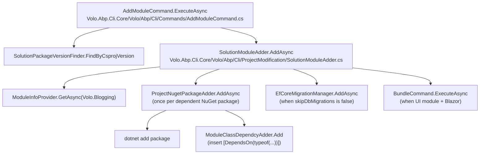

# Source code, modules, packages, and templates

This page covers the cluster of ABP Framework CLI commands that talk to the ABP module catalogue and source-code mirror: `abp get-source` (download a module's full source), `abp list-modules` (enumerate the open-source modules), `abp list-templates` (enumerate solution templates), `abp add-module` (add a multi-package module to an existing solution), `abp add-package` (add a single NuGet or NPM package), and `abp remove-proxy` (delete previously generated client proxies). All of these commands live in `framework/src/Volo.Abp.Cli.Core/Volo/Abp/Cli/Commands/` and reuse `SourceCodeDownloadService`, `ModuleProjectBuilder`, `NugetPackageProjectBuilder`, `ModuleInfoProvider`, and `SolutionModuleAdder` from the `ProjectBuilding` and `ProjectModification` folders.

The common thread between them is the `ISourceCodeStore` abstraction in `framework/src/Volo.Abp.Cli.Core/Volo/Abp/Cli/ProjectBuilding/ISourceCodeStore.cs`. Every command that needs to materialise a zip file from `nuget.abp.io` or `account.abp.io` calls `SourceCodeStore.GetAsync(name, type, version, templateSource, includePreReleases, skipCache, trustUserVersion)`, where `type` is one of `SourceCodeTypes.Template`, `SourceCodeTypes.Module`, `SourceCodeTypes.NugetPackage`, or `SourceCodeTypes.NpmPackage` (see `framework/src/Volo.Abp.Cli.Core/Volo/Abp/Cli/ProjectBuilding/SourceCodeTypes.cs`). The default implementation `AbpIoSourceCodeStore` is registered in `framework/src/Volo.Abp.Cli.Core/Volo/Abp/Cli/ProjectBuilding/AbpIoSourceCodeStore.cs`.

## `abp get-source` — download module source

`framework/src/Volo.Abp.Cli.Core/Volo/Abp/Cli/Commands/GetSourceCommand.cs` is responsible for materialising the entire source tree of a single ABP module — for example `abp get-source Volo.Blogging` produces `./Volo.Blogging/` populated with every project the module ships. The command accepts a `<module-name>` target plus `-o|--output-folder`, `-v|--version`, `--preview`, `--abp-path`, and `--volo-path` options. It does not parse the module name itself; instead it delegates to `SourceCodeDownloadService`:

```csharp
// framework/src/Volo.Abp.Cli.Core/Volo/Abp/Cli/Commands/GetSourceCommand.cs
public async Task ExecuteAsync(CommandLineArgs commandLineArgs)
{
    if (commandLineArgs.Target == null)
    {
        throw new CliUsageException("Module name is missing!" + ... + GetUsageInfo());
    }

    var version = commandLineArgs.Options.GetOrNull(Options.Version.Short, Options.Version.Long);
    var outputFolder = GetOutPutFolder(commandLineArgs);

    var gitHubAbpLocalRepositoryPath = commandLineArgs.Options.GetOrNull(
        Options.GitHubAbpLocalRepositoryPath.Long);
    var gitHubVoloLocalRepositoryPath = commandLineArgs.Options.GetOrNull(
        Options.GitHubVoloLocalRepositoryPath.Long);

    commandLineArgs.Options.Add(CliConsts.Command, commandLineArgs.Command);

    await _sourceCodeDownloadService.DownloadModuleAsync(
        commandLineArgs.Target, outputFolder, version,
        gitHubAbpLocalRepositoryPath, gitHubVoloLocalRepositoryPath,
        commandLineArgs.Options);
}
```

`SourceCodeDownloadService` (in `framework/src/Volo.Abp.Cli.Core/Volo/Abp/Cli/Commands/Services/SourceCodeDownloadService.cs`) is a thin orchestrator that builds a `ProjectBuildArgs` and feeds it to `ModuleProjectBuilder`. `ProjectBuildArgs` is the canonical input DTO for every builder; its declaration in `framework/src/Volo.Abp.Cli.Core/Volo/Abp/Cli/ProjectBuilding/ProjectBuildArgs.cs` carries the solution name, version, output folder, database/UI choices, GitHub local repository paths (for monorepo development), and an `ExtraProperties` bag that flows through every pipeline step.

```csharp
// framework/src/Volo.Abp.Cli.Core/Volo/Abp/Cli/Commands/Services/SourceCodeDownloadService.cs
public async Task DownloadModuleAsync(string moduleName, string outputFolder, string version,
    string gitHubAbpLocalRepositoryPath, string gitHubVoloLocalRepositoryPath,
    AbpCommandLineOptions options)
{
    Logger.LogInformation($"Downloading source code of {moduleName} ({(version != null ? "v" + version : "Latest")})");

    var result = await ModuleProjectBuilder.BuildAsync(
        new ProjectBuildArgs(
            SolutionName.Parse(moduleName), moduleName, version, outputFolder,
            DatabaseProvider.NotSpecified, DatabaseManagementSystem.NotSpecified,
            UiFramework.NotSpecified, null, false,
            gitHubAbpLocalRepositoryPath, gitHubVoloLocalRepositoryPath,
            null, options));

    using (var templateFileStream = new MemoryStream(result.ZipContent))
    using (var zipInputStream = new ZipInputStream(templateFileStream))
    {
        // Extract every entry to outputFolder
    }
}
```

The zip is produced in memory by the `Volo.Abp.Cli.ProjectBuilding.Building.Steps.CreateProjectResultZipStep` pipeline step, then `SourceCodeDownloadService` extracts it with SharpZipLib into the user's output folder. There is no temporary zip on disk — the bytes flow straight from `ModuleProjectBuilder` through the extractor.

<Info>
`SourceCodeDownloadService` exposes three other methods used by package commands: `DownloadNugetPackageAsync`, `DownloadNpmPackageAsync`, and `DownloadAsync`. Each builds the right `ProjectBuildArgs` and dispatches to either `NugetPackageProjectBuilder` or `NpmPackageProjectBuilder` — see [`cli/project-building`](/cli/project-building) for the builder pipeline.
</Info>

## `abp list-modules` — enumerate the catalogue

`framework/src/Volo.Abp.Cli.Core/Volo/Abp/Cli/Commands/ListModulesCommand.cs` prints the catalogue of multi-package ABP modules. It delegates to `ModuleInfoProvider.GetModuleListAsync` (in `framework/src/Volo.Abp.Cli.Core/Volo/Abp/Cli/ProjectBuilding/ModuleInfoProvider.cs`), which fetches the list from `https://abp.io/api/download/modules/` and returns a `List<ModuleInfo>`. The command then partitions on `module.IsPro` and prints two sections — open-source first, commercial after when `--include-pro-modules` is supplied.

```csharp
// framework/src/Volo.Abp.Cli.Core/Volo/Abp/Cli/Commands/ListModulesCommand.cs
var modules = await ModuleInfoProvider.GetModuleListAsync();
var freeModules = modules.Where(m => !m.IsPro).ToList();
var proModules = modules.Where(m => m.IsPro).ToList();

foreach (var module in freeModules)
{
    output.AppendLine($"> {module.DisplayName.PadRight(50)} ({module.Name})");
}

if (commandLineArgs.Options.ContainsKey("include-pro-modules"))
{
    foreach (var module in proModules)
    {
        output.AppendLine($"> {module.DisplayName.PadRight(50)} ({module.Name})");
    }
}
```

The telemetry wrapper `_telemetryService.TrackActivityAsync(ActivityNameConsts.AbpCliCommandsListModules)` (from `Volo.Abp.Internal.Telemetry.Constants`) is `await using`-disposed so the command's elapsed time is recorded even when the HTTP fetch throws. This is the same pattern every project-building command uses; see the `_telemetryService` invocations in `ListTemplatesCommand` and `AddModuleCommand` for additional callers.

## `abp list-templates` — enumerate solution templates

`framework/src/Volo.Abp.Cli.Core/Volo/Abp/Cli/Commands/ListTemplatesCommand.cs` is the read-only sibling of `abp new`. It calls `GET https://abp.io/api/download/templates/` directly through `CliHttpClientFactory.CreateClient()` and deserialises the JSON into `List<TemplateInfo>` (the `Volo.Abp.Cli.Commands.Templates.TemplateInfo` DTO, not the `Building/TemplateInfo` class):

```csharp
// framework/src/Volo.Abp.Cli.Core/Volo/Abp/Cli/Commands/ListTemplatesCommand.cs
private async Task<List<TemplateInfo>> GetTemplatesAsync()
{
    var client = _cliHttpClientFactory.CreateClient();
    using (var responseMessage = await client.GetAsync(
        $"{CliUrls.WwwAbpIo}api/download/templates/",
        _cancellationTokenProvider.Token))
    {
        await _remoteServiceExceptionHandler.EnsureSuccessfulHttpResponseAsync(responseMessage);
        var result = await responseMessage.Content.ReadAsStringAsync();
        return _jsonSerializer.Deserialize<List<TemplateInfo>>(result);
    }
}
```

The display routine is purely cosmetic: each row is `{Name}{DisplayName}{DocumentUrl}` padded to 26 and 32 columns. The list is a flat enumeration of the same templates that `TemplateInfoProvider.Get(string)` switches on — `app`, `app-nolayers`, `console`, `wpf`, `maui`, `module`, plus the `*-pro` siblings.

## `abp add-module` — install a multi-package module

`framework/src/Volo.Abp.Cli.Core/Volo/Abp/Cli/Commands/AddModuleCommand.cs` is the most elaborate command in the cluster. Its target is the module name (e.g. `Volo.Blogging` or `ProductManagement`), its switches govern how the module is added to the solution, and it ultimately defers to `SolutionModuleAdder` from `framework/src/Volo.Abp.Cli.Core/Volo/Abp/Cli/ProjectModification/SolutionModuleAdder.cs`.

The header of `ExecuteAsync` performs five passes of validation:

<Steps>
  <Step title="Target is required">
    `commandLineArgs.Target == null` throws `CliUsageException("Module name is missing!" ...)`. The usage block is verbose and shows seven worked examples.
  </Step>
  <Step title="Module is on the deny list">
    `AbpCliOptions.DisabledModulesToAddToSolution.Contains(commandLineArgs.Target)` raises `"<X> Module is not available for this command!"`. The deny list is populated in `AbpCliCoreModule`, primarily for modules whose installation requires extra manual steps the CLI cannot automate.
  </Step>
  <Step title="Telemetry binds early">
    `_telemetryService.TrackActivityAsync(...)` is awaited before any HTTP call so the activity scope wraps both the download and the migration phases.
  </Step>
  <Step title="Resolve a version">
    `SolutionPackageVersionFinder.FindByCsprojVersion(solutionFile)` and, when LeptonX is requested, `FindByDllVersion(solutionFile, "Volo.Abp.*LeptonX*")` pick the matching version from the existing solution so the module is downloaded at the same major/minor as the host project.
  </Step>
  <Step title="Delegate to SolutionModuleAdder">
    `SolutionModuleAdder.AddAsync(solutionFile, target, version, skipDbMigrations, withSourceCode, addSourceCodeToSolutionFile, newTemplate, newProTemplate, skipOpeningDocumentation)` does the actual work — see [`cli/project-modification`](/cli/project-modification) for the modifier pipeline.
  </Step>
</Steps>

The `--new` switch triggers a different code path. Instead of downloading an existing module, `SolutionModuleAdder` scaffolds a fresh module from the `module` or `module-pro` template (both declared in `framework/src/Volo.Abp.Cli.Core/Volo/Abp/Cli/ProjectBuilding/Templates/Module/`), wires it into the host solution, and immediately marks the run as `ActivityNameConsts.AbpCliCommandsInstallLocalModule` instead of `AbpCliCommandsInstallModule` so the telemetry dashboard can distinguish a vendored module from a NuGet-installed one. `--with-source-code` is implied by `--new` and by `--template module-pro`.

`AddModuleCommand` keeps the result of the install in `LastAddedModuleInfo` so a hosting tool (such as ABP Studio) that consumes the command programmatically can read the resolved display name, documentation links, and installation-complete message after the await returns. The DTO is `AddModuleInfoOutput` declared in `framework/src/Volo.Abp.Cli.Core/Volo/Abp/Cli/ProjectModification/AddModuleInfoOutput.cs`.

```csharp
// framework/src/Volo.Abp.Cli.Core/Volo/Abp/Cli/ProjectModification/AddModuleInfoOutput.cs
public class AddModuleInfoOutput
{
    public string Name { get; set; }
    public string DisplayName { get; set; }
    public string DocumentationLinks { get; set; }
    public string InstallationCompleteMessage { get; set; }
}
```

## `abp add-package` — install a single NuGet or NPM package

`framework/src/Volo.Abp.Cli.Core/Volo/Abp/Cli/Commands/AddPackageCommand.cs` covers the case where the user wants a single library, not an entire ABP module. The dispatch rule is simple: a target that starts with `@` is treated as an NPM package, anything else as a NuGet package:

```csharp
// framework/src/Volo.Abp.Cli.Core/Volo/Abp/Cli/Commands/AddPackageCommand.cs
var isNpmPackage = false;
var isNugetPackage = true;

if (commandLineArgs.Target.StartsWith("@"))
{
    isNpmPackage = true;
    isNugetPackage = false;
}

if (isNugetPackage)
{
    await ProjectNugetPackageAdder.AddAsync(
        GetSolutionFile(commandLineArgs),
        GetProjectFile(commandLineArgs),
        commandLineArgs.Target, version, true, withSourceCode,
        addSourceCodeToSolutionFile);
}
else if (isNpmPackage)
{
    await ProjectNpmPackageAdder.AddNpmPackageAsync(
        GetAngularDirectory(commandLineArgs),
        commandLineArgs.Target, version, withSourceCode);
}
```

`ProjectNugetPackageAdder` (`framework/src/Volo.Abp.Cli.Core/Volo/Abp/Cli/ProjectModification/ProjectNugetPackageAdder.cs`) is responsible for resolving the package version, calling `dotnet add package`, walking the module class to insert the `[DependsOn(typeof(...))]` attribute, and optionally re-running `abp bundle` when the package is a Blazor UI module. `ProjectNpmPackageAdder` (`framework/src/Volo.Abp.Cli.Core/Volo/Abp/Cli/ProjectModification/ProjectNpmPackageAdder.cs`) does the same for `package.json` plus invokes `abp install-libs` to copy the static assets into `wwwroot/libs/`. Both flows are documented in detail in [`cli/project-modification`](/cli/project-modification).

`AddPackageCommand` also fires two telemetry activities — `AbpCliCommandsNewPackage` and `AbpCliCommandsAddPackage` — back-to-back. That double-emission is intentional: the dashboard charts new package installations separately from re-additions, and `AddPackageCommand` cannot tell which it is from inside the CLI process.

<CardGroup cols={2}>
  <Card title="GetProjectFile" icon="file-code">
    Walks `-p|--project`, falls back to the first `*.csproj` in `Directory.GetCurrentDirectory()`. Implementation in `AddPackageCommand.GetProjectFile`.
  </Card>
  <Card title="GetSolutionFile" icon="folder-tree">
    Walks `-s|--solution`, falls back to the first `*.sln` or `*.slnx` in the current directory. Same precedence used by `AddModuleCommand`.
  </Card>
  <Card title="GetAngularDirectory" icon="angular">
    Walks `-ad|--angular-directory`. Reused by `ProjectNpmPackageAdder` to locate the `package.json` it should edit.
  </Card>
  <Card title="useDotnetCliToInstall" icon="terminal">
    `AddPackageCommand` hard-codes the `useDotnetCliToInstall: true` argument to `ProjectNugetPackageAdder.AddAsync`. The adder shells out to `dotnet add package` instead of mutating the csproj XML manually.
  </Card>
</CardGroup>

## `abp remove-proxy` — clean up generated proxies

`framework/src/Volo.Abp.Cli.Core/Volo/Abp/Cli/Commands/RemoveProxyCommand.cs` derives from `ProxyCommandBase<RemoveProxyCommand>` and therefore shares all of its argument parsing with `abp generate-proxy`. The base class is in `framework/src/Volo.Abp.Cli.Core/Volo/Abp/Cli/Commands/ProxyCommandBase.cs` and dispatches to the right `IServiceProxyGenerator` based on the `-t|--type` switch (`ng`, `js`, `csharp`). Both commands route into the generator described in [`cli/service-proxying`](/cli/service-proxying); the generators themselves decide whether to write files or delete them by branching on `args.CommandName == RemoveProxyCommand.Name`.

```csharp
// framework/src/Volo.Abp.Cli.Core/Volo/Abp/Cli/Commands/RemoveProxyCommand.cs
public class RemoveProxyCommand : ProxyCommandBase<RemoveProxyCommand>
{
    public const string Name = "remove-proxy";
    protected override string CommandName => Name;

    public override string GetUsageInfo()
    {
        var sb = new StringBuilder(base.GetUsageInfo());
        sb.AppendLine("Examples:");
        sb.AppendLine("  abp remove-proxy -t ng");
        sb.AppendLine("  abp remove-proxy -t js -m identity -o Pages/Identity/client-proxies.js");
        sb.AppendLine("  abp remove-proxy -t csharp --folder MyProxies/InnerFolder");
        return sb.ToString();
    }
}
```

`CommandName` is overridden so the generators that branch on the constant pick the delete branch. For example `JavaScriptServiceProxyGenerator.GenerateProxyAsync` checks `args.CommandName == RemoveProxyCommand.Name` and, if so, calls `RemoveProxy(args, output)` which simply `File.Delete`s the proxy file at `wwwroot/client-proxies/<module>-proxy.js`. The C# generator and the Angular generator have parallel branches.

## `ModuleInfo` and `NugetPackageInfo`

The `ProjectBuilding/` folder declares three info-provider abstractions: `IModuleInfoProvider`, `INugetPackageInfoProvider`, and `INpmPackageInfoProvider`. Each has a single concrete implementation that calls `nuget.abp.io` (or `abp.io` for the catalogue endpoints) and is registered in `AbpCliCoreModule`. The `ModuleInfo` DTO captures everything the install pipeline needs about a module — display name, dependent packages, default UI, documentation links, and `IsPro` flag.

```csharp
// framework/src/Volo.Abp.Cli.Core/Volo/Abp/Cli/ProjectBuilding/ModuleInfoProvider.cs (abridged)
public async Task<List<ModuleInfo>> GetModuleListAsync()
{
    var client = _cliHttpClientFactory.CreateClient();
    var response = await client.GetAsync($"{CliUrls.WwwAbpIo}api/download/modules/");
    await _remoteServiceExceptionHandler.EnsureSuccessfulHttpResponseAsync(response);
    var json = await response.Content.ReadAsStringAsync();
    return _jsonSerializer.Deserialize<List<ModuleInfo>>(json);
}
```

`ListModulesCommand` consumes `GetModuleListAsync`. `AddModuleCommand` consumes `GetAsync(name)` to look up the single record it cares about, which is then handed to `SolutionModuleAdder.AddAsync`. Both endpoints are anonymous — they do not require `AddAbpAuthenticationToken` — because the catalogue is public information; the gating happens later when the actual package download requires an authenticated NuGet feed token.

## Local cache and `--skip-cache`

`AbpIoSourceCodeStore.GetAsync` writes every successful download to `CliPaths.TemplateCache` (`~/.abp/templates/`). The naming convention is `<type>-<name>-<version>.zip`, so a re-run of `abp get-source Volo.Blogging -v 8.3.0` finds the cached file and skips the HTTP call. The `--skip-cache` switch (or `ProjectBuildArgs.SkipCache = true`) bypasses the lookup and forces a fresh fetch — useful when a corrupted download is masking the original error.

```csharp
// framework/src/Volo.Abp.Cli.Core/Volo/Abp/Cli/ProjectBuilding/AbpIoSourceCodeStore.cs (excerpt)
DirectoryHelper.CreateIfNotExists(CliPaths.TemplateCache);
var userSpecifiedVersion = version != null;
var latestVersion = version ?? await GetLatestSourceCodeVersionAsync(name, type, null, includePreReleases);
```

`abp clear-download-cache` (declared in `framework/src/Volo.Abp.Cli.Core/Volo/Abp/Cli/Commands/ClearDownloadCacheCommand.cs`) removes the entire `~/.abp/templates/` directory. That sibling command is documented in [`cli/internals-and-args`](/cli/command-selector).

## Flow diagram — `abp add-module Volo.Blogging`



The flow above is concrete to `add-module`; `add-package` skips `Info`, `EfCoreMigrationManager`, and `Bundle`, jumping straight from `AddPackageCommand` to `ProjectNugetPackageAdder.AddAsync`.

## `--abp-path` and `--volo-path` for monorepo development

`abp get-source` and `abp add-module` both accept `--abp-path <path>` and `--volo-path <path>`. When supplied, `AbpIoSourceCodeStore` skips the HTTP call entirely and copies the zip content out of a local checkout of `github.com/abpframework/abp` (the open-source repo) or `github.com/volosoft/volo` (the commercial mono-repo). The plumbing lives in `framework/src/Volo.Abp.Cli.Core/Volo/Abp/Cli/GitHub/GithubRelease.cs` and the parameter flows through `ProjectBuildArgs.AbpGitHubLocalRepositoryPath` / `VoloGitHubLocalRepositoryPath`.

That hook is what lets ABP core maintainers test a module against an unreleased framework change without publishing a NuGet preview first. It is also why `GetSourceCommand` immediately logs both paths when they are non-null — a Pro module that fails to install with the local override almost always has a stale checkout, and the log line tells you which one.

## `ClearDownloadCacheCommand` — sibling of `get-source`

`framework/src/Volo.Abp.Cli.Core/Volo/Abp/Cli/Commands/ClearDownloadCacheCommand.cs` is the escape hatch when the local cache (`~/.abp/templates/`) ends up with a corrupted zip or with a stale pre-release that keeps overriding the stable resolution. The command removes the entire `CliPaths.TemplateCache` directory and exits — there is no flag to clear a single template because the directory contents are name-stamped per version, so a partial cleanup would still leave the bad entry in place. The next invocation of `abp new` or `abp get-source` re-downloads the requested template afresh.

## Pro vs open-source modules

`ModuleInfoProvider.GetModuleListAsync` returns both open-source (`IsPro == false`) and commercial (`IsPro == true`) modules; `ListModulesCommand` only prints the latter when the user passes `--include-pro-modules`. Downloading the source of a Pro module requires three things to align: a logged-in user (see [`cli/login-and-auth`](/cli/login-and-auth)), an active license (`AbpIoApiKeyService.GetApiKeyOrNullAsync` must return `HasActiveLicense == true`), and the `LoginInfo.HasSourceCodeAccess` flag from `LoginInfo` set to `true`. The flag is what distinguishes a regular Pro subscription from one whose tier permits source downloads — `ModuleProjectBuilder.BuildAsync` reads it indirectly via the `api-key` extra property and fails the build at the `SourceCodeStore.GetAsync` call when the token cannot resolve the package on `nuget.abp.io`.

## Related pages

- [`cli/project-building`](/cli/project-building) — the `ProjectBuilding/` pipeline that turns the downloaded zip into a renamed solution.
- [`cli/project-modification`](/cli/project-modification) — `SolutionModuleAdder`, `ProjectNugetPackageAdder`, `ProjectNpmPackageAdder`, and the `*Adder` helpers that mutate an existing solution.
- [`cli/service-proxying`](/cli/service-proxying) — what `RemoveProxyCommand` deletes when `-t ng`, `-t js`, or `-t csharp` is supplied.
- [`cli/login-and-auth`](/cli/login-and-auth) — how `LoginInfo.HasSourceCodeAccess` gates Pro module downloads inside `ModuleProjectBuilder.BuildAsync`.
