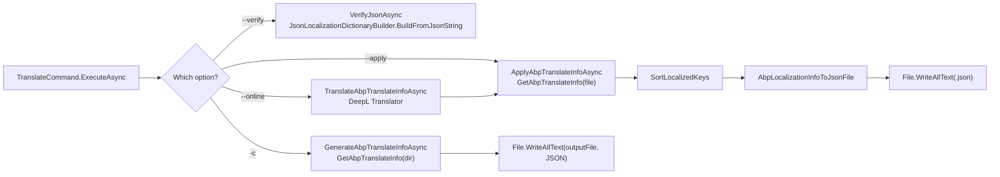

# `abp translate` — culture JSON workflow

ABP Framework solutions use one JSON file per culture (`en.json`, `tr.json`, `zh-Hans.json`, etc.) under each `Localization/...` resource folder. Keeping those files in sync across dozens of modules is tedious work, so the CLI ships `abp translate`, implemented in `framework/src/Volo.Abp.Cli.Core/Volo/Abp/Cli/Commands/TranslateCommand.cs`. The command runs in three modes: **generate** a gap file showing every key missing in the target culture, **apply** an already-translated gap file back onto the culture JSON files, and **verify** that every culture JSON in the tree parses correctly.

The single class `TranslateCommand` contains the full implementation — no helper service, no provider abstraction. Its dependencies are `JsonConvert`, `JObject` (Newtonsoft, because ordered properties matter), `DeepL.Translator` for the online mode, and `JsonLocalizationDictionaryBuilder` from `Volo.Abp.Localization.Json` for the verify mode. The command targets `Directory.GetCurrentDirectory()` and never prompts for paths — you are expected to `cd` into the solution root before invoking it.

<Note>
`abp translate` understands the standard ABP localization JSON shape: a top-level `culture` (or `Culture`) property and a `texts` (or `Texts`) object whose keys are localization keys and whose values are the translated strings. Files that do not match that shape are silently skipped — `GetAbpLocalizationInfoOrNull` returns `null` and the loop moves on.
</Note>

## The four execution modes

`TranslateCommand.ExecuteAsync` decides between four flows based on which option flags are present. The dispatch is linear: verify wins over apply, apply wins over online, online wins over generate.

```csharp
// framework/src/Volo.Abp.Cli.Core/Volo/Abp/Cli/Commands/TranslateCommand.cs
public async Task ExecuteAsync(CommandLineArgs commandLineArgs)
{
    var currentDirectory = Directory.GetCurrentDirectory();

    if (commandLineArgs.Options.ContainsKey(Options.Verify.Long))
    {
        await VerifyJsonAsync(currentDirectory);
        return;
    }

    var referenceCulture = commandLineArgs.Options.GetOrNull(
        Options.ReferenceCulture.Short, Options.ReferenceCulture.Long) ?? "en";
    var allValues = commandLineArgs.Options.ContainsKey(Options.AllValues.Short)
                 || commandLineArgs.Options.ContainsKey(Options.AllValues.Long);

    if (commandLineArgs.Options.ContainsKey(Options.Apply.Short)
     || commandLineArgs.Options.ContainsKey(Options.Apply.Long))
    {
        var inputFile = Path.Combine(currentDirectory,
            commandLineArgs.Options.GetOrNull(Options.File.Short, Options.File.Long)
            ?? "abp-translation.json");
        await ApplyAbpTranslateInfoAsync(currentDirectory, inputFile);
        return;
    }

    var targetCulture = commandLineArgs.Options.GetOrNull(Options.Culture.Short, Options.Culture.Long);
    if (targetCulture == null) { throw new CliUsageException("Target culture is missing!" + ...); }

    if (commandLineArgs.Options.ContainsKey(Options.Online.Long))
    {
        var authKey = commandLineArgs.Options.GetOrNull(Options.DeepLAuthKey.Short, Options.DeepLAuthKey.Short);
        if (authKey == null) { throw new CliUsageException("DeepL auth key is missing!" + ...); }
        await TranslateAbpTranslateInfoAsync(currentDirectory, targetCulture, referenceCulture, allValues, authKey);
        return;
    }

    var outputFile = Path.Combine(currentDirectory,
        commandLineArgs.Options.GetOrNull(Options.Output.Short, Options.Output.Long)
        ?? "abp-translation.json");
    await GenerateAbpTranslateInfoAsync(currentDirectory, targetCulture, referenceCulture, allValues, outputFile);
}
```

<CardGroup cols={2}>
  <Card title="Generate" icon="file-export">
    `abp translate -c zh-Hans` — produces `abp-translation.json` listing every key from `en.json` whose corresponding entry in `zh-Hans.json` is missing or empty.
  </Card>
  <Card title="Apply" icon="file-import">
    `abp translate --apply` — reads `abp-translation.json` produced earlier (or supplied via `-f`) and writes the translated values back into the matching `zh-Hans.json` files.
  </Card>
  <Card title="Online" icon="cloud-arrow-up">
    `abp translate -c zh-Hans --online --deepl-auth-key <key>` — generates and immediately runs every reference text through DeepL, then writes the result back to the per-resource JSON files.
  </Card>
  <Card title="Verify" icon="circle-check">
    `abp translate --verify` — recursively parses every culture JSON in the tree to ensure they are valid for `JsonLocalizationDictionaryBuilder.BuildFromJsonString`. Useful as a CI guard.
  </Card>
</CardGroup>

## File discovery — `GetCultureJsonFiles`

Every mode begins by walking the directory tree to find candidate culture JSON files. `GetCultureJsonFiles` excludes `node_modules`, `wwwroot`, `.git`, `bin`, and `obj`, then filters by file name against the full set of `CultureInfo.GetCultures(CultureTypes.AllCultures)`:

```csharp
// framework/src/Volo.Abp.Cli.Core/Volo/Abp/Cli/Commands/TranslateCommand.cs
private static IEnumerable<string> GetCultureJsonFiles(string path, string cultureName = null)
{
    var excludeDirectory = new List<string>() { "node_modules", "wwwroot", ".git", "bin", "obj" };

    var allCultureNames = CultureInfo.GetCultures(CultureTypes.AllCultures)
        .Where(x => !x.Name.IsNullOrWhiteSpace())
        .Select(x => x.Name).ToList();

    return Directory.GetFiles(path, "*.json", SearchOption.AllDirectories)
        .Where(file => excludeDirectory.All(x =>
            file.IndexOf(x, StringComparison.OrdinalIgnoreCase) == -1))
        .Where(file => allCultureNames.Any(x =>
            Path.GetFileName(file).Equals($"{x}.json", StringComparison.OrdinalIgnoreCase)))
        .WhereIf(!cultureName.IsNullOrWhiteSpace(),
            jsonFile => Path.GetFileName(jsonFile).Equals($"{cultureName}.json", StringComparison.OrdinalIgnoreCase));
}
```

The check against `CultureInfo` is what prevents random `appsettings.json` files from being mistaken for culture JSON: only file names like `en.json`, `de-DE.json`, `zh-Hans.json` survive the filter. Passing `cultureName` narrows the result to a single culture per directory, which is what the generate flow uses to enumerate the reference culture (`en.json` by default).

<Warning>
Localization JSON files placed inside `bin/`, `obj/`, `wwwroot/`, or `node_modules/` will be skipped silently. If you store consolidated localization in a build artefact directory you will need to move it outside the deny list before running `abp translate`.
</Warning>

## Generate mode — building `abp-translation.json`

`GenerateAbpTranslateInfoAsync` is just three log lines and a write — the meat is in `GetAbpTranslateInfo`. For every reference culture file under the current directory, it loads the target culture file from the same folder, diffs the keys, and produces an `AbpTranslateInfo` document containing one `AbpTranslateResource` per directory. By default only the missing keys are included; passing `-all`/`--all-values` keeps every key so a translator can polish existing strings:

```csharp
// framework/src/Volo.Abp.Cli.Core/Volo/Abp/Cli/Commands/TranslateCommand.cs
private AbpTranslateInfo GetAbpTranslateInfo(string directory,
    string targetCultureName, string referenceCultureName, bool allValues)
{
    var translateInfo = new AbpTranslateInfo {
        ReferenceCulture = referenceCultureName,
        TargetCulture = targetCultureName,
        Resources = new List<AbpTranslateResource>()
    };

    var referenceCultureFiles = GetCultureJsonFiles(directory, referenceCultureName);
    foreach (var filePath in referenceCultureFiles)
    {
        var directoryName = Path.GetDirectoryName(filePath) ?? string.Empty;
        var referenceLocalizationInfo = GetAbpLocalizationInfoOrNull(filePath);
        if (referenceLocalizationInfo == null) continue;

        var resource = new AbpTranslateResource {
            ResourcePath = directoryName,
            Texts = new List<AbpTranslateResourceText>()
        };

        foreach (var text in referenceLocalizationInfo.Texts)
        {
            resource.Texts.Add(new AbpTranslateResourceText {
                LocalizationKey = text.Name,
                Reference = text.Value,
                Target = string.Empty
            });
        }

        var targetFile = Path.Combine(directoryName, $"{targetCultureName}.json");
        if (File.Exists(targetFile))
        {
            var targetLocalizationInfo = GetAbpLocalizationInfoOrNull(targetFile);
            foreach (var referenceResourceText in resource.Texts)
            {
                var text = targetLocalizationInfo.Texts
                    .FirstOrDefault(x => x.Name == referenceResourceText.LocalizationKey);
                referenceResourceText.Target = text?.Value ?? string.Empty;
            }
        }

        if (!allValues)
        {
            resource.Texts.RemoveAll(x => !x.Target.Equals(string.Empty));
        }

        if (resource.Texts.Any()) translateInfo.Resources.Add(resource);
    }

    return translateInfo;
}
```

The resulting `abp-translation.json` has the shape declared by the four nested DTOs at the bottom of `TranslateCommand.cs`:

```json
{
  "ReferenceCulture": "en",
  "TargetCulture": "zh-Hans",
  "Resources": [
    {
      "ResourcePath": "/path/to/MyModule/Localization/MyResource",
      "Texts": [
        { "LocalizationKey": "Welcome", "Reference": "Welcome", "Target": "" },
        { "LocalizationKey": "Logout",  "Reference": "Logout",  "Target": "" }
      ]
    }
  ]
}
```

`ResourcePath` is an absolute filesystem path. The apply mode relies on that path to round-trip the file back to disk without any ambiguity about which `zh-Hans.json` the entries belong to. The full DTOs are `AbpTranslateInfo`, `AbpTranslateResource`, and `AbpTranslateResourceText`, all declared as nested classes at the bottom of `framework/src/Volo.Abp.Cli.Core/Volo/Abp/Cli/Commands/TranslateCommand.cs`.

## Apply mode — writing translations back

`ApplyAbpTranslateInfoAsync` reads `abp-translation.json` (or the file supplied via `-f`), then walks every resource and writes the translations back into the per-culture JSON files. For each resource it loads the reference culture file (used for key ordering) and the existing target culture file (or builds an empty `AbpLocalizationInfo` when the target doesn't exist yet):

```csharp
// framework/src/Volo.Abp.Cli.Core/Volo/Abp/Cli/Commands/TranslateCommand.cs
foreach (var text in resource.Texts)
{
    var targetText = targetLocalizationInfo.Texts
        .FirstOrDefault(x => x.Name == text.LocalizationKey);
    if (targetText != null)
    {
        if (!text.Target.IsNullOrEmpty())
        {
            Logger.LogInformation($"Update translation: {targetText.Name} => " + text.Target);
            targetText.Value = text.Target;
        }
    }
    else
    {
        Logger.LogInformation($"Create translation: {text.LocalizationKey} => " + text.Target);
        targetLocalizationInfo.Texts.Add(new NameValue(text.LocalizationKey, text.Target));
    }
}

targetLocalizationInfo = SortLocalizedKeys(targetLocalizationInfo, referenceLocalizationInfo);
File.WriteAllText(targetFile, AbpLocalizationInfoToJsonFile(targetLocalizationInfo));
```

`SortLocalizedKeys` rebuilds the target dictionary in the same order as the reference, so the resulting JSON files diff cleanly against the canonical `en.json`. `AbpLocalizationInfoToJsonFile` reconstructs the JSON via `JObject` (so keys preserve insertion order) and stores the culture name as a top-level `culture` property. Both helpers live in the same file.

<Steps>
  <Step title="Locate reference and target files">
    For each `AbpTranslateResource`, build absolute paths to `<ResourcePath>/<ReferenceCulture>.json` and `<ResourcePath>/<TargetCulture>.json`. Missing reference files raise a `CliUsageException`; missing target files are created from scratch.
  </Step>
  <Step title="Merge translations">
    For every entry whose `Target` is non-empty, update the existing key or insert a new one. Empty targets are ignored so partial translation files are safe to apply.
  </Step>
  <Step title="Reorder by reference">
    `SortLocalizedKeys` builds a fresh dictionary whose key order matches the reference culture. Any keys present in the target but absent from the reference are dropped at this step, which keeps deprecated keys from lingering.
  </Step>
  <Step title="Serialize via JObject">
    `AbpLocalizationInfoToJsonFile` emits `{ "culture": "<TargetCulture>", "texts": { ... } }`. JObject preserves insertion order, so the on-disk file is deterministic and diff-friendly.
  </Step>
</Steps>

## Online mode — DeepL integration

`TranslateAbpTranslateInfoAsync` is generate + auto-translate + apply in a single call. It builds the same `AbpTranslateInfo`, then for each resource it constructs a `DeepL.Translator` with the supplied auth key and submits the reference texts as a single batch:

```csharp
// framework/src/Volo.Abp.Cli.Core/Volo/Abp/Cli/Commands/TranslateCommand.cs
var translator = new Translator(authKey);
var texts = resource.Texts.Select(x => x.Reference);
var translations = await translator.TranslateTextAsync(texts,
    await GetDeeplLanguageCode(referenceCulture),
    await GetDeeplLanguageCode(targetCulture));
for (var i = 0; i < translations.Length; i++)
{
    resource.Texts[i].Target = translations[i].Text;
}
```

`GetDeeplLanguageCode` maps from .NET culture codes to DeepL's `LanguageCode` constants. The supported list is hard-coded inside the method — Bulgarian, Czech, Danish, German, Greek, English (and its EN-GB/EN-US variants), Spanish, Estonian, Finnish, French, Hungarian, Indonesian, Italian, Japanese, Korean, Lithuanian, Latvian, Norwegian, Dutch, Polish, Portuguese (with the Brazilian and European variants), Romanian, Russian, Slovak, Slovenian, Swedish, Turkish, Ukrainian, and Chinese. The `zh-Hans` shortcut returns `LanguageCode.Chinese` directly. Any culture outside this list raises `CliUsageException("DeepL does not support <X> culture.")`.

<Info>
The DeepL package the CLI depends on is `DeepL.net`, declared as a project reference in `framework/src/Volo.Abp.Cli.Core/Volo.Abp.Cli.Core.csproj`. The `--deepl-auth-key` value is passed straight into `new Translator(authKey)` — the CLI never persists it, so you must supply the key on every invocation.
</Info>

## Verify mode — JSON sanity check

`VerifyJsonAsync` is the smallest of the four flows and the one most useful in CI. It enumerates every culture JSON file (no culture name filter so all `*.json` matching `CultureInfo` names are inspected) and feeds each into `JsonLocalizationDictionaryBuilder.BuildFromJsonString` from `Volo.Abp.Localization.Json`:

```csharp
// framework/src/Volo.Abp.Cli.Core/Volo/Abp/Cli/Commands/TranslateCommand.cs
private Task VerifyJsonAsync(string currentDirectory)
{
    var jsonFiles = GetCultureJsonFiles(currentDirectory);
    var hasInvalidJsonFile = false;
    foreach (var jsonFile in jsonFiles)
    {
        try
        {
            var jsonString = File.ReadAllText(jsonFile);
            _ = JsonLocalizationDictionaryBuilder.BuildFromJsonString(jsonString);
        }
        catch (Exception)
        {
            Logger.LogError($"Invalid json file: {jsonFile}");
            hasInvalidJsonFile = true;
        }
    }

    Logger.LogInformation(!hasInvalidJsonFile
        ? "All json files are valid."
        : "Some json files are invalid.");

    return Task.CompletedTask;
}
```

That gives you a fast, runtime-equivalent parse check — a JSON file that `BuildFromJsonString` rejects will also break at app startup. The command does not exit with a non-zero code on failures, only logs at `Error` level; CI scripts should grep the output or wrap the command in their own `grep -q "Some json files are invalid"` guard.

## DTOs and helpers in one file

Every helper and DTO lives inside `TranslateCommand.cs`. Keeping them as nested types simplifies the round-trip serialisation: the same `JsonConvert.DeserializeObject<AbpTranslateInfo>` reads the file in apply mode that `JsonConvert.SerializeObject(translateInfo, Formatting.Indented)` produced in generate mode.

```csharp
// framework/src/Volo.Abp.Cli.Core/Volo/Abp/Cli/Commands/TranslateCommand.cs
public class AbpTranslateInfo
{
    public string ReferenceCulture { get; set; }
    public string TargetCulture { get; set; }
    public List<AbpTranslateResource> Resources { get; set; }
}

public class AbpTranslateResource
{
    public string ResourcePath { get; set; }
    public List<AbpTranslateResourceText> Texts { get; set; }
}

public class AbpTranslateResourceText
{
    public string LocalizationKey { get; set; }
    public string Reference { get; set; }
    public string Target { get; set; }
}

public class AbpLocalizationInfo
{
    public string Culture { get; set; }
    public List<NameValue> Texts { get; set; }
}
```

`AbpLocalizationInfo` mirrors the on-disk shape, while the three `AbpTranslate*` classes describe the gap file the CLI produces and consumes. `NameValue` is the standard `Volo.Abp.NameValue` type, so existing tooling that reads `Texts` can use the same type without a custom converter.

## `GetAbpLocalizationInfoOrNull` — the abp JSON parser

The parser is more lenient than `JsonLocalizationDictionaryBuilder`: it accepts both `culture` and `Culture`, both `texts` and `Texts`. A file that throws on `JObject.Parse` is returned as `null` (so the loop continues), while a file that parses but lacks one of the two required properties is also returned as `null` — that's how the loop skips the random `package.json` files whose names happen to look like culture codes:

```csharp
// framework/src/Volo.Abp.Cli.Core/Volo/Abp/Cli/Commands/TranslateCommand.cs
var culture = jObject.GetValue("culture") ?? jObject.GetValue("Culture");
var texts   = jObject.GetValue("texts")   ?? jObject.GetValue("Texts");
if (culture == null || texts == null) return null;
```

`GetAbpTranslateInfo(string path)` (the overload that reads the gap file) is stricter — a `JsonConvert.DeserializeObject<AbpTranslateInfo>` failure is rethrown wrapped in a `CliUsageException` so the user sees both the underlying exception text and the full usage block.

## Flow summary



## Example session

The typical workflow is generate, hand off, apply:

```bash
# Generate the gap file for Chinese (Simplified)
cd /work/MySolution
abp translate -c zh-Hans

# ... translator fills in Target fields offline ...

# Apply the translated gap file
abp translate --apply -f abp-translation.json

# Confirm every culture JSON still parses
abp translate --verify
```

When DeepL is available, the three-step process collapses to one:

```bash
abp translate -c zh-Hans --online --deepl-auth-key $env:DEEPL_AUTH_KEY
```

`--all-values` is the switch you reach for when revising existing translations; without it, the gap file only contains keys whose target was empty, which means you cannot review or update strings that already have a value. The verify mode does not depend on a culture flag — it always scans every culture JSON it can find under the working directory.

## Where this command fits

`abp translate` is independent of the project-building pipeline: it does not download anything, does not call `account.abp.io`, and does not require a license. The dependency on `Volo.Abp.Localization.Json` means the verify mode is exactly what the runtime would do when loading the JSON dictionaries, so a green `--verify` run is a strong guarantee. For the runtime side of JSON localization see the [`localization`](/localization/localization-core) area; for the `abp` tool's argument and command catalogue see [`cli/internals-and-args`](/cli/command-selector).
